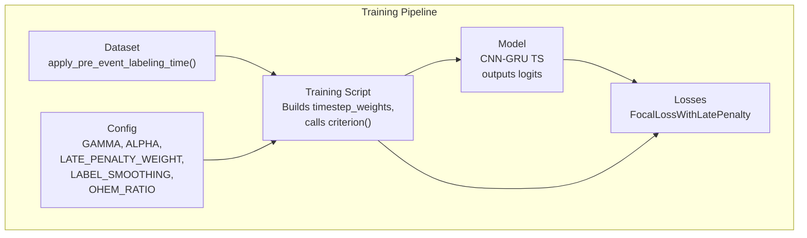
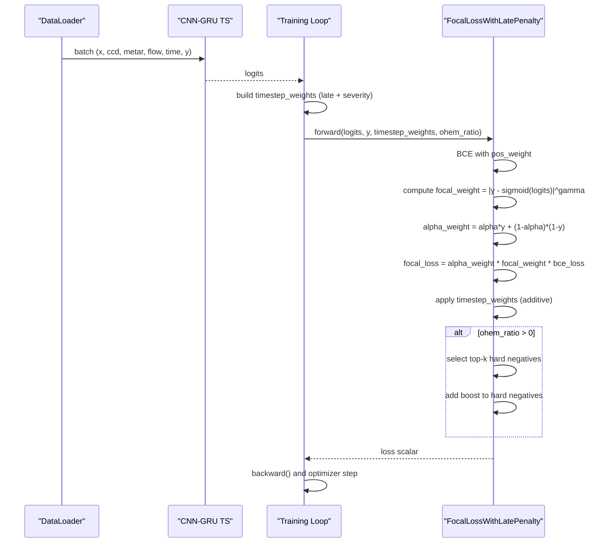
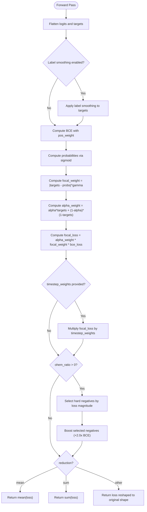
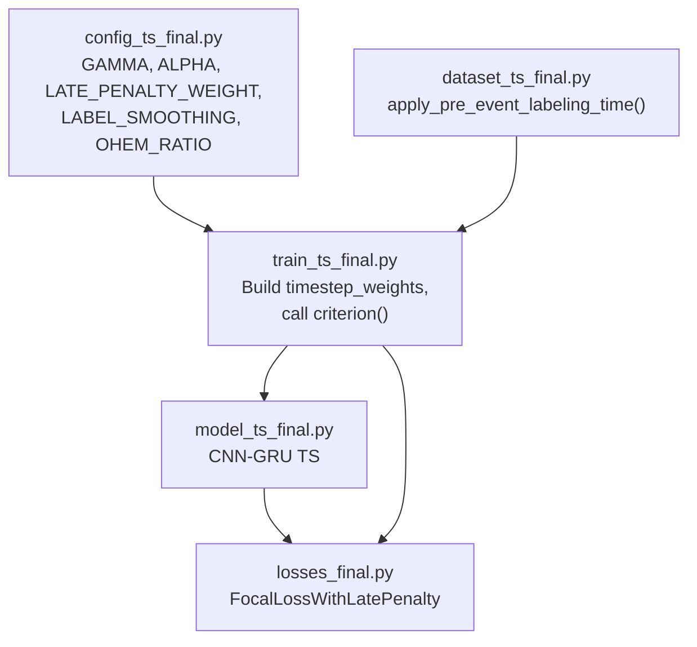

# Focal Loss with Late Penalty

<cite>
**Referenced Files in This Document**
- [losses_final.py](file://losses_final.py)
- [train_ts_final.py](file://train_ts_final.py)
- [config_ts_final.py](file://config_ts_final.py)
- [dataset_ts_final.py](file://dataset_ts_final.py)
- [model_ts_final.py](file://model_ts_final.py)
- [utils_metrics_final.py](file://utils_metrics_final.py)
</cite>

## Table of Contents
1. [Introduction](#introduction)
2. [Project Structure](#project-structure)
3. [Core Components](#core-components)
4. [Architecture Overview](#architecture-overview)
5. [Detailed Component Analysis](#detailed-component-analysis)
6. [Dependency Analysis](#dependency-analysis)
7. [Performance Considerations](#performance-considerations)
8. [Troubleshooting Guide](#troubleshooting-guide)
9. [Conclusion](#conclusion)

## Introduction
This document explains the Focal Loss with Late Penalty implementation used for thunderstorm prediction. It combines:
- Focal loss for hard example mining and class imbalance mitigation
- Late detection penalty to encourage timely predictions
- Label smoothing for soft label handling
- Optional Online Hard Negative Mining (OHEM) to reduce false alarms
- Additive weighting scheme that integrates severity and timeliness consistently

The implementation is part of a larger nowcasting pipeline designed for early warning performance in severe weather forecasting.

## Project Structure
The Focal Loss with Late Penalty lives in the loss module and is integrated into the training loop alongside other loss components. The dataset applies soft pre-event labeling, and the model produces logits consumed by the loss.

**Diagram sources**
- [train_ts_final.py:236-435](file://train_ts_final.py#L236-L435)
- [dataset_ts_final.py:26-36](file://dataset_ts_final.py#L26-L36)
- [losses_final.py:13-91](file://losses_final.py#L13-L91)
- [model_ts_final.py:202-268](file://model_ts_final.py#L202-L268)

**Section sources**
- [train_ts_final.py:236-435](file://train_ts_final.py#L236-L435)
- [dataset_ts_final.py:26-36](file://dataset_ts_final.py#L26-L36)
- [losses_final.py:13-91](file://losses_final.py#L13-L91)
- [model_ts_final.py:202-268](file://model_ts_final.py#L202-L268)

## Core Components
- FocalLossWithLatePenalty: Implements the core loss with gamma, alpha, late penalty, label smoothing, and optional OHEM.
- Training integration: Builds additive timestep weights (late penalty + severity) and passes them to the loss along with logits and targets.
- Dataset soft labeling: Applies ramp-up soft labels before training to improve early detection.

Key parameters:
- gamma: Focal focusing exponent for hard example mining
- alpha: Class balancing weight for positive/negative samples
- late_penalty_weight: Encourages early detections by increasing loss for late positives
- label_smoothing: Softens hard labels to prevent overconfidence
- OHEM ratio: Enables additive OHEM to focus on hard negatives

**Section sources**
- [losses_final.py:13-91](file://losses_final.py#L13-L91)
- [train_ts_final.py:417-435](file://train_ts_final.py#L417-L435)
- [dataset_ts_final.py:26-36](file://dataset_ts_final.py#L26-L36)

## Architecture Overview
The loss computation pipeline:

**Diagram sources**
- [train_ts_final.py:403-447](file://train_ts_final.py#L403-L447)
- [losses_final.py:24-91](file://losses_final.py#L24-L91)

## Detailed Component Analysis

### Mathematical Foundation
- Base: Binary cross-entropy with positive class weighting to address class imbalance.
- Focal modulation: Multiplies BCE by a focal weight that focuses on hard examples (large |y - p|). This is soft-label friendly because it uses |targets - probabilities|.
- Alpha balancing: Per-sample alpha weighting balances positive and negative contributions.
- Late penalty: Additive timestep weights increase loss for late positives and ramp-ups, encouraging early detection.
- Label smoothing: Softens hard labels to reduce overconfidence and stabilize training.
- OHEM: Selects the hardest negative samples and adds a boost to their loss contribution.

**Diagram sources**
- [losses_final.py:24-91](file://losses_final.py#L24-L91)

**Section sources**
- [losses_final.py:13-91](file://losses_final.py#L13-L91)

### Parameter Tuning Guidelines
- gamma (focal focusing): Start around 2.0. Higher values increase focus on hard examples; too high can overfit negatives.
- alpha (class balance): >0.5 to upweight positives; tune to match dataset imbalance.
- late_penalty_weight: Start around 1.5–2.0. Must be >1 to penalize lateness; too large risks under-triggering.
- label_smoothing: Start around 0.1. Reduces overconfidence; too high degrades discrimination.
- OHEM ratio: Start small (e.g., 0.05). Helps reduce false alarms without overfitting noise.
- pos_weight: Positive class weighting to counter imbalance; adjust with dataset prevalence.

These defaults are configured in the training configuration.

**Section sources**
- [config_ts_final.py:61-68](file://config_ts_final.py#L61-L68)
- [train_ts_final.py:285-307](file://train_ts_final.py#L285-L307)

### Gradient Behavior Analysis
- Focal loss reduces gradients for easy examples (low |y - p|), allowing the model to focus on hard cases.
- Late penalty increases gradients for late positives, pushing predictions earlier.
- Label smoothing introduces a regularization effect by discouraging overconfident predictions.
- OHEM increases gradients for hard negatives, reducing false alarms.
- Additive timestep weights preserve the full modulation by focal weights, keeping gradients consistent across samples.

Practical implications:
- Use moderate gamma to avoid excessive negative emphasis.
- Combine late penalty with severity weighting to avoid multiplicative stacking; additive combination stabilizes gradients.
- Monitor validation metrics to detect overfitting to hard negatives.

**Section sources**
- [losses_final.py:50-64](file://losses_final.py#L50-L64)
- [train_ts_final.py:417-435](file://train_ts_final.py#L417-L435)

### Practical Examples: Loss Landscape Modifications
- Class imbalance mitigation: Alpha and pos_weight reduce dominance of majority class; focal loss focuses on hard examples.
- Early warning: Late penalty increases loss for late positives; combined with ramp-ups, encourages early triggers.
- Robustness: Label smoothing prevents overconfidence; OHEM reduces false alarms by emphasizing hard negatives.
- Severity-awareness: Severity weights increase loss for severe events, improving detection quality.

These effects are achieved through additive weighting of timestep weights and careful focal modulation.

**Section sources**
- [train_ts_final.py:417-435](file://train_ts_final.py#L417-L435)
- [losses_final.py:61-64](file://losses_final.py#L61-L64)

### Addressing Class Imbalance and Early Warning
- Class imbalance: Alpha balancing and positive class weighting mitigate extreme skew.
- Early warning: Late penalty and ramp-ups push predictions earlier; combined with persistence filtering, improves lead-time performance.
- Severity weighting: Increases importance of severe events, improving weighted metrics.

The training script demonstrates how these components are combined and validated during training.

**Section sources**
- [train_ts_final.py:417-435](file://train_ts_final.py#L417-L435)
- [config_ts_final.py:96-104](file://config_ts_final.py#L96-L104)

## Dependency Analysis
The loss interacts with the model and training loop as follows:

**Diagram sources**
- [config_ts_final.py:61-68](file://config_ts_final.py#L61-L68)
- [dataset_ts_final.py:26-36](file://dataset_ts_final.py#L26-L36)
- [train_ts_final.py:236-435](file://train_ts_final.py#L236-L435)
- [model_ts_final.py:202-268](file://model_ts_final.py#L202-L268)
- [losses_final.py:13-91](file://losses_final.py#L13-L91)

**Section sources**
- [train_ts_final.py:236-435](file://train_ts_final.py#L236-L435)
- [model_ts_final.py:202-268](file://model_ts_final.py#L202-L268)
- [losses_final.py:13-91](file://losses_final.py#L13-L91)

## Performance Considerations
- Computational overhead: Focal loss and OHEM add minimal overhead compared to standard BCE.
- Stability: Label smoothing and positive class weighting improve training stability on imbalanced datasets.
- Monitoring: Track validation metrics (e.g., weighted CSI, FAR, early detection rates) to guide hyperparameter tuning.

[No sources needed since this section provides general guidance]

## Troubleshooting Guide
Common issues and remedies:
- Overfitting to hard negatives: Reduce OHEM ratio or increase gamma slightly to rebalance focus.
- Under-triggering due to late penalty: Lower late_penalty_weight or disable ramp-ups if early detection is prioritized.
- Overconfidence: Increase label_smoothing or reduce gamma.
- Excessive false alarms: Increase OHEM ratio and/or positive class weighting.

Validation metrics and post-processing filters (persistence, smoothing) are essential for operational performance.

**Section sources**
- [utils_metrics_final.py:50-77](file://utils_metrics_final.py#L50-L77)
- [train_ts_final.py:511-570](file://train_ts_final.py#L511-L570)

## Conclusion
The Focal Loss with Late Penalty integrates focal modulation, class balancing, late detection penalty, label smoothing, and optional OHEM into a unified, additive weighting framework. This design improves early warning performance on severe weather datasets by focusing on hard examples, penalizing lateness, and stabilizing training through label smoothing and positive class weighting. Proper tuning of gamma, alpha, late_penalty_weight, label_smoothing, and OHEM ratio yields robust and timely predictions.