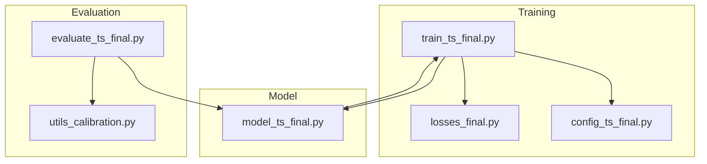
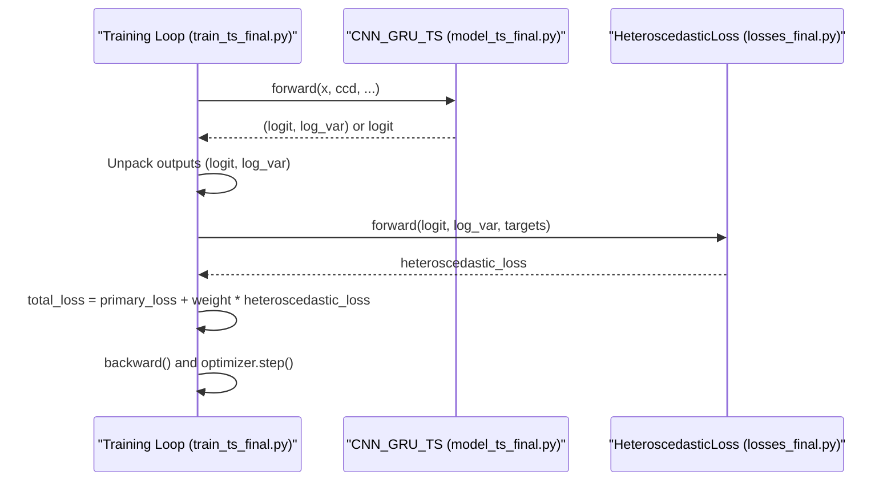
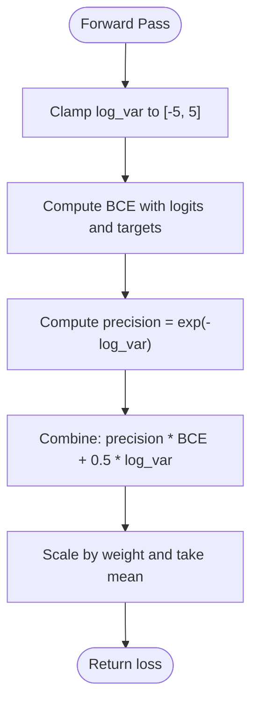
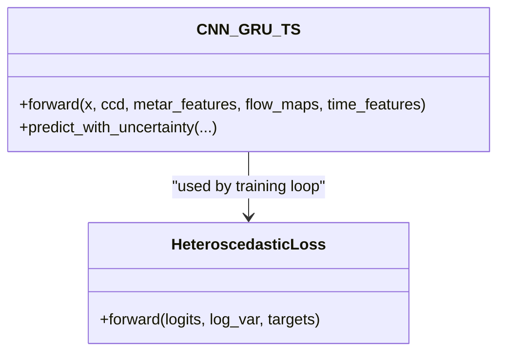
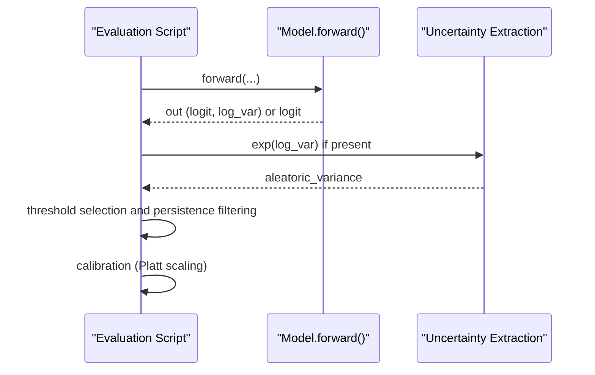
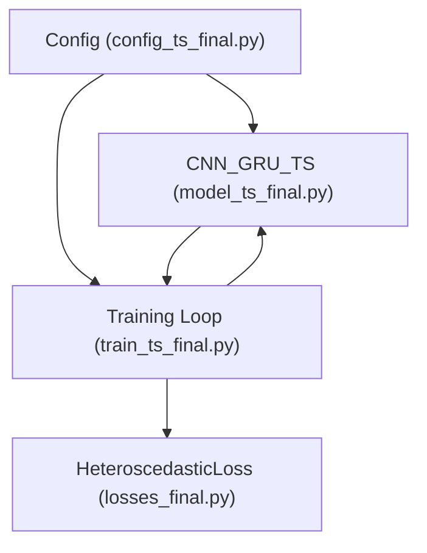

# Heteroscedastic Loss

<cite>
**Referenced Files in This Document**
- [losses_final.py](file://losses_final.py)
- [model_ts_final.py](file://model_ts_final.py)
- [train_ts_final.py](file://train_ts_final.py)
- [evaluate_ts_final.py](file://evaluate_ts_final.py)
- [utils_calibration.py](file://utils_calibration.py)
- [config_ts_final.py](file://config_ts_final.py)
</cite>

## Table of Contents
1. [Introduction](#introduction)
2. [Project Structure](#project-structure)
3. [Core Components](#core-components)
4. [Architecture Overview](#architecture-overview)
5. [Detailed Component Analysis](#detailed-component-analysis)
6. [Dependency Analysis](#dependency-analysis)
7. [Performance Considerations](#performance-considerations)
8. [Troubleshooting Guide](#troubleshooting-guide)
9. [Conclusion](#conclusion)
10. [Appendices](#appendices)

## Introduction
This document explains the HeteroscedasticLoss implementation for aleatoric uncertainty modeling in weather prediction. The model employs a dual-output architecture that predicts both a binary logit and a log-variance parameter. The loss function is designed to learn observation uncertainty by adaptively weighting the classification loss according to predicted aleatoric variance. The document covers the mathematical formulation, variance clamping, precision weighting, integration with the main prediction task, and practical applications such as uncertainty-aware inference, confidence calibration, ensemble forecasting, and adaptive thresholding.

## Project Structure
The HeteroscedasticLoss is part of a multi-phase training and evaluation pipeline that integrates uncertainty modeling with classification and regression objectives. The relevant components are distributed across several modules:
- Loss definitions and multi-task training orchestration
- Dual-output model head and uncertainty-aware inference
- Evaluation scripts for threshold selection, calibration, and ensemble averaging
- Configuration controlling whether uncertainty modeling is enabled



**Diagram sources**
- [train_ts_final.py:288-311](file://train_ts_final.py#L288-L311)
- [losses_final.py:112-133](file://losses_final.py#L112-L133)
- [model_ts_final.py:188-268](file://model_ts_final.py#L188-L268)
- [evaluate_ts_final.py:449-500](file://evaluate_ts_final.py#L449-L500)
- [utils_calibration.py:63-106](file://utils_calibration.py#L63-L106)
- [config_ts_final.py:76-79](file://config_ts_final.py#L76-L79)

**Section sources**
- [train_ts_final.py:288-311](file://train_ts_final.py#L288-L311)
- [losses_final.py:112-133](file://losses_final.py#L112-L133)
- [model_ts_final.py:188-268](file://model_ts_final.py#L188-L268)
- [evaluate_ts_final.py:449-500](file://evaluate_ts_final.py#L449-L500)
- [utils_calibration.py:63-106](file://utils_calibration.py#L63-L106)
- [config_ts_final.py:76-79](file://config_ts_final.py#L76-L79)

## Core Components
- HeteroscedasticLoss: Implements the aleatoric uncertainty-aware loss with variance clamping and precision weighting.
- Dual-output model head: Produces logits and log_variances for uncertainty modeling.
- Training integration: Adds the heteroscedastic loss as an additive regularizer to the primary classification objective.
- Evaluation integration: Supports uncertainty-aware inference and calibration.

Key implementation references:
- HeteroscedasticLoss definition and forward pass
- Dual-output head in the model
- Training loop integration of the heteroscedastic loss
- Evaluation inference with uncertainty-aware prediction

**Section sources**
- [losses_final.py:112-133](file://losses_final.py#L112-L133)
- [model_ts_final.py:188-268](file://model_ts_final.py#L188-L268)
- [train_ts_final.py:438-443](file://train_ts_final.py#L438-L443)
- [evaluate_ts_final.py:474-498](file://evaluate_ts_final.py#L474-L498)

## Architecture Overview
The dual-output architecture separates aleatoric uncertainty learning from the main classification task. The model’s forward pass returns a tuple of outputs: the primary logit and the aleatoric log_variance. The training loop unpacks these outputs and computes the heteroscedastic loss, which is added to the primary classification loss.



**Diagram sources**
- [train_ts_final.py:404-443](file://train_ts_final.py#L404-L443)
- [model_ts_final.py:251-268](file://model_ts_final.py#L251-L268)
- [losses_final.py:121-133](file://losses_final.py#L121-L133)

## Detailed Component Analysis

### HeteroscedasticLoss Implementation
The loss function is defined as:
- L = BCE_loss / (2 * exp(log_var)) + 0.5 * log_var
- Precision is defined as 1 / sigma^2 = exp(-log_var)
- Variance is clamped to a safe range to prevent numerical instability



**Diagram sources**
- [losses_final.py:121-133](file://losses_final.py#L121-L133)

**Section sources**
- [losses_final.py:112-133](file://losses_final.py#L112-L133)

### Dual-Output Model Head
The model’s forward pass returns either a single logit (standard classification) or a tuple of (logit, log_var) when uncertainty modeling is enabled. The head exposes a fc_var linear layer for log_variance prediction.



**Diagram sources**
- [model_ts_final.py:251-268](file://model_ts_final.py#L251-L268)
- [losses_final.py:112-133](file://losses_final.py#L112-L133)

**Section sources**
- [model_ts_final.py:188-190](file://model_ts_final.py#L188-L190)
- [model_ts_final.py:258-260](file://model_ts_final.py#L258-L260)
- [model_ts_final.py:251-268](file://model_ts_final.py#L251-L268)

### Training Integration
The training loop constructs the heteroscedastic loss only when uncertainty modeling is enabled and unpacks the model’s tuple output to obtain log_var. The heteroscedastic loss is added to the primary classification loss as an additive regularizer.

```mermaid
sequenceDiagram
participant Loop as "Training Loop"
participant Model as "Model.forward()"
participant Het as "HeteroscedasticLoss"
participant Prim as "Primary Criterion"
Loop->>Model : forward(...)
Model-->>Loop : out (tuple or single)
Loop->>Loop : logit = out[0]; log_var = out[1] if tuple
Loop->>Prim : forward(logit, targets, weights)
Prim-->>Loop : primary_loss
Loop->>Het : forward(logit, log_var, targets)
Het-->>Loop : het_loss
Loop->>Loop : total_loss = primary_loss + weight * het_loss
Loop->>Loop : backward() and step()
```

**Diagram sources**
- [train_ts_final.py:404-443](file://train_ts_final.py#L404-L443)
- [losses_final.py:121-133](file://losses_final.py#L121-L133)

**Section sources**
- [train_ts_final.py:404-443](file://train_ts_final.py#L404-L443)
- [train_ts_final.py:310-311](file://train_ts_final.py#L310-L311)

### Evaluation Integration and Uncertainty-Aware Inference
During evaluation, the model can return uncertainty estimates. When uncertainty modeling is enabled, the evaluation script extracts aleatoric variance by exponentiating log_var. The pipeline supports:
- Threshold selection on validation set
- Platt scaling calibration (when applicable)
- Ensemble averaging of predictions from multiple models



**Diagram sources**
- [evaluate_ts_final.py:474-498](file://evaluate_ts_final.py#L474-L498)
- [evaluate_ts_final.py:510-523](file://evaluate_ts_final.py#L510-L523)

**Section sources**
- [evaluate_ts_final.py:474-498](file://evaluate_ts_final.py#L474-L498)
- [evaluate_ts_final.py:510-523](file://evaluate_ts_final.py#L510-L523)

### Mathematical Formulation and Precision Weighting
- Aleatoric uncertainty is modeled by predicting log_var, which controls the precision (inverse variance) of the classification loss.
- The loss is composed of:
  - A precision-weighted BCE term that discounts noisy/ambiguous frames
  - A regularization term proportional to log_var that encourages honest uncertainty reporting
- Variance clamping prevents extreme values that could destabilize training.

**Section sources**
- [losses_final.py:112-133](file://losses_final.py#L112-L133)

### Variance Clamping Mechanisms
- log_var is clamped to a finite range to avoid numerical overflow/underflow and to stabilize training.
- Typical clamp bounds are used to keep the exponential of log_var within reasonable limits.

**Section sources**
- [losses_final.py:122-123](file://losses_final.py#L122-L123)

### Integration with Main Prediction Tasks
- The heteroscedastic loss is integrated as an additive regularizer to the primary classification objective, preserving the dominance of the main task while encouraging honest uncertainty modeling.
- Configuration flags control whether uncertainty modeling is enabled and how it is weighted.

**Section sources**
- [train_ts_final.py:438-443](file://train_ts_final.py#L438-L443)
- [config_ts_final.py:76-79](file://config_ts_final.py#L76-L79)

### Applications in Ensemble Forecasting and Adaptive Thresholding
- Ensemble forecasting: The evaluation pipeline demonstrates averaging predictions from multiple models, which complements aleatoric uncertainty modeling by reducing overconfidence.
- Adaptive thresholding: The evaluation pipeline selects thresholds on the validation set and applies persistence filtering; aleatoric uncertainty can inform dynamic threshold adjustments in operational settings.

**Section sources**
- [evaluate_ensemble.py:181-183](file://evaluate_ensemble.py#L181-L183)
- [evaluate_ts_final.py:524-548](file://evaluate_ts_final.py#L524-L548)

## Dependency Analysis
The HeteroscedasticLoss depends on:
- PyTorch’s binary cross-entropy with logits
- The model’s dual-output structure
- Training configuration flags for enabling uncertainty modeling



**Diagram sources**
- [losses_final.py:112-133](file://losses_final.py#L112-L133)
- [model_ts_final.py:251-268](file://model_ts_final.py#L251-L268)
- [train_ts_final.py:404-443](file://train_ts_final.py#L404-L443)
- [config_ts_final.py:76-79](file://config_ts_final.py#L76-L79)

**Section sources**
- [losses_final.py:112-133](file://losses_final.py#L112-L133)
- [model_ts_final.py:251-268](file://model_ts_final.py#L251-L268)
- [train_ts_final.py:404-443](file://train_ts_final.py#L404-L443)
- [config_ts_final.py:76-79](file://config_ts_final.py#L76-L79)

## Performance Considerations
- Variance clamping prevents numerical instabilities and improves training stability.
- Using the loss as an additive regularizer ensures the main classification objective remains dominant while encouraging honest uncertainty reporting.
- Ensemble averaging and calibration improve reliability and operational utility.

[No sources needed since this section provides general guidance]

## Troubleshooting Guide
Common issues and remedies:
- Instability in training: Verify that log_var is being clamped appropriately and that the model’s log_var head is enabled only when intended.
- Misalignment between model outputs and training unpacking: Ensure the model returns a tuple when uncertainty modeling is enabled and that the training loop checks for tuple outputs before extracting log_var.
- Calibration mismatch: When using evidential learning, Platt scaling is skipped; consider temperature scaling for improved reliability.

**Section sources**
- [losses_final.py:122-123](file://losses_final.py#L122-L123)
- [train_ts_final.py:409-411](file://train_ts_final.py#L409-L411)
- [evaluate_ts_final.py:510-523](file://evaluate_ts_final.py#L510-L523)

## Conclusion
The HeteroscedasticLoss enables the model to learn aleatoric uncertainty by adaptively weighting classification loss according to predicted observation variance. Through variance clamping, precision weighting, and additive integration with the primary classification objective, it improves reliability and supports uncertainty-aware inference, calibration, ensemble forecasting, and adaptive thresholding. Configuration flags control its activation and weighting, allowing flexible deployment in operational settings.

[No sources needed since this section summarizes without analyzing specific files]

## Appendices

### Practical Usage Notes
- Enable uncertainty modeling via configuration flags and ensure the model’s log_var head is active.
- Monitor training stability and adjust the heteroscedastic loss weight as needed.
- Use evaluation scripts to select thresholds, calibrate probabilities, and combine predictions from multiple models.

**Section sources**
- [config_ts_final.py:76-79](file://config_ts_final.py#L76-L79)
- [train_ts_final.py:310-311](file://train_ts_final.py#L310-L311)
- [evaluate_ts_final.py:510-523](file://evaluate_ts_final.py#L510-L523)