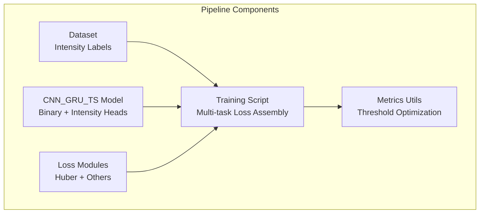
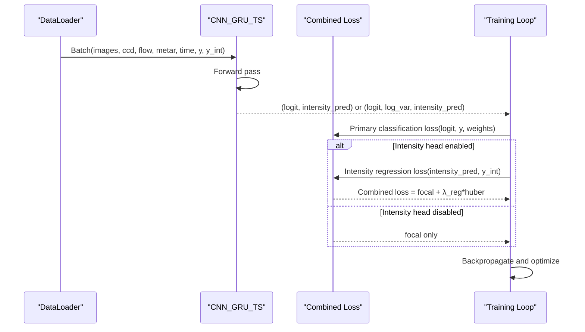
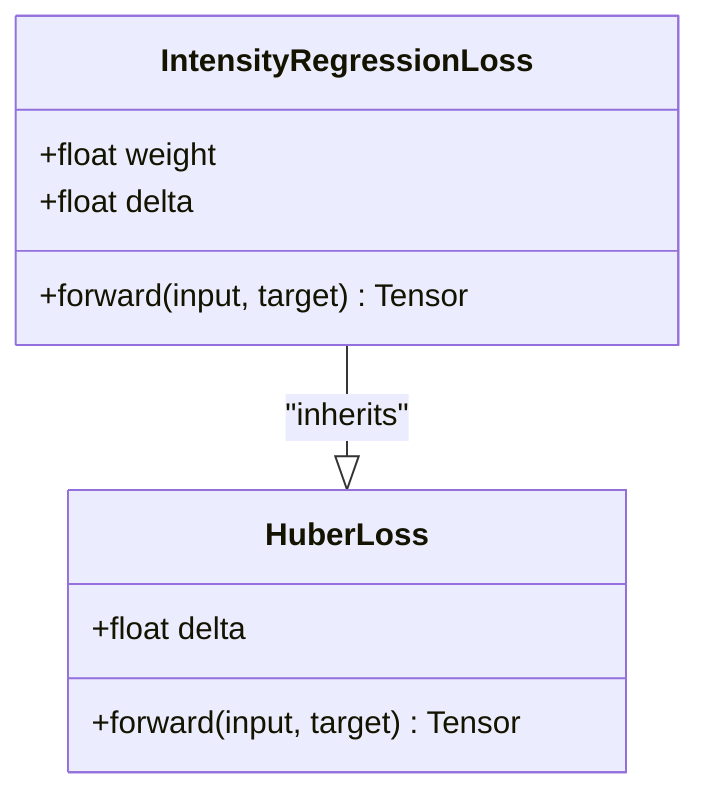
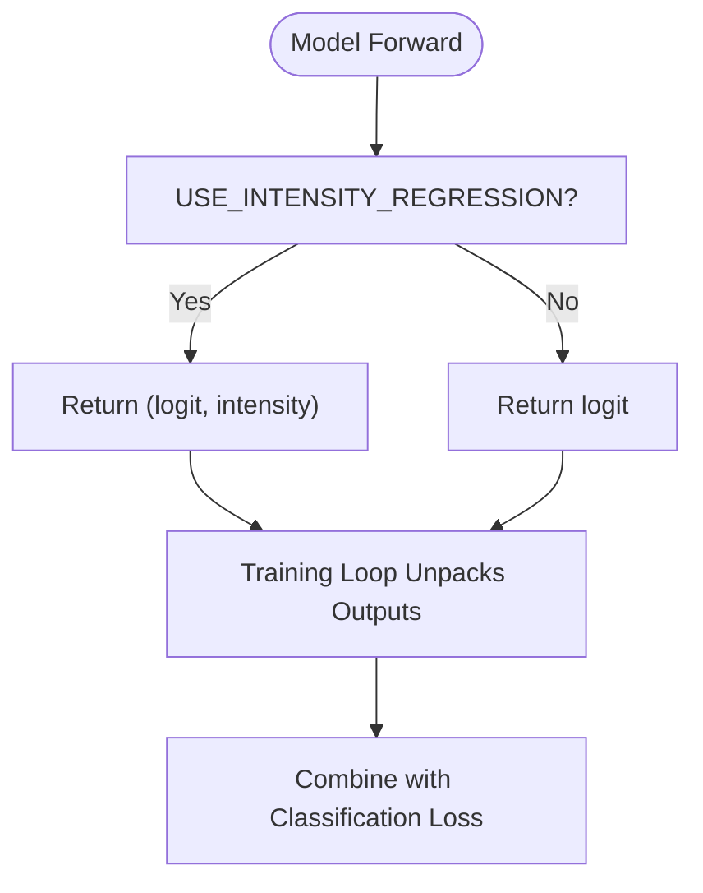
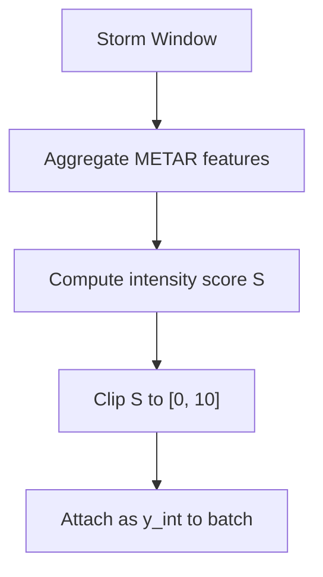
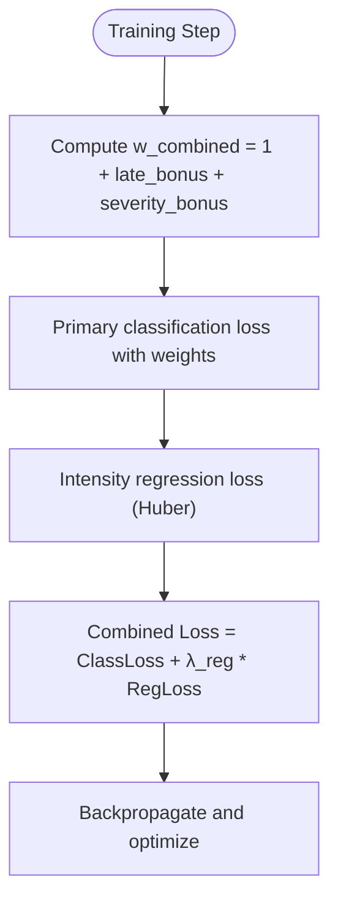
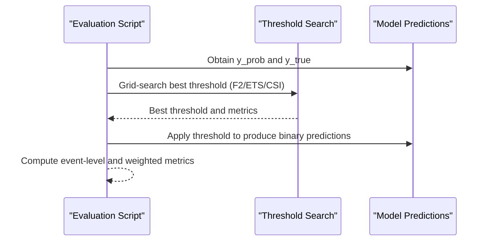
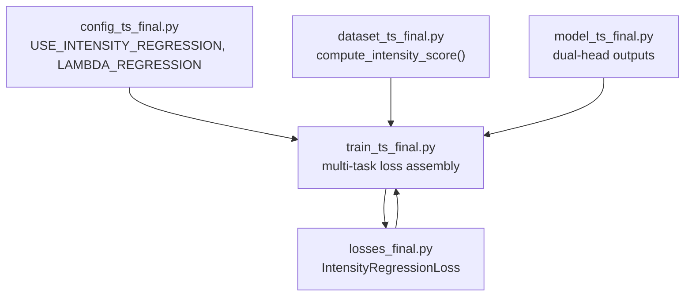

# Intensity Regression Loss

<cite>
**Referenced Files in This Document**
- [losses_final.py](file://losses_final.py)
- [model_ts_final.py](file://model_ts_final.py)
- [train_ts_final.py](file://train_ts_final.py)
- [dataset_ts_final.py](file://dataset_ts_final.py)
- [config_ts_final.py](file://config_ts_final.py)
- [utils_metrics_final.py](file://utils_metrics_final.py)
</cite>

## Table of Contents
1. [Introduction](#introduction)
2. [Project Structure](#project-structure)
3. [Core Components](#core-components)
4. [Architecture Overview](#architecture-overview)
5. [Detailed Component Analysis](#detailed-component-analysis)
6. [Dependency Analysis](#dependency-analysis)
7. [Performance Considerations](#performance-considerations)
8. [Troubleshooting Guide](#troubleshooting-guide)
9. [Conclusion](#conclusion)

## Introduction
This document explains the Intensity Regression Loss using Huber loss for continuous precipitation intensity prediction in the Nagpur TS Nowcasting pipeline. It details the robust regression approach with delta parameter control for smooth transition between L1 and L2 loss behavior, the weight scaling mechanism, and integration with the main binary classification task. It also covers advantages over MSE for precipitation forecasting, including reduced sensitivity to outliers and improved training stability, along with practical examples of intensity scoring, threshold optimization, and multi-task learning integration.

## Project Structure
The Intensity Regression Loss is part of a multi-phase training pipeline that combines:
- A primary binary classification task (probability of convection occurrence)
- An auxiliary intensity regression head (continuous severity score)
- Additional uncertainty and temporal consistency modules

**Diagram sources**
- [model_ts_final.py:192-268](file://model_ts_final.py#L192-L268)
- [train_ts_final.py:288-448](file://train_ts_final.py#L288-L448)
- [dataset_ts_final.py:146-197](file://dataset_ts_final.py#L146-L197)
- [losses_final.py:135-142](file://losses_final.py#L135-L142)
- [utils_metrics_final.py:192-240](file://utils_metrics_final.py#L192-L240)

**Section sources**
- [model_ts_final.py:192-268](file://model_ts_final.py#L192-L268)
- [train_ts_final.py:288-448](file://train_ts_final.py#L288-L448)
- [dataset_ts_final.py:146-197](file://dataset_ts_final.py#L146-L197)
- [losses_final.py:135-142](file://losses_final.py#L135-L142)
- [utils_metrics_final.py:192-240](file://utils_metrics_final.py#L192-L240)

## Core Components
- IntensityRegressionLoss: Implements robust Huber loss for continuous intensity prediction with configurable delta and weight scaling.
- Model integration: Dual-head architecture returns both classification logits and intensity scores.
- Training integration: Multi-task loss combines classification loss with intensity regression loss.
- Dataset generation: Intensity scores derived from METAR-derived features for each storm window.

Key implementation references:
- IntensityRegressionLoss definition and forward pass
- Model dual-head outputs and unpacking in training
- Intensity score computation in dataset construction
- Configuration flags controlling intensity regression

**Section sources**
- [losses_final.py:135-142](file://losses_final.py#L135-L142)
- [model_ts_final.py:192-268](file://model_ts_final.py#L192-L268)
- [train_ts_final.py:413-448](file://train_ts_final.py#L413-L448)
- [dataset_ts_final.py:146-197](file://dataset_ts_final.py#L146-L197)
- [config_ts_final.py:80-83](file://config_ts_final.py#L80-L83)

## Architecture Overview
The multi-task architecture integrates classification and intensity regression within a single training step. The classification loss (e.g., Focal Loss with Late Penalty) remains the primary objective, while the intensity regression loss acts as a regularizer with configurable weight.

**Diagram sources**
- [train_ts_final.py:390-448](file://train_ts_final.py#L390-L448)
- [model_ts_final.py:255-268](file://model_ts_final.py#L255-L268)
- [losses_final.py:135-142](file://losses_final.py#L135-L142)

**Section sources**
- [train_ts_final.py:390-448](file://train_ts_final.py#L390-L448)
- [model_ts_final.py:255-268](file://model_ts_final.py#L255-L268)
- [losses_final.py:135-142](file://losses_final.py#L135-L142)

## Detailed Component Analysis

### IntensityRegressionLoss Implementation
- Inherits from Huber loss to provide robust regression with smooth transition between L1 and L2 behavior controlled by delta.
- Applies a scalar weight to balance contribution relative to the primary classification loss.
- Designed for continuous intensity score S ∈ [0, 10] representing storm severity.

**Diagram sources**
- [losses_final.py:135-142](file://losses_final.py#L135-L142)

**Section sources**
- [losses_final.py:135-142](file://losses_final.py#L135-L142)

### Model Integration and Multi-Task Heads
- The model exposes a dual-head output when intensity regression is enabled:
  - Classification head: produces logits for binary convection probability.
  - Intensity head: produces a positive scalar intensity score via ReLU activation.
- During training, the model returns either a single logit or a tuple depending on enabled heads.

**Diagram sources**
- [model_ts_final.py:192-268](file://model_ts_final.py#L192-L268)
- [train_ts_final.py:413-416](file://train_ts_final.py#L413-L416)

**Section sources**
- [model_ts_final.py:192-268](file://model_ts_final.py#L192-L268)
- [train_ts_final.py:413-416](file://train_ts_final.py#L413-L416)

### Dataset Generation and Intensity Scoring
- Intensity score S is computed from METAR-derived features for each storm window:
  - Wind speed/gust, rainfall intensity category, visibility, and coldest cloud-top pixel.
  - Score is clipped to [0, 10] and used as the regression target.
- The dataset returns intensity_score alongside classification labels when enabled.

**Diagram sources**
- [dataset_ts_final.py:146-197](file://dataset_ts_final.py#L146-L197)

**Section sources**
- [dataset_ts_final.py:146-197](file://dataset_ts_final.py#L146-L197)

### Training Integration and Weight Scaling
- The training script constructs a combined loss:
  - Primary classification loss (e.g., Focal Loss with Late Penalty) with additive per-sample weights.
  - Intensity regression loss added with coefficient λ_reg (configurable).
- Per-sample weights incorporate:
  - Late detection bonus for ramp-up labels.
  - Severity-based bonuses mapped from severity weights in configuration.

**Diagram sources**
- [train_ts_final.py:417-448](file://train_ts_final.py#L417-L448)
- [config_ts_final.py:80-83](file://config_ts_final.py#L80-L83)

**Section sources**
- [train_ts_final.py:417-448](file://train_ts_final.py#L417-L448)
- [config_ts_final.py:80-83](file://config_ts_final.py#L80-L83)

### Threshold Optimization and Evaluation
- Threshold selection is performed over a grid of candidate thresholds to optimize chosen metrics (e.g., F2, ETS, CSI).
- The evaluation utilities support both single-threshold and dual-threshold (Schmitt trigger) strategies for hysteresis-based event detection.
- Intensity predictions can be used to inform operational thresholds (e.g., S ≥ 3 for light, S ≥ 6 for heavy, S ≥ 8.5 for squall).

**Diagram sources**
- [utils_metrics_final.py:192-240](file://utils_metrics_final.py#L192-L240)

**Section sources**
- [utils_metrics_final.py:192-240](file://utils_metrics_final.py#L192-L240)

## Dependency Analysis
The Intensity Regression Loss depends on:
- torch.nn.HuberLoss for robust regression behavior.
- Configuration flags for enabling the head and scaling the loss contribution.
- Dataset generation for intensity targets.
- Training script for multi-task assembly and weight application.

**Diagram sources**
- [config_ts_final.py:80-83](file://config_ts_final.py#L80-L83)
- [dataset_ts_final.py:146-197](file://dataset_ts_final.py#L146-L197)
- [model_ts_final.py:192-268](file://model_ts_final.py#L192-L268)
- [losses_final.py:135-142](file://losses_final.py#L135-L142)
- [train_ts_final.py:311-448](file://train_ts_final.py#L311-L448)

**Section sources**
- [config_ts_final.py:80-83](file://config_ts_final.py#L80-L83)
- [dataset_ts_final.py:146-197](file://dataset_ts_final.py#L146-L197)
- [model_ts_final.py:192-268](file://model_ts_final.py#L192-L268)
- [losses_final.py:135-142](file://losses_final.py#L135-L142)
- [train_ts_final.py:311-448](file://train_ts_final.py#L311-L448)

## Performance Considerations
- Robustness: Huber loss reduces sensitivity to outliers compared to MSE, improving training stability for precipitation forecasting tasks with occasional extreme values.
- Smooth transition: The delta parameter controls the transition between L1 (robust) and L2 (smooth) regimes; smaller delta increases robustness, larger delta improves smoothness near zero error.
- Weight scaling: The λ_reg weight balances the influence of intensity regression against the primary classification task; tune based on validation performance.
- Computational overhead: Adding the intensity head introduces minimal overhead due to scalar outputs and lightweight regression loss.

[No sources needed since this section provides general guidance]

## Troubleshooting Guide
- Intensity head not active:
  - Verify USE_INTENSITY_REGRESSION is enabled in configuration.
  - Confirm model returns intensity predictions and training loop unpacks them.
- Poor intensity correlation:
  - Check that dataset computes intensity_score correctly from METAR features.
  - Validate that y_int is included in the batch when the head is enabled.
- Training instability:
  - Adjust λ_reg weight to reduce dominance of intensity loss.
  - Tune delta to balance robustness and smoothness for your data characteristics.
- Threshold mismatch:
  - Use find_best_threshold or find_best_dual_threshold utilities to optimize thresholds for your metric of choice.

**Section sources**
- [config_ts_final.py:80-83](file://config_ts_final.py#L80-L83)
- [model_ts_final.py:255-268](file://model_ts_final.py#L255-L268)
- [dataset_ts_final.py:470-477](file://dataset_ts_final.py#L470-L477)
- [utils_metrics_final.py:192-240](file://utils_metrics_final.py#L192-L240)

## Conclusion
The Intensity Regression Loss with Huber loss enables robust, continuous precipitation intensity prediction integrated seamlessly into the main binary classification task. The delta parameter provides flexible control over the loss behavior, while weight scaling ensures balanced multi-task training. This approach improves training stability, reduces outlier sensitivity, and supports practical threshold optimization for operational nowcasting.