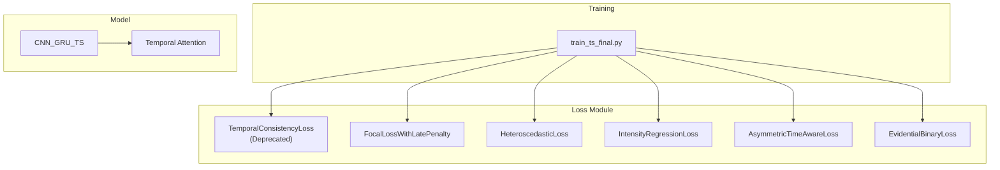
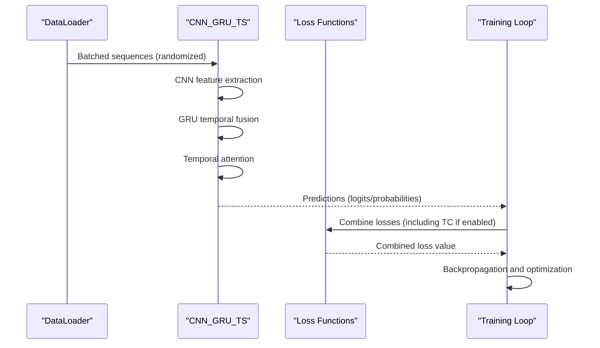
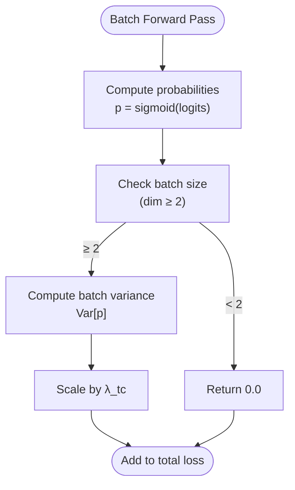
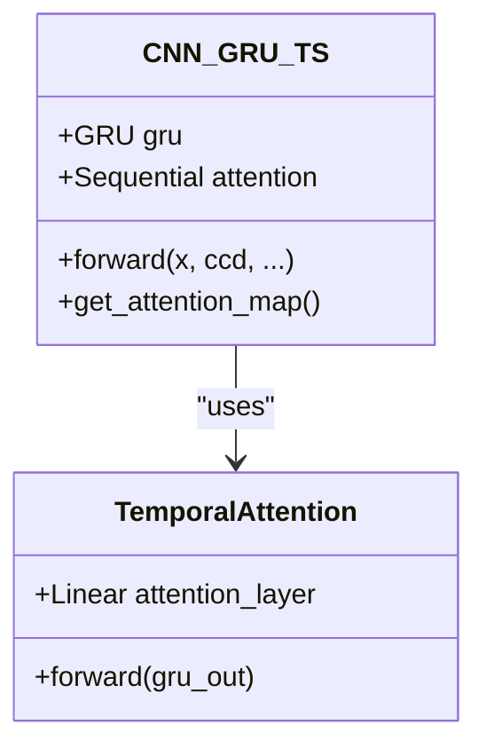
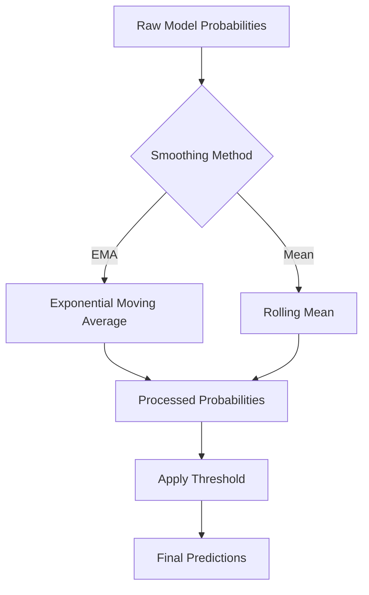

# Temporal Consistency Loss

<cite>
**Referenced Files in This Document**
- [losses_final.py](file://losses_final.py)
- [train_ts_final.py](file://train_ts_final.py)
- [model_ts_final.py](file://model_ts_final.py)
- [audit_report_part1.md](file://reports/audit_report_part1.md)
- [PLAN-ts-pipeline-upgrade.md](file://docs/PLAN-ts-pipeline-upgrade.md)
- [advanced_ml_discussion.md](file://reports/advanced_ml_discussion.md)
- [utils_metrics_final.py](file://utils_metrics_final.py)
</cite>

## Table of Contents
1. [Introduction](#introduction)
2. [Project Structure](#project-structure)
3. [Core Components](#core-components)
4. [Architecture Overview](#architecture-overview)
5. [Detailed Component Analysis](#detailed-component-analysis)
6. [Dependency Analysis](#dependency-analysis)
7. [Performance Considerations](#performance-considerations)
8. [Troubleshooting Guide](#troubleshooting-guide)
9. [Conclusion](#conclusion)

## Introduction
This document analyzes the deprecated TemporalConsistencyLoss implementation and its scientific limitations. The audit identified that batch variance cannot reliably measure temporal consistency in randomized sampling contexts. The document explains why the approach was scientifically invalid, presents mathematical reasoning, and recommends alternatives such as spatiotemporal attention mechanisms and temporal smoothing techniques.

## Project Structure
The deprecated TemporalConsistencyLoss resides in the loss module alongside other temporal and uncertainty-aware losses. The training script integrates optional temporal consistency regularization, while the model architecture includes temporal attention that can be leveraged for proper temporal coherence.



**Diagram sources**
- [losses_final.py:94-110](file://losses_final.py#L94-L110)
- [train_ts_final.py:309](file://train_ts_final.py#L309)
- [model_ts_final.py:260-263](file://model_ts_final.py#L260-L263)

**Section sources**
- [losses_final.py:94-110](file://losses_final.py#L94-L110)
- [train_ts_final.py:309](file://train_ts_final.py#L309)
- [model_ts_final.py:260-263](file://model_ts_final.py#L260-L263)

## Core Components
TemporalConsistencyLoss was designed to penalize temporal inconsistency by measuring prediction variance within batches. However, due to randomized sampling in the DataLoader, batch samples lack temporal adjacency, making batch variance an unreliable proxy for temporal consistency.

Key characteristics:
- Computes probability variance across the batch dimension
- Applies a scalar weight λ_tc to balance influence
- Was intended to reduce "chattering" but is scientifically invalid under randomized sampling

**Section sources**
- [losses_final.py:94-110](file://losses_final.py#L94-L110)
- [audit_report_part1.md:53-71](file://reports/audit_report_part1.md#L53-L71)

## Architecture Overview
The system architecture includes a CNN-GRU backbone with temporal attention and optional uncertainty heads. The deprecated temporal consistency loss was considered for integration into the training pipeline.



**Diagram sources**
- [train_ts_final.py:309](file://train_ts_final.py#L309)
- [model_ts_final.py:257-263](file://model_ts_final.py#L257-L263)

**Section sources**
- [train_ts_final.py:309](file://train_ts_final.py#L309)
- [model_ts_final.py:257-263](file://model_ts_final.py#L257-L263)

## Detailed Component Analysis

### TemporalConsistencyLoss: Scientific Limitations
The deprecated implementation computes batch probability variance as a proxy for temporal consistency. The audit identified three critical scientific flaws:

1. **Randomized Sampling Bias**: DataLoader uses WeightedRandomSampler, so consecutive samples in a batch are not temporally adjacent. Batch variance reflects prediction diversity across random sequences, not temporal smoothness.

2. **Misaligned Objective**: The loss acts as mild L2 regularization on prediction variance, suppressing both high-confidence correct predictions and legitimate temporal transitions.

3. **Lack of Sequence-Level Ordering**: True temporal consistency requires sequence-level computation, which is not feasible with the current batch structure.

Mathematical analysis:
- Batch variance: Var[p] = E[(p - E[p])²] where p is the probability vector across the batch
- Under randomized sampling, Var[p] measures dispersion among unrelated sequences
- This is fundamentally different from temporal consistency: Σₜ₌₁ᵀ⁻¹ (pₜ₊₁ - pₜ)²



**Diagram sources**
- [losses_final.py:104-110](file://losses_final.py#L104-L110)

**Section sources**
- [losses_final.py:94-110](file://losses_final.py#L94-L110)
- [audit_report_part1.md:53-71](file://reports/audit_report_part1.md#L53-L71)

### Audit Findings Leading to Deprecation
The audit identified several critical issues:

1. **Primary Scientific Flaw**: Batch variance does not measure temporal consistency due to randomized sampling
2. **Secondary Issues**: 
   - Small but misleading regularization effect (λ_tc = 0.1)
   - Misleading interpretation as temporal smoothing
   - Potential suppression of legitimate temporal transitions

Recommendations from the audit:
- Remove TemporalConsistencyLoss entirely
- Replace with scientifically valid temporal coherence measures
- Leverage existing temporal attention mechanisms

**Section sources**
- [audit_report_part1.md:53-71](file://reports/audit_report_part1.md#L53-L71)
- [audit_report_part1.md:289-296](file://reports/audit_report_part1.md#L289-L296)

### Recommended Alternatives for Temporal Coherence

#### Spatiotemporal Attention Mechanisms
The model already includes temporal attention that can be leveraged for proper temporal coherence:



**Diagram sources**
- [model_ts_final.py:180-193](file://model_ts_final.py#L180-L193)
- [model_ts_final.py:260-263](file://model_ts_final.py#L260-L263)

#### Temporal Smoothing Techniques
The codebase includes established temporal smoothing utilities that provide practical temporal coherence:



**Diagram sources**
- [utils_metrics_final.py:22](file://utils_metrics_final.py#L22)
- [train_ts_final.py:509](file://train_ts_final.py#L509)

**Section sources**
- [model_ts_final.py:260-263](file://model_ts_final.py#L260-L263)
- [utils_metrics_final.py:22](file://utils_metrics_final.py#L22)
- [train_ts_final.py:509](file://train_ts_final.py#L509)

### Mathematical Analysis of Scientific Invalidation
The mathematical basis for deprecation:

**Batch Variance vs. Temporal Consistency**:
- Batch Variance: Var[p] = (1/B) Σᵢ₌₁ᴮ (pᵢ - μ)²
- Temporal Consistency: Σₜ₌₁ᵀ⁻¹ (pₜ₊₁ - pₜ)²

**Impact of Randomized Sampling**:
- Under randomized sampling, pᵢ represents predictions from unrelated sequences
- Var[p] becomes a measure of prediction diversity across random samples
- This is orthogonal to temporal smoothness requirements

**Audit-Recommended Fix**:
The audit suggests removing the invalid implementation and leveraging the existing temporal attention mechanism, which operates on the temporal dimension of GRU outputs.

**Section sources**
- [audit_report_part1.md:53-71](file://reports/audit_report_part1.md#L53-L71)
- [model_ts_final.py:257-263](file://model_ts_final.py#L257-L263)

## Dependency Analysis
The deprecated TemporalConsistencyLoss had minimal dependencies but was integrated into the training pipeline:

```mermaid
graph TB
subgraph "Training Dependencies"
TR["train_ts_final.py"]
TC["TemporalConsistencyLoss"]
CFG["Configuration"]
end
subgraph "Model Dependencies"
MD["CNN_GRU_TS"]
TA["Temporal Attention"]
end
TR --> TC
TR --> CFG
MD --> TA
TC -.-> MD : "No direct dependency"
```

**Diagram sources**
- [train_ts_final.py:309](file://train_ts_final.py#L309)
- [model_ts_final.py:260-263](file://model_ts_final.py#L260-L263)

**Section sources**
- [train_ts_final.py:309](file://train_ts_final.py#L309)
- [model_ts_final.py:260-263](file://model_ts_final.py#L260-L263)

## Performance Considerations
- **Computational Cost**: The deprecated loss added minimal computational overhead but provided no scientific benefit
- **Memory Impact**: Negligible memory footprint due to scalar variance computation
- **Training Stability**: The small λ_tc = 0.1 weight meant the effect was minor but still misleading

## Troubleshooting Guide
Common issues and resolutions:

1. **Unexpected Training Behavior**: If you observe unusual smoothing effects, check if TemporalConsistencyLoss is enabled in configuration
2. **Metric Interpretation**: Batch variance should not be used as a diagnostic for temporal consistency
3. **Alternative Approaches**: 
   - Enable temporal attention visualization for interpretability
   - Use temporal smoothing utilities for post-processing
   - Monitor attention weights to understand temporal focus

**Section sources**
- [PLAN-ts-pipeline-upgrade.md:72-122](file://docs/PLAN-ts-pipeline-upgrade.md#L72-L122)
- [model_ts_final.py:295-297](file://model_ts_final.py#L295-L297)

## Conclusion
TemporalConsistencyLoss was scientifically invalid because batch variance cannot measure temporal consistency under randomized sampling conditions. The audit correctly identified this limitation and recommended removal. The codebase provides superior alternatives through spatiotemporal attention mechanisms and temporal smoothing techniques. These approaches leverage the model's existing temporal architecture and established post-processing methods to achieve proper temporal coherence without introducing misleading regularization effects.

The recommended path forward is to:
1. Remove TemporalConsistencyLoss from the codebase
2. Rely on the existing temporal attention mechanism
3. Use temporal smoothing utilities for operational temporal coherence
4. Monitor attention weights for interpretability and model behavior insights