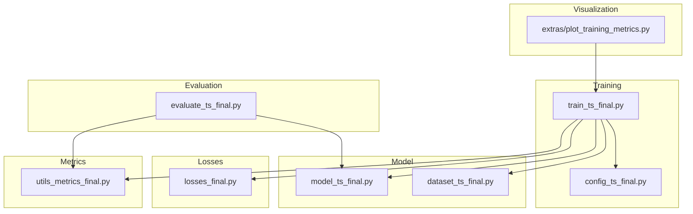
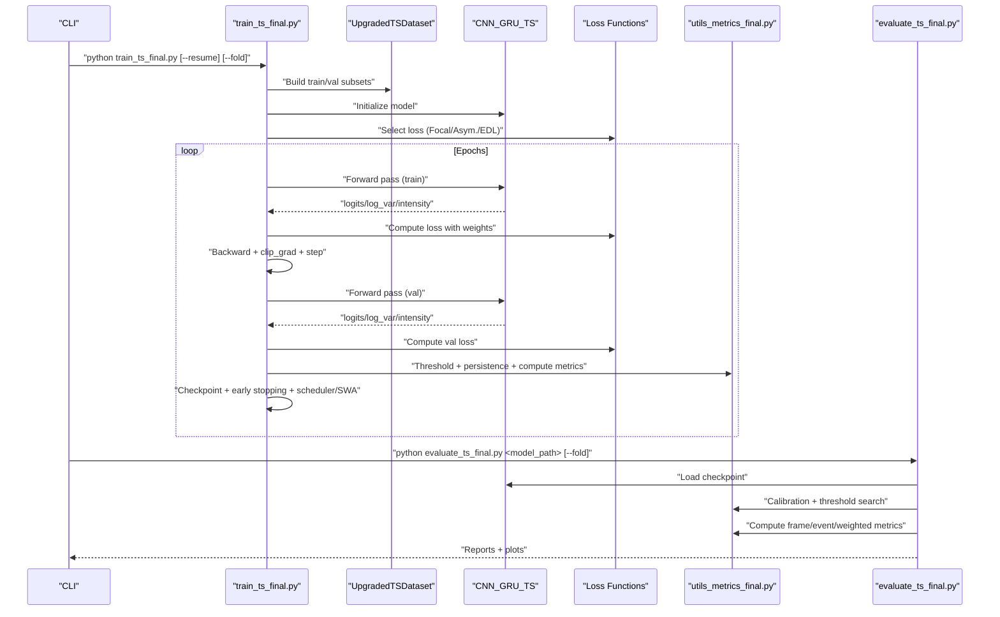
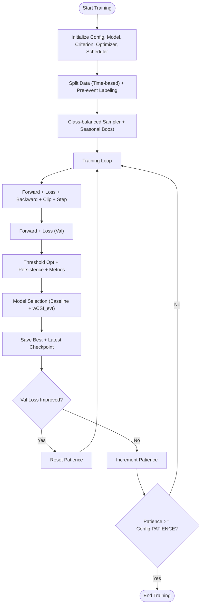
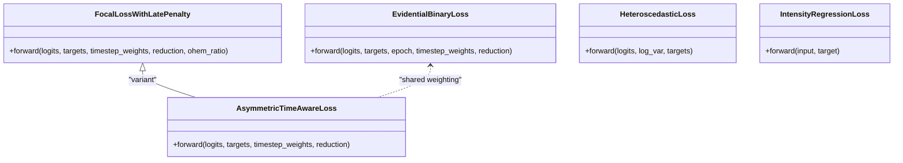
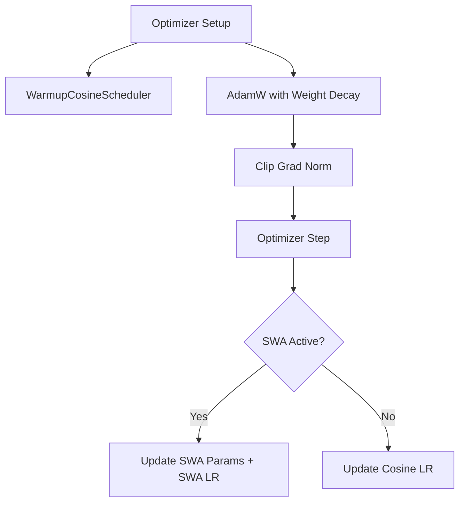
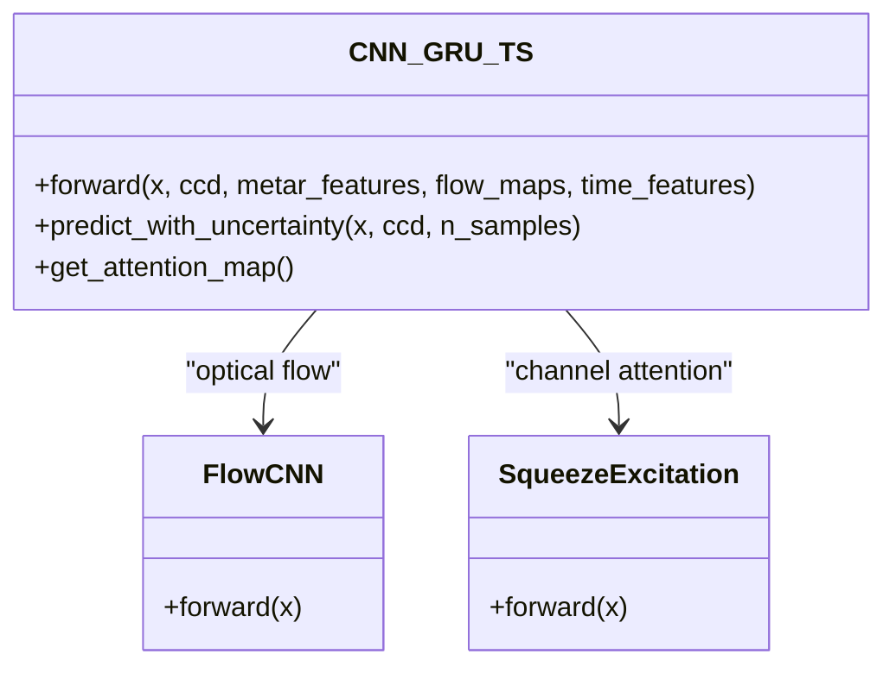
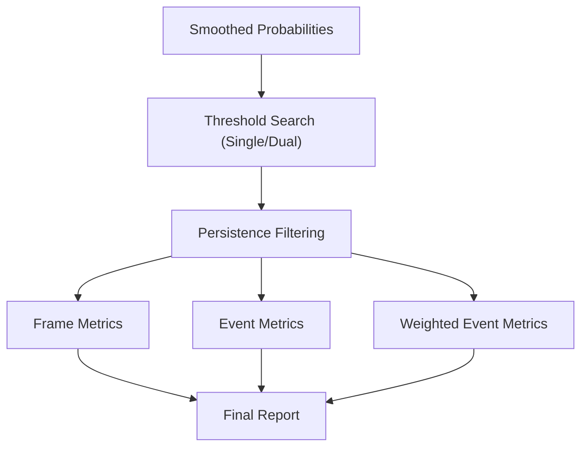
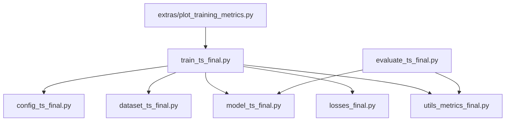

# Model Training System

<cite>
**Referenced Files in This Document**
- [train_ts_final.py](file://train_ts_final.py)
- [config_ts_final.py](file://config_ts_final.py)
- [losses_final.py](file://losses_final.py)
- [model_ts_final.py](file://model_ts_final.py)
- [dataset_ts_final.py](file://dataset_ts_final.py)
- [utils_metrics_final.py](file://utils_metrics_final.py)
- [evaluate_ts_final.py](file://evaluate_ts_final.py)
- [plot_training_metrics.py](file://extras/plot_training_metrics.py)
- [training_evaluation_260522_1107.md](file://reports/training_evaluation_260522_1107.md)
</cite>

## Table of Contents
1. [Introduction](#introduction)
2. [Project Structure](#project-structure)
3. [Core Components](#core-components)
4. [Architecture Overview](#architecture-overview)
5. [Detailed Component Analysis](#detailed-component-analysis)
6. [Dependency Analysis](#dependency-analysis)
7. [Performance Considerations](#performance-considerations)
8. [Troubleshooting Guide](#troubleshooting-guide)
9. [Conclusion](#conclusion)
10. [Appendices](#appendices)

## Introduction
This document explains the complete model training pipeline for the Nagpur Thunderstorm Nowcasting system. It covers training orchestration, advanced loss functions, optimization strategies, configuration and hyperparameter tuning, evaluation metrics, visualization tools, and practical guidance for training runs, loss curve interpretation, and model selection criteria.

## Project Structure
The training system is organized around a modular Python package with clear separation of concerns:
- Training orchestration and validation loop
- Configuration and hyperparameters
- Model architecture and heads
- Dataset construction and augmentation
- Loss functions and uncertainty modeling
- Metrics computation and evaluation
- Visualization and reporting tools

**Diagram sources**
- [train_ts_final.py:142-757](file://train_ts_final.py#L142-L757)
- [config_ts_final.py:16-208](file://config_ts_final.py#L16-L208)
- [model_ts_final.py:68-335](file://model_ts_final.py#L68-L335)
- [dataset_ts_final.py:47-515](file://dataset_ts_final.py#L47-L515)
- [losses_final.py:13-258](file://losses_final.py#L13-L258)
- [utils_metrics_final.py:14-760](file://utils_metrics_final.py#L14-L760)
- [evaluate_ts_final.py:361-908](file://evaluate_ts_final.py#L361-L908)
- [plot_training_metrics.py:25-464](file://extras/plot_training_metrics.py#L25-L464)

**Section sources**
- [train_ts_final.py:142-757](file://train_ts_final.py#L142-L757)
- [config_ts_final.py:16-208](file://config_ts_final.py#L16-L208)

## Core Components
- Training orchestration: epoch management, validation cycles, checkpointing, early stopping, and SWA integration.
- Advanced loss functions: Focal loss with late penalty, asymmetric time-aware loss, evidential learning, and auxiliary tasks.
- Optimization strategies: learning rate scheduling, weight decay, gradient clipping, and SWA.
- Configuration system: centralized hyperparameters, data paths, and feature toggles.
- Evaluation metrics: CSI, ETS, POD, FAR, and custom weighted event metrics with lead-time bonuses.
- Visualization and monitoring: training dashboards and convergence analysis.

**Section sources**
- [train_ts_final.py:386-729](file://train_ts_final.py#L386-L729)
- [losses_final.py:13-258](file://losses_final.py#L13-L258)
- [config_ts_final.py:16-208](file://config_ts_final.py#L16-L208)
- [utils_metrics_final.py:120-760](file://utils_metrics_final.py#L120-L760)

## Architecture Overview
The training pipeline integrates a CNN-GRU backbone with optional uncertainty and intensity regression heads. It supports multiple loss strategies and temporal post-processing for robust nowcasting.

**Diagram sources**
- [train_ts_final.py:142-757](file://train_ts_final.py#L142-L757)
- [dataset_ts_final.py:337-515](file://dataset_ts_final.py#L337-L515)
- [model_ts_final.py:202-268](file://model_ts_final.py#L202-L268)
- [losses_final.py:13-258](file://losses_final.py#L13-L258)
- [utils_metrics_final.py:192-314](file://utils_metrics_final.py#L192-L314)
- [evaluate_ts_final.py:361-908](file://evaluate_ts_final.py#L361-L908)

## Detailed Component Analysis

### Training Orchestration (train_ts_final.py)
- Epoch management: iterates over configured epochs, alternating train and validation.
- Data splits: time-based walk-forward cross-validation folds with pre-event soft labeling.
- Sampler: class-balanced sampling with target positive rate and optional seasonal boosting.
- Loss composition: primary classification loss plus optional heteroscedastic and intensity regression terms.
- Validation scoring: threshold optimization (single or dual thresholds), persistence filtering, and weighted event metrics.
- Model selection: operational baseline rule and maximization of weighted CSI among safe models.
- Checkpointing: saves best model and latest checkpoint; archives logs and predictions.
- Early stopping: decouples from selection to improve generalization.
- SWA: updates batch norm statistics and saves averaged model.

**Diagram sources**
- [train_ts_final.py:386-729](file://train_ts_final.py#L386-L729)

**Section sources**
- [train_ts_final.py:142-757](file://train_ts_final.py#L142-L757)

### Advanced Loss Functions (losses_final.py)
- FocalLossWithLatePenalty: class-balanced BCE with focal modulation, label smoothing, and additive OHEM for hard negatives. Late penalty and severity weighting are applied to the loss tensor.
- AsymmetricTimeAwareLoss: asymmetric penalties for misses and false alarms, with anticipation reward for early triggers on soft labels.
- EvidentialBinaryLoss: EDL loss with KL regularization and optional asymmetric weighting; compatible with epoch-dependent annealing.
- HeteroscedasticLoss: aleatoric uncertainty-aware BCE with learned log-variance.
- IntensityRegressionLoss: Huber loss for continuous severity score prediction.

**Diagram sources**
- [losses_final.py:13-258](file://losses_final.py#L13-L258)

**Section sources**
- [losses_final.py:13-258](file://losses_final.py#L13-L258)

### Optimization Strategies
- Learning rate scheduling: cosine decay with warmup.
- Weight decay: L2 regularization applied to optimizer.
- Gradient clipping: norm-based clipping to stabilize training.
- SWA: stochastic weight averaging with separate scheduler and BN update.

**Diagram sources**
- [train_ts_final.py:80-94](file://train_ts_final.py#L80-L94)
- [train_ts_final.py:313-328](file://train_ts_final.py#L313-L328)
- [train_ts_final.py:446-447](file://train_ts_final.py#L446-L447)
- [train_ts_final.py:723-728](file://train_ts_final.py#L723-L728)

**Section sources**
- [train_ts_final.py:80-94](file://train_ts_final.py#L80-L94)
- [train_ts_final.py:313-328](file://train_ts_final.py#L313-L328)
- [train_ts_final.py:446-447](file://train_ts_final.py#L446-L447)
- [train_ts_final.py:723-728](file://train_ts_final.py#L723-L728)

### Training Configuration System (config_ts_final.py)
- Data paths and feature toggles: channels, optical flow, METAR, month/time features, masks.
- Model architecture: GRU hidden size, layers, dropout, sequence length, lead time.
- Training: epochs, batch size, learning rate, weight decay, patience, SWA.
- Loss configuration: focal gamma/alpha, positive weight, late penalty, label smoothing, asymmetric and evidential options.
- Post-processing: smoothing window/method, persistence threshold, threshold metric, Schmitt trigger, severity weights.
- Additional: MC dropout, calibration, and sample dataset toggles.

**Section sources**
- [config_ts_final.py:16-208](file://config_ts_final.py#L16-L208)

### Model Architecture (model_ts_final.py)
- CNN backbone (MobileNetV2) with dynamic input channels based on configuration.
- Spatial skip connections and optional optical flow branch.
- METAR and time-of-year projections.
- GRU temporal fusion with attention.
- Multi-head outputs: primary classification, optional aleatoric uncertainty, optional intensity regression.
- Predictions with uncertainty support via EDL or MC dropout.

**Diagram sources**
- [model_ts_final.py:68-335](file://model_ts_final.py#L68-L335)

**Section sources**
- [model_ts_final.py:68-335](file://model_ts_final.py#L68-L335)

### Dataset and Preprocessing (dataset_ts_final.py)
- Builds sequences from HDF5 files with time-aligned METAR features and CCD proxies.
- Applies pre-event soft labeling and optional dynamic upwind mask based on flow.
- Augmentation during training: flip, temporal masking, channel dropout, noise.
- Severity classification and optional intensity regression targets.

**Section sources**
- [dataset_ts_final.py:47-515](file://dataset_ts_final.py#L47-L515)

### Evaluation Metrics and Threshold Optimization (utils_metrics_final.py)
- Frame-level metrics: POD, FAR, CSI, ETS, SEDI, F1/F2.
- Event-level metrics: overlap-based POD/FAR/CSI with lead-time constraints.
- Weighted event metrics: severity-weighted POD/FAR/CSI with lead-time bonus.
- Threshold optimization: grid search over thresholds or dual thresholds for Schmitt trigger.
- Persistence filtering and short false alarm counting.
- Bootstrapped confidence intervals for test metrics.

**Diagram sources**
- [utils_metrics_final.py:192-314](file://utils_metrics_final.py#L192-L314)
- [utils_metrics_final.py:338-650](file://utils_metrics_final.py#L338-L650)

**Section sources**
- [utils_metrics_final.py:120-760](file://utils_metrics_final.py#L120-L760)

### Evaluation Script (evaluate_ts_final.py)
- Loads model and dataset, computes step-minute cadence, and derives thresholds from validation.
- Applies Platt scaling when applicable and computes ROC/PR AUC on raw probabilities.
- Generates plots: confusion matrix, ROC/PR curves, severity performance, attention maps, lead-time distributions, and dense time-series.
- Saves bootstrap confidence intervals for robust performance assessment.

**Section sources**
- [evaluate_ts_final.py:361-908](file://evaluate_ts_final.py#L361-L908)

### Training Visualization Tools (extras/plot_training_metrics.py)
- Parses training logs and JSON history to produce an 8-panel dashboard:
  - Training/validation loss
  - Learning rate schedule
  - Frame metrics and threshold evolution
  - Severity detection rates
  - Event metrics
  - Weighted event metrics (primary panel)
  - Lead time progression
  - Aviation safety score and early detection rate

**Section sources**
- [plot_training_metrics.py:25-464](file://extras/plot_training_metrics.py#L25-L464)

## Dependency Analysis
The training pipeline exhibits strong cohesion within modules and controlled coupling:
- train_ts_final.py depends on config, dataset, model, losses, and metrics.
- model_ts_final.py encapsulates architecture and uncertainty logic.
- losses_final.py provides modular loss implementations.
- dataset_ts_final.py centralizes data preparation and augmentation.
- utils_metrics_final.py provides reusable metric computations.
- evaluate_ts_final.py consumes trained models and produces evaluation artifacts.
- plot_training_metrics.py consumes training logs and JSON histories.

**Diagram sources**
- [train_ts_final.py:142-757](file://train_ts_final.py#L142-L757)
- [evaluate_ts_final.py:361-908](file://evaluate_ts_final.py#L361-L908)
- [plot_training_metrics.py:25-464](file://extras/plot_training_metrics.py#L25-L464)

**Section sources**
- [train_ts_final.py:142-757](file://train_ts_final.py#L142-L757)
- [evaluate_ts_final.py:361-908](file://evaluate_ts_final.py#L361-L908)
- [plot_training_metrics.py:25-464](file://extras/plot_training_metrics.py#L25-L464)

## Performance Considerations
- Class imbalance: positive weighting, label smoothing, and OHEM improve detection of rare events.
- Temporal consistency: batch-level variance is intentionally disabled; temporal smoothing and persistence reduce chattering.
- Computational efficiency: disabling optical flow and reducing GRU layers improves CPU throughput.
- SWA: stabilizes generalization and often improves final performance.
- Early stopping: decoupled from selection to prevent overfitting to validation metrics.

[No sources needed since this section provides general guidance]

## Troubleshooting Guide
- Checkpoints mismatch: partial state dict loading accommodates dynamic channel changes.
- Missing samples: verify data directory contains .h5 files and timestamps align with configuration.
- Convergence stalls: monitor weighted CSI and aviation score; consider adjusting learning rate, weight decay, or patience.
- Overfitting: increase dropout, freeze backbone layers, enable SWA, and reduce model capacity.
- Poor lead times: re-enable time features and adjust severity weights; validate with evaluation scripts.
- Visualization issues: ensure JSON history exists or logs are parsable; regenerate dashboard plots.

**Section sources**
- [train_ts_final.py:335-379](file://train_ts_final.py#L335-L379)
- [train_ts_final.py:204-209](file://train_ts_final.py#L204-L209)
- [evaluate_ts_final.py:430-447](file://evaluate_ts_final.py#L430-L447)

## Conclusion
The Nagpur TS Nowcasting training system combines a robust CNN-GRU architecture with advanced loss strategies, careful temporal post-processing, and comprehensive evaluation. The configuration-driven design enables rapid hyperparameter tuning, while visualization and evaluation tools support iterative improvements. Operational baselines and weighted metrics guide model selection toward safer, more actionable forecasts.

[No sources needed since this section summarizes without analyzing specific files]

## Appendices

### Training Runs and Model Selection Criteria
- Example training command: python train_ts_final.py --fold 3 --resume <checkpoint_or_run_folder>
- Model selection: prioritize epochs meeting operational baseline (wPOD ≥ 0.60, early ≥ 0.40, wFAR ≤ 0.45), then maximize weighted CSI among safe models; otherwise maximize weighted CSI among unsafe models.
- SWA best model: update BN statistics and save averaged weights for improved generalization.

**Section sources**
- [train_ts_final.py:600-680](file://train_ts_final.py#L600-L680)
- [train_ts_final.py:730-742](file://train_ts_final.py#L730-L742)

### Loss Curve Interpretation
- Train/Val loss gap: indicates overfitting; consider regularization or SWA.
- Weighted CSI plateau: revisit threshold metric, smoothing window, or severity weights.
- Aviation score trends: monitor early detection and FAR constraints for operational safety.

**Section sources**
- [plot_training_metrics.py:278-436](file://extras/plot_training_metrics.py#L278-L436)

### Evaluation Reports and Ablation Insights
- Comparative evaluation highlights improvements in lead time and weighted CSI when enabling time features.
- Ablation demonstrates critical importance of thermodynamic channels and validates disabling optical flow.

**Section sources**
- [training_evaluation_260522_1107.md:1-79](file://reports/training_evaluation_260522_1107.md#L1-L79)