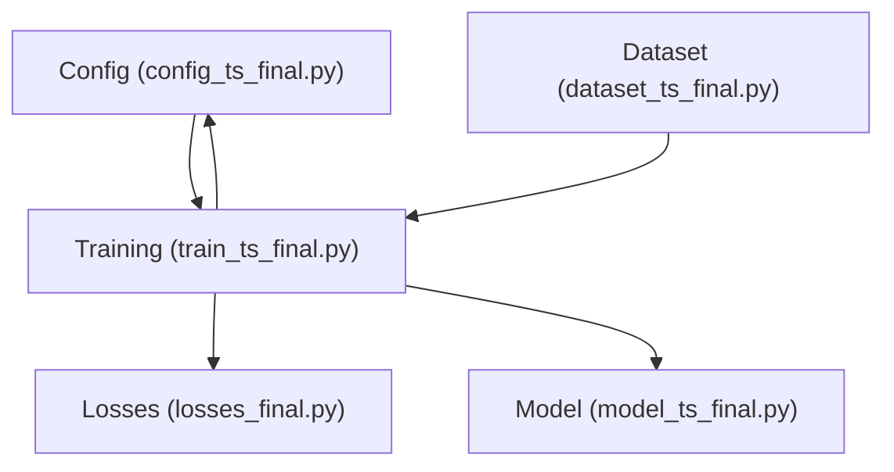
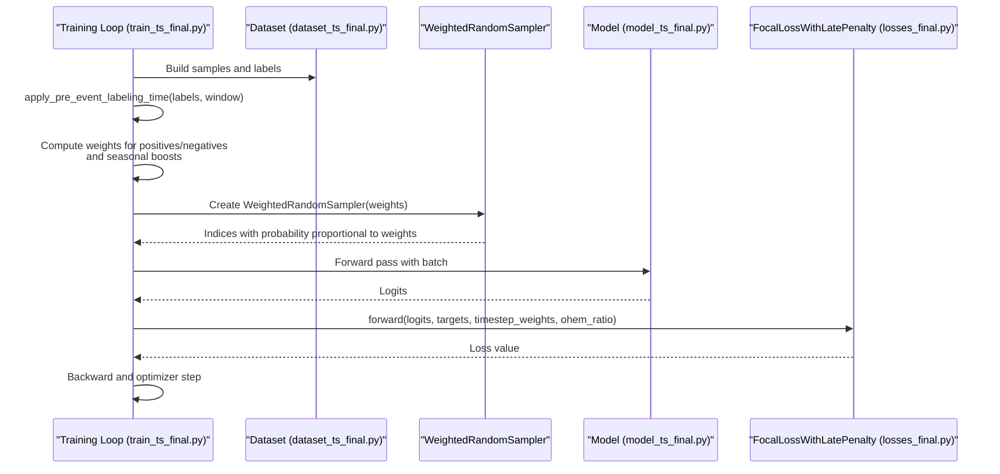
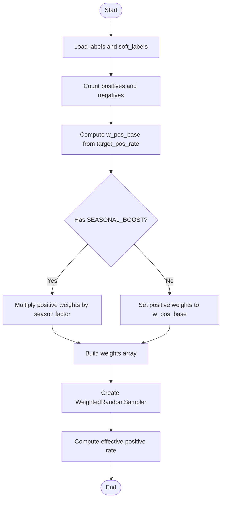
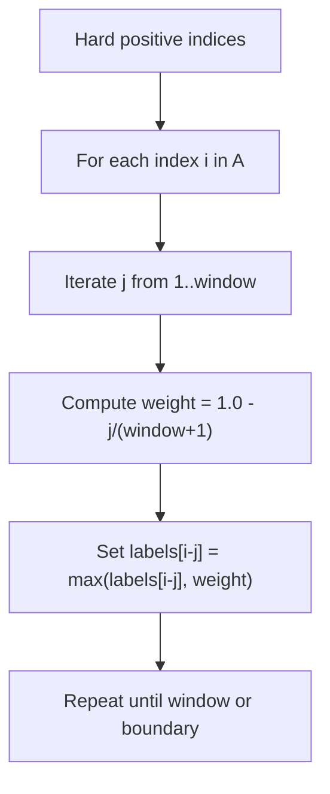
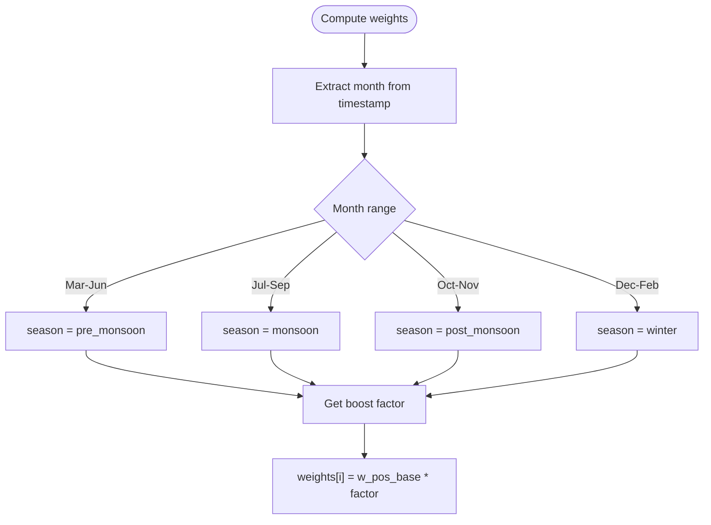
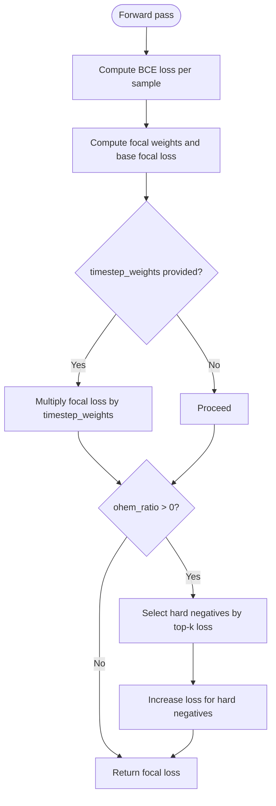
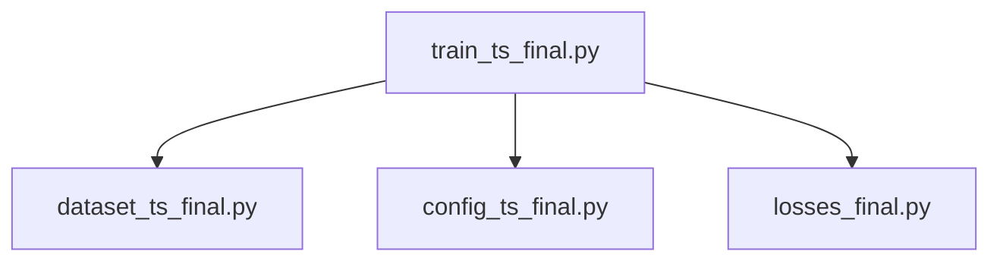

# Class-Balanced Sampling & OHEM

<cite>
**Referenced Files in This Document**
- [config_ts_final.py](file://config_ts_final.py)
- [dataset_ts_final.py](file://dataset_ts_final.py)
- [train_ts_final.py](file://train_ts_final.py)
- [losses_final.py](file://losses_final.py)
- [model_ts_final.py](file://model_ts_final.py)
</cite>

## Table of Contents
1. [Introduction](#introduction)
2. [Project Structure](#project-structure)
3. [Core Components](#core-components)
4. [Architecture Overview](#architecture-overview)
5. [Detailed Component Analysis](#detailed-component-analysis)
6. [Dependency Analysis](#dependency-analysis)
7. [Performance Considerations](#performance-considerations)
8. [Troubleshooting Guide](#troubleshooting-guide)
9. [Conclusion](#conclusion)
10. [Appendices](#appendices)

## Introduction
This document explains the class-balanced sampling and Online Hard Negative Mining (OHEM) implementation used in the Nagpur Thunderstorm Nowcasting pipeline. It covers:
- WeightedRandomSampler configuration with target_pos_rate
- Effective positive rate calculations and weight-based sampling probabilities
- Pre-event labeling ramp-up using apply_pre_event_labeling_time for soft labels and gradual positive weighting
- Seasonal boosting for Phase 4 thunderstorm seasons via SEASONAL_BOOST configuration
- OHEM ratio parameter usage for false alarm reduction integrated with focal loss penalties
- Sampling weight calculations, positive/negative class balancing algorithms, and dynamic weight adjustments based on seasonality
- Configuration examples for different SAMPLER_POS_RATE values, seasonal boost factors, and OHEM ratio optimization strategies

## Project Structure
The relevant components are distributed across configuration, dataset construction, training loop, and loss modules:
- Configuration defines hyperparameters for sampling, seasonality, and OHEM
- Dataset utilities provide soft labeling and sample building
- Training orchestrates sampling, loss application, and evaluation
- Loss module implements focal loss with optional OHEM and severity/late penalties

**Diagram sources**
- [config_ts_final.py:16-208](file://config_ts_final.py#L16-L208)
- [dataset_ts_final.py:26-37](file://dataset_ts_final.py#L26-L37)
- [train_ts_final.py:142-757](file://train_ts_final.py#L142-L757)
- [losses_final.py:13-92](file://losses_final.py#L13-L92)
- [model_ts_final.py:68-335](file://model_ts_final.py#L68-L335)

**Section sources**
- [config_ts_final.py:16-208](file://config_ts_final.py#L16-L208)
- [dataset_ts_final.py:26-37](file://dataset_ts_final.py#L26-L37)
- [train_ts_final.py:142-757](file://train_ts_final.py#L142-L757)
- [losses_final.py:13-92](file://losses_final.py#L13-L92)
- [model_ts_final.py:68-335](file://model_ts_final.py#L68-L335)

## Core Components
- WeightedRandomSampler with target_pos_rate: The training loop computes per-sample weights to achieve a desired positive rate while applying seasonal boosts to positive samples.
- Pre-event labeling ramp-up: Soft labels are constructed by gradually increasing label strength leading up to actual storm events.
- Seasonal boosting: Positive sample weights are multiplied by season-specific factors during training.
- OHEM integration: The focal loss module supports Online Hard Negative Mining to reduce false alarms by emphasizing hard negatives.

**Section sources**
- [train_ts_final.py:236-283](file://train_ts_final.py#L236-L283)
- [dataset_ts_final.py:26-37](file://dataset_ts_final.py#L26-L37)
- [config_ts_final.py:53-59](file://config_ts_final.py#L53-L59)
- [losses_final.py:24-92](file://losses_final.py#L24-L92)

## Architecture Overview
The training pipeline applies soft labels, constructs per-sample weights, and feeds them into a weighted sampler. The model’s output is fed into a focal loss with optional OHEM and severity/late penalties.

**Diagram sources**
- [train_ts_final.py:236-283](file://train_ts_final.py#L236-L283)
- [dataset_ts_final.py:26-37](file://dataset_ts_final.py#L26-L37)
- [losses_final.py:24-92](file://losses_final.py#L24-L92)
- [model_ts_final.py:202-268](file://model_ts_final.py#L202-L268)

## Detailed Component Analysis

### WeightedRandomSampler with target_pos_rate
- Purpose: Achieve a target proportion of positive samples per batch despite class imbalance.
- Inputs:
  - labels: binary labels for training samples
  - target_pos_rate: desired fraction of positives in the batch
  - soft_labels: optional soft labels derived from pre-event ramp-up
- Computation:
  - Count positives and negatives
  - Compute base positive weight w_pos_base proportional to target_pos_rate
  - Multiply by seasonal boost factor for positive samples
  - Leave negative weights at 1.0
  - Construct weights array and pass to WeightedRandomSampler
- Effective positive rate:
  - Derived from the weighted counts: (pos_count * w_pos_base) / (pos_count * w_pos_base + neg_count)

**Diagram sources**
- [train_ts_final.py:244-276](file://train_ts_final.py#L244-L276)

**Section sources**
- [train_ts_final.py:244-276](file://train_ts_final.py#L244-L276)

### Pre-event Labeling Ramp-up
- Purpose: Soften the onset of storm labels to encourage learning of early precursors and reduce abrupt transitions.
- Mechanism:
  - For each hard positive index, propagate a ramp-up of label strength backward over a window
  - The ramp decreases linearly from 1.0 to 0.0 over the window length
- Impact:
  - Provides soft supervision for frames immediately preceding storms
  - Reduces over-reliance on hard boundaries and improves robustness

**Diagram sources**
- [dataset_ts_final.py:26-37](file://dataset_ts_final.py#L26-L37)

**Section sources**
- [dataset_ts_final.py:26-37](file://dataset_ts_final.py#L26-L37)

### Seasonal Boosting (Phase 4)
- Purpose: Increase emphasis on positive samples during seasons with higher thunderstorm activity.
- Configuration:
  - SEASONAL_BOOST maps months to boost factors
  - Factors: pre_monsoon, monsoon, post_monsoon, winter
- Application:
  - During sampler weight computation, positive samples are multiplied by the season-specific factor
  - This increases their selection probability during weighted sampling

**Diagram sources**
- [train_ts_final.py:254-268](file://train_ts_final.py#L254-L268)
- [config_ts_final.py:53-59](file://config_ts_final.py#L53-L59)

**Section sources**
- [train_ts_final.py:254-268](file://train_ts_final.py#L254-L268)
- [config_ts_final.py:53-59](file://config_ts_final.py#L53-L59)

### OHEM Integration with Focal Loss
- Purpose: Reduce false alarms by focusing on hard negatives during training.
- Implementation:
  - The focal loss accepts an ohem_ratio parameter
  - For each batch, among negative samples, select the top-K hardest by loss magnitude
  - Boost the loss contribution of these hard negatives by a fixed multiplier
- Benefits:
  - Improves robustness against easy negatives
  - Helps reduce false alarms without overfitting to noise

**Diagram sources**
- [losses_final.py:24-92](file://losses_final.py#L24-L92)

**Section sources**
- [losses_final.py:24-92](file://losses_final.py#L24-L92)

### Dynamic Weight Adjustment Based on Seasonality
- Positive weights are adjusted based on:
  - Target positive rate (SAMPLER_POS_RATE)
  - Actual counts of positives and negatives
  - Seasonal boost factors
- The effective positive rate is recalculated to reflect the weighted sampling distribution
- This ensures the sampler maintains the intended balance even as seasonality modifies positive emphasis

**Section sources**
- [train_ts_final.py:244-276](file://train_ts_final.py#L244-L276)

### Configuration Examples and Tuning Strategies
Below are practical configuration examples and tuning strategies aligned with the documented components:

- SAMPLER_POS_RATE
  - Example values: 0.15 (default), 0.20, 0.10
  - Effect: Controls the target fraction of positives in batches; higher values increase positive emphasis
  - Guidance: Start with defaults and adjust based on validation metrics; monitor false alarm rates and event detection quality

- Seasonal Boost Factors (SEASONAL_BOOST)
  - Example factors:
    - pre_monsoon: 1.5
    - monsoon: 1.0
    - post_monsoon: 3.0
    - winter: 2.0
  - Effect: Increases positive sample selection probability during high-activity seasons
  - Guidance: Calibrate per season; ensure coverage of all seasons in training data

- OHEM Ratio (OHEM_RATIO)
  - Example values: 0.05 (default), 0.02, 0.10
  - Effect: Controls the fraction of hard negatives selected for loss amplification
  - Guidance: Lower ratios reduce false alarm risk; higher ratios increase focus on hard negatives but risk overfitting

- Late Penalty and Severity Weighting
  - Late penalty and severity weights are combined additively to modulate loss per sample
  - They complement OHEM by emphasizing timely detections and severe events

**Section sources**
- [config_ts_final.py:122-123](file://config_ts_final.py#L122-L123)
- [config_ts_final.py:53-59](file://config_ts_final.py#L53-L59)
- [train_ts_final.py:432-436](file://train_ts_final.py#L432-L436)

## Dependency Analysis
The training loop depends on dataset utilities for soft labels, configuration for hyperparameters, and the loss module for OHEM integration.

**Diagram sources**
- [train_ts_final.py:142-757](file://train_ts_final.py#L142-L757)
- [dataset_ts_final.py:26-37](file://dataset_ts_final.py#L26-L37)
- [config_ts_final.py:16-208](file://config_ts_final.py#L16-L208)
- [losses_final.py:13-92](file://losses_final.py#L13-L92)

**Section sources**
- [train_ts_final.py:142-757](file://train_ts_final.py#L142-L757)
- [dataset_ts_final.py:26-37](file://dataset_ts_final.py#L26-L37)
- [config_ts_final.py:16-208](file://config_ts_final.py#L16-L208)
- [losses_final.py:13-92](file://losses_final.py#L13-L92)

## Performance Considerations
- Weighted sampling reduces over-reliance on majority class samples, improving minority class detection.
- OHEM focuses training on hard negatives, reducing false alarms without discarding negative samples.
- Seasonal boosting aligns training emphasis with observed activity patterns, improving generalization across seasons.
- Soft pre-event labeling smooths label transitions, aiding early detection learning.

## Troubleshooting Guide
- Symptom: Excessively high false alarms
  - Action: Reduce OHEM_RATIO; consider lowering SAMPLER_POS_RATE; review season factors
- Symptom: Poor detection of weak storms
  - Action: Increase SAMPLER_POS_RATE; reduce season boost for low-activity periods; verify soft labeling window
- Symptom: Overfitting to hard negatives
  - Action: Decrease OHEM_RATIO; ensure adequate negative coverage; monitor validation metrics

**Section sources**
- [train_ts_final.py:432-436](file://train_ts_final.py#L432-L436)
- [config_ts_final.py:122-123](file://config_ts_final.py#L122-L123)
- [config_ts_final.py:53-59](file://config_ts_final.py#L53-L59)

## Conclusion
The pipeline combines class-balanced sampling with seasonal boosting and OHEM to improve detection of thunderstorms while controlling false alarms. The WeightedRandomSampler targets a configurable positive rate, soft labels ease the learning of early precursors, and OHEM focuses training on hard negatives. Seasonal factors dynamically adjust positive emphasis across the year. These components work together to produce robust, reliable nowcasting performance.

## Appendices
- Additional Notes:
  - The model integrates multiple heads and optional uncertainty components; the classification head is used for the primary task.
  - The training loop supports multiple loss variants and schedules; the focal loss with OHEM is the primary objective.

**Section sources**
- [model_ts_final.py:68-335](file://model_ts_final.py#L68-L335)
- [train_ts_final.py:285-314](file://train_ts_final.py#L285-L314)