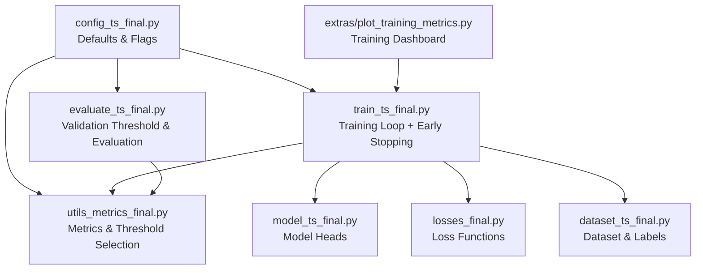
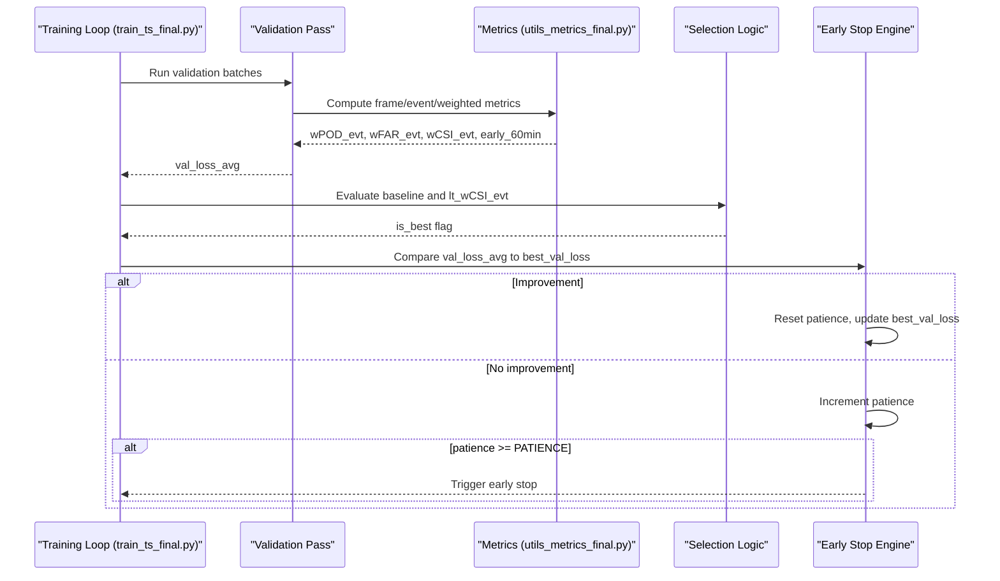
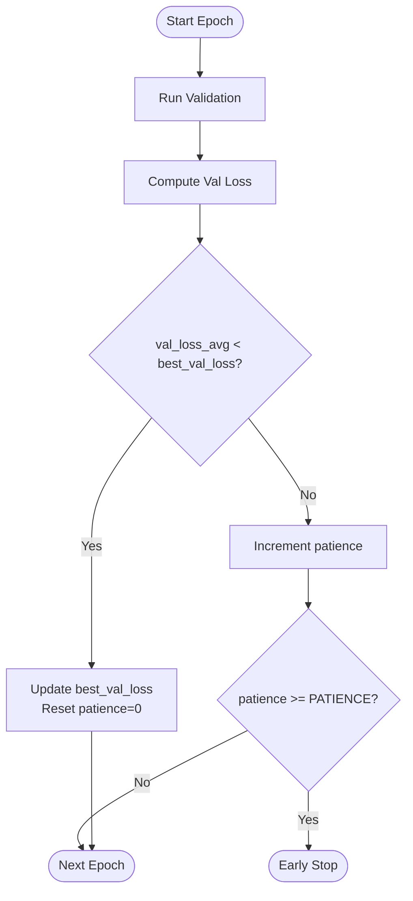
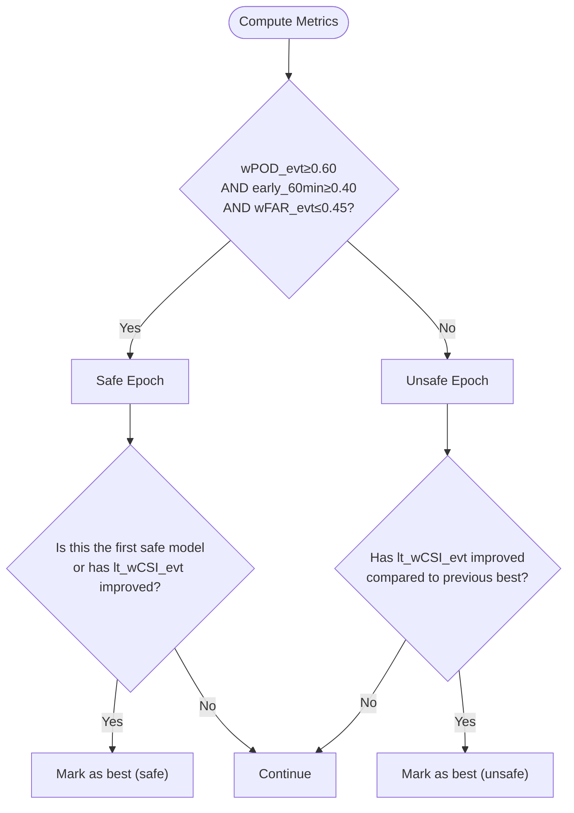
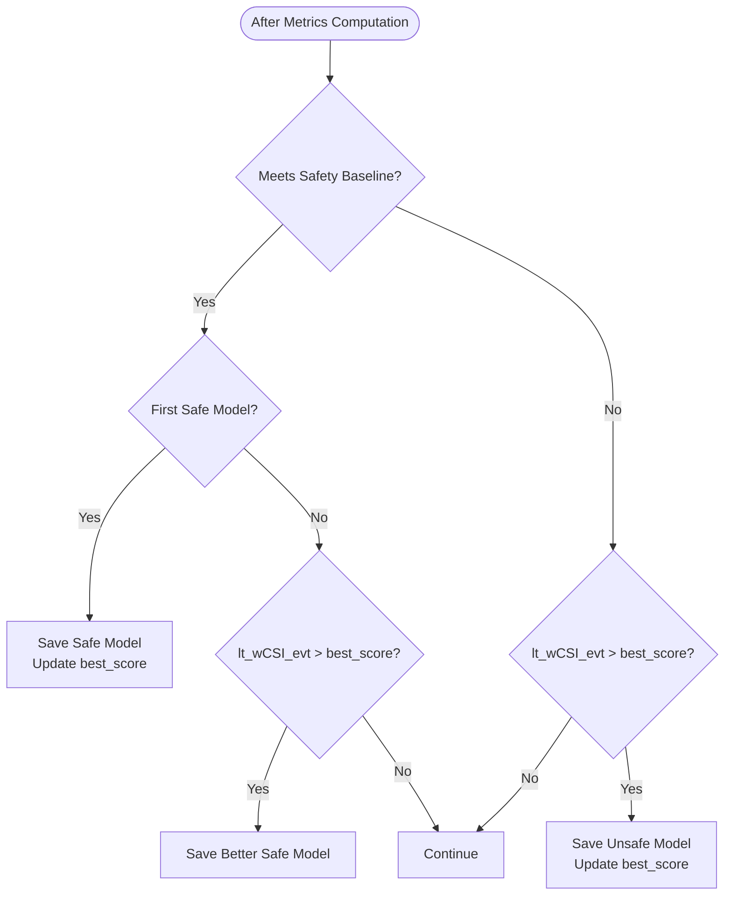
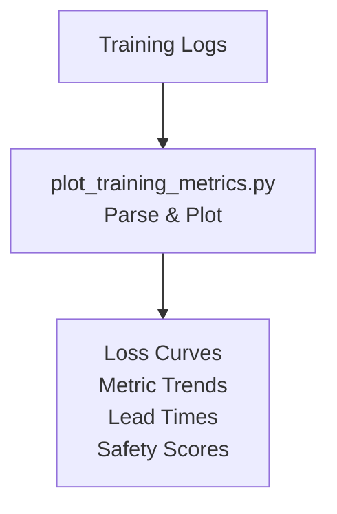
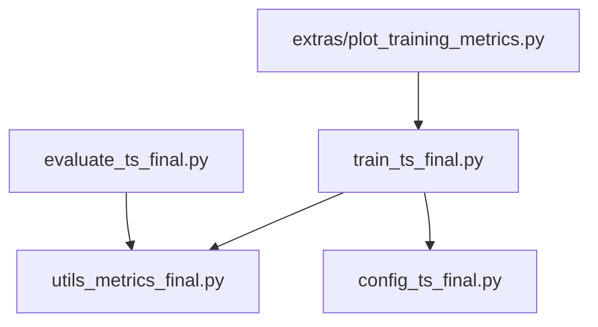

# Early Stopping & Convergence Monitoring

<cite>
**Referenced Files in This Document**
- [train_ts_final.py](file://train_ts_final.py)
- [utils_metrics_final.py](file://utils_metrics_final.py)
- [config_ts_final.py](file://config_ts_final.py)
- [plot_training_metrics.py](file://extras/plot_training_metrics.py)
- [evaluate_ts_final.py](file://evaluate_ts_final.py)
- [model_ts_final.py](file://model_ts_final.py)
- [losses_final.py](file://losses_final.py)
- [dataset_ts_final.py](file://dataset_ts_final.py)
</cite>

## Table of Contents
1. [Introduction](#introduction)
2. [Project Structure](#project-structure)
3. [Core Components](#core-components)
4. [Architecture Overview](#architecture-overview)
5. [Detailed Component Analysis](#detailed-component-analysis)
6. [Dependency Analysis](#dependency-analysis)
7. [Performance Considerations](#performance-considerations)
8. [Troubleshooting Guide](#troubleshooting-guide)
9. [Conclusion](#conclusion)
10. [Appendices](#appendices)

## Introduction
This document explains the early stopping criteria and convergence monitoring systems used in the Nagpur Thunderstorm Nowcasting pipeline. It covers:
- Patience-based termination with configurable PATIENCE parameters
- Best validation loss tracking and improvement thresholds
- Dual criteria system combining validation loss monitoring with operational safety baselines (wPOD_evt ≥ 0.60, early_60min ≥ 0.40, wFAR_evt ≤ 0.45)
- Model selection logic prioritizing operational safety followed by lt_wCSI_evt maximization
- Convergence indicators including loss curves, metric plateaus, and training/validation loss gaps
- Early stopping configuration examples, convergence analysis techniques, and diagnostic tools
- Troubleshooting guidance for premature stopping, convergence detection issues, and model selection optimization strategies

## Project Structure
The early stopping and convergence monitoring system spans several modules:
- Training loop and checkpointing: [train_ts_final.py](file://train_ts_final.py)
- Metrics computation and selection: [utils_metrics_final.py](file://utils_metrics_final.py)
- Configuration and defaults: [config_ts_final.py](file://config_ts_final.py)
- Training visualization and diagnostics: [extras/plot_training_metrics.py](file://extras/plot_training_metrics.py)
- Evaluation and threshold selection: [evaluate_ts_final.py](file://evaluate_ts_final.py)
- Model architecture and heads: [model_ts_final.py](file://model_ts_final.py)
- Loss functions and weighting: [losses_final.py](file://losses_final.py)
- Dataset and labeling: [dataset_ts_final.py](file://dataset_ts_final.py)

**Diagram sources**
- [train_ts_final.py:142-757](file://train_ts_final.py#L142-L757)
- [utils_metrics_final.py:192-760](file://utils_metrics_final.py#L192-L760)
- [config_ts_final.py:16-208](file://config_ts_final.py#L16-L208)
- [evaluate_ts_final.py:361-908](file://evaluate_ts_final.py#L361-L908)
- [plot_training_metrics.py:25-464](file://extras/plot_training_metrics.py#L25-L464)
- [model_ts_final.py:68-335](file://model_ts_final.py#L68-L335)
- [losses_final.py:13-200](file://losses_final.py#L13-L200)
- [dataset_ts_final.py:47-200](file://dataset_ts_final.py#L47-L200)

**Section sources**
- [train_ts_final.py:142-757](file://train_ts_final.py#L142-L757)
- [utils_metrics_final.py:192-760](file://utils_metrics_final.py#L192-L760)
- [config_ts_final.py:16-208](file://config_ts_final.py#L16-L208)
- [evaluate_ts_final.py:361-908](file://evaluate_ts_final.py#L361-L908)
- [plot_training_metrics.py:25-464](file://extras/plot_training_metrics.py#L25-L464)
- [model_ts_final.py:68-335](file://model_ts_final.py#L68-L335)
- [losses_final.py:13-200](file://losses_final.py#L13-L200)
- [dataset_ts_final.py:47-200](file://dataset_ts_final.py#L47-L200)

## Core Components
- Early stopping engine: Tracks best validation loss and increments patience when validation loss does not improve for PATIENCE consecutive epochs, then stops training.
- Operational safety baseline: A dual-criteria rule requiring wPOD_evt ≥ 0.60, early_60min ≥ 0.40, and wFAR_evt ≤ 0.45.
- Model selection logic: Among epochs meeting the safety baseline, select the model with the highest lt_wCSI_evt; otherwise, select the best unsafe model by lt_wCSI_evt.
- Convergence monitoring: Uses loss curves, plateau detection, and training/validation gap analysis to guide stopping decisions and diagnose instability.

Key implementation references:
- Early stopping and patience: [train_ts_final.py:712-721](file://train_ts_final.py#L712-L721)
- Best validation loss tracking: [train_ts_final.py:332-333](file://train_ts_final.py#L332-L333)
- Operational safety baseline: [train_ts_final.py:600-601](file://train_ts_final.py#L600-L601)
- Model selection logic: [train_ts_final.py:637-661](file://train_ts_final.py#L637-L661)

**Section sources**
- [train_ts_final.py:332-333](file://train_ts_final.py#L332-L333)
- [train_ts_final.py:600-601](file://train_ts_final.py#L600-L601)
- [train_ts_final.py:637-661](file://train_ts_final.py#L637-L661)
- [train_ts_final.py:712-721](file://train_ts_final.py#L712-L721)

## Architecture Overview
The early stopping and convergence monitoring system integrates with the training loop and metrics computation pipeline.

**Diagram sources**
- [train_ts_final.py:450-721](file://train_ts_final.py#L450-L721)
- [utils_metrics_final.py:575-650](file://utils_metrics_final.py#L575-L650)

## Detailed Component Analysis

### Early Stopping Engine
- Purpose: Terminate training when validation loss fails to improve for PATIENCE epochs.
- Mechanism:
  - Initialize best_val_loss to positive infinity and patience to 0.
  - After each epoch, compare val_loss_avg to best_val_loss.
  - If val_loss_avg < best_val_loss, update best_val_loss and reset patience to 0.
  - Else increment patience by 1.
  - If patience reaches or exceeds PATIENCE, stop training.

**Diagram sources**
- [train_ts_final.py:712-721](file://train_ts_final.py#L712-L721)
- [train_ts_final.py:332-333](file://train_ts_final.py#L332-L333)

**Section sources**
- [train_ts_final.py:332-333](file://train_ts_final.py#L332-L333)
- [train_ts_final.py:712-721](file://train_ts_final.py#L712-L721)

### Operational Safety Baseline
- Dual-criteria rule evaluated each epoch:
  - wPOD_evt ≥ 0.60
  - early_60min ≥ 0.40
  - wFAR_evt ≤ 0.45
- If satisfied, the epoch qualifies as “safe.”
- Model selection prioritizes safety first, then selects the best among safe models by lt_wCSI_evt.

**Diagram sources**
- [train_ts_final.py:600-601](file://train_ts_final.py#L600-L601)
- [train_ts_final.py:637-661](file://train_ts_final.py#L637-L661)

**Section sources**
- [train_ts_final.py:600-601](file://train_ts_final.py#L600-L601)
- [train_ts_final.py:637-661](file://train_ts_final.py#L637-L661)

### Model Selection Logic
- Primary selection: Among epochs meeting the safety baseline, pick the model with the highest lt_wCSI_evt.
- Secondary selection: If no safe model has been found yet, pick the best unsafe model by lt_wCSI_evt.
- The selection logic updates best_score and sets is_best accordingly, triggering model saving and CSV export.

**Diagram sources**
- [train_ts_final.py:637-661](file://train_ts_final.py#L637-L661)

**Section sources**
- [train_ts_final.py:637-661](file://train_ts_final.py#L637-L661)

### Convergence Indicators and Diagnostics
- Loss curves: Track training and validation loss trends; look for stabilization or divergence.
- Metric plateaus: Monitor wCSI_evt, wPOD_evt, wFAR_evt, and early_60min for stagnation.
- Training/validation loss gaps: Large gaps indicate overfitting; small gaps suggest good generalization.
- Diagnostic tools:
  - Training dashboard: [extras/plot_training_metrics.py](file://extras/plot_training_metrics.py) parses logs and generates loss/metric panels.
  - Validation threshold selection: [evaluate_ts_final.py](file://evaluate_ts_final.py) computes optimal thresholds on validation data to avoid leakage.

**Diagram sources**
- [plot_training_metrics.py:25-464](file://extras/plot_training_metrics.py#L25-L464)

**Section sources**
- [plot_training_metrics.py:25-464](file://extras/plot_training_metrics.py#L25-L464)
- [evaluate_ts_final.py:502-574](file://evaluate_ts_final.py#L502-L574)

### Configuration and Tuning
- PATIENCE controls early stopping sensitivity; default is configured in [config_ts_final.py](file://config_ts_final.py#L44).
- Threshold metric selection influences model selection; default is lt-wCSI_evt in [config_ts_final.py](file://config_ts_final.py#L92).
- Persistence and smoothing parameters affect metric stability; see [config_ts_final.py:88-94](file://config_ts_final.py#L88-L94).

**Section sources**
- [config_ts_final.py:44](file://config_ts_final.py#L44)
- [config_ts_final.py:92](file://config_ts_final.py#L92)
- [config_ts_final.py:88-94](file://config_ts_final.py#L88-L94)

## Dependency Analysis
- Early stopping depends on validation loss computation and checkpointing; implemented in [train_ts_final.py](file://train_ts_final.py).
- Metrics computation for selection and safety checks are implemented in [utils_metrics_final.py](file://utils_metrics_final.py).
- Configuration defaults and flags are centralized in [config_ts_final.py](file://config_ts_final.py).
- Visualization and diagnostics rely on [extras/plot_training_metrics.py](file://extras/plot_training_metrics.py).
- Evaluation threshold selection is handled in [evaluate_ts_final.py](file://evaluate_ts_final.py).

**Diagram sources**
- [train_ts_final.py:142-757](file://train_ts_final.py#L142-L757)
- [utils_metrics_final.py:192-760](file://utils_metrics_final.py#L192-L760)
- [config_ts_final.py:16-208](file://config_ts_final.py#L16-L208)
- [evaluate_ts_final.py:361-908](file://evaluate_ts_final.py#L361-L908)
- [plot_training_metrics.py:25-464](file://extras/plot_training_metrics.py#L25-L464)

**Section sources**
- [train_ts_final.py:142-757](file://train_ts_final.py#L142-L757)
- [utils_metrics_final.py:192-760](file://utils_metrics_final.py#L192-L760)
- [config_ts_final.py:16-208](file://config_ts_final.py#L16-L208)
- [evaluate_ts_final.py:361-908](file://evaluate_ts_final.py#L361-L908)
- [plot_training_metrics.py:25-464](file://extras/plot_training_metrics.py#L25-L464)

## Performance Considerations
- Patience tuning: Higher PATIENCE allows more exploration but risks overfitting; lower PATIENCE prevents overfitting but may stop prematurely.
- Metric selection: Using lt_wCSI_evt as the primary selection metric encourages lead-time awareness and balanced performance.
- Stability: Operational safety baseline ensures acceptable operational performance before optimizing pure skill metrics.

[No sources needed since this section provides general guidance]

## Troubleshooting Guide
- Premature stopping:
  - Symptoms: Training stops before reaching peak performance.
  - Causes: Low PATIENCE, unstable validation loss, or overly strict safety baseline.
  - Actions: Increase PATIENCE, monitor loss curves, relax baseline thresholds cautiously, and verify convergence diagnostics.
  - References: [train_ts_final.py:712-721](file://train_ts_final.py#L712-L721), [config_ts_final.py:44](file://config_ts_final.py#L44)

- Convergence detection issues:
  - Symptoms: Loss curves oscillate or fail to stabilize.
  - Causes: Instability in learning rate schedule, insufficient smoothing, or noisy metrics.
  - Actions: Use the training dashboard to visualize loss and metrics; adjust smoothing window and learning rate schedule; ensure consistent threshold selection on validation data.
  - References: [plot_training_metrics.py:278-436](file://extras/plot_training_metrics.py#L278-L436), [evaluate_ts_final.py:502-574](file://evaluate_ts_final.py#L502-L574)

- Model selection optimization:
  - Symptoms: Best model lacks safety or poor operational performance.
  - Causes: Prioritizing skill metrics without safety constraints.
  - Actions: Enforce safety baseline before selecting by skill; if no safe model emerges, investigate data quality and loss function weighting.
  - References: [train_ts_final.py:600-601](file://train_ts_final.py#L600-L601), [train_ts_final.py:637-661](file://train_ts_final.py#L637-L661)

**Section sources**
- [train_ts_final.py:712-721](file://train_ts_final.py#L712-L721)
- [config_ts_final.py:44](file://config_ts_final.py#L44)
- [plot_training_metrics.py:278-436](file://extras/plot_training_metrics.py#L278-L436)
- [evaluate_ts_final.py:502-574](file://evaluate_ts_final.py#L502-L574)
- [train_ts_final.py:600-601](file://train_ts_final.py#L600-L601)
- [train_ts_final.py:637-661](file://train_ts_final.py#L637-L661)

## Conclusion
The Nagpur TS Nowcasting pipeline implements a robust early stopping system that:
- Uses patience-based termination on validation loss to prevent overfitting
- Enforces an operational safety baseline to ensure acceptable performance
- Prioritizes model selection by operational safety first, then by skill (lt_wCSI_evt)
- Provides comprehensive diagnostics via training logs and visualization tools

Proper configuration of PATIENCE and careful interpretation of convergence indicators are essential for stable and reliable training outcomes.

[No sources needed since this section summarizes without analyzing specific files]

## Appendices

### Early Stopping Configuration Examples
- Adjust PATIENCE in [config_ts_final.py](file://config_ts_final.py#L44) to control stopping sensitivity.
- Choose selection metric in [config_ts_final.py](file://config_ts_final.py#L92) to align with operational goals.
- Review training logs and use the dashboard in [extras/plot_training_metrics.py](file://extras/plot_training_metrics.py) to validate convergence.

**Section sources**
- [config_ts_final.py:44](file://config_ts_final.py#L44)
- [config_ts_final.py:92](file://config_ts_final.py#L92)
- [plot_training_metrics.py:25-464](file://extras/plot_training_metrics.py#L25-L464)

### Convergence Analysis Techniques
- Inspect loss curves and metric trends using [extras/plot_training_metrics.py](file://extras/plot_training_metrics.py).
- Validate threshold selection on the validation set in [evaluate_ts_final.py](file://evaluate_ts_final.py) to avoid leakage.
- Monitor operational safety metrics (wPOD_evt, early_60min, wFAR_evt) during training in [train_ts_final.py](file://train_ts_final.py).

**Section sources**
- [plot_training_metrics.py:25-464](file://extras/plot_training_metrics.py#L25-L464)
- [evaluate_ts_final.py:502-574](file://evaluate_ts_final.py#L502-L574)
- [train_ts_final.py:600-601](file://train_ts_final.py#L600-L601)