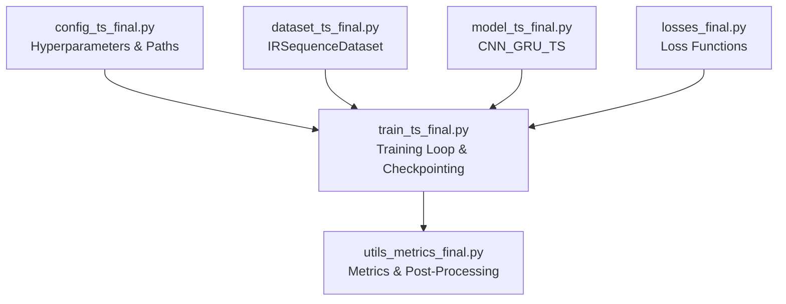
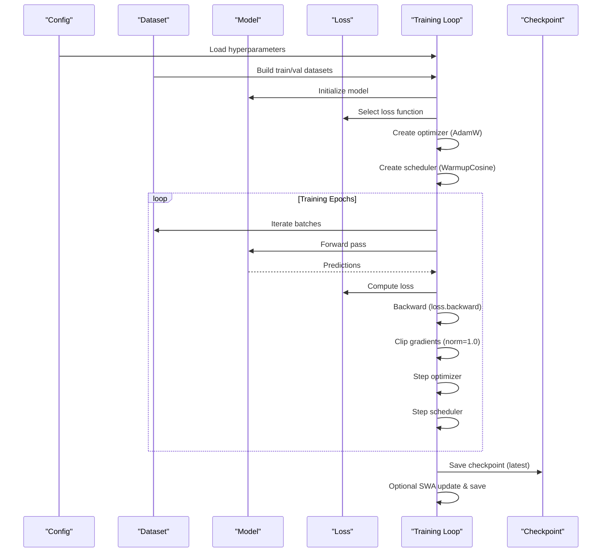
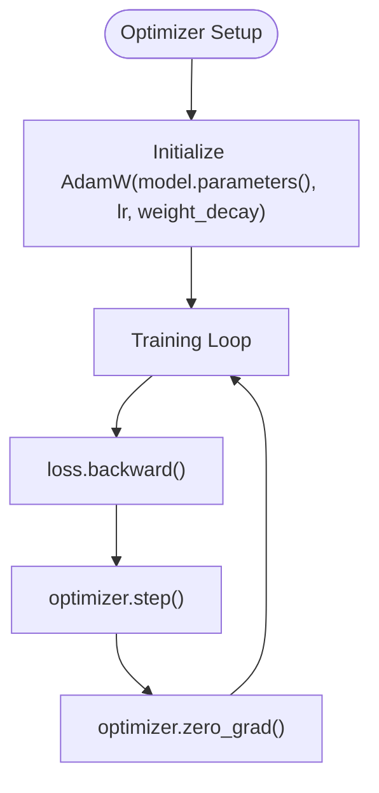
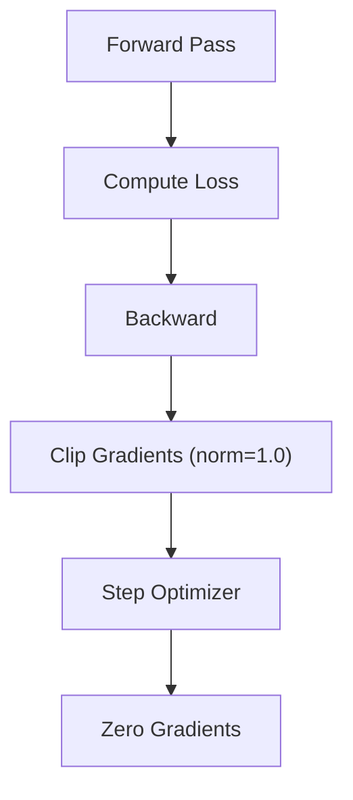
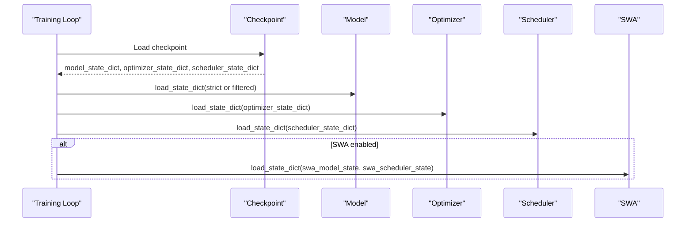
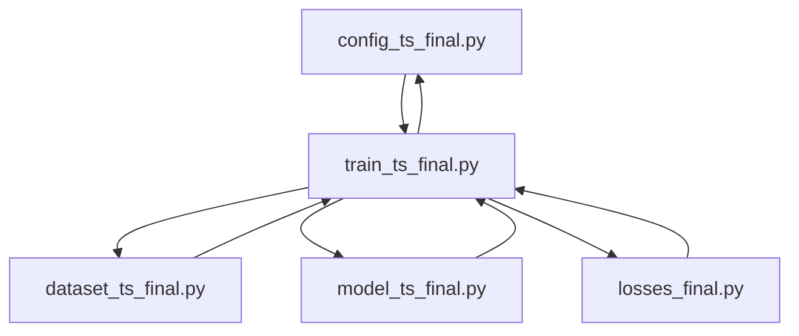

# Gradient Management & Optimization

<cite>
**Referenced Files in This Document**
- [train_ts_final.py](file://train_ts_final.py)
- [model_ts_final.py](file://model_ts_final.py)
- [config_ts_final.py](file://config_ts_final.py)
- [losses_final.py](file://losses_final.py)
- [utils_metrics_final.py](file://utils_metrics_final.py)
- [dataset_ts_final.py](file://dataset_ts_final.py)
</cite>

## Table of Contents
1. [Introduction](#introduction)
2. [Project Structure](#project-structure)
3. [Core Components](#core-components)
4. [Architecture Overview](#architecture-overview)
5. [Detailed Component Analysis](#detailed-component-analysis)
6. [Dependency Analysis](#dependency-analysis)
7. [Performance Considerations](#performance-considerations)
8. [Troubleshooting Guide](#troubleshooting-guide)
9. [Conclusion](#conclusion)

## Introduction
This document provides comprehensive guidance on gradient management and optimization strategies used in the training system. It covers AdamW optimizer configuration, gradient clipping, parameter group management, mixed precision considerations, gradient accumulation strategies, optimizer state handling during checkpoint resumption, gradient flow analysis, exploding/vanishing gradient detection, adaptive clipping strategies, hyperparameter tuning guidelines, convergence monitoring techniques, and performance profiling methods. It also includes troubleshooting advice for common optimization issues such as NaN gradients, optimizer state corruption, and convergence stalls.

## Project Structure
The training system is organized around a modular pipeline:
- Configuration defines training hyperparameters, model architecture, and loss functions.
- The model encapsulates the CNN-GRU architecture with optional optical flow, METAR features, and time features.
- Loss modules implement focal loss variants, temporal consistency, heteroscedastic uncertainty, and intensity regression.
- Training script orchestrates data loading, model initialization, optimizer/scheduler setup, training/validation loops, checkpointing, and SWA integration.
- Metrics utilities support temporal smoothing, persistence filtering, and event-based evaluation.

**Diagram sources**
- [config_ts_final.py:16-208](file://config_ts_final.py#L16-L208)
- [dataset_ts_final.py:47-200](file://dataset_ts_final.py#L47-L200)
- [model_ts_final.py:68-335](file://model_ts_final.py#L68-L335)
- [losses_final.py:13-258](file://losses_final.py#L13-L258)
- [train_ts_final.py:142-757](file://train_ts_final.py#L142-L757)
- [utils_metrics_final.py:1-200](file://utils_metrics_final.py#L1-L200)

**Section sources**
- [train_ts_final.py:142-757](file://train_ts_final.py#L142-L757)
- [config_ts_final.py:16-208](file://config_ts_final.py#L16-L208)
- [model_ts_final.py:68-335](file://model_ts_final.py#L68-L335)
- [losses_final.py:13-258](file://losses_final.py#L13-L258)
- [dataset_ts_final.py:47-200](file://dataset_ts_final.py#L47-L200)
- [utils_metrics_final.py:1-200](file://utils_metrics_final.py#L1-L200)

## Core Components
- AdamW Optimizer: Initialized with configurable learning rate and weight decay. The training loop applies gradient clipping and steps the optimizer after backward propagation.
- Gradient Clipping: Norm-based clipping is applied globally across model parameters to stabilize training.
- Parameter Group Management: The optimizer operates on model.parameters() without explicit per-layer grouping in the current implementation.
- Mixed Precision: Not implemented in the training script; training runs in full precision.
- Gradient Accumulation: Not implemented; gradients are applied immediately after each batch.
- Checkpoint Resumption: Loads model, optimizer, scheduler, and SWA states; includes compatibility filtering for dynamic channel changes.
- Gradient Flow Analysis: The training loop records learning rate and tracks loss metrics; gradient magnitudes are indirectly monitored via clipping thresholds and loss stability.
- Adaptive Clipping Strategies: Not implemented; fixed norm clipping is used.
- Hyperparameter Tuning Guidelines: Derived from configuration and training behavior; includes learning rate, weight decay, and loss-specific parameters.
- Convergence Monitoring: Tracks training/validation loss, operational baseline metrics, and early stopping.
- Performance Profiling: Not implemented; logging captures timing and metrics.

**Section sources**
- [train_ts_final.py:313-447](file://train_ts_final.py#L313-L447)
- [train_ts_final.py:335-378](file://train_ts_final.py#L335-L378)
- [config_ts_final.py:39-46](file://config_ts_final.py#L39-L46)
- [losses_final.py:13-92](file://losses_final.py#L13-L92)

## Architecture Overview
The training pipeline integrates configuration-driven model construction, loss computation, and optimization with checkpointing and SWA.

**Diagram sources**
- [train_ts_final.py:285-314](file://train_ts_final.py#L285-L314)
- [train_ts_final.py:386-728](file://train_ts_final.py#L386-L728)
- [train_ts_final.py:694-710](file://train_ts_final.py#L694-L710)

## Detailed Component Analysis

### AdamW Optimizer Configuration and Weight Decay
- Initialization: AdamW is created with model parameters, learning rate, and weight decay from configuration.
- Weight Decay Behavior: Weight decay is applied to parameters during updates, promoting generalization and preventing overfitting.
- Parameter Groups: No explicit parameter grouping is used; the optimizer operates on all parameters uniformly.

**Diagram sources**
- [train_ts_final.py:313](file://train_ts_final.py#L313)
- [train_ts_final.py:403](file://train_ts_final.py#L403)
- [train_ts_final.py:447](file://train_ts_final.py#L447)

**Section sources**
- [train_ts_final.py:313](file://train_ts_final.py#L313)
- [config_ts_final.py:42-43](file://config_ts_final.py#L42-L43)

### Gradient Clipping Implementation
- Norm-Based Clipping: Gradients are clipped globally using a fixed norm threshold to prevent exploding gradients.
- Placement: Clipping occurs after backward propagation and before optimizer step.
- Threshold: The clipping norm is set to a fixed value in the training loop.

**Diagram sources**
- [train_ts_final.py:445](file://train_ts_final.py#L445)
- [train_ts_final.py:447](file://train_ts_final.py#L447)

**Section sources**
- [train_ts_final.py:445](file://train_ts_final.py#L445)

### Parameter Group Management
- Current Implementation: The optimizer is initialized with model.parameters() without explicit per-group configuration.
- Implications: Uniform weight decay and learning rate application across all parameters.
- Extension Point: Parameter groups can be introduced by splitting model.named_parameters() and passing separate dictionaries to the optimizer constructor.

**Section sources**
- [train_ts_final.py:313](file://train_ts_final.py#L313)

### Mixed Precision Considerations
- Current Status: Mixed precision (automatic differentiation) is not implemented in the training script.
- Impact: Training runs in full precision, which is computationally heavier but avoids numerical instability risks associated with AMP.
- Future Consideration: If mixed precision is adopted, ensure proper gradient scaling and dtype handling for all components.

**Section sources**
- [train_ts_final.py:445](file://train_ts_final.py#L445)

### Gradient Accumulation Strategies
- Current Status: Gradient accumulation is not implemented; gradients are applied immediately after each batch.
- Memory Efficiency: Larger batch sizes are used to improve gradient stability; gradient accumulation could enable larger effective batch sizes without increasing memory footprint.
- Alternative: Using gradient accumulation would require accumulating gradients across multiple mini-batches before stepping the optimizer.

**Section sources**
- [train_ts_final.py:403](file://train_ts_final.py#L403)

### Optimizer State Handling During Checkpoint Resumption
- Loading States: The training script loads model, optimizer, scheduler, and SWA states from checkpoints.
- Compatibility Handling: If strict loading fails due to dynamic channel changes, the code filters compatible tensors and loads them partially.
- SWA State: SWA model and scheduler states are conditionally loaded; on failure, they are reset.

**Diagram sources**
- [train_ts_final.py:339-378](file://train_ts_final.py#L339-L378)

**Section sources**
- [train_ts_final.py:339-378](file://train_ts_final.py#L339-L378)

### Gradient Flow Analysis, Exploding/Vanishing Gradient Detection, and Adaptive Clipping
- Gradient Magnitude Monitoring: The training loop does not compute or log gradient norms directly.
- Indicators: Exploding gradients may manifest as unstable loss or NaN outputs; vanishing gradients may cause slow convergence or trivial solutions.
- Detection Methods:
  - Monitor loss curves and validation metrics for divergence or stagnation.
  - Inspect parameter gradients using hooks or external profiling tools if needed.
- Adaptive Clipping: Not implemented; consider switching to adaptive clipping (e.g., gradient norm scaling) if instability persists.

**Section sources**
- [train_ts_final.py:445](file://train_ts_final.py#L445)

### Optimization Hyperparameters Tuning Guidelines
- Learning Rate: Adjusted based on model complexity and dataset characteristics; the current configuration balances stability and convergence speed.
- Weight Decay: Applied to prevent overfitting; tune based on validation performance.
- Loss-Specific Parameters:
  - Focal loss gamma and alpha: Control focus on hard examples and class balance.
  - Late penalty weight: Encourages timely detection.
  - Label smoothing: Reduces overconfidence.
  - OHEM ratio: Focuses on hard negatives without overfitting.
- Scheduler: Warmup cosine schedule provides stable initial learning rates and gradual decay.

**Section sources**
- [config_ts_final.py:42-67](file://config_ts_final.py#L42-L67)
- [losses_final.py:13-92](file://losses_final.py#L13-L92)
- [train_ts_final.py:80-93](file://train_ts_final.py#L80-L93)

### Convergence Monitoring Techniques
- Metrics: Track training and validation loss, operational baseline metrics (wPOD, wFAR, early detection rate), and aviation score.
- Early Stopping: Implemented based on validation loss to prevent overfitting.
- Selection Criteria: Choose models that meet baseline criteria and maximize weighted CSI.

**Section sources**
- [train_ts_final.py:505-631](file://train_ts_final.py#L505-L631)
- [train_ts_final.py:712-721](file://train_ts_final.py#L712-L721)

### Performance Profiling Methods
- Logging: The training script logs epoch metrics and runtime information.
- Profiling Tools: Consider integrating PyTorch profiler or CUDA events for detailed timing and memory usage analysis.

**Section sources**
- [train_ts_final.py:604-631](file://train_ts_final.py#L604-L631)

## Dependency Analysis
The training loop depends on configuration, dataset, model, and loss modules. The model’s dynamic channel adaptation influences checkpoint compatibility.

**Diagram sources**
- [train_ts_final.py:142-757](file://train_ts_final.py#L142-L757)
- [config_ts_final.py:16-208](file://config_ts_final.py#L16-L208)
- [dataset_ts_final.py:47-200](file://dataset_ts_final.py#L47-L200)
- [model_ts_final.py:68-335](file://model_ts_final.py#L68-L335)
- [losses_final.py:13-258](file://losses_final.py#L13-L258)

**Section sources**
- [train_ts_final.py:142-757](file://train_ts_final.py#L142-L757)
- [config_ts_final.py:16-208](file://config_ts_final.py#L16-L208)
- [model_ts_final.py:68-335](file://model_ts_final.py#L68-L335)
- [losses_final.py:13-258](file://losses_final.py#L13-L258)
- [dataset_ts_final.py:47-200](file://dataset_ts_final.py#L47-L200)

## Performance Considerations
- Batch Size: Larger batches improve gradient stability; ensure GPU/CPU memory capacity.
- Learning Rate Schedule: Warmup followed by cosine decay stabilizes early training.
- Weight Decay: Helps generalize; tune based on validation performance.
- Mixed Precision: Can reduce memory usage and accelerate training; requires careful handling of gradients and loss scaling.
- Gradient Accumulation: Enables larger effective batch sizes without increased memory usage.
- Early Stopping: Prevents overfitting and saves computational resources.

[No sources needed since this section provides general guidance]

## Troubleshooting Guide
- NaN Gradients/Outputs:
  - Reduce learning rate or adjust loss parameters.
  - Verify label smoothing and focal loss parameters.
  - Check for invalid targets or extreme class imbalance.
- Optimizer State Corruption:
  - Ensure checkpoint files are intact; verify state keys.
  - On partial load failures, confirm tensor size compatibility.
- Convergence Stalls:
  - Increase learning rate slightly or adjust scheduler.
  - Introduce gradient accumulation or mixed precision.
  - Review loss function parameters and data quality.
- Exploding Gradients:
  - Confirm gradient clipping threshold is appropriate.
  - Reduce learning rate or increase weight decay.
- Vanishing Gradients:
  - Verify model depth and activation functions.
  - Consider residual connections or normalization improvements.

**Section sources**
- [train_ts_final.py:339-378](file://train_ts_final.py#L339-L378)
- [train_ts_final.py:445](file://train_ts_final.py#L445)

## Conclusion
The training system employs a robust configuration-driven setup with AdamW optimization, fixed norm gradient clipping, and comprehensive checkpointing. While mixed precision and gradient accumulation are not currently implemented, the system’s design allows for straightforward extensions. The provided diagnostics, early stopping, and operational baselines support reliable convergence monitoring. For future enhancements, consider adopting mixed precision, gradient accumulation, and adaptive clipping strategies to further improve training stability and efficiency.