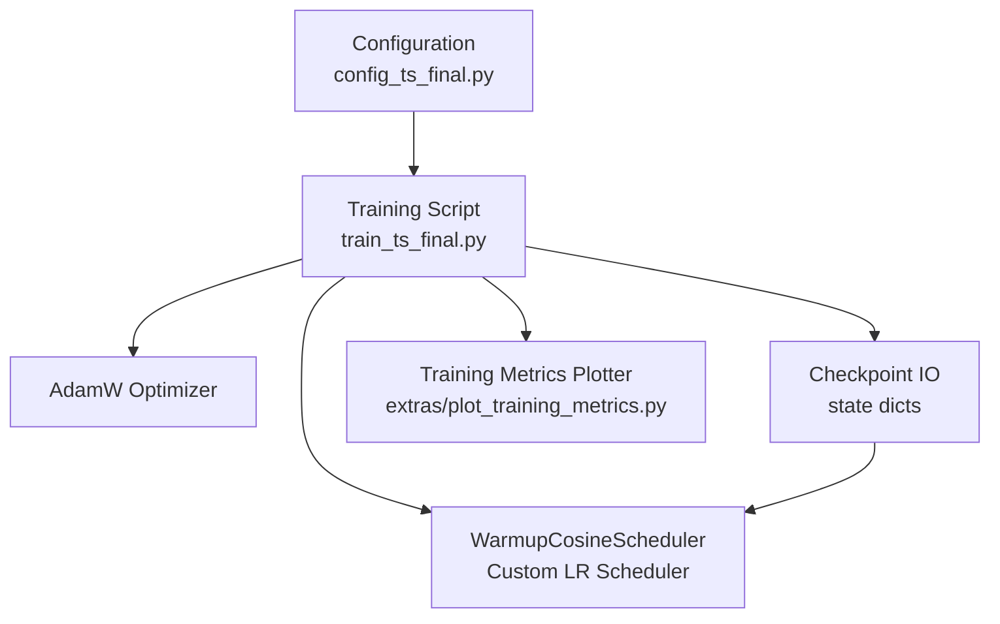
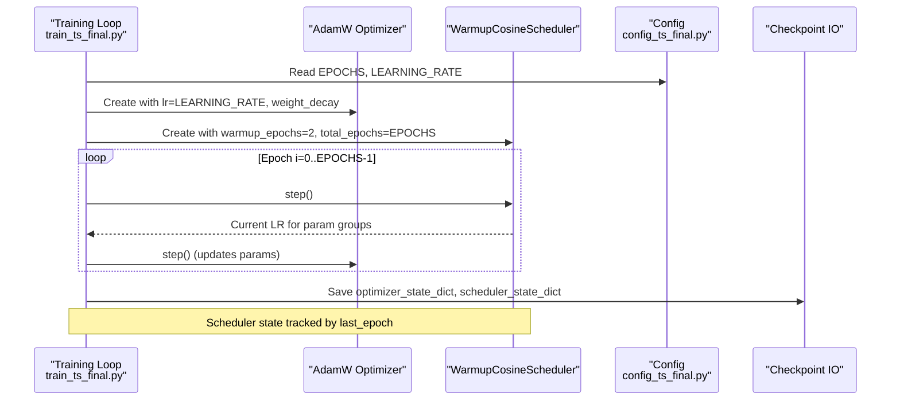
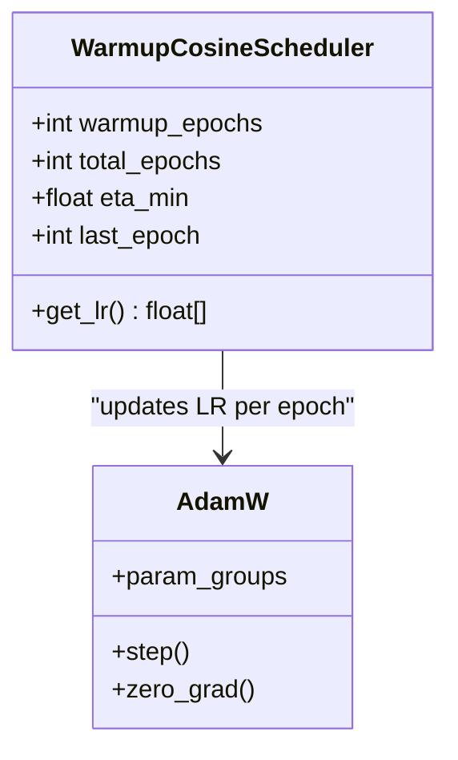
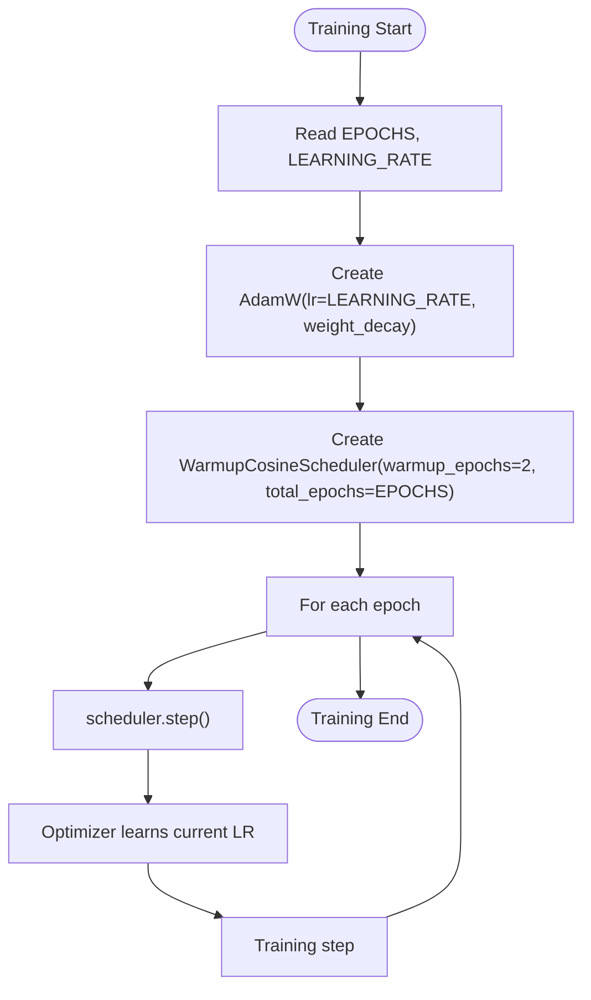
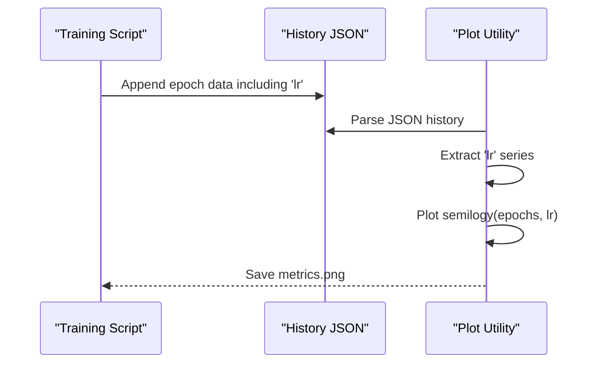
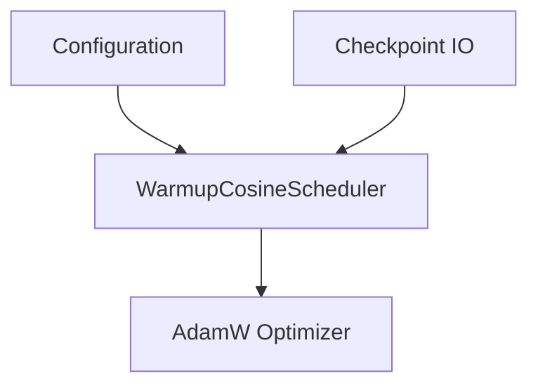

# Learning Rate Scheduling

<cite>
**Referenced Files in This Document**
- [train_ts_final.py](file://train_ts_final.py)
- [config_ts_final.py](file://config_ts_final.py)
- [plot_training_metrics.py](file://extras/plot_training_metrics.py)
</cite>

## Table of Contents
1. [Introduction](#introduction)
2. [Project Structure](#project-structure)
3. [Core Components](#core-components)
4. [Architecture Overview](#architecture-overview)
5. [Detailed Component Analysis](#detailed-component-analysis)
6. [Dependency Analysis](#dependency-analysis)
7. [Performance Considerations](#performance-considerations)
8. [Troubleshooting Guide](#troubleshooting-guide)
9. [Conclusion](#conclusion)
10. [Appendices](#appendices)

## Introduction
This document explains the learning rate scheduling system used in the training pipeline. It focuses on the custom WarmupCosineScheduler implementation, how it integrates with the AdamW optimizer, and how it influences training stability. It also covers configuration, checkpoint state management, and practical guidance for tuning warmup_epochs and total_epochs ratios, visualizing the learning rate curve, and diagnosing common scheduling issues.

## Project Structure
The learning rate scheduling is implemented within the training script and integrated with the optimizer and checkpointing logic. Supporting visualization is provided by a separate plotting utility that reads training history logs.

**Diagram sources**
- [train_ts_final.py:313-314](file://train_ts_final.py#L313-L314)
- [train_ts_final.py:80-93](file://train_ts_final.py#L80-L93)
- [train_ts_final.py:356-362](file://train_ts_final.py#L356-L362)
- [train_ts_final.py:695-710](file://train_ts_final.py#L695-L710)
- [config_ts_final.py:40-46](file://config_ts_final.py#L40-L46)
- [plot_training_metrics.py:306-314](file://extras/plot_training_metrics.py#L306-L314)

**Section sources**
- [train_ts_final.py:313-314](file://train_ts_final.py#L313-L314)
- [train_ts_final.py:80-93](file://train_ts_final.py#L80-L93)
- [train_ts_final.py:356-362](file://train_ts_final.py#L356-L362)
- [train_ts_final.py:695-710](file://train_ts_final.py#L695-L710)
- [config_ts_final.py:40-46](file://config_ts_final.py#L40-L46)
- [plot_training_metrics.py:306-314](file://extras/plot_training_metrics.py#L306-L314)

## Core Components
- WarmupCosineScheduler: A custom PyTorch learning rate scheduler that performs a linear warmup followed by cosine decay to a minimum value.
- AdamW Optimizer: Integrated with the scheduler to receive dynamic learning rates each epoch.
- Configuration: Defines total training epochs and base learning rate used by the scheduler.
- Checkpointing: Saves and restores scheduler state to support resuming training seamlessly.
- Visualization: Plots the LR schedule alongside training metrics.

**Section sources**
- [train_ts_final.py:80-93](file://train_ts_final.py#L80-L93)
- [train_ts_final.py:313-314](file://train_ts_final.py#L313-L314)
- [config_ts_final.py:40-46](file://config_ts_final.py#L40-L46)
- [train_ts_final.py:356-362](file://train_ts_final.py#L356-L362)
- [train_ts_final.py:695-710](file://train_ts_final.py#L695-L710)
- [plot_training_metrics.py:306-314](file://extras/plot_training_metrics.py#L306-L314)

## Architecture Overview
The scheduler is instantiated with warmup_epochs and total_epochs derived from configuration. It computes the current learning rate per epoch and applies it to the optimizer. The scheduler’s state is persisted in checkpoints and restored upon resume.

**Diagram sources**
- [train_ts_final.py:313-314](file://train_ts_final.py#L313-L314)
- [train_ts_final.py:723-728](file://train_ts_final.py#L723-L728)
- [train_ts_final.py:695-710](file://train_ts_final.py#L695-L710)
- [config_ts_final.py:40-46](file://config_ts_final.py#L40-L46)

## Detailed Component Analysis

### WarmupCosineScheduler Implementation
The scheduler defines two phases:
- Linear warmup: LR increases linearly from 0 to base_lr over warmup_epochs.
- Cosine decay: After warmup, LR decays following a cosine curve toward eta_min.

Key parameters:
- warmup_epochs: Number of initial epochs for linear warmup.
- total_epochs: Total training duration used to compute decay progress.
- eta_min: Minimum learning rate floor applied after decay.
- last_epoch: Tracks the current epoch for state continuity.

Behavior:
- During warmup: LR for each param group equals base_lr multiplied by the fraction of completed warmup epochs.
- After warmup: LR follows cosine decay to eta_min, preserving base_lr as the peak.

Integration with AdamW:
- The scheduler updates optimizer.param_groups[0]['lr'] each epoch.
- The training loop reads the current LR for logging and history.

State management:
- The scheduler persists internal state via state_dict/load_state_dict.
- Checkpoints include scheduler_state_dict to resume LR progression accurately.

**Diagram sources**
- [train_ts_final.py:80-93](file://train_ts_final.py#L80-L93)
- [train_ts_final.py:313-314](file://train_ts_final.py#L313-L314)

**Section sources**
- [train_ts_final.py:80-93](file://train_ts_final.py#L80-L93)
- [train_ts_final.py:313-314](file://train_ts_final.py#L313-L314)
- [train_ts_final.py:356-362](file://train_ts_final.py#L356-L362)
- [train_ts_final.py:695-710](file://train_ts_final.py#L695-L710)

### Scheduler Configuration and Integration
- Base learning rate comes from configuration (LEARNING_RATE).
- warmup_epochs is fixed to 2 in the training script.
- total_epochs is taken from configuration (EPOCHS).
- The scheduler is stepped at the end of each epoch; during SWA periods, a separate SWA scheduler is used.

**Diagram sources**
- [train_ts_final.py:313-314](file://train_ts_final.py#L313-L314)
- [train_ts_final.py:723-728](file://train_ts_final.py#L723-L728)
- [config_ts_final.py:40-46](file://config_ts_final.py#L40-L46)

**Section sources**
- [train_ts_final.py:313-314](file://train_ts_final.py#L313-L314)
- [train_ts_final.py:723-728](file://train_ts_final.py#L723-L728)
- [config_ts_final.py:40-46](file://config_ts_final.py#L40-L46)

### Learning Rate Curve Visualization
The plotting utility extracts per-epoch LR from training history and renders a semilog plot of the schedule. This enables quick inspection of warmup and decay behavior.

**Diagram sources**
- [train_ts_final.py:594](file://train_ts_final.py#L594)
- [plot_training_metrics.py:57-84](file://extras/plot_training_metrics.py#L57-L84)
- [plot_training_metrics.py:306-314](file://extras/plot_training_metrics.py#L306-L314)

**Section sources**
- [train_ts_final.py:594](file://train_ts_final.py#L594)
- [plot_training_metrics.py:57-84](file://extras/plot_training_metrics.py#L57-L84)
- [plot_training_metrics.py:306-314](file://extras/plot_training_metrics.py#L306-L314)

## Dependency Analysis
- WarmupCosineScheduler depends on PyTorch’s base scheduler interface and uses math.cos for decay.
- It interacts with AdamW via optimizer.param_groups[0]['lr'].
- Configuration drives warmup_epochs and total_epochs.
- Checkpointing ensures scheduler state continuity across runs.

**Diagram sources**
- [train_ts_final.py:80-93](file://train_ts_final.py#L80-L93)
- [train_ts_final.py:313-314](file://train_ts_final.py#L313-L314)
- [train_ts_final.py:356-362](file://train_ts_final.py#L356-L362)
- [config_ts_final.py:40-46](file://config_ts_final.py#L40-L46)

**Section sources**
- [train_ts_final.py:80-93](file://train_ts_final.py#L80-L93)
- [train_ts_final.py:313-314](file://train_ts_final.py#L313-L314)
- [train_ts_final.py:356-362](file://train_ts_final.py#L356-L362)
- [config_ts_final.py:40-46](file://config_ts_final.py#L40-L46)

## Performance Considerations
- Warmup reduces early instability by gradually increasing LR, which helps stabilize gradients during the first few epochs.
- Cosine decay with a small eta_min (default 1e-6) allows fine-tuning in later stages while preventing overly aggressive updates.
- Using a small warmup_epochs (e.g., 2) keeps training responsive for quick convergence while still benefiting from warmup.
- The scheduler’s minimal overhead makes it suitable for frequent epoch-based updates.

[No sources needed since this section provides general guidance]

## Troubleshooting Guide
Common issues and remedies:
- Premature decay: If LR drops too quickly, increase total_epochs relative to warmup_epochs. Alternatively, reduce the proportion of cosine decay by increasing warmup_epochs.
- Insufficient warmup: If training becomes unstable early, increase warmup_epochs to allow more gradual LR growth.
- LR plateaus unexpectedly: Verify that scheduler.step() is called each epoch and that checkpoint loading restored scheduler_state_dict.
- Inconsistent LR across resumed runs: Ensure scheduler_state_dict is saved and loaded alongside optimizer_state_dict.

Operational checks:
- Confirm that the training loop calls scheduler.step() at the end of each epoch.
- Verify that the LR logged per epoch reflects the scheduler’s current value.
- Use the plotting utility to visually confirm warmup and decay alignment with training progress.

**Section sources**
- [train_ts_final.py:723-728](file://train_ts_final.py#L723-L728)
- [train_ts_final.py:356-362](file://train_ts_final.py#L356-L362)
- [train_ts_final.py:695-710](file://train_ts_final.py#L695-L710)
- [plot_training_metrics.py:306-314](file://extras/plot_training_metrics.py#L306-L314)

## Conclusion
The WarmupCosineScheduler provides a simple yet effective LR schedule that stabilizes training through a controlled warmup followed by cosine decay to a small minimum. Its integration with AdamW and robust checkpoint state management ensures consistent behavior across training runs. Proper configuration of warmup_epochs and total_epochs yields stable convergence and strong generalization performance.

[No sources needed since this section summarizes without analyzing specific files]

## Appendices

### Configuration Examples and Ratios
- warmup_epochs vs total_epochs: Typical ratios depend on dataset size and model capacity. In this pipeline, warmup_epochs is fixed to 2; adjust total_epochs to balance warmup duration relative to training length.
- Example ratio interpretation: With EPOCHS=25 and warmup_epochs=2, approximately 8% of training time is spent warming up.

**Section sources**
- [config_ts_final.py:40](file://config_ts_final.py#L40)
- [train_ts_final.py:314](file://train_ts_final.py#L314)

### Learning Rate Curve Visualization Workflow
- Ensure training history JSON is generated and contains the 'lr' field per epoch.
- Use the plotting utility to render a semilog LR curve aligned with training metrics.

**Section sources**
- [train_ts_final.py:594](file://train_ts_final.py#L594)
- [plot_training_metrics.py:57-84](file://extras/plot_training_metrics.py#L57-L84)
- [plot_training_metrics.py:306-314](file://extras/plot_training_metrics.py#L306-L314)