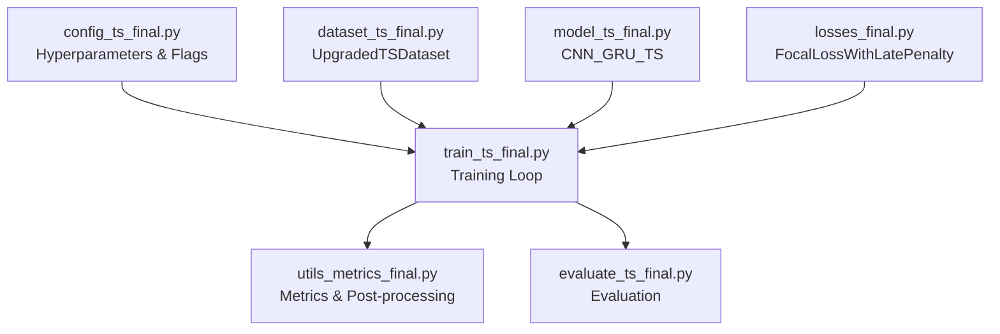
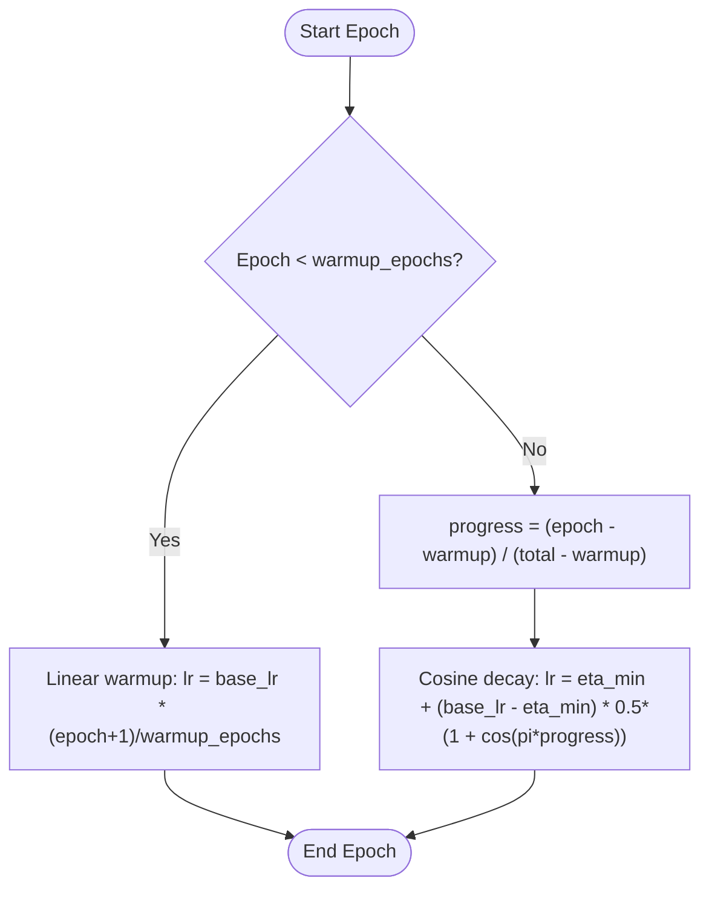
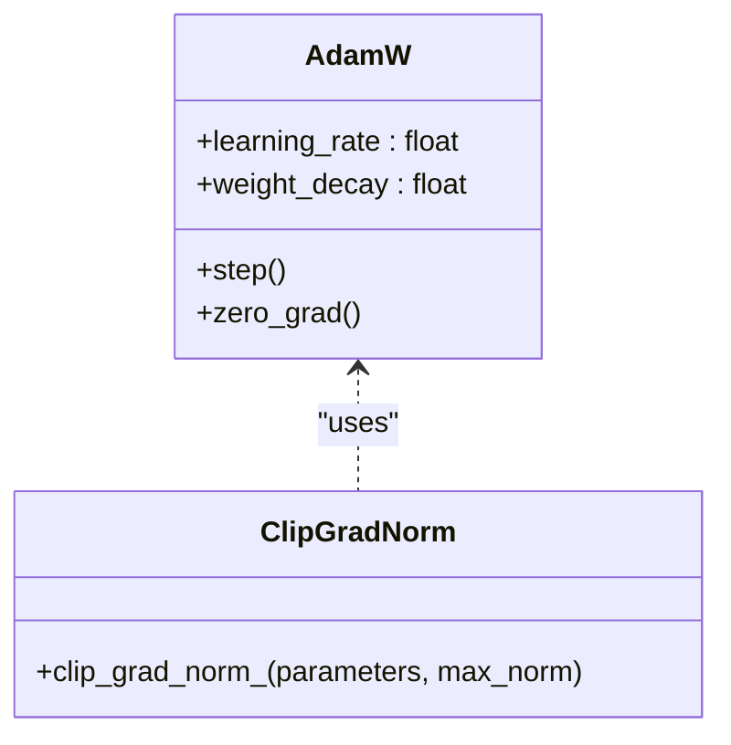
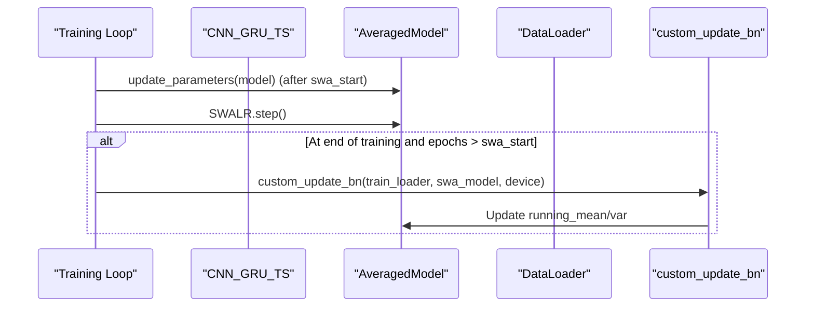
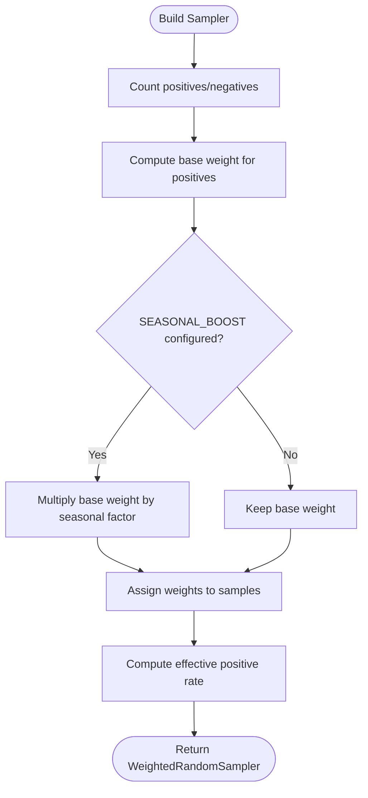
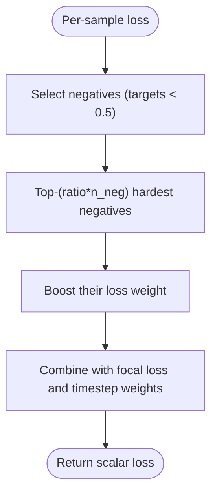
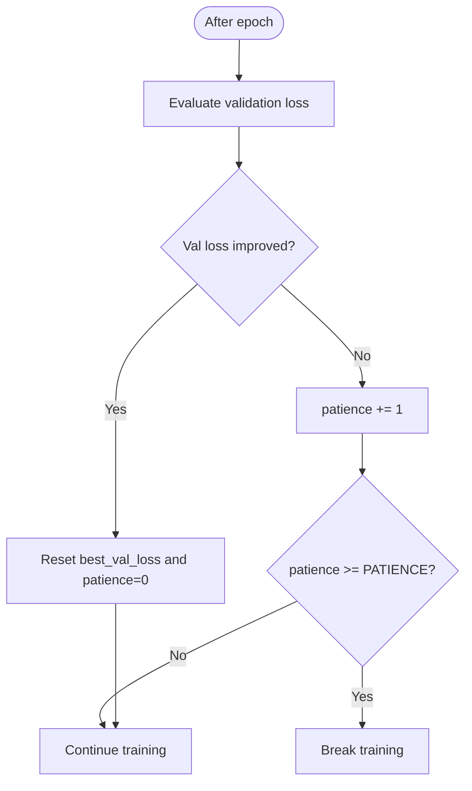
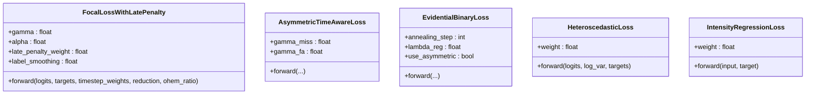
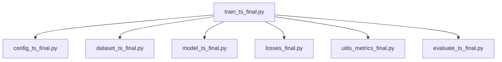

# Optimization & Scheduling

<cite>
**Referenced Files in This Document**
- [train_ts_final.py](file://train_ts_final.py)
- [model_ts_final.py](file://model_ts_final.py)
- [losses_final.py](file://losses_final.py)
- [utils_metrics_final.py](file://utils_metrics_final.py)
- [config_ts_final.py](file://config_ts_final.py)
- [dataset_ts_final.py](file://dataset_ts_final.py)
- [evaluate_ts_final.py](file://evaluate_ts_final.py)
</cite>

## Table of Contents
1. [Introduction](#introduction)
2. [Project Structure](#project-structure)
3. [Core Components](#core-components)
4. [Architecture Overview](#architecture-overview)
5. [Detailed Component Analysis](#detailed-component-analysis)
6. [Dependency Analysis](#dependency-analysis)
7. [Performance Considerations](#performance-considerations)
8. [Troubleshooting Guide](#troubleshooting-guide)
9. [Conclusion](#conclusion)
10. [Appendices](#appendices)

## Introduction
This document explains the optimization and learning rate scheduling strategies used in the training system. It covers:
- WarmupCosineScheduler implementation and usage
- AdamW optimizer configuration and gradient management
- Stochastic Weight Averaging (SWA) integration and batch normalization updates
- Class-balanced sampling with seasonal boosting
- Online Hard Negative Mining (OHEM) for false alarm reduction
- Gradient management, optimizer state handling, and mixed precision considerations
- Early stopping criteria and convergence monitoring
- Optimization hyperparameters, learning rate schedules, and training stability indicators

## Project Structure
The training pipeline integrates model definition, loss functions, dataset sampling, and evaluation utilities. The training script orchestrates:
- Data loading and class-balanced sampling with seasonal boosting
- Loss computation with focal loss, late penalty, label smoothing, and OHEM
- AdamW optimizer with gradient clipping and SWA integration
- Cosine decay learning rate schedule with warmup
- Early stopping and model selection based on weighted event metrics



**Diagram sources**
- [train_ts_final.py:142-757](file://train_ts_final.py#L142-L757)
- [config_ts_final.py:16-208](file://config_ts_final.py#L16-L208)
- [dataset_ts_final.py:47-515](file://dataset_ts_final.py#L47-L515)
- [model_ts_final.py:68-335](file://model_ts_final.py#L68-L335)
- [losses_final.py:13-258](file://losses_final.py#L13-L258)
- [utils_metrics_final.py:14-760](file://utils_metrics_final.py#L14-L760)
- [evaluate_ts_final.py:361-908](file://evaluate_ts_final.py#L361-L908)

**Section sources**
- [train_ts_final.py:142-757](file://train_ts_final.py#L142-L757)
- [config_ts_final.py:16-208](file://config_ts_final.py#L16-L208)

## Core Components
- WarmupCosineScheduler: Implements a warmup phase followed by cosine decay with a configurable minimum learning rate.
- AdamW Optimizer: Configured with learning rate, weight decay, and gradient clipping.
- SWA Integration: Uses AveragedModel and SWALR; includes a custom BN update routine for compatibility.
- Class-balanced Sampling: WeightedRandomSampler with target positive rate and seasonal boosting.
- OHEM: Online Hard Negative Mining to reduce false alarms by focusing on hard negatives.
- Early Stopping: Patience-based termination using validation loss.

**Section sources**
- [train_ts_final.py:80-94](file://train_ts_final.py#L80-L94)
- [train_ts_final.py:313-314](file://train_ts_final.py#L313-L314)
- [train_ts_final.py:99-136](file://train_ts_final.py#L99-L136)
- [train_ts_final.py:244-277](file://train_ts_final.py#L244-L277)
- [losses_final.py:13-92](file://losses_final.py#L13-L92)
- [train_ts_final.py:712-729](file://train_ts_final.py#L712-L729)

## Architecture Overview
The training loop composes the model, loss, optimizer, scheduler, and SWA. It performs:
- Forward pass, loss computation with focal loss and OHEM
- Backward pass with gradient clipping
- Parameter updates and scheduler steps
- Optional SWA parameter averaging and BN statistics update
- Validation and early stopping based on validation loss

```mermaid
sequenceDiagram
participant Train as "Training Loop"
participant Model as "CNN_GRU_TS"
participant Loss as "FocalLossWithLatePenalty"
participant Opt as "AdamW"
participant Sched as "WarmupCosineScheduler"
participant SWA as "AveragedModel/SWALR"
Train->>Model : Forward pass
Model-->>Train : Logits
Train->>Loss : Compute loss with timestep weights and OHEM
Loss-->>Train : Scalar loss
Train->>Opt : loss.backward()
Train->>Opt : clip_grad_norm_(...) and step()
Train->>Sched : step()
alt SWA active
Train->>SWA : update_parameters(model)
Train->>Sched : step() (SWALR)
end
Train->>Train : Validation metrics & early stopping
```

**Diagram sources**
- [train_ts_final.py:386-729](file://train_ts_final.py#L386-L729)
- [model_ts_final.py:202-268](file://model_ts_final.py#L202-L268)
- [losses_final.py:24-91](file://losses_final.py#L24-L91)

## Detailed Component Analysis

### WarmupCosineScheduler
- Purpose: Smoothly increase learning rate during warmup, then decay using cosine schedule down to a minimum.
- Parameters:
  - warmup_epochs: Number of epochs for linear warmup
  - total_epochs: Total training epochs
  - eta_min: Minimum learning rate fraction (default 1e-6)
- Behavior:
  - Linear warmup: lr increases proportionally to epoch
  - Cosine decay: lr follows 0.5*(1 + cos(pi*progress))



**Diagram sources**
- [train_ts_final.py:80-94](file://train_ts_final.py#L80-L94)

**Section sources**
- [train_ts_final.py:80-94](file://train_ts_final.py#L80-L94)
- [train_ts_final.py:314](file://train_ts_final.py#L314)

### AdamW Optimizer Configuration
- Configuration:
  - lr: From config.LEARNING_RATE
  - weight_decay: From config.WEIGHT_DECAY
- Gradient Management:
  - Gradient clipping: torch.nn.utils.clip_grad_norm_(model.parameters(), 1.0)
- Mixed Precision:
  - Not explicitly enabled in the training loop; training uses float32 by default.



**Diagram sources**
- [train_ts_final.py:313](file://train_ts_final.py#L313)
- [train_ts_final.py:446](file://train_ts_final.py#L446)

**Section sources**
- [train_ts_final.py:313](file://train_ts_final.py#L313)
- [train_ts_final.py:446](file://train_ts_final.py#L446)

### Stochastic Weight Averaging (SWA)
- Integration:
  - AveragedModel(model) wraps the trained model
  - SWALR(optimizer, swa_lr=0.005) manages SWA learning rate scheduling
  - Start epoch controlled by config.SWA_START_EPOCH
- BN Update:
  - custom_update_bn trains the averaged model briefly to update batch norm statistics
- State Handling:
  - Checkpoint includes swa_model_state and swa_scheduler_state for resuming SWA runs



**Diagram sources**
- [train_ts_final.py:319-323](file://train_ts_final.py#L319-L323)
- [train_ts_final.py:724-736](file://train_ts_final.py#L724-L736)
- [train_ts_final.py:99-136](file://train_ts_final.py#L99-L136)

**Section sources**
- [train_ts_final.py:319-323](file://train_ts_final.py#L319-L323)
- [train_ts_final.py:724-736](file://train_ts_final.py#L724-L736)
- [train_ts_final.py:99-136](file://train_ts_final.py#L99-L136)

### Class-Balanced Sampling and Seasonal Boosting
- Target Positive Rate:
  - SAMPLER_POS_RATE controls desired positive rate in the sampler
- Weight Calculation:
  - Base weight for positives derived from target vs observed counts
  - Seasonal boost applied to positives based on month bins (pre_monsoon, monsoon, post_monsoon, winter)
- Effective Positive Rate:
  - Computed from base weight and counts to monitor sampler balance



**Diagram sources**
- [train_ts_final.py:244-277](file://train_ts_final.py#L244-L277)

**Section sources**
- [train_ts_final.py:244-277](file://train_ts_final.py#L244-L277)
- [config_ts_final.py:53-59](file://config_ts_final.py#L53-L59)

### Online Hard Negative Mining (OHEM)
- Implementation:
  - Computes loss per sample, selects top-k hardest negatives (ratio-based)
  - Boosts their loss weight by a fixed factor
- Usage:
  - Passed to loss forward via timestep_weights and ohem_ratio from config



**Diagram sources**
- [losses_final.py:66-84](file://losses_final.py#L66-L84)

**Section sources**
- [losses_final.py:66-84](file://losses_final.py#L66-L84)
- [train_ts_final.py:435](file://train_ts_final.py#L435)

### Early Stopping and Convergence Monitoring
- Early Stopping:
  - Monitors validation loss; resets patience on improvement
  - Stops training when patience threshold is reached
- Convergence Indicators:
  - Training and validation loss curves
  - Operational baseline checks (wPOD_evt, early detection rate, wFAR_evt)
  - Aviation score combining weighted CSI, FAR, and early detection



**Diagram sources**
- [train_ts_final.py:712-721](file://train_ts_final.py#L712-L721)

**Section sources**
- [train_ts_final.py:712-721](file://train_ts_final.py#L712-L721)

### Loss Functions and Weighted Objectives
- FocalLossWithLatePenalty:
  - Supports label smoothing, alpha balancing, and late detection penalty
  - Incorporates timestep weights (severity and late bonuses) and OHEM
- AsymmetricTimeAwareLoss and EvidentialBinaryLoss:
  - Alternative objectives for severe event emphasis and evidential modeling
- HeteroscedasticLoss and IntensityRegressionLoss:
  - Aleatoric uncertainty and continuous intensity scoring (optional)



**Diagram sources**
- [losses_final.py:13-258](file://losses_final.py#L13-L258)

**Section sources**
- [losses_final.py:13-258](file://losses_final.py#L13-L258)

### Post-Processing and Threshold Selection
- Temporal smoothing and persistence filtering:
  - EMA or rolling mean smoothing of probabilities
  - Persistence filter removes short false alarms
- Dual-threshold Schmitt trigger:
  - Optional hysteresis-based triggering with high/low thresholds
- Threshold optimization:
  - Grid search over thresholds to maximize selected metric (e.g., weighted CSI)

**Section sources**
- [utils_metrics_final.py:23-77](file://utils_metrics_final.py#L23-L77)
- [utils_metrics_final.py:192-241](file://utils_metrics_final.py#L192-L241)
- [utils_metrics_final.py:243-314](file://utils_metrics_final.py#L243-L314)

## Dependency Analysis
- Training depends on:
  - Config for hyperparameters and flags
  - Dataset for class-balanced sampling and seasonal boosting
  - Model for forward pass and attention maps
  - Losses for training objective and OHEM
  - Metrics for threshold selection and evaluation
- SWA depends on:
  - AveragedModel and SWALR from torch.optim.swa_utils
  - Custom BN update routine for compatibility



**Diagram sources**
- [train_ts_final.py:142-757](file://train_ts_final.py#L142-L757)
- [config_ts_final.py:16-208](file://config_ts_final.py#L16-L208)
- [dataset_ts_final.py:47-515](file://dataset_ts_final.py#L47-L515)
- [model_ts_final.py:68-335](file://model_ts_final.py#L68-L335)
- [losses_final.py:13-258](file://losses_final.py#L13-L258)
- [utils_metrics_final.py:14-760](file://utils_metrics_final.py#L14-L760)
- [evaluate_ts_final.py:361-908](file://evaluate_ts_final.py#L361-L908)

**Section sources**
- [train_ts_final.py:142-757](file://train_ts_final.py#L142-L757)

## Performance Considerations
- WarmupCosineScheduler reduces instability at training start and stabilizes long runs.
- AdamW with weight decay and gradient clipping improves generalization and numerical stability.
- SWA improves generalization by averaging parameters; custom BN update ensures reliable statistics.
- Class-balanced sampling with seasonal boosting mitigates class imbalance and captures temporal variability.
- OHEM reduces false alarms by focusing on hard negatives.
- Early stopping prevents overfitting and saves computational resources.

[No sources needed since this section provides general guidance]

## Troubleshooting Guide
- Learning rate not decreasing:
  - Verify scheduler initialization and step() placement after optimizer.step()
  - Check warmup_epochs and total_epochs alignment with training loop
- SWA not improving:
  - Ensure swa_start_epoch is reached and update_parameters is called
  - Confirm custom BN update is executed at the end of training
- Poor FAR control:
  - Increase OHEM ratio and adjust label smoothing
  - Consider asymmetric loss or evidential loss for severe events
- Instability or divergence:
  - Reduce learning rate or increase warmup_epochs
  - Verify gradient clipping magnitude and absence of NaNs
- Class imbalance persists:
  - Adjust SAMPLER_POS_RATE and SEASONAL_BOOST factors
  - Inspect effective positive rate printed during sampler setup

**Section sources**
- [train_ts_final.py:314](file://train_ts_final.py#L314)
- [train_ts_final.py:724-736](file://train_ts_final.py#L724-L736)
- [losses_final.py:66-84](file://losses_final.py#L66-L84)
- [train_ts_final.py:244-277](file://train_ts_final.py#L244-L277)

## Conclusion
The training system employs a robust optimization stack: warmup cosine learning rate scheduling, AdamW with gradient clipping, SWA for generalization, class-balanced sampling with seasonal boosting, and OHEM for false alarm reduction. Early stopping and convergence monitoring ensure stable training. These components collectively improve reliability and performance for thunderstorm nowcasting.

[No sources needed since this section summarizes without analyzing specific files]

## Appendices

### Optimization Hyperparameters and Schedules
- Learning Rate Schedule:
  - WarmupCosineScheduler with warmup_epochs and total_epochs
  - eta_min controls minimum learning rate
- Optimizer:
  - AdamW with lr and weight_decay from config
  - Gradient clipping with norm 1.0
- SWA:
  - AveragedModel and SWALR with swa_lr
  - Start epoch controlled by SWA_START_EPOCH
- Sampling:
  - SAMPLER_POS_RATE and SEASONAL_BOOST
- OHEM:
  - OHEM_RATIO controls hard negative mining ratio
- Early Stopping:
  - PATIENCE controls patience threshold

**Section sources**
- [train_ts_final.py:80-94](file://train_ts_final.py#L80-L94)
- [train_ts_final.py:313-314](file://train_ts_final.py#L313-L314)
- [train_ts_final.py:319-323](file://train_ts_final.py#L319-L323)
- [train_ts_final.py:244-277](file://train_ts_final.py#L244-L277)
- [config_ts_final.py:40-46](file://config_ts_final.py#L40-L46)

### Examples and References
- Scheduler usage:
  - [train_ts_final.py:314](file://train_ts_final.py#L314)
- Optimizer configuration:
  - [train_ts_final.py:313](file://train_ts_final.py#L313)
- SWA integration:
  - [train_ts_final.py:319-323](file://train_ts_final.py#L319-L323)
  - [train_ts_final.py:724-736](file://train_ts_final.py#L724-L736)
- Class-balanced sampling:
  - [train_ts_final.py:244-277](file://train_ts_final.py#L244-L277)
- OHEM usage:
  - [losses_final.py:66-84](file://losses_final.py#L66-L84)
  - [train_ts_final.py:435](file://train_ts_final.py#L435)
- Convergence analysis:
  - [train_ts_final.py:712-721](file://train_ts_final.py#L712-L721)
  - [utils_metrics_final.py:192-241](file://utils_metrics_final.py#L192-L241)