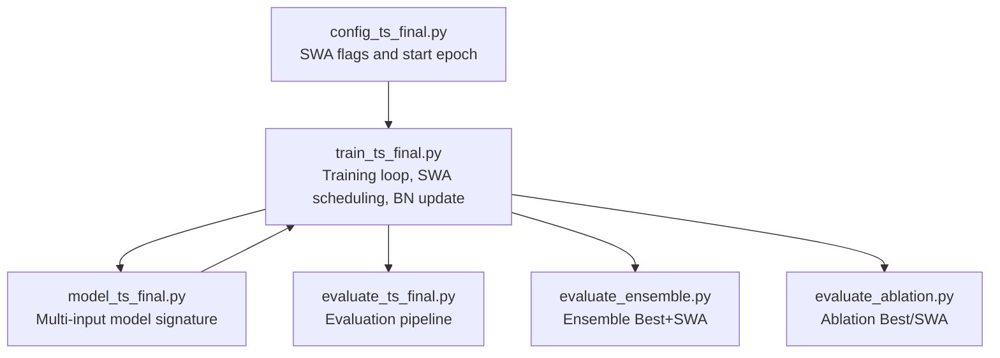
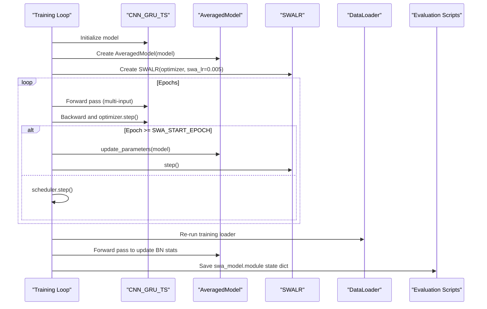
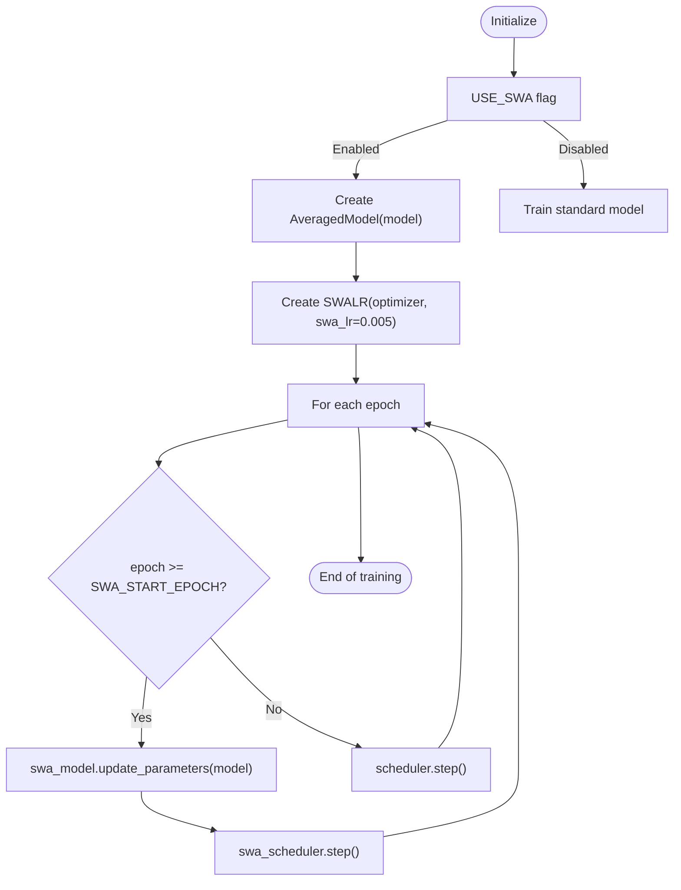
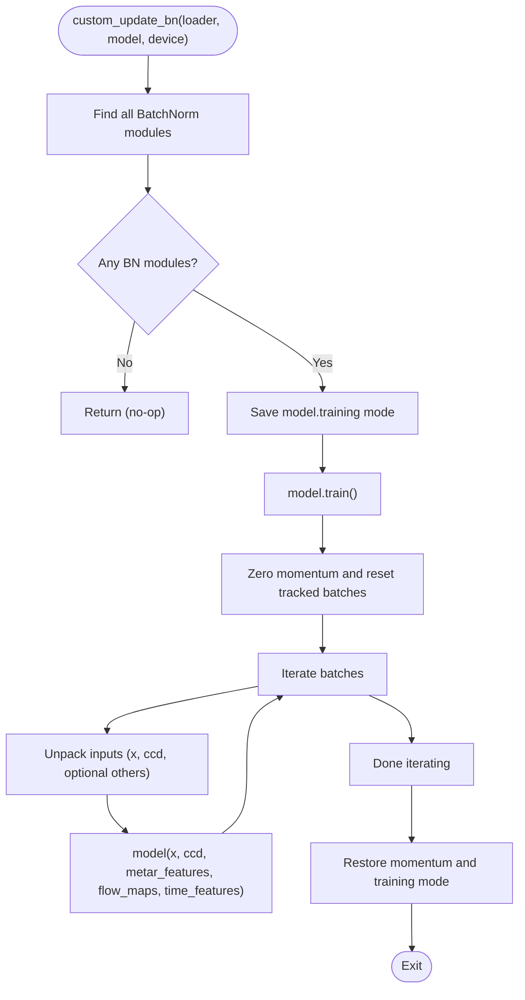
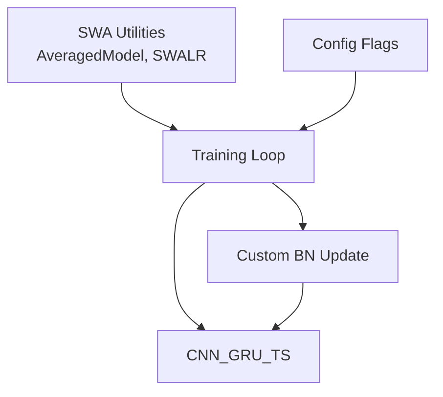

# Stochastic Weight Averaging (SWA)

<cite>
**Referenced Files in This Document**
- [train_ts_final.py](file://train_ts_final.py)
- [model_ts_final.py](file://model_ts_final.py)
- [config_ts_final.py](file://config_ts_final.py)
- [evaluate_ts_final.py](file://evaluate_ts_final.py)
- [evaluate_ensemble.py](file://evaluate_ensemble.py)
- [evaluate_ablation.py](file://evaluate_ablation.py)
</cite>

## Table of Contents
1. [Introduction](#introduction)
2. [Project Structure](#project-structure)
3. [Core Components](#core-components)
4. [Architecture Overview](#architecture-overview)
5. [Detailed Component Analysis](#detailed-component-analysis)
6. [Dependency Analysis](#dependency-analysis)
7. [Performance Considerations](#performance-considerations)
8. [Troubleshooting Guide](#troubleshooting-guide)
9. [Conclusion](#conclusion)
10. [Appendices](#appendices)

## Introduction
This document explains the Stochastic Weight Averaging (SWA) implementation integrated into the training system. It covers:
- AveragedModel integration and SWALR scheduler configuration with swa_lr=0.005
- SWA start epoch settings and epoch-based switching to averaging
- The custom_update_bn function addressing PyTorch’s batch normalization compatibility with the multi-input model architecture
- Batch normalization updates post-SWA and model saving/loading
- Integration with early stopping and model selection criteria
- Performance benefits for generalization and practical troubleshooting guidance

## Project Structure
The SWA implementation spans training, configuration, and evaluation utilities:
- Training loop initializes AveragedModel and SWALR, switches to SWA averaging at a configured epoch, and updates BN statistics using a custom function
- Configuration controls whether SWA is enabled and when averaging starts
- Evaluation scripts support loading SWA models and ensemble evaluation combining best and SWA models

**Diagram sources**
- [config_ts_final.py:44-46](file://config_ts_final.py#L44-L46)
- [train_ts_final.py:316-323](file://train_ts_final.py#L316-L323)
- [train_ts_final.py:723-733](file://train_ts_final.py#L723-L733)
- [model_ts_final.py:202-268](file://model_ts_final.py#L202-L268)
- [evaluate_ts_final.py:430-447](file://evaluate_ts_final.py#L430-L447)
- [evaluate_ensemble.py:155-173](file://evaluate_ensemble.py#L155-L173)
- [evaluate_ablation.py:213-224](file://evaluate_ablation.py#L213-L224)

**Section sources**
- [train_ts_final.py:142-757](file://train_ts_final.py#L142-L757)
- [config_ts_final.py:44-46](file://config_ts_final.py#L44-L46)

## Core Components
- AveragedModel and SWALR initialization and epoch-based switching
- SWA start epoch configuration
- Custom batch normalization update compatible with multi-input model
- Checkpointing of SWA state and saving of averaged model weights
- Integration with early stopping and model selection

**Section sources**
- [train_ts_final.py:316-323](file://train_ts_final.py#L316-L323)
- [train_ts_final.py:723-733](file://train_ts_final.py#L723-L733)
- [train_ts_final.py:370-378](file://train_ts_final.py#L370-L378)
- [train_ts_final.py:705-710](file://train_ts_final.py#L705-L710)

## Architecture Overview
The SWA pipeline integrates with the training loop and model architecture as follows:

**Diagram sources**
- [train_ts_final.py:316-323](file://train_ts_final.py#L316-L323)
- [train_ts_final.py:723-733](file://train_ts_final.py#L723-L733)
- [train_ts_final.py:730-741](file://train_ts_final.py#L730-L741)
- [model_ts_final.py:202-268](file://model_ts_final.py#L202-L268)

## Detailed Component Analysis

### AveragedModel and SWALR Integration
- AveragedModel wraps the trained model to track averaged weights during SWA phase
- SWALR sets the SWA learning rate to 0.005 and steps the scheduler during averaging epochs
- Epoch-based switching occurs when the current epoch reaches or exceeds SWA_START_EPOCH

**Diagram sources**
- [train_ts_final.py:316-323](file://train_ts_final.py#L316-L323)
- [train_ts_final.py:723-728](file://train_ts_final.py#L723-L728)

**Section sources**
- [train_ts_final.py:316-323](file://train_ts_final.py#L316-L323)
- [train_ts_final.py:723-728](file://train_ts_final.py#L723-L728)

### SWA Start Epoch Settings
- SWA_START_EPOCH is configurable in the configuration module
- The training loop compares the current epoch against this threshold to decide when to switch to averaging and when to save the averaged model

**Section sources**
- [config_ts_final.py:46](file://config_ts_final.py#L46)
- [train_ts_final.py:322](file://train_ts_final.py#L322)
- [train_ts_final.py:723-728](file://train_ts_final.py#L723-L728)

### Custom Batch Normalization Update (custom_update_bn)
- PyTorch’s default update_bn expects a single positional argument; the model requires multiple inputs
- The custom function resets BN running statistics, temporarily disables momentum, and runs forward passes over the training loader to recompute BN statistics under the averaged model state
- It respects optional features (optical flow, METAR, time features) based on configuration

**Diagram sources**
- [train_ts_final.py:99-135](file://train_ts_final.py#L99-L135)
- [model_ts_final.py:202-268](file://model_ts_final.py#L202-L268)

**Section sources**
- [train_ts_final.py:99-135](file://train_ts_final.py#L99-L135)
- [model_ts_final.py:202-268](file://model_ts_final.py#L202-L268)

### Epoch-Based Switching and Averaging
- During each epoch, if the epoch index is greater than or equal to SWA_START_EPOCH:
  - AveragedModel updates its averaged weights from the current model
  - SWALR scheduler advances
- Otherwise, the standard scheduler advances

**Section sources**
- [train_ts_final.py:723-728](file://train_ts_final.py#L723-L728)

### Post-SWA Batch Normalization Updates and Model Saving
- After training completes, if SWA was enabled and started before the final epoch:
  - The custom BN update is executed using the training loader
  - The averaged model’s module weights are saved to both the run directory and the main outputs path

**Section sources**
- [train_ts_final.py:730-741](file://train_ts_final.py#L730-L741)

### Configuration Examples for SWA
- Enable SWA and set the start epoch:
  - USE_SWA = True
  - SWA_START_EPOCH = 5
- SWALR is configured with swa_lr=0.005 internally during scheduler creation

**Section sources**
- [config_ts_final.py:44-46](file://config_ts_final.py#L44-L46)
- [train_ts_final.py:320-322](file://train_ts_final.py#L320-L322)

### SWA Model Loading and Evaluation
- Evaluation scripts can load SWA models by path and evaluate on test sets
- Ensemble evaluation combines predictions from best and SWA models to improve generalization

**Section sources**
- [evaluate_ts_final.py:430-447](file://evaluate_ts_final.py#L430-L447)
- [evaluate_ensemble.py:155-173](file://evaluate_ensemble.py#L155-L173)
- [evaluate_ablation.py:213-224](file://evaluate_ablation.py#L213-L224)

### Integration with Early Stopping and Model Selection
- Early stopping is decoupled and driven by validation loss; training continues until patience elapses
- Model selection focuses on operational safety and weighted event metrics; SWA is saved separately and can be evaluated independently

**Section sources**
- [train_ts_final.py:712-721](file://train_ts_final.py#L712-L721)
- [train_ts_final.py:637-661](file://train_ts_final.py#L637-L661)

## Dependency Analysis
- SWA depends on:
  - AveragedModel and SWALR from PyTorch’s SWA utilities
  - The model’s multi-input forward signature
  - Configuration flags controlling SWA enablement and start epoch
- The custom BN update depends on the model’s BatchNorm modules and the training data loader

**Diagram sources**
- [train_ts_final.py:316-323](file://train_ts_final.py#L316-L323)
- [train_ts_final.py:99-135](file://train_ts_final.py#L99-L135)
- [config_ts_final.py:44-46](file://config_ts_final.py#L44-L46)

**Section sources**
- [train_ts_final.py:316-323](file://train_ts_final.py#L316-L323)
- [train_ts_final.py:99-135](file://train_ts_final.py#L99-L135)
- [config_ts_final.py:44-46](file://config_ts_final.py#L44-L46)

## Performance Considerations
- SWA improves generalization by averaging weights over later epochs, reducing overfitting and stabilizing predictions
- Using SWALR with swa_lr=0.005 ensures stable averaging without aggressive learning dynamics
- The custom BN update ensures batch normalization statistics align with averaged weights, preventing distribution shifts during inference

[No sources needed since this section provides general guidance]

## Troubleshooting Guide
Common SWA-related issues and resolutions:
- SWA state loading fails:
  - The training loop attempts to load SWA state from checkpoints; if loading fails, it resets AveragedModel and SWALR to clean instances
  - Verify checkpoint contains both swa_model_state and swa_scheduler_state keys
- Batch normalization inconsistencies after SWA:
  - Use the custom BN update to recompute running statistics using the averaged model on the training loader
  - Ensure the loader yields the same input modalities as the model expects (x, ccd, optional others)
- Multi-input model signature mismatch:
  - The custom BN update unpacks inputs according to configuration flags; confirm USE_OPTICAL_FLOW, USE_METAR_FEATURES, and USE_MONTH are set consistently with the model’s forward signature

**Section sources**
- [train_ts_final.py:370-378](file://train_ts_final.py#L370-L378)
- [train_ts_final.py:99-135](file://train_ts_final.py#L99-L135)
- [model_ts_final.py:202-268](file://model_ts_final.py#L202-L268)

## Conclusion
The SWA implementation integrates seamlessly with the training system:
- AveragedModel and SWALR are initialized at the start and switched into effect at the configured epoch
- A custom batch normalization update resolves compatibility issues with multi-input models
- SWA models are saved and can be evaluated or ensembled with best models to improve generalization
- Early stopping remains independent, allowing robust convergence before averaging begins

[No sources needed since this section summarizes without analyzing specific files]

## Appendices

### Configuration Reference
- Enable SWA: USE_SWA = True
- Set SWA start epoch: SWA_START_EPOCH = 5
- SWALR learning rate: 0.005 (configured internally)

**Section sources**
- [config_ts_final.py:44-46](file://config_ts_final.py#L44-L46)
- [train_ts_final.py:320-322](file://train_ts_final.py#L320-L322)

### Model Saving and Loading Paths
- Best model path: derived from configuration and fold
- SWA model path: appended “_swa” to the best model filename
- Evaluation and ensemble scripts load these paths by default when not provided

**Section sources**
- [train_ts_final.py:735-741](file://train_ts_final.py#L735-L741)
- [evaluate_ts_final.py:371-376](file://evaluate_ts_final.py#L371-L376)
- [evaluate_ensemble.py:94-104](file://evaluate_ensemble.py#L94-L104)
- [evaluate_ablation.py:190-193](file://evaluate_ablation.py#L190-L193)