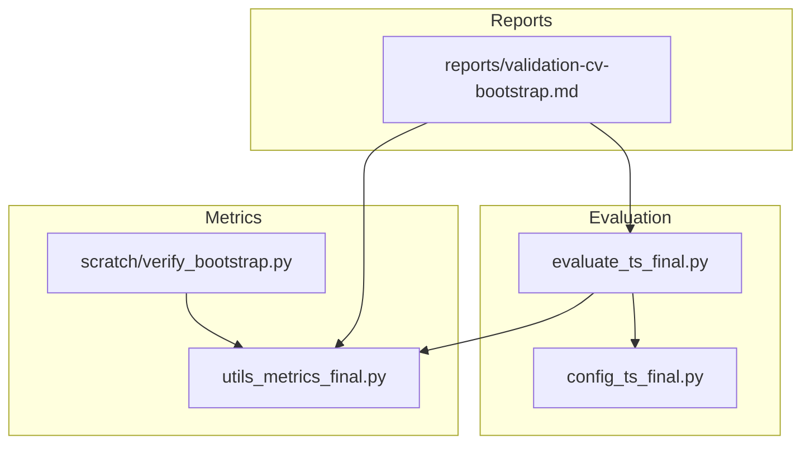
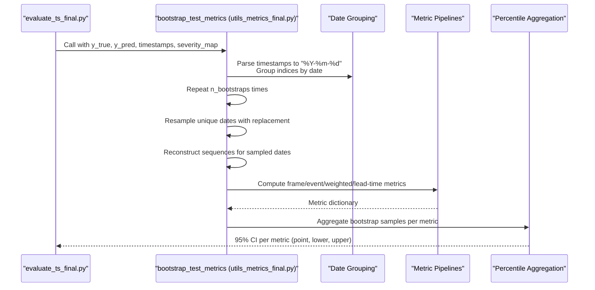
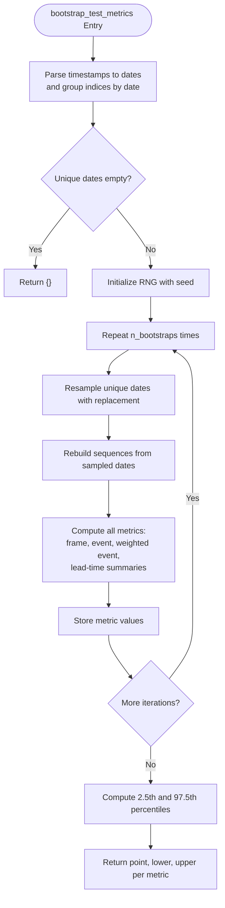
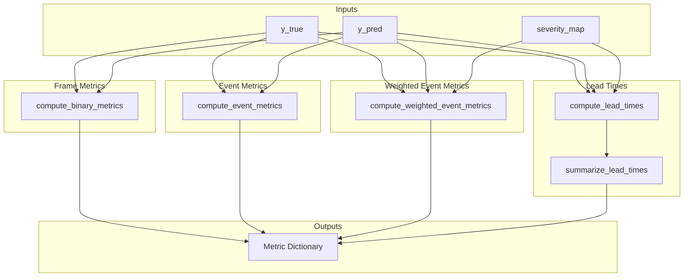
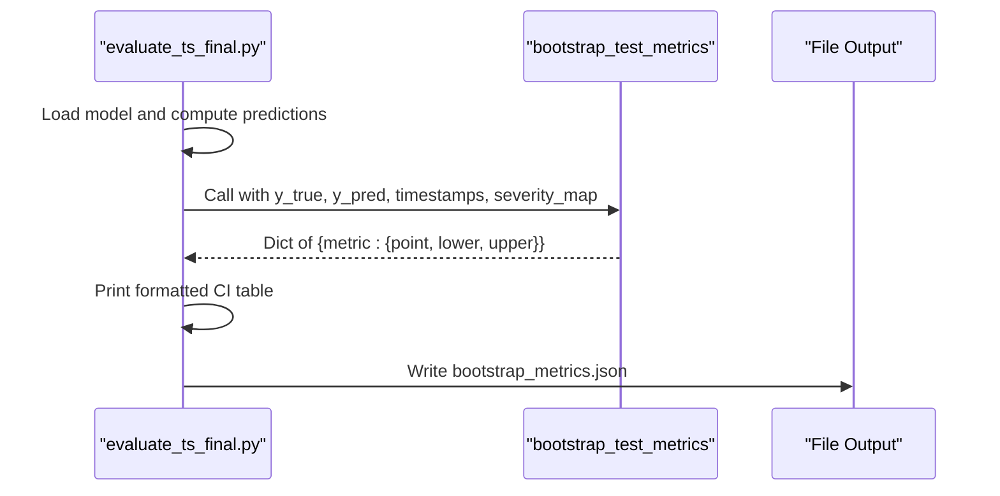
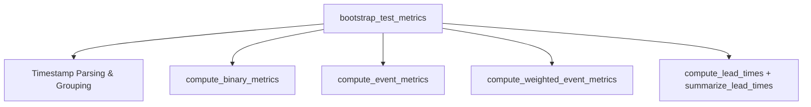

# Bootstrap Confidence Interval Analysis

<cite>
**Referenced Files in This Document**
- [utils_metrics_final.py](file://utils_metrics_final.py)
- [evaluate_ts_final.py](file://evaluate_ts_final.py)
- [verify_bootstrap.py](file://scratch/verify_bootstrap.py)
- [validation-cv-bootstrap.md](file://reports/validation-cv-bootstrap.md)
- [config_ts_final.py](file://config_ts_final.py)
</cite>

## Table of Contents
1. [Introduction](#introduction)
2. [Project Structure](#project-structure)
3. [Core Components](#core-components)
4. [Architecture Overview](#architecture-overview)
5. [Detailed Component Analysis](#detailed-component-analysis)
6. [Dependency Analysis](#dependency-analysis)
7. [Performance Considerations](#performance-considerations)
8. [Troubleshooting Guide](#troubleshooting-guide)
9. [Conclusion](#conclusion)
10. [Appendices](#appendices)

## Introduction
This document explains the bootstrap confidence interval analysis for model evaluation in the Nagpur Thunderstorm Nowcasting project. It focuses on the bootstrap_test_metrics function, which performs temporal block bootstrapping by calendar day to estimate 95% confidence intervals for frame-level, event-level, and weighted event-level metrics. The document covers:
- Day-based resampling strategy to handle temporal autocorrelation
- Comprehensive metric calculation pipeline (frame, event, weighted event, lead-time statistics)
- Percentile-based confidence interval estimation
- Integration with frame-level, event-level, and weighted metrics
- Practical applications for model comparison, performance benchmarking, and operational decision-making under uncertainty
- Example workflows, interpretation guidelines, and statistical validation procedures

## Project Structure
The bootstrap confidence interval analysis is implemented in the metrics utilities and integrated into the final evaluation script. Supporting documentation and configuration define the evaluation workflow and default parameters.

**Diagram sources**
- [evaluate_ts_final.py:740-800](file://evaluate_ts_final.py#L740-L800)
- [utils_metrics_final.py:653-760](file://utils_metrics_final.py#L653-L760)
- [verify_bootstrap.py:1-124](file://scratch/verify_bootstrap.py#L1-L124)
- [validation-cv-bootstrap.md:1-89](file://reports/validation-cv-bootstrap.md#L1-L89)
- [config_ts_final.py:16-211](file://config_ts_final.py#L16-L211)

**Section sources**
- [evaluate_ts_final.py:740-800](file://evaluate_ts_final.py#L740-L800)
- [utils_metrics_final.py:653-760](file://utils_metrics_final.py#L653-L760)
- [verify_bootstrap.py:1-124](file://scratch/verify_bootstrap.py#L1-L124)
- [validation-cv-bootstrap.md:1-89](file://reports/validation-cv-bootstrap.md#L1-L89)
- [config_ts_final.py:16-211](file://config_ts_final.py#L16-L211)

## Core Components
- bootstrap_test_metrics: Implements temporal block bootstrapping by calendar day to compute 95% confidence intervals for all evaluated metrics.
- compute_binary_metrics: Computes frame-level metrics (POD, FAR, CSI, ETS, SEDI, F1, F2).
- compute_event_metrics: Computes event-level metrics (POD, FAR, CSI, SEDI) and counts hits, misses, false alarms.
- compute_weighted_event_metrics: Computes severity-weighted event metrics and a lead-time-aware CSI variant.
- compute_lead_times and summarize_lead_times: Computes and summarizes lead times by event and category.
- evaluate_ts_final integration: Calls bootstrap_test_metrics and prints formatted confidence intervals.

Key parameters:
- min_event_len: Minimum event duration to consider for event-level metrics.
- max_lead_steps: Maximum lead steps for valid event overlap.
- step_min: Time step in minutes used to convert lead-time steps to minutes.
- n_bootstraps: Number of bootstrap iterations (default 200).
- seed: Random seed for reproducibility.

**Section sources**
- [utils_metrics_final.py:653-760](file://utils_metrics_final.py#L653-L760)
- [utils_metrics_final.py:155-189](file://utils_metrics_final.py#L155-L189)
- [utils_metrics_final.py:338-392](file://utils_metrics_final.py#L338-L392)
- [utils_metrics_final.py:575-650](file://utils_metrics_final.py#L575-L650)
- [utils_metrics_final.py:395-477](file://utils_metrics_final.py#L395-L477)
- [evaluate_ts_final.py:740-800](file://evaluate_ts_final.py#L740-L800)

## Architecture Overview
The bootstrap confidence interval pipeline integrates with the evaluation workflow as follows:
- The evaluation script computes predictions and severity labels, then invokes bootstrap_test_metrics.
- bootstrap_test_metrics groups samples by calendar day, resamples days with replacement, reconstructs sequences, recomputes all metrics, and aggregates bootstrap samples to produce 95% confidence intervals.

**Diagram sources**
- [evaluate_ts_final.py:740-800](file://evaluate_ts_final.py#L740-L800)
- [utils_metrics_final.py:653-760](file://utils_metrics_final.py#L653-L760)

## Detailed Component Analysis

### bootstrap_test_metrics Implementation
The function performs temporal block bootstrapping by calendar day:
- Parses timestamps to daily granularity and groups indices by date.
- Resamples unique dates with replacement (maintaining temporal correlation within days).
- Reconstructs y_true, y_pred, and severity labels for each bootstrap iteration.
- Recomputes all metrics (frame, event, weighted event, lead-time summaries).
- Computes 95% confidence intervals as 2.5th and 97.5th percentiles across bootstrap samples.

**Diagram sources**
- [utils_metrics_final.py:653-760](file://utils_metrics_final.py#L653-L760)

**Section sources**
- [utils_metrics_final.py:653-760](file://utils_metrics_final.py#L653-L760)

### Metric Calculation Pipeline
The function composes several metric computations:
- Frame-level metrics: POD, FAR, CSI, ETS, SEDI, F1, F2 (binary thresholded arrays).
- Event-level metrics: POD, FAR, CSI, SEDI, plus hit/miss/false-alarm counts.
- Weighted event metrics: Severity-weighted POD/FAR/CSI and a lead-time-aware CSI variant.
- Lead-time statistics: Mean/median lead in minutes, early detection rate, late detection rate, miss rate.

**Diagram sources**
- [utils_metrics_final.py:155-189](file://utils_metrics_final.py#L155-L189)
- [utils_metrics_final.py:338-392](file://utils_metrics_final.py#L338-L392)
- [utils_metrics_final.py:575-650](file://utils_metrics_final.py#L575-L650)
- [utils_metrics_final.py:395-477](file://utils_metrics_final.py#L395-L477)

**Section sources**
- [utils_metrics_final.py:155-189](file://utils_metrics_final.py#L155-L189)
- [utils_metrics_final.py:338-392](file://utils_metrics_final.py#L338-L392)
- [utils_metrics_final.py:575-650](file://utils_metrics_final.py#L575-L650)
- [utils_metrics_final.py:395-477](file://utils_metrics_final.py#L395-L477)

### Integration with Evaluation Workflow
The evaluation script:
- Loads model predictions and severity labels.
- Computes frame-level and event-level metrics.
- Calls bootstrap_test_metrics with parameters derived from configuration and computed cadence.
- Prints formatted confidence intervals alongside point estimates.
- Saves bootstrap results to JSON for downstream analysis.

**Diagram sources**
- [evaluate_ts_final.py:740-800](file://evaluate_ts_final.py#L740-L800)
- [utils_metrics_final.py:653-760](file://utils_metrics_final.py#L653-L760)

**Section sources**
- [evaluate_ts_final.py:740-800](file://evaluate_ts_final.py#L740-L800)

### Day-Based Resampling Strategy
- Daily grouping ensures that temporal autocorrelation is preserved within blocks (days).
- Resampling days with replacement maintains the temporal structure while enabling Monte Carlo estimation of variability.
- This approach avoids breaking temporal continuity that would occur with sample-wise resampling.

**Section sources**
- [utils_metrics_final.py:672-689](file://utils_metrics_final.py#L672-L689)

### Confidence Interval Estimation
- Percentile-based intervals are computed using NumPy’s percentile function.
- 95% confidence intervals correspond to the 2.5th and 97.5th percentiles across bootstrap samples.
- The function returns point estimates, lower bounds, and upper bounds for each metric.

**Section sources**
- [utils_metrics_final.py:748-758](file://utils_metrics_final.py#L748-L758)

### Practical Applications
- Model comparison: Compare confidence intervals across models to assess statistical significance of differences.
- Performance benchmarking: Track changes in point estimates and interval widths over time.
- Operational decision-making: Use intervals to quantify uncertainty in lead-time and detection performance for operational thresholds.

**Section sources**
- [evaluate_ts_final.py:760-788](file://evaluate_ts_final.py#L760-L788)

## Dependency Analysis
The bootstrap pipeline depends on:
- Date parsing and grouping for temporal blocking.
- Metric computation functions for frame, event, weighted event, and lead-time statistics.
- Random number generation for bootstrap sampling.

**Diagram sources**
- [utils_metrics_final.py:653-760](file://utils_metrics_final.py#L653-L760)
- [utils_metrics_final.py:155-189](file://utils_metrics_final.py#L155-L189)
- [utils_metrics_final.py:338-392](file://utils_metrics_final.py#L338-L392)
- [utils_metrics_final.py:575-650](file://utils_metrics_final.py#L575-L650)
- [utils_metrics_final.py:395-477](file://utils_metrics_final.py#L395-L477)

**Section sources**
- [utils_metrics_final.py:653-760](file://utils_metrics_final.py#L653-L760)

## Performance Considerations
- Computational cost scales linearly with n_bootstraps and the number of samples per day block.
- Using default 200 bootstrap iterations balances accuracy and speed for typical datasets.
- For large datasets, consider reducing n_bootstraps or optimizing metric computations if needed.

[No sources needed since this section provides general guidance]

## Troubleshooting Guide
Common issues and resolutions:
- Empty unique dates: The function returns an empty dictionary if no dates could be parsed. Ensure timestamps are valid and in the expected format.
- Metric computation failures: Verify that y_true and y_pred are valid arrays and that severity_map keys align with indices.
- Seed reproducibility: Use the configured seed to reproduce results consistently.

**Section sources**
- [utils_metrics_final.py:687-688](file://utils_metrics_final.py#L687-L688)
- [utils_metrics_final.py:692-721](file://utils_metrics_final.py#L692-L721)

## Conclusion
The bootstrap confidence interval analysis provides robust uncertainty quantification for model evaluation in the Nagpur Thunderstorm Nowcasting project. By leveraging day-based temporal block bootstrapping, the pipeline preserves temporal autocorrelation while estimating variability across frame-level, event-level, and weighted event-level metrics. The evaluation script integrates these capabilities seamlessly, enabling informed model comparisons, benchmarking, and operational decision-making under uncertainty.

[No sources needed since this section summarizes without analyzing specific files]

## Appendices

### Example Workflows
- Smoke test: A synthetic dataset demonstrates end-to-end execution of the bootstrap pipeline with minimal iterations for quick verification.
- Full evaluation: The evaluation script computes predictions, applies post-processing, and prints 95% confidence intervals for all major metrics.

**Section sources**
- [verify_bootstrap.py:20-124](file://scratch/verify_bootstrap.py#L20-L124)
- [evaluate_ts_final.py:740-800](file://evaluate_ts_final.py#L740-L800)

### Interpretation Guidelines
- Confidence intervals indicate the range within which the true metric likely lies with 95% confidence.
- Narrow intervals suggest stable performance; wide intervals indicate higher uncertainty.
- When comparing models, consider whether confidence intervals overlap to assess statistical significance.

[No sources needed since this section provides general guidance]

### Statistical Validation Procedures
- Compile checks: Ensure modules compile without errors.
- Smoke tests: Run synthetic data tests to validate pipeline execution.
- Cross-validation integration: Use walk-forward CV folds and the lead-time-aware CSI metric for model selection.

**Section sources**
- [validation-cv-bootstrap.md:35-89](file://reports/validation-cv-bootstrap.md#L35-L89)