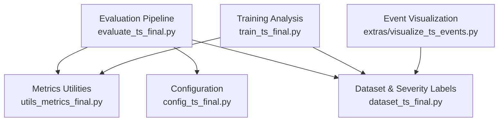
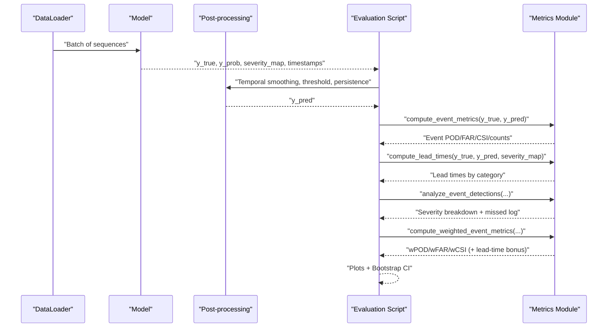
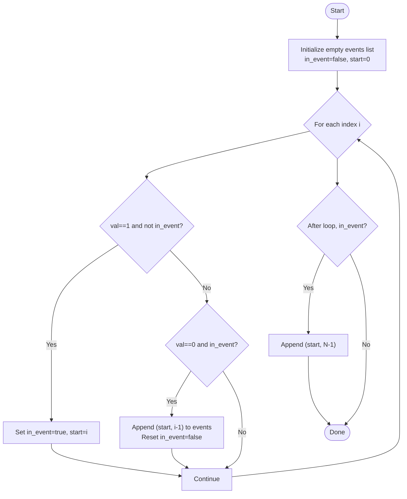
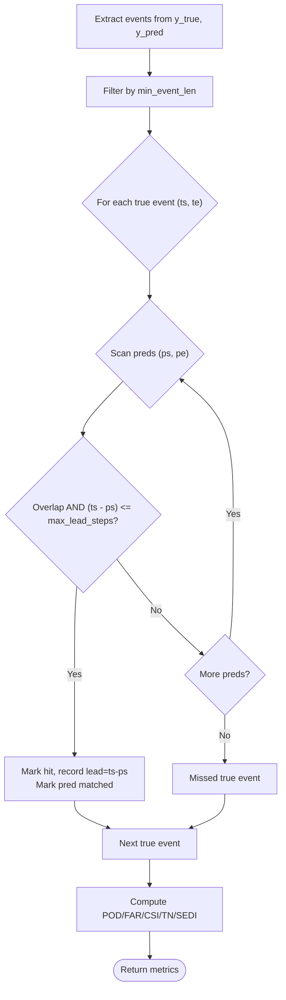
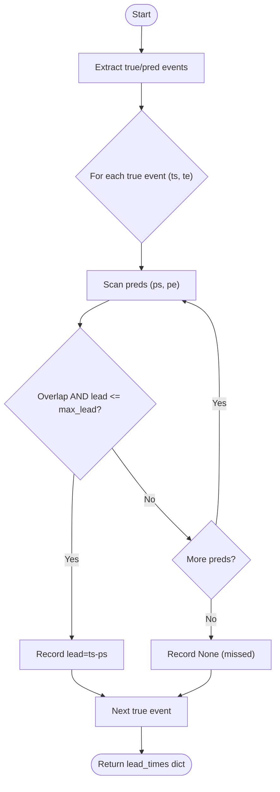
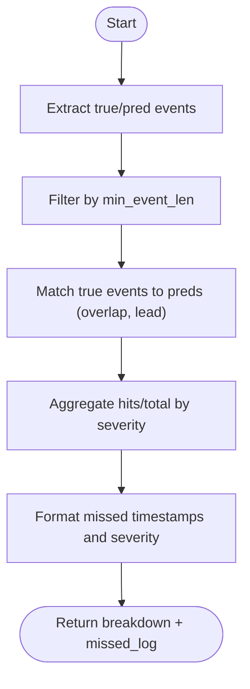
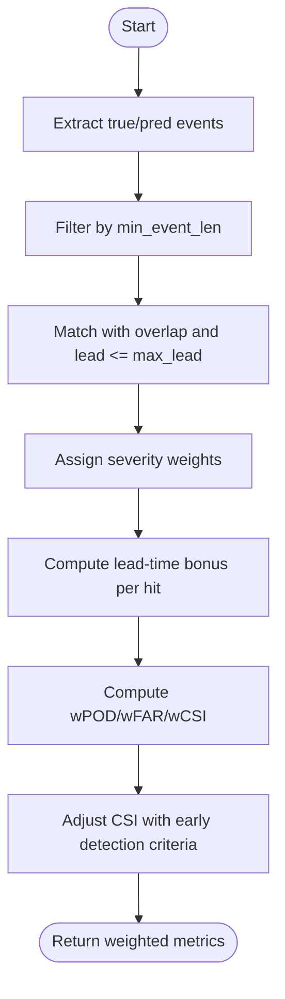
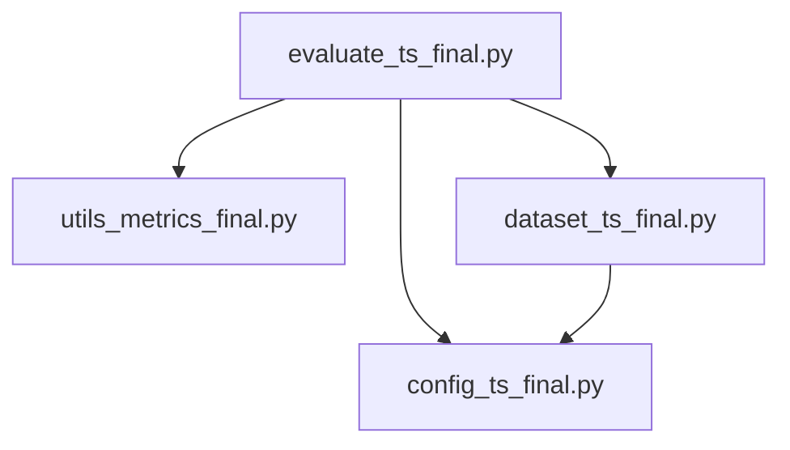

# Event-Based Metrics & Analysis

<cite>
**Referenced Files in This Document**
- [utils_metrics_final.py](file://utils_metrics_final.py)
- [evaluate_ts_final.py](file://evaluate_ts_final.py)
- [config_ts_final.py](file://config_ts_final.py)
- [dataset_ts_final.py](file://dataset_ts_final.py)
- [train_ts_final.py](file://train_ts_final.py)
- [extras/visualize_ts_events.py](file://extras/visualize_ts_events.py)
</cite>

## Table of Contents
1. [Introduction](#introduction)
2. [Project Structure](#project-structure)
3. [Core Components](#core-components)
4. [Architecture Overview](#architecture-overview)
5. [Detailed Component Analysis](#detailed-component-analysis)
6. [Dependency Analysis](#dependency-analysis)
7. [Performance Considerations](#performance-considerations)
8. [Troubleshooting Guide](#troubleshooting-guide)
9. [Conclusion](#conclusion)
10. [Appendices](#appendices)

## Introduction
This document explains event-level metrics and analysis for thunderstorm nowcasting in this codebase. It focuses on:
- Event extraction via run-length encoding
- Overlap-based event matching with lead time constraints
- Hit/false alarm detection
- Event-level scoring functions
- Comprehensive event analysis, severity breakdown, and missed event logging
- Temporal performance analysis via lead time computation and summaries
- Practical examples and visualization techniques

## Project Structure
Key modules involved in event-level evaluation:
- Metrics and event utilities: [utils_metrics_final.py](file://utils_metrics_final.py)
- Evaluation pipeline: [evaluate_ts_final.py](file://evaluate_ts_final.py)
- Configuration controlling thresholds, persistence, and lead time: [config_ts_final.py](file://config_ts_final.py)
- Dataset and severity labeling: [dataset_ts_final.py](file://dataset_ts_final.py)
- Training-side event analysis and logging: [train_ts_final.py](file://train_ts_final.py)
- Additional visualization utilities: [extras/visualize_ts_events.py](file://extras/visualize_ts_events.py)

**Diagram sources**
- [evaluate_ts_final.py:1-120](file://evaluate_ts_final.py#L1-L120)
- [utils_metrics_final.py:322-477](file://utils_metrics_final.py#L322-L477)
- [config_ts_final.py:87-136](file://config_ts_final.py#L87-L136)
- [dataset_ts_final.py:137-237](file://dataset_ts_final.py#L137-L237)
- [train_ts_final.py:600-757](file://train_ts_final.py#L600-L757)
- [extras/visualize_ts_events.py:1-217](file://extras/visualize_ts_events.py#L1-L217)

**Section sources**
- [evaluate_ts_final.py:1-120](file://evaluate_ts_final.py#L1-L120)
- [utils_metrics_final.py:322-477](file://utils_metrics_final.py#L322-L477)
- [config_ts_final.py:87-136](file://config_ts_final.py#L87-L136)
- [dataset_ts_final.py:137-237](file://dataset_ts_final.py#L137-L237)
- [train_ts_final.py:600-757](file://train_ts_final.py#L600-L757)
- [extras/visualize_ts_events.py:1-217](file://extras/visualize_ts_events.py#L1-L217)

## Core Components
- Event extraction: Converts a binary sequence into a list of (start, end) inclusive event spans using run-length encoding.
- Event-level metrics: Overlap-based matching with lead time constraints and hit/false alarm counting.
- Lead time computation: Computes lead time per true event and summarizes by category.
- Severity-weighted metrics: Computes event-level scores weighted by storm severity and lead-time bonuses.
- Event analysis: Provides severity breakdown and logs missed events with timestamps.

**Section sources**
- [utils_metrics_final.py:322-392](file://utils_metrics_final.py#L322-L392)
- [utils_metrics_final.py:395-440](file://utils_metrics_final.py#L395-L440)
- [utils_metrics_final.py:443-477](file://utils_metrics_final.py#L443-L477)
- [utils_metrics_final.py:520-572](file://utils_metrics_final.py#L520-L572)
- [utils_metrics_final.py:575-650](file://utils_metrics_final.py#L575-L650)

## Architecture Overview
End-to-end evaluation pipeline computes frame metrics, event metrics, lead times, and severity breakdown, then generates plots and bootstrap confidence intervals.

**Diagram sources**
- [evaluate_ts_final.py:575-641](file://evaluate_ts_final.py#L575-L641)
- [utils_metrics_final.py:338-392](file://utils_metrics_final.py#L338-L392)
- [utils_metrics_final.py:395-440](file://utils_metrics_final.py#L395-L440)
- [utils_metrics_final.py:520-572](file://utils_metrics_final.py#L520-L572)
- [utils_metrics_final.py:575-650](file://utils_metrics_final.py#L575-L650)

## Detailed Component Analysis

### Event Extraction via Run-Length Encoding
- Purpose: Convert a binary sequence into contiguous event spans.
- Algorithm: Iterate through the sequence, track transitions from 0→1 and 1→0, record start/end indices.
- Complexity: O(N) time, O(E) space for E extracted events.

**Diagram sources**
- [utils_metrics_final.py:322-335](file://utils_metrics_final.py#L322-L335)

**Section sources**
- [utils_metrics_final.py:322-335](file://utils_metrics_final.py#L322-L335)

### Overlap-Based Event Matching with Lead Time Constraints
- Purpose: Match predicted events to true events based on overlap and maximum lead time.
- Steps:
  - Extract events from y_true and y_pred.
  - Filter by minimum event length.
  - For each true event, scan predictions for overlap and lead constraint.
  - Record hits and mark matched predictions to avoid double-counting.
  - Compute misses and false alarms.
- Lead time definition: Lead = event_start − first_prediction_before_or_at_event; positive is early, negative is late, None is missed.

**Diagram sources**
- [utils_metrics_final.py:338-392](file://utils_metrics_final.py#L338-L392)

**Section sources**
- [utils_metrics_final.py:338-392](file://utils_metrics_final.py#L338-L392)

### Hit and False Alarm Detection
- Hits: True events matched to predictions with overlap and within lead time.
- Misses: True events not matched by any prediction under constraints.
- False Alarms: Predicted events not matched by any true event.
- TN estimation: Approximated as total possible non-overlapping events minus hits/misses/FAs.

**Section sources**
- [utils_metrics_final.py:356-392](file://utils_metrics_final.py#L356-L392)

### Minimum Event Length Filtering
- Both true and predicted events are filtered to length ≥ min_event_len before matching.
- Default min_event_len is configured in the evaluation script and training scripts.

**Section sources**
- [utils_metrics_final.py:346-354](file://utils_metrics_final.py#L346-L354)
- [evaluate_ts_final.py:629](file://evaluate_ts_final.py#L629)
- [train_ts_final.py:623](file://train_ts_final.py#L623)

### Lead Time Computation and Summary
- compute_lead_times:
  - For each true event, find the earliest prediction overlapping the event within max_lead_steps.
  - Lead = event_start − prediction_start; None if missed.
  - Optionally groups leads by severity category.
- summarize_lead_times:
  - Computes mean/median lead, early/late detection rates, and miss rate.
  - Handles backward-compatible list format.

**Diagram sources**
- [utils_metrics_final.py:395-440](file://utils_metrics_final.py#L395-L440)
- [utils_metrics_final.py:443-477](file://utils_metrics_final.py#L443-L477)

**Section sources**
- [utils_metrics_final.py:395-440](file://utils_metrics_final.py#L395-L440)
- [utils_metrics_final.py:443-477](file://utils_metrics_final.py#L443-L477)

### Severity Breakdown and Missed Event Logging
- analyze_event_detections:
  - Matches true events to predictions with overlap and lead constraints.
  - Aggregates hits/total by severity category.
  - Logs missed events with formatted timestamps.

**Diagram sources**
- [utils_metrics_final.py:520-572](file://utils_metrics_final.py#L520-L572)

**Section sources**
- [utils_metrics_final.py:520-572](file://utils_metrics_final.py#L520-L572)

### Severity-Weighted Event Metrics and Lead-Time Bonuses
- compute_weighted_event_metrics:
  - Computes weighted hits/misses/FAs using severity weights.
  - Applies lead-time bonus: +10% per step early (up to a capped effect).
  - Returns wPOD, wFAR, wCSI, and a lead-time adjusted variant (lt_wCSI_event).

**Diagram sources**
- [utils_metrics_final.py:575-650](file://utils_metrics_final.py#L575-L650)

**Section sources**
- [utils_metrics_final.py:575-650](file://utils_metrics_final.py#L575-L650)

### Bootstrapped Confidence Intervals for Event Metrics
- bootstrap_test_metrics:
  - Performs temporal block bootstrapping by calendar day to estimate 95% CI for frame/event/weighted metrics.
  - Returns point estimates and percentile bounds for each metric.

**Section sources**
- [utils_metrics_final.py:653-760](file://utils_metrics_final.py#L653-L760)

## Dependency Analysis
- evaluate_ts_final.py depends on utils_metrics_final.py for event metrics, lead times, and severity-weighted metrics.
- Severity labels come from dataset_ts_final.py and are propagated through evaluation.
- Configuration controls min_event_len, max_lead_steps, and threshold selection.

**Diagram sources**
- [evaluate_ts_final.py:29-34](file://evaluate_ts_final.py#L29-L34)
- [utils_metrics_final.py:322-650](file://utils_metrics_final.py#L322-L650)
- [dataset_ts_final.py:137-237](file://dataset_ts_final.py#L137-L237)
- [config_ts_final.py:87-136](file://config_ts_final.py#L87-L136)

**Section sources**
- [evaluate_ts_final.py:29-34](file://evaluate_ts_final.py#L29-L34)
- [utils_metrics_final.py:322-650](file://utils_metrics_final.py#L322-L650)
- [dataset_ts_final.py:137-237](file://dataset_ts_final.py#L137-L237)
- [config_ts_final.py:87-136](file://config_ts_final.py#L87-L136)

## Performance Considerations
- Event extraction is linear in sequence length.
- Overlap-based matching is quadratic in the number of true and predicted events; acceptable for typical nowcasting sequences.
- Lead-time constraints reduce candidate comparisons.
- Bootstrapping adds computational overhead but improves reliability of metric estimates.

## Troubleshooting Guide
- No hits despite detections:
  - Verify min_event_len is not too restrictive.
  - Confirm max_lead_steps allows predictions to precede or align with true starts.
- Missed events:
  - Check severity breakdown to identify under-detected categories.
  - Review missed event logs for recurring patterns.
- Lead-time bias:
  - Inspect lead time distributions by category; adjust thresholds or lead constraints accordingly.

**Section sources**
- [utils_metrics_final.py:346-392](file://utils_metrics_final.py#L346-L392)
- [utils_metrics_final.py:443-477](file://utils_metrics_final.py#L443-L477)
- [evaluate_ts_final.py:634-712](file://evaluate_ts_final.py#L634-L712)

## Conclusion
The event-level evaluation framework combines run-length encoded event extraction, overlap-based matching with lead-time constraints, and severity-weighted scoring to provide robust, interpretable metrics for thunderstorm nowcasting. It integrates seamlessly with the evaluation pipeline to support operational decision-making and performance visualization.

## Appendices

### Example: Event-Level Evaluation Workflow
- Extract events from y_true and y_pred.
- Filter by min_event_len.
- Match true events to predictions with overlap and lead ≤ max_lead_steps.
- Compute POD/FAR/CSI and SEDI.
- Summarize lead times and severity breakdown.
- Generate plots and bootstrap confidence intervals.

**Section sources**
- [utils_metrics_final.py:338-392](file://utils_metrics_final.py#L338-L392)
- [utils_metrics_final.py:395-440](file://utils_metrics_final.py#L395-L440)
- [utils_metrics_final.py:443-477](file://utils_metrics_final.py#L443-L477)
- [evaluate_ts_final.py:628-712](file://evaluate_ts_final.py#L628-L712)

### Visualization Techniques
- Severity performance bar chart: Compare event POD by category against global FAR.
- Lead time distribution: Boxplots with stripplots overlay by category.
- Dense time series plot: Smoothed probabilities, ground truth, and binary predictions over a window.

**Section sources**
- [evaluate_ts_final.py:98-278](file://evaluate_ts_final.py#L98-L278)

### Severity Classification Reference
- Severity categories used in analysis:
  - Severe Convective Storm (Squall)
  - Wind-Dominated / Dry Convective Storm
  - Heavy Precipitation Convective Storm
  - Mist / Low-Visibility Convective Storm
  - Standard Convective Storm
  - Marginal / Stray Convective Event

**Section sources**
- [utils_metrics_final.py:411-421](file://utils_metrics_final.py#L411-L421)
- [utils_metrics_final.py:540-548](file://utils_metrics_final.py#L540-L548)
- [dataset_ts_final.py:137-187](file://dataset_ts_final.py#L137-L187)