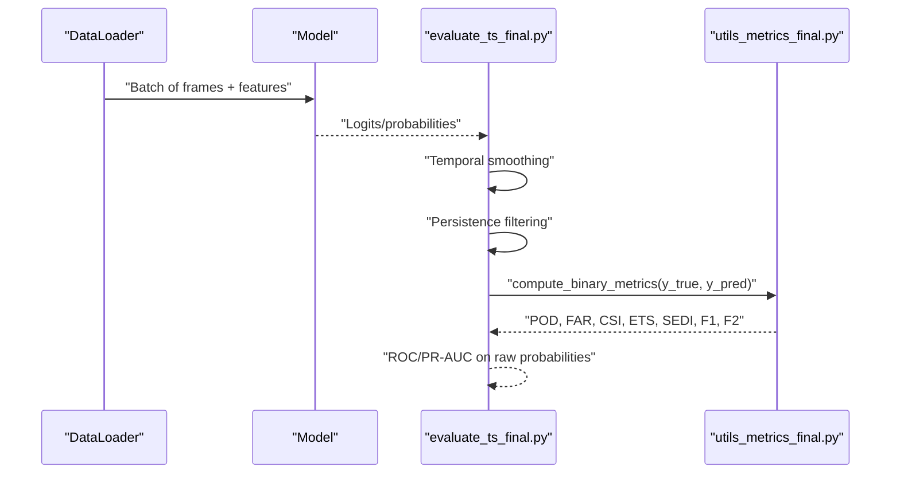
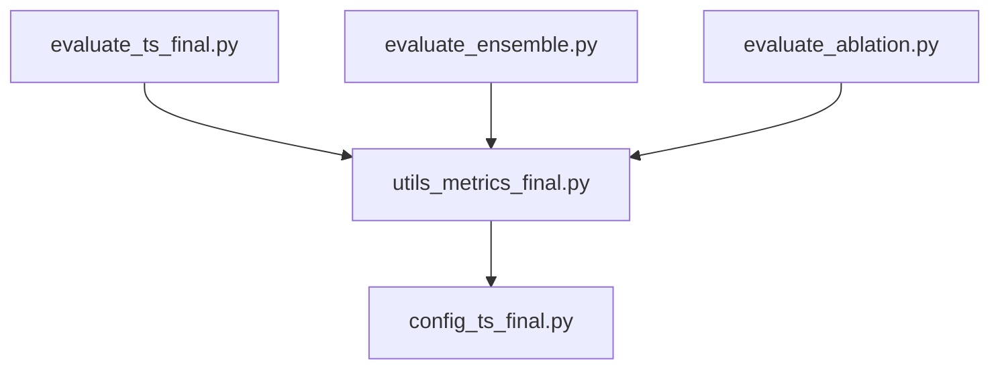

# Frame-Level Metrics

<cite>
**Referenced Files in This Document**
- [utils_metrics_final.py](file://utils_metrics_final.py)
- [evaluate_ts_final.py](file://evaluate_ts_final.py)
- [evaluate_ensemble.py](file://evaluate_ensemble.py)
- [evaluate_ablation.py](file://evaluate_ablation.py)
- [config_ts_final.py](file://config_ts_final.py)
- [utils_calibration.py](file://utils_calibration.py)
- [train_ts_final.py](file://train_ts_final.py)
</cite>

## Table of Contents
1. [Introduction](#introduction)
2. [Project Structure](#project-structure)
3. [Core Components](#core-components)
4. [Architecture Overview](#architecture-overview)
5. [Detailed Component Analysis](#detailed-component-analysis)
6. [Dependency Analysis](#dependency-analysis)
7. [Performance Considerations](#performance-considerations)
8. [Troubleshooting Guide](#troubleshooting-guide)
9. [Conclusion](#conclusion)
10. [Appendices](#appendices)

## Introduction
This document explains the frame-level evaluation metrics used in thunderstorm nowcasting within this project. It covers the computation of POD (Probability of Detection), FAR (False Alarm Ratio), CSI (Critical Success Index), ETS (Equitable Threat Score), SEDI (Symmetric Extremal Dependence Index), F1, and F2 scores. It documents the threshold-based evaluation system, probability-to-binary conversion, soft label handling, and soft label handling. It also describes temporal smoothing, persistence filtering, and hysteresis triggering, along with epsilon regularization for numerical stability and edge-case handling in rare-event scenarios. Finally, it provides examples of metric calculations, performance benchmarks, and comparisons between scoring systems.

## Project Structure
The evaluation pipeline integrates metric computation with post-processing and visualization. Key modules:
- Metric computation and post-processing utilities: [utils_metrics_final.py](file://utils_metrics_final.py)
- End-to-end evaluation for single models: [evaluate_ts_final.py](file://evaluate_ts_final.py)
- Ensemble evaluation: [evaluate_ensemble.py](file://evaluate_ensemble.py)
- Ablation study: [evaluate_ablation.py](file://evaluate_ablation.py)
- Configuration controlling thresholds, smoothing, and persistence: [config_ts_final.py](file://config_ts_final.py)
- Additional calibration and reliability analysis: [utils_calibration.py](file://utils_calibration.py)
- Training-time integration and logging: [train_ts_final.py](file://train_ts_final.py)

```mermaid
graph TB
subgraph "Evaluation"
EvalSingle["evaluate_ts_final.py"]
EvalEnsemble["evaluate_ensemble.py"]
EvalAblation["evaluate_ablation.py"]
end
subgraph "Metrics & Post-Processing"
UtilsMetrics["utils_metrics_final.py"]
UtilsCalib["utils_calibration.py"]
end
subgraph "Config"
Config["config_ts_final.py"]
end
subgraph "Training"
Train["train_ts_final.py"]
end
EvalSingle --> UtilsMetrics
EvalEnsemble --> UtilsMetrics
EvalAblation --> UtilsMetrics
UtilsMetrics --> Config
Train --> UtilsMetrics
EvalSingle --> UtilsCalib
```

**Diagram sources**
- [evaluate_ts_final.py:1-908](file://evaluate_ts_final.py#L1-L908)
- [evaluate_ensemble.py:1-361](file://evaluate_ensemble.py#L1-L361)
- [evaluate_ablation.py:1-307](file://evaluate_ablation.py#L1-L307)
- [utils_metrics_final.py:1-760](file://utils_metrics_final.py#L1-L760)
- [utils_calibration.py:1-420](file://utils_calibration.py#L1-L420)
- [config_ts_final.py:1-208](file://config_ts_final.py#L1-L208)
- [train_ts_final.py:1-200](file://train_ts_final.py#L1-L200)

**Section sources**
- [utils_metrics_final.py:1-760](file://utils_metrics_final.py#L1-L760)
- [evaluate_ts_final.py:1-908](file://evaluate_ts_final.py#L1-L908)
- [evaluate_ensemble.py:1-361](file://evaluate_ensemble.py#L1-L361)
- [evaluate_ablation.py:1-307](file://evaluate_ablation.py#L1-L307)
- [config_ts_final.py:1-208](file://config_ts_final.py#L1-L208)
- [utils_calibration.py:1-420](file://utils_calibration.py#L1-L420)
- [train_ts_final.py:1-200](file://train_ts_final.py#L1-L200)

## Core Components
- Threshold-based evaluation: Probability arrays are converted to binary predictions using a learned or configured threshold. The evaluation supports both single-threshold and dual-threshold (Schmitt trigger) strategies.
- Post-processing: Temporal smoothing (EMA or rolling mean) and persistence filtering remove short-lived false positives and stabilize predictions.
- Metric computation: Frame-level metrics (POD, FAR, CSI, ETS, SEDI, F1, F2) are computed from contingency counts (TP, FP, FN, TN) with epsilon regularization for numerical stability.
- Soft labels: Targets are treated as soft labels by converting to binary using a threshold greater than 0.5, enabling robustness against label noise.
- Weighted metrics: Event-level and severity-weighted metrics are available for operational use.

Key implementation references:
- Threshold selection and dual-threshold search: [find_best_threshold:192-240](file://utils_metrics_final.py#L192-L240), [find_best_dual_threshold:263-314](file://utils_metrics_final.py#L263-L314)
- Binary and probability-based metric computation: [compute_metrics:120-152](file://utils_metrics_final.py#L120-L152), [compute_binary_metrics:155-189](file://utils_metrics_final.py#L155-L189)
- Post-processing: [temporal_smooth_probs:23-47](file://utils_metrics_final.py#L23-L47), [apply_persistence:50-77](file://utils_metrics_final.py#L50-L77), [apply_schmitt_trigger:243-260](file://utils_metrics_final.py#L243-L260)
- Soft labels: [compute_metrics:129-130](file://utils_metrics_final.py#L129-L130), [compute_binary_metrics:166-167](file://utils_metrics_final.py#L166-L167)
- Numerical stability: [EPSILON](file://utils_metrics_final.py#L17), [compute_sedi:101-117](file://utils_metrics_final.py#L101-L117)

**Section sources**
- [utils_metrics_final.py:17-189](file://utils_metrics_final.py#L17-L189)
- [utils_metrics_final.py:101-117](file://utils_metrics_final.py#L101-L117)
- [utils_metrics_final.py:192-314](file://utils_metrics_final.py#L192-L314)

## Architecture Overview
The evaluation pipeline computes frame-level metrics after applying temporal smoothing and persistence filtering. Threshold selection is performed on validation data to avoid leakage and to maximize a chosen metric (e.g., F2, ETS, SEDI, or weighted event metrics).



**Diagram sources**
- [evaluate_ts_final.py:508-621](file://evaluate_ts_final.py#L508-L621)
- [utils_metrics_final.py:155-189](file://utils_metrics_final.py#L155-L189)

**Section sources**
- [evaluate_ts_final.py:508-621](file://evaluate_ts_final.py#L508-L621)
- [utils_metrics_final.py:155-189](file://utils_metrics_final.py#L155-L189)

## Detailed Component Analysis

### Mathematical Formulations and Implementation Details
- POD (Probability of Detection / Hit Rate / Recall)
  - Definition: TP / (TP + FN)
  - Implementation: [compute_metrics](file://utils_metrics_final.py#L141), [compute_binary_metrics](file://utils_metrics_final.py#L178)
- FAR (False Alarm Ratio)
  - Definition: FP / (TP + FP)
  - Implementation: [compute_metrics](file://utils_metrics_final.py#L142), [compute_binary_metrics](file://utils_metrics_final.py#L179)
- CSI (Critical Success Index)
  - Definition: TP / (TP + FP + FN)
  - Implementation: [compute_metrics](file://utils_metrics_final.py#L143), [compute_binary_metrics](file://utils_metrics_final.py#L180)
- ETS (Equitable Threat Score)
  - Definition: (TP - H_rand) / (TP + FP + FN - H_rand)
  - H_rand = (TP + FP) * (TP + FN) / N
  - Implementation: [compute_metrics:144-145](file://utils_metrics_final.py#L144-L145), [compute_binary_metrics:181-182](file://utils_metrics_final.py#L181-L182)
- SEDI (Symmetric Extremal Dependence Index)
  - Computation: Uses POD and POFD (probability of false detection) with clipping and epsilon regularization
  - Implementation: [compute_sedi:101-117](file://utils_metrics_final.py#L101-L117)
- F1 and F2 Scores
  - F1: 2*TP / (2*TP + FP + FN)
  - F2: 5*TP / (5*TP + 4*FN + FP)
  - Implementation: [compute_metrics:149-150](file://utils_metrics_final.py#L149-L150), [compute_binary_metrics:185-186](file://utils_metrics_final.py#L185-L186)

Interpretation guidelines:
- POD: Higher is better; reflects ability to detect events.
- FAR: Lower is better; reflects proportion of false alarms among all positives.
- CSI: Lower baseline dependence than POD/FAR; balanced measure.
- ETS: Adjusts for random hit rate; preferred for model selection.
- SEDI: Base-rate independent; useful for rare events.
- F1/F2: F2 heavily weights recall while penalizing false alarms; suitable for imbalanced settings.

Numerical stability:
- Epsilon regularization prevents division by zero and logarithmic singularities.
- Clipping ensures intermediate rates remain away from 0 and 1 for SEDI.

Soft labels:
- Targets are converted to binary using a threshold > 0.5 to handle soft labels.

Threshold-based evaluation:
- Single threshold: [compute_metrics](file://utils_metrics_final.py#L129), [compute_binary_metrics:166-167](file://utils_metrics_final.py#L166-L167)
- Dual-threshold (Schmitt trigger): [find_best_dual_threshold:263-314](file://utils_metrics_final.py#L263-L314), [apply_schmitt_trigger:243-260](file://utils_metrics_final.py#L243-L260)

Temporal smoothing and persistence:
- Smoothing: [temporal_smooth_probs:23-47](file://utils_metrics_final.py#L23-L47)
- Persistence: [apply_persistence:50-77](file://utils_metrics_final.py#L50-L77)

**Section sources**
- [utils_metrics_final.py:101-189](file://utils_metrics_final.py#L101-L189)
- [utils_metrics_final.py:192-314](file://utils_metrics_final.py#L192-L314)

### Threshold Selection and Post-Processing
- Validation-derived threshold search:
  - Grid search over thresholds to maximize a chosen metric (F2, F1, ETS, SEDI, or weighted event metrics).
  - Supports persistence filtering during grid search.
  - References: [find_best_threshold:192-240](file://utils_metrics_final.py#L192-L240)
- Dual-threshold (Schmitt trigger) search:
  - Grid search over (th_high, th_low_offset) pairs; hysteresis reduces temporal chatter.
  - References: [find_best_dual_threshold:263-314](file://utils_metrics_final.py#L263-L314), [apply_schmitt_trigger:243-260](file://utils_metrics_final.py#L243-L260)
- Post-processing:
  - Temporal smoothing: [temporal_smooth_probs:23-47](file://utils_metrics_final.py#L23-L47)
  - Persistence filtering: [apply_persistence:50-77](file://utils_metrics_final.py#L50-L77)
- Configuration defaults:
  - Smoothing window and method, persistence minimum length, threshold metric, minimum threshold, and Schmitt trigger enablement are configurable.
  - References: [config_ts_final.py:87-94](file://config_ts_final.py#L87-L94)

**Section sources**
- [utils_metrics_final.py:23-77](file://utils_metrics_final.py#L23-L77)
- [utils_metrics_final.py:192-314](file://utils_metrics_final.py#L192-L314)
- [config_ts_final.py:87-94](file://config_ts_final.py#L87-L94)

### Soft Labels and Label Smoothing
- Soft labels:
  - Targets are treated as soft labels by casting to binary using a threshold > 0.5.
  - References: [compute_metrics:129-130](file://utils_metrics_final.py#L129-L130), [compute_binary_metrics:166-167](file://utils_metrics_final.py#L166-L167)
- Training-time label smoothing:
  - The training configuration includes label smoothing to prevent overconfidence.
  - Reference: [config_ts_final.py:66](file://config_ts_final.py#L66)

**Section sources**
- [utils_metrics_final.py:129-167](file://utils_metrics_final.py#L129-L167)
- [config_ts_final.py:66](file://config_ts_final.py#L66)

### Examples of Metric Calculations
- Example computation path:
  - Probability array: [compute_metrics:120-152](file://utils_metrics_final.py#L120-L152)
  - Binary metrics from already-thresholded arrays: [compute_binary_metrics:155-189](file://utils_metrics_final.py#L155-L189)
- End-to-end evaluation:
  - Single model: [evaluate_ts_final.py:607-610](file://evaluate_ts_final.py#L607-L610)
  - Ensemble: [evaluate_ensemble.py:259-260](file://evaluate_ensemble.py#L259-L260)

**Section sources**
- [utils_metrics_final.py:120-189](file://utils_metrics_final.py#L120-L189)
- [evaluate_ts_final.py:607-610](file://evaluate_ts_final.py#L607-L610)
- [evaluate_ensemble.py:259-260](file://evaluate_ensemble.py#L259-L260)

### Performance Benchmarks and Comparisons
- Benchmark references:
  - Training configuration indicates best ETS, CSI, and POD achieved during training.
  - Reference: [config_ts_final.py:4](file://config_ts_final.py#L4)
- Comparison between scoring systems:
  - ETS adjusts for random hits; SEDI is base-rate independent; F2 emphasizes recall in imbalanced settings.
  - Implementation references: [compute_metrics:144-150](file://utils_metrics_final.py#L144-L150), [compute_binary_metrics:181-186](file://utils_metrics_final.py#L181-L186)

**Section sources**
- [config_ts_final.py:4](file://config_ts_final.py#L4)
- [utils_metrics_final.py:144-186](file://utils_metrics_final.py#L144-L186)

### Edge Cases and Rare Event Handling
- SEDI computation:
  - Handles zero-event baserate and near-zero/false-positive rates using clipping and epsilon.
  - Reference: [compute_sedi:101-117](file://utils_metrics_final.py#L101-L117)
- Epsilon regularization:
  - Used in denominators to avoid infinities and NaNs.
  - Reference: [utils_metrics_final.py:17](file://utils_metrics_final.py#L17)
- Persistence filtering:
  - Removes short runs of false positives; severe events can bypass persistence with a higher threshold.
  - References: [apply_persistence:50-77](file://utils_metrics_final.py#L50-L77), [evaluate_ts_final.py:550-573](file://evaluate_ts_final.py#L550-L573)

**Section sources**
- [utils_metrics_final.py:101-117](file://utils_metrics_final.py#L101-L117)
- [utils_metrics_final.py:17](file://utils_metrics_final.py#L17)
- [utils_metrics_final.py:50-77](file://utils_metrics_final.py#L50-L77)
- [evaluate_ts_final.py:550-573](file://evaluate_ts_final.py#L550-L573)

## Dependency Analysis
- Evaluation scripts depend on metric utilities for computing frame-level scores and on configuration for thresholds and post-processing parameters.
- Training-time integration demonstrates how metrics are used during training and logging.



**Diagram sources**
- [evaluate_ts_final.py:1-908](file://evaluate_ts_final.py#L1-L908)
- [evaluate_ensemble.py:1-361](file://evaluate_ensemble.py#L1-L361)
- [evaluate_ablation.py:1-307](file://evaluate_ablation.py#L1-L307)
- [utils_metrics_final.py:1-760](file://utils_metrics_final.py#L1-L760)
- [config_ts_final.py:1-208](file://config_ts_final.py#L1-L208)

**Section sources**
- [evaluate_ts_final.py:1-908](file://evaluate_ts_final.py#L1-L908)
- [evaluate_ensemble.py:1-361](file://evaluate_ensemble.py#L1-L361)
- [evaluate_ablation.py:1-307](file://evaluate_ablation.py#L1-L307)
- [utils_metrics_final.py:1-760](file://utils_metrics_final.py#L1-L760)
- [config_ts_final.py:1-208](file://config_ts_final.py#L1-L208)

## Performance Considerations
- Temporal smoothing reduces noise and temporal chatter; EMA is recommended for nowcasting.
- Persistence filtering improves practical performance by suppressing short-lived false positives.
- Dual-threshold (Schmitt trigger) reduces temporal switching without relying solely on persistence.
- Weighted event metrics and lead-time bonuses improve interpretability and operational relevance.

[No sources needed since this section provides general guidance]

## Troubleshooting Guide
Common issues and remedies:
- Division by zero or NaN in metrics:
  - Ensure epsilon regularization is active and contingency counts are non-negative.
  - Reference: [utils_metrics_final.py:17](file://utils_metrics_final.py#L17)
- SEDI undefined for rare events:
  - Verify clipping and epsilon are applied; check base-rate independence assumptions.
  - Reference: [compute_sedi:101-117](file://utils_metrics_final.py#L101-L117)
- Overly sensitive thresholds:
  - Use validation-derived thresholds and consider dual-threshold search.
  - References: [find_best_threshold:192-240](file://utils_metrics_final.py#L192-L240), [find_best_dual_threshold:263-314](file://utils_metrics_final.py#L263-L314)
- Misalignment between raw probabilities and evaluation:
  - Apply identical smoothing and persistence to both training and evaluation.
  - References: [evaluate_ts_final.py:583-600](file://evaluate_ts_final.py#L583-L600), [evaluate_ensemble.py:239-250](file://evaluate_ensemble.py#L239-L250)

**Section sources**
- [utils_metrics_final.py:17](file://utils_metrics_final.py#L17)
- [utils_metrics_final.py:101-117](file://utils_metrics_final.py#L101-L117)
- [utils_metrics_final.py:192-314](file://utils_metrics_final.py#L192-L314)
- [evaluate_ts_final.py:583-600](file://evaluate_ts_final.py#L583-L600)
- [evaluate_ensemble.py:239-250](file://evaluate_ensemble.py#L239-L250)

## Conclusion
The evaluation framework provides robust, numerically stable frame-level metrics tailored for thunderstorm nowcasting. It combines threshold selection, temporal smoothing, and persistence filtering to produce practical, interpretable scores. SEDI and ETS address base-rate challenges, while F2 balances recall and false alarms in imbalanced settings. The pipeline’s configuration and utilities support reproducible, reliable evaluation across single and ensemble models.

[No sources needed since this section summarizes without analyzing specific files]

## Appendices

### Appendix A: Metric Definitions and Interpretation
- POD: Proportion of observed events correctly predicted.
- FAR: Proportion of predicted events that were false alarms.
- CSI: Proportion of predicted events that were correct, accounting for false alarms.
- ETS: Adjusts CSI for random hits; preferred for model selection.
- SEDI: Base-rate independent; useful for rare events.
- F1/F2: Harmonic means emphasizing precision/recall trade-offs.

[No sources needed since this section provides general guidance]

### Appendix B: Configuration Keys Relevant to Evaluation
- Smoothing: SMOOTH_WINDOW, SMOOTH_METHOD
- Persistence: PERSISTENCE_MIN_LEN
- Thresholding: THRESHOLD_METRIC, MIN_THRESHOLD, USE_SCHMITT_TRIGGER
- References: [config_ts_final.py:87-94](file://config_ts_final.py#L87-L94)

**Section sources**
- [config_ts_final.py:87-94](file://config_ts_final.py#L87-L94)