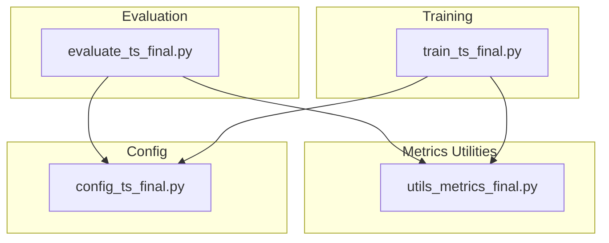
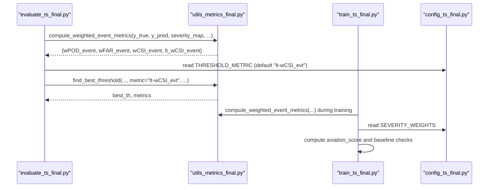
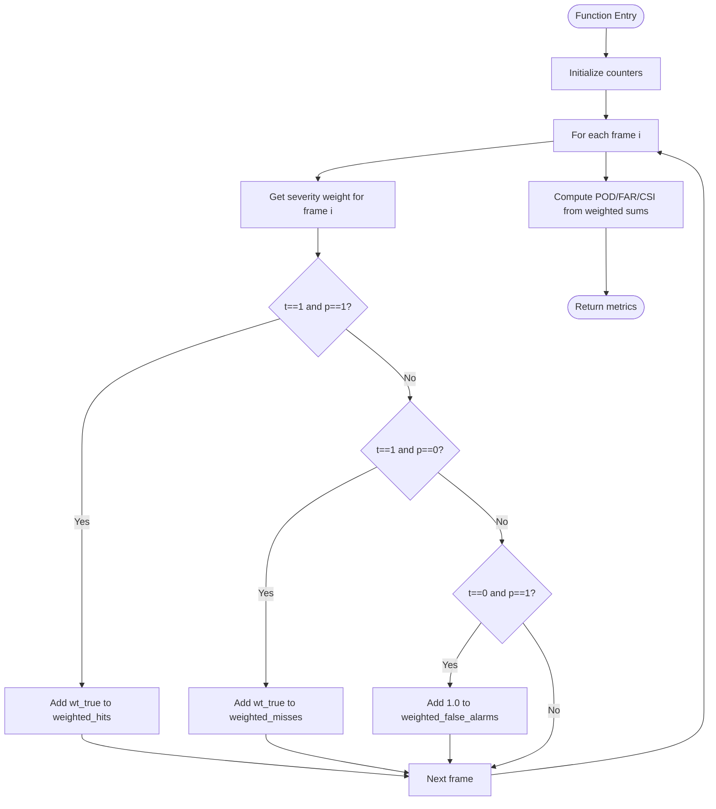
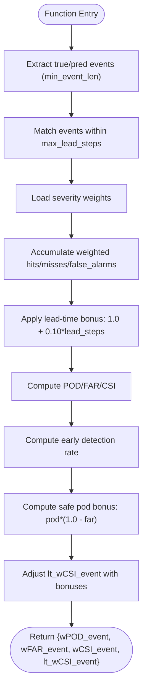
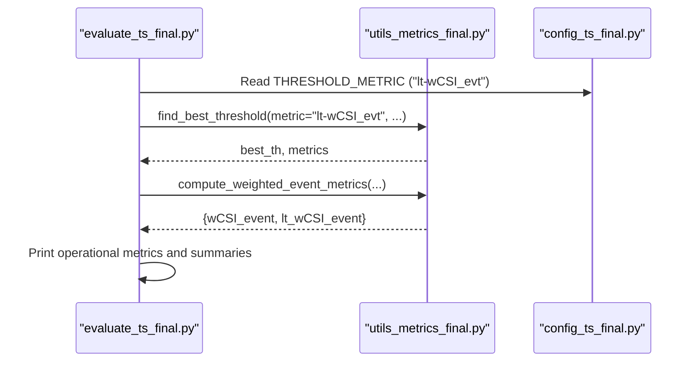
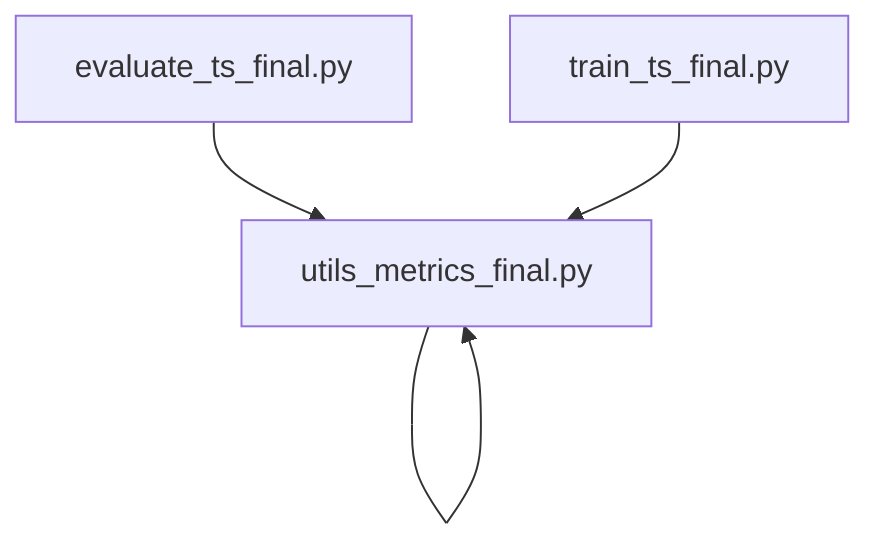

# Severity-Weighted Metrics

<cite>
**Referenced Files in This Document**
- [utils_metrics_final.py](file://utils_metrics_final.py)
- [evaluate_ts_final.py](file://evaluate_ts_final.py)
- [train_ts_final.py](file://train_ts_final.py)
- [config_ts_final.py](file://config_ts_final.py)
</cite>

## Table of Contents
1. [Introduction](#introduction)
2. [Project Structure](#project-structure)
3. [Core Components](#core-components)
4. [Architecture Overview](#architecture-overview)
5. [Detailed Component Analysis](#detailed-component-analysis)
6. [Dependency Analysis](#dependency-analysis)
7. [Performance Considerations](#performance-considerations)
8. [Troubleshooting Guide](#troubleshooting-guide)
9. [Conclusion](#conclusion)
10. [Appendices](#appendices)

## Introduction
This document explains the severity-weighted evaluation framework used for convective storm prediction. It focuses on two key functions:
- compute_severity_weighted_metrics: severity-weighted frame-level metrics
- compute_weighted_event_metrics: severity-weighted event-level metrics with lead time bonus and safety pod adjustments

It documents the weight hierarchy for storm severity classes, the lead time bonus system (+10% per step early detection), safety pod bonus calculation, temporal weighting schemes, and operational threshold selection strategies.

## Project Structure
The severity-weighted metrics are implemented in the metrics utility module and consumed by evaluation and training scripts. Configuration defines operational defaults and severity weights.

**Diagram sources**
- [utils_metrics_final.py:479-650](file://utils_metrics_final.py#L479-L650)
- [evaluate_ts_final.py:638-641](file://evaluate_ts_final.py#L638-L641)
- [train_ts_final.py:547-551](file://train_ts_final.py#L547-L551)
- [config_ts_final.py:96-104](file://config_ts_final.py#L96-L104)

**Section sources**
- [utils_metrics_final.py:479-650](file://utils_metrics_final.py#L479-L650)
- [evaluate_ts_final.py:638-641](file://evaluate_ts_final.py#L638-L641)
- [train_ts_final.py:547-551](file://train_ts_final.py#L547-L551)
- [config_ts_final.py:96-104](file://config_ts_final.py#L96-L104)

## Core Components
- compute_severity_weighted_metrics: computes weighted POD/FAR/CSI at the frame level using severity weights mapped by frame index.
- compute_weighted_event_metrics: computes weighted event-level POD/FAR/CSI, applies lead-time bonus (+10% per step early), and adds safety pod adjustments to produce lt_wCSI_event.

Key behaviors:
- Severity weights are applied to hits and misses; false alarms default to unit weight.
- Lead-time bonus multiplies hit weight by 1.0 + 0.10 × lead_steps (non-negative).
- Safety pod bonus: pod × (1.0 - far) contributes to a secondary CSI-like adjustment.
- Early detection rate thresholding adds small bonuses to the final CSI-like score.

**Section sources**
- [utils_metrics_final.py:479-518](file://utils_metrics_final.py#L479-L518)
- [utils_metrics_final.py:575-650](file://utils_metrics_final.py#L575-L650)

## Architecture Overview
The evaluation pipeline computes severity-weighted metrics alongside standard frame/event metrics. Threshold selection optimizes a lead-time-aware weighted CSI variant.

**Diagram sources**
- [evaluate_ts_final.py:543-547](file://evaluate_ts_final.py#L543-L547)
- [evaluate_ts_final.py:638-641](file://evaluate_ts_final.py#L638-L641)
- [train_ts_final.py:547-551](file://train_ts_final.py#L547-L551)
- [config_ts_final.py:92-104](file://config_ts_final.py#L92-L104)

## Detailed Component Analysis

### compute_severity_weighted_metrics
Computes severity-weighted frame-level POD/FAR/CSI by weighting hits and misses according to the severity class of each frame’s start time.

- Weight hierarchy:
  - Marginal / Stray Convective Event: 0.75
  - Standard Convective Storm: 1.0
  - Mist / Low-Visibility Convective Storm: 1.25
  - Heavy Precipitation Convective Storm: 1.75
  - Wind-Dominated / Dry Convective Storm: 2.0
  - Severe Convective Storm (Squall): 3.0
  - none: 0.5 (fallback)

- Weighting logic:
  - Hits: weighted by severity of the true occurrence
  - Misses: weighted by severity of the true occurrence
  - False alarms: weighted by 1.0

- Output:
  - weighted_POD, weighted_FAR, weighted_CSI

**Diagram sources**
- [utils_metrics_final.py:479-518](file://utils_metrics_final.py#L479-L518)

**Section sources**
- [utils_metrics_final.py:479-518](file://utils_metrics_final.py#L479-L518)

### compute_weighted_event_metrics
Computes severity-weighted event-level POD/FAR/CSI with:
- Event matching constrained by maximum lead steps
- Lead-time bonus: +10% per step early detection (non-negative lead steps)
- Safety pod bonus: pod × (1.0 - far)
- Final CSI-like score lt_wCSI_event with early detection and safety bonuses

**Diagram sources**
- [utils_metrics_final.py:575-650](file://utils_metrics_final.py#L575-L650)

**Section sources**
- [utils_metrics_final.py:575-650](file://utils_metrics_final.py#L575-L650)

### Lead Time Bonus System and Safety Pod Adjustment
- Lead-time bonus: For each matched event, if lead_steps ≥ 0, multiply hit weight by (1.0 + 0.10 × lead_steps). This increases the contribution of early detections.
- Safety pod adjustment: A secondary CSI-like score is computed by adding small bonuses when early detection rate ≥ 0.60 and when safe pod bonus ≥ 0.60. The final score is capped at 1.0.

Operational implications:
- Encourages early detection without penalizing late detections.
- Balances skill with safety by incorporating false alarm control.

**Section sources**
- [utils_metrics_final.py:618-644](file://utils_metrics_final.py#L618-L644)

### Weight Hierarchy for Storm Severity Classes
The severity weights used in both frame-level and event-level computations are defined consistently:

- Marginal / Stray Convective Event: 0.75
- Standard Convective Storm: 1.0
- Mist / Low-Visibility Convective Storm: 1.25
- Heavy Precipitation Convective Storm: 1.75
- Wind-Dominated / Dry Convective Storm: 2.0
- Severe Convective Storm (Squall): 3.0
- none: 0.5 (fallback)

These weights reflect increasing operational importance, with squalls receiving the highest weight.

**Section sources**
- [utils_metrics_final.py:486-494](file://utils_metrics_final.py#L486-L494)
- [utils_metrics_final.py:599-607](file://utils_metrics_final.py#L599-L607)
- [config_ts_final.py:96-104](file://config_ts_final.py#L96-L104)

### Temporal Weighting Schemes
- Frame-level weighting: Severity weights applied per frame index.
- Event-level weighting: Severity weights applied per event start index; combined with lead-time bonus.
- Persistence filtering: Applied before computing weighted metrics to reduce spurious detections.

**Section sources**
- [utils_metrics_final.py:50-77](file://utils_metrics_final.py#L50-L77)
- [utils_metrics_final.py:575-650](file://utils_metrics_final.py#L575-L650)

### Operational Threshold Setting and Performance Prioritization
- Threshold selection: The evaluation script selects thresholds by optimizing “lt-wCSI_evt” (lead-time-aware weighted CSI), balancing detection skill with early detection and safety.
- Severe fast-track: Optionally identifies a separate threshold for severe events to improve detection of high-impact systems.
- Baseline checks: During training, an aviation score and baseline criteria enforce operational safety (e.g., minimum wPOD_evt, early detection rate, maximum wFAR_evt).

**Diagram sources**
- [evaluate_ts_final.py:543-547](file://evaluate_ts_final.py#L543-L547)
- [evaluate_ts_final.py:638-641](file://evaluate_ts_final.py#L638-L641)
- [config_ts_final.py:92-93](file://config_ts_final.py#L92-L93)

**Section sources**
- [evaluate_ts_final.py:543-547](file://evaluate_ts_final.py#L543-L547)
- [evaluate_ts_final.py:638-641](file://evaluate_ts_final.py#L638-L641)
- [train_ts_final.py:600-601](file://train_ts_final.py#L600-L601)
- [train_ts_final.py:637-661](file://train_ts_final.py#L637-L661)

## Dependency Analysis
- compute_weighted_event_metrics depends on:
  - extract_events and event overlap logic
  - severity label mapping keyed by event start index
  - lead-time computation and summarization
- Threshold optimization functions depend on compute_weighted_event_metrics to select thresholds that maximize lead-time-aware weighted CSI.

**Diagram sources**
- [utils_metrics_final.py:322-392](file://utils_metrics_final.py#L322-L392)
- [utils_metrics_final.py:395-478](file://utils_metrics_final.py#L395-L478)
- [utils_metrics_final.py:575-650](file://utils_metrics_final.py#L575-L650)
- [evaluate_ts_final.py:638-641](file://evaluate_ts_final.py#L638-L641)
- [train_ts_final.py:547-551](file://train_ts_final.py#L547-L551)

**Section sources**
- [utils_metrics_final.py:322-392](file://utils_metrics_final.py#L322-L392)
- [utils_metrics_final.py:395-478](file://utils_metrics_final.py#L395-L478)
- [utils_metrics_final.py:575-650](file://utils_metrics_final.py#L575-L650)
- [evaluate_ts_final.py:638-641](file://evaluate_ts_final.py#L638-L641)
- [train_ts_final.py:547-551](file://train_ts_final.py#L547-L551)

## Performance Considerations
- Computational cost: Weighted event metrics require event extraction and matching; consider min_event_len and max_lead_steps to balance accuracy and speed.
- Stability: Small epsilon is used in denominators to avoid division by zero.
- Calibration: Platt scaling can improve reliability of probabilities before threshold selection.

[No sources needed since this section provides general guidance]

## Troubleshooting Guide
Common issues and resolutions:
- No matched events: Early detection rate and lead-time bonuses may be undefined; ensure sufficient overlap within max_lead_steps.
- Empty severity labels: Fallback to standard storm weight; verify label mapping keys align with frame/event indices.
- High false alarm rate: Consider adjusting thresholds or applying severe fast-track threshold to improve safety pod bonus.

**Section sources**
- [utils_metrics_final.py:618-644](file://utils_metrics_final.py#L618-L644)
- [utils_metrics_final.py:500-512](file://utils_metrics_final.py#L500-L512)

## Conclusion
The severity-weighted metrics provide a robust, operationally meaningful evaluation framework for convective storm prediction. They emphasize early detection, incorporate safety controls, and prioritize high-impact storm types. Threshold selection guided by lead-time-aware weighted CSI ensures practical utility for nowcasting operations.

[No sources needed since this section summarizes without analyzing specific files]

## Appendices

### Practical Examples
- Severity-weighted frame-level evaluation: Use compute_severity_weighted_metrics to assess skill across storm categories with appropriate weighting.
- Event-level evaluation with lead-time bonus: Use compute_weighted_event_metrics to quantify detection skill adjusted for timing and safety.
- Operational threshold setting: Use find_best_threshold with metric="lt-wCSI_evt" to select thresholds that balance skill, early detection, and safety.

**Section sources**
- [utils_metrics_final.py:479-518](file://utils_metrics_final.py#L479-L518)
- [utils_metrics_final.py:575-650](file://utils_metrics_final.py#L575-L650)
- [evaluate_ts_final.py:543-547](file://evaluate_ts_final.py#L543-L547)