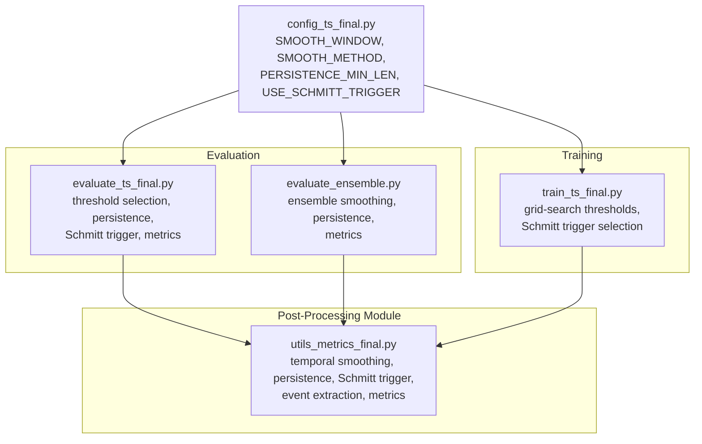
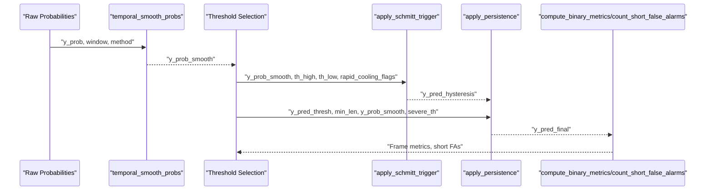
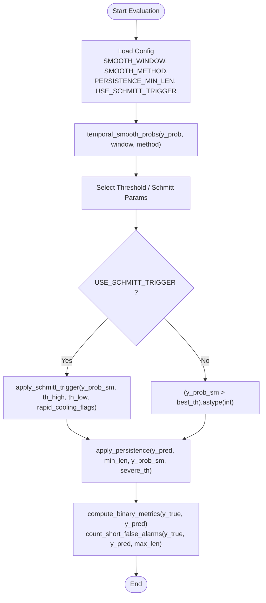
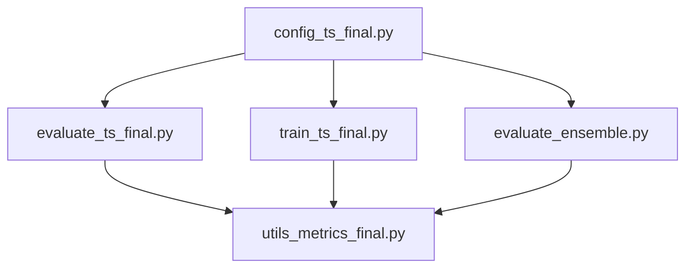

# Temporal Post-Processing

<cite>
**Referenced Files in This Document**
- [utils_metrics_final.py](file://utils_metrics_final.py)
- [config_ts_final.py](file://config_ts_final.py)
- [evaluate_ts_final.py](file://evaluate_ts_final.py)
- [train_ts_final.py](file://train_ts_final.py)
- [evaluate_ensemble.py](file://evaluate_ensemble.py)
</cite>

## Table of Contents
1. [Introduction](#introduction)
2. [Project Structure](#project-structure)
3. [Core Components](#core-components)
4. [Architecture Overview](#architecture-overview)
5. [Detailed Component Analysis](#detailed-component-analysis)
6. [Dependency Analysis](#dependency-analysis)
7. [Performance Considerations](#performance-considerations)
8. [Troubleshooting Guide](#troubleshooting-guide)
9. [Conclusion](#conclusion)
10. [Appendices](#appendices)

## Introduction
This document explains temporal post-processing techniques used in thunderstorm nowcasting evaluation. It focuses on three core temporal operators:
- temporal_smooth_probs: smoothing of raw probabilities using exponential moving average or rolling mean
- apply_persistence: removal of isolated false alarms with minimum run-length filtering and severe-event preservation
- apply_schmitt_trigger: hysteresis-based event triggering with high/low thresholds and rapid cooling flag handling
It also covers count_short_false_alarms for stray-event monitoring and temporal quality assessment, and provides practical workflows, parameter tuning guidelines, and integration with evaluation pipelines.

## Project Structure
Temporal post-processing is implemented in a dedicated module and integrated across evaluation and training scripts. Configuration constants define smoothing window size, persistence filter behavior, and Schmitt-trigger usage.

**Diagram sources**
- [utils_metrics_final.py](file://utils_metrics_final.py)
- [config_ts_final.py](file://config_ts_final.py)
- [evaluate_ts_final.py](file://evaluate_ts_final.py)
- [train_ts_final.py](file://train_ts_final.py)
- [evaluate_ensemble.py](file://evaluate_ensemble.py)

**Section sources**
- [utils_metrics_final.py](file://utils_metrics_final.py)
- [config_ts_final.py](file://config_ts_final.py)
- [evaluate_ts_final.py](file://evaluate_ts_final.py)
- [train_ts_final.py](file://train_ts_final.py)
- [evaluate_ensemble.py](file://evaluate_ensemble.py)

## Core Components
- temporal_smooth_probs: Applies exponential moving average (EMA) or rolling mean smoothing to a probability sequence. Window size and method are configurable.
- apply_persistence: Filters out short positive runs (false alarms) by enforcing a minimum run length. Optionally preserves runs that exceed a severe probability threshold.
- apply_schmitt_trigger: Implements hysteresis triggering with high and low thresholds. Supports rapid cooling flags to immediately end an active state.
- count_short_false_alarms: Counts predicted events that are short and false alarms, useful for monitoring stray events.

**Section sources**
- [utils_metrics_final.py:23-47](file://utils_metrics_final.py#L23-L47)
- [utils_metrics_final.py:50-77](file://utils_metrics_final.py#L50-L77)
- [utils_metrics_final.py:243-260](file://utils_metrics_final.py#L243-L260)
- [utils_metrics_final.py:80-94](file://utils_metrics_final.py#L80-L94)

## Architecture Overview
The temporal post-processing pipeline integrates smoothing, thresholding, persistence filtering, and Schmitt-trigger hysteresis. Evaluation scripts select thresholds and optional Schmitt-trigger parameters, then apply persistence and counting metrics.

**Diagram sources**
- [utils_metrics_final.py:23-47](file://utils_metrics_final.py#L23-L47)
- [utils_metrics_final.py:243-260](file://utils_metrics_final.py#L243-L260)
- [utils_metrics_final.py:50-77](file://utils_metrics_final.py#L50-L77)
- [utils_metrics_final.py:80-94](file://utils_metrics_final.py#L80-L94)
- [evaluate_ts_final.py:590-610](file://evaluate_ts_final.py#L590-L610)

## Detailed Component Analysis

### temporal_smooth_probs
Implements two smoothing modes:
- Exponential Moving Average (EMA): recent frames receive higher weight; suitable for nowcasting to suppress isolated spikes.
- Rolling Mean: simple average over the window.

Key parameters:
- window: smoothing window size
- method: 'ema' or 'mean'

Implementation highlights:
- EMA initialization uses the first probability value.
- Rolling mean computes local averages over [i - window + 1, i].

Practical guidance:
- Use EMA for temporal consistency in nowcasting.
- Choose window based on cadence and desired smoothing strength; smaller windows preserve more dynamics, larger windows reduce noise.

**Section sources**
- [utils_metrics_final.py:23-47](file://utils_metrics_final.py#L23-L47)

### apply_persistence
Removes isolated false alarms by enforcing a minimum run length. Preserves runs that contain a severe event probability threshold.

Behavior:
- Scans the binary prediction sequence.
- For each positive run, checks if any frame meets the severe threshold.
- If the run is shorter than the required minimum (1 if severe, otherwise min_len), zeros out the run.
- Supports optional severe threshold and probability sequence for severe-aware filtering.

Practical guidance:
- Increase min_len to suppress transient false alarms.
- Use severe threshold to protect strong severe events from persistence filtering.

**Section sources**
- [utils_metrics_final.py:50-77](file://utils_metrics_final.py#L50-L77)

### apply_schmitt_trigger
Implements hysteresis-based triggering:
- Starts an event when probability reaches or exceeds th_high.
- Ends the event when probability drops below th_low.
- Rapid cooling flags can force immediate end of an active state.

Parameters:
- th_high: high threshold to start an event
- th_low: low threshold to end an event
- rapid_cooling_flags: optional boolean array indicating rapid cooling frames

Practical guidance:
- Choose th_high and th_low such that th_high > th_low and both are in [0, 1].
- Use rapid_cooling_flags to handle rapid dissipation scenarios.

**Section sources**
- [utils_metrics_final.py:243-260](file://utils_metrics_final.py#L243-L260)

### count_short_false_alarms
Counts predicted events that are short (≤ max_len frames) and false alarms. Useful for monitoring the impact of persistence filtering on stray events.

Algorithm:
- Extracts predicted and true event segments.
- Counts predicted events whose duration is ≤ max_len and that do not overlap with any true event.

**Section sources**
- [utils_metrics_final.py:80-94](file://utils_metrics_final.py#L80-L94)

### Integration with Evaluation Pipelines
- Configuration defines smoothing window, method, persistence minimum length, Schmitt-trigger enablement, and threshold optimization metric.
- Training script performs grid-search over thresholds and Schmitt-trigger dual thresholds, selecting the best parameters.
- Evaluation script applies smoothing, optional Schmitt-trigger, persistence filtering, and computes metrics including short false alarm counts.

**Diagram sources**
- [config_ts_final.py:90-97](file://config_ts_final.py#L90-L97)
- [utils_metrics_final.py:23-47](file://utils_metrics_final.py#L23-L47)
- [utils_metrics_final.py:243-260](file://utils_metrics_final.py#L243-L260)
- [utils_metrics_final.py:50-77](file://utils_metrics_final.py#L50-L77)
- [utils_metrics_final.py:80-94](file://utils_metrics_final.py#L80-L94)
- [evaluate_ts_final.py:590-610](file://evaluate_ts_final.py#L590-L610)

**Section sources**
- [config_ts_final.py:90-97](file://config_ts_final.py#L90-L97)
- [evaluate_ts_final.py:590-610](file://evaluate_ts_final.py#L590-L610)
- [train_ts_final.py:518-532](file://train_ts_final.py#L518-L532)
- [evaluate_ensemble.py:247-259](file://evaluate_ensemble.py#L247-L259)

## Dependency Analysis
- utils_metrics_final.py provides all temporal post-processing functions and is used by evaluation and training scripts.
- Configuration constants drive behavior across scripts.
- Evaluation scripts depend on metrics computation and event extraction utilities.

**Diagram sources**
- [utils_metrics_final.py](file://utils_metrics_final.py)
- [config_ts_final.py](file://config_ts_final.py)
- [evaluate_ts_final.py](file://evaluate_ts_final.py)
- [train_ts_final.py](file://train_ts_final.py)
- [evaluate_ensemble.py](file://evaluate_ensemble.py)

**Section sources**
- [utils_metrics_final.py](file://utils_metrics_final.py)
- [config_ts_final.py](file://config_ts_final.py)
- [evaluate_ts_final.py](file://evaluate_ts_final.py)
- [train_ts_final.py](file://train_ts_final.py)
- [evaluate_ensemble.py](file://evaluate_ensemble.py)

## Performance Considerations
- EMA smoothing is O(n) with minimal overhead; rolling mean requires local averaging per step.
- Persistence filtering scans the sequence once; complexity is O(n).
- Schmitt-trigger state machine is O(n); rapid cooling flags add negligible overhead.
- Grid-search for thresholds and Schmitt-trigger parameters increases computational cost; cache best parameters for reuse.

## Troubleshooting Guide
Common issues and remedies:
- Over-smoothing leading to delayed detections: reduce SMOOTH_WINDOW or switch to rolling mean with smaller window.
- Too many false alarms persisting: increase PERSISTENCE_MIN_LEN; consider severe threshold to preserve strong severe events.
- Hysteresis too sensitive to noise: raise th_high and th_low; ensure th_high > th_low.
- Rapid cooling not respected: verify rapid_cooling_flags shape and alignment with timestamps.

Validation tips:
- Monitor short false alarm counts to assess persistence aggressiveness.
- Compare frame metrics before and after applying temporal post-processing.

**Section sources**
- [utils_metrics_final.py:23-47](file://utils_metrics_final.py#L23-L47)
- [utils_metrics_final.py:50-77](file://utils_metrics_final.py#L50-L77)
- [utils_metrics_final.py:243-260](file://utils_metrics_final.py#L243-L260)
- [utils_metrics_final.py:80-94](file://utils_metrics_final.py#L80-L94)
- [evaluate_ts_final.py:608](file://evaluate_ts_final.py#L608)

## Conclusion
Temporal post-processing enhances nowcasting reliability by suppressing noise, reducing false alarms, and stabilizing event boundaries. EMA smoothing, persistence filtering, and Schmitt-trigger hysteresis form a robust pipeline. Proper parameter tuning and integration with evaluation workflows yield improved skill metrics and reduced stray events.

## Appendices

### Practical Workflows and Parameter Tuning Guidelines
- Smoothing:
  - Use EMA with window size aligned to cadence (e.g., 2–3 frames for 30-min cadence).
  - Validate with rolling mean for comparison.
- Persistence:
  - Start with PERSISTENCE_MIN_LEN = 3; increase if stray events remain.
  - Set severe threshold to preserve strong severe events.
- Schmitt-trigger:
  - Grid-search th_high ∈ [0.15, 0.45], th_low = th_high - offset ∈ [0.05, 0.20].
  - Enable rapid cooling flags when modeling rapid dissipation.
- Evaluation:
  - Compute short false alarm counts to monitor temporal quality.
  - Use weighted event metrics to balance lead-time and severity.

**Section sources**
- [config_ts_final.py:90-97](file://config_ts_final.py#L90-L97)
- [utils_metrics_final.py:243-260](file://utils_metrics_final.py#L243-L260)
- [utils_metrics_final.py:80-94](file://utils_metrics_final.py#L80-L94)
- [evaluate_ts_final.py:590-610](file://evaluate_ts_final.py#L590-L610)