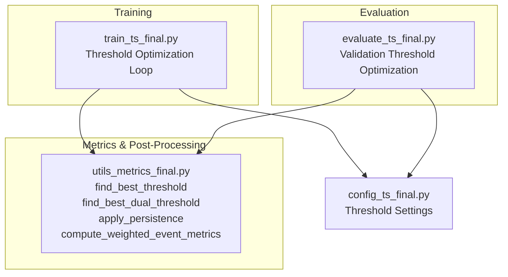
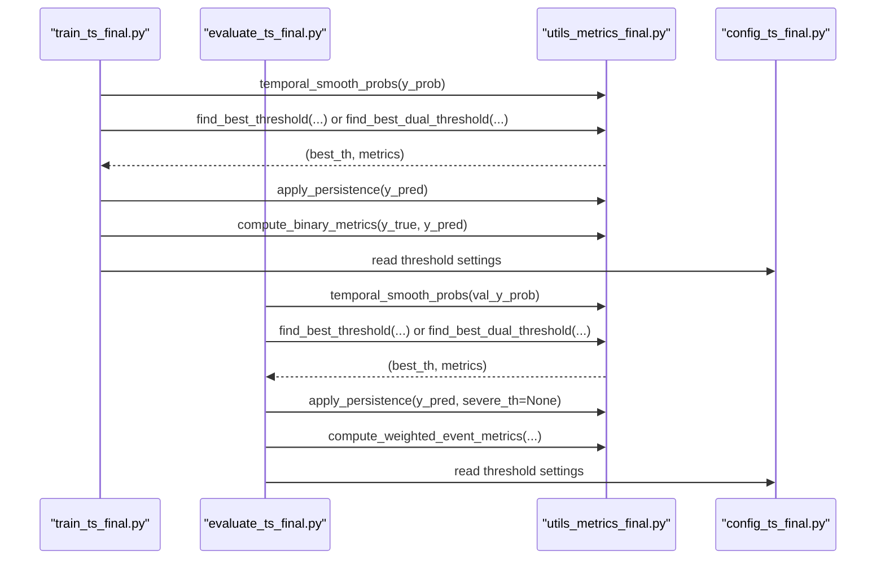
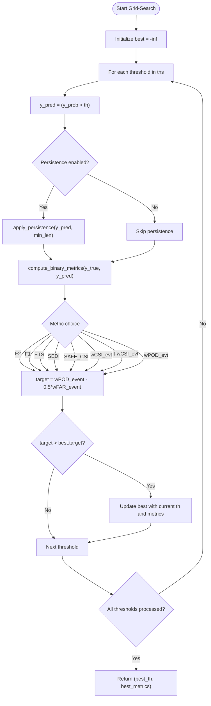
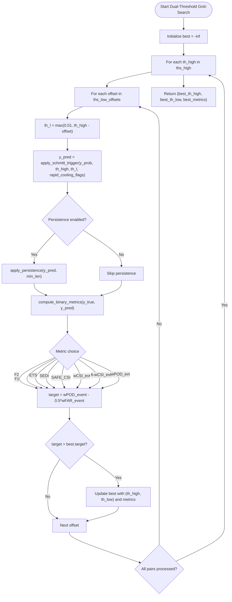
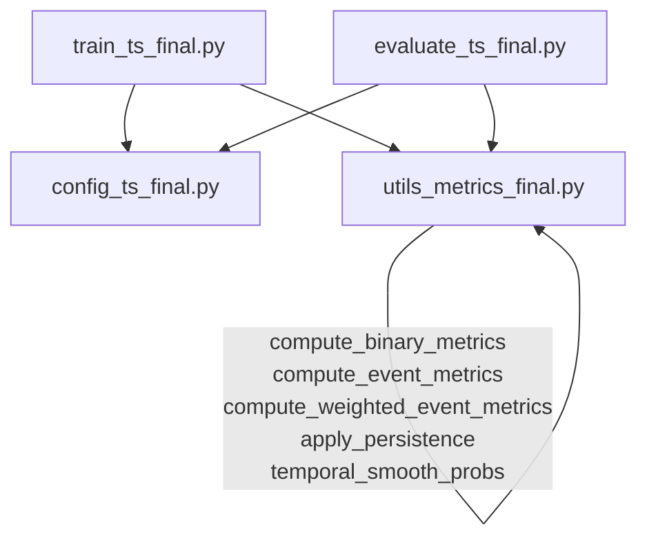

# Threshold Optimization & Selection

<cite>
**Referenced Files in This Document**
- [utils_metrics_final.py](file://utils_metrics_final.py)
- [train_ts_final.py](file://train_ts_final.py)
- [evaluate_ts_final.py](file://evaluate_ts_final.py)
- [config_ts_final.py](file://config_ts_final.py)
</cite>

## Table of Contents
1. [Introduction](#introduction)
2. [Project Structure](#project-structure)
3. [Core Components](#core-components)
4. [Architecture Overview](#architecture-overview)
5. [Detailed Component Analysis](#detailed-component-analysis)
6. [Dependency Analysis](#dependency-analysis)
7. [Performance Considerations](#performance-considerations)
8. [Troubleshooting Guide](#troubleshooting-guide)
9. [Conclusion](#conclusion)
10. [Appendices](#appendices)

## Introduction
This document explains threshold optimization algorithms used for convective storm prediction in the repository. It covers:
- Grid-search for a single probability threshold
- Dual-threshold optimization using Schmitt trigger hysteresis
- Metric-driven threshold selection strategies
- Persistence filtering integration
- Severity-weighted optimization
- Lead time-aware threshold selection
- Practical workflows and operational recommendations for aviation safety

## Project Structure
The threshold optimization pipeline spans several modules:
- Metrics and post-processing utilities in utils_metrics_final.py
- Training-time threshold optimization in train_ts_final.py
- Evaluation-time threshold optimization in evaluate_ts_final.py
- Configuration controlling thresholds and optimization behavior in config_ts_final.py

**Diagram sources**
- [train_ts_final.py:518-536](file://train_ts_final.py#L518-L536)
- [evaluate_ts_final.py:530-547](file://evaluate_ts_final.py#L530-L547)
- [utils_metrics_final.py:192-314](file://utils_metrics_final.py#L192-L314)
- [config_ts_final.py:92-94](file://config_ts_final.py#L92-L94)

**Section sources**
- [train_ts_final.py:508-557](file://train_ts_final.py#L508-L557)
- [evaluate_ts_final.py:524-548](file://evaluate_ts_final.py#L524-L548)
- [utils_metrics_final.py:192-314](file://utils_metrics_final.py#L192-L314)
- [config_ts_final.py:92-94](file://config_ts_final.py#L92-L94)

## Core Components
- Single-threshold grid search: find_best_threshold
- Dual-threshold grid search with Schmitt trigger: find_best_dual_threshold
- Persistence filtering: apply_persistence
- Weighted event metrics with lead-time bonus: compute_weighted_event_metrics
- Temporal smoothing: temporal_smooth_probs
- Binary/event/severity metrics: compute_binary_metrics, compute_event_metrics, compute_severity_weighted_metrics

These components are orchestrated during training and evaluation to select optimal thresholds for operational use.

**Section sources**
- [utils_metrics_final.py:192-314](file://utils_metrics_final.py#L192-L314)
- [utils_metrics_final.py:50-77](file://utils_metrics_final.py#L50-L77)
- [utils_metrics_final.py:575-650](file://utils_metrics_final.py#L575-L650)
- [train_ts_final.py:518-536](file://train_ts_final.py#L518-L536)
- [evaluate_ts_final.py:530-547](file://evaluate_ts_final.py#L530-L547)

## Architecture Overview
The threshold optimization architecture integrates model outputs with temporal smoothing, persistence filtering, and metric-driven selection.

**Diagram sources**
- [train_ts_final.py:508-557](file://train_ts_final.py#L508-L557)
- [evaluate_ts_final.py:524-600](file://evaluate_ts_final.py#L524-L600)
- [utils_metrics_final.py:23-47](file://utils_metrics_final.py#L23-L47)
- [utils_metrics_final.py:192-314](file://utils_metrics_final.py#L192-L314)
- [utils_metrics_final.py:50-77](file://utils_metrics_final.py#L50-L77)
- [utils_metrics_final.py:575-650](file://utils_metrics_final.py#L575-L650)
- [config_ts_final.py:92-94](file://config_ts_final.py#L92-L94)

## Detailed Component Analysis

### Grid-Search Threshold Optimization (Single Threshold)
The single-threshold optimization uses a grid search over a parameter space of candidate thresholds. It evaluates a chosen metric and selects the threshold that maximizes it.

Key behaviors:
- Parameter space: defaults to a linear grid over a range with a fixed number of points.
- Optional persistence filtering: applied before computing metrics when configured.
- Metric selection: supports multiple metrics including F2, F1, ETS, SEDI, SAFE_CSI, and weighted event metrics.

**Diagram sources**
- [utils_metrics_final.py:192-240](file://utils_metrics_final.py#L192-L240)
- [utils_metrics_final.py:221-235](file://utils_metrics_final.py#L221-L235)
- [utils_metrics_final.py:50-77](file://utils_metrics_final.py#L50-L77)
- [utils_metrics_final.py:155-189](file://utils_metrics_final.py#L155-L189)

**Section sources**
- [utils_metrics_final.py:192-240](file://utils_metrics_final.py#L192-L240)
- [train_ts_final.py:529-535](file://train_ts_final.py#L529-L535)
- [evaluate_ts_final.py:542-547](file://evaluate_ts_final.py#L542-L547)

### Dual-Threshold Optimization Using Schmitt Trigger Hysteresis
Dual-threshold optimization explores combinations of high and low thresholds to reduce temporal chattering while maintaining sensitivity. The Schmitt trigger maintains activation until the probability drops below the lower threshold.

Key behaviors:
- Parameter spaces:
  - ths_high: linear grid over a range
  - ths_low_offsets: offsets subtracted from th_high to compute th_low
- Rapid cooling flagging: optional immediate triggering when flagged
- Persistence filtering: optional post-Schmitt filtering
- Metric selection: same as single-threshold optimization

**Diagram sources**
- [utils_metrics_final.py:263-314](file://utils_metrics_final.py#L263-L314)
- [utils_metrics_final.py:243-260](file://utils_metrics_final.py#L243-L260)
- [utils_metrics_final.py:50-77](file://utils_metrics_final.py#L50-L77)
- [utils_metrics_final.py:155-189](file://utils_metrics_final.py#L155-L189)

**Section sources**
- [utils_metrics_final.py:263-314](file://utils_metrics_final.py#L263-L314)
- [train_ts_final.py:518-528](file://train_ts_final.py#L518-L528)
- [evaluate_ts_final.py:530-540](file://evaluate_ts_final.py#L530-L540)

### Metric-Driven Threshold Selection Strategies
The optimization supports multiple metrics tailored to aviation safety:
- F2: optimal for imbalanced settings; heavily weights recall while penalizing false alarms
- F1: balanced harmonic mean of precision and recall
- ETS: equitable threat score for model selection
- SEDI: symmetric extremal dependence index for rare events
- SAFE_CSI: CSI adjusted by FAR threshold
- wCSI_evt: severity-weighted CSI at event level
- lt-wCSI_evt: lead-time-aware CSI at event level with bonuses for early detection and safe POD
- wPOD_evt: severity-weighted POD minus half of weighted FAR

These strategies enable tuning for operational goals such as minimizing false alarms while maximizing detection and lead time.

**Section sources**
- [utils_metrics_final.py:221-235](file://utils_metrics_final.py#L221-L235)
- [utils_metrics_final.py:295-309](file://utils_metrics_final.py#L295-L309)
- [utils_metrics_final.py:628-643](file://utils_metrics_final.py#L628-L643)

### Persistence Filtering Integration
Persistence filtering removes short-lived false positives by requiring runs of positive predictions to exceed a minimum length. It can be configured to bypass filtering for severe events identified by a high-probability threshold.

Key behaviors:
- Minimum length threshold controls run-length filtering
- Optional severe-threshold bypass allows immediate retention of runs containing high-probability severe events
- Applied before computing metrics to reflect operational filtering

**Section sources**
- [utils_metrics_final.py:50-77](file://utils_metrics_final.py#L50-L77)
- [train_ts_final.py:538](file://train_ts_final.py#L538)
- [evaluate_ts_final.py:600](file://evaluate_ts_final.py#L600)

### Severity-Weighted Optimization
Severity-weighted metrics adjust the importance of hits, misses, and false alarms according to event severity categories. This enables prioritizing detection of severe weather events.

Implementation highlights:
- Severity weights mapped to categories
- Weighted POD, FAR, and CSI computed at frame level
- Event-level weighted metrics with lead-time bonus and early-detection enhancements

**Section sources**
- [utils_metrics_final.py:479-518](file://utils_metrics_final.py#L479-L518)
- [utils_metrics_final.py:575-650](file://utils_metrics_final.py#L575-L650)

### Lead Time-Aware Threshold Selection
Lead time awareness augments event-level metrics by rewarding early detections and safe POD/FAR combinations. The lead-time-aware CSI includes bonuses when early detection rate and safe POD bonus meet thresholds.

Key behaviors:
- Early detection rate threshold triggers lead-time bonus
- Safe POD bonus threshold triggers additional CSI bonus
- Caps maximum lead-time-aware CSI at 1.0

**Section sources**
- [utils_metrics_final.py:628-643](file://utils_metrics_final.py#L628-L643)

### Practical Workflows and Operational Recommendations

#### Training-Time Workflow
- Smooth raw probabilities temporally
- Select best threshold or dual thresholds based on configured metric
- Apply persistence filtering
- Evaluate frame and event metrics, including weighted event metrics and lead times
- Track aviation score and operational baselines

Operational recommendations:
- Use lead-time-aware CSI for threshold optimization in operational settings
- Increase minimum persistence length to reduce false alarms
- Consider Schmitt trigger hysteresis to reduce temporal chattering

**Section sources**
- [train_ts_final.py:508-557](file://train_ts_final.py#L508-L557)
- [config_ts_final.py:92-94](file://config_ts_final.py#L92-L94)

#### Evaluation-Time Workflow
- Calibrate or smooth validation probabilities
- Derive best threshold or dual thresholds on validation set
- Optionally tune a severe fast-track threshold for high-probability severe events
- Apply persistence filtering and compute weighted event metrics and lead times
- Report operational metrics and severity breakdown

Operational recommendations:
- Use validation-derived thresholds for testing
- Monitor weighted event metrics and lead-time statistics
- Consider severe fast-track threshold to improve detection of severe events

**Section sources**
- [evaluate_ts_final.py:524-600](file://evaluate_ts_final.py#L524-L600)
- [config_ts_final.py:135](file://config_ts_final.py#L135)

## Dependency Analysis
Threshold optimization depends on:
- Metrics and post-processing utilities
- Configuration for threshold settings and optimization behavior
- Temporal smoothing and persistence filtering
- Weighted event metrics and lead-time computations

**Diagram sources**
- [train_ts_final.py:508-557](file://train_ts_final.py#L508-L557)
- [evaluate_ts_final.py:524-600](file://evaluate_ts_final.py#L524-L600)
- [utils_metrics_final.py:155-189](file://utils_metrics_final.py#L155-L189)
- [utils_metrics_final.py:338-392](file://utils_metrics_final.py#L338-L392)
- [utils_metrics_final.py:575-650](file://utils_metrics_final.py#L575-L650)
- [utils_metrics_final.py:50-77](file://utils_metrics_final.py#L50-L77)
- [utils_metrics_final.py:23-47](file://utils_metrics_final.py#L23-L47)
- [config_ts_final.py:92-94](file://config_ts_final.py#L92-L94)

**Section sources**
- [train_ts_final.py:508-557](file://train_ts_final.py#L508-L557)
- [evaluate_ts_final.py:524-600](file://evaluate_ts_final.py#L524-L600)
- [utils_metrics_final.py:155-189](file://utils_metrics_final.py#L155-L189)
- [utils_metrics_final.py:338-392](file://utils_metrics_final.py#L338-L392)
- [utils_metrics_final.py:575-650](file://utils_metrics_final.py#L575-L650)
- [utils_metrics_final.py:50-77](file://utils_metrics_final.py#L50-L77)
- [utils_metrics_final.py:23-47](file://utils_metrics_final.py#L23-L47)
- [config_ts_final.py:92-94](file://config_ts_final.py#L92-L94)

## Performance Considerations
- Computational cost: Grid search scales with the product of parameter-space sizes. Reduce grid resolution or limit parameter ranges for speed.
- Temporal smoothing: Exponential moving average reduces noise but can delay detection slightly; tune smoothing window and method.
- Persistence filtering: Increasing minimum length reduces false alarms but may increase misses; balance against operational requirements.
- Schmitt trigger: Improves temporal stability; tune high and low thresholds to minimize chattering without missing events.
- Weighted metrics: Severity weighting increases computational overhead; use only when operational goals require it.

[No sources needed since this section provides general guidance]

## Troubleshooting Guide
Common issues and resolutions:
- Poor detection with high thresholds: Consider lowering minimum threshold or using lead-time-aware metrics.
- Excessive false alarms: Increase persistence minimum length or use SAFE_CSI or weighted metrics.
- Missed severe events: Enable severe fast-track threshold tuning or increase severe category weights.
- Slow optimization: Reduce grid resolution or disable Schmitt trigger for quick baseline tuning.
- Validation vs test mismatch: Use validation-derived thresholds for testing; ensure identical smoothing and persistence settings.

**Section sources**
- [train_ts_final.py:538-557](file://train_ts_final.py#L538-L557)
- [evaluate_ts_final.py:550-573](file://evaluate_ts_final.py#L550-L573)
- [config_ts_final.py:92-94](file://config_ts_final.py#L92-L94)

## Conclusion
The repository implements robust threshold optimization for convective storm prediction, combining grid search, Schmitt trigger hysteresis, persistence filtering, and lead-time-aware metrics. By leveraging weighted event metrics and operational baselines, it supports aviation safety goals of minimizing false alarms while maximizing detection and lead time.

[No sources needed since this section summarizes without analyzing specific files]

## Appendices

### API Definitions
- find_best_threshold
  - Inputs: y_true, y_prob, ths (optional), metric, persistence_min_len, severity_labels (optional), max_lead_steps
  - Outputs: best_th, best_ETS, best_CSI, best_POD, best_FAR, best_SEDI, best_metric_val
- find_best_dual_threshold
  - Inputs: y_true, y_prob, ths_high (optional), ths_low_offsets (optional), metric, persistence_min_len, severity_labels (optional), max_lead_steps, rapid_cooling_flags (optional)
  - Outputs: best_th_high, best_th_low, best_ETS, best_CSI, best_POD, best_FAR, best_SEDI, best_metric_val
- apply_persistence
  - Inputs: y_pred, min_len, y_prob (optional), severe_th (optional)
  - Outputs: y_pred filtered by persistence
- compute_weighted_event_metrics
  - Inputs: y_true, y_pred, severity_labels, min_event_len, max_lead_steps
  - Outputs: dict with wPOD_event, wFAR_event, wCSI_event, lt_wCSI_event

**Section sources**
- [utils_metrics_final.py:192-240](file://utils_metrics_final.py#L192-L240)
- [utils_metrics_final.py:263-314](file://utils_metrics_final.py#L263-L314)
- [utils_metrics_final.py:50-77](file://utils_metrics_final.py#L50-L77)
- [utils_metrics_final.py:575-650](file://utils_metrics_final.py#L575-L650)