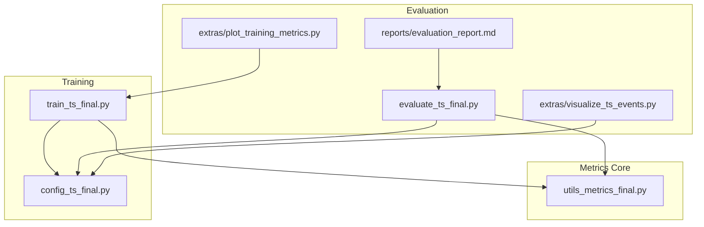
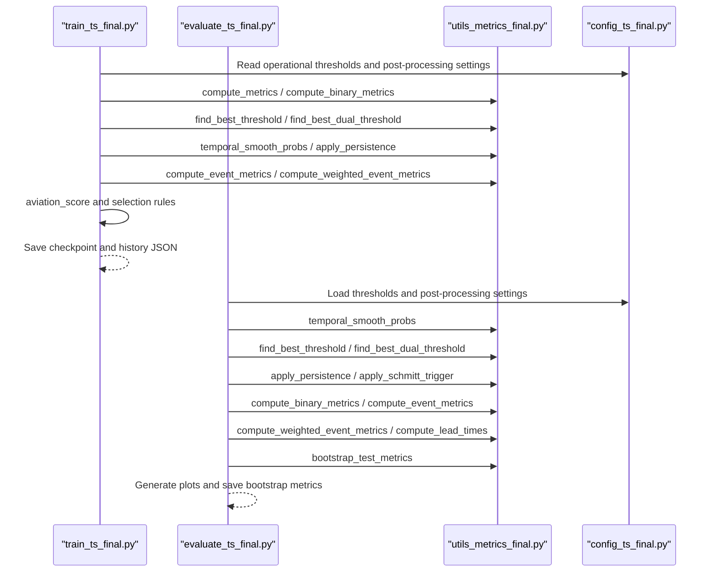
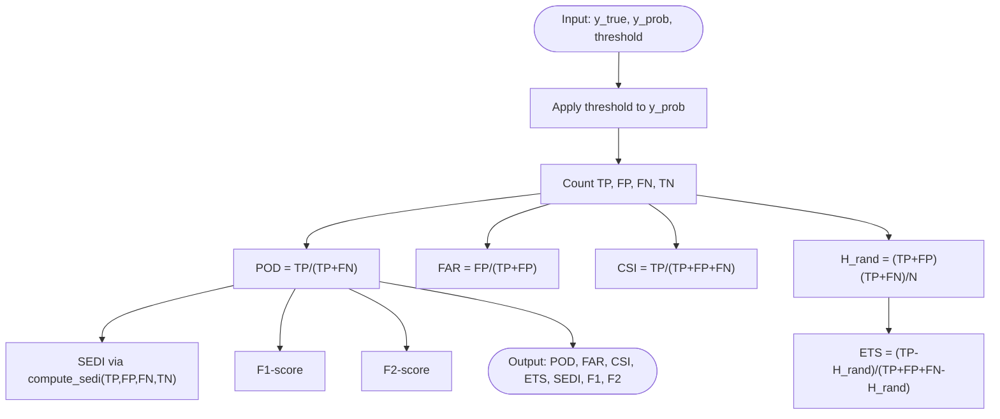
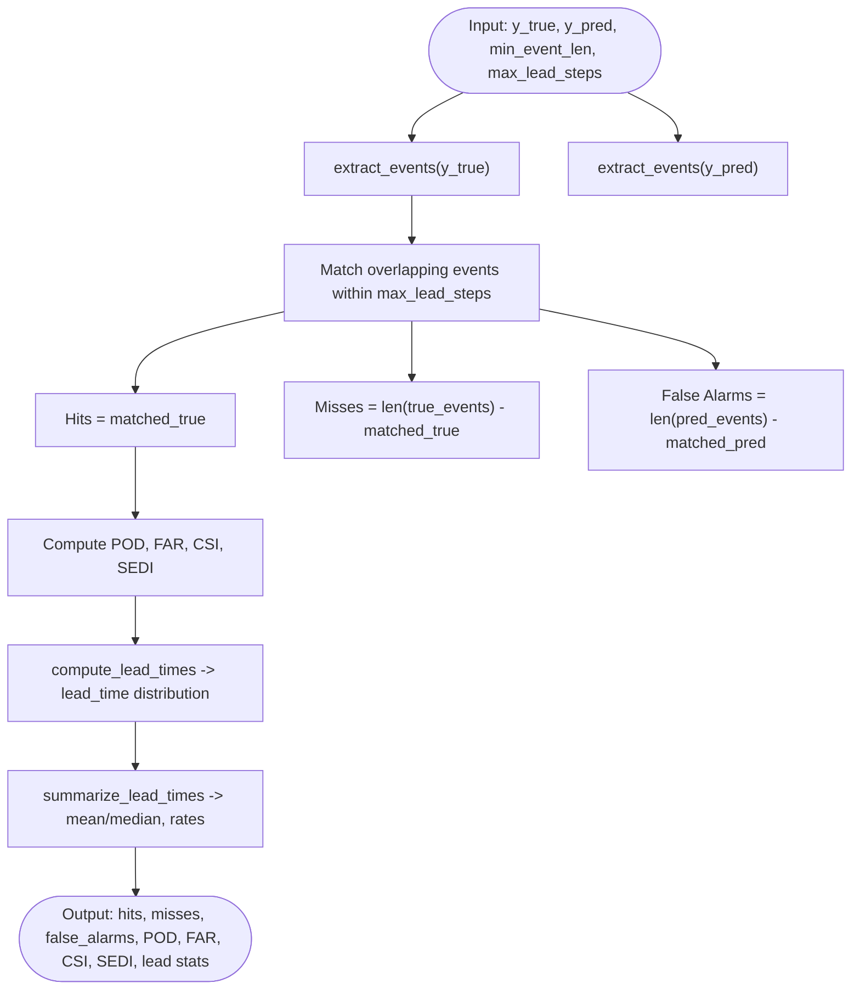
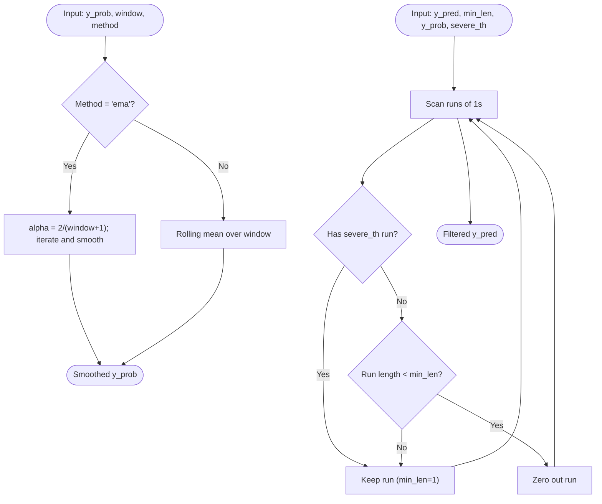
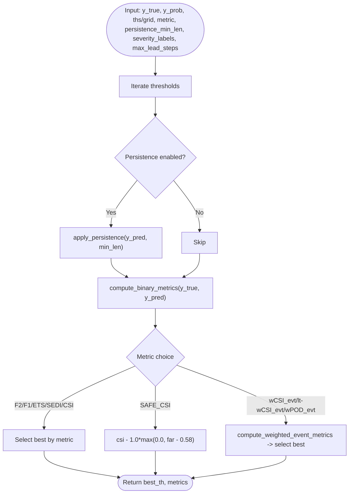
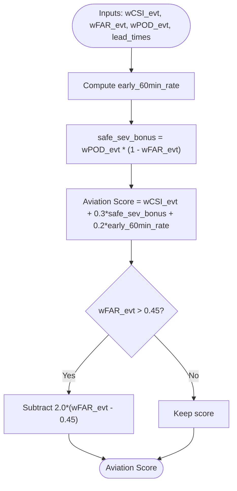
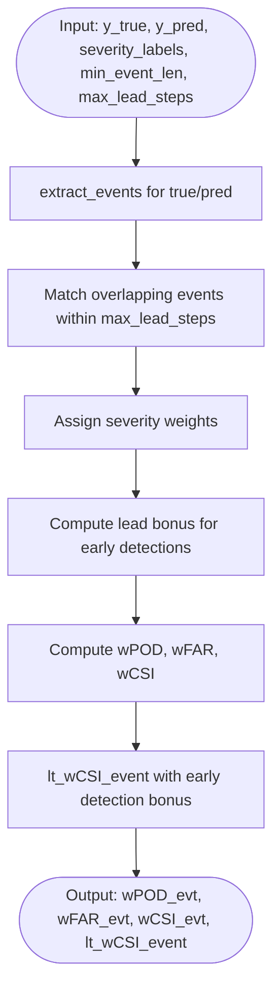
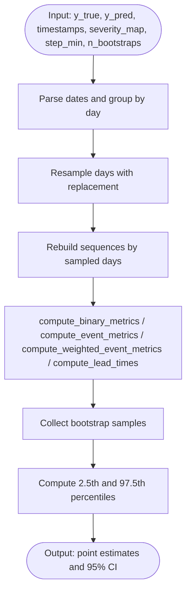
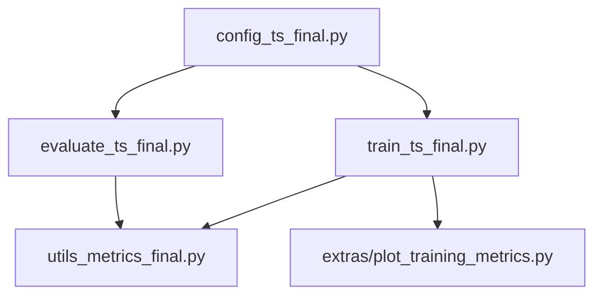

# Training Evaluation & Metrics

<cite>
**Referenced Files in This Document**
- [utils_metrics_final.py](file://utils_metrics_final.py)
- [evaluate_ts_final.py](file://evaluate_ts_final.py)
- [train_ts_final.py](file://train_ts_final.py)
- [config_ts_final.py](file://config_ts_final.py)
- [plot_training_metrics.py](file://extras/plot_training_metrics.py)
- [evaluation_report.md](file://reports/evaluation_report.md)
- [visualize_ts_events.py](file://extras/visualize_ts_events.py)
</cite>

## Table of Contents
1. [Introduction](#introduction)
2. [Project Structure](#project-structure)
3. [Core Components](#core-components)
4. [Architecture Overview](#architecture-overview)
5. [Detailed Component Analysis](#detailed-component-analysis)
6. [Dependency Analysis](#dependency-analysis)
7. [Performance Considerations](#performance-considerations)
8. [Troubleshooting Guide](#troubleshooting-guide)
9. [Conclusion](#conclusion)
10. [Appendices](#appendices)

## Introduction
This document describes the evaluation metrics system used during training and evaluation of the Nagpur TS nowcasting pipeline. It covers frame-level metrics (CSI, ETS, POD, FAR, SEDI), event-level metrics (hit/false alarm detection, lead time analysis), temporal smoothing and persistence filtering, aviation score calculation, weighted event metrics by storm severity, and model selection rules anchored by operational baselines. It also documents threshold optimization strategies (grid search, dual-threshold Schmitt trigger), and provides guidance for interpreting results, benchmarking, and visualizing training progress.

## Project Structure
The evaluation and metrics system spans several modules:
- Metrics and post-processing utilities: [utils_metrics_final.py](file://utils_metrics_final.py)
- Training loop and model selection: [train_ts_final.py](file://train_ts_final.py)
- Evaluation and visualization: [evaluate_ts_final.py](file://evaluate_ts_final.py)
- Configuration and operational thresholds: [config_ts_final.py](file://config_ts_final.py)
- Training dashboard plotting: [extras/plot_training_metrics.py](file://extras/plot_training_metrics.py)
- Additional analysis and reporting: [reports/evaluation_report.md](file://reports/evaluation_report.md), [extras/visualize_ts_events.py](file://extras/visualize_ts_events.py)

**Diagram sources**
- [utils_metrics_final.py:1-760](file://utils_metrics_final.py#L1-L760)
- [train_ts_final.py:1-757](file://train_ts_final.py#L1-L757)
- [evaluate_ts_final.py:1-908](file://evaluate_ts_final.py#L1-L908)
- [config_ts_final.py:1-208](file://config_ts_final.py#L1-L208)
- [plot_training_metrics.py:1-464](file://extras/plot_training_metrics.py#L1-L464)
- [evaluation_report.md:1-58](file://reports/evaluation_report.md#L1-L58)
- [visualize_ts_events.py:1-217](file://extras/visualize_ts_events.py#L1-L217)

**Section sources**
- [utils_metrics_final.py:1-760](file://utils_metrics_final.py#L1-L760)
- [train_ts_final.py:1-757](file://train_ts_final.py#L1-L757)
- [evaluate_ts_final.py:1-908](file://evaluate_ts_final.py#L1-L908)
- [config_ts_final.py:1-208](file://config_ts_final.py#L1-L208)
- [plot_training_metrics.py:1-464](file://extras/plot_training_metrics.py#L1-L464)
- [evaluation_report.md:1-58](file://reports/evaluation_report.md#L1-L58)
- [visualize_ts_events.py:1-217](file://extras/visualize_ts_events.py#L1-L217)

## Core Components
- Frame-level metrics: POD, FAR, CSI, ETS, SEDI, F1, F2
- Event-level metrics: hits, misses, false alarms, POD, FAR, CSI, SEDI
- Temporal smoothing: exponential moving average (EMA) and rolling mean
- Persistence filtering: minimal event length enforcement and severe-event fast-track
- Dual-threshold Schmitt trigger: hysteresis-based event activation and deactivation
- Weighted event metrics: severity-weighted POD/FAR/CSI with lead-time bonuses
- Aviation score: composite operational score incorporating weighted CSI, FAR, and early detection
- Bootstrapped confidence intervals: temporal block bootstrap by calendar day for robust uncertainty quantification

**Section sources**
- [utils_metrics_final.py:120-190](file://utils_metrics_final.py#L120-L190)
- [utils_metrics_final.py:23-47](file://utils_metrics_final.py#L23-L47)
- [utils_metrics_final.py:50-77](file://utils_metrics_final.py#L50-L77)
- [utils_metrics_final.py:243-260](file://utils_metrics_final.py#L243-L260)
- [utils_metrics_final.py:575-650](file://utils_metrics_final.py#L575-L650)
- [utils_metrics_final.py:653-760](file://utils_metrics_final.py#L653-L760)
- [train_ts_final.py:600-631](file://train_ts_final.py#L600-L631)

## Architecture Overview
The evaluation pipeline integrates training and evaluation phases:
- Training computes frame and event metrics, selects thresholds, and saves model checkpoints with performance histories.
- Evaluation loads trained models, derives thresholds on validation data, applies temporal smoothing and persistence filtering, computes frame/event/weighted metrics, and produces visualizations and bootstrap confidence intervals.

**Diagram sources**
- [train_ts_final.py:510-631](file://train_ts_final.py#L510-L631)
- [evaluate_ts_final.py:500-620](file://evaluate_ts_final.py#L500-L620)
- [utils_metrics_final.py:23-47](file://utils_metrics_final.py#L23-L47)
- [utils_metrics_final.py:192-241](file://utils_metrics_final.py#L192-L241)
- [utils_metrics_final.py:263-314](file://utils_metrics_final.py#L263-L314)
- [utils_metrics_final.py:338-393](file://utils_metrics_final.py#L338-L393)
- [utils_metrics_final.py:575-650](file://utils_metrics_final.py#L575-L650)
- [utils_metrics_final.py:395-441](file://utils_metrics_final.py#L395-L441)
- [utils_metrics_final.py:653-760](file://utils_metrics_final.py#L653-L760)

## Detailed Component Analysis

### Frame-Level Metrics: CSI, ETS, POD, FAR, SEDI
- Computation uses true positives (TP), false positives (FP), false negatives (FN), and true negatives (TN) derived from thresholded predictions.
- ETS adjusts for random chance; SEDI is base-rate independent for rare events; F1 and F2 incorporate precision and recall with different emphasis.
- Threshold selection is performed via grid search optimizing a chosen metric (e.g., F2, ETS, SEDI, CSI, or weighted variants).

**Diagram sources**
- [utils_metrics_final.py:120-153](file://utils_metrics_final.py#L120-L153)
- [utils_metrics_final.py:101-117](file://utils_metrics_final.py#L101-L117)

**Section sources**
- [utils_metrics_final.py:120-153](file://utils_metrics_final.py#L120-L153)
- [utils_metrics_final.py:101-117](file://utils_metrics_final.py#L101-L117)

### Event-Based Metrics: Hits, False Alarms, Lead Time Analysis
- Event extraction converts binary sequences into (start, end) event tuples, filtered by minimum event length.
- Overlap-based matching ensures predictions occur within a maximum lead window; hits are counted when overlap exists and prediction is not too early.
- Lead time is computed as event_start minus first prediction before or at event start; negative values indicate late detection; None indicates misses.
- Summary statistics include mean/median lead, early detection rate, late detection rate, and miss rate.

**Diagram sources**
- [utils_metrics_final.py:322-393](file://utils_metrics_final.py#L322-L393)
- [utils_metrics_final.py:395-441](file://utils_metrics_final.py#L395-L441)
- [utils_metrics_final.py:443-477](file://utils_metrics_final.py#L443-L477)

**Section sources**
- [utils_metrics_final.py:322-393](file://utils_metrics_final.py#L322-L393)
- [utils_metrics_final.py:395-441](file://utils_metrics_final.py#L395-L441)
- [utils_metrics_final.py:443-477](file://utils_metrics_final.py#L443-L477)

### Temporal Smoothing and Persistence Filtering
- Temporal smoothing: exponential moving average (EMA) or rolling mean to reduce noise and temporal chattering.
- Persistence filtering: removes short-lived positive runs (below a minimum length) to suppress isolated false alarms; severe-event fast-track allows exceptions for runs containing high-probability severe events.

**Diagram sources**
- [utils_metrics_final.py:23-47](file://utils_metrics_final.py#L23-L47)
- [utils_metrics_final.py:50-77](file://utils_metrics_final.py#L50-L77)

**Section sources**
- [utils_metrics_final.py:23-47](file://utils_metrics_final.py#L23-L47)
- [utils_metrics_final.py:50-77](file://utils_metrics_final.py#L50-L77)

### Threshold Optimization Strategies
- Grid search threshold optimization: evaluates a range of thresholds and selects the one maximizing a chosen metric (F2, F1, ETS, SEDI, CSI, SAFE_CSI, wCSI_evt, lt-wCSI_evt, wPOD_evt).
- Dual-threshold Schmitt trigger optimization: jointly optimizes high and low thresholds with hysteresis; optional rapid cooling bypass flag.
- Best threshold selection criteria: prioritize weighted event metrics (lt-wCSI_evt) under operational baseline constraints.

**Diagram sources**
- [utils_metrics_final.py:192-241](file://utils_metrics_final.py#L192-L241)
- [utils_metrics_final.py:263-314](file://utils_metrics_final.py#L263-L314)

**Section sources**
- [utils_metrics_final.py:192-241](file://utils_metrics_final.py#L192-L241)
- [utils_metrics_final.py:263-314](file://utils_metrics_final.py#L263-L314)

### Aviation Score and Model Selection Rules
- Aviation score combines weighted CSI, weighted FAR, and early detection rate with penalties for high FAR.
- Model selection: operational baseline requires weighted event POD ≥ 0.60, early detection rate ≥ 0.40, and weighted event FAR ≤ 0.45; among safe models, maximize lt-wCSI_evt; otherwise maximize lt-wCSI_evt with note of failures.

**Diagram sources**
- [train_ts_final.py:560-570](file://train_ts_final.py#L560-L570)

**Section sources**
- [train_ts_final.py:600-631](file://train_ts_final.py#L600-L631)
- [train_ts_final.py:560-570](file://train_ts_final.py#L560-L570)

### Weighted Event Metrics and Lead-Time Distribution
- Severity-weighted metrics: assign weights to different storm classes; hits receive class weights, misses incur class weights, false alarms incur unit weight.
- Lead-time bonus: early detections receive a lead-time bonus (e.g., +10% per step) to encourage timely warnings.
- Lead-time distribution: compute mean/median lead by category; summarize early/late/miss rates.

**Diagram sources**
- [utils_metrics_final.py:575-650](file://utils_metrics_final.py#L575-L650)

**Section sources**
- [utils_metrics_final.py:575-650](file://utils_metrics_final.py#L575-L650)

### Bootstrapped Confidence Intervals
- Temporal block bootstrap by calendar day to estimate 95% confidence intervals for frame, event, and weighted metrics on the test set.
- Provides robust uncertainty quantification for operational decision-making.

**Diagram sources**
- [utils_metrics_final.py:653-760](file://utils_metrics_final.py#L653-L760)

**Section sources**
- [utils_metrics_final.py:653-760](file://utils_metrics_final.py#L653-L760)

## Dependency Analysis
- Training depends on configuration for thresholds, smoothing, persistence, and metric optimization.
- Evaluation depends on training-derived thresholds and post-processing settings.
- Visualization scripts consume training logs and evaluation outputs.

**Diagram sources**
- [config_ts_final.py:1-208](file://config_ts_final.py#L1-L208)
- [train_ts_final.py:1-757](file://train_ts_final.py#L1-L757)
- [evaluate_ts_final.py:1-908](file://evaluate_ts_final.py#L1-L908)
- [utils_metrics_final.py:1-760](file://utils_metrics_final.py#L1-L760)
- [plot_training_metrics.py:1-464](file://extras/plot_training_metrics.py#L1-L464)

**Section sources**
- [config_ts_final.py:1-208](file://config_ts_final.py#L1-L208)
- [train_ts_final.py:1-757](file://train_ts_final.py#L1-L757)
- [evaluate_ts_final.py:1-908](file://evaluate_ts_final.py#L1-L908)
- [utils_metrics_final.py:1-760](file://utils_metrics_final.py#L1-L760)
- [plot_training_metrics.py:1-464](file://extras/plot_training_metrics.py#L1-L464)

## Performance Considerations
- Use EMA smoothing for temporal stability; adjust window size per dataset cadence.
- Increase persistence minimum length to suppress transient false alarms; enable severe fast-track to preserve severe-event detection.
- Prefer dual-threshold Schmitt trigger for hysteresis; tune high/low offsets to balance sensitivity and stability.
- Weighted metrics and aviation score guide model selection toward operational goals; monitor early detection rates and FAR constraints.

[No sources needed since this section provides general guidance]

## Troubleshooting Guide
- Threshold leakage: ensure validation-derived thresholds are used for evaluation to avoid data leakage.
- Calibration: apply Platt scaling when applicable; verify probability distributions and calibration checks.
- Lead-time degradation: re-enable temporal features if lead times regress; validate OOF robustness.
- Visualization: use training dashboards to track frame/event/weighted metrics and aviation score progression.

**Section sources**
- [evaluate_ts_final.py:500-575](file://evaluate_ts_final.py#L500-L575)
- [train_ts_final.py:600-631](file://train_ts_final.py#L600-L631)
- [plot_training_metrics.py:1-464](file://extras/plot_training_metrics.py#L1-L464)

## Conclusion
The evaluation system integrates robust frame and event metrics, temporal smoothing, persistence filtering, and weighted scoring to support operational nowcasting goals. Threshold optimization and aviation score-based selection ensure models meet safety baselines while maximizing lead-time-aware performance. Bootstrapped confidence intervals provide uncertainty quantification for reliable decision-making.

[No sources needed since this section summarizes without analyzing specific files]

## Appendices

### Appendix A: Example Workflows

- Threshold tuning workflow
  - Derive thresholds on validation set using grid search or dual-threshold optimization.
  - Apply temporal smoothing and persistence filtering.
  - Evaluate frame and event metrics; compute weighted metrics and lead-time statistics.
  - Save bootstrap confidence intervals for uncertainty quantification.

- Performance visualization workflow
  - Plot training dashboard from logs to monitor frame/event/weighted metrics and aviation score.
  - Generate evaluation plots for ROC/PR curves, severity performance, attention maps, and lead-time distributions.

- Safety baseline and model selection
  - Enforce operational baseline: weighted event POD ≥ 0.60, early detection rate ≥ 0.40, weighted event FAR ≤ 0.45.
  - Among safe models, select by highest lt-wCSI_evt; otherwise select by highest lt-wCSI_evt with explicit reasons.

**Section sources**
- [evaluate_ts_final.py:500-620](file://evaluate_ts_final.py#L500-L620)
- [train_ts_final.py:600-655](file://train_ts_final.py#L600-L655)
- [plot_training_metrics.py:278-436](file://extras/plot_training_metrics.py#L278-L436)
- [evaluation_report.md:1-58](file://reports/evaluation_report.md#L1-L58)