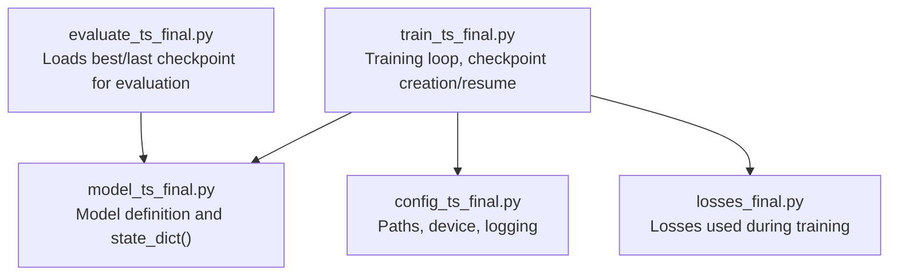
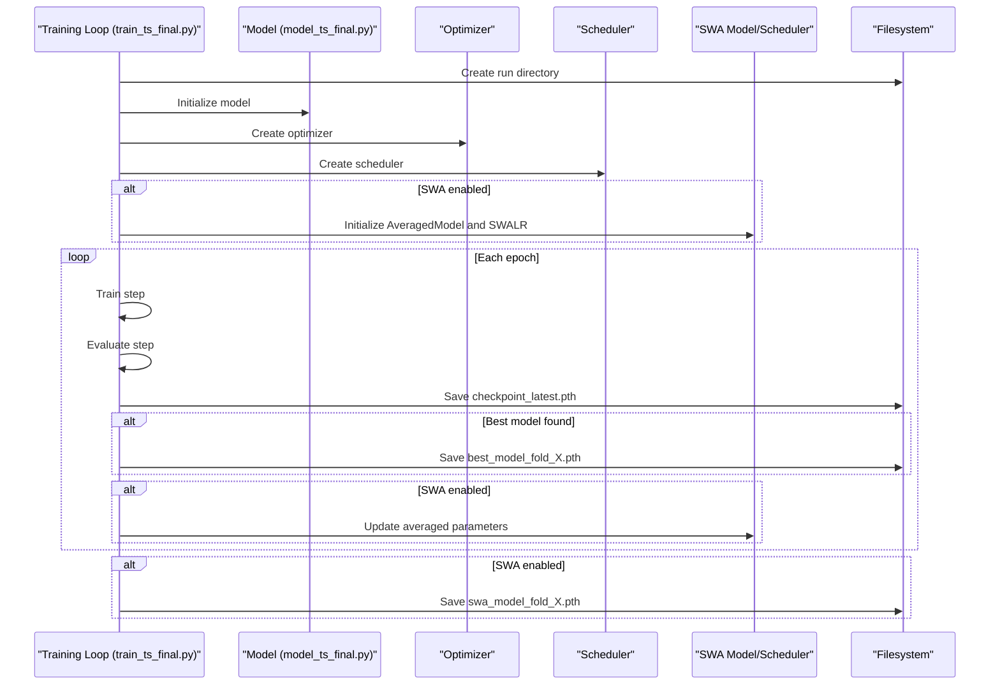
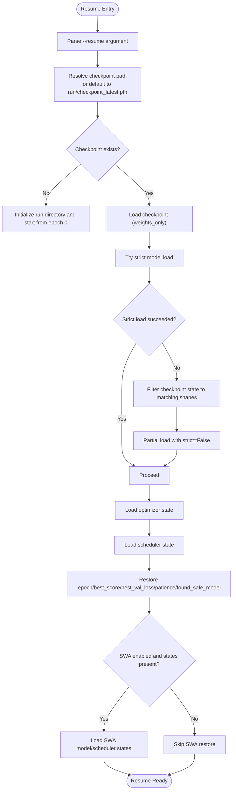
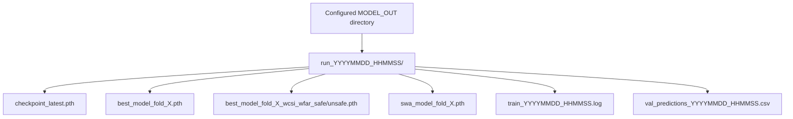
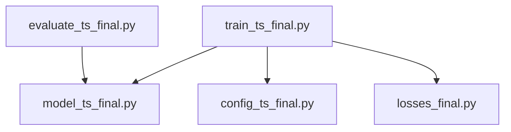

# Checkpointing & State Management

<cite>
**Referenced Files in This Document**
- [train_ts_final.py](file://train_ts_final.py)
- [model_ts_final.py](file://model_ts_final.py)
- [config_ts_final.py](file://config_ts_final.py)
- [evaluate_ts_final.py](file://evaluate_ts_final.py)
- [losses_final.py](file://losses_final.py)
</cite>

## Table of Contents
1. [Introduction](#introduction)
2. [Project Structure](#project-structure)
3. [Core Components](#core-components)
4. [Architecture Overview](#architecture-overview)
5. [Detailed Component Analysis](#detailed-component-analysis)
6. [Dependency Analysis](#dependency-analysis)
7. [Performance Considerations](#performance-considerations)
8. [Troubleshooting Guide](#troubleshooting-guide)
9. [Conclusion](#conclusion)

## Introduction
This document explains the checkpointing and state management system implemented in the training script for the Nagpur TS Nowcasting pipeline. It covers the checkpoint structure, resume functionality, state restoration, architecture change handling, naming conventions, file organization, backup strategies, inspection and verification techniques, and performance/memory considerations for large model checkpoints.

## Project Structure
The checkpointing system is primarily implemented in the training script and interacts with the model definition and configuration. The evaluation script demonstrates how checkpoints are loaded for inference.

**Diagram sources**
- [train_ts_final.py](file://train_ts_final.py)
- [model_ts_final.py](file://model_ts_final.py)
- [config_ts_final.py](file://config_ts_final.py)
- [evaluate_ts_final.py](file://evaluate_ts_final.py)
- [losses_final.py](file://losses_final.py)

**Section sources**
- [train_ts_final.py](file://train_ts_final.py)
- [model_ts_final.py](file://model_ts_final.py)
- [config_ts_final.py](file://config_ts_final.py)
- [evaluate_ts_final.py](file://evaluate_ts_final.py)

## Core Components
- Checkpoint structure: The training script saves a dictionary containing model, optimizer, scheduler, and training metadata. It also conditionally includes SWA model and scheduler states when enabled.
- Resume functionality: Automatic detection of checkpoint files, state restoration, and seamless continuation of training.
- State dictionary filtering: Handles model architecture changes (e.g., dynamic channel counts) by partial weight loading.
- Naming and organization: Run-scoped directories with a “checkpoint_latest.pth” file; best model snapshots and SWA models saved separately.
- Backup strategies: Best model snapshots are saved multiple times with different naming to reflect safety and performance criteria.

**Section sources**
- [train_ts_final.py](file://train_ts_final.py)
- [model_ts_final.py](file://model_ts_final.py)
- [config_ts_final.py](file://config_ts_final.py)

## Architecture Overview
The checkpointing architecture integrates training, model, optimizer, scheduler, and SWA components. The training loop periodically writes a “checkpoint_latest.pth” file and also saves best models and SWA models under run-scoped directories.

**Diagram sources**
- [train_ts_final.py](file://train_ts_final.py)
- [model_ts_final.py](file://model_ts_final.py)

## Detailed Component Analysis

### Checkpoint Structure
The checkpoint dictionary saved at the end of each epoch includes:
- epoch: integer epoch index
- model_state_dict: model’s state dictionary
- optimizer_state_dict: optimizer’s state dictionary
- scheduler_state_dict: scheduler’s state dictionary
- best_score: best weighted CSI-like score observed
- best_val_loss: best validation loss observed
- patience: early stopping counter
- found_safe_model: whether a safe model baseline was achieved
- swa_model_state: optional, present when SWA is enabled
- swa_scheduler_state: optional, present when SWA is enabled

These keys are consistently used for resume and verification.

**Section sources**
- [train_ts_final.py](file://train_ts_final.py)

### Resume Functionality
Automatic detection and restoration:
- Command-line argument parsing supports resuming from either a specific checkpoint file or a run directory. If a directory is provided, the script resolves to “checkpoint_latest.pth” inside that directory.
- The script loads the checkpoint using weights-only loading to minimize GPU/CPU transfer overhead.
- Model state restoration:
  - First attempts strict load of the model state dictionary.
  - On failure (common with architecture changes), filters the checkpoint state to tensors whose shapes match the current model and loads them partially.
- Optimizer and scheduler state restoration:
  - Loads optimizer and scheduler states if present.
- Training metadata restoration:
  - Restores epoch, best score, best validation loss, patience, and safe model flag.
- SWA state restoration:
  - Attempts to restore SWA model and scheduler states; on failure, resets SWA components.

**Diagram sources**
- [train_ts_final.py](file://train_ts_final.py)

**Section sources**
- [train_ts_final.py](file://train_ts_final.py)

### State Dictionary Filtering Mechanism
Dynamic channel adaptation:
- The model adapts its first convolutional layer to the number of input channels defined by configuration.
- During resume, if the checkpoint’s model state does not strictly match the current model, the system filters the checkpoint state to include only tensors whose keys exist in the current model and whose shapes match.
- This enables seamless continuation when the number of input channels changed (e.g., switching from 7 to fewer channels).

Verification steps:
- Compare sizes of loaded tensors against current model state to confirm partial load coverage.

**Section sources**
- [train_ts_final.py](file://train_ts_final.py)
- [model_ts_final.py](file://model_ts_final.py)

### Checkpoint Naming Conventions and File Organization
- Run-scoped directories:
  - Each training run creates a timestamped directory under the configured output directory.
  - Example: run_YYYYMMDD_HHMMSS/
- Latest checkpoint:
  - checkpoint_latest.pth resides in the run directory and is overwritten each epoch.
- Best model snapshots:
  - best_model_fold_X.pth is saved when a new best model is found.
  - A dynamically named variant appends performance metrics and safety tag for easy identification.
- SWA model:
  - swa_model_fold_X.pth is saved at the end of training if SWA is enabled.
- Logging and artifacts:
  - Logs and validation predictions are archived into the run directory upon completion.

**Diagram sources**
- [train_ts_final.py](file://train_ts_final.py)
- [config_ts_final.py](file://config_ts_final.py)

**Section sources**
- [train_ts_final.py](file://train_ts_final.py)
- [config_ts_final.py](file://config_ts_final.py)

### Backup Strategies
- Best model snapshots:
  - Saved multiple times with different naming to reflect safety and performance characteristics.
- SWA backups:
  - Separate snapshot for stochastic weight averaging to support ensemble-like inference.
- Run archival:
  - Logs and predictions are copied into the run directory for reproducibility.

**Section sources**
- [train_ts_final.py](file://train_ts_final.py)

### Checkpoint Inspection and Verification
- Inspect checkpoint contents:
  - Use Python to load the checkpoint file and print available keys.
  - Confirm presence of model_state_dict, optimizer_state_dict, scheduler_state_dict, and training metadata.
- Verify model compatibility:
  - Compare shapes of checkpoint tensors with current model state_dict to ensure partial load coverage.
- Validate training metadata:
  - Check epoch, best_score, best_val_loss, patience, and found_safe_model to confirm continuity.
- Evaluate SWA states:
  - Confirm swa_model_state and swa_scheduler_state are present and loadable when SWA is enabled.

**Section sources**
- [train_ts_final.py](file://train_ts_final.py)

### Resume Workflow Example
- Resume from a run directory:
  - Provide the run directory path; the script resolves to the latest checkpoint automatically.
- Resume from a specific checkpoint:
  - Provide the full path to a checkpoint file.
- Continue training:
  - The script restores model, optimizer, scheduler, and metadata, then resumes from the next epoch.

**Section sources**
- [train_ts_final.py](file://train_ts_final.py)

### Evaluation with Checkpoints
- The evaluation script loads the best model or SWA model for inference and metrics computation.
- Demonstrates how to load saved model weights for external use.

**Section sources**
- [evaluate_ts_final.py](file://evaluate_ts_final.py)

## Dependency Analysis
The checkpointing system depends on:
- Model state dictionaries for serialization/deserialization
- Optimizer and scheduler state dictionaries for training continuity
- SWA components when enabled
- Configuration paths for run directory creation and artifact placement

**Diagram sources**
- [train_ts_final.py](file://train_ts_final.py)
- [model_ts_final.py](file://model_ts_final.py)
- [config_ts_final.py](file://config_ts_final.py)
- [evaluate_ts_final.py](file://evaluate_ts_final.py)
- [losses_final.py](file://losses_final.py)

**Section sources**
- [train_ts_final.py](file://train_ts_final.py)
- [model_ts_final.py](file://model_ts_final.py)
- [config_ts_final.py](file://config_ts_final.py)
- [evaluate_ts_final.py](file://evaluate_ts_final.py)
- [losses_final.py](file://losses_final.py)

## Performance Considerations
- Memory management during checkpoint operations:
  - weights_only loading minimizes memory footprint when loading checkpoints.
  - Partial state loading avoids unnecessary tensor allocations by filtering incompatible shapes.
- Large model checkpoints:
  - Prefer saving only necessary states (model, optimizer, scheduler) and metadata.
  - Consider saving SWA states separately to reduce peak memory usage during training.
- I/O throughput:
  - Writing “checkpoint_latest.pth” frequently ensures resilience against interruptions but increases disk I/O; tune epoch frequency if needed.
- Device mapping:
  - Loading checkpoints onto the configured device avoids unnecessary transfers.

[No sources needed since this section provides general guidance]

## Troubleshooting Guide
Common issues and resolutions:
- Strict load fails due to architecture changes:
  - The system automatically falls back to partial loading by filtering tensors with matching shapes.
- Missing optimizer/scheduler states:
  - Resume still works; training continues with default optimizer/scheduler states.
- SWA state mismatch:
  - On failure to load SWA states, the system resets SWA components and continues training.
- Incorrect resume path:
  - Ensure the provided path points to a valid checkpoint file or a run directory containing “checkpoint_latest.pth”.

Verification tips:
- Confirm checkpoint keys and shapes before resuming.
- Validate that epoch and best metrics are restored as expected.

**Section sources**
- [train_ts_final.py](file://train_ts_final.py)

## Conclusion
The checkpointing system in the training script provides robust, resilient training with automatic resume, architecture-change handling, and clear file organization. By leveraging weights-only loading, partial state restoration, and structured naming conventions, it supports reliable long-running training sessions and reproducible evaluations.