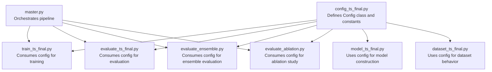
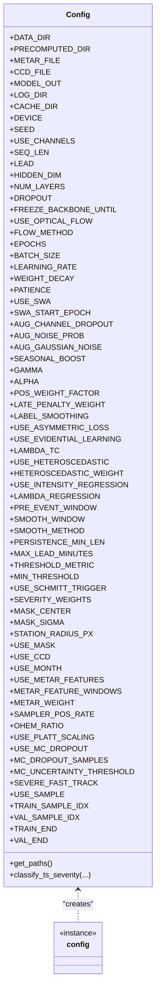
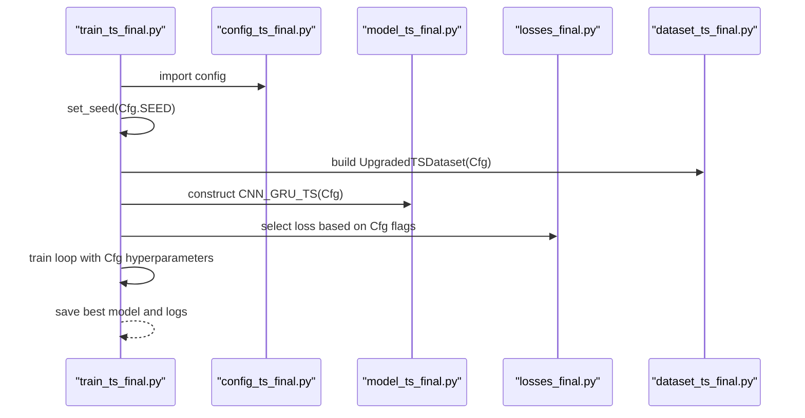
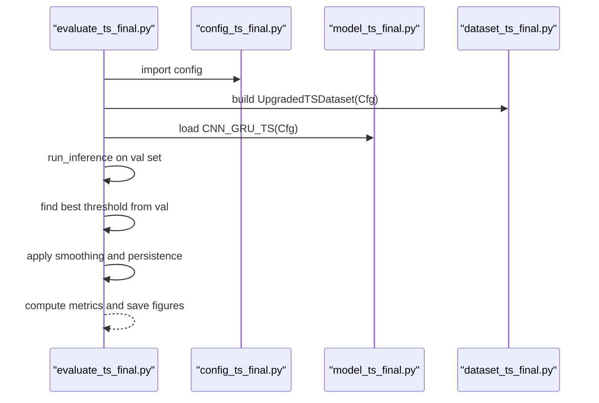
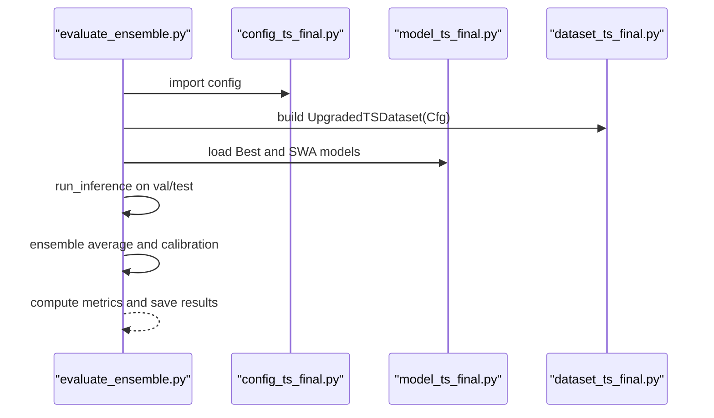
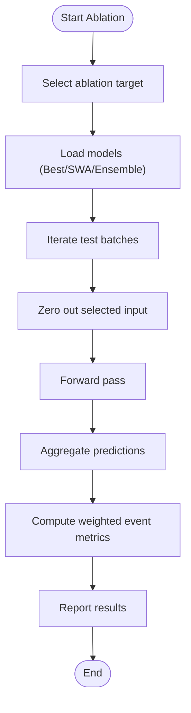
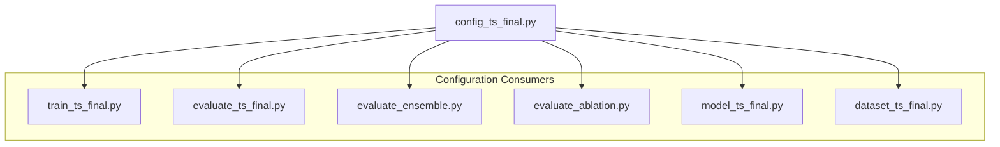

# Configuration Management

<cite>
**Referenced Files in This Document**
- [config_ts_final.py](file://config_ts_final.py)
- [train_ts_final.py](file://train_ts_final.py)
- [evaluate_ts_final.py](file://evaluate_ts_final.py)
- [evaluate_ensemble.py](file://evaluate_ensemble.py)
- [evaluate_ablation.py](file://evaluate_ablation.py)
- [model_ts_final.py](file://model_ts_final.py)
- [dataset_ts_final.py](file://dataset_ts_final.py)
- [master.py](file://master.py)
</cite>

## Table of Contents
1. [Introduction](#introduction)
2. [Project Structure](#project-structure)
3. [Core Components](#core-components)
4. [Architecture Overview](#architecture-overview)
5. [Detailed Component Analysis](#detailed-component-analysis)
6. [Dependency Analysis](#dependency-analysis)
7. [Performance Considerations](#performance-considerations)
8. [Troubleshooting Guide](#troubleshooting-guide)
9. [Conclusion](#conclusion)
10. [Appendices](#appendices)

## Introduction
This document describes the centralized configuration management system used across the Nagpur Thunderstorm Nowcasting pipeline. It explains how configuration is defined, inherited, validated, and consumed by training, evaluation, and inference components. It covers parameter validation, runtime environment setup, training-specific parameters, and best practices for reproducible experiments.

## Project Structure
The configuration system is implemented as a single Python module that defines a class-based configuration object. All scripts import and consume this configuration object to ensure consistent behavior across training, evaluation, and ablation studies.

**Diagram sources**
- [config_ts_final.py:16-208](file://config_ts_final.py#L16-L208)
- [train_ts_final.py:41](file://train_ts_final.py#L41)
- [evaluate_ts_final.py:34](file://evaluate_ts_final.py#L34)
- [evaluate_ensemble.py:34](file://evaluate_ensemble.py#L34)
- [evaluate_ablation.py:30](file://evaluate_ablation.py#L30)
- [model_ts_final.py:75](file://model_ts_final.py#L75)
- [dataset_ts_final.py:47](file://dataset_ts_final.py#L47)
- [master.py:39](file://master.py#L39)

**Section sources**
- [config_ts_final.py:16-208](file://config_ts_final.py#L16-L208)
- [train_ts_final.py:41](file://train_ts_final.py#L41)
- [evaluate_ts_final.py:34](file://evaluate_ts_final.py#L34)
- [evaluate_ensemble.py:34](file://evaluate_ensemble.py#L34)
- [evaluate_ablation.py:30](file://evaluate_ablation.py#L30)
- [model_ts_final.py:75](file://model_ts_final.py#L75)
- [dataset_ts_final.py:47](file://dataset_ts_final.py#L47)
- [master.py:39](file://master.py#L39)

## Core Components
- Centralized configuration object: A singleton-like instance of a Config class that holds all runtime parameters.
- Parameter categories:
  - Data paths and I/O
  - Model architecture
  - Training hyperparameters
  - Loss function configuration
  - Data augmentation and sampling
  - Post-processing and thresholding
  - Spatial masks and auxiliary features
  - Evaluation and calibration settings
- Runtime environment setup: Automatic device selection (CUDA if available), seed initialization, and logging directory creation.

Key characteristics:
- Single source of truth for all parameters across the pipeline.
- Extensive use of getattr(...) with defaults to support optional or phase-dependent features.
- Explicit validation via path existence checks and runtime device availability detection.

**Section sources**
- [config_ts_final.py:16-208](file://config_ts_final.py#L16-L208)

## Architecture Overview
The configuration architecture follows a centralized pattern where a single Config instance is imported and used by all modules. This ensures:
- Consistent behavior across training, evaluation, and ablation.
- Easy parameter tuning without scattered hard-coded values.
- Clear separation between configuration and logic.

**Diagram sources**
- [config_ts_final.py:16-208](file://config_ts_final.py#L16-L208)

## Detailed Component Analysis

### Centralized Configuration Definition
- Purpose: Provide a single, authoritative source of parameters for the entire pipeline.
- Implementation: A class with attributes for all configurable aspects, plus a singleton instance.
- Environment detection: Automatically selects CUDA if available; otherwise falls back to CPU.
- Path validation: Exposes a method to collect all path-related configuration for validation.

Operational implications:
- All scripts import the same config instance, ensuring uniform behavior.
- Changes to defaults propagate automatically to training, evaluation, and ablation.

**Section sources**
- [config_ts_final.py:16-208](file://config_ts_final.py#L16-L208)

### Parameter Validation and Type Checking
- Path validation: The configuration exposes a method to gather all path-related settings for external validation.
- Runtime checks: Scripts validate dataset availability and model checkpoint presence before proceeding.
- Attribute existence: Heavy reliance on getattr(...) with defaults to avoid KeyError exceptions when optional features are disabled.

Examples of validation patterns:
- Dataset existence: Training script checks for the presence of HDF5 files before building datasets.
- Checkpoint loading: Evaluation scripts verify checkpoint file existence and handle partial state loading gracefully.

**Section sources**
- [config_ts_final.py:194-205](file://config_ts_final.py#L194-L205)
- [train_ts_final.py:206-209](file://train_ts_final.py#L206-L209)
- [evaluate_ts_final.py:431-446](file://evaluate_ts_final.py#L431-L446)

### Runtime Environment Setup
- Device selection: Determined at import time based on CUDA availability.
- Random seeds: Training scripts initialize seeds for reproducibility.
- Logging: Training creates a dedicated run directory and redirects stdout to a log file.

**Section sources**
- [config_ts_final.py:189](file://config_ts_final.py#L189)
- [train_ts_final.py:67-74](file://train_ts_final.py#L67-L74)
- [train_ts_final.py:167-170](file://train_ts_final.py#L167-L170)

### Configuration Inheritance and Default Value Management
- Inheritance model: There is no explicit inheritance between configuration classes; all parameters are defined in a single Config class.
- Default value management: Many parameters are accessed via getattr(...) with sensible defaults, enabling optional features to be toggled without breaking the pipeline.
- Phase-based toggles: Flags like USE_EVIDENTIAL_LEARNING, USE_ASYMMETRIC_LOSS, USE_HETEROSCEDASTIC, and others gate different loss functions and model heads.

Practical outcomes:
- Optional features can be enabled/disabled without editing core logic.
- Phase-specific parameters (e.g., seasonal boosting, augmentation) are encapsulated under feature flags.

**Section sources**
- [train_ts_final.py:289-314](file://train_ts_final.py#L289-L314)
- [model_ts_final.py:183-198](file://model_ts_final.py#L183-L198)
- [dataset_ts_final.py:502-511](file://dataset_ts_final.py#L502-L511)

### Override Mechanisms
- Import-time overrides: Since the configuration is a module-level instance, overriding values is straightforward by modifying the module before importing training/evaluation scripts.
- Command-line overrides: While not implemented in the current code, the architecture supports adding argparse parsers to override config values at runtime.

Current usage:
- All scripts import the same config instance and read parameters directly from it.

**Section sources**
- [train_ts_final.py:148](file://train_ts_final.py#L148)
- [evaluate_ts_final.py:362](file://evaluate_ts_final.py#L362)
- [evaluate_ensemble.py:86](file://evaluate_ensemble.py#L86)
- [evaluate_ablation.py:175](file://evaluate_ablation.py#L175)

### Training-Specific Configuration Parameters
- Model architecture: Hidden dimension, number of GRU layers, dropout, sequence length, lead time, and backbone freezing.
- Training hyperparameters: Epochs, batch size, learning rate, weight decay, patience, and SWA settings.
- Loss function: Focal loss parameters, late penalty, label smoothing, asymmetric loss, evidential learning, heteroscedastic loss, and intensity regression.
- Data augmentation: Channel dropout, noise probability, and Gaussian noise level.
- Sampling and labeling: Target positive rate, pre-event labeling window, and seasonal boosting weights.
- Post-processing: Smoothing window and method, persistence minimum length, maximum lead time, threshold metric, and minimum threshold.

These parameters are consumed across training, evaluation, and ablation scripts to ensure consistent behavior.

**Section sources**
- [config_ts_final.py:23-124](file://config_ts_final.py#L23-L124)
- [train_ts_final.py:178-196](file://train_ts_final.py#L178-L196)
- [train_ts_final.py:244-277](file://train_ts_final.py#L244-L277)
- [train_ts_final.py:288-314](file://train_ts_final.py#L288-L314)

### Data Processing Options
- Channel selection: Dynamic channel stacking based on USE_CHANNELS.
- Optical flow: Optional inclusion with configurable method.
- METAR features: Optional inclusion with feature windows and scaling.
- Time features: Optional monthly features with solar zenith computation.
- Spatial mask: Gaussian mask with center and spread parameters.
- CCD features: Optional inclusion with z-score normalization.

**Section sources**
- [config_ts_final.py:106-124](file://config_ts_final.py#L106-L124)
- [dataset_ts_final.py:378-396](file://dataset_ts_final.py#L378-L396)
- [dataset_ts_final.py:403-434](file://dataset_ts_final.py#L403-L434)
- [model_ts_final.py:125-149](file://model_ts_final.py#L125-L149)

### Evaluation Criteria and Post-Processing
- Threshold selection: Dual-threshold (Schmitt trigger) or single-threshold approaches, with configurable minimum threshold and metric optimization.
- Persistence filtering: Minimum consecutive frames to qualify as an event.
- Metrics: Frame-level and event-level metrics, weighted event metrics, lead time statistics, and severity breakdown.
- Calibration: Optional Platt scaling for probability recalibration.

**Section sources**
- [config_ts_final.py:92-94](file://config_ts_final.py#L92-L94)
- [config_ts_final.py:133-136](file://config_ts_final.py#L133-L136)
- [evaluate_ts_final.py:526-548](file://evaluate_ts_final.py#L526-L548)
- [evaluate_ts_final.py:595-601](file://evaluate_ts_final.py#L595-L601)

### Configuration Consumption Patterns
- Training: Reads parameters for model construction, loss selection, optimizer, scheduler, and data loaders.
- Evaluation: Uses parameters for threshold selection, smoothing, persistence, and metric computation.
- Ensemble: Applies weighted averaging of predictions from best and SWA models.
- Ablation: Zeros out specific inputs to measure feature contributions.

**Section sources**
- [train_ts_final.py:286-314](file://train_ts_final.py#L286-L314)
- [evaluate_ts_final.py:508-509](file://evaluate_ts_final.py#L508-L509)
- [evaluate_ensemble.py:178-183](file://evaluate_ensemble.py#L178-L183)
- [evaluate_ablation.py:65-88](file://evaluate_ablation.py#L65-L88)

### Example Workflows

#### Training with Default Configuration
- Import the config instance.
- Initialize seeds and device.
- Build datasets and data loaders using config parameters.
- Construct model, loss, optimizer, and scheduler.
- Train with early stopping and optional SWA.

**Diagram sources**
- [train_ts_final.py:148-314](file://train_ts_final.py#L148-L314)
- [model_ts_final.py:75-201](file://model_ts_final.py#L75-L201)
- [dataset_ts_final.py:47-92](file://dataset_ts_final.py#L47-L92)

#### Evaluation with Validation-Derived Threshold
- Load model and dataset using config.
- Run validation set inference to derive threshold.
- Apply smoothing, persistence, and threshold to produce predictions.
- Compute metrics and generate plots.

**Diagram sources**
- [evaluate_ts_final.py:361-501](file://evaluate_ts_final.py#L361-L501)
- [model_ts_final.py:75-201](file://model_ts_final.py#L75-L201)
- [dataset_ts_final.py:398-426](file://dataset_ts_final.py#L398-L426)

#### Ensemble Evaluation
- Load best and SWA models.
- Average predictions with configurable weights.
- Calibrate if applicable and compute metrics.

**Diagram sources**
- [evaluate_ensemble.py:84-250](file://evaluate_ensemble.py#L84-L250)
- [model_ts_final.py:75-201](file://model_ts_final.py#L75-L201)

#### Ablation Study
- Zero out specific inputs (channels, CCD, optical flow, METAR, time).
- Measure impact on weighted event metrics.

**Diagram sources**
- [evaluate_ablation.py:38-117](file://evaluate_ablation.py#L38-L117)

## Dependency Analysis
The configuration system exhibits low coupling and high cohesion:
- Coupling: All scripts depend on the same config instance, but there are no circular imports.
- Cohesion: All parameters are centralized, reducing duplication and inconsistencies.
- External dependencies: Configuration does not rely on external libraries beyond standard Python and torch availability.

**Diagram sources**
- [config_ts_final.py:16-208](file://config_ts_final.py#L16-L208)
- [train_ts_final.py:41](file://train_ts_final.py#L41)
- [evaluate_ts_final.py:34](file://evaluate_ts_final.py#L34)
- [evaluate_ensemble.py:34](file://evaluate_ensemble.py#L34)
- [evaluate_ablation.py:30](file://evaluate_ablation.py#L30)
- [model_ts_final.py:75](file://model_ts_final.py#L75)
- [dataset_ts_final.py:47](file://dataset_ts_final.py#L47)

**Section sources**
- [config_ts_final.py:16-208](file://config_ts_final.py#L16-L208)

## Performance Considerations
- Device selection: Automatic CUDA detection reduces overhead and avoids runtime errors.
- Reproducibility: Seed initialization ensures consistent results across runs.
- Memory efficiency: Dataset caching and selective feature inclusion minimize I/O and memory usage.
- Early stopping: Controlled patience prevents unnecessary training time.

[No sources needed since this section provides general guidance]

## Troubleshooting Guide
Common issues and resolutions:
- Missing dataset files: Verify DATA_DIR and PRECOMPUTED_DIR contain HDF5 files; training script checks for samples before proceeding.
- CUDA availability: If CUDA is unavailable, the system falls back to CPU; confirm device selection in logs.
- Checkpoint loading failures: Evaluation scripts attempt partial state loading when strict loading fails.
- Path validation: Use the configuration’s path collection method to validate all configured paths.

**Section sources**
- [train_ts_final.py:206-209](file://train_ts_final.py#L206-L209)
- [config_ts_final.py:194-205](file://config_ts_final.py#L194-L205)
- [evaluate_ts_final.py:431-446](file://evaluate_ts_final.py#L431-L446)

## Conclusion
The configuration management system provides a robust, centralized approach to parameter control across the Nagpur TS Nowcasting pipeline. Its design ensures consistency, reproducibility, and flexibility, while enabling easy experimentation through feature flags and optional components. By leveraging getattr(...) with defaults and explicit validation, the system remains resilient to missing or optional features.

## Appendices

### Configuration Modification Examples
- Change model architecture: Adjust HIDDEN_DIM, NUM_LAYERS, DROPOUT, SEQ_LEN, LEAD.
- Modify training hyperparameters: Adjust EPOCHS, BATCH_SIZE, LEARNING_RATE, WEIGHT_DECAY, PATIENCE.
- Toggle optional features: Set USE_EVIDENTIAL_LEARNING, USE_ASYMMETRIC_LOSS, USE_HETEROSCEDASTIC, USE_INTENSITY_REGRESSION.
- Adjust post-processing: Change SMOOTH_WINDOW, SMOOTH_METHOD, PERSISTENCE_MIN_LEN, THRESHOLD_METRIC, MIN_THRESHOLD.
- Control data augmentation: Modify AUG_CHANNEL_DROPOUT, AUG_NOISE_PROB, AUG_GAUSSIAN_NOISE.
- Environment-specific settings: Switch USE_METAR_FEATURES, USE_MONTH, USE_MASK, USE_CCD.

[No sources needed since this section provides general guidance]

### Best Practices for Maintaining Reproducible Experiments
- Pin configuration values in a dedicated file per experiment.
- Use the provided path validation method to ensure correctness.
- Document environment-specific changes (device, batch size, augmentation).
- Version control configuration alongside code and data.
- Use the seed setting for reproducibility and compare results across runs.

[No sources needed since this section provides general guidance]