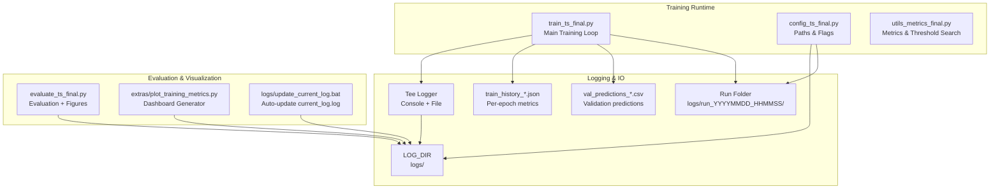
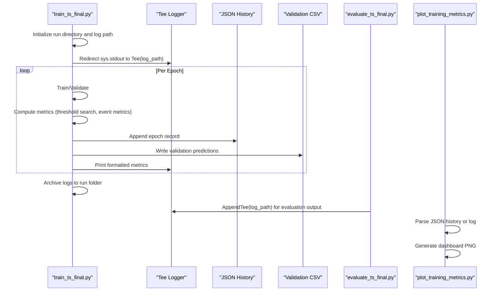
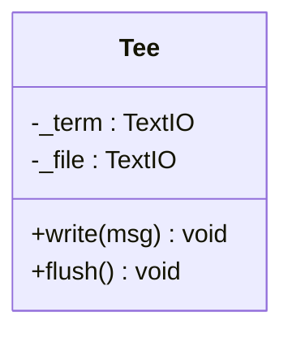
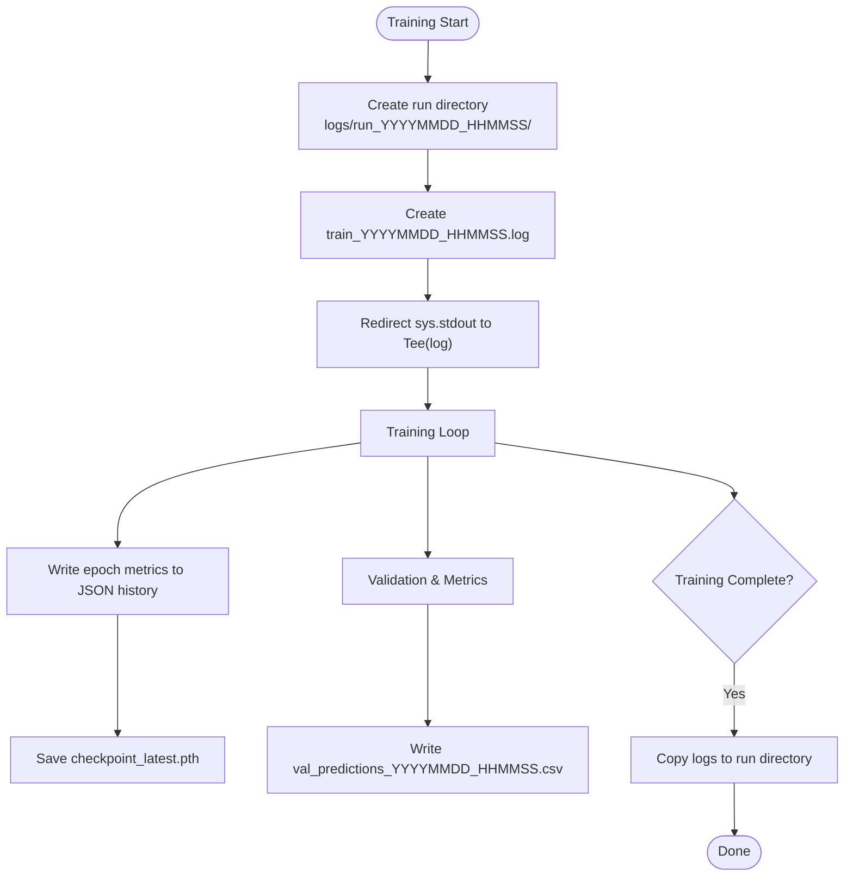
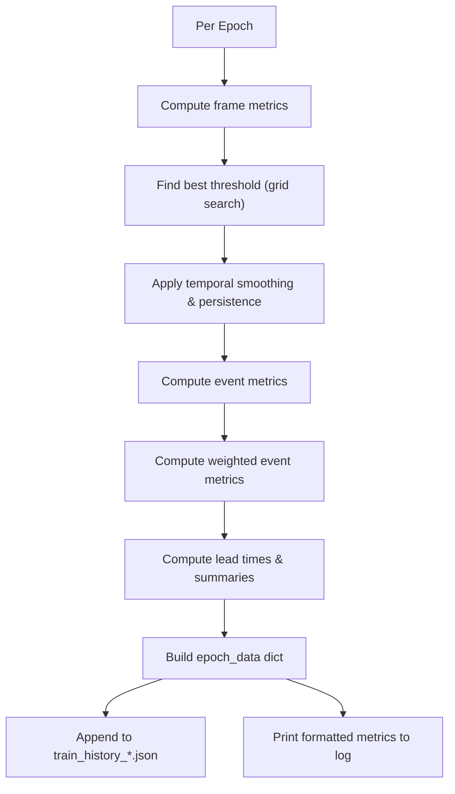
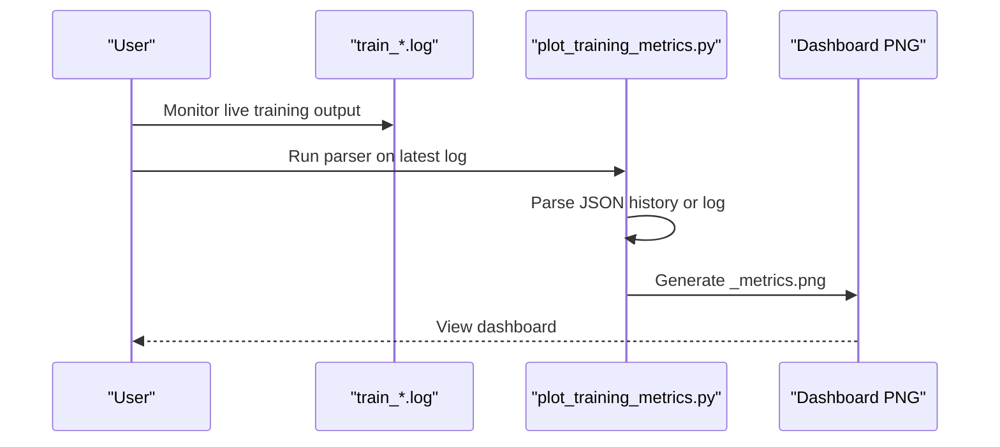
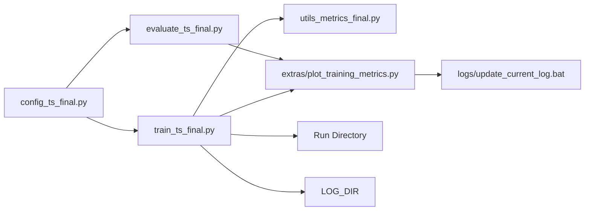

# Logging & Monitoring System

<cite>
**Referenced Files in This Document**
- [train_ts_final.py](file://train_ts_final.py)
- [evaluate_ts_final.py](file://evaluate_ts_final.py)
- [config_ts_final.py](file://config_ts_final.py)
- [utils_metrics_final.py](file://utils_metrics_final.py)
- [plot_training_metrics.py](file://extras/plot_training_metrics.py)
- [update_current_log.bat](file://logs/update_current_log.bat)
- [master.py](file://master.py)
</cite>

## Table of Contents
1. [Introduction](#introduction)
2. [Project Structure](#project-structure)
3. [Core Components](#core-components)
4. [Architecture Overview](#architecture-overview)
5. [Detailed Component Analysis](#detailed-component-analysis)
6. [Dependency Analysis](#dependency-analysis)
7. [Performance Considerations](#performance-considerations)
8. [Troubleshooting Guide](#troubleshooting-guide)
9. [Conclusion](#conclusion)

## Introduction
This document describes the logging and monitoring infrastructure for the Nagpur Thunderstorm Nowcasting pipeline. It covers dual console/file output via a Tee-based logger, comprehensive training metrics logging (losses, performance metrics, threshold optimization, model selection), run directory organization, artifact archiving, real-time monitoring and visualization, and practical guidance for interpreting logs and troubleshooting.

## Project Structure
The logging system spans three main areas:
- Training logs: written during training and evaluation, captured to both console and file
- Metrics history: JSON snapshots of epoch-level metrics for visualization
- Artifacts: archived run folders containing logs, predictions, and evaluation figures

**Diagram sources**
- [train_ts_final.py:168-170](file://train_ts_final.py#L168-L170)
- [config_ts_final.py:191](file://config_ts_final.py#L191)
- [utils_metrics_final.py:192-241](file://utils_metrics_final.py#L192-L241)
- [plot_training_metrics.py:25-41](file://extras/plot_training_metrics.py#L25-L41)
- [update_current_log.bat:13-24](file://logs/update_current_log.bat#L13-L24)

**Section sources**
- [train_ts_final.py:168-170](file://train_ts_final.py#L168-L170)
- [config_ts_final.py:191](file://config_ts_final.py#L191)

## Core Components
- Tee logger for dual console/file output during training
- AppendTee for evaluation runs appending to the training log
- JSON history writer for epoch-level metrics
- CSV writer for validation predictions
- Run directory archiving at training completion
- Real-time visualization via log parsing and plotting

**Section sources**
- [train_ts_final.py:48-66](file://train_ts_final.py#L48-L66)
- [train_ts_final.py:380-381](file://train_ts_final.py#L380-L381)
- [train_ts_final.py:597-598](file://train_ts_final.py#L597-L598)
- [train_ts_final.py:681-692](file://train_ts_final.py#L681-L692)
- [train_ts_final.py:745-754](file://train_ts_final.py#L745-L754)
- [evaluate_ts_final.py:347-359](file://evaluate_ts_final.py#L347-L359)

## Architecture Overview
The logging architecture integrates runtime logging, persistent history, and visualization:

**Diagram sources**
- [train_ts_final.py:168-170](file://train_ts_final.py#L168-L170)
- [train_ts_final.py:380-381](file://train_ts_final.py#L380-L381)
- [train_ts_final.py:597-598](file://train_ts_final.py#L597-L598)
- [train_ts_final.py:681-692](file://train_ts_final.py#L681-L692)
- [train_ts_final.py:745-754](file://train_ts_final.py#L745-L754)
- [evaluate_ts_final.py:347-359](file://evaluate_ts_final.py#L347-L359)
- [plot_training_metrics.py:25-41](file://extras/plot_training_metrics.py#L25-L41)

## Detailed Component Analysis

### Tee Class Implementation (Dual Console/File Output)
The Tee class enables dual output to console and file, ensuring logs persist while allowing real-time monitoring.

- Behavior:
  - write(msg): writes to both stdout and the opened log file, flushing after each write
  - flush(): flushes both streams
  - Encoding handling: gracefully handles encoding errors when writing to terminals with restricted encodings

- Usage:
  - Training redirects sys.stdout to Tee(log_path) to capture all prints
  - Evaluation uses AppendTee to append evaluation output to the training log

**Diagram sources**
- [train_ts_final.py:48-66](file://train_ts_final.py#L48-L66)
- [evaluate_ts_final.py:347-359](file://evaluate_ts_final.py#L347-L359)

**Section sources**
- [train_ts_final.py:48-66](file://train_ts_final.py#L48-L66)
- [evaluate_ts_final.py:347-359](file://evaluate_ts_final.py#L347-L359)

### Stream Redirection and Logging Control
- Training sets sys.stdout to Tee(log_path_main) at the start of main()
- Evaluation sets sys.stdout to AppendTee(latest_train_log) to append evaluation results to the training log
- Both Tee and AppendTee override write() and flush() to mirror output to console and file

**Section sources**
- [train_ts_final.py:168-170](file://train_ts_final.py#L168-L170)
- [evaluate_ts_final.py:360-386](file://evaluate_ts_final.py#L360-L386)

### Log File Management and Run Directory Organization
- Log directory: configured via LOG_DIR (default "logs")
- Training creates a timestamped run directory under LOG_DIR
- During training completion, logs and validation CSV are copied into the run directory for archival
- JSON history file is stored alongside logs for visualization

**Diagram sources**
- [train_ts_final.py:151-165](file://train_ts_final.py#L151-L165)
- [train_ts_final.py:168-170](file://train_ts_final.py#L168-L170)
- [train_ts_final.py:380-381](file://train_ts_final.py#L380-L381)
- [train_ts_final.py:694-710](file://train_ts_final.py#L694-L710)
- [train_ts_final.py:745-754](file://train_ts_final.py#L745-L754)

**Section sources**
- [train_ts_final.py:151-165](file://train_ts_final.py#L151-L165)
- [train_ts_final.py:168-170](file://train_ts_final.py#L168-L170)
- [train_ts_final.py:380-381](file://train_ts_final.py#L380-L381)
- [train_ts_final.py:694-710](file://train_ts_final.py#L694-L710)
- [train_ts_final.py:745-754](file://train_ts_final.py#L745-L754)

### Comprehensive Training Metrics Logging
The training loop computes and logs a rich set of metrics per epoch:

- Losses: train_loss_avg, val_loss_avg
- Frame-level metrics: threshold, F1, F2, CSI, POD, FAR, ETS, SEDI
- Event-level metrics: hits, false_alarms, POD, FAR, CSI
- Weighted event metrics: wPOD_evt, wFAR_evt, wCSI_evt, lt_wCSI_evt
- Severity breakdown: hits/total by storm category
- Lead time statistics: mean_lead, median_lead, early/late detection rates
- Aviation score and early 60-minute rate
- Learning rate and persistence parameters

These metrics are appended to the JSON history file and printed to the log via formatted console output.

**Diagram sources**
- [train_ts_final.py:511-598](file://train_ts_final.py#L511-L598)
- [utils_metrics_final.py:192-241](file://utils_metrics_final.py#L192-L241)
- [utils_metrics_final.py:338-393](file://utils_metrics_final.py#L338-L393)
- [utils_metrics_final.py:575-650](file://utils_metrics_final.py#L575-L650)
- [utils_metrics_final.py:395-477](file://utils_metrics_final.py#L395-L477)

**Section sources**
- [train_ts_final.py:511-598](file://train_ts_final.py#L511-L598)
- [utils_metrics_final.py:192-241](file://utils_metrics_final.py#L192-L241)
- [utils_metrics_final.py:338-393](file://utils_metrics_final.py#L338-L393)
- [utils_metrics_final.py:575-650](file://utils_metrics_final.py#L575-L650)
- [utils_metrics_final.py:395-477](file://utils_metrics_final.py#L395-L477)

### Model Selection Criteria and Threshold Optimization
- Threshold optimization uses grid search over configurable thresholds, optimizing either F2, CSI, ETS, SEDI, or weighted metrics
- Dual-threshold search (Schmitt trigger) supported when enabled
- Model selection prioritizes epochs meeting an operational baseline (wPOD_evt ≥ 0.60, Early_60min ≥ 0.40, wFAR_evt ≤ 0.45), then maximizes lt_wCSI_evt among safe epochs
- Unsafe models can still be selected if they achieve the highest lt_wCSI_evt outside the baseline

**Section sources**
- [train_ts_final.py:518-536](file://train_ts_final.py#L518-L536)
- [utils_metrics_final.py:263-314](file://utils_metrics_final.py#L263-L314)
- [train_ts_final.py:637-661](file://train_ts_final.py#L637-L661)

### Real-Time Monitoring and Visualization
- Real-time console output: formatted epoch metrics printed to the terminal
- Automated dashboard generation: extras/plot_training_metrics.py parses JSON history or legacy logs and produces an 8-panel training dashboard
- Windows automation: logs/update_current_log.bat updates current_log.log from the latest training log and regenerates the dashboard

**Diagram sources**
- [plot_training_metrics.py:25-41](file://extras/plot_training_metrics.py#L25-L41)
- [plot_training_metrics.py:278-435](file://extras/plot_training_metrics.py#L278-L435)
- [update_current_log.bat:13-24](file://logs/update_current_log.bat#L13-L24)

**Section sources**
- [plot_training_metrics.py:25-41](file://extras/plot_training_metrics.py#L25-L41)
- [plot_training_metrics.py:278-435](file://extras/plot_training_metrics.py#L278-L435)
- [update_current_log.bat:13-24](file://logs/update_current_log.bat#L13-L24)

### Artifact Archiving and Run Directory Structure
- At training completion, the main training log and validation CSV are copied into the run directory for archival
- The run directory name encodes the training timestamp, enabling traceability across runs
- Evaluation figures are saved under a subdirectory named after the model and training log

**Section sources**
- [train_ts_final.py:745-754](file://train_ts_final.py#L745-L754)

## Dependency Analysis
The logging and monitoring system depends on:
- Configuration for paths and flags (LOG_DIR, MODEL_OUT)
- Metrics utilities for threshold search and event analysis
- Visualization scripts for dashboard generation
- Batch automation for log synchronization

**Diagram sources**
- [config_ts_final.py:191](file://config_ts_final.py#L191)
- [train_ts_final.py:168-170](file://train_ts_final.py#L168-L170)
- [evaluate_ts_final.py:360-386](file://evaluate_ts_final.py#L360-L386)
- [utils_metrics_final.py:192-241](file://utils_metrics_final.py#L192-L241)
- [plot_training_metrics.py:25-41](file://extras/plot_training_metrics.py#L25-L41)
- [update_current_log.bat:13-24](file://logs/update_current_log.bat#L13-L24)

**Section sources**
- [config_ts_final.py:191](file://config_ts_final.py#L191)
- [train_ts_final.py:168-170](file://train_ts_final.py#L168-L170)
- [evaluate_ts_final.py:360-386](file://evaluate_ts_final.py#L360-L386)
- [utils_metrics_final.py:192-241](file://utils_metrics_final.py#L192-L241)
- [plot_training_metrics.py:25-41](file://extras/plot_training_metrics.py#L25-L41)
- [update_current_log.bat:13-24](file://logs/update_current_log.bat#L13-L24)

## Performance Considerations
- Tee and AppendTee flush after each write; frequent flushes can impact I/O performance. The design prioritizes reliability over throughput.
- JSON history is written per epoch; consider batching writes if logs become very large.
- Visualization parsing supports both JSON history and legacy logs; prefer JSON for speed and completeness.

## Troubleshooting Guide
Common issues and resolutions:
- Unicode encoding errors when printing: Tee handles encoding errors by replacing problematic characters; ensure terminal supports UTF-8 for best readability.
- Missing JSON history: If JSON history is absent, the visualization parser falls back to parsing the training log text; ensure the log format is consistent.
- No logs found for dashboard: The batch script looks for the newest .log file; ensure logs are present in the logs directory.
- Evaluation output not appended to training log: Verify AppendTee is active and the correct log file is detected by evaluation.

Interpreting logs and metrics:
- Loss divergence: Check val_loss consistently increasing while train_loss decreases; consider regularization or learning rate adjustments.
- Poor FAR with acceptable POD: Review threshold optimization and consider stricter thresholds or Schmitt trigger parameters.
- Low early detection rate: Investigate lead time constraints and temporal smoothing settings.
- Frequent unsafe models: Adjust operational baseline thresholds or post-processing parameters.

**Section sources**
- [train_ts_final.py:52-59](file://train_ts_final.py#L52-L59)
- [plot_training_metrics.py:25-41](file://extras/plot_training_metrics.py#L25-L41)
- [update_current_log.bat:13-24](file://logs/update_current_log.bat#L13-L24)

## Conclusion
The logging and monitoring system provides robust dual-output logging, comprehensive epoch metrics tracking, automated visualization, and organized artifact archiving. By leveraging Tee/AppendTee redirection, JSON history snapshots, and visualization tools, users can monitor training progress, analyze performance, and troubleshoot effectively. The run directory structure and batch automation further streamline operational workflows.