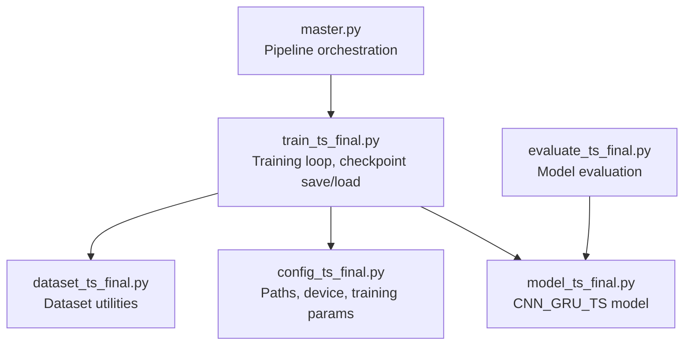
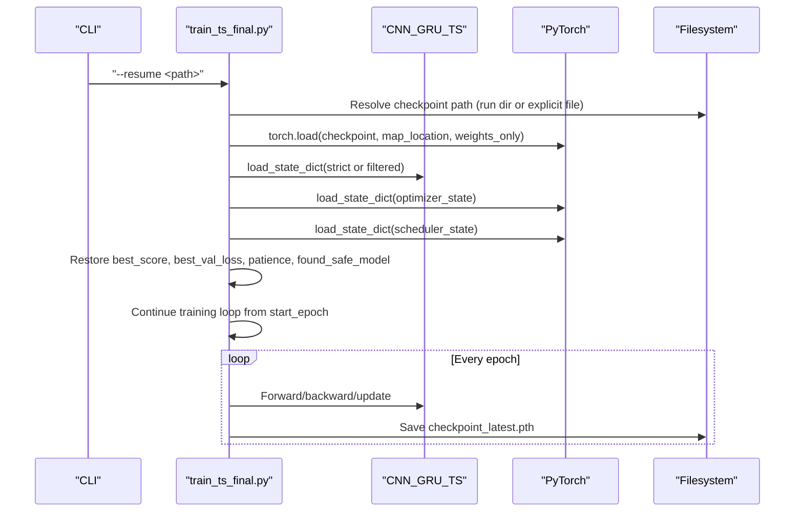
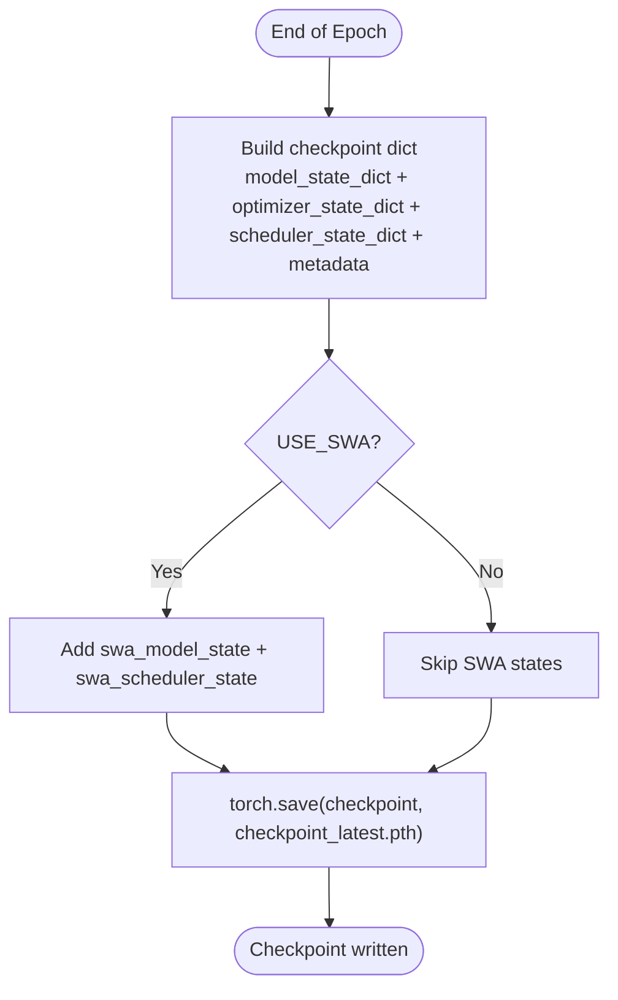
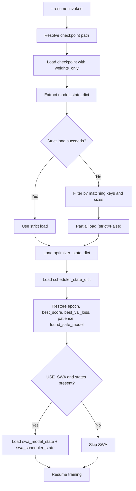
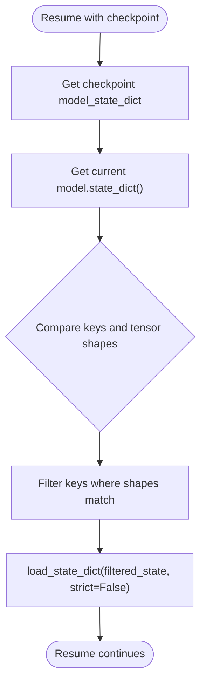
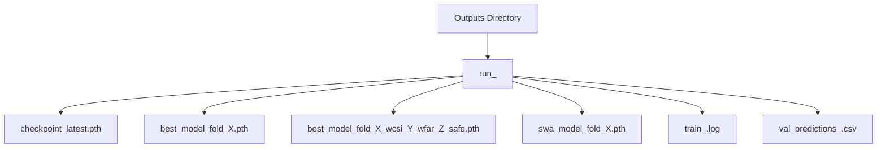
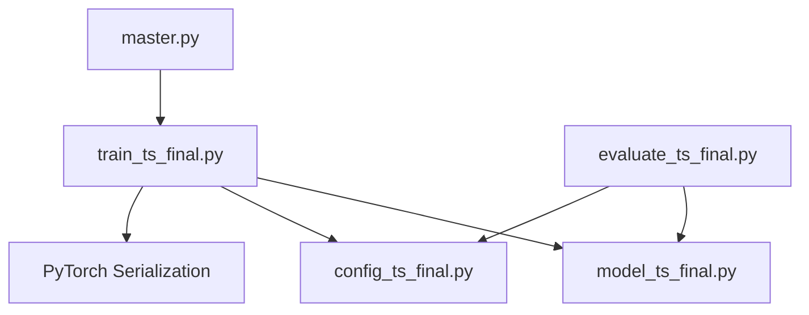

# Checkpoint & Resume System

<cite>
**Referenced Files in This Document**
- [train_ts_final.py](file://train_ts_final.py)
- [model_ts_final.py](file://model_ts_final.py)
- [config_ts_final.py](file://config_ts_final.py)
- [master.py](file://master.py)
- [evaluate_ts_final.py](file://evaluate_ts_final.py)
- [dataset_ts_final.py](file://dataset_ts_final.py)
</cite>

## Table of Contents
1. [Introduction](#introduction)
2. [Project Structure](#project-structure)
3. [Core Components](#core-components)
4. [Architecture Overview](#architecture-overview)
5. [Detailed Component Analysis](#detailed-component-analysis)
6. [Dependency Analysis](#dependency-analysis)
7. [Performance Considerations](#performance-considerations)
8. [Troubleshooting Guide](#troubleshooting-guide)
9. [Conclusion](#conclusion)

## Introduction
This document explains the checkpoint and resume functionality in the training pipeline. It covers how checkpoints are saved during training, what state is captured (model weights, optimizer, scheduler, and training metadata), how resumption works (automatic state restoration, partial weight loading for architecture changes), and how checkpoints are organized within run directories. It also provides guidance on inspecting checkpoints, resuming training, and troubleshooting common resume issues.

## Project Structure
The checkpoint and resume system is implemented primarily in the training script and integrates with the model definition and configuration. Key elements:
- Training script saves periodic checkpoints and loads them for resumption.
- The model supports dynamic channel adaptation, enabling partial weight loading when architecture changes occur.
- Run directories are organized under the configured output directory with a timestamped naming scheme.
- The master pipeline orchestrates training and evaluation, and evaluation scripts can load trained models.

**Diagram sources**
- [train_ts_final.py](file://train_ts_final.py)
- [model_ts_final.py](file://model_ts_final.py)
- [config_ts_final.py](file://config_ts_final.py)
- [dataset_ts_final.py](file://dataset_ts_final.py)
- [master.py](file://master.py)
- [evaluate_ts_final.py](file://evaluate_ts_final.py)

**Section sources**
- [train_ts_final.py](file://train_ts_final.py)
- [model_ts_final.py](file://model_ts_final.py)
- [config_ts_final.py](file://config_ts_final.py)
- [master.py](file://master.py)
- [evaluate_ts_final.py](file://evaluate_ts_final.py)
- [dataset_ts_final.py](file://dataset_ts_final.py)

## Core Components
- Checkpoint saving: At the end of each epoch, the training script creates a checkpoint containing model, optimizer, scheduler, and training metadata. It also saves a symlink-like “latest” checkpoint for convenience.
- Checkpoint loading: On resume, the script loads the checkpoint and restores model weights, optimizer state, scheduler state, and training metadata. It supports partial weight loading when the model architecture changed (e.g., channel count).
- Run directory organization: Each training run is placed in a timestamped run directory under the configured output directory. Artifacts (logs, predictions, best models) are archived into the run directory upon completion.
- SWA integration: When enabled, the stochastic weight averaging model and scheduler states are saved and restored as part of the checkpoint.

**Section sources**
- [train_ts_final.py](file://train_ts_final.py)
- [model_ts_final.py](file://model_ts_final.py)
- [config_ts_final.py](file://config_ts_final.py)

## Architecture Overview
The checkpoint/resume architecture centers around the training loop and the model’s dynamic capabilities.

**Diagram sources**
- [train_ts_final.py](file://train_ts_final.py)
- [model_ts_final.py](file://model_ts_final.py)

## Detailed Component Analysis

### Checkpoint Saving Mechanism
- What is saved:
  - Model state dictionary (weights).
  - Optimizer state dictionary (optimizer state).
  - Scheduler state dictionary (scheduler state).
  - Training metadata: current epoch, best score, best validation loss, patience, and safe model flag.
  - Optional SWA states: averaged model state and SWA scheduler state when enabled.
- Where it is saved:
  - Per-epoch “latest” checkpoint in the run directory.
  - Best model snapshots are saved separately when a new best model is found.
- How it is saved:
  - The training loop constructs a checkpoint dictionary and writes it using PyTorch’s serialization.

**Diagram sources**
- [train_ts_final.py](file://train_ts_final.py)

**Section sources**
- [train_ts_final.py](file://train_ts_final.py)

### Checkpoint Loading and Resume
- Path resolution:
  - If a file path is provided, it is used directly.
  - If a directory is provided, the script looks for the “latest” checkpoint inside that directory.
- State restoration:
  - Model weights are loaded first with a strict load; if that fails due to architecture differences, a filtered partial load is attempted.
  - Optimizer and scheduler states are restored from the checkpoint.
  - Training metadata is restored to continue from the correct epoch and track best scores and patience.
- SWA handling:
  - If present, SWA model and scheduler states are restored; if restoration fails, the system resets SWA components.
- Run directory and logging:
  - The run directory is determined from the checkpoint path and used to organize artifacts.

**Diagram sources**
- [train_ts_final.py](file://train_ts_final.py)

**Section sources**
- [train_ts_final.py](file://train_ts_final.py)

### Model State Dictionary Compatibility and Partial Loading
- Dynamic channel adaptation:
  - The model adapts its first convolutional layer to match the number of input channels defined in configuration.
  - During resume, if the checkpoint’s model state does not match the current model’s state dictionary exactly, the system attempts a partial load by filtering tensors whose shapes match between checkpoint and current model.
- Partial loading strategy:
  - Keys present in both checkpoint and current model are matched.
  - Only tensors with identical shape are loaded; mismatched shapes are ignored.
  - This enables resuming with different channel configurations or minor architecture changes.

**Diagram sources**
- [train_ts_final.py](file://train_ts_final.py)
- [model_ts_final.py](file://model_ts_final.py)

**Section sources**
- [train_ts_final.py](file://train_ts_final.py)
- [model_ts_final.py](file://model_ts_final.py)

### Run Directory Organization and Artifact Management
- Naming convention:
  - Each run is stored in a directory named with a timestamp prefix: run_<YYYYMMDD_HHMMSS>.
- Location:
  - Run directories are created under the configured output directory.
- Artifacts:
  - Logs, validation predictions, best models, and SWA models are copied into the run directory upon completion.
- Best model naming:
  - Best validation models are saved with fold-specific identifiers and additional suffixes indicating safety and performance metrics.

**Diagram sources**
- [train_ts_final.py](file://train_ts_final.py)
- [config_ts_final.py](file://config_ts_final.py)

**Section sources**
- [train_ts_final.py](file://train_ts_final.py)
- [config_ts_final.py](file://config_ts_final.py)

### SWA States in Checkpoints
- When enabled, the training script:
  - Creates an averaged model and SWA scheduler.
  - Saves their state dictionaries alongside the main checkpoint.
- On resume:
  - If SWA states are present, they are restored; otherwise, the system resets SWA components to defaults.

**Section sources**
- [train_ts_final.py](file://train_ts_final.py)

### Evaluation Scripts and Model Loading
- Evaluation scripts load trained models for inference and ensemble evaluation.
- They construct a model instance with the same configuration and load either the best model or SWA model checkpoint.

**Section sources**
- [evaluate_ts_final.py](file://evaluate_ts_final.py)
- [model_ts_final.py](file://model_ts_final.py)
- [config_ts_final.py](file://config_ts_final.py)

## Dependency Analysis
The checkpoint/resume system depends on:
- PyTorch serialization for saving/loading state dictionaries.
- The model’s dynamic channel adaptation to support partial weight loading.
- Configuration-driven paths and device selection.
- The training loop’s epoch-based checkpointing.

**Diagram sources**
- [train_ts_final.py](file://train_ts_final.py)
- [model_ts_final.py](file://model_ts_final.py)
- [config_ts_final.py](file://config_ts_final.py)
- [evaluate_ts_final.py](file://evaluate_ts_final.py)
- [master.py](file://master.py)

**Section sources**
- [train_ts_final.py](file://train_ts_final.py)
- [model_ts_final.py](file://model_ts_final.py)
- [config_ts_final.py](file://config_ts_final.py)
- [evaluate_ts_final.py](file://evaluate_ts_final.py)
- [master.py](file://master.py)

## Performance Considerations
- Checkpoint frequency: Saving per epoch ensures minimal work loss but increases I/O overhead. Consider adjusting epoch frequency or storage backend if disk I/O becomes a bottleneck.
- Partial loading cost: Filtering tensors and loading with strict=False is efficient but still involves iterating through state dictionaries. Keep model architecture changes minimal to reduce mismatches.
- SWA states: Enabling SWA adds memory and computation overhead during training and checkpointing. Disable if resources are constrained.

## Troubleshooting Guide
Common issues and resolutions:
- Checkpoint not found:
  - Ensure the path provided to --resume points to an existing file or a run directory containing the “latest” checkpoint.
- Strict load failure:
  - This occurs when model architecture changed (e.g., input channels). The system automatically attempts partial loading; if it still fails, verify the model’s dynamic channel adaptation and configuration.
- SWA state restore failure:
  - If SWA states fail to load, the system resets SWA components. Resume training without SWA or re-run with compatible SWA settings.
- Device mismatch:
  - The checkpoint is loaded with map_location set to the configured device. Ensure the device setting aligns with available hardware.
- Incompatible model head or output dimensions:
  - If the model’s output heads changed, partial loading may skip incompatible tensors. Verify configuration and model architecture consistency.

Examples of resume commands:
- Resume from a specific checkpoint file:
  - python train_ts_final.py --resume ../outputs/run_YYYYMMDD_HHMMSS/checkpoint_latest.pth
- Resume from a run directory:
  - python train_ts_final.py --resume ../outputs/run_YYYYMMDD_HHMMSS

Checkpoint inspection:
- Inspect the checkpoint structure and keys:
  - Use Python to load the checkpoint and print keys (e.g., epoch, model_state_dict, optimizer_state_dict, scheduler_state_dict, best_score, best_val_loss, patience, found_safe_model, swa_model_state, swa_scheduler_state).
- Verify model compatibility:
  - Compare the model’s current state dictionary keys with those in the checkpoint to identify missing or mismatched tensors.

**Section sources**
- [train_ts_final.py](file://train_ts_final.py)
- [model_ts_final.py](file://model_ts_final.py)
- [config_ts_final.py](file://config_ts_final.py)

## Conclusion
The checkpoint and resume system provides robust training continuity with automatic state restoration and compatibility handling for architecture changes. By saving model weights, optimizer and scheduler states, and training metadata, it enables seamless resumption from interrupted runs. Run directories are systematically organized, and optional SWA states are integrated into the checkpoint lifecycle. Following the troubleshooting steps and using the provided resume commands will help ensure reliable training workflows.