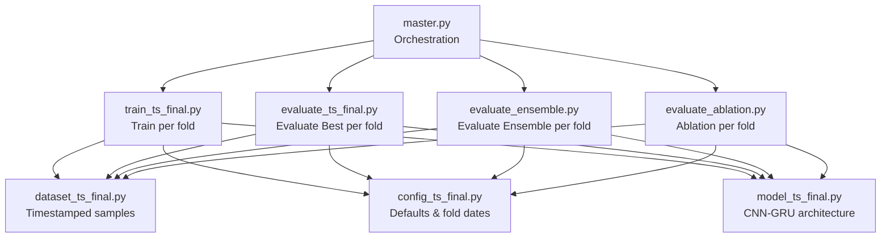
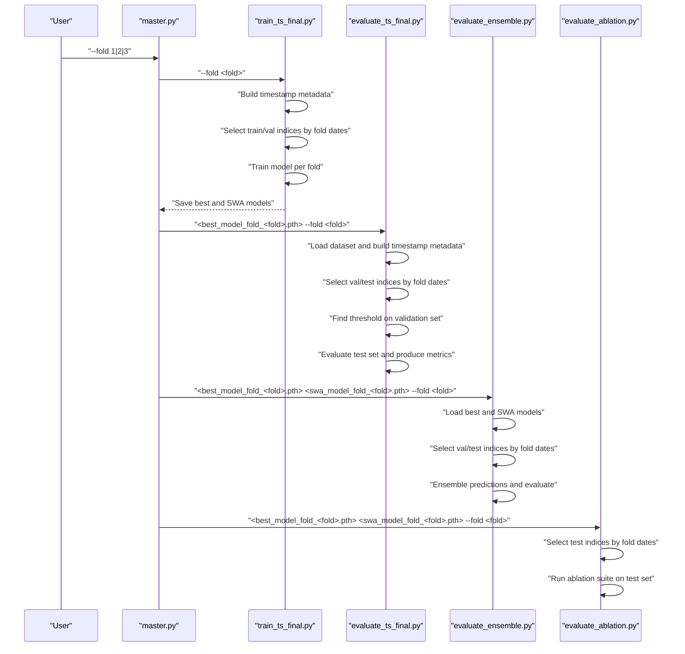
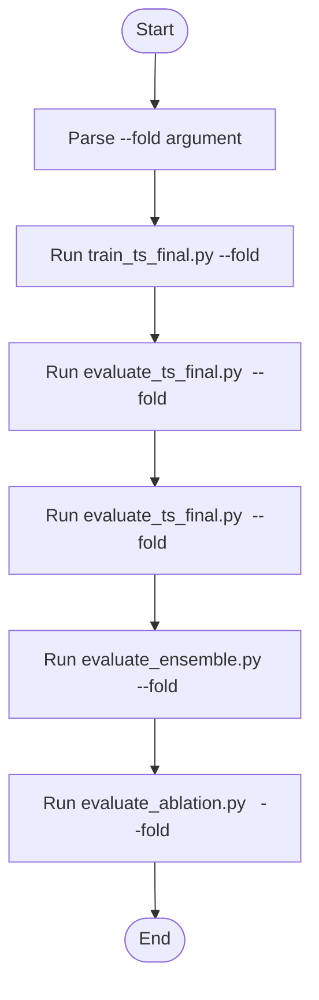
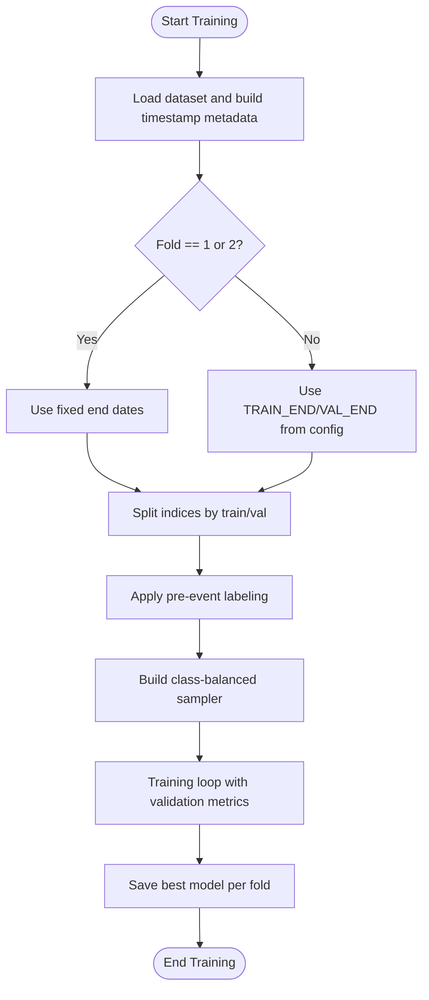
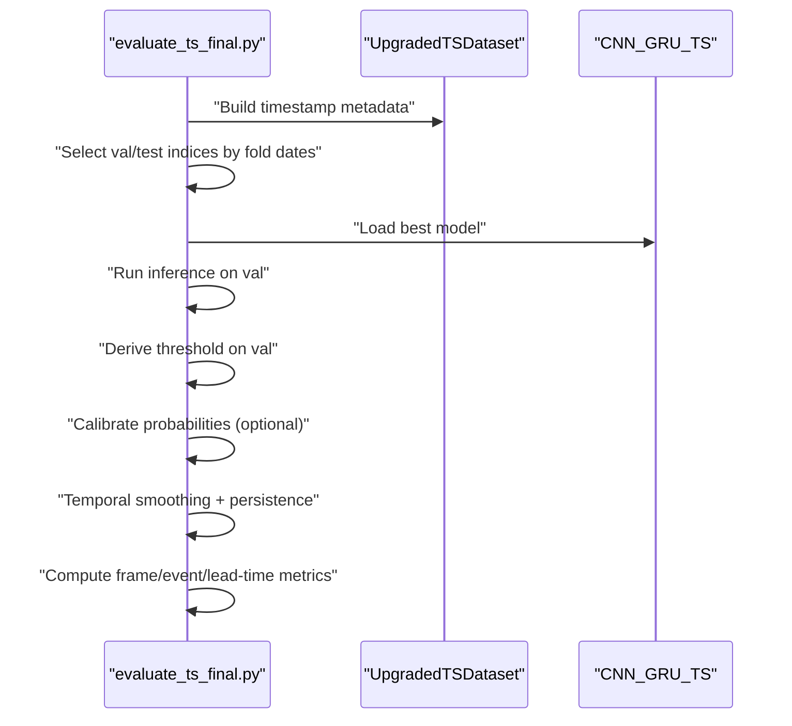
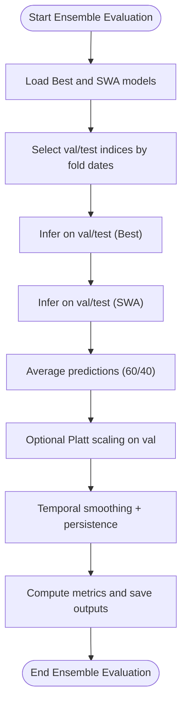
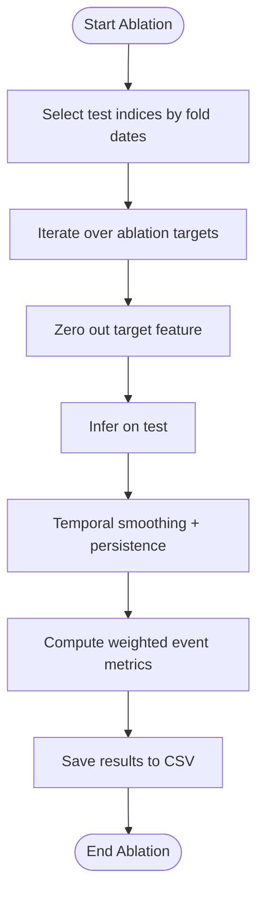
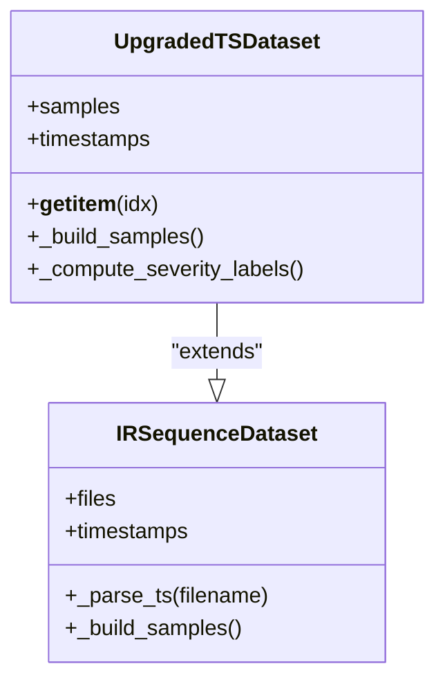
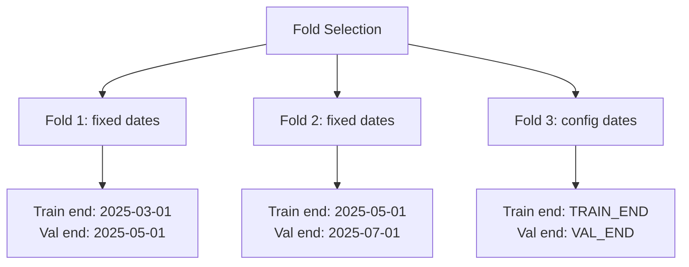
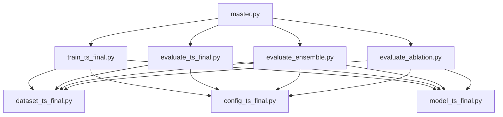

# Cross-Validation Management

<cite>
**Referenced Files in This Document**
- [master.py](file://master.py)
- [train_ts_final.py](file://train_ts_final.py)
- [evaluate_ts_final.py](file://evaluate_ts_final.py)
- [evaluate_ensemble.py](file://evaluate_ensemble.py)
- [evaluate_ablation.py](file://evaluate_ablation.py)
- [dataset_ts_final.py](file://dataset_ts_final.py)
- [config_ts_final.py](file://config_ts_final.py)
- [model_ts_final.py](file://model_ts_final.py)
</cite>

## Table of Contents
1. [Introduction](#introduction)
2. [Project Structure](#project-structure)
3. [Core Components](#core-components)
4. [Architecture Overview](#architecture-overview)
5. [Detailed Component Analysis](#detailed-component-analysis)
6. [Dependency Analysis](#dependency-analysis)
7. [Performance Considerations](#performance-considerations)
8. [Troubleshooting Guide](#troubleshooting-guide)
9. [Conclusion](#conclusion)

## Introduction
This document explains the walk-forward cross-validation (CV) system used in the Nagpur TS Nowcasting pipeline. It details the three-fold validation strategy with time-based splits, dynamic date boundary determination, and temporal consistency requirements. It also covers fold selection via command-line arguments, dataset splitting logic, and the evaluation workflow across folds. Finally, it highlights the importance of chronological data splitting for realistic weather forecasting evaluation and provides guidance for fold-specific configurations and performance comparisons.

## Project Structure
The cross-validation system spans several scripts:
- A master orchestration script that runs training and evaluation phases for a selected fold.
- A training script that builds time-based splits and trains models per fold.
- An evaluation script that computes metrics on the test set for a selected fold.
- An ensemble evaluation script that combines best and SWA models for a selected fold.
- An ablation study script that evaluates feature contributions on the test set for a selected fold.
- A dataset module that provides time-stamped samples and supports time-based filtering.
- A configuration module that defines training and evaluation defaults and fold boundaries.

**Diagram sources**
- [master.py:39-98](file://master.py#L39-L98)
- [train_ts_final.py:142-234](file://train_ts_final.py#L142-L234)
- [evaluate_ts_final.py:361-424](file://evaluate_ts_final.py#L361-L424)
- [evaluate_ensemble.py:84-153](file://evaluate_ensemble.py#L84-L153)
- [evaluate_ablation.py:172-255](file://evaluate_ablation.py#L172-L255)
- [dataset_ts_final.py:57-101](file://dataset_ts_final.py#L57-L101)
- [config_ts_final.py:186-188](file://config_ts_final.py#L186-L188)
- [model_ts_final.py:83-200](file://model_ts_final.py#L83-L200)

**Section sources**
- [master.py:39-108](file://master.py#L39-L108)
- [train_ts_final.py:142-234](file://train_ts_final.py#L142-L234)
- [evaluate_ts_final.py:361-424](file://evaluate_ts_final.py#L361-L424)
- [evaluate_ensemble.py:84-153](file://evaluate_ensemble.py#L84-L153)
- [evaluate_ablation.py:172-255](file://evaluate_ablation.py#L172-L255)
- [dataset_ts_final.py:57-101](file://dataset_ts_final.py#L57-L101)
- [config_ts_final.py:186-188](file://config_ts_final.py#L186-L188)
- [model_ts_final.py:83-200](file://model_ts_final.py#L83-L200)

## Core Components
- Fold selection via command-line argument: The master pipeline accepts a fold argument (1, 2, or 3) and passes it downstream to training and evaluation scripts.
- Time-based dataset partitioning: Both training and evaluation scripts build a timestamp-indexed metadata DataFrame and select train/validation/test partitions based on fold-specific or configuration-defined end dates.
- Dynamic date boundary determination: For folds 1 and 2, fixed end dates are used; for fold 3, the end dates are taken from configuration.
- Temporal consistency: The dataset ensures chronological ordering and uses timestamps to define splits, preventing leakage across time.

**Section sources**
- [master.py:40-43](file://master.py#L40-L43)
- [train_ts_final.py:213-229](file://train_ts_final.py#L213-L229)
- [evaluate_ts_final.py:410-426](file://evaluate_ts_final.py#L410-L426)
- [evaluate_ensemble.py:135-151](file://evaluate_ensemble.py#L135-L151)
- [evaluate_ablation.py:229-247](file://evaluate_ablation.py#L229-L247)

## Architecture Overview
The cross-validation architecture follows a walk-forward strategy:
- Fold 1: Train end date is 2025-03-01; Validation end date is 2025-05-01.
- Fold 2: Train end date is 2025-05-01; Validation end date is 2025-07-01.
- Fold 3: Train end date and Validation end date are taken from configuration.

**Diagram sources**
- [master.py:76-98](file://master.py#L76-L98)
- [train_ts_final.py:213-229](file://train_ts_final.py#L213-L229)
- [evaluate_ts_final.py:410-426](file://evaluate_ts_final.py#L410-L426)
- [evaluate_ensemble.py:135-151](file://evaluate_ensemble.py#L135-L151)
- [evaluate_ablation.py:229-247](file://evaluate_ablation.py#L229-L247)

## Detailed Component Analysis

### Fold Selection and Orchestration
- The master pipeline parses the fold argument and runs training and evaluation phases accordingly. It constructs model paths per fold and orchestrates downstream evaluation and ablation steps.

**Diagram sources**
- [master.py:39-108](file://master.py#L39-L108)

**Section sources**
- [master.py:39-108](file://master.py#L39-L108)

### Training Script: Time-Based Splitting and Model Selection
- The training script builds a timestamp-indexed metadata DataFrame from the dataset’s samples and selects train and validation indices based on the chosen fold.
- For folds 1 and 2, fixed end dates are used; for fold 3, configuration-defined dates are used.
- The script applies pre-event labeling and class-balanced sampling, then trains the model and saves the best-performing checkpoint per fold.

**Diagram sources**
- [train_ts_final.py:204-234](file://train_ts_final.py#L204-L234)
- [train_ts_final.py:236-279](file://train_ts_final.py#L236-L279)
- [train_ts_final.py:674-683](file://train_ts_final.py#L674-L683)

**Section sources**
- [train_ts_final.py:204-234](file://train_ts_final.py#L204-L234)
- [train_ts_final.py:236-279](file://train_ts_final.py#L236-L279)
- [train_ts_final.py:674-683](file://train_ts_final.py#L674-L683)

### Evaluation Script: Threshold Derivation and Test Set Metrics
- The evaluation script mirrors the training split logic to select validation and test sets.
- It derives a threshold on the validation set and applies temporal smoothing and persistence filtering to produce final predictions on the test set.
- It computes frame-level and event-level metrics, lead-time statistics, and severity breakdowns.

**Diagram sources**
- [evaluate_ts_final.py:398-426](file://evaluate_ts_final.py#L398-L426)
- [evaluate_ts_final.py:505-601](file://evaluate_ts_final.py#L505-L601)
- [evaluate_ts_final.py:628-714](file://evaluate_ts_final.py#L628-L714)

**Section sources**
- [evaluate_ts_final.py:398-426](file://evaluate_ts_final.py#L398-L426)
- [evaluate_ts_final.py:505-601](file://evaluate_ts_final.py#L505-L601)
- [evaluate_ts_final.py:628-714](file://evaluate_ts_final.py#L628-L714)

### Ensemble Evaluation: Best + SWA Averaging
- The ensemble script loads both the best and SWA models, selects the same validation and test partitions, and averages their predictions to reduce false alarms while preserving detection rates.

**Diagram sources**
- [evaluate_ensemble.py:155-173](file://evaluate_ensemble.py#L155-L173)
- [evaluate_ensemble.py:174-200](file://evaluate_ensemble.py#L174-L200)

**Section sources**
- [evaluate_ensemble.py:155-173](file://evaluate_ensemble.py#L155-L173)
- [evaluate_ensemble.py:174-200](file://evaluate_ensemble.py#L174-L200)

### Ablation Study: Feature Contribution Analysis
- The ablation script evaluates the contribution of each input feature by zeroing it out and measuring the impact on weighted event-level metrics on the test set for a selected fold.

**Diagram sources**
- [evaluate_ablation.py:229-247](file://evaluate_ablation.py#L229-L247)
- [evaluate_ablation.py:134-148](file://evaluate_ablation.py#L134-L148)

**Section sources**
- [evaluate_ablation.py:229-247](file://evaluate_ablation.py#L229-L247)
- [evaluate_ablation.py:134-148](file://evaluate_ablation.py#L134-L148)

### Dataset and Timestamp-Based Partitioning
- The dataset module provides timestamped samples and supports building a metadata DataFrame for fast, RAM-based time-based filtering.
- The training and evaluation scripts rely on this metadata to select train, validation, and test partitions without re-reading disk data.

**Diagram sources**
- [dataset_ts_final.py:57-101](file://dataset_ts_final.py#L57-L101)
- [dataset_ts_final.py:367-403](file://dataset_ts_final.py#L367-L403)

**Section sources**
- [dataset_ts_final.py:57-101](file://dataset_ts_final.py#L57-L101)
- [dataset_ts_final.py:367-403](file://dataset_ts_final.py#L367-L403)

### Configuration and Fold Date Definitions
- Fold 1 and 2 use fixed end dates embedded in the evaluation scripts.
- Fold 3 uses TRAIN_END and VAL_END from configuration.
- The configuration module centralizes defaults for training and evaluation.

**Diagram sources**
- [evaluate_ts_final.py:411-419](file://evaluate_ts_final.py#L411-L419)
- [train_ts_final.py:214-222](file://train_ts_final.py#L214-L222)
- [config_ts_final.py:186-188](file://config_ts_final.py#L186-L188)

**Section sources**
- [evaluate_ts_final.py:411-419](file://evaluate_ts_final.py#L411-L419)
- [train_ts_final.py:214-222](file://train_ts_final.py#L214-L222)
- [config_ts_final.py:186-188](file://config_ts_final.py#L186-L188)

## Dependency Analysis
- The master pipeline depends on training and evaluation scripts and passes the fold argument downstream.
- Training and evaluation scripts depend on the dataset module for timestamped samples and on the configuration module for defaults and fold dates.
- The model module is shared across training and evaluation.

**Diagram sources**
- [master.py:76-98](file://master.py#L76-L98)
- [train_ts_final.py:213-229](file://train_ts_final.py#L213-L229)
- [evaluate_ts_final.py:410-426](file://evaluate_ts_final.py#L410-L426)
- [evaluate_ensemble.py:135-151](file://evaluate_ensemble.py#L135-L151)
- [evaluate_ablation.py:229-247](file://evaluate_ablation.py#L229-L247)
- [dataset_ts_final.py:57-101](file://dataset_ts_final.py#L57-L101)
- [config_ts_final.py:186-188](file://config_ts_final.py#L186-L188)
- [model_ts_final.py:83-200](file://model_ts_final.py#L83-L200)

**Section sources**
- [master.py:76-98](file://master.py#L76-L98)
- [train_ts_final.py:213-229](file://train_ts_final.py#L213-L229)
- [evaluate_ts_final.py:410-426](file://evaluate_ts_final.py#L410-L426)
- [evaluate_ensemble.py:135-151](file://evaluate_ensemble.py#L135-L151)
- [evaluate_ablation.py:229-247](file://evaluate_ablation.py#L229-L247)
- [dataset_ts_final.py:57-101](file://dataset_ts_final.py#L57-L101)
- [config_ts_final.py:186-188](file://config_ts_final.py#L186-L188)
- [model_ts_final.py:83-200](file://model_ts_final.py#L83-L200)

## Performance Considerations
- Time-based splits ensure that validation and test sets are temporally ahead of training, preventing leakage and enabling realistic forecasting evaluation.
- Using a fixed validation period for folds 1 and 2 allows fair comparison across folds.
- For fold 3, dynamic end dates enable ongoing evaluation as new data becomes available.
- The evaluation pipeline includes temporal smoothing and persistence filtering to stabilize predictions and reduce short-lived false alarms.

[No sources needed since this section provides general guidance]

## Troubleshooting Guide
- If a model checkpoint is not found for a given fold, ensure the training phase completed successfully and saved the expected files.
- If validation or test indices appear empty, verify that the dataset contains timestamps after the selected train end date.
- If threshold derivation fails, confirm that the validation set contains both positive and negative samples.
- If ensemble evaluation does not improve over individual models, review the calibration and smoothing steps.

**Section sources**
- [evaluate_ts_final.py:431-446](file://evaluate_ts_final.py#L431-L446)
- [evaluate_ensemble.py:160-172](file://evaluate_ensemble.py#L160-L172)

## Conclusion
The Nagpur TS Nowcasting pipeline employs a robust walk-forward cross-validation strategy with time-based splits. Folds 1 and 2 use fixed end dates to provide stable, comparable evaluations, while fold 3 leverages configuration-defined dates for dynamic coverage. The training and evaluation scripts consistently partition datasets by timestamps, derive thresholds on validation sets, and apply temporal smoothing and persistence filtering to produce reliable metrics. This approach ensures realistic weather forecasting evaluation and enables meaningful performance comparisons across folds.