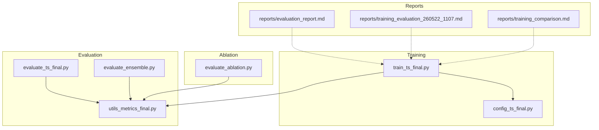
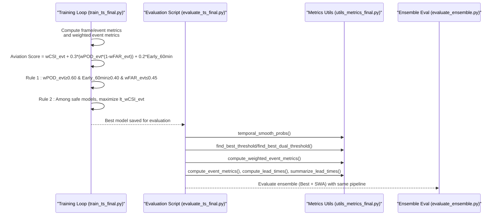
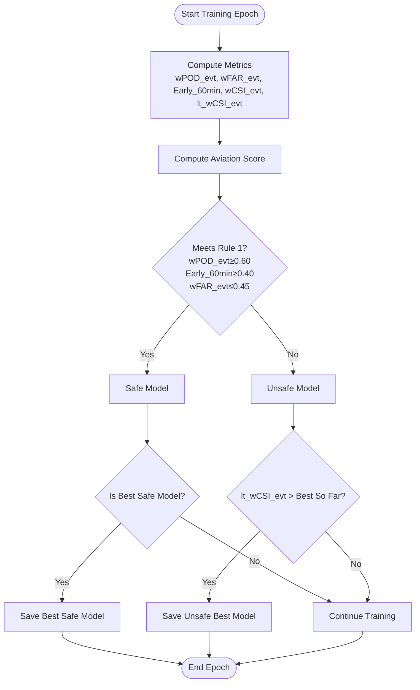
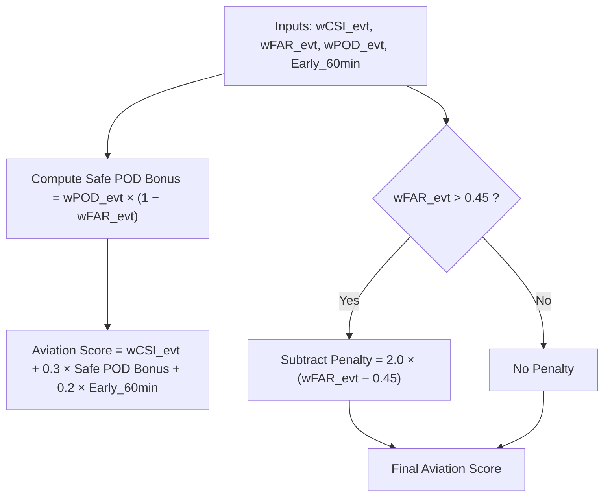
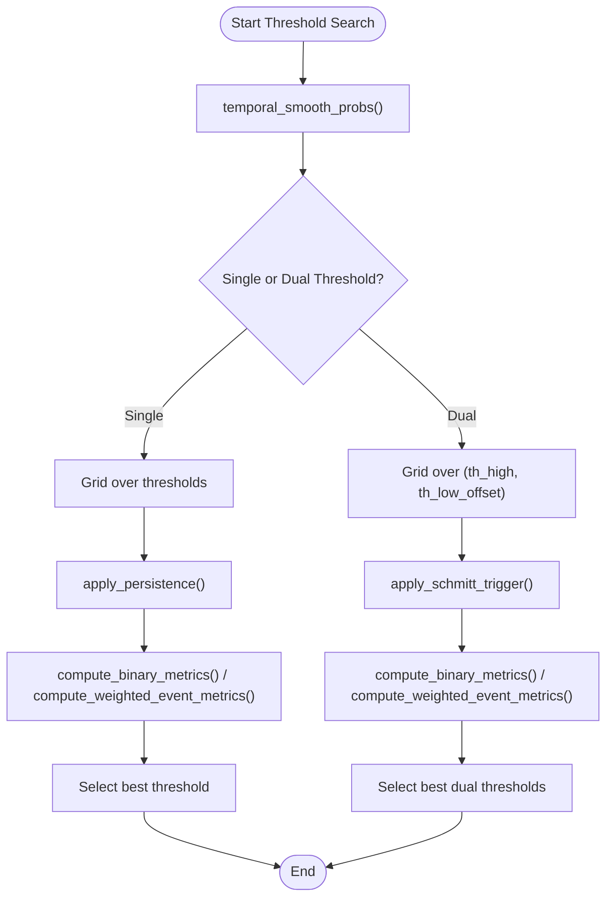
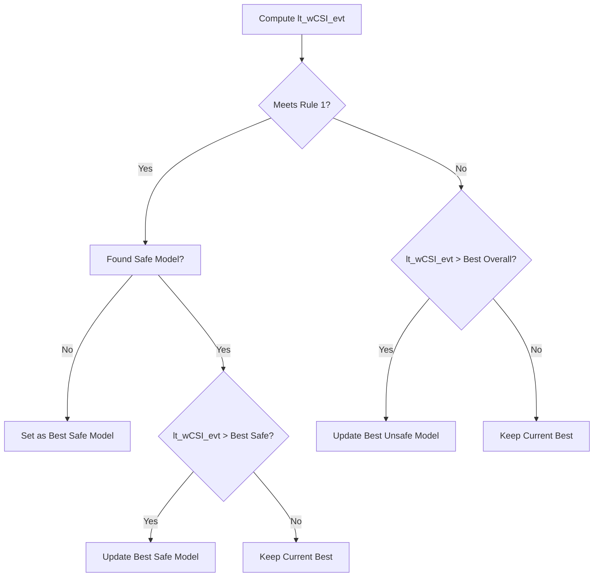
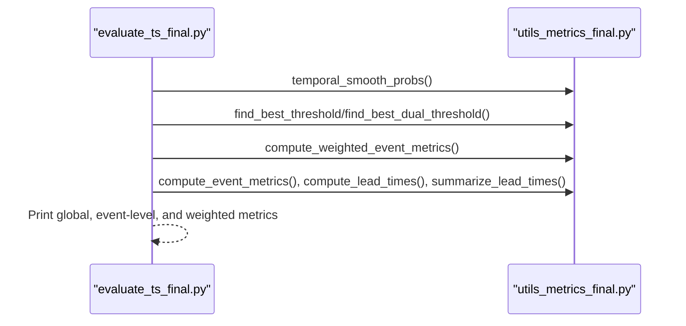
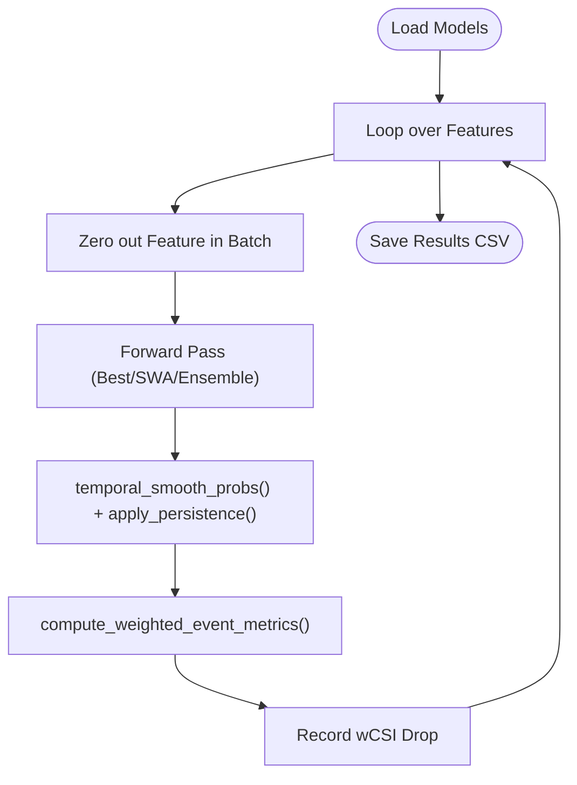
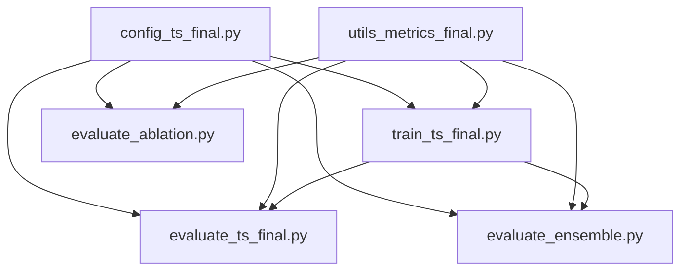

# Model Selection Criteria

<cite>
**Referenced Files in This Document**
- [evaluate_ts_final.py](file://evaluate_ts_final.py)
- [utils_metrics_final.py](file://utils_metrics_final.py)
- [evaluate_ensemble.py](file://evaluate_ensemble.py)
- [evaluate_ablation.py](file://evaluate_ablation.py)
- [train_ts_final.py](file://train_ts_final.py)
- [config_ts_final.py](file://config_ts_final.py)
- [reports/evaluation_report.md](file://reports/evaluation_report.md)
- [reports/training_evaluation_260522_1107.md](file://reports/training_evaluation_260522_1107.md)
- [reports/training_comparison.md](file://reports/training_comparison.md)
</cite>

## Table of Contents
1. [Introduction](#introduction)
2. [Project Structure](#project-structure)
3. [Core Components](#core-components)
4. [Architecture Overview](#architecture-overview)
5. [Detailed Component Analysis](#detailed-component-analysis)
6. [Dependency Analysis](#dependency-analysis)
7. [Performance Considerations](#performance-considerations)
8. [Troubleshooting Guide](#troubleshooting-guide)
9. [Conclusion](#conclusion)
10. [Appendices](#appendices)

## Introduction
This document explains the model selection and evaluation criteria used in the Nagpur TS Nowcasting system. It covers:
- The dual-rule selection process: Rule 1 (operational baseline) and Rule 2 (maximize lead-time weighted CSI among safe models).
- The aviation score combining weighted CSI, FAR, and early detection metrics.
- Threshold optimization via grid search with dual-threshold support for Schmitt trigger.
- Safety scoring, model ranking logic, and selection decisions.
- Examples of evaluation metrics, selection outcomes, and performance comparisons across training runs.

## Project Structure
The repository implements a complete nowcasting pipeline with training, evaluation, and ablation studies. Key modules include:
- Training and selection logic: [train_ts_final.py](file://train_ts_final.py)
- Evaluation scripts: [evaluate_ts_final.py](file://evaluate_ts_final.py), [evaluate_ensemble.py](file://evaluate_ensemble.py)
- Metrics and threshold optimization: [utils_metrics_final.py](file://utils_metrics_final.py)
- Configuration: [config_ts_final.py](file://config_ts_final.py)
- Reports and comparisons: [reports/evaluation_report.md](file://reports/evaluation_report.md), [reports/training_evaluation_260522_1107.md](file://reports/training_evaluation_260522_1107.md), [reports/training_comparison.md](file://reports/training_comparison.md)

**Diagram sources**
- [train_ts_final.py:580-769](file://train_ts_final.py#L580-L769)
- [evaluate_ts_final.py:1-924](file://evaluate_ts_final.py#L1-L924)
- [evaluate_ensemble.py:1-361](file://evaluate_ensemble.py#L1-L361)
- [utils_metrics_final.py:1-760](file://utils_metrics_final.py#L1-L760)
- [config_ts_final.py:1-211](file://config_ts_final.py#L1-L211)
- [reports/evaluation_report.md:1-58](file://reports/evaluation_report.md#L1-L58)
- [reports/training_evaluation_260522_1107.md:1-79](file://reports/training_evaluation_260522_1107.md#L1-L79)
- [reports/training_comparison.md:1-153](file://reports/training_comparison.md#L1-L153)

**Section sources**
- [train_ts_final.py:580-769](file://train_ts_final.py#L580-L769)
- [evaluate_ts_final.py:1-924](file://evaluate_ts_final.py#L1-L924)
- [evaluate_ensemble.py:1-361](file://evaluate_ensemble.py#L1-L361)
- [utils_metrics_final.py:1-760](file://utils_metrics_final.py#L1-L760)
- [config_ts_final.py:1-211](file://config_ts_final.py#L1-L211)
- [reports/evaluation_report.md:1-58](file://reports/evaluation_report.md#L1-L58)
- [reports/training_evaluation_260522_1107.md:1-79](file://reports/training_evaluation_260522_1107.md#L1-L79)
- [reports/training_comparison.md:1-153](file://reports/training_comparison.md#L1-L153)

## Core Components
- Threshold optimization and dual-threshold support:
  - Single-threshold grid search: [find_best_threshold:192-240](file://utils_metrics_final.py#L192-L240)
  - Dual-threshold grid search with Schmitt trigger: [find_best_dual_threshold:263-314](file://utils_metrics_final.py#L263-L314)
  - Schmitt trigger implementation: [apply_schmitt_trigger:243-260](file://utils_metrics_final.py#L243-L260)
- Event-level metrics and lead-time weighting:
  - Weighted event metrics (including lead-time bonus): [compute_weighted_event_metrics:575-650](file://utils_metrics_final.py#L575-L650)
  - Event overlap and lead-time computation: [compute_event_metrics:338-392](file://utils_metrics_final.py#L338-L392), [compute_lead_times:395-440](file://utils_metrics_final.py#L395-L440), [summarize_lead_times:443-477](file://utils_metrics_final.py#L443-L477)
- Aviation score and safety scoring:
  - Aviation score definition and penalties: [train_ts_final.py:580-585](file://train_ts_final.py#L580-L585)
  - Dual-rule selection (Rule 1 and Rule 2): [train_ts_final.py:612-672](file://train_ts_final.py#L612-L672)
- Evaluation and ensemble averaging:
  - Final evaluation pipeline: [evaluate_ts_final.py:520-626](file://evaluate_ts_final.py#L520-L626)
  - Ensemble evaluation (Best + SWA): [evaluate_ensemble.py:174-250](file://evaluate_ensemble.py#L174-L250)
- Configuration of selection criteria:
  - Threshold metric, smoothing, persistence, and trigger settings: [config_ts_final.py:90-139](file://config_ts_final.py#L90-L139)

**Section sources**
- [utils_metrics_final.py:192-314](file://utils_metrics_final.py#L192-L314)
- [utils_metrics_final.py:575-650](file://utils_metrics_final.py#L575-L650)
- [train_ts_final.py:580-672](file://train_ts_final.py#L580-L672)
- [evaluate_ts_final.py:520-626](file://evaluate_ts_final.py#L520-L626)
- [evaluate_ensemble.py:174-250](file://evaluate_ensemble.py#L174-L250)
- [config_ts_final.py:90-139](file://config_ts_final.py#L90-L139)

## Architecture Overview
The selection and evaluation pipeline integrates threshold optimization, temporal smoothing, persistence filtering, and weighted event metrics to select safe, operationally effective models.

**Diagram sources**
- [train_ts_final.py:580-769](file://train_ts_final.py#L580-L769)
- [evaluate_ts_final.py:520-626](file://evaluate_ts_final.py#L520-L626)
- [utils_metrics_final.py:23-47](file://utils_metrics_final.py#L23-L47)
- [utils_metrics_final.py:192-314](file://utils_metrics_final.py#L192-L314)
- [utils_metrics_final.py:575-650](file://utils_metrics_final.py#L575-L650)
- [evaluate_ensemble.py:174-250](file://evaluate_ensemble.py#L174-L250)

## Detailed Component Analysis

### Dual-Rule Selection Process
- Rule 1 (Operational Baseline): An epoch qualifies as “safe” if:
  - wPOD_evt ≥ 0.60
  - Early_60min ≥ 0.40
  - wFAR_evt ≤ 0.45
- Rule 2 (Maximize Lead-Time Weighted CSI): Among epochs meeting Rule 1, select the model that maximizes lt_wCSI_evt.

**Diagram sources**
- [train_ts_final.py:612-672](file://train_ts_final.py#L612-L672)

**Section sources**
- [train_ts_final.py:612-672](file://train_ts_final.py#L612-L672)

### Aviation Score Definition
The aviation score combines weighted CSI, FAR, and early detection:
- Aviation Score = wCSI_evt + 0.3 × (wPOD_evt × (1 − wFAR_evt)) + 0.2 × Early_60min
- Penalty: If wFAR_evt > 0.45, subtract a scaled penalty term to discourage unsafe models.

**Diagram sources**
- [train_ts_final.py:580-585](file://train_ts_final.py#L580-L585)

**Section sources**
- [train_ts_final.py:580-585](file://train_ts_final.py#L580-L585)

### Threshold Optimization and Schmitt Trigger
- Single-threshold grid search:
  - Searches over a range of thresholds to maximize a chosen metric (e.g., F2, ETS, SEDI, or weighted event metrics).
  - Applies temporal smoothing and optional persistence filtering before evaluation.
  - Supports severity-aware metrics via compute_weighted_event_metrics.
- Dual-threshold grid search with Schmitt trigger:
  - Optimizes (th_high, th_low) pairs with offsets, enabling hysteresis to reduce temporal chatter.
  - Rapid cooling flags can bypass thresholds to trigger immediately.
- Temporal smoothing and persistence:
  - Exponential moving average smoothing and persistence filtering remove short false alarms.

**Diagram sources**
- [utils_metrics_final.py:23-47](file://utils_metrics_final.py#L23-L47)
- [utils_metrics_final.py:50-77](file://utils_metrics_final.py#L50-L77)
- [utils_metrics_final.py:192-240](file://utils_metrics_final.py#L192-L240)
- [utils_metrics_final.py:243-260](file://utils_metrics_final.py#L243-L260)
- [utils_metrics_final.py:263-314](file://utils_metrics_final.py#L263-L314)

**Section sources**
- [utils_metrics_final.py:23-47](file://utils_metrics_final.py#L23-L47)
- [utils_metrics_final.py:50-77](file://utils_metrics_final.py#L50-L77)
- [utils_metrics_final.py:192-240](file://utils_metrics_final.py#L192-L240)
- [utils_metrics_final.py:243-260](file://utils_metrics_final.py#L243-L260)
- [utils_metrics_final.py:263-314](file://utils_metrics_final.py#L263-L314)

### Safety Scoring and Ranking Logic
- Safety scoring:
  - Lead-time weighted CSI (lt_wCSI_evt) adds bonuses for early detection and safe POD bonus.
- Ranking:
  - First, identify safe models meeting Rule 1.
  - Among safe models, rank by lt_wCSI_evt.
  - If no safe model yet, still select the highest-scoring model (even if unsafe) to encourage progress toward safety.

**Diagram sources**
- [train_ts_final.py:650-672](file://train_ts_final.py#L650-L672)
- [utils_metrics_final.py:628-643](file://utils_metrics_final.py#L628-L643)

**Section sources**
- [train_ts_final.py:650-672](file://train_ts_final.py#L650-L672)
- [utils_metrics_final.py:628-643](file://utils_metrics_final.py#L628-L643)

### Evaluation Pipeline and Examples
- Final evaluation:
  - Validates on the validation set to derive thresholds (single or dual).
  - Applies Platt scaling (when applicable) and temporal smoothing.
  - Computes frame and event metrics, lead-time statistics, and weighted event metrics.
- Ensemble evaluation:
  - Averages predictions from Best and SWA models (60/40 split) and evaluates with the same pipeline.
- Example metrics and outcomes:
  - Reports compare runs and highlight improvements in lead time and weighted CSI while noting trade-offs with raw AUC.

**Diagram sources**
- [evaluate_ts_final.py:520-626](file://evaluate_ts_final.py#L520-L626)
- [utils_metrics_final.py:575-650](file://utils_metrics_final.py#L575-L650)

**Section sources**
- [evaluate_ts_final.py:520-626](file://evaluate_ts_final.py#L520-L626)
- [evaluate_ensemble.py:174-250](file://evaluate_ensemble.py#L174-L250)
- [reports/evaluation_report.md:1-58](file://reports/evaluation_report.md#L1-L58)
- [reports/training_evaluation_260522_1107.md:1-79](file://reports/training_evaluation_260522_1107.md#L1-L79)

### Ablation Study and Feature Importance
- Ablation study:
  - Zeros out individual input channels/features and measures impact on weighted event metrics.
  - Uses the same post-processing pipeline (smoothing + persistence) to ensure fair comparison.
- Results interpretation:
  - Larger drops in wCSI upon ablation indicate higher feature importance.
  - Supports decisions like disabling computationally expensive optical flow in favor of thermodynamic proxies.

**Diagram sources**
- [evaluate_ablation.py:38-116](file://evaluate_ablation.py#L38-L116)

**Section sources**
- [evaluate_ablation.py:38-116](file://evaluate_ablation.py#L38-L116)
- [reports/training_evaluation_260522_1107.md:41-79](file://reports/training_evaluation_260522_1107.md#L41-L79)

## Dependency Analysis
- Training depends on:
  - Metrics utilities for computing weighted event metrics and lead-time statistics.
  - Configuration for threshold metric, smoothing, persistence, and trigger settings.
- Evaluation depends on:
  - Metrics utilities for threshold optimization and event-level computations.
  - Configuration for consistent post-processing and threshold selection.
- Reports depend on:
  - Training logs and evaluation outputs to compare runs and interpret trade-offs.

**Diagram sources**
- [config_ts_final.py:90-139](file://config_ts_final.py#L90-L139)
- [utils_metrics_final.py:1-760](file://utils_metrics_final.py#L1-L760)
- [train_ts_final.py:580-769](file://train_ts_final.py#L580-L769)
- [evaluate_ts_final.py:520-626](file://evaluate_ts_final.py#L520-L626)
- [evaluate_ensemble.py:174-250](file://evaluate_ensemble.py#L174-L250)
- [evaluate_ablation.py:38-116](file://evaluate_ablation.py#L38-L116)

**Section sources**
- [config_ts_final.py:90-139](file://config_ts_final.py#L90-L139)
- [utils_metrics_final.py:1-760](file://utils_metrics_final.py#L1-L760)
- [train_ts_final.py:580-769](file://train_ts_final.py#L580-L769)
- [evaluate_ts_final.py:520-626](file://evaluate_ts_final.py#L520-L626)
- [evaluate_ensemble.py:174-250](file://evaluate_ensemble.py#L174-L250)
- [evaluate_ablation.py:38-116](file://evaluate_ablation.py#L38-L116)

## Performance Considerations
- Threshold metric selection:
  - Using lt-wCSI_evt encourages early detection while balancing safety.
- Temporal smoothing and persistence:
  - Reduce false alarms and stabilize predictions across time.
- Platt scaling:
  - Improves probability calibration for raw-probability metrics (ROC/PR-AUC).
- Ensemble averaging:
  - Reduces FAR while maintaining POD by combining best and SWA models.

[No sources needed since this section provides general guidance]

## Troubleshooting Guide
- If models fail Rule 1:
  - Review wFAR_evt and Early_60min; adjust threshold metric or regularization to improve safety.
- If lead times degrade:
  - Re-enable time features and ensure temporal context is preserved.
- If weighted CSI improves but raw AUC drops:
  - This is expected when prioritizing operational lead time over pixel-level discrimination.

**Section sources**
- [train_ts_final.py:612-672](file://train_ts_final.py#L612-L672)
- [reports/training_evaluation_260522_1107.md:23-25](file://reports/training_evaluation_260522_1107.md#L23-L25)

## Conclusion
The Nagpur TS Nowcasting system employs a robust dual-rule selection process grounded in operational safety and lead-time awareness. Rule 1 ensures acceptable performance across wPOD_evt, Early_60min, and wFAR_evt, while Rule 2 selects the best safe model by maximizing lead-time weighted CSI. The aviation score balances weighted CSI, safety, and early detection, guiding training and evaluation. Threshold optimization with single or dual thresholds, combined with temporal smoothing and persistence, yields reliable operational predictions. Ablation studies confirm the value of thermodynamic proxies and inform future architectural decisions.

[No sources needed since this section summarizes without analyzing specific files]

## Appendices

### Appendix A: Selection Decision Examples
- Example 1: Run comparison shows improved wCSI_evt and wPOD_evt with a trade-off in mean lead time when time features are disabled.
- Example 2: After re-enabling time features, lead time improves substantially while maintaining or improving weighted CSI.

**Section sources**
- [reports/evaluation_report.md:11-26](file://reports/evaluation_report.md#L11-L26)
- [reports/training_evaluation_260522_1107.md:10-26](file://reports/training_evaluation_260522_1107.md#L10-L26)

### Appendix B: Configuration Highlights for Selection
- Threshold metric: lt-wCSI_evt
- Smoothing: EMA with window size 2
- Persistence: Minimum event length 3 frames
- Schmitt trigger: Enabled with dual-threshold grid search
- Severity weights: Heavily weight heavy precipitation events

**Section sources**
- [config_ts_final.py:90-139](file://config_ts_final.py#L90-L139)