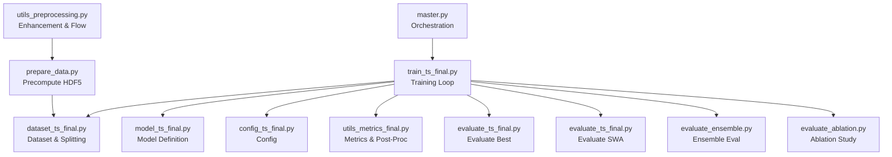
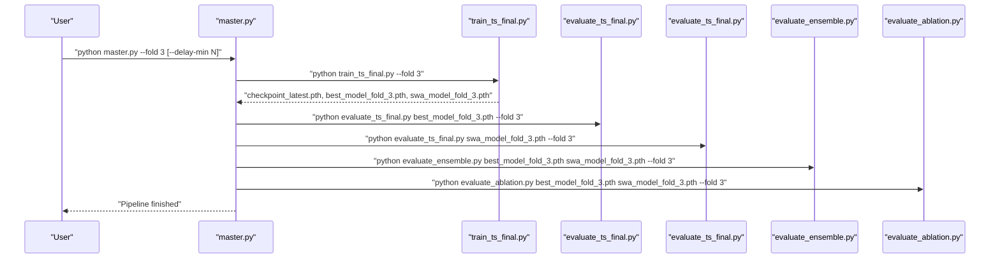
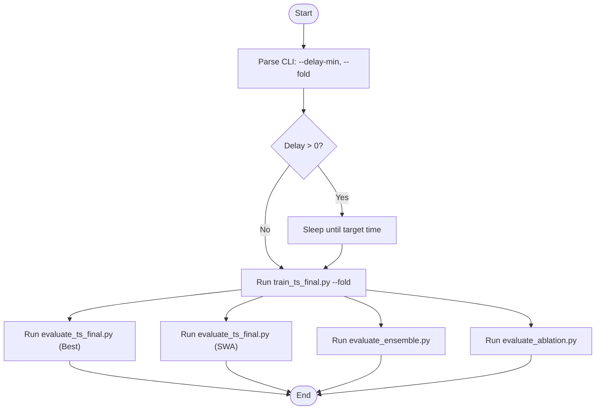
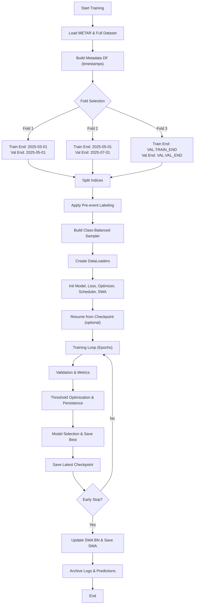
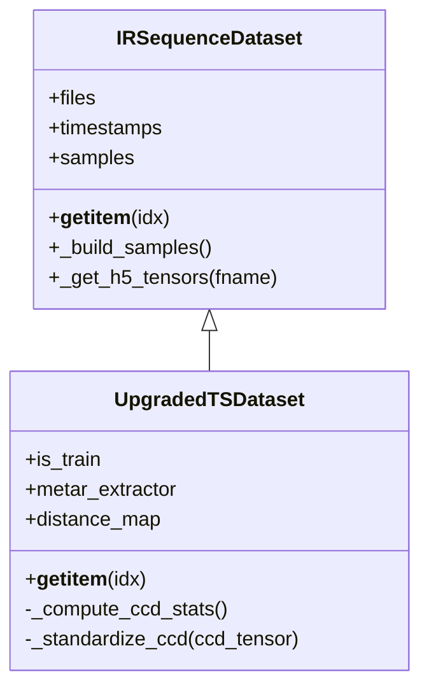
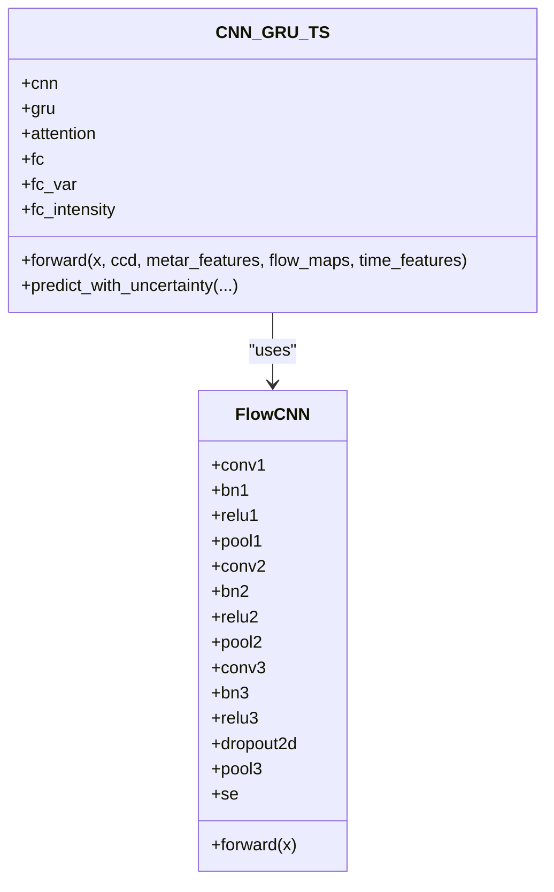
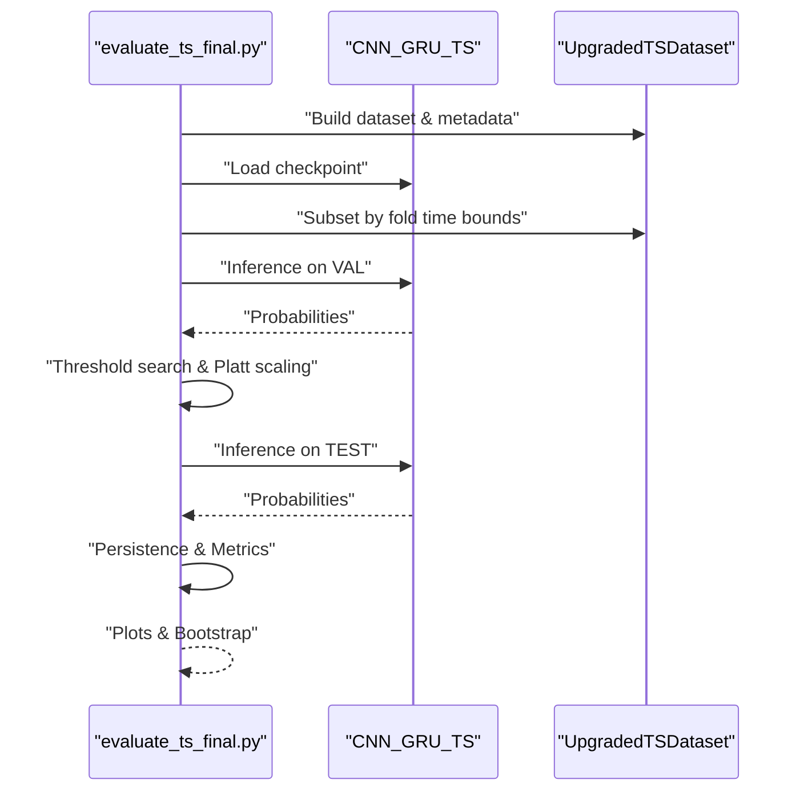
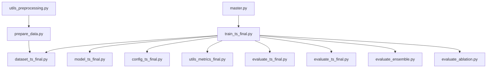

# Pipeline Management & Execution

<cite>
**Referenced Files in This Document**
- [master.py](file://master.py)
- [train_ts_final.py](file://train_ts_final.py)
- [dataset_ts_final.py](file://dataset_ts_final.py)
- [model_ts_final.py](file://model_ts_final.py)
- [config_ts_final.py](file://config_ts_final.py)
- [evaluate_ts_final.py](file://evaluate_ts_final.py)
- [evaluate_ensemble.py](file://evaluate_ensemble.py)
- [evaluate_ablation.py](file://evaluate_ablation.py)
- [utils_metrics_final.py](file://utils_metrics_final.py)
- [prepare_data.py](file://prepare_data.py)
- [utils_preprocessing.py](file://utils_preprocessing.py)
- [run_fold3.bat](file://run_fold3.bat)
</cite>

## Table of Contents
1. [Introduction](#introduction)
2. [Project Structure](#project-structure)
3. [Core Components](#core-components)
4. [Architecture Overview](#architecture-overview)
5. [Detailed Component Analysis](#detailed-component-analysis)
6. [Dependency Analysis](#dependency-analysis)
7. [Performance Considerations](#performance-considerations)
8. [Troubleshooting Guide](#troubleshooting-guide)
9. [Conclusion](#conclusion)
10. [Appendices](#appendices)

## Introduction
This document describes the training pipeline management system for the Nagpur Thunderstorm Nowcasting project. It covers the complete execution flow from command-line argument parsing to model training orchestration, including walk-forward cross-validation with time-based splits, pipeline stages (data loading, preprocessing, model initialization, training/validation loops, and post-processing), resume functionality with checkpoint restoration, run directory management with timestamp-based naming, artifact organization, examples of training commands and fold selection, pipeline status monitoring, error handling, validation checks, and graceful degradation strategies.

## Project Structure
The repository organizes the pipeline into modular scripts:
- Master orchestrator: [master.py](file://master.py)
- Training loop: [train_ts_final.py](file://train_ts_final.py)
- Dataset and preprocessing: [dataset_ts_final.py](file://dataset_ts_final.py), [prepare_data.py](file://prepare_data.py), [utils_preprocessing.py](file://utils_preprocessing.py)
- Model definition: [model_ts_final.py](file://model_ts_final.py)
- Configuration: [config_ts_final.py](file://config_ts_final.py)
- Evaluation and analysis: [evaluate_ts_final.py](file://evaluate_ts_final.py), [evaluate_ensemble.py](file://evaluate_ensemble.py), [evaluate_ablation.py](file://evaluate_ablation.py)
- Metrics utilities: [utils_metrics_final.py](file://utils_metrics_final.py)
- Windows launcher: [run_fold3.bat](file://run_fold3.bat)

**Diagram sources**
- [master.py:39-108](file://master.py#L39-L108)
- [train_ts_final.py:142-757](file://train_ts_final.py#L142-L757)
- [dataset_ts_final.py:47-515](file://dataset_ts_final.py#L47-L515)
- [model_ts_final.py:68-335](file://model_ts_final.py#L68-L335)
- [config_ts_final.py:16-208](file://config_ts_final.py#L16-L208)
- [utils_metrics_final.py:1-200](file://utils_metrics_final.py#L1-L200)
- [evaluate_ts_final.py:361-908](file://evaluate_ts_final.py#L361-L908)
- [evaluate_ensemble.py:84-361](file://evaluate_ensemble.py#L84-L361)
- [evaluate_ablation.py:172-307](file://evaluate_ablation.py#L172-L307)
- [prepare_data.py:39-132](file://prepare_data.py#L39-L132)
- [utils_preprocessing.py:86-162](file://utils_preprocessing.py#L86-L162)

**Section sources**
- [master.py:39-108](file://master.py#L39-L108)
- [train_ts_final.py:142-757](file://train_ts_final.py#L142-L757)
- [dataset_ts_final.py:47-515](file://dataset_ts_final.py#L47-L515)
- [model_ts_final.py:68-335](file://model_ts_final.py#L68-L335)
- [config_ts_final.py:16-208](file://config_ts_final.py#L16-L208)
- [utils_metrics_final.py:1-200](file://utils_metrics_final.py#L1-L200)
- [evaluate_ts_final.py:361-908](file://evaluate_ts_final.py#L361-L908)
- [evaluate_ensemble.py:84-361](file://evaluate_ensemble.py#L84-L361)
- [evaluate_ablation.py:172-307](file://evaluate_ablation.py#L172-L307)
- [prepare_data.py:39-132](file://prepare_data.py#L39-L132)
- [utils_preprocessing.py:86-162](file://utils_preprocessing.py#L86-L162)

## Core Components
- Master orchestrator: parses CLI flags, optionally delays execution, runs training, and evaluates best/SWA/ensemble/ablation models sequentially.
- Training loop: loads data, builds time-based folds, applies class-balanced sampling, trains model with SWA, validates, selects best model, saves checkpoints and artifacts.
- Dataset: constructs time-aligned sequences, computes labels and severity, caches HDF5 features, augments during training.
- Model: CNN-GRU with spatial skip, optional optical flow, METAR/time features, multi-head outputs.
- Configuration: centralizes paths, hyperparameters, and feature flags.
- Evaluation: computes metrics, generates plots, and performs ablation studies.
- Utilities: smoothing, persistence filtering, threshold optimization, and bootstrapping.

**Section sources**
- [master.py:39-108](file://master.py#L39-L108)
- [train_ts_final.py:142-757](file://train_ts_final.py#L142-L757)
- [dataset_ts_final.py:47-515](file://dataset_ts_final.py#L47-L515)
- [model_ts_final.py:68-335](file://model_ts_final.py#L68-L335)
- [config_ts_final.py:16-208](file://config_ts_final.py#L16-L208)
- [utils_metrics_final.py:1-200](file://utils_metrics_final.py#L1-L200)

## Architecture Overview
The pipeline is orchestrated by a master script that invokes training and evaluation scripts in sequence. Training uses time-based walk-forward CV folds to split data chronologically. The training loop manages data loaders, model initialization, loss computation, optimizer scheduling, SWA, and checkpointing. Evaluation scripts reuse the same dataset split logic and post-processing pipeline to produce standardized metrics and visualizations.

**Diagram sources**
- [master.py:39-108](file://master.py#L39-L108)
- [train_ts_final.py:142-757](file://train_ts_final.py#L142-L757)
- [evaluate_ts_final.py:361-908](file://evaluate_ts_final.py#L361-L908)
- [evaluate_ensemble.py:84-361](file://evaluate_ensemble.py#L84-L361)
- [evaluate_ablation.py:172-307](file://evaluate_ablation.py#L172-L307)

## Detailed Component Analysis

### Master Orchestrator
- Parses CLI flags: delay in minutes, fold selection (1, 2, or 3).
- Optionally sleeps until a target time for scheduled execution.
- Executes training and subsequent evaluation phases in order: best model, SWA model, ensemble, ablation.
- Reports timing and success/failure of each stage.

**Diagram sources**
- [master.py:39-108](file://master.py#L39-L108)

**Section sources**
- [master.py:39-108](file://master.py#L39-L108)

### Training Pipeline (train_ts_final.py)
- Argument parsing: resume path or new run, fold selection.
- Run directory management: timestamped run folder under outputs; logging to both console and file.
- Data loading: METAR, full dataset for train/val; time-based split determined by fold.
- Pre-event labeling: soft ramp-up of labels near event onset.
- Class-balanced sampling: configurable target positive rate with optional seasonal boosting.
- Model, loss, optimizer, scheduler initialization; optional SWA.
- Training loop: batches, forward/backward, gradient clipping, validation metrics, threshold optimization, persistence filtering, SWA updates.
- Model selection: safe baseline rule and weighted CSI maximization; best model saved; latest checkpoint updated each epoch.
- Artifact archiving: logs and predictions moved to run directory upon completion.

**Diagram sources**
- [train_ts_final.py:142-757](file://train_ts_final.py#L142-L757)

**Section sources**
- [train_ts_final.py:142-757](file://train_ts_final.py#L142-L757)

### Dataset and Preprocessing (dataset_ts_final.py, prepare_data.py, utils_preprocessing.py)
- Dataset construction: builds sequences from HDF5 files, aligns timestamps, computes labels and severity windows, caches HDF5 tensors.
- Pre-event labeling: ramps up soft labels near event onset.
- Augmentation (training only): horizontal flip, temporal masking, channel dropout, Gaussian noise.
- Dynamic spatial mask: upwind-adjusted mask based on optical flow.
- Precomputation: [prepare_data.py](file://prepare_data.py) converts raw images to HDF5 with IR/WV channels, textures, cooling rates, optical flow, differences, accelerations, and trends; writes CCD features to CSV.

**Diagram sources**
- [dataset_ts_final.py:47-515](file://dataset_ts_final.py#L47-L515)

**Section sources**
- [dataset_ts_final.py:47-515](file://dataset_ts_final.py#L47-L515)
- [prepare_data.py:39-132](file://prepare_data.py#L39-L132)
- [utils_preprocessing.py:86-162](file://utils_preprocessing.py#L86-L162)

### Model Definition (model_ts_final.py)
- CNN-GRU architecture with MobileNetV2 backbone, spatial skip connections, optional optical flow branch, METAR/time projections.
- Feature projection to GRU input; temporal attention; multi-head outputs: binary/logits, optional aleatoric uncertainty, optional intensity regression.
- Predictions with uncertainty support via evidential learning or Monte Carlo dropout.

**Diagram sources**
- [model_ts_final.py:68-335](file://model_ts_final.py#L68-L335)

**Section sources**
- [model_ts_final.py:68-335](file://model_ts_final.py#L68-L335)

### Configuration (config_ts_final.py)
- Centralized configuration for data paths, model architecture, training hyperparameters, loss functions, post-processing, spatial masks, METAR features, and evaluation flags.
- Includes fold-specific time boundaries for walk-forward CV.

**Section sources**
- [config_ts_final.py:16-208](file://config_ts_final.py#L16-L208)

### Evaluation Scripts
- Best/SWA evaluation: loads model, rebuilds dataset split, derives threshold on validation, applies smoothing and persistence, computes metrics, generates plots, and prints bootstrap confidence intervals.
- Ensemble evaluation: averages best and SWA predictions, calibrates if applicable, compares against individual models.
- Ablation study: systematically zeros input channels/features and measures weighted event-level metrics.

**Diagram sources**
- [evaluate_ts_final.py:361-908](file://evaluate_ts_final.py#L361-L908)

**Section sources**
- [evaluate_ts_final.py:361-908](file://evaluate_ts_final.py#L361-L908)
- [evaluate_ensemble.py:84-361](file://evaluate_ensemble.py#L84-L361)
- [evaluate_ablation.py:172-307](file://evaluate_ablation.py#L172-L307)

### Metrics and Post-Processing Utilities
- Temporal smoothing (EMA or rolling mean), persistence filtering, threshold optimization, event-level metrics, lead-time analysis, SEDI, and bootstrap confidence intervals.

**Section sources**
- [utils_metrics_final.py:1-200](file://utils_metrics_final.py#L1-L200)

## Dependency Analysis
- Master depends on training and evaluation scripts; training depends on dataset, model, config, and metrics; evaluation depends on dataset and metrics; preprocessing depends on OpenCV and PIL; training optionally depends on SWA utilities.

**Diagram sources**
- [master.py:39-108](file://master.py#L39-L108)
- [train_ts_final.py:142-757](file://train_ts_final.py#L142-L757)
- [dataset_ts_final.py:47-515](file://dataset_ts_final.py#L47-L515)
- [model_ts_final.py:68-335](file://model_ts_final.py#L68-L335)
- [config_ts_final.py:16-208](file://config_ts_final.py#L16-L208)
- [utils_metrics_final.py:1-200](file://utils_metrics_final.py#L1-L200)
- [evaluate_ts_final.py:361-908](file://evaluate_ts_final.py#L361-L908)
- [evaluate_ensemble.py:84-361](file://evaluate_ensemble.py#L84-L361)
- [evaluate_ablation.py:172-307](file://evaluate_ablation.py#L172-L307)
- [prepare_data.py:39-132](file://prepare_data.py#L39-L132)
- [utils_preprocessing.py:86-162](file://utils_preprocessing.py#L86-L162)

**Section sources**
- [master.py:39-108](file://master.py#L39-L108)
- [train_ts_final.py:142-757](file://train_ts_final.py#L142-L757)
- [dataset_ts_final.py:47-515](file://dataset_ts_final.py#L47-L515)
- [model_ts_final.py:68-335](file://model_ts_final.py#L68-L335)
- [config_ts_final.py:16-208](file://config_ts_final.py#L16-L208)
- [utils_metrics_final.py:1-200](file://utils_metrics_final.py#L1-L200)
- [evaluate_ts_final.py:361-908](file://evaluate_ts_final.py#L361-L908)
- [evaluate_ensemble.py:84-361](file://evaluate_ensemble.py#L84-L361)
- [evaluate_ablation.py:172-307](file://evaluate_ablation.py#L172-L307)
- [prepare_data.py:39-132](file://prepare_data.py#L39-L132)
- [utils_preprocessing.py:86-162](file://utils_preprocessing.py#L86-L162)

## Performance Considerations
- Data loading: HDF5 caching and worker-based prefetching improve throughput.
- Class-balanced sampling reduces bias and stabilizes training.
- SWA improves generalization; batch norm update performed before saving SWA model.
- Temporal smoothing and persistence reduce false alarms and stabilize event detection.
- Early stopping prevents overfitting; patience configured via config.

[No sources needed since this section provides general guidance]

## Troubleshooting Guide
- Missing HDF5 files: training aborts with a clear message if no samples are found; ensure precomputation completed.
- Checkpoint compatibility: training attempts strict load first, then partial load if channel counts differ; SWA state is reset if incompatible.
- Logging: all stdout is mirrored to a timestamped log file; evaluation appends to the corresponding training log.
- Delayed start: master supports user cancellation during sleep; press Ctrl+C to abort.
- Validation checks: dataset build prints sample counts; fold split prints train/val sizes; metrics include SEDI and bootstrap intervals for robustness.

**Section sources**
- [train_ts_final.py:206-209](file://train_ts_final.py#L206-L209)
- [train_ts_final.py:335-379](file://train_ts_final.py#L335-L379)
- [train_ts_final.py:168-169](file://train_ts_final.py#L168-L169)
- [evaluate_ts_final.py:380-386](file://evaluate_ts_final.py#L380-L386)
- [master.py:45-63](file://master.py#L45-L63)

## Conclusion
The pipeline provides a robust, time-aware, and reproducible training and evaluation framework for thunderstorm nowcasting. It integrates chronological cross-validation, careful post-processing, and comprehensive evaluation with uncertainty quantification and ablation studies. The modular design enables easy extension and maintenance.

[No sources needed since this section summarizes without analyzing specific files]

## Appendices

### Walk-Forward Cross-Validation Implementation
- Fold 1: Train end 2025-03-01, Val end 2025-05-01
- Fold 2: Train end 2025-05-01, Val end 2025-07-01
- Fold 3: Train end VAL.TRAIN_END, Val end VAL.VAL_END
- Dynamic date boundary determination: timestamps extracted from dataset metadata; indices selected based on fold-specific cutoffs.

**Section sources**
- [train_ts_final.py:214-229](file://train_ts_final.py#L214-L229)
- [evaluate_ts_final.py:411-426](file://evaluate_ts_final.py#L411-L426)

### Resume Functionality and Checkpoint Restoration
- Resume from checkpoint or run folder; resolves checkpoint path automatically.
- Loads model, optimizer, scheduler, SWA state (if present), and training state (epoch, best score, patience, safe model flag).
- Handles partial weight loading when channel counts differ between checkpoint and current model.

**Section sources**
- [train_ts_final.py:155-166](file://train_ts_final.py#L155-L166)
- [train_ts_final.py:335-379](file://train_ts_final.py#L335-L379)

### Run Directory Management and Artifacts
- Timestamped run directory under outputs; logs and predictions archived into run directory upon completion.
- Evaluation scripts append to the corresponding training log and generate figures in a subfolder named after the model and log.

**Section sources**
- [train_ts_final.py:162-166](file://train_ts_final.py#L162-L166)
- [train_ts_final.py:745-755](file://train_ts_final.py#L745-L755)
- [evaluate_ts_final.py:727-736](file://evaluate_ts_final.py#L727-L736)

### Example Training Commands and Fold Selection
- Windows launcher: [run_fold3.bat](file://run_fold3.bat) activates environment and runs the master pipeline for fold 3.
- Command-line examples:
  - Master pipeline: python master.py --fold 3
  - Training only: python train_ts_final.py --fold 3
  - Resume from checkpoint: python train_ts_final.py --resume path/to/checkpoint.pth
  - Resume from run folder: python train_ts_final.py --resume path/to/run_folder

**Section sources**
- [run_fold3.bat:13](file://run_fold3.bat#L13)
- [master.py:42](file://master.py#L42)
- [train_ts_final.py:144-146](file://train_ts_final.py#L144-L146)

### Pipeline Status Monitoring
- Real-time epoch logs include losses, metrics, lead-time statistics, aviation score, and SWA status.
- Best model selection criteria: baseline rule plus weighted CSI maximization; unsafe models saved with suffix indicating wCSI/wFAR.
- Evaluation prints global and event-level metrics, severity breakdown, lead-time distributions, and bootstrap confidence intervals.

**Section sources**
- [train_ts_final.py:608-632](file://train_ts_final.py#L608-L632)
- [train_ts_final.py:664-679](file://train_ts_final.py#L664-L679)
- [evaluate_ts_final.py:650-714](file://evaluate_ts_final.py#L650-L714)