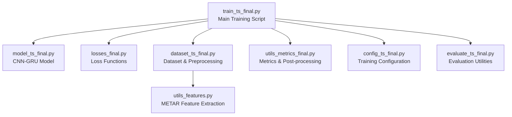
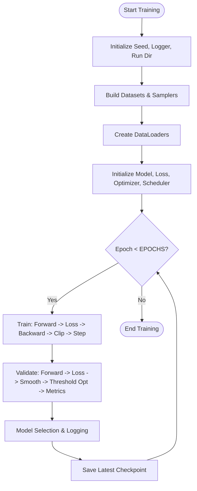
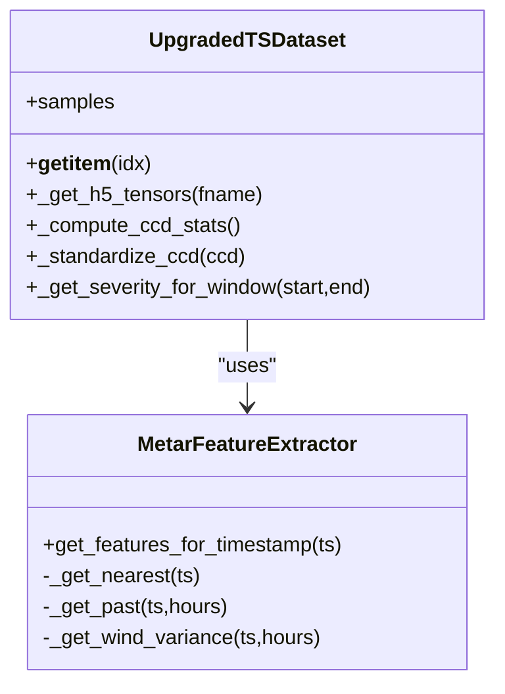
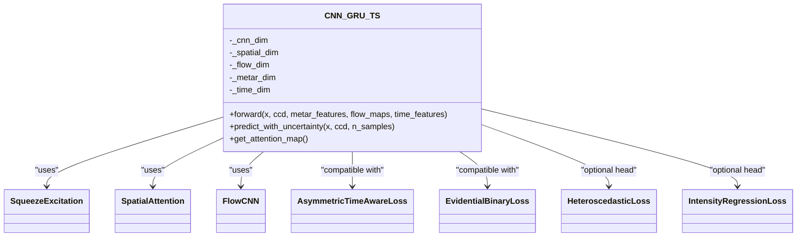
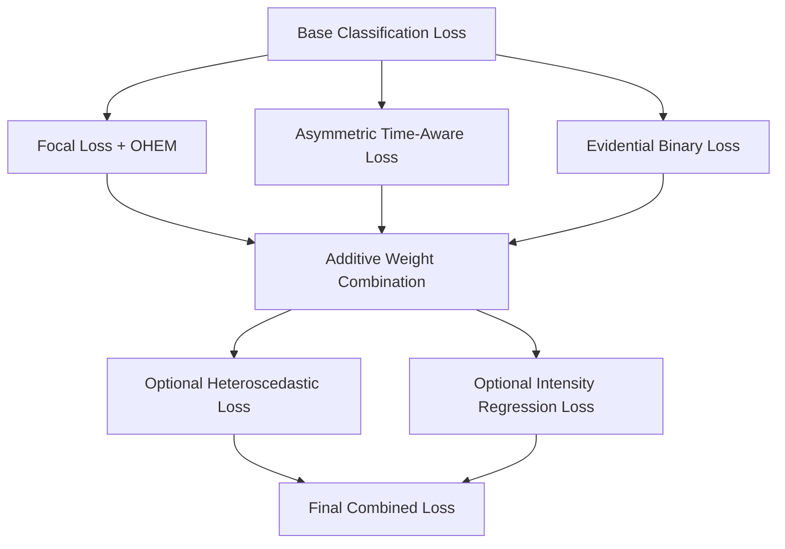
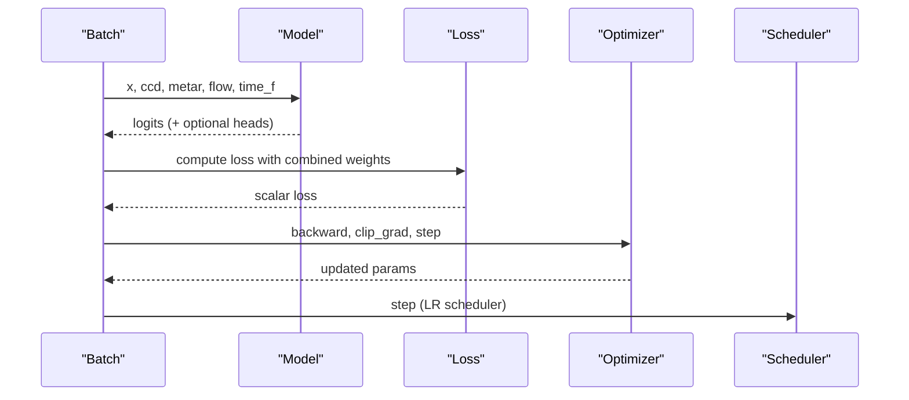
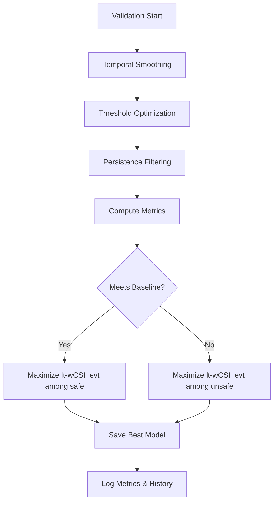
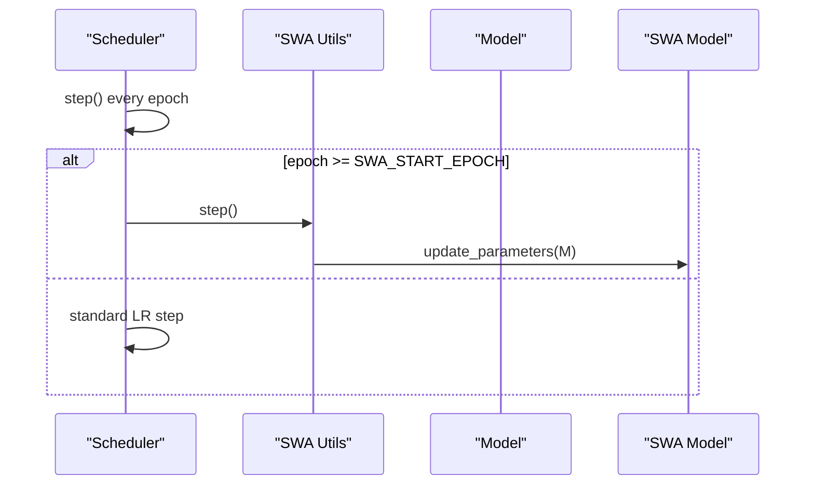
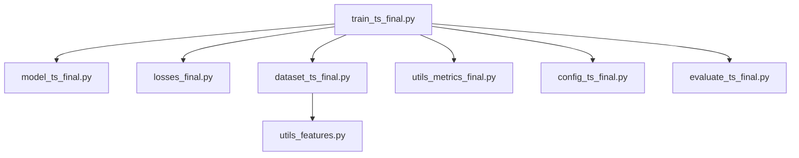

# Training Execution Flow

<cite>
**Referenced Files in This Document**
- [train_ts_final.py](file://train_ts_final.py)
- [model_ts_final.py](file://model_ts_final.py)
- [losses_final.py](file://losses_final.py)
- [dataset_ts_final.py](file://dataset_ts_final.py)
- [utils_metrics_final.py](file://utils_metrics_final.py)
- [config_ts_final.py](file://config_ts_final.py)
- [evaluate_ts_final.py](file://evaluate_ts_final.py)
- [utils_features.py](file://utils_features.py)
</cite>

## Table of Contents
1. [Introduction](#introduction)
2. [Project Structure](#project-structure)
3. [Core Components](#core-components)
4. [Architecture Overview](#architecture-overview)
5. [Detailed Component Analysis](#detailed-component-analysis)
6. [Dependency Analysis](#dependency-analysis)
7. [Performance Considerations](#performance-considerations)
8. [Troubleshooting Guide](#troubleshooting-guide)
9. [Conclusion](#conclusion)
10. [Appendices](#appendices)

## Introduction
This document explains the complete training execution flow for the Nagpur TS Nowcasting system. It covers epoch-by-epoch processing, data loading, forward passes, loss computation, backward propagation, and validation cycles. It documents the training loop structure including batch processing, gradient clipping, optimizer updates, and learning rate scheduling. It also details the validation phase with threshold optimization, metric computation, and model selection criteria. The integration of multiple loss functions (Focal loss, Asymmetric time-aware loss, Evidential learning) and their additive combination strategy is explained, along with examples of training configurations, epoch monitoring, and performance tracking.

## Project Structure
The training pipeline is implemented as a single script orchestrating data loading, model definition, loss computation, optimizer/scheduler, and validation. Supporting modules provide model architecture, loss functions, dataset construction, and evaluation utilities.



**Diagram sources**
- [train_ts_final.py:142-769](file://train_ts_final.py#L142-L769)
- [model_ts_final.py:83-360](file://model_ts_final.py#L83-L360)
- [losses_final.py:13-280](file://losses_final.py#L13-L280)
- [dataset_ts_final.py:57-545](file://dataset_ts_final.py#L57-L545)
- [utils_metrics_final.py:14-760](file://utils_metrics_final.py#L14-L760)
- [config_ts_final.py:16-211](file://config_ts_final.py#L16-L211)
- [evaluate_ts_final.py:1-908](file://evaluate_ts_final.py#L1-L908)
- [utils_features.py:11-191](file://utils_features.py#L11-L191)

**Section sources**
- [train_ts_final.py:142-769](file://train_ts_final.py#L142-L769)
- [config_ts_final.py:16-211](file://config_ts_final.py#L16-L211)

## Core Components
- Training orchestration and logging: [train_ts_final.py](file://train_ts_final.py)
- Model architecture: [model_ts_final.py](file://model_ts_final.py)
- Loss functions: [losses_final.py](file://losses_final.py)
- Dataset and preprocessing: [dataset_ts_final.py](file://dataset_ts_final.py)
- Metrics and post-processing: [utils_metrics_final.py](file://utils_metrics_final.py)
- Configuration: [config_ts_final.py](file://config_ts_final.py)
- Evaluation utilities: [evaluate_ts_final.py](file://evaluate_ts_final.py)
- METAR feature extraction: [utils_features.py](file://utils_features.py)

**Section sources**
- [train_ts_final.py:142-769](file://train_ts_final.py#L142-L769)
- [model_ts_final.py:83-360](file://model_ts_final.py#L83-L360)
- [losses_final.py:13-280](file://losses_final.py#L13-L280)
- [dataset_ts_final.py:57-545](file://dataset_ts_final.py#L57-L545)
- [utils_metrics_final.py:14-760](file://utils_metrics_final.py#L14-L760)
- [config_ts_final.py:16-211](file://config_ts_final.py#L16-L211)
- [evaluate_ts_final.py:1-908](file://evaluate_ts_final.py#L1-L908)
- [utils_features.py:11-191](file://utils_features.py#L11-L191)

## Architecture Overview
The training pipeline follows a standard epoch-based loop with the following stages:
- Data preparation: time-based walk-forward splits, class-balanced sampling, pre-event soft labeling, and dynamic channel masking.
- Forward pass: model inference with optional uncertainty heads.
- Loss computation: primary classification loss plus optional auxiliary losses (heteroscedastic, intensity regression).
- Backward pass: gradient clipping and optimizer step.
- Validation: threshold optimization, temporal smoothing, persistence filtering, and comprehensive metrics computation.
- Model selection: operational baseline and weighted CSI selection criteria.
- Logging and checkpointing: per-epoch history, best model saving, and SWA integration.

```mermaid
sequenceDiagram
participant Trainer as "Training Loop"
participant Loader as "DataLoader"
participant Model as "CNN-GRU Model"
participant Loss as "Loss Functions"
participant Opt as "Optimizer/Scheduler"
participant Val as "Validation Metrics"
Trainer->>Loader : Iterate batches (train)
Loader-->>Trainer : Batch (x, ccd, flow, metar, time_f, y, ...)
Trainer->>Model : Forward pass
Model-->>Trainer : Logits (+ optional uncertainty/intensity)
Trainer->>Loss : Compute combined loss (additive)
Loss-->>Trainer : Scalar loss
Trainer->>Opt : Backward + clip_grad + step
Opt-->>Trainer : Updated parameters
Trainer->>Loader : Iterate batches (val)
Loader-->>Trainer : Batch (x, ccd, flow, metar, time_f, y, ...)
Trainer->>Model : Eval forward pass
Model-->>Trainer : Logits
Trainer->>Loss : Compute validation loss
Loss-->>Trainer : Scalar loss
Trainer->>Val : Threshold optimization + metrics
Val-->>Trainer : Performance metrics
Trainer->>Trainer : Model selection & logging
```

**Diagram sources**
- [train_ts_final.py:386-741](file://train_ts_final.py#L386-L741)
- [model_ts_final.py:222-293](file://model_ts_final.py#L222-L293)
- [losses_final.py:13-280](file://losses_final.py#L13-L280)
- [utils_metrics_final.py:192-314](file://utils_metrics_final.py#L192-L314)

## Detailed Component Analysis

### Training Orchestration and Epoch Loop
- Initialization: seed setting, logging, run directory creation, configuration loading.
- Data split: time-based walk-forward CV folds, optional sample indices.
- Pre-event labeling: ramp-up soft labels for positive windows.
- Class-balanced sampling: target positive rate with optional seasonal boosting.
- DataLoader creation: batched training/validation loaders with pinned memory.
- Model, loss, optimizer, scheduler initialization.
- Training loop:
  - Train mode, iterate batches, zero gradients, forward pass, compute combined loss, backward pass, gradient clipping, optimizer step.
  - Eval mode, iterate validation batches, compute validation loss, temporal smoothing, threshold optimization, persistence filtering, metrics computation.
  - Model selection: operational baseline and weighted CSI selection; save best model; early stopping on validation loss.
  - Checkpointing: save latest checkpoint every epoch; optional SWA update and batch norm update.



**Diagram sources**
- [train_ts_final.py:142-769](file://train_ts_final.py#L142-L769)

**Section sources**
- [train_ts_final.py:142-769](file://train_ts_final.py#L142-L769)

### Data Loading and Preprocessing
- Dataset construction: builds sequences from HDF5 files, computes labels over lead windows, severity classification, and optional intensity regression targets.
- Augmentation (training only): horizontal flip, temporal masking, channel dropout, Gaussian noise.
- Dynamic masking: spatial mask centered on station with optional upwind shift based on optical flow.
- METAR features: sequence-aware extraction with pressure drops, wind trends, and composite risk.
- Time features: monthly sine/cosine and solar zenith angle normalization.



**Diagram sources**
- [dataset_ts_final.py:367-545](file://dataset_ts_final.py#L367-L545)
- [utils_features.py:11-191](file://utils_features.py#L11-L191)

**Section sources**
- [dataset_ts_final.py:57-545](file://dataset_ts_final.py#L57-L545)
- [utils_features.py:11-191](file://utils_features.py#L11-L191)

### Model Architecture
- Backbone: MobileNetV2 adapted to dynamic input channels.
- Spatial skip connections with attention for localized heavy precipitation.
- Optical flow branch (optional) with lightweight CNN.
- METAR features projection with learnable scale.
- Time features projection (month).
- Feature projection to GRU input.
- GRU temporal module with attention pooling.
- Heads:
  - Primary: binary logits or evidential logits (2 channels per horizon).
  - Optional: aleatoric uncertainty (log-variance).
  - Optional: intensity regression head.
- Predictive uncertainty: evidential or Monte Carlo dropout fallback.



**Diagram sources**
- [model_ts_final.py:83-360](file://model_ts_final.py#L83-L360)
- [losses_final.py:144-280](file://losses_final.py#L144-L280)

**Section sources**
- [model_ts_final.py:83-360](file://model_ts_final.py#L83-L360)

### Loss Functions and Additive Combination
- Focal loss with late penalty and label smoothing.
- Asymmetric time-aware loss emphasizing misses and high-confidence false alarms.
- Evidential deep learning loss with KL regularization and optional decay penalty for decaying systems.
- Heteroscedastic loss for aleatoric uncertainty modeling.
- Intensity regression loss for continuous severity scoring.
- Additive combination strategy: base classification loss plus auxiliary losses with configurable weights; combined weighting for late detection and severity.



**Diagram sources**
- [losses_final.py:13-280](file://losses_final.py#L13-L280)
- [train_ts_final.py:418-448](file://train_ts_final.py#L418-L448)

**Section sources**
- [losses_final.py:13-280](file://losses_final.py#L13-L280)
- [train_ts_final.py:418-448](file://train_ts_final.py#L418-L448)

### Training Loop Details
- Batch processing: dynamic channel stacking, optional optical flow concatenation, METAR/time features, and optional intensity targets.
- Forward pass: model returns logits; optional uncertainty/log-variance/intensity depending on configuration.
- Loss computation: combined weighting for late detection and severity; optional OHEM for hard negatives.
- Backpropagation: gradient clipping, optimizer step, learning rate scheduling.
- Validation: identical forward pass and loss computation with temporal smoothing and threshold optimization.



**Diagram sources**
- [train_ts_final.py:390-453](file://train_ts_final.py#L390-L453)
- [model_ts_final.py:222-293](file://model_ts_final.py#L222-L293)
- [losses_final.py:13-280](file://losses_final.py#L13-L280)

**Section sources**
- [train_ts_final.py:390-453](file://train_ts_final.py#L390-L453)

### Validation Phase and Model Selection
- Threshold optimization: grid search over thresholds or dual thresholds for Schmitt trigger; supports weighted event metrics and lead-time bonuses.
- Temporal smoothing: exponential moving average or rolling mean.
- Persistence filtering: minimal event length enforcement; optional severe fast-track threshold.
- Metrics computation: frame metrics, event metrics, weighted event metrics, lead times, severity breakdown, short false alarm counting.
- Model selection criteria:
  - Operational baseline: weighted POD ≥ 0.60, early detection ≥ 0.40, weighted FAR ≤ 0.45.
  - Among safe models, maximize weighted CSI with lead-time bonus.
  - Among unsafe models, maximize weighted CSI with lead-time bonus.
- Early stopping: patience on validation loss.



**Diagram sources**
- [train_ts_final.py:523-673](file://train_ts_final.py#L523-L673)
- [utils_metrics_final.py:192-314](file://utils_metrics_final.py#L192-L314)

**Section sources**
- [train_ts_final.py:523-673](file://train_ts_final.py#L523-L673)
- [utils_metrics_final.py:192-314](file://utils_metrics_final.py#L192-L314)

### Learning Rate Scheduling and SWA
- Warmup cosine schedule: linear warmup followed by cosine decay.
- Stochastic Weight Averaging: optional averaging of model parameters after a start epoch; separate SWA scheduler and BN update.



**Diagram sources**
- [train_ts_final.py:80-94](file://train_ts_final.py#L80-L94)
- [train_ts_final.py:319-323](file://train_ts_final.py#L319-L323)
- [train_ts_final.py:735-740](file://train_ts_final.py#L735-L740)

**Section sources**
- [train_ts_final.py:80-94](file://train_ts_final.py#L80-L94)
- [train_ts_final.py:319-323](file://train_ts_final.py#L319-L323)
- [train_ts_final.py:735-740](file://train_ts_final.py#L735-L740)

## Dependency Analysis
The training script depends on:
- Model and loss modules for forward passes and loss computation.
- Dataset module for data loading and preprocessing.
- Metrics module for threshold optimization and evaluation.
- Configuration module for hyperparameters and flags.
- Evaluation utilities for post-training analysis.



**Diagram sources**
- [train_ts_final.py:30-41](file://train_ts_final.py#L30-L41)
- [dataset_ts_final.py:21-24](file://dataset_ts_final.py#L21-L24)
- [utils_features.py:11-191](file://utils_features.py#L11-L191)

**Section sources**
- [train_ts_final.py:30-41](file://train_ts_final.py#L30-L41)
- [dataset_ts_final.py:21-24](file://dataset_ts_final.py#L21-L24)

## Performance Considerations
- Gradient clipping: applied globally to stabilize training.
- Class-balanced sampling: target positive rate with optional seasonal boosting to address class imbalance.
- OHEM: online hard negative mining to focus on difficult negatives.
- SWA: optional averaging improves generalization; BN updated after training.
- Early stopping: prevents overfitting on validation loss.
- Temporal smoothing and persistence filtering: reduce false alarms and improve lead-time metrics.

[No sources needed since this section provides general guidance]

## Troubleshooting Guide
- Checkpoints: strict vs partial loading accommodates dynamic channel changes.
- CUDA availability: automatic fallback to CPU if CUDA is unavailable.
- Missing samples: validation of dataset build and split indices.
- Logging: Tee class ensures logs written to both console and file.
- SWA: custom BN update function handles model’s multi-argument signature.

**Section sources**
- [train_ts_final.py:335-379](file://train_ts_final.py#L335-L379)
- [train_ts_final.py:176-177](file://train_ts_final.py#L176-L177)
- [train_ts_final.py:204-209](file://train_ts_final.py#L204-L209)
- [train_ts_final.py:48-66](file://train_ts_final.py#L48-L66)
- [train_ts_final.py:99-136](file://train_ts_final.py#L99-L136)

## Conclusion
The Nagpur TS Nowcasting training pipeline integrates sophisticated loss strategies, temporal smoothing, and robust validation with operational model selection criteria. The additive combination of classification, uncertainty, and intensity losses enables flexible training across phases, while class-balanced sampling, OHEM, and SWA improve generalization. The validation workflow emphasizes weighted event metrics and lead-time constraints, aligning with operational aviation requirements.

[No sources needed since this section summarizes without analyzing specific files]

## Appendices

### Training Configuration Highlights
- Model: GRU with attention, dynamic channels, optional optical flow and METAR features.
- Training: warmup cosine LR, SWA, patience-based early stopping.
- Losses: Focal/asymmetric/evidential with additive combination; optional heteroscedastic and intensity regression.
- Post-processing: temporal smoothing, persistence filtering, threshold optimization.

**Section sources**
- [config_ts_final.py:16-211](file://config_ts_final.py#L16-L211)
- [train_ts_final.py:285-323](file://train_ts_final.py#L285-L323)
- [train_ts_final.py:418-448](file://train_ts_final.py#L418-L448)

### Example Training Commands
- Resume training from a checkpoint or run folder.
- Specify walk-forward CV fold for cross-validation.

**Section sources**
- [train_ts_final.py:142-146](file://train_ts_final.py#L142-L146)