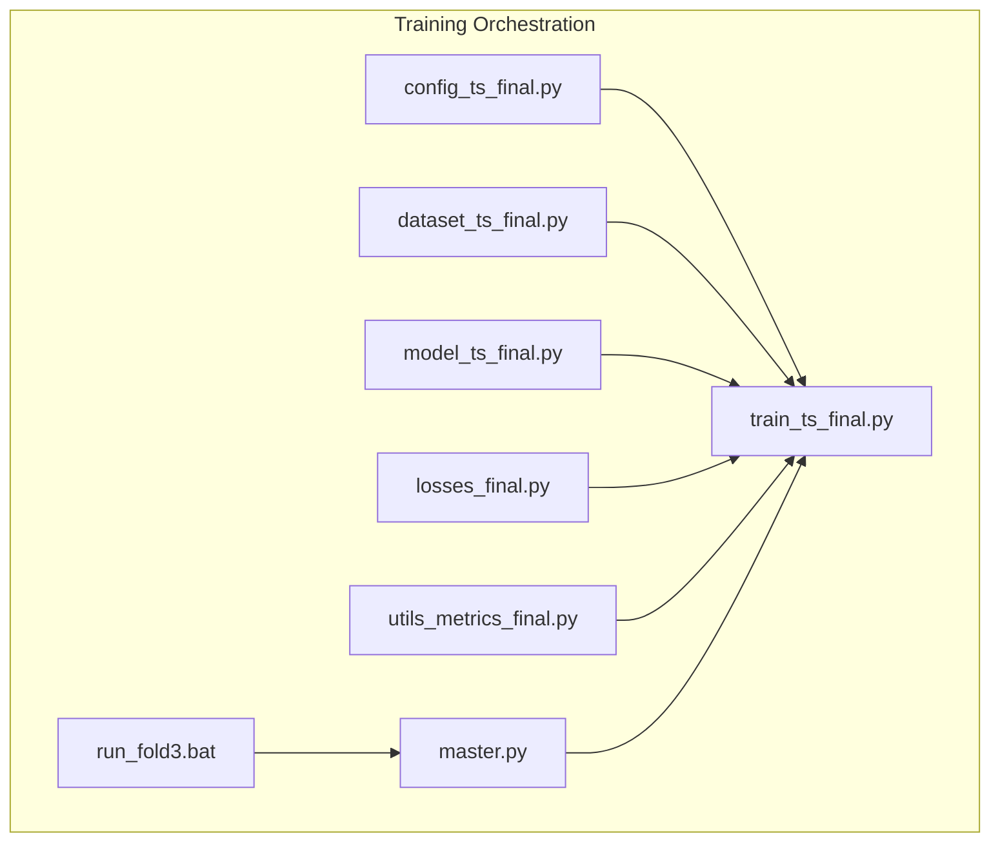
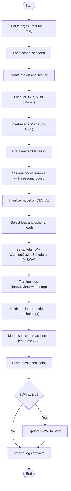
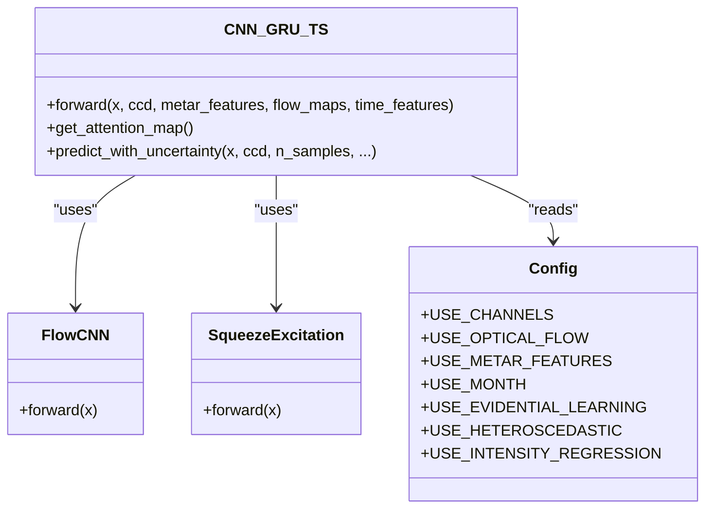
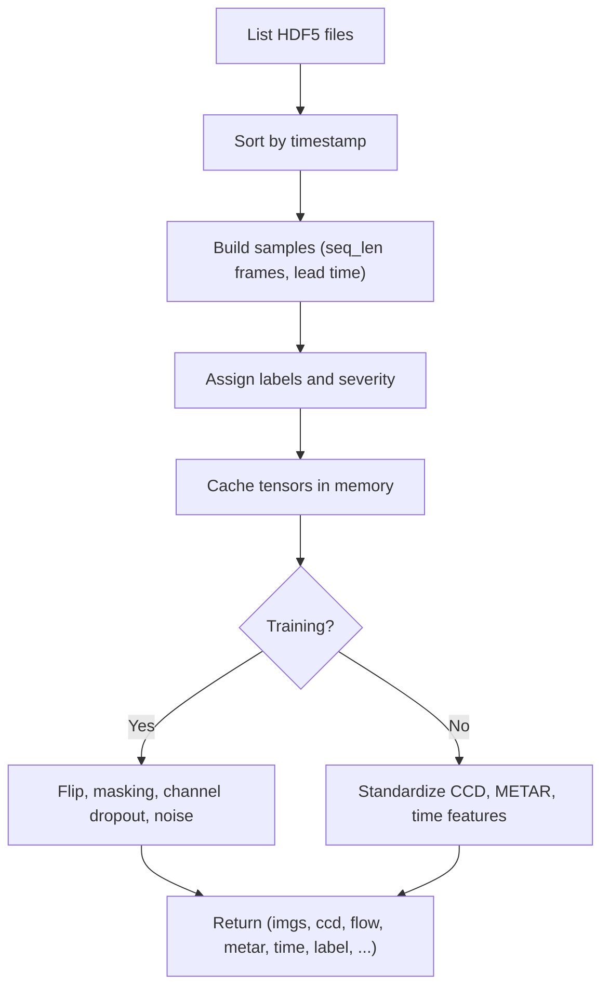
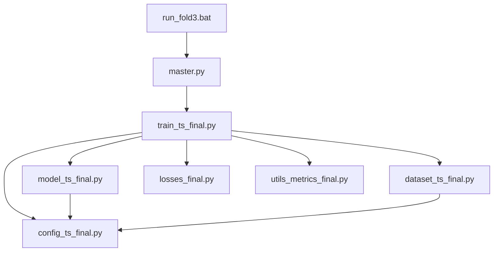

# Training Orchestration & Pipeline

<cite>
**Referenced Files in This Document**
- [train_ts_final.py](file://train_ts_final.py)
- [config_ts_final.py](file://config_ts_final.py)
- [model_ts_final.py](file://model_ts_final.py)
- [dataset_ts_final.py](file://dataset_ts_final.py)
- [losses_final.py](file://losses_final.py)
- [utils_metrics_final.py](file://utils_metrics_final.py)
- [master.py](file://master.py)
- [run_fold3.bat](file://run_fold3.bat)
</cite>

## Table of Contents
1. [Introduction](#introduction)
2. [Project Structure](#project-structure)
3. [Core Components](#core-components)
4. [Architecture Overview](#architecture-overview)
5. [Detailed Component Analysis](#detailed-component-analysis)
6. [Dependency Analysis](#dependency-analysis)
7. [Performance Considerations](#performance-considerations)
8. [Troubleshooting Guide](#troubleshooting-guide)
9. [Conclusion](#conclusion)
10. [Appendices](#appendices)

## Introduction
This document provides comprehensive documentation for the training orchestration system in train_ts_final.py. It explains the complete training pipeline including epoch management, validation cycles, checkpointing mechanisms, and model saving strategies. It documents the walk-forward cross-validation implementation with time-based splits for folds 1, 2, and 3, and details the training loop architecture including data loading, forward passes, backward propagation, and gradient updates. It covers resume functionality with checkpoint restoration, state dictionary loading, and training continuation. It also documents the logging system with the Tee class for dual console/file output, run directory management, and artifact organization. Training configuration management through config_ts_final.py, parameter validation, and runtime environment setup are addressed. Memory management, GPU utilization, and performance optimization strategies are included, along with examples of training commands, checkpoint inspection, and training progress monitoring.

## Project Structure
The training orchestration system is composed of several key modules:
- Training driver: train_ts_final.py orchestrates the entire pipeline, including data loading, model creation, loss computation, optimizer/scheduler setup, training/validation loops, checkpointing, and artifact management.
- Configuration: config_ts_final.py centralizes all hyperparameters, paths, and runtime settings.
- Model: model_ts_final.py defines the CNN-GRU architecture with dynamic channel adaptation, optical flow integration, METAR features, and optional uncertainty heads.
- Dataset: dataset_ts_final.py builds time-series samples from HDF5 files, applies pre-event labeling, and augments data during training.
- Losses: losses_final.py implements the primary loss (Focal with late penalty), optional asymmetric time-aware loss, evidential learning, temporal consistency, heteroscedastic, and intensity regression losses.
- Metrics: utils_metrics_final.py provides temporal smoothing, persistence filtering, threshold optimization, and comprehensive evaluation metrics.
- Pipeline controller: master.py coordinates multi-stage execution (training, evaluation, ensemble, ablation).
- Batch launcher: run_fold3.bat demonstrates how to run a specific fold in a controlled environment.



**Diagram sources**
- [train_ts_final.py:142-757](file://train_ts_final.py#L142-L757)
- [config_ts_final.py:16-208](file://config_ts_final.py#L16-L208)
- [model_ts_final.py:68-335](file://model_ts_final.py#L68-L335)
- [dataset_ts_final.py:47-515](file://dataset_ts_final.py#L47-L515)
- [losses_final.py:13-258](file://losses_final.py#L13-L258)
- [utils_metrics_final.py:1-200](file://utils_metrics_final.py#L1-L200)
- [master.py:1-108](file://master.py#L1-L108)
- [run_fold3.bat:1-16](file://run_fold3.bat#L1-L16)

**Section sources**
- [train_ts_final.py:142-757](file://train_ts_final.py#L142-L757)
- [config_ts_final.py:16-208](file://config_ts_final.py#L16-L208)
- [model_ts_final.py:68-335](file://model_ts_final.py#L68-L335)
- [dataset_ts_final.py:47-515](file://dataset_ts_final.py#L47-L515)
- [losses_final.py:13-258](file://losses_final.py#L13-L258)
- [utils_metrics_final.py:1-200](file://utils_metrics_final.py#L1-L200)
- [master.py:1-108](file://master.py#L1-L108)
- [run_fold3.bat:1-16](file://run_fold3.bat#L1-L16)

## Core Components
- Logging and seed management: The Tee class enables dual console and file logging; set_seed ensures reproducibility across CPU/GPU.
- Warmup cosine learning rate scheduler: Implements warmup followed by cosine decay.
- SWA batch norm update: Custom function to update batch norm statistics for SWA models.
- Main training function: Orchestrates data loading, time-based splits, sampler construction, model/loss/optimizer setup, training/validation loops, checkpointing, and artifact archival.
- Configuration: Centralized hyperparameters, paths, device selection, and feature toggles.
- Model: CNN-GRU with dynamic channel adaptation, spatial skip connections, optional optical flow, METAR features, and multiple heads.
- Dataset: HDF5-backed time-series dataset with pre-event labeling, severity computation, and augmentation.
- Losses: Focal loss with late penalty, optional asymmetric time-aware loss, evidential learning, temporal consistency, heteroscedastic, and intensity regression.
- Metrics: Temporal smoothing, persistence filtering, threshold optimization, and comprehensive evaluation metrics.

**Section sources**
- [train_ts_final.py:48-136](file://train_ts_final.py#L48-L136)
- [train_ts_final.py:142-757](file://train_ts_final.py#L142-L757)
- [config_ts_final.py:16-208](file://config_ts_final.py#L16-L208)
- [model_ts_final.py:68-335](file://model_ts_final.py#L68-L335)
- [dataset_ts_final.py:47-515](file://dataset_ts_final.py#L47-L515)
- [losses_final.py:13-258](file://losses_final.py#L13-L258)
- [utils_metrics_final.py:1-200](file://utils_metrics_final.py#L1-L200)

## Architecture Overview
The training pipeline follows a structured flow:
- Argument parsing and configuration initialization
- Run directory and logging setup
- Data loading and time-based walk-forward CV splits
- Class-balanced sampling with seasonal boosting
- Model, loss, optimizer, and scheduler instantiation
- Training loop with forward/backward/update steps
- Validation cycle with threshold optimization and metrics computation
- Model selection and checkpointing
- SWA update and final artifact archival

```mermaid
sequenceDiagram
participant CLI as "CLI"
participant Train as "train_ts_final.py"
participant DS as "UpgradedTSDataset"
participant Model as "CNN_GRU_TS"
participant Loss as "Loss Functions"
participant Opt as "Optimizer/Scheduler"
participant Eval as "Metrics Utils"
CLI->>Train : "python train_ts_final.py --fold X --resume PATH"
Train->>Train : "Load config, set seed, create run dir/log"
Train->>DS : "Build train/val subsets (time-based)"
Train->>Train : "Construct WeightedRandomSampler"
Train->>Model : "Initialize model on DEVICE"
Train->>Loss : "Select primary loss and optional heads"
Train->>Opt : "AdamW + WarmupCosineScheduler"
loop Epochs
Train->>Model : "Forward pass (train)"
Model-->>Train : "Logits/outputs"
Train->>Loss : "Compute loss with weights"
Train->>Opt : "Backward + clip_grad + step"
Train->>Model : "Forward pass (val)"
Model-->>Train : "Logits"
Train->>Eval : "Threshold optimization, smoothing, persistence"
Eval-->>Train : "Metrics (frame/event/severity/lead)"
Train->>Train : "Model selection, checkpointing"
Train->>Opt : "Step scheduler or SWA"
end
Train->>Train : "Archive logs/artifacts"
```

**Diagram sources**
- [train_ts_final.py:142-757](file://train_ts_final.py#L142-L757)
- [dataset_ts_final.py:47-515](file://dataset_ts_final.py#L47-L515)
- [model_ts_final.py:68-335](file://model_ts_final.py#L68-L335)
- [losses_final.py:13-258](file://losses_final.py#L13-L258)
- [utils_metrics_final.py:1-200](file://utils_metrics_final.py#L1-L200)

## Detailed Component Analysis

### Training Orchestration Engine (train_ts_final.py)
- Logging and seed management: Tee class writes to both console and file; set_seed initializes seeds for deterministic runs.
- WarmupCosineScheduler: Implements warmup phase followed by cosine decay.
- SWA batch norm update: custom_update_bn resets BN stats and recomputes them on the training loader.
- Main function:
  - Argument parsing for resume path and fold selection.
  - Run directory creation and log redirection via Tee.
  - Data loading with METAR features and dataset construction.
  - Time-based walk-forward CV splits for folds 1, 2, and 3.
  - Pre-event soft labeling ramp-up and class-balanced sampling with seasonal boosting.
  - Model initialization, loss selection, optimizer/scheduler setup, and optional SWA.
  - Training loop: forward, loss, backward, gradient clipping, optimizer step.
  - Validation loop: forward, weighted loss, threshold optimization, temporal smoothing, persistence filtering, and comprehensive metrics computation.
  - Model selection: among epochs meeting baseline criteria, maximize lead-time weighted CSI; otherwise select best unsafe model.
  - Checkpointing: save latest checkpoint every epoch; save best model copies in run and main output directories; save SWA model if applicable.
  - Artifact archival: copy logs and predictions CSV to run directory.



**Diagram sources**
- [train_ts_final.py:142-757](file://train_ts_final.py#L142-L757)

**Section sources**
- [train_ts_final.py:48-136](file://train_ts_final.py#L48-L136)
- [train_ts_final.py:142-757](file://train_ts_final.py#L142-L757)

### Configuration Management (config_ts_final.py)
- Paths: DATA_DIR, PRECOMPUTED_DIR, METAR_FILE, CCD_FILE, MODEL_OUT, LOG_DIR, CACHE_DIR.
- Architecture: HIDDEN_DIM, NUM_LAYERS, DROPOUT, SEQ_LEN, LEAD, FREEZE_BACKBONE_UNTIL, USE_CHANNELS.
- Optical Flow: USE_OPTICAL_FLOW, FLOW_METHOD.
- Training: EPOCHS, BATCH_SIZE, LEARNING_RATE, WEIGHT_DECAY, PATIENCE, USE_SWA, SWA_START_EPOCH.
- Augmentation: AUG_CHANNEL_DROPOUT, AUG_NOISE_PROB, AUG_GAUSSIAN_NOISE.
- Seasonal Boost: SEASONAL_BOOST mapping seasons to sampling weights.
- Losses: GAMMA, ALPHA, POS_WEIGHT_FACTOR, LATE_PENALTY_WEIGHT, LABEL_SMOOTHING, USE_ASYMMETRIC_LOSS, USE_EVIDENTIAL_LEARNING, LAMBDA_TC, HETEROSCEDASTIC_WEIGHT, USE_HETEROSCEDASTIC, USE_INTENSITY_REGRESSION, LAMBDA_REGRESSION.
- Labeling: PRE_EVENT_WINDOW.
- Post-processing: SMOOTH_WINDOW, SMOOTH_METHOD, PERSISTENCE_MIN_LEN, MAX_LEAD_MINUTES, THRESHOLD_METRIC, MIN_THRESHOLD, USE_SCHMITT_TRIGGER, SEVERITY_WEIGHTS.
- Spatial: MASK_CENTER, MASK_SIGMA, STATION_RADIUS_PX, USE_MASK, USE_CCD, USE_MONTH.
- METAR: USE_METAR_FEATURES, METAR_FEATURE_WINDOWS, METAR_WEIGHT, SAMPLER_POS_RATE, OHEM_RATIO.
- Calibration and MC Dropout: USE_PLATT_SCALING, USE_MC_DROPOUT, MC_DROPOUT_SAMPLES, MC_UNCERTAINTY_THRESHOLD.
- Sample dataset: USE_SAMPLE, TRAIN_SAMPLE_IDX, VAL_SAMPLE_IDX.
- Time split: TRAIN_END, VAL_END.
- Misc: SEED, DEVICE, CACHE_DIR.

**Section sources**
- [config_ts_final.py:16-208](file://config_ts_final.py#L16-L208)

### Model Architecture (model_ts_final.py)
- CNN backbone: MobileNetV2 with dynamic first-layer adaptation to support varying input channels.
- Spatial skip connection: Low-resolution grid features concatenated with CNN features.
- Optical Flow branch: Lightweight FlowCNN extracting 2D features from flow maps.
- METAR features: Linear projection and learnable scaling parameter.
- Time features: Monthly sine/cosine plus solar zenith normalization.
- Feature projection: Concatenated features projected to GRU input size.
- GRU temporal module: Temporal fusion with attention mechanism.
- Heads:
  - Primary: Binary probability or evidential (2-class logits).
  - Optional: Aleatoric uncertainty (log-variance) for heteroscedastic loss.
  - Optional: Intensity regression head for continuous severity score.
- Attention weights stored for interpretability.



**Diagram sources**
- [model_ts_final.py:68-335](file://model_ts_final.py#L68-L335)
- [config_ts_final.py:16-208](file://config_ts_final.py#L16-L208)

**Section sources**
- [model_ts_final.py:68-335](file://model_ts_final.py#L68-L335)
- [config_ts_final.py:16-208](file://config_ts_final.py#L16-L208)

### Dataset and Data Loading (dataset_ts_final.py)
- IRSequenceDataset: Builds time-series samples from HDF5 files, computes storm events, and assigns labels/severity.
- UpgradedTSDataset: Extends base dataset with dynamic channel stacking, CCD standardization, METAR feature extraction, time features, and augmentation during training.
- Pre-event labeling: apply_pre_event_labeling_time ramps up soft labels before actual TS events.
- File caching: OrderedDict-based cache for HDF5 tensors to reduce I/O overhead.
- Dynamic upwind mask: Adjusts mask center based on flow-derived offsets.



**Diagram sources**
- [dataset_ts_final.py:47-515](file://dataset_ts_final.py#L47-L515)

**Section sources**
- [dataset_ts_final.py:47-515](file://dataset_ts_final.py#L47-L515)

### Loss Functions (losses_final.py)
- FocalLossWithLatePenalty: Soft-label friendly focal loss with label smoothing, alpha balancing, and optional OHEM for hard negatives.
- AsymmetricTimeAwareLoss: Asymmetric penalties for misses vs false alarms, with anticipation reward for early triggers.
- EvidentialBinaryLoss: EDL loss for probabilistic modeling with KL regularization and optional asymmetric weighting.
- HeteroscedasticLoss: Aleatoric uncertainty-aware BCE with precision weighting.
- TemporalConsistencyLoss: Deprecated; scientific invalidity noted in comments.
- IntensityRegressionLoss: Huber loss for continuous severity score prediction.

**Section sources**
- [losses_final.py:13-258](file://losses_final.py#L13-L258)

### Metrics and Post-Processing (utils_metrics_final.py)
- temporal_smooth_probs: Exponential moving average or rolling mean smoothing for temporal sequences.
- apply_persistence: Removes short-lived false alarms by enforcing minimum run lengths; supports severe-threshold bypass.
- find_best_threshold: Grid search over thresholds to optimize a chosen metric (e.g., lead-time weighted CSI).
- compute_binary_metrics: Computes POD, FAR, CSI, ETS, SEDI, F1, F2 from thresholded predictions.
- Event and severity metrics: Weighted event metrics, lead-time analysis, and breakdown by severity categories.

**Section sources**
- [utils_metrics_final.py:1-200](file://utils_metrics_final.py#L1-L200)

### Pipeline Orchestration (master.py)
- Coordinates multi-stage execution: training, evaluation of best and SWA models, ensemble evaluation, and ablation study.
- Supports delay execution and fold selection.
- Invokes scripts with subprocess and captures timing.

**Section sources**
- [master.py:1-108](file://master.py#L1-L108)

### Batch Launcher (run_fold3.bat)
- Demonstrates environment activation and invoking the master pipeline for fold 3.

**Section sources**
- [run_fold3.bat:1-16](file://run_fold3.bat#L1-L16)

## Dependency Analysis
The training orchestration exhibits strong cohesion around the training loop and loose coupling with external modules:
- train_ts_final.py depends on config_ts_final.py for runtime settings, dataset_ts_final.py for data loading, model_ts_final.py for model definition, losses_final.py for loss computation, and utils_metrics_final.py for evaluation.
- model_ts_final.py depends on torchvision models and config_ts_final.py for feature toggles.
- dataset_ts_final.py depends on HDF5, METAR features, and spatial utilities.
- losses_final.py is standalone with minimal dependencies.
- utils_metrics_final.py provides pure functions for metrics and post-processing.
- master.py orchestrates script execution and depends on train_ts_final.py indirectly via subprocess.



**Diagram sources**
- [train_ts_final.py:142-757](file://train_ts_final.py#L142-L757)
- [config_ts_final.py:16-208](file://config_ts_final.py#L16-L208)
- [model_ts_final.py:68-335](file://model_ts_final.py#L68-L335)
- [dataset_ts_final.py:47-515](file://dataset_ts_final.py#L47-L515)
- [losses_final.py:13-258](file://losses_final.py#L13-L258)
- [utils_metrics_final.py:1-200](file://utils_metrics_final.py#L1-L200)
- [master.py:1-108](file://master.py#L1-L108)
- [run_fold3.bat:1-16](file://run_fold3.bat#L1-L16)

**Section sources**
- [train_ts_final.py:142-757](file://train_ts_final.py#L142-L757)
- [config_ts_final.py:16-208](file://config_ts_final.py#L16-L208)
- [model_ts_final.py:68-335](file://model_ts_final.py#L68-L335)
- [dataset_ts_final.py:47-515](file://dataset_ts_final.py#L47-L515)
- [losses_final.py:13-258](file://losses_final.py#L13-L258)
- [utils_metrics_final.py:1-200](file://utils_metrics_final.py#L1-L200)
- [master.py:1-108](file://master.py#L1-L108)
- [run_fold3.bat:1-16](file://run_fold3.bat#L1-L16)

## Performance Considerations
- GPU utilization: Device selection is automatic based on torch availability; ensure CUDA-capable hardware for optimal speed.
- Memory management: HDF5 caching reduces I/O; adjust MAX_CACHE_SIZE in dataset configuration to balance memory and speed. Consider pinning memory in DataLoader for faster transfers.
- Gradient clipping: Applied with a fixed norm to stabilize training.
- Early stopping: Based on validation loss to prevent overfitting.
- SWA: Improves generalization; custom BN update ensures accurate statistics.
- Data loading: num_workers=2 and pin_memory=True improve throughput.
- Post-processing: Temporal smoothing and persistence filtering reduce false alarms while preserving detection quality.

[No sources needed since this section provides general guidance]

## Troubleshooting Guide
- No samples found: If the dataset directory contains no .h5 files, the training aborts with a critical error message.
- Checkpoint loading failures: The training attempts strict load first, then falls back to partial load if channel counts differ.
- SWA state loading: If SWA state fails to load cleanly, the system resets SWA components.
- Logging issues: Tee class flushes both stdout and file streams; ensure write permissions in LOG_DIR.
- Resume path resolution: If a directory is passed, the script resolves the latest checkpoint automatically.

**Section sources**
- [train_ts_final.py:206-208](file://train_ts_final.py#L206-L208)
- [train_ts_final.py:337-378](file://train_ts_final.py#L337-L378)
- [train_ts_final.py:370-378](file://train_ts_final.py#L370-L378)
- [train_ts_final.py:167-169](file://train_ts_final.py#L167-L169)

## Conclusion
The training orchestration system integrates a robust pipeline for time-series nowcasting with careful attention to data management, model architecture, loss design, and evaluation metrics. The walk-forward cross-validation ensures temporal validity, while class-balanced sampling and pre-event labeling address class imbalance and temporal dynamics. The logging, checkpointing, and artifact management facilitate reproducible experiments and operational deployment. The modular design allows easy configuration tuning and extension for future enhancements.

[No sources needed since this section summarizes without analyzing specific files]

## Appendices

### Training Commands and Examples
- Train a specific fold: python train_ts_final.py --fold 3
- Resume from checkpoint: python train_ts_final.py --resume path/to/checkpoint.pth
- Resume from run directory: python train_ts_final.py --resume path/to/run_folder
- Master pipeline for fold 3: python master.py --fold 3
- Batch launcher for fold 3: run_fold3.bat

**Section sources**
- [train_ts_final.py:144-146](file://train_ts_final.py#L144-L146)
- [master.py:42-43](file://master.py#L42-L43)
- [run_fold3.bat:13](file://run_fold3.bat#L13)

### Checkpoint Inspection and Monitoring
- Latest checkpoint: run_dir/checkpoint_latest.pth
- Best model (per fold): run_dir/best_model_fold_X.pth and MODEL_OUT copied to main output directory
- SWA model: run_dir/swa_model_fold_X.pth
- Validation predictions CSV: logs/val_predictions_<run_timestamp>.csv and run_dir/val_predictions_<run_timestamp>.csv
- Training history JSON: logs/train_history_<timestamp>.json

**Section sources**
- [train_ts_final.py:664-692](file://train_ts_final.py#L664-L692)
- [train_ts_final.py:735-741](file://train_ts_final.py#L735-L741)
- [train_ts_final.py:380-381](file://train_ts_final.py#L380-L381)
- [train_ts_final.py:681-692](file://train_ts_final.py#L681-L692)

### Walk-Forward Cross-Validation Implementation
- Fold 1: Train end date 2025-03-01, Val end date 2025-05-01
- Fold 2: Train end date 2025-05-01, Val end date 2025-07-01
- Fold 3: Train end date from config.TRAIN_END, Val end date from config.VAL_END
- Time-based split ensures temporal order and prevents leakage.

**Section sources**
- [train_ts_final.py:214-222](file://train_ts_final.py#L214-L222)
- [config_ts_final.py:183-186](file://config_ts_final.py#L183-L186)

### Training Loop Architecture Details
- Data loading: DataLoader with WeightedRandomSampler, num_workers=2, pin_memory=True.
- Forward pass: model(x, ccd, metar_features, flow_maps, time_features) returns logits and optional outputs.
- Loss computation: Primary loss with combined weights (late penalty + severity), optional heteroscedastic and intensity regression losses.
- Backward propagation: loss.backward() with gradient norm clipping.
- Gradient updates: optimizer.step() after zeroing gradients.
- Validation: Same forward pass with threshold optimization and temporal smoothing.

**Section sources**
- [train_ts_final.py:282-283](file://train_ts_final.py#L282-L283)
- [train_ts_final.py:403-447](file://train_ts_final.py#L403-L447)
- [train_ts_final.py:463-466](file://train_ts_final.py#L463-L466)

### Resume Functionality
- Loads model, optimizer, scheduler, and SWA states from checkpoint.
- Handles partial state dict loading when channel counts differ.
- Restarts from the next epoch after the saved checkpoint.

**Section sources**
- [train_ts_final.py:337-378](file://train_ts_final.py#L337-L378)

### Logging System
- Tee class: Dual console/file output with flush handling.
- Run directory: Created per run with timestamp; logs archived upon completion.
- Artifacts: Logs and predictions CSV copied to run directory for traceability.

**Section sources**
- [train_ts_final.py:48-66](file://train_ts_final.py#L48-L66)
- [train_ts_final.py:167-169](file://train_ts_final.py#L167-L169)
- [train_ts_final.py:746-754](file://train_ts_final.py#L746-L754)

### Configuration Management
- Centralized parameters for data paths, model architecture, training, losses, post-processing, spatial masks, METAR features, and sample datasets.
- Runtime environment setup: automatic device selection, seed initialization, and path validation helpers.

**Section sources**
- [config_ts_final.py:16-208](file://config_ts_final.py#L16-L208)