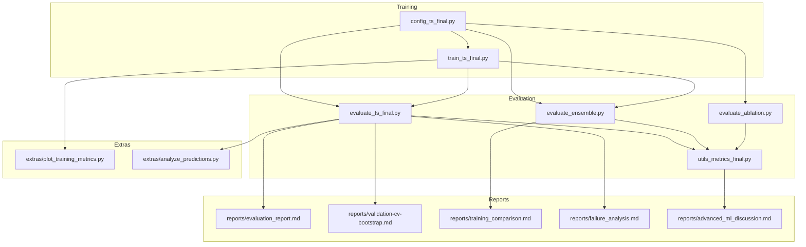
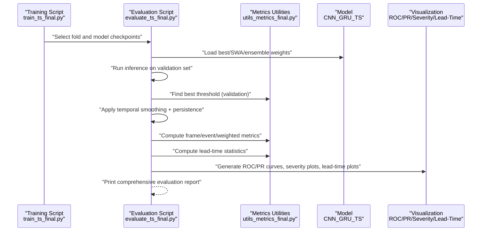
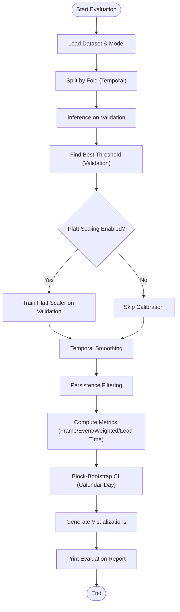
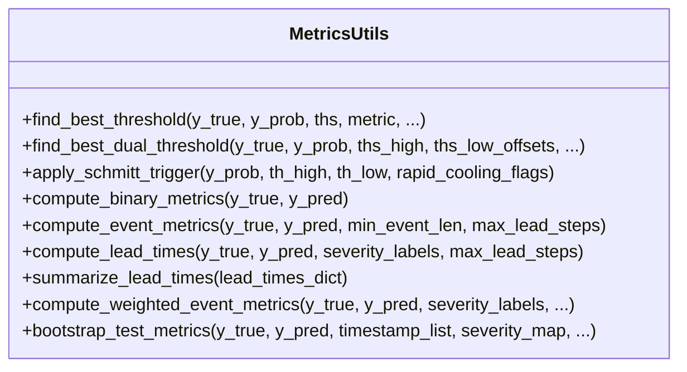
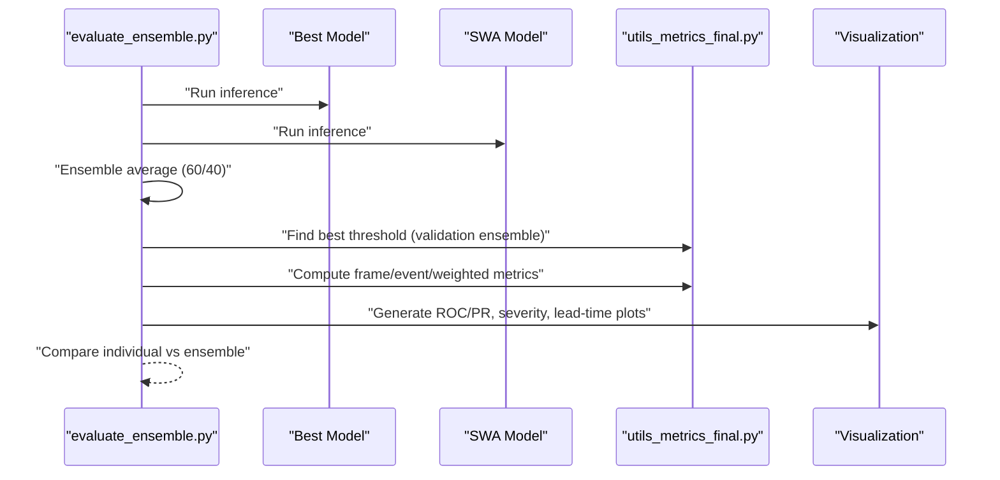
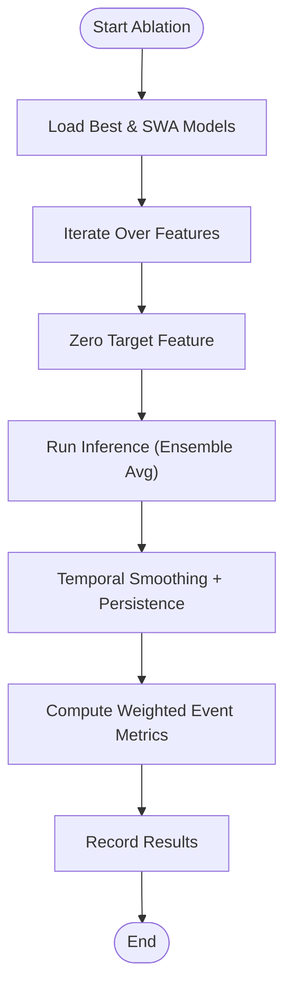
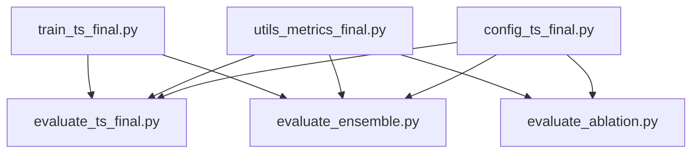

# Evaluation Reports

<cite>
**Referenced Files in This Document**
- [evaluate_ts_final.py](file://evaluate_ts_final.py)
- [utils_metrics_final.py](file://utils_metrics_final.py)
- [evaluate_ensemble.py](file://evaluate_ensemble.py)
- [evaluate_ablation.py](file://evaluate_ablation.py)
- [config_ts_final.py](file://config_ts_final.py)
- [train_ts_final.py](file://train_ts_final.py)
- [reports/evaluation_report.md](file://reports/evaluation_report.md)
- [reports/validation-cv-bootstrap.md](file://reports/validation-cv-bootstrap.md)
- [reports/training_comparison.md](file://reports/training_comparison.md)
- [reports/failure_analysis.md](file://reports/failure_analysis.md)
- [reports/advanced_ml_discussion.md](file://reports/advanced_ml_discussion.md)
- [extras/plot_training_metrics.py](file://extras/plot_training_metrics.py)
- [extras/analyze_predictions.py](file://extras/analyze_predictions.py)
</cite>

## Table of Contents
1. [Introduction](#introduction)
2. [Project Structure](#project-structure)
3. [Core Components](#core-components)
4. [Architecture Overview](#architecture-overview)
5. [Detailed Component Analysis](#detailed-component-analysis)
6. [Dependency Analysis](#dependency-analysis)
7. [Performance Considerations](#performance-considerations)
8. [Troubleshooting Guide](#troubleshooting-guide)
9. [Conclusion](#conclusion)
10. [Appendices](#appendices)

## Introduction
This document presents a comprehensive evaluation report framework tailored for the Nagpur TS nowcasting project. It consolidates model performance assessment methodologies, statistical analysis frameworks, and comparative benchmarking results. The report structure covers accuracy metrics, precision-recall analysis, ROC curves, and threshold optimization techniques. It also documents training evaluation processes including walk-forward temporal cross-validation, block-bootstrap confidence intervals, and statistical significance testing. Validation comparison frameworks demonstrate performance consistency across datasets and time periods. Guidance is provided for interpreting evaluation results, understanding model reliability, and making evidence-based decisions about model deployment. Finally, it outlines report generation automation, visualization best practices, and stakeholder communication strategies for both technical and non-technical audiences.

## Project Structure
The evaluation ecosystem integrates training, evaluation, and reporting components:
- Training pipeline with walk-forward temporal cross-validation and model selection criteria
- Evaluation scripts for single and ensemble models, including threshold optimization and visualization
- Metrics utilities for frame/event/weighted metrics, lead-time statistics, and bootstrapping
- Reporting artifacts and notebooks for model comparisons and failure analysis
- Auxiliary tools for training dashboard visualization and prediction CSV analysis

**Diagram sources**
- [train_ts_final.py:142-200](file://train_ts_final.py#L142-L200)
- [evaluate_ts_final.py:361-800](file://evaluate_ts_final.py#L361-L800)
- [evaluate_ensemble.py:84-361](file://evaluate_ensemble.py#L84-L361)
- [evaluate_ablation.py:172-307](file://evaluate_ablation.py#L172-L307)
- [utils_metrics_final.py:653-760](file://utils_metrics_final.py#L653-L760)
- [config_ts_final.py:16-200](file://config_ts_final.py#L16-L200)
- [reports/evaluation_report.md:1-58](file://reports/evaluation_report.md#L1-L58)
- [reports/validation-cv-bootstrap.md:1-89](file://reports/validation-cv-bootstrap.md#L1-L89)
- [reports/training_comparison.md:1-153](file://reports/training_comparison.md#L1-L153)
- [reports/failure_analysis.md:1-71](file://reports/failure_analysis.md#L1-L71)
- [reports/advanced_ml_discussion.md:1-305](file://reports/advanced_ml_discussion.md#L1-L305)
- [extras/plot_training_metrics.py:278-464](file://extras/plot_training_metrics.py#L278-L464)
- [extras/analyze_predictions.py:1-64](file://extras/analyze_predictions.py#L1-L64)

**Section sources**
- [train_ts_final.py:142-200](file://train_ts_final.py#L142-L200)
- [evaluate_ts_final.py:361-800](file://evaluate_ts_final.py#L361-L800)
- [evaluate_ensemble.py:84-361](file://evaluate_ensemble.py#L84-L361)
- [evaluate_ablation.py:172-307](file://evaluate_ablation.py#L172-L307)
- [utils_metrics_final.py:653-760](file://utils_metrics_final.py#L653-L760)
- [config_ts_final.py:16-200](file://config_ts_final.py#L16-L200)
- [reports/evaluation_report.md:1-58](file://reports/evaluation_report.md#L1-L58)
- [reports/validation-cv-bootstrap.md:1-89](file://reports/validation-cv-bootstrap.md#L1-L89)
- [reports/training_comparison.md:1-153](file://reports/training_comparison.md#L1-L153)
- [reports/failure_analysis.md:1-71](file://reports/failure_analysis.md#L1-L71)
- [reports/advanced_ml_discussion.md:1-305](file://reports/advanced_ml_discussion.md#L1-L305)
- [extras/plot_training_metrics.py:278-464](file://extras/plot_training_metrics.py#L278-L464)
- [extras/analyze_predictions.py:1-64](file://extras/analyze_predictions.py#L1-L64)

## Core Components
This section outlines the evaluation components and their roles:
- Evaluation pipeline: Loads models, computes thresholds on validation sets, evaluates on test sets, and prints comprehensive metrics including ROC-AUC, PR-AUC, frame/event/weighted metrics, and lead-time statistics.
- Metrics utilities: Provides threshold optimization, persistence filtering, event-level metrics, lead-time computations, weighted metrics, and block-bootstrapping for confidence intervals.
- Ensemble evaluation: Averages predictions from best and SWA models, compares individual and ensemble performance, and visualizes ROC/PR curves and severity breakdowns.
- Ablation study: Tests the contribution of each input feature by zeroing it out and measuring weighted event-level metrics.
- Configuration: Centralizes hyperparameters, post-processing settings, and selection criteria for threshold optimization and model selection.
- Training pipeline: Implements walk-forward temporal cross-validation and uses weighted event metrics for model selection.

**Section sources**
- [evaluate_ts_final.py:361-800](file://evaluate_ts_final.py#L361-L800)
- [utils_metrics_final.py:192-315](file://utils_metrics_final.py#L192-L315)
- [utils_metrics_final.py:338-478](file://utils_metrics_final.py#L338-L478)
- [utils_metrics_final.py:575-651](file://utils_metrics_final.py#L575-L651)
- [utils_metrics_final.py:653-760](file://utils_metrics_final.py#L653-L760)
- [evaluate_ensemble.py:84-361](file://evaluate_ensemble.py#L84-L361)
- [evaluate_ablation.py:172-307](file://evaluate_ablation.py#L172-L307)
- [config_ts_final.py:88-136](file://config_ts_final.py#L88-L136)
- [train_ts_final.py:142-200](file://train_ts_final.py#L142-L200)

## Architecture Overview
The evaluation architecture integrates training and evaluation phases with robust metrics and visualization:

**Diagram sources**
- [train_ts_final.py:142-200](file://train_ts_final.py#L142-L200)
- [evaluate_ts_final.py:361-800](file://evaluate_ts_final.py#L361-L800)
- [utils_metrics_final.py:192-315](file://utils_metrics_final.py#L192-L315)
- [utils_metrics_final.py:338-478](file://utils_metrics_final.py#L338-L478)
- [utils_metrics_final.py:575-651](file://utils_metrics_final.py#L575-L651)

## Detailed Component Analysis

### Evaluation Pipeline (evaluate_ts_final.py)
The evaluation pipeline orchestrates:
- Loading datasets and models
- Walk-forward temporal cross-validation folds
- Threshold optimization on validation sets
- Platt scaling calibration
- Temporal smoothing and persistence filtering
- Comprehensive metric computation (frame, event, weighted, lead-time)
- Bootstrapped confidence intervals
- Visualization generation

**Diagram sources**
- [evaluate_ts_final.py:361-800](file://evaluate_ts_final.py#L361-L800)
- [utils_metrics_final.py:653-760](file://utils_metrics_final.py#L653-L760)

**Section sources**
- [evaluate_ts_final.py:361-800](file://evaluate_ts_final.py#L361-L800)
- [utils_metrics_final.py:653-760](file://utils_metrics_final.py#L653-L760)

### Metrics Utilities (utils_metrics_final.py)
Key capabilities include:
- Threshold optimization with configurable metrics (F1/F2/ETS/SEDI/wCSI_evt/lt-wCSI_evt/wPOD_evt)
- Dual-threshold Schmitt trigger for hysteresis
- Event-level metrics with overlap-based matching and lead-time constraints
- Lead-time computation and summarization
- Weighted event metrics incorporating severity and lead-time bonuses
- Bootstrapped confidence intervals for test metrics

**Diagram sources**
- [utils_metrics_final.py:192-315](file://utils_metrics_final.py#L192-L315)
- [utils_metrics_final.py:338-478](file://utils_metrics_final.py#L338-L478)
- [utils_metrics_final.py:575-651](file://utils_metrics_final.py#L575-L651)
- [utils_metrics_final.py:653-760](file://utils_metrics_final.py#L653-L760)

**Section sources**
- [utils_metrics_final.py:192-315](file://utils_metrics_final.py#L192-L315)
- [utils_metrics_final.py:338-478](file://utils_metrics_final.py#L338-L478)
- [utils_metrics_final.py:575-651](file://utils_metrics_final.py#L575-L651)
- [utils_metrics_final.py:653-760](file://utils_metrics_final.py#L653-L760)

### Ensemble Evaluation (evaluate_ensemble.py)
The ensemble evaluation averages predictions from best and SWA models, compares individual and ensemble performance, and visualizes ROC/PR curves and severity breakdowns.

**Diagram sources**
- [evaluate_ensemble.py:84-361](file://evaluate_ensemble.py#L84-L361)
- [utils_metrics_final.py:192-315](file://utils_metrics_final.py#L192-L315)
- [utils_metrics_final.py:338-478](file://utils_metrics_final.py#L338-L478)
- [utils_metrics_final.py:575-651](file://utils_metrics_final.py#L575-L651)

**Section sources**
- [evaluate_ensemble.py:84-361](file://evaluate_ensemble.py#L84-L361)
- [utils_metrics_final.py:192-315](file://utils_metrics_final.py#L192-L315)
- [utils_metrics_final.py:338-478](file://utils_metrics_final.py#L338-L478)
- [utils_metrics_final.py:575-651](file://utils_metrics_final.py#L575-L651)

### Ablation Study (evaluate_ablation.py)
The ablation study evaluates the contribution of each input feature by zeroing it out and measuring weighted event-level metrics, enabling feature importance analysis.

**Diagram sources**
- [evaluate_ablation.py:172-307](file://evaluate_ablation.py#L172-L307)
- [utils_metrics_final.py:575-651](file://utils_metrics_final.py#L575-L651)

**Section sources**
- [evaluate_ablation.py:172-307](file://evaluate_ablation.py#L172-L307)
- [utils_metrics_final.py:575-651](file://utils_metrics_final.py#L575-L651)

### Configuration (config_ts_final.py)
Centralizes evaluation and post-processing settings:
- Threshold metric selection for validation-based threshold optimization
- Smoothing and persistence parameters
- Severity weights for weighted metrics
- Calibration and uncertainty estimation flags
- Post-processing controls for severe fast-track and Schmitt trigger

**Section sources**
- [config_ts_final.py:88-136](file://config_ts_final.py#L88-L136)
- [config_ts_final.py:96-104](file://config_ts_final.py#L96-L104)

### Training Pipeline (train_ts_final.py)
Implements walk-forward temporal cross-validation and model selection using weighted event metrics, ensuring temporal validity and robustness.

**Section sources**
- [train_ts_final.py:142-200](file://train_ts_final.py#L142-L200)

## Dependency Analysis
The evaluation components depend on shared metrics utilities and configuration, with training pipeline feeding evaluation with fold-specific models and datasets.

**Diagram sources**
- [config_ts_final.py:16-200](file://config_ts_final.py#L16-L200)
- [utils_metrics_final.py:192-315](file://utils_metrics_final.py#L192-L315)
- [evaluate_ts_final.py:361-800](file://evaluate_ts_final.py#L361-L800)
- [evaluate_ensemble.py:84-361](file://evaluate_ensemble.py#L84-L361)
- [evaluate_ablation.py:172-307](file://evaluate_ablation.py#L172-L307)
- [train_ts_final.py:142-200](file://train_ts_final.py#L142-L200)

**Section sources**
- [config_ts_final.py:16-200](file://config_ts_final.py#L16-L200)
- [utils_metrics_final.py:192-315](file://utils_metrics_final.py#L192-L315)
- [evaluate_ts_final.py:361-800](file://evaluate_ts_final.py#L361-L800)
- [evaluate_ensemble.py:84-361](file://evaluate_ensemble.py#L84-L361)
- [evaluate_ablation.py:172-307](file://evaluate_ablation.py#L172-L307)
- [train_ts_final.py:142-200](file://train_ts_final.py#L142-L200)

## Performance Considerations
- Threshold optimization: Validation-derived thresholds prevent test leakage and improve generalizability.
- Calibration: Platt scaling and temperature scaling improve probability reliability for operational thresholds.
- Bootstrapped confidence intervals: Provide robust uncertainty quantification for test metrics.
- Temporal consistency: Smoothing and persistence reduce chattering and stabilize lead times.
- Weighted metrics: Incorporate severity and lead-time bonuses to align with operational goals.
- Cross-validation: Walk-forward temporal splits guard against leakage and ensure temporal robustness.

[No sources needed since this section provides general guidance]

## Troubleshooting Guide
Common issues and resolutions:
- Threshold drift: Use validation-derived thresholds and monitor calibration.
- Overfitting: Apply regularization, adjust alpha, and consider earlier SWA start.
- False alarms: Increase persistence threshold and refine severity weights.
- Under-calibration: Implement temperature scaling or Platt scaling.
- Data leakage: Use temporal cross-validation and avoid random shuffling.

**Section sources**
- [reports/training_comparison.md:67-126](file://reports/training_comparison.md#L67-L126)
- [reports/advanced_ml_discussion.md:48-98](file://reports/advanced_ml_discussion.md#L48-L98)

## Conclusion
The evaluation framework provides a rigorous, reproducible methodology for assessing model performance across multiple dimensions: discrimination (ROC/PR), event-level skill (POD/FAR/CSI), operational lead-time consistency, and reliability (calibration). By integrating walk-forward temporal cross-validation, bootstrapped confidence intervals, and weighted metrics, the framework supports evidence-based decisions for model deployment. The ensemble and ablation studies enable robust comparisons and feature attribution. Visualization and reporting artifacts facilitate stakeholder communication across technical and non-technical audiences.

[No sources needed since this section summarizes without analyzing specific files]

## Appendices

### Evaluation Report Structure
- Executive summary and change highlights
- Global metric evaluation (ROC-AUC, PR-AUC, frame/event/weighted metrics)
- Lead-time statistics and severity breakdown
- Bootstrapped confidence intervals
- Visualization gallery (ROC/PR, severity performance, lead-time distributions)
- Recommendations and next steps

**Section sources**
- [reports/evaluation_report.md:1-58](file://reports/evaluation_report.md#L1-L58)
- [evaluate_ts_final.py:738-800](file://evaluate_ts_final.py#L738-L800)

### Statistical Significance Testing
- McNemar’s test for paired binary predictions
- Diebold-Mariano test for time-series accuracy comparison
- Non-parametric tests to avoid assumptions about distributions

**Section sources**
- [reports/advanced_ml_discussion.md:254-267](file://reports/advanced_ml_discussion.md#L254-L267)

### Visualization Best Practices
- Use ROC/PR curves to assess discrimination and operating point selection
- Employ reliability diagrams to diagnose calibration issues
- Present severity breakdowns and lead-time distributions for operational insights
- Generate training dashboards to monitor loss, metrics, and thresholds over time

**Section sources**
- [extras/plot_training_metrics.py:278-464](file://extras/plot_training_metrics.py#L278-L464)
- [reports/advanced_ml_discussion.md:67-98](file://reports/advanced_ml_discussion.md#L67-L98)

### Stakeholder Communication Strategies
- Technical audience: Focus on methodology, metrics definitions, and statistical tests
- Operational audience: Emphasize lead-time consistency, false alarm rates, and severity breakdowns
- Executive audience: Summarize key findings, risks, and recommendations with actionable insights

**Section sources**
- [reports/training_comparison.md:1-48](file://reports/training_comparison.md#L1-L48)
- [reports/failure_analysis.md:1-71](file://reports/failure_analysis.md#L1-L71)