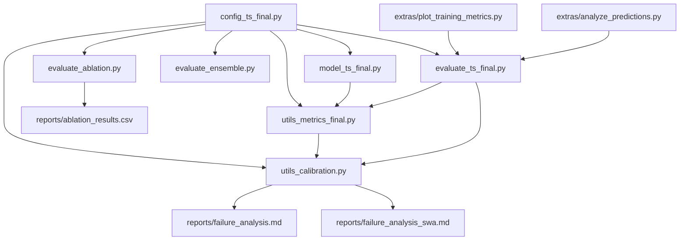
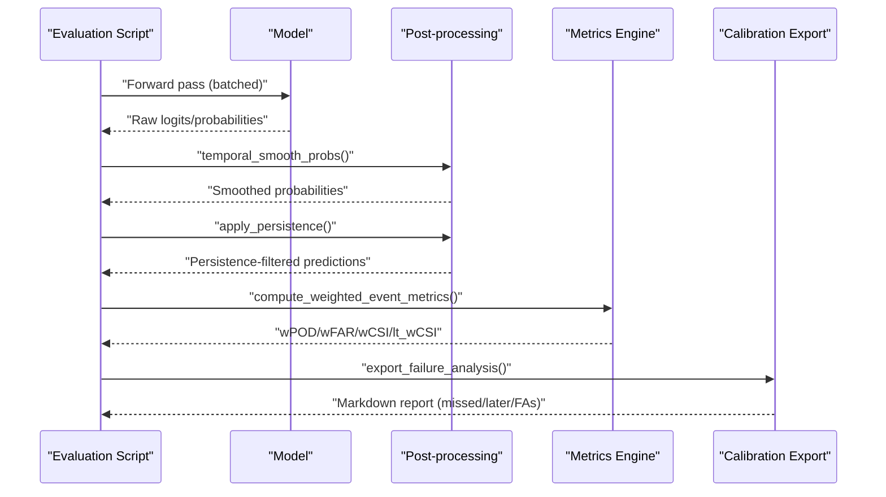
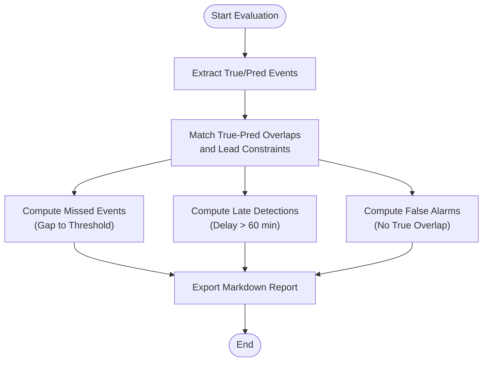
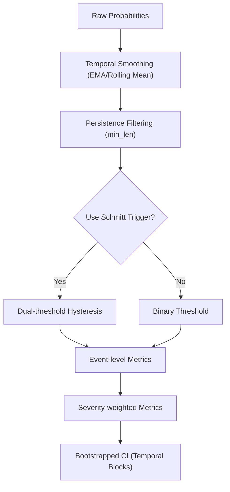
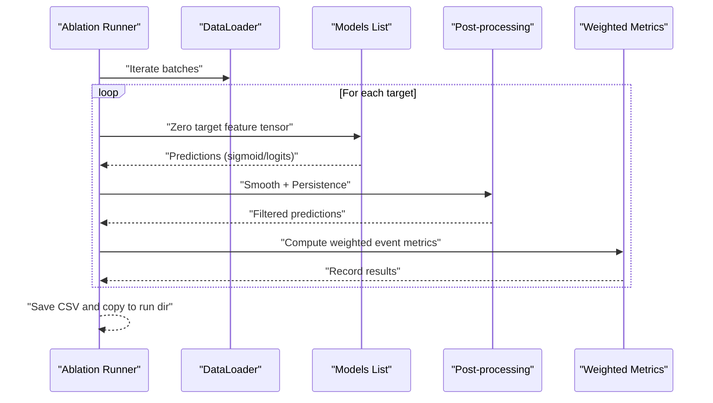
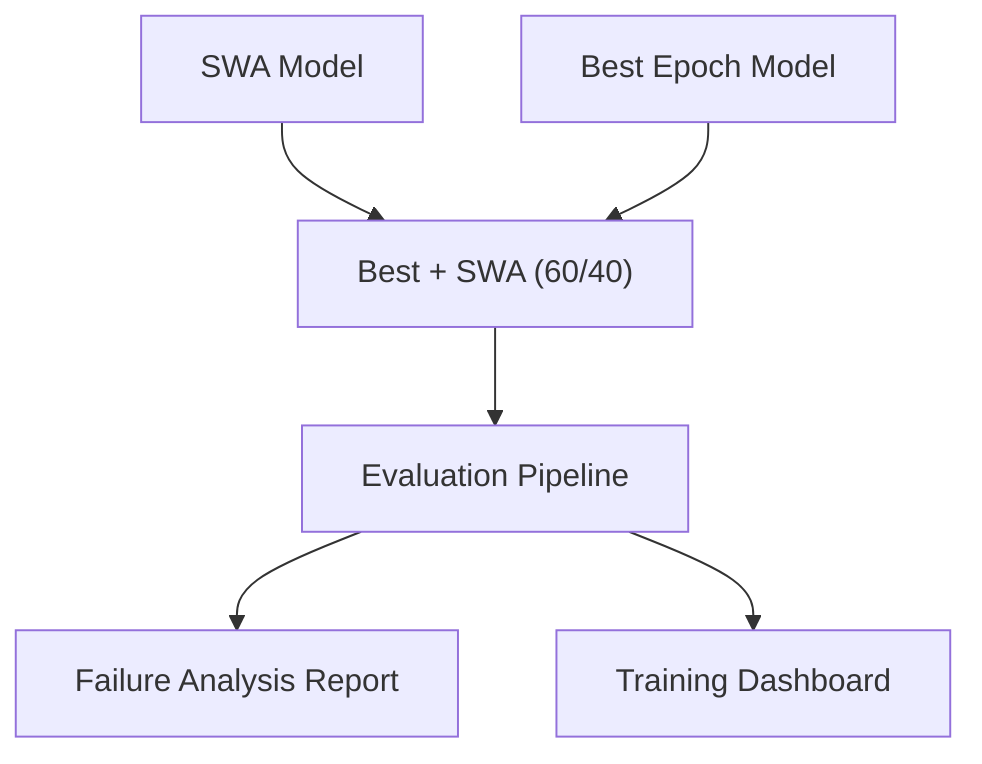
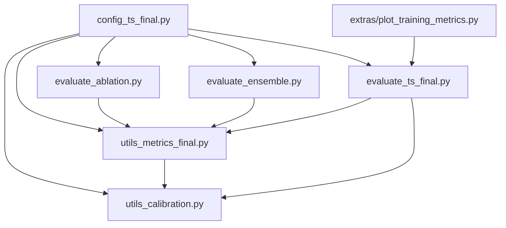

# Failure Analysis & Error Investigation

<cite>
**Referenced Files in This Document**
- [config_ts_final.py](file://config_ts_final.py)
- [model_ts_final.py](file://model_ts_final.py)
- [utils_metrics_final.py](file://utils_metrics_final.py)
- [utils_calibration.py](file://utils_calibration.py)
- [evaluate_ablation.py](file://evaluate_ablation.py)
- [evaluate_ensemble.py](file://evaluate_ensemble.py)
- [evaluate_ts_final.py](file://evaluate_ts_final.py)
- [reports/failure_analysis.md](file://reports/failure_analysis.md)
- [reports/failure_analysis_swa.md](file://reports/failure_analysis_swa.md)
- [reports/ablation_results.csv](file://reports/ablation_results.csv)
- [extras/plot_training_metrics.py](file://extras/plot_training_metrics.py)
- [extras/analyze_predictions.py](file://extras/analyze_predictions.py)
</cite>

## Table of Contents
1. [Introduction](#introduction)
2. [Project Structure](#project-structure)
3. [Core Components](#core-components)
4. [Architecture Overview](#architecture-overview)
5. [Detailed Component Analysis](#detailed-component-analysis)
6. [Dependency Analysis](#dependency-analysis)
7. [Performance Considerations](#performance-considerations)
8. [Troubleshooting Guide](#troubleshooting-guide)
9. [Conclusion](#conclusion)
10. [Appendices](#appendices)

## Introduction
This document presents a comprehensive failure analysis and error investigation framework for the Nagpur Thunderstorm (TS) nowcasting system. It covers:
- Systematic error identification and categorization
- Bias detection methodologies using severity-weighted metrics and temporal post-processing
- Edge case handling via persistence filtering, temporal smoothing, and Schmitt trigger hysteresis
- Ablation study methodology to isolate model components and quantify their contributions
- SWA (Stochastic Weight Averaging) failure analysis, including ensemble effects and convergence behavior
- Guidance for analyzing failure patterns, detecting data drift, and implementing targeted improvements
- Strategies for failure prevention, robustness testing, and continuous monitoring

## Project Structure
The repository organizes failure analysis around modular components:
- Configuration defines model, training, and post-processing parameters
- Metrics utilities implement temporal smoothing, persistence filtering, event-level scoring, and lead-time analysis
- Calibration utilities export structured failure reports by category
- Evaluation scripts run ablation, ensemble averaging, and final model evaluation
- Reports and plotting utilities visualize failure statistics and training dynamics

**Diagram sources**
- [config_ts_final.py](file://config_ts_final.py)
- [model_ts_final.py](file://model_ts_final.py)
- [utils_metrics_final.py](file://utils_metrics_final.py)
- [utils_calibration.py](file://utils_calibration.py)
- [evaluate_ablation.py](file://evaluate_ablation.py)
- [evaluate_ensemble.py](file://evaluate_ensemble.py)
- [evaluate_ts_final.py](file://evaluate_ts_final.py)
- [reports/failure_analysis.md](file://reports/failure_analysis.md)
- [reports/failure_analysis_swa.md](file://reports/failure_analysis_swa.md)
- [reports/ablation_results.csv](file://reports/ablation_results.csv)
- [extras/plot_training_metrics.py](file://extras/plot_training_metrics.py)
- [extras/analyze_predictions.py](file://extras/analyze_predictions.py)

**Section sources**
- [config_ts_final.py](file://config_ts_final.py)
- [utils_metrics_final.py](file://utils_metrics_final.py)
- [utils_calibration.py](file://utils_calibration.py)
- [evaluate_ablation.py](file://evaluate_ablation.py)
- [evaluate_ensemble.py](file://evaluate_ensemble.py)
- [evaluate_ts_final.py](file://evaluate_ts_final.py)
- [reports/failure_analysis.md](file://reports/failure_analysis.md)
- [reports/failure_analysis_swa.md](file://reports/failure_analysis_swa.md)
- [reports/ablation_results.csv](file://reports/ablation_results.csv)
- [extras/plot_training_metrics.py](file://extras/plot_training_metrics.py)
- [extras/analyze_predictions.py](file://extras/analyze_predictions.py)

## Core Components
- Configuration: Controls model architecture, training schedule, SWA, loss weighting, and post-processing thresholds and filters
- Metrics Utilities: Implements temporal smoothing, persistence filtering, event-level scoring, lead-time analysis, and bootstrapped confidence intervals
- Calibration Utilities: Generates structured failure reports by category (missed events, late detections, false alarms)
- Ablation Engine: Isolates input modalities (channels, optical flow, METAR, time) and measures their impact on weighted event metrics
- Ensemble Evaluation: Averages Best and SWA models, optionally calibrates, and compares individual vs. ensemble performance
- Training Dashboard: Parses logs and visualizes frame/event/weighted metrics, lead times, and aviation safety scores

**Section sources**
- [config_ts_final.py](file://config_ts_final.py)
- [utils_metrics_final.py](file://utils_metrics_final.py)
- [utils_calibration.py](file://utils_calibration.py)
- [evaluate_ablation.py](file://evaluate_ablation.py)
- [evaluate_ensemble.py](file://evaluate_ensemble.py)
- [extras/plot_training_metrics.py](file://extras/plot_training_metrics.py)

## Architecture Overview
The failure analysis pipeline integrates model inference, temporal post-processing, and severity-aware evaluation to produce actionable insights.

**Diagram sources**
- [evaluate_ts_final.py](file://evaluate_ts_final.py)
- [utils_metrics_final.py](file://utils_metrics_final.py)
- [utils_calibration.py](file://utils_calibration.py)

## Detailed Component Analysis

### Error Categorization and Reporting
- Categories:
  - Missed Events (False Negatives): storms not detected; reported with severity, duration, max probability, and gap to threshold
  - Late Detections (>60 min delay): detected but too late; reported with severity, duration, delay, and peak probability
  - False Alarms (False Positives): spurious detections; reported with month, duration, and peak probability
- Severity mapping and weighted metrics guide prioritization of corrections
- Lead-time bonus and temporal smoothing influence detection quality

**Diagram sources**
- [utils_calibration.py](file://utils_calibration.py)
- [utils_metrics_final.py](file://utils_metrics_final.py)

**Section sources**
- [utils_calibration.py](file://utils_calibration.py)
- [utils_metrics_final.py](file://utils_metrics_final.py)
- [reports/failure_analysis.md](file://reports/failure_analysis.md)
- [reports/failure_analysis_swa.md](file://reports/failure_analysis_swa.md)

### Bias Detection Methodologies
- Temporal smoothing (EMA) reduces isolated spikes and improves stability
- Persistence filtering removes short-lived false alarms and stabilizes event-level metrics
- Dual-threshold Schmitt trigger reduces temporal chatter without relying solely on persistence
- Severity-weighted metrics emphasize costly misclassifications (e.g., squalls, heavy precipitation)
- Bootstrapped confidence intervals provide robust uncertainty estimates for temporal splits

**Diagram sources**
- [utils_metrics_final.py](file://utils_metrics_final.py)
- [config_ts_final.py](file://config_ts_final.py)

**Section sources**
- [utils_metrics_final.py](file://utils_metrics_final.py)
- [config_ts_final.py](file://config_ts_final.py)

### Edge Case Handling Strategies
- Minimum event length (persistence) prevents trivial false alarms
- Severe fast-track bypasses persistence for high-probability severe events
- Lead-time constraints ensure early detection bonuses and penalize late misses
- Intensity regression head supports continuous severity scoring
- Evidence-theoretic heads enable uncertainty-aware decisions

**Section sources**
- [config_ts_final.py](file://config_ts_final.py)
- [utils_metrics_final.py](file://utils_metrics_final.py)
- [model_ts_final.py](file://model_ts_final.py)

### Ablation Study Methodology
- Goal: isolate contribution of each input modality by zeroing it out and measuring change in weighted event metrics
- Targets include IR channels, texture, water vapor, cooling, differences, optical flow, METAR, and time features
- Ensemble support: evaluate single best model, SWA model, and Best+SWA averaged predictions
- Post-processing parity: identical smoothing and persistence applied across ablations
- Outputs: CSV with weighted CSI and other metrics per ablation target; copied to run output directory

**Diagram sources**
- [evaluate_ablation.py](file://evaluate_ablation.py)
- [utils_metrics_final.py](file://utils_metrics_final.py)

**Section sources**
- [evaluate_ablation.py](file://evaluate_ablation.py)
- [reports/ablation_results.csv](file://reports/ablation_results.csv)

### SWA Failure Analysis and Convergence Behavior
- SWA models generally increase coverage of weak convection and reduce false positives compared to best epoch
- Failure reports show higher counts of missed events and fewer very late detections under SWA
- Ensemble averaging (Best+SWA) further reduces false alarms while preserving detection rates
- Convergence diagnostics: training dashboards track weighted event metrics, lead times, and aviation safety scores

**Diagram sources**
- [evaluate_ensemble.py](file://evaluate_ensemble.py)
- [reports/failure_analysis_swa.md](file://reports/failure_analysis_swa.md)
- [extras/plot_training_metrics.py](file://extras/plot_training_metrics.py)

**Section sources**
- [evaluate_ensemble.py](file://evaluate_ensemble.py)
- [reports/failure_analysis_swa.md](file://reports/failure_analysis_swa.md)
- [extras/plot_training_metrics.py](file://extras/plot_training_metrics.py)

### Analyzing Failure Patterns and Detecting Data Drift
- Use structured failure reports to identify recurring patterns by severity and month
- Correlate failure statistics with weather regimes and seasonal boosts
- Monitor training dashboards for shifts in weighted CSI, lead-time distributions, and aviation safety scores
- Quick prediction CSV analysis provides label distributions, probability statistics, and binning accuracy vs. confidence

**Section sources**
- [utils_calibration.py](file://utils_calibration.py)
- [extras/plot_training_metrics.py](file://extras/plot_training_metrics.py)
- [extras/analyze_predictions.py](file://extras/analyze_predictions.py)

### Implementing Targeted Improvements
- Adjust temporal smoothing window and persistence minimum length based on lead-time goals
- Tune dual-threshold hysteresis to reduce chatter while preserving sensitivity
- Re-evaluate channel subsets and augmentation strategies using ablation results
- Incorporate severity-weighted thresholds and severe fast-track parameters
- Consider Platt scaling or other calibration techniques where appropriate

**Section sources**
- [config_ts_final.py](file://config_ts_final.py)
- [utils_metrics_final.py](file://utils_metrics_final.py)
- [evaluate_ablation.py](file://evaluate_ablation.py)

## Dependency Analysis
The failure analysis framework exhibits strong cohesion within evaluation and metrics modules, with clear separation of concerns:
- Configuration centralizes hyperparameters and post-processing controls
- Metrics utilities encapsulate temporal and event-level computations
- Calibration utilities depend on metrics and produce domain-specific reports
- Evaluation scripts orchestrate inference, post-processing, and reporting
- Training dashboard parses logs and visualizes long-term trends

**Diagram sources**
- [config_ts_final.py](file://config_ts_final.py)
- [utils_metrics_final.py](file://utils_metrics_final.py)
- [utils_calibration.py](file://utils_calibration.py)
- [evaluate_ablation.py](file://evaluate_ablation.py)
- [evaluate_ensemble.py](file://evaluate_ensemble.py)
- [evaluate_ts_final.py](file://evaluate_ts_final.py)
- [extras/plot_training_metrics.py](file://extras/plot_training_metrics.py)

**Section sources**
- [config_ts_final.py](file://config_ts_final.py)
- [utils_metrics_final.py](file://utils_metrics_final.py)
- [utils_calibration.py](file://utils_calibration.py)
- [evaluate_ablation.py](file://evaluate_ablation.py)
- [evaluate_ensemble.py](file://evaluate_ensemble.py)
- [evaluate_ts_final.py](file://evaluate_ts_final.py)
- [extras/plot_training_metrics.py](file://extras/plot_training_metrics.py)

## Performance Considerations
- Temporal smoothing and persistence improve stability and reduce false alarms
- EMA smoothing is recommended for nowcasting due to recent-frame emphasis
- Reducing optical flow usage yields computational savings with minimal contribution
- SWA convergence benefits from patience and appropriate start epoch
- Bootstrapped confidence intervals require sufficient temporal blocks for reliable estimates

[No sources needed since this section provides general guidance]

## Troubleshooting Guide
Common issues and remedies:
- Validation/test leakage: derive threshold on validation set and apply consistently during evaluation
- Inconsistent post-processing: ensure identical smoothing and persistence across ablation runs
- Model loading mismatches: use partial state dict loading when shapes differ slightly
- Missing run output directory: verify run_dir resolution and permissions
- Calibration mismatch: confirm Platt scaling compatibility with chosen uncertainty head

**Section sources**
- [evaluate_ensemble.py](file://evaluate_ensemble.py)
- [evaluate_ablation.py](file://evaluate_ablation.py)
- [utils_metrics_final.py](file://utils_metrics_final.py)

## Conclusion
This failure analysis framework integrates robust post-processing, severity-weighted metrics, and structured reporting to systematically identify and mitigate model shortcomings. Ablation studies isolate component contributions, while SWA and ensemble strategies improve reliability. Continuous monitoring via training dashboards and periodic failure audits ensures sustained performance and operational readiness.

[No sources needed since this section summarizes without analyzing specific files]

## Appendices

### Appendix A: Root Cause Investigation Template
- Data-level: seasonality, sensor artifacts, spatial masks, METAR availability
- Model-level: channel subsets, optical flow usage, regularization, SWA convergence
- Post-processing: smoothing window, persistence minimum length, Schmitt trigger thresholds
- Evaluation-level: threshold selection metric, weighted metrics, lead-time constraints

[No sources needed since this section provides general guidance]