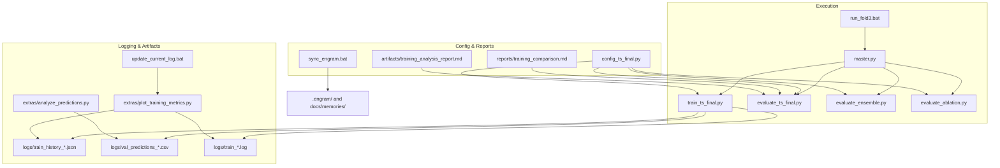
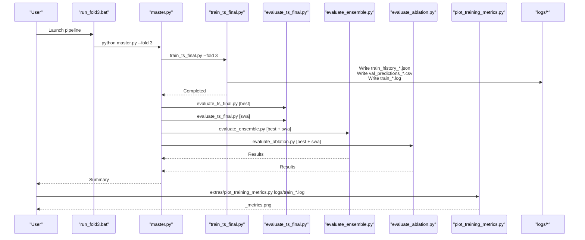
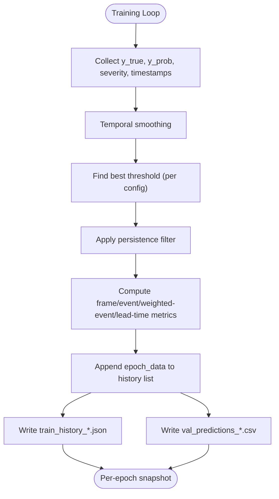
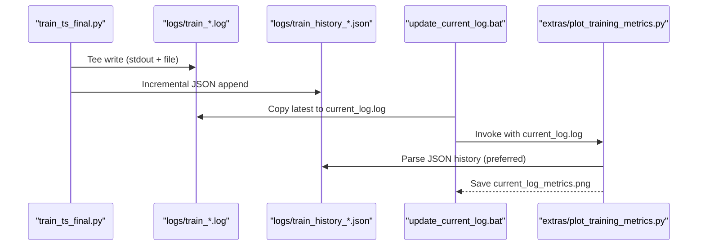
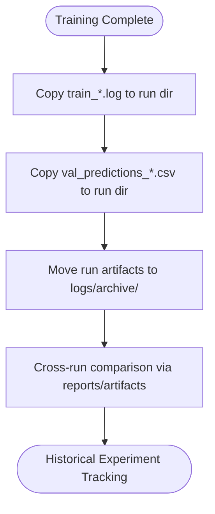
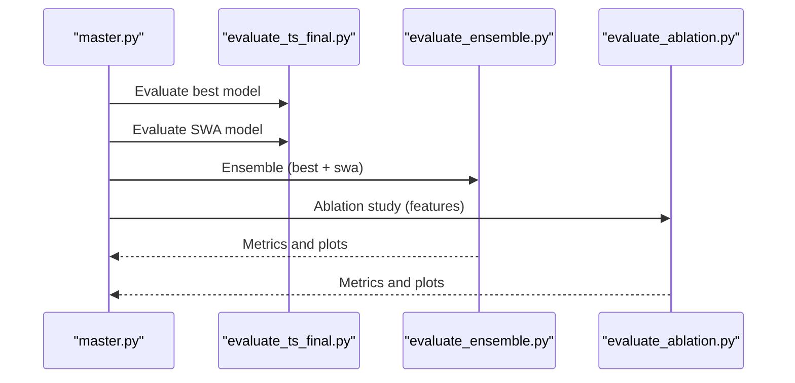
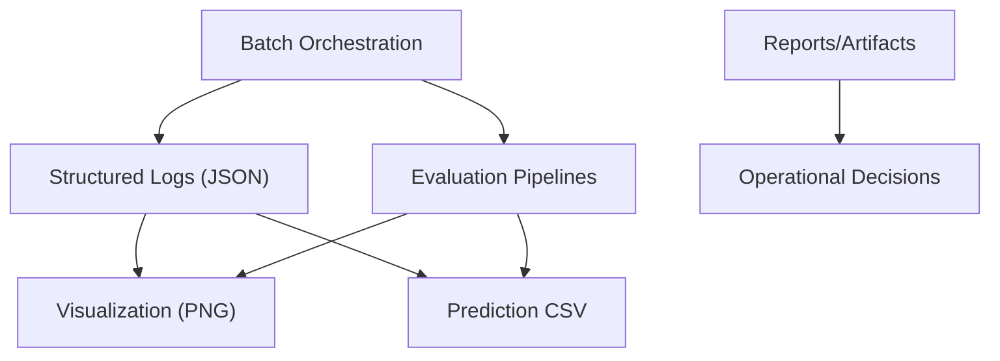
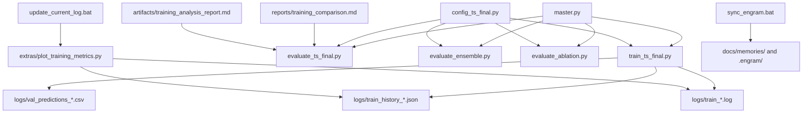

# Log Management & Training History

<cite>
**Referenced Files in This Document**
- [train_ts_final.py](file://train_ts_final.py)
- [master.py](file://master.py)
- [run_fold3.bat](file://run_fold3.bat)
- [update_current_log.bat](file://update_current_log.bat)
- [plot_training_metrics.py](file://extras/plot_training_metrics.py)
- [analyze_predictions.py](file://extras/analyze_predictions.py)
- [config_ts_final.py](file://config_ts_final.py)
- [evaluate_ts_final.py](file://evaluate_ts_final.py)
- [evaluate_ensemble.py](file://evaluate_ensemble.py)
- [evaluate_ablation.py](file://evaluate_ablation.py)
- [training_comparison.md](file://reports/training_comparison.md)
- [training_analysis_report.md](file://artifacts/training_analysis_report.md)
- [sync_engram.bat](file://sync_engram.bat)
- [logs/train_history_20260522_114526.json](file://logs/train_history_20260522_114526.json)
- [logs/train_history_20260524_103721.json](file://logs/train_history_20260524_103721.json)
</cite>

## Table of Contents
1. [Introduction](#introduction)
2. [Project Structure](#project-structure)
3. [Core Components](#core-components)
4. [Architecture Overview](#architecture-overview)
5. [Detailed Component Analysis](#detailed-component-analysis)
6. [Dependency Analysis](#dependency-analysis)
7. [Performance Considerations](#performance-considerations)
8. [Troubleshooting Guide](#troubleshooting-guide)
9. [Conclusion](#conclusion)
10. [Appendices](#appendices)

## Introduction
This document describes the log management and training history system used for Nagpur TS Nowcasting experiments. It covers how training metrics and validation scores are captured, archived, and visualized; how experiment runs are tracked and compared; and how automated scripts integrate batch execution, real-time plotting, and archival. It also outlines reproducibility mechanisms, long-term trend analysis, and integration points with external documentation and memory systems.

## Project Structure
The logging and experiment tracking system spans several directories and files:
- Training and validation logs are written under logs/ and archived under logs/archive/.
- JSON history files capture per-epoch metrics for reproducible analysis.
- Batch scripts orchestrate training, evaluation, and visualization.
- Utility scripts parse logs, produce dashboards, and analyze prediction CSVs.
- Reports and artifacts document comparisons and operational insights.
- Configuration centralizes paths and runtime parameters.

**Diagram sources**
- [run_fold3.bat:1-16](file://run_fold3.bat#L1-L16)
- [master.py:1-108](file://master.py#L1-L108)
- [train_ts_final.py:1-757](file://train_ts_final.py#L1-L757)
- [evaluate_ts_final.py:1-200](file://evaluate_ts_final.py#L1-L200)
- [evaluate_ensemble.py:1-200](file://evaluate_ensemble.py#L1-L200)
- [evaluate_ablation.py:1-200](file://evaluate_ablation.py#L1-L200)
- [plot_training_metrics.py:1-464](file://extras/plot_training_metrics.py#L1-L464)
- [analyze_predictions.py:1-64](file://extras/analyze_predictions.py#L1-L64)
- [config_ts_final.py:1-208](file://config_ts_final.py#L1-L208)
- [training_comparison.md:1-153](file://reports/training_comparison.md#L1-L153)
- [training_analysis_report.md:1-74](file://artifacts/training_analysis_report.md#L1-L74)
- [sync_engram.bat:1-27](file://sync_engram.bat#L1-L27)

**Section sources**
- [run_fold3.bat:1-16](file://run_fold3.bat#L1-L16)
- [master.py:1-108](file://master.py#L1-L108)
- [train_ts_final.py:167-175](file://train_ts_final.py#L167-L175)
- [config_ts_final.py:191](file://config_ts_final.py#L191)

## Core Components
- Training loop writes per-epoch metrics to JSON history and logs, plus validation predictions CSV.
- Batch orchestration runs training, evaluation, ensemble, and ablation in sequence.
- Real-time dashboard generation parses JSON/log and produces multi-panel plots.
- Archive management moves run artifacts into a dated run folder upon completion.
- Reproducibility aids include deterministic seeds, configuration-driven paths, and standardized filenames.

**Section sources**
- [train_ts_final.py:380-598](file://train_ts_final.py#L380-L598)
- [train_ts_final.py:680-692](file://train_ts_final.py#L680-L692)
- [train_ts_final.py:745-754](file://train_ts_final.py#L745-L754)
- [master.py:75-98](file://master.py#L75-L98)
- [plot_training_metrics.py:57-84](file://extras/plot_training_metrics.py#L57-L84)
- [update_current_log.bat:13-24](file://update_current_log.bat#L13-L24)

## Architecture Overview
The logging and experiment lifecycle integrates training, evaluation, visualization, and archival:

**Diagram sources**
- [run_fold3.bat:12-13](file://run_fold3.bat#L12-L13)
- [master.py:75-98](file://master.py#L75-L98)
- [train_ts_final.py:380-598](file://train_ts_final.py#L380-L598)
- [evaluate_ts_final.py:174-200](file://evaluate_ts_final.py#L174-L200)
- [evaluate_ensemble.py:174-200](file://evaluate_ensemble.py#L174-L200)
- [evaluate_ablation.py:172-200](file://evaluate_ablation.py#L172-L200)
- [plot_training_metrics.py:442-464](file://extras/plot_training_metrics.py#L442-L464)

## Detailed Component Analysis

### Training Log Structure and Metrics Capture
- Per-epoch metrics include training/validation loss, frame-level CSI/POD/FAR, event-level metrics (hits/false_alarms), weighted event metrics (wPOD/wFAR/wCSI), lead-time statistics, early detection rate, aviation score, and learning rate.
- JSON history is written incrementally and can be parsed by visualization tools.
- Validation predictions CSV captures timestamps, severity, labels, raw/smoothed probabilities, and binary predictions for downstream analysis.

**Diagram sources**
- [train_ts_final.py:511-598](file://train_ts_final.py#L511-L598)
- [train_ts_final.py:597-598](file://train_ts_final.py#L597-L598)
- [train_ts_final.py:681-692](file://train_ts_final.py#L681-L692)

**Section sources**
- [train_ts_final.py:575-595](file://train_ts_final.py#L575-L595)
- [logs/train_history_20260522_114526.json:1-527](file://logs/train_history_20260522_114526.json#L1-L527)
- [logs/train_history_20260524_103721.json:1-527](file://logs/train_history_20260524_103721.json#L1-L527)

### Automated Logging and Real-Time Visualization
- The training process redirects stdout to a timestamped log file and appends per-epoch metrics to JSON history.
- A batch script updates a symlink-like “current_log” by copying the latest log and invoking the plotting utility to generate a multi-panel dashboard.
- The plotting utility supports both JSON history and legacy text logs, extracting metrics via regex and generating PNGs for quick review.

**Diagram sources**
- [train_ts_final.py:168-169](file://train_ts_final.py#L168-L169)
- [train_ts_final.py:597-598](file://train_ts_final.py#L597-L598)
- [update_current_log.bat:13-24](file://update_current_log.bat#L13-L24)
- [plot_training_metrics.py:25-40](file://extras/plot_training_metrics.py#L25-L40)
- [plot_training_metrics.py:57-84](file://extras/plot_training_metrics.py#L57-L84)

**Section sources**
- [train_ts_final.py:48-66](file://train_ts_final.py#L48-L66)
- [update_current_log.bat:13-24](file://update_current_log.bat#L13-L24)
- [plot_training_metrics.py:25-40](file://extras/plot_training_metrics.py#L25-L40)

### Archive Management and Experiment Tracking
- On training completion, logs and prediction CSVs are copied into a run-specific directory named after the training timestamp.
- Historical experiments are organized under logs/archive/, enabling long-term trend analysis and cross-run comparisons.
- Reports and artifacts consolidate findings and recommendations for operational decisions.

**Diagram sources**
- [train_ts_final.py:745-754](file://train_ts_final.py#L745-L754)

**Section sources**
- [train_ts_final.py:745-754](file://train_ts_final.py#L745-L754)
- [training_analysis_report.md:1-74](file://artifacts/training_analysis_report.md#L1-L74)
- [training_comparison.md:1-153](file://reports/training_comparison.md#L1-L153)

### Reproducibility and Configuration
- Centralized configuration defines model paths, training hyperparameters, post-processing parameters, and data splits.
- Deterministic seeding and explicit device selection improve reproducibility across runs.
- Walk-forward CV folds enable consistent evaluation baselines.

**Section sources**
- [config_ts_final.py:16-208](file://config_ts_final.py#L16-L208)
- [train_ts_final.py:67-73](file://train_ts_final.py#L67-L73)
- [master.py:40-43](file://master.py#L40-L43)

### Evaluation and Ablation Workflows
- Evaluation scripts compute frame-level and event-level metrics, generate visualizations, and export results for reporting.
- Ensemble evaluation averages best and SWA models to reduce FAR while preserving POD.
- Ablation studies systematically remove input features to quantify their contribution to performance.

**Diagram sources**
- [master.py:84-98](file://master.py#L84-L98)
- [evaluate_ts_final.py:174-200](file://evaluate_ts_final.py#L174-L200)
- [evaluate_ensemble.py:174-200](file://evaluate_ensemble.py#L174-L200)
- [evaluate_ablation.py:172-200](file://evaluate_ablation.py#L172-L200)

**Section sources**
- [evaluate_ts_final.py:174-200](file://evaluate_ts_final.py#L174-L200)
- [evaluate_ensemble.py:174-200](file://evaluate_ensemble.py#L174-L200)
- [evaluate_ablation.py:172-200](file://evaluate_ablation.py#L172-L200)

### Conceptual Overview
- The system emphasizes structured, machine-readable logs (JSON history) alongside human-friendly plots and CSV predictions.
- Batch orchestration ensures consistent execution order and artifact placement.
- Reporting and artifact files capture operational insights and recommendations for future runs.

[No sources needed since this diagram shows conceptual workflow, not actual code structure]

## Dependency Analysis
The logging and experiment tracking system exhibits clear module boundaries and dependencies:

**Diagram sources**
- [train_ts_final.py:380-598](file://train_ts_final.py#L380-L598)
- [master.py:75-98](file://master.py#L75-L98)
- [plot_training_metrics.py:57-84](file://extras/plot_training_metrics.py#L57-L84)
- [update_current_log.bat:13-24](file://update_current_log.bat#L13-L24)
- [config_ts_final.py:191](file://config_ts_final.py#L191)
- [training_comparison.md:1-153](file://reports/training_comparison.md#L1-L153)
- [training_analysis_report.md:1-74](file://artifacts/training_analysis_report.md#L1-L74)
- [sync_engram.bat:1-27](file://sync_engram.bat#L1-L27)

**Section sources**
- [train_ts_final.py:380-598](file://train_ts_final.py#L380-L598)
- [master.py:75-98](file://master.py#L75-L98)
- [plot_training_metrics.py:57-84](file://extras/plot_training_metrics.py#L57-L84)
- [update_current_log.bat:13-24](file://update_current_log.bat#L13-L24)
- [config_ts_final.py:191](file://config_ts_final.py#L191)
- [training_comparison.md:1-153](file://reports/training_comparison.md#L1-L153)
- [training_analysis_report.md:1-74](file://artifacts/training_analysis_report.md#L1-L74)
- [sync_engram.bat:1-27](file://sync_engram.bat#L1-L27)

## Performance Considerations
- JSON history enables fast, structured analysis and avoids regex parsing overhead for recent runs.
- Visualization is optimized to handle NaNs and skip epochs without metrics.
- Early stopping and patience thresholds prevent overfitting; SWA can improve generalization when started appropriately.
- Persistence filtering and temporal smoothing reduce transient false alarms and stabilize metrics.

[No sources needed since this section provides general guidance]

## Troubleshooting Guide
Common issues and remedies:
- Missing current_log_metrics.png: Ensure update_current_log.bat successfully copies the latest log and invokes the plotting utility.
- Empty plots: Verify JSON history exists and contains entries; otherwise, fall back to parsing the text log.
- Inconsistent metrics: Confirm that evaluation scripts use the same threshold selection and post-processing parameters as training.
- Overfitting symptoms: Review training_analysis_report.md for guidance on reducing positive-class bias and adjusting SWA/patience scheduling.
- Archive discrepancies: Confirm that run artifacts were moved to the run directory after training completion.

**Section sources**
- [update_current_log.bat:13-24](file://update_current_log.bat#L13-L24)
- [plot_training_metrics.py:25-40](file://extras/plot_training_metrics.py#L25-L40)
- [training_analysis_report.md:50-74](file://artifacts/training_analysis_report.md#L50-L74)

## Conclusion
The Nagpur TS Nowcasting logging and experiment tracking system provides a robust foundation for reproducible training, real-time monitoring, and long-term trend analysis. Structured JSON histories, automated dashboards, and comprehensive evaluation pipelines collectively support operational decision-making and continuous improvement.

## Appendices

### Log Structure Reference
- Epoch-level keys include epoch, train_loss, val_loss, frame metrics (csi, pod, far), event metrics (ev_hits, ev_fa, ev_pod, ev_far, ev_csi), weighted event metrics (wev_pod, wev_far, wev_csi), lead-time statistics (mean_lead), early_60min, aviation_score, and lr.
- Validation predictions CSV includes timestamp, severity, y_true, y_prob_raw, y_prob_smooth, y_pred_final, and derived hit/fa/miss indicators.

**Section sources**
- [train_ts_final.py:575-595](file://train_ts_final.py#L575-L595)
- [logs/train_history_20260522_114526.json:1-527](file://logs/train_history_20260522_114526.json#L1-L527)
- [logs/train_history_20260524_103721.json:1-527](file://logs/train_history_20260524_103721.json#L1-L527)

### Batch Integration and Automation
- run_fold3.bat activates the environment and executes the master pipeline for a chosen fold.
- update_current_log.bat identifies the latest log, updates current_log.log, and triggers plotting and image saving.

**Section sources**
- [run_fold3.bat:1-16](file://run_fold3.bat#L1-L16)
- [update_current_log.bat:1-30](file://update_current_log.bat#L1-L30)

### External Systems Integration
- sync_engram.bat synchronizes memory artifacts with .engram/ and exports Markdown notebooks for documentation and context retrieval.

**Section sources**
- [sync_engram.bat:1-27](file://sync_engram.bat#L1-L27)