# Model Audits & Technical Reviews

<cite>
**Referenced Files in This Document**
- [comprehensive_model_audit.md](file://reports/comprehensive_model_audit.md)
- [audit_prompt.md](file://reports/audit_prompt.md)
- [audit_report_part1.md](file://reports/audit_report_part1.md)
- [master.py](file://master.py)
- [model_ts_final.py](file://model_ts_final.py)
- [train_ts_final.py](file://train_ts_final.py)
- [evaluate_ts_final.py](file://evaluate_ts_final.py)
- [evaluate_ablation.py](file://evaluate_ablation.py)
- [config_ts_final.py](file://config_ts_final.py)
- [utils_metrics_final.py](file://utils_metrics_final.py)
- [losses_final.py](file://losses_final.py)
- [dataset_ts_final.py](file://dataset_ts_final.py)
- [utils_preprocessing.py](file://utils_preprocessing.py)
</cite>

## Table of Contents
1. [Introduction](#introduction)
2. [Project Structure](#project-structure)
3. [Core Components](#core-components)
4. [Architecture Overview](#architecture-overview)
5. [Detailed Component Analysis](#detailed-component-analysis)
6. [Dependency Analysis](#dependency-analysis)
7. [Performance Considerations](#performance-considerations)
8. [Troubleshooting Guide](#troubleshooting-guide)
9. [Conclusion](#conclusion)
10. [Appendices](#appendices)

## Introduction
This document presents a comprehensive model audit methodology tailored for the Nagpur TS Nowcasting pipeline. It consolidates technical debt assessments, architectural review processes, and optimization recommendation frameworks grounded in the repository’s audit reports and codebase. The methodology emphasizes scientific validity, data pipeline integrity, model architecture coherence, training procedure rigor, evaluation fidelity, code quality, and performance profiling. It also outlines an audit prompt system to guide systematic evaluation of model components, training procedures, and deployment readiness, and provides guidance for peer reviews, architectural improvements, and technical standards. Finally, it addresses automation tools, continuous monitoring approaches, and stakeholder engagement strategies for technical governance and quality assurance.

## Project Structure
The repository organizes the end-to-end pipeline into modular components:
- Orchestrator: master pipeline script coordinates training, evaluation, ensemble, and ablation.
- Model: CNN-GRU architecture with optional uncertainty and intensity regression heads.
- Training: robust training loop with schedulers, SWA, and post-processing.
- Evaluation: comprehensive metrics, plots, and temporal smoothing.
- Dataset and preprocessing: HDF5-backed dataset with CCD features, METAR integration, and optional optical flow.
- Utilities: metrics, losses, and preprocessing helpers.
- Reports: audit summaries and prompts guiding the review process.

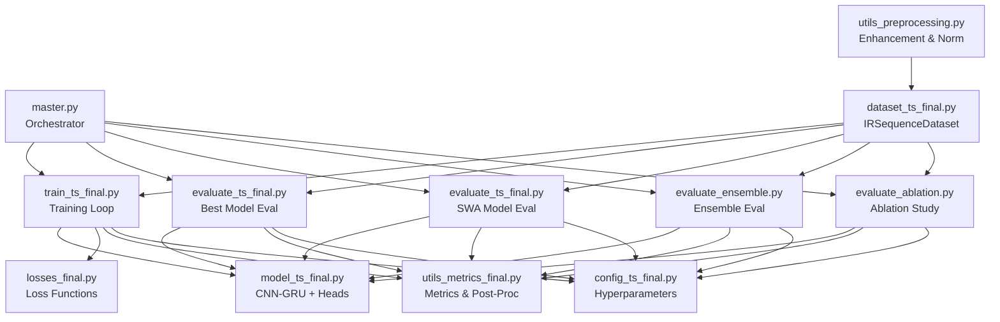

**Diagram sources**
- [master.py:17-104](file://master.py#L17-L104)
- [train_ts_final.py:142-200](file://train_ts_final.py#L142-L200)
- [evaluate_ts_final.py:1-200](file://evaluate_ts_final.py#L1-200)
- [evaluate_ensemble.py](file://evaluate_ensemble.py)
- [evaluate_ablation.py:1-200](file://evaluate_ablation.py#L1-L200)
- [model_ts_final.py:68-335](file://model_ts_final.py#L68-L335)
- [losses_final.py:13-258](file://losses_final.py#L13-L258)
- [utils_metrics_final.py:1-200](file://utils_metrics_final.py#L1-L200)
- [config_ts_final.py:16-208](file://config_ts_final.py#L16-L208)
- [dataset_ts_final.py:47-200](file://dataset_ts_final.py#L47-L200)
- [utils_preprocessing.py:1-162](file://utils_preprocessing.py#L1-L162)

**Section sources**
- [master.py:17-104](file://master.py#L17-L104)
- [train_ts_final.py:142-200](file://train_ts_final.py#L142-L200)
- [evaluate_ts_final.py:1-200](file://evaluate_ts_final.py#L1-200)
- [evaluate_ablation.py:1-200](file://evaluate_ablation.py#L1-L200)
- [model_ts_final.py:68-335](file://model_ts_final.py#L68-L335)
- [losses_final.py:13-258](file://losses_final.py#L13-L258)
- [utils_metrics_final.py:1-200](file://utils_metrics_final.py#L1-L200)
- [config_ts_final.py:16-208](file://config_ts_final.py#L16-L208)
- [dataset_ts_final.py:47-200](file://dataset_ts_final.py#L47-L200)
- [utils_preprocessing.py:1-162](file://utils_preprocessing.py#L1-L162)

## Core Components
- Model Architecture: CNN backbone (MobileNetV2) with spatial skip connection, optional optical flow branch, GRU temporal module, and heads for binary classification, optional heteroscedastic uncertainty, and intensity regression.
- Training Procedure: Deterministic seeding, warmup cosine scheduler, SWA BN update, class-balanced sampling, focal loss with late penalty and OHEM, and temporal smoothing/EMA.
- Evaluation Pipeline: Threshold selection on validation, temporal smoothing, persistence filtering, event-level metrics, and plotting utilities.
- Dataset and Preprocessing: HDF5-backed dataset with CCD features, METAR integration, optional optical flow, and CLAHE/texturization.
- Loss Functions: Focal loss with late penalty, temporal consistency loss (deprecated), heteroscedastic loss, intensity regression, asymmetric time-aware loss, and evidential loss.
- Configuration: Centralized hyperparameters, paths, and operational settings.

**Section sources**
- [model_ts_final.py:68-335](file://model_ts_final.py#L68-L335)
- [train_ts_final.py:142-200](file://train_ts_final.py#L142-L200)
- [evaluate_ts_final.py:1-200](file://evaluate_ts_final.py#L1-200)
- [dataset_ts_final.py:47-200](file://dataset_ts_final.py#L47-L200)
- [losses_final.py:13-258](file://losses_final.py#L13-L258)
- [config_ts_final.py:16-208](file://config_ts_final.py#L16-L208)

## Architecture Overview
The system follows a modular, layered design:
- Data ingestion and preprocessing feed the dataset to the training loop.
- The model processes multi-modal inputs (images, CCD, optional METAR/time, optional optical flow) through a CNN backbone and GRU temporal module.
- Training integrates loss functions, schedulers, and SWA; evaluation computes metrics and generates plots.
- The orchestrator coordinates the entire pipeline.

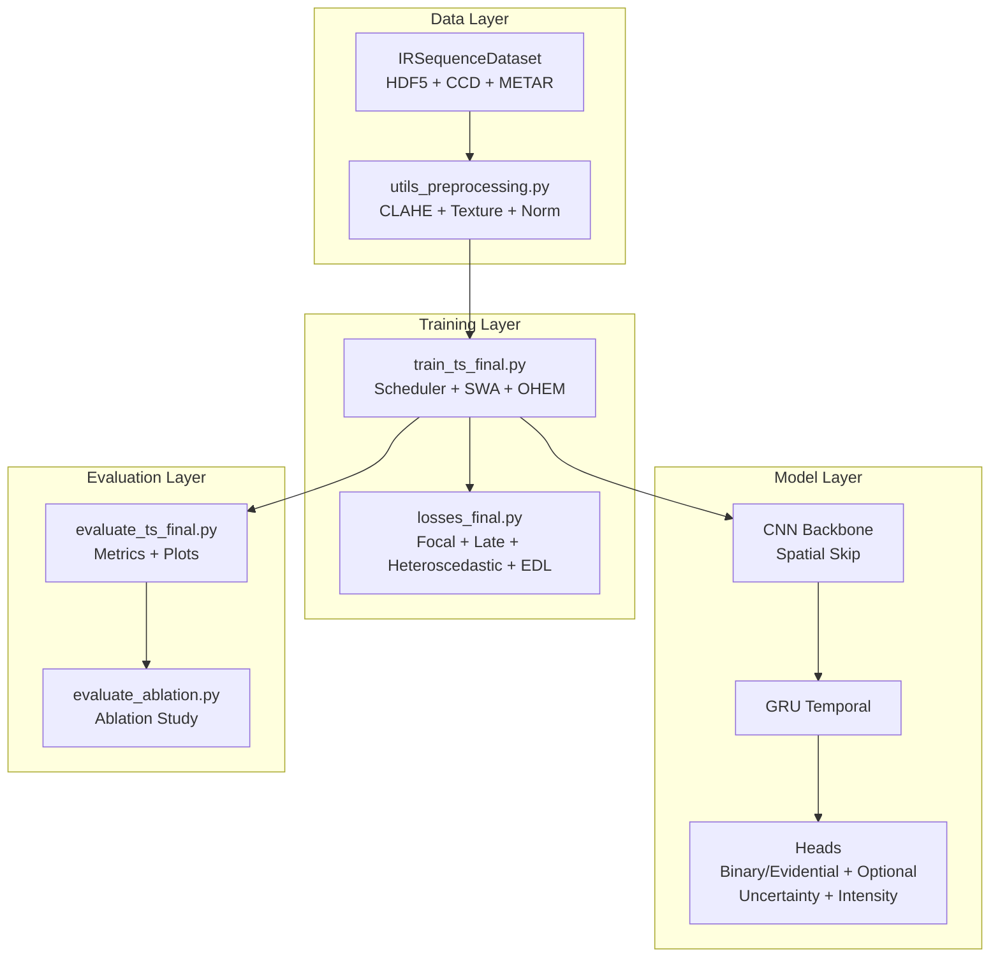

**Diagram sources**
- [dataset_ts_final.py:47-200](file://dataset_ts_final.py#L47-L200)
- [utils_preprocessing.py:1-162](file://utils_preprocessing.py#L1-L162)
- [model_ts_final.py:68-335](file://model_ts_final.py#L68-L335)
- [train_ts_final.py:142-200](file://train_ts_final.py#L142-L200)
- [losses_final.py:13-258](file://losses_final.py#L13-L258)
- [evaluate_ts_final.py:1-200](file://evaluate_ts_final.py#L1-200)
- [evaluate_ablation.py:1-200](file://evaluate_ablation.py#L1-L200)

## Detailed Component Analysis

### Audit Prompt System
The audit prompt defines a structured, evidence-driven methodology for reviewing the repository across eight domains: scientific validity, data pipeline, model architecture, training procedure, evaluation metrics, code quality, performance profiling, and research-level review. It prescribes required outputs, risk assessments, and prioritized fixes.

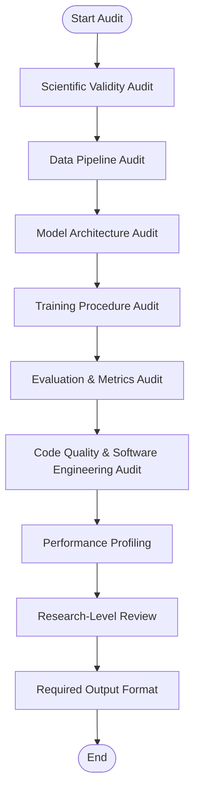

**Diagram sources**
- [audit_prompt.md:24-342](file://audit_prompt.md#L24-L342)

**Section sources**
- [audit_prompt.md:24-342](file://audit_prompt.md#L24-L342)

### Model Architecture Audit
The architecture combines a CNN backbone with a GRU temporal module and optional heads. The audit highlights:
- Parameter efficiency: GRU is more efficient than Transformer for this dataset.
- Spatial skip connection improves generalization.
- Feature projection dominates trainable parameters; reducing dimensionality yields gains.
- Dead code and fragile tuple unpacking patterns increase technical debt.

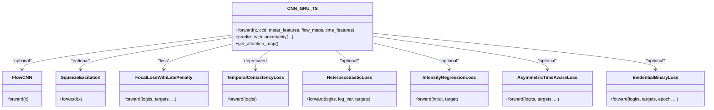

**Diagram sources**
- [model_ts_final.py:68-335](file://model_ts_final.py#L68-L335)
- [losses_final.py:13-258](file://losses_final.py#L13-L258)

**Section sources**
- [model_ts_final.py:68-335](file://model_ts_final.py#L68-L335)
- [audit_report_part1.md:107-250](file://audit_report_part1.md#L107-L250)

### Training Procedure Audit
The training loop integrates:
- Deterministic seeding and reproducibility.
- Warmup cosine scheduler and SWA BN update.
- Class-balanced sampling and OHEM to reduce FAR.
- Temporal smoothing and EMA to stabilize predictions.
- Early stopping and patience tuned for SWA convergence.

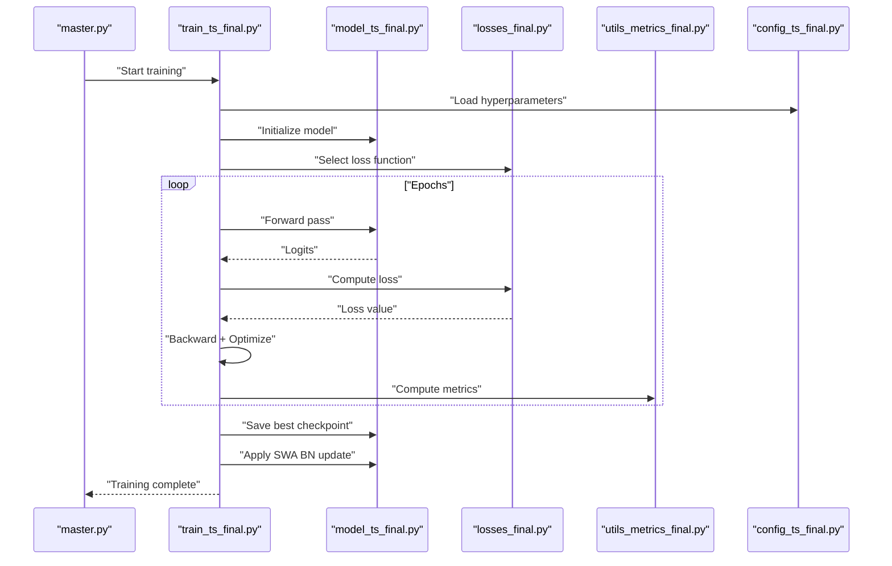

**Diagram sources**
- [master.py:75-98](file://master.py#L75-L98)
- [train_ts_final.py:142-200](file://train_ts_final.py#L142-L200)
- [model_ts_final.py:68-335](file://model_ts_final.py#L68-L335)
- [losses_final.py:13-258](file://losses_final.py#L13-L258)
- [utils_metrics_final.py:192-200](file://utils_metrics_final.py#L192-L200)
- [config_ts_final.py:16-208](file://config_ts_final.py#L16-L208)

**Section sources**
- [train_ts_final.py:142-200](file://train_ts_final.py#L142-L200)
- [audit_report_part1.md:162-286](file://audit_report_part1.md#L162-L286)

### Evaluation & Metrics Audit
Evaluation ensures:
- Threshold selection on validation to avoid leakage.
- Temporal smoothing and persistence filtering consistent with training.
- Event-level metrics with lead-time analysis and severity weighting.
- Plotting utilities for confusion matrices, ROC/PR curves, and attention maps.

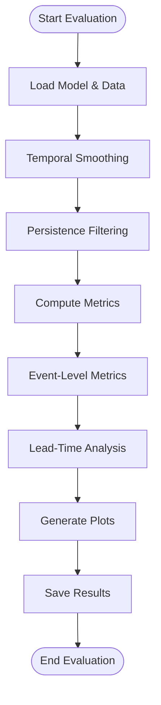

**Diagram sources**
- [evaluate_ts_final.py:1-200](file://evaluate_ts_final.py#L1-L200)
- [utils_metrics_final.py:23-77](file://utils_metrics_final.py#L23-L77)
- [utils_metrics_final.py:192-200](file://utils_metrics_final.py#L192-L200)

**Section sources**
- [evaluate_ts_final.py:1-200](file://evaluate_ts_final.py#L1-L200)
- [utils_metrics_final.py:23-77](file://utils_metrics_final.py#L23-L77)
- [utils_metrics_final.py:192-200](file://utils_metrics_final.py#L192-L200)

### Ablation Study Audit
The ablation study systematically evaluates feature contributions by zeroing inputs and measuring impact on weighted event-level metrics. The audit identifies:
- Proper post-processing pipeline application (smoothing + persistence).
- Correctness of severity label mapping and subset indexing.
- Ensemble support for best + SWA models.

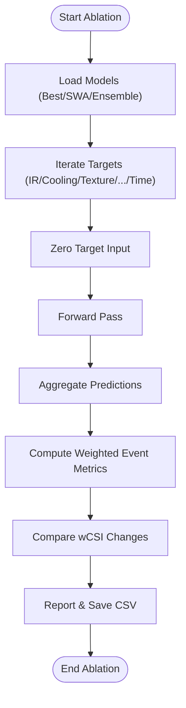

**Diagram sources**
- [evaluate_ablation.py:38-154](file://evaluate_ablation.py#L38-L154)
- [utils_metrics_final.py:192-200](file://utils_metrics_final.py#L192-L200)

**Section sources**
- [evaluate_ablation.py:38-154](file://evaluate_ablation.py#L38-L154)
- [audit_report_part1.md:150-159](file://audit_report_part1.md#L150-L159)

### Data Pipeline Audit
The dataset and preprocessing pipeline:
- Loads HDF5 files with strict timestamp sorting.
- Integrates CCD features and optional METAR/time.
- Applies CLAHE, texture enhancement, and outlier-clipped normalization.
- Supports optional optical flow computation and caching.

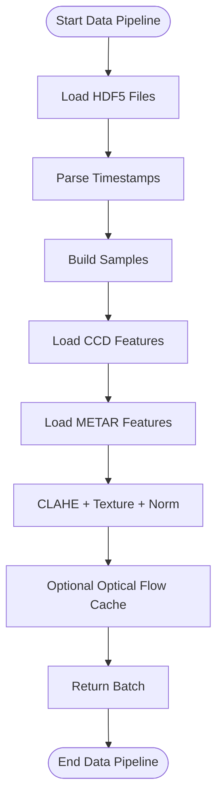

**Diagram sources**
- [dataset_ts_final.py:47-200](file://dataset_ts_final.py#L47-L200)
- [utils_preprocessing.py:16-162](file://utils_preprocessing.py#L16-L162)

**Section sources**
- [dataset_ts_final.py:47-200](file://dataset_ts_final.py#L47-L200)
- [utils_preprocessing.py:16-162](file://utils_preprocessing.py#L16-L162)

### Code Quality & Software Engineering Audit
Key findings include:
- Dead code: SqueezeExcitation, FlowCNN, ImprovedImageTransform, duplicate run_inference.
- Fragile tuple unpacking across consumers of model outputs.
- Identity bug in lead-time weighted metric computation.
- Missing configuration keys for operational flags.
- Recommendations to simplify and remove redundant code paths.

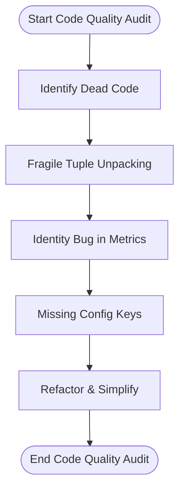

**Diagram sources**
- [audit_report_part1.md:109-159](file://audit_report_part1.md#L109-L159)
- [model_ts_final.py:68-335](file://model_ts_final.py#L68-L335)

**Section sources**
- [audit_report_part1.md:109-159](file://audit_report_part1.md#L109-L159)
- [model_ts_final.py:68-335](file://model_ts_final.py#L68-L335)

### Performance Profiling
The audit assesses:
- CPU feasibility for training and inference.
- RAM usage and cache tuning.
- MC Dropout computational cost and operational feasibility.
- Recommendations for vectorization, caching, and mixed precision.

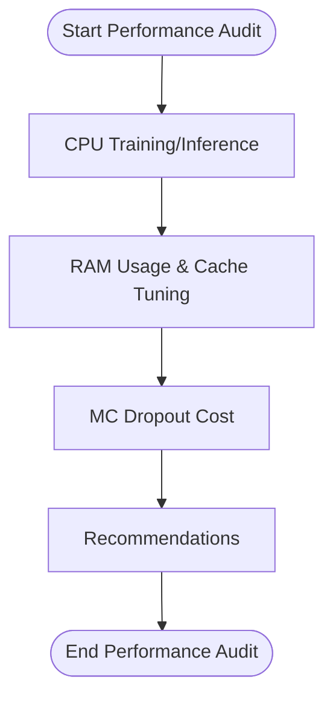

**Diagram sources**
- [audit_report_part1.md:162-286](file://audit_report_part1.md#L162-L286)

**Section sources**
- [audit_report_part1.md:162-286](file://audit_report_part1.md#L162-L286)

## Dependency Analysis
The following diagram maps key dependencies among major components:

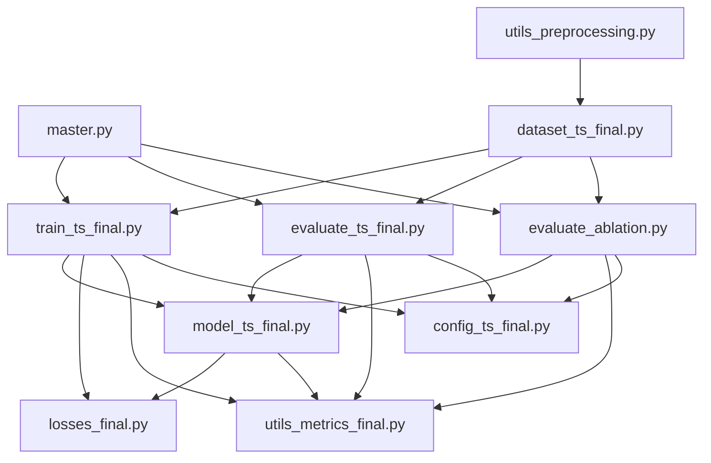

**Diagram sources**
- [master.py:75-98](file://master.py#L75-L98)
- [train_ts_final.py:142-200](file://train_ts_final.py#L142-L200)
- [evaluate_ts_final.py:1-200](file://evaluate_ts_final.py#L1-200)
- [evaluate_ablation.py:1-200](file://evaluate_ablation.py#L1-L200)
- [model_ts_final.py:68-335](file://model_ts_final.py#L68-L335)
- [losses_final.py:13-258](file://losses_final.py#L13-L258)
- [utils_metrics_final.py:1-200](file://utils_metrics_final.py#L1-L200)
- [config_ts_final.py:16-208](file://config_ts_final.py#L16-L208)
- [dataset_ts_final.py:47-200](file://dataset_ts_final.py#L47-L200)
- [utils_preprocessing.py:1-162](file://utils_preprocessing.py#L1-L162)

**Section sources**
- [master.py:75-98](file://master.py#L75-L98)
- [train_ts_final.py:142-200](file://train_ts_final.py#L142-L200)
- [evaluate_ts_final.py:1-200](file://evaluate_ts_final.py#L1-200)
- [evaluate_ablation.py:1-200](file://evaluate_ablation.py#L1-L200)
- [model_ts_final.py:68-335](file://model_ts_final.py#L68-L335)
- [losses_final.py:13-258](file://losses_final.py#L13-L258)
- [utils_metrics_final.py:1-200](file://utils_metrics_final.py#L1-L200)
- [config_ts_final.py:16-208](file://config_ts_final.py#L16-L208)
- [dataset_ts_final.py:47-200](file://dataset_ts_final.py#L47-L200)
- [utils_preprocessing.py:1-162](file://utils_preprocessing.py#L1-L162)

## Performance Considerations
- Parameter efficiency: GRU-based architecture is more efficient than Transformer for this dataset and task.
- Overfitting mitigation: Freezing backbone layers, dropout, and SWA improve generalization.
- Computational cost: MC Dropout is expensive; reduce samples for operational deployment.
- Data scale vs. model complexity: The model complexity aligns with the dataset size.

[No sources needed since this section provides general guidance]

## Troubleshooting Guide
Common issues and fixes identified in audits:
- Heteroscedastic loss bypasses focal loss: integrate uncertainty into focal loss formulation.
- Invalid temporal consistency loss: remove or implement properly within sequences.
- Intensity regression cold-cloud term: replace inverted formula with physically meaningful scaling.
- ECE computation on wrong probabilities: compute ECE on calibrated probabilities.
- SHAP severity filter: align with current taxonomy.
- lt_wCSI_event identity bug: implement lead-time weighting or switch to wCSI_evt.

**Section sources**
- [audit_report_part1.md:24-96](file://audit_report_part1.md#L24-L96)
- [audit_report_part1.md:133-159](file://audit_report_part1.md#L133-L159)
- [audit_report_part1.md:300-320](file://audit_report_part1.md#L300-L320)

## Conclusion
The Nagpur TS Nowcasting pipeline demonstrates a scientifically sound, operationally feasible architecture with room for targeted simplifications and fixes. The audit methodology outlined here—covering scientific validity, data integrity, model coherence, training rigor, evaluation fidelity, code quality, and performance—provides a robust framework for continuous improvement. By addressing critical issues (heteroscedastic integration, temporal consistency, intensity regression, and metric identity), and by leveraging automated evaluation (ablation studies, ensemble averaging), the system can achieve improved generalization and operational readiness.

[No sources needed since this section summarizes without analyzing specific files]

## Appendices

### Audit Report Structure
The audit report is organized into:
- Executive Summary
- Overall Risk Assessment
- Scientific Validity Findings
- Data Pipeline Findings
- Model Architecture Findings
- Training Procedure Findings
- Evaluation Findings
- Code Quality Findings
- Performance Bottlenecks
- Hidden Bugs / High-Risk Issues
- Priority Fix List (Critical → Low)
- Recommended Future Architecture
- Recommended Experiments
- Deployment Readiness Assessment
- Estimated Performance Ceiling of Current Approach
- Final Recommendation

**Section sources**
- [audit_prompt.md:295-342](file://audit_prompt.md#L295-L342)

### Technical Risk Assessment
- Scientific validity: 6–7/10 with critical flaws in loss integration and temporal consistency.
- Architecture coherence: 7/10 with dead code and fragile patterns.
- Operational feasibility: 8/10 with CPU-viable performance; RAM cache tuning needed.
- Logical consistency: 6/10 with calibration scale mismatch and metric identity bug.
- Goal alignment: 7/10 preserving core mission while addressing research drift.

**Section sources**
- [audit_report_part1.md:12-19](file://audit_report_part1.md#L12-L19)

### Security Considerations
- Data leakage: No temporal leakage in splits; validation threshold derived from validation only.
- Robustness: Class-balanced sampling and OHEM mitigate class imbalance; temporal smoothing reduces noise.
- Calibration: Use Platt scaling or temperature scaling; ensure ECE computed on calibrated probabilities.

**Section sources**
- [audit_report_part1.md:252-271](file://audit_report_part1.md#L252-L271)
- [audit_report_part1.md:201-214](file://audit_report_part1.md#L201-L214)

### Maintainability Scoring
- Maintainability score: 6–7/10 with room for simplification and removal of dead code.
- Technical debt assessment: High due to dead code, fragile tuple unpacking, and identity bugs.
- Refactoring priorities: Remove dead code, fix metric identity, integrate heteroscedastic loss, and add missing config keys.

**Section sources**
- [audit_report_part1.md:228-250](file://audit_report_part1.md#L228-L250)
- [audit_report_part1.md:289-320](file://audit_report_part1.md#L289-L320)

### Peer Review Guidance
- Establish review criteria aligned with the audit prompt domains.
- Focus on scientific validity, architectural coherence, and operational feasibility.
- Require evidence-based fixes and reproducible experiments.
- Encourage documentation of decisions and trade-offs.

**Section sources**
- [audit_prompt.md:24-342](file://audit_prompt.md#L24-L342)

### Audit Automation Tools
- Automated evaluation: Ablation study scripts and ensemble evaluation.
- Logging and reproducibility: Deterministic seeds and Tee logging.
- Continuous monitoring: Post-training metrics and plots; consider adding ECE and reliability diagrams.

**Section sources**
- [evaluate_ablation.py:119-154](file://evaluate_ablation.py#L119-L154)
- [train_ts_final.py:48-74](file://train_ts_final.py#L48-L74)
- [evaluate_ts_final.py:41-96](file://evaluate_ts_final.py#L41-L96)

### Continuous Monitoring Approaches
- Real-time monitoring: Track prediction drift and performance degradation in production.
- Threshold adaptation: Re-evaluate thresholds periodically on validation-like data.
- Model retraining triggers: Define metrics and timelines for retraining.

**Section sources**
- [audit_report_part1.md:341-357](file://audit_report_part1.md#L341-L357)

### Stakeholder Engagement Strategies
- Technical governance: Document standards, review outcomes, and remediation plans.
- Quality assurance: Align metrics with operational goals (lead-time, POD, FAR).
- Communication: Present findings and recommendations in accessible formats (audit summaries).

**Section sources**
- [comprehensive_model_audit.md:19-369](file://reports/comprehensive_model_audit.md#L19-L369)