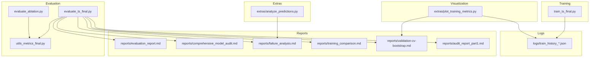
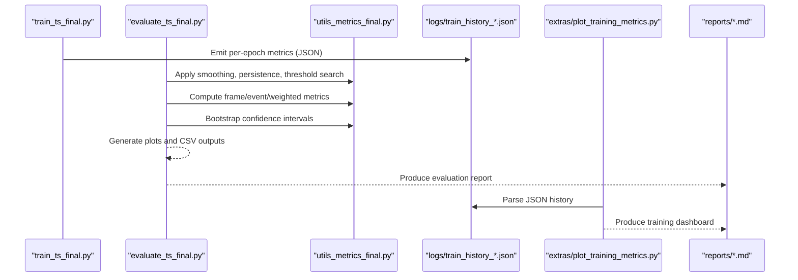
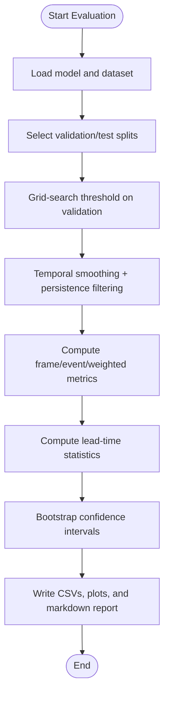
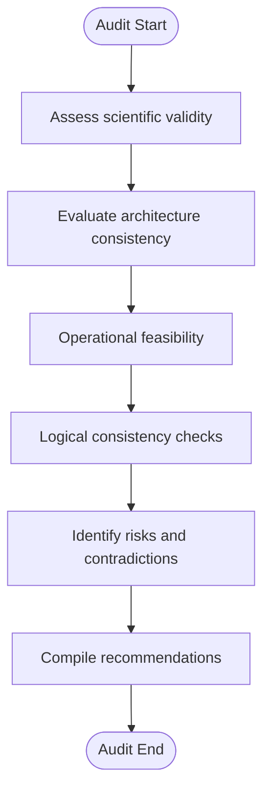
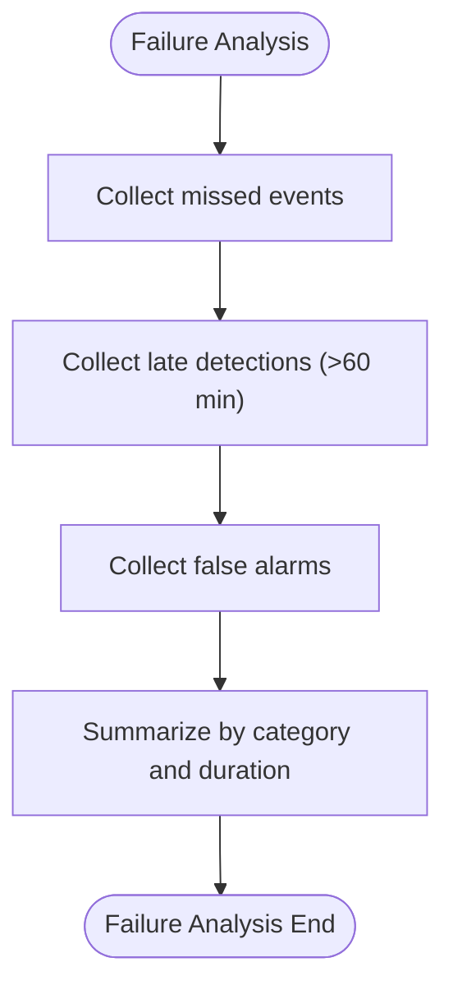
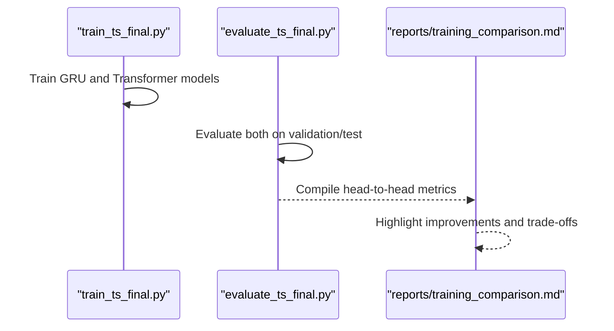
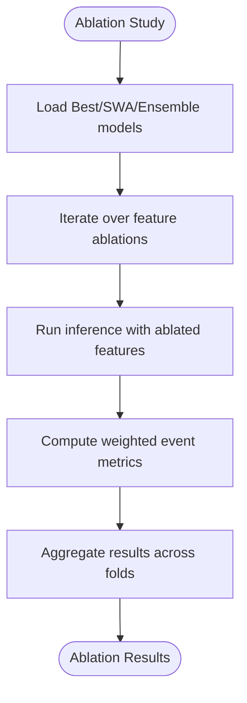
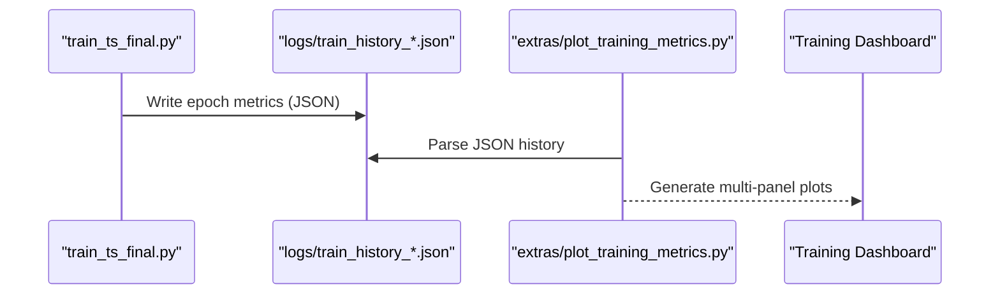
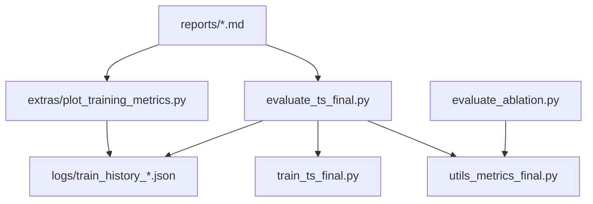

# Performance Reports & Analysis

<cite>
**Referenced Files in This Document**
- [evaluate_ts_final.py](file://evaluate_ts_final.py)
- [evaluate_ablation.py](file://evaluate_ablation.py)
- [utils_metrics_final.py](file://utils_metrics_final.py)
- [train_ts_final.py](file://train_ts_final.py)
- [plot_training_metrics.py](file://extras/plot_training_metrics.py)
- [logs/train_history_20260522_114526.json](file://logs/train_history_20260522_114526.json)
- [reports/evaluation_report.md](file://reports/evaluation_report.md)
- [reports/comprehensive_model_audit.md](file://reports/comprehensive_model_audit.md)
- [reports/failure_analysis.md](file://reports/failure_analysis.md)
- [reports/training_comparison.md](file://reports/training_comparison.md)
- [reports/validation-cv-bootstrap.md](file://reports/validation-cv-bootstrap.md)
- [reports/audit_report_part1.md](file://reports/audit_report_part1.md)
- [extras/analyze_predictions.py](file://extras/analyze_predictions.py)
- [extras/plot_training_metrics.py](file://extras/plot_training_metrics.py)
</cite>

## Table of Contents
1. [Introduction](#introduction)
2. [Project Structure](#project-structure)
3. [Core Components](#core-components)
4. [Architecture Overview](#architecture-overview)
5. [Detailed Component Analysis](#detailed-component-analysis)
6. [Dependency Analysis](#dependency-analysis)
7. [Performance Considerations](#performance-considerations)
8. [Troubleshooting Guide](#troubleshooting-guide)
9. [Conclusion](#conclusion)
10. [Appendices](#appendices)

## Introduction
This document consolidates the performance reporting and analysis framework for the Nagpur TS Nowcasting project. It explains how evaluation reports are structured, how model audits are conducted, how failures are analyzed, and how training comparisons are produced. It also documents the logging and visualization systems used for tracking training history, enabling reproducible experiments, and monitoring performance over time. Guidance is included for interpreting performance trends, identifying improvement opportunities, and making data-driven decisions, along with automation and dashboard integration strategies for stakeholders.

## Project Structure
The repository organizes performance reporting across:
- Evaluation scripts that compute metrics, generate plots, and export bootstrap confidence intervals
- Ablation and ensemble evaluation utilities for comparative benchmarking
- Metrics utilities implementing temporal smoothing, persistence filtering, event-level scoring, and lead-time analysis
- Training utilities supporting walk-forward cross-validation and model selection
- Logging and visualization tools for training history tracking and dashboard generation
- Reports capturing evaluation summaries, audits, failure analyses, and training comparisons

**Diagram sources**
- [evaluate_ts_final.py:1-908](file://evaluate_ts_final.py#L1-L908)
- [evaluate_ablation.py:1-307](file://evaluate_ablation.py#L1-L307)
- [utils_metrics_final.py:1-760](file://utils_metrics_final.py#L1-L760)
- [train_ts_final.py](file://train_ts_final.py)
- [extras/plot_training_metrics.py:1-464](file://extras/plot_training_metrics.py#L1-L464)
- [logs/train_history_20260522_114526.json:1-527](file://logs/train_history_20260522_114526.json#L1-L527)
- [reports/evaluation_report.md:1-58](file://reports/evaluation_report.md#L1-L58)
- [reports/comprehensive_model_audit.md:1-369](file://reports/comprehensive_model_audit.md#L1-L369)
- [reports/failure_analysis.md:1-71](file://reports/failure_analysis.md#L1-L71)
- [reports/training_comparison.md:1-153](file://reports/training_comparison.md#L1-L153)
- [reports/validation-cv-bootstrap.md:1-89](file://reports/validation-cv-bootstrap.md#L1-L89)
- [reports/audit_report_part1.md:1-384](file://reports/audit_report_part1.md#L1-L384)
- [extras/analyze_predictions.py:1-64](file://extras/analyze_predictions.py#L1-L64)

**Section sources**
- [evaluate_ts_final.py:1-908](file://evaluate_ts_final.py#L1-L908)
- [evaluate_ablation.py:1-307](file://evaluate_ablation.py#L1-L307)
- [utils_metrics_final.py:1-760](file://utils_metrics_final.py#L1-L760)
- [train_ts_final.py](file://train_ts_final.py)
- [extras/plot_training_metrics.py:1-464](file://extras/plot_training_metrics.py#L1-L464)
- [logs/train_history_20260522_114526.json:1-527](file://logs/train_history_20260522_114526.json#L1-L527)
- [reports/evaluation_report.md:1-58](file://reports/evaluation_report.md#L1-L58)
- [reports/comprehensive_model_audit.md:1-369](file://reports/comprehensive_model_audit.md#L1-L369)
- [reports/failure_analysis.md:1-71](file://reports/failure_analysis.md#L1-L71)
- [reports/training_comparison.md:1-153](file://reports/training_comparison.md#L1-L153)
- [reports/validation-cv-bootstrap.md:1-89](file://reports/validation-cv-bootstrap.md#L1-L89)
- [reports/audit_report_part1.md:1-384](file://reports/audit_report_part1.md#L1-L384)
- [extras/analyze_predictions.py:1-64](file://extras/analyze_predictions.py#L1-L64)

## Core Components
- Evaluation pipeline: computes frame/event/weighted metrics, applies temporal smoothing and persistence filtering, derives thresholds from validation, and prints confidence intervals via bootstrap.
- Metrics utilities: implements smoothing, persistence, event-level scoring, lead-time statistics, and bootstrap confidence estimation.
- Ablation and ensemble evaluation: systematically removes input features or combines best and SWA models to assess feature contributions.
- Training utilities: supports walk-forward CV, model selection by weighted CSI, and emits JSON training histories for visualization.
- Visualization and logging: parses training logs and JSON histories to generate dashboards and track performance trends.
- Reports: consolidate evaluation summaries, audits, failure analyses, and training comparisons for stakeholder consumption.

**Section sources**
- [evaluate_ts_final.py:1-908](file://evaluate_ts_final.py#L1-L908)
- [utils_metrics_final.py:1-760](file://utils_metrics_final.py#L1-L760)
- [evaluate_ablation.py:1-307](file://evaluate_ablation.py#L1-L307)
- [train_ts_final.py](file://train_ts_final.py)
- [extras/plot_training_metrics.py:1-464](file://extras/plot_training_metrics.py#L1-L464)

## Architecture Overview
The evaluation and reporting pipeline integrates training, evaluation, and visualization:

**Diagram sources**
- [train_ts_final.py](file://train_ts_final.py)
- [evaluate_ts_final.py:1-908](file://evaluate_ts_final.py#L1-L908)
- [utils_metrics_final.py:1-760](file://utils_metrics_final.py#L1-L760)
- [extras/plot_training_metrics.py:1-464](file://extras/plot_training_metrics.py#L1-L464)
- [logs/train_history_20260522_114526.json:1-527](file://logs/train_history_20260522_114526.json#L1-L527)

## Detailed Component Analysis

### Evaluation Report Structure
The evaluation report compiles:
- Global metric evaluation across frame-level and event-level scores
- Weighted event metrics emphasizing severity and lead-time bonuses
- Lead-time statistics and early/later detection rates
- Severity breakdown and missed-event analysis
- Bootstrapped confidence intervals for robustness

**Diagram sources**
- [evaluate_ts_final.py:1-908](file://evaluate_ts_final.py#L1-L908)
- [utils_metrics_final.py:1-760](file://utils_metrics_final.py#L1-L760)

**Section sources**
- [evaluate_ts_final.py:1-908](file://evaluate_ts_final.py#L1-L908)
- [reports/evaluation_report.md:1-58](file://reports/evaluation_report.md#L1-L58)

### Comprehensive Model Audit
The audit assesses scientific validity, architecture coherence, operational feasibility, and logical consistency. It identifies critical flaws (e.g., focal loss bypass, invalid temporal consistency loss, inverted intensity regression term) and recommends simplifications and immediate fixes.

**Diagram sources**
- [reports/audit_report_part1.md:1-384](file://reports/audit_report_part1.md#L1-L384)

**Section sources**
- [reports/audit_report_part1.md:1-384](file://reports/audit_report_part1.md#L1-L384)

### Failure Analysis Methodology
Failure analysis catalogs missed events, late detections, and false alarms with severity and duration context. It supports bias detection by severity categories and edge-case handling by month and event characteristics.

**Diagram sources**
- [reports/failure_analysis.md:1-71](file://reports/failure_analysis.md#L1-L71)

**Section sources**
- [reports/failure_analysis.md:1-71](file://reports/failure_analysis.md#L1-L71)

### Training Comparison Reports
Training comparisons compare architectures (e.g., GRU vs Transformer) across validation and test sets, highlighting detection power, false alarm rates, and generalization. They guide decisions on whether to adopt new architectures pending fixes.

**Diagram sources**
- [reports/training_comparison.md:1-153](file://reports/training_comparison.md#L1-L153)
- [train_ts_final.py](file://train_ts_final.py)
- [evaluate_ts_final.py:1-908](file://evaluate_ts_final.py#L1-L908)

**Section sources**
- [reports/training_comparison.md:1-153](file://reports/training_comparison.md#L1-L153)

### Ablation Studies and Feature Contributions
Ablation systematically disables input features and measures weighted event metrics to rank feature contributions. It informs architectural decisions and technical debt assessments.

**Diagram sources**
- [evaluate_ablation.py:1-307](file://evaluate_ablation.py#L1-L307)
- [utils_metrics_final.py:1-760](file://utils_metrics_final.py#L1-L760)

**Section sources**
- [evaluate_ablation.py:1-307](file://evaluate_ablation.py#L1-L307)
- [utils_metrics_final.py:1-760](file://utils_metrics_final.py#L1-L760)

### Log Management and Training History Tracking
Training logs emit structured JSON histories with per-epoch metrics, enabling automated dashboards and trend analysis. The plotting utility parses logs and generates multi-panel dashboards.

**Diagram sources**
- [train_ts_final.py](file://train_ts_final.py)
- [logs/train_history_20260522_114526.json:1-527](file://logs/train_history_20260522_114526.json#L1-L527)
- [extras/plot_training_metrics.py:1-464](file://extras/plot_training_metrics.py#L1-L464)

**Section sources**
- [logs/train_history_20260522_114526.json:1-527](file://logs/train_history_20260522_114526.json#L1-L527)
- [extras/plot_training_metrics.py:1-464](file://extras/plot_training_metrics.py#L1-L464)

## Dependency Analysis
The evaluation pipeline depends on metrics utilities for post-processing and scoring, and on training utilities for model selection and logging. Visualization depends on training logs and JSON histories.

**Diagram sources**
- [evaluate_ts_final.py:1-908](file://evaluate_ts_final.py#L1-L908)
- [utils_metrics_final.py:1-760](file://utils_metrics_final.py#L1-L760)
- [train_ts_final.py](file://train_ts_final.py)
- [extras/plot_training_metrics.py:1-464](file://extras/plot_training_metrics.py#L1-L464)
- [logs/train_history_20260522_114526.json:1-527](file://logs/train_history_20260522_114526.json#L1-L527)
- [evaluate_ablation.py:1-307](file://evaluate_ablation.py#L1-L307)

**Section sources**
- [evaluate_ts_final.py:1-908](file://evaluate_ts_final.py#L1-L908)
- [utils_metrics_final.py:1-760](file://utils_metrics_final.py#L1-L760)
- [train_ts_final.py](file://train_ts_final.py)
- [extras/plot_training_metrics.py:1-464](file://extras/plot_training_metrics.py#L1-L464)
- [logs/train_history_20260522_114526.json:1-527](file://logs/train_history_20260522_114526.json#L1-L527)
- [evaluate_ablation.py:1-307](file://evaluate_ablation.py#L1-L307)

## Performance Considerations
- Overfitting detection: monitor validation loss growth and generalization gaps; consider earlier stopping and stronger regularization.
- Probability calibration: apply Platt scaling or temperature scaling to improve reliability and reduce “everything looks 0.6” behavior.
- Threshold selection: optimize on validation using weighted CSI or lead-time weighted CSI; ensure consistency between training and evaluation thresholds.
- Persistence filtering: tune minimum event length to balance false alarms and missed detections.
- Temporal smoothing: use exponential moving average to suppress temporal chattering without losing true transitions.
- Computational efficiency: reduce Monte Carlo dropout samples for operational deployment; prefer simpler temporal modules when feature projection dominates.

[No sources needed since this section provides general guidance]

## Troubleshooting Guide
Common issues and resolutions:
- Threshold mismatch between training and evaluation: ensure the same threshold is used across stages; calibrate probabilities consistently.
- Invalid temporal consistency loss: remove or fix to penalize temporal chattering within sequences rather than across random batches.
- Inverted intensity regression term: correct cold-cloud term to reflect physical brightness temperature conventions.
- Phantom lead-time weighted CSI: implement or switch to actual weighted CSI; verify metric identity.
- Missing configuration flags: add missing keys for uncertainty and calibration to avoid silent defaults.
- Dead code and redundant tuple unpacking: remove unused components and unify model return signatures.

**Section sources**
- [reports/audit_report_part1.md:1-384](file://reports/audit_report_part1.md#L1-L384)

## Conclusion
The Nagpur TS Nowcasting pipeline provides a robust foundation for performance reporting and analysis. By integrating walk-forward cross-validation, weighted event metrics, lead-time analysis, and bootstrap confidence intervals, teams can make informed decisions about model improvements. The audit highlights critical scientific and architectural issues that must be addressed before operational deployment. With targeted fixes and continued emphasis on reproducibility and visualization, the system can deliver reliable, interpretable nowcasting results for operational use.

[No sources needed since this section summarizes without analyzing specific files]

## Appendices

### Reporting Automation and Dashboard Integration
- Automated evaluation: run evaluation scripts with fold selection and bootstrap CI printing.
- Training dashboards: use the plotting utility to generate multi-panel dashboards from JSON histories.
- Stakeholder communication: curate markdown reports summarizing evaluation, audits, and comparisons; include actionable recommendations and next steps.

**Section sources**
- [reports/validation-cv-bootstrap.md:1-89](file://reports/validation-cv-bootstrap.md#L1-L89)
- [extras/plot_training_metrics.py:1-464](file://extras/plot_training_metrics.py#L1-L464)

### Interpreting Performance Trends and Making Decisions
- Monitor weighted CSI and lead-time statistics; prioritize improvements that enhance both detection and timeliness.
- Investigate severe-event biases and seasonal gaps; augment training data or adjust sampling strategies.
- Use bootstrap confidence intervals to assess statistical significance of changes across folds.
- Align model selection criteria with operational goals (e.g., aviation safety score, early detection rates).

**Section sources**
- [utils_metrics_final.py:1-760](file://utils_metrics_final.py#L1-L760)
- [reports/comprehensive_model_audit.md:1-369](file://reports/comprehensive_model_audit.md#L1-L369)
- [reports/training_comparison.md:1-153](file://reports/training_comparison.md#L1-L153)