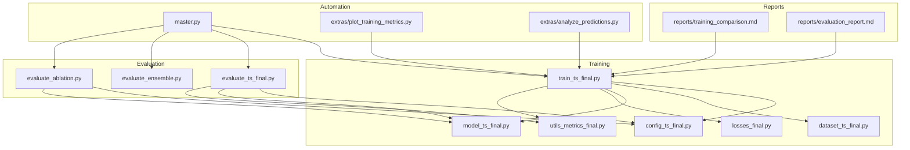
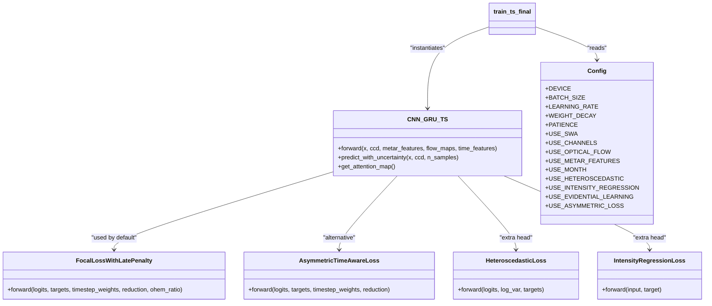
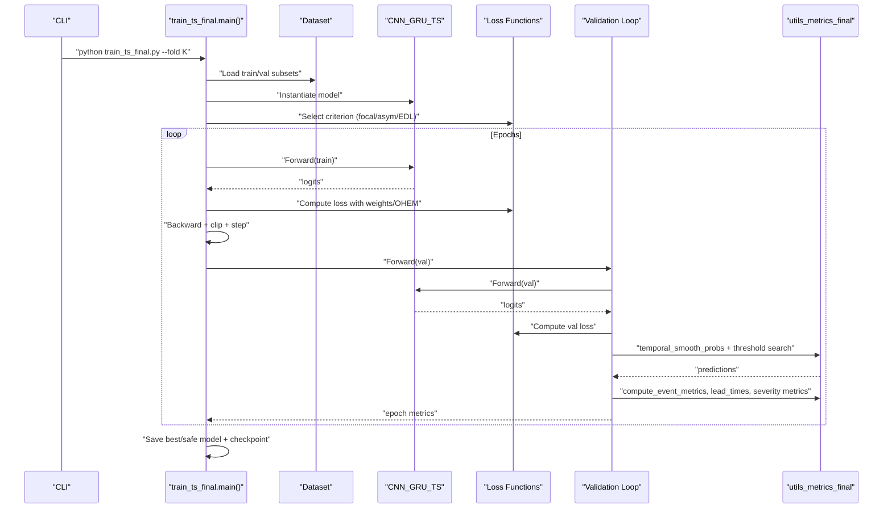
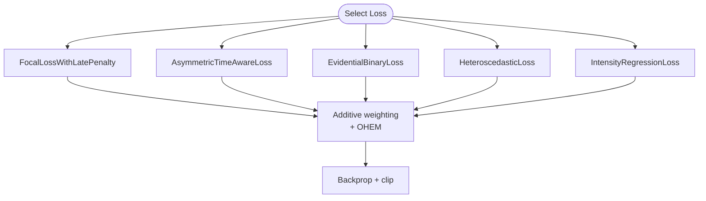
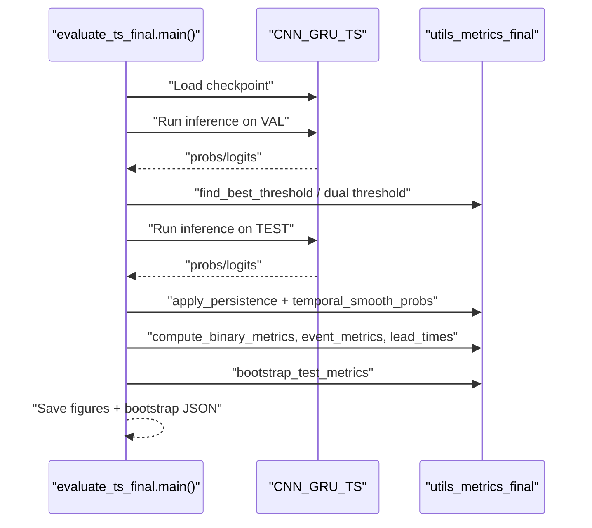
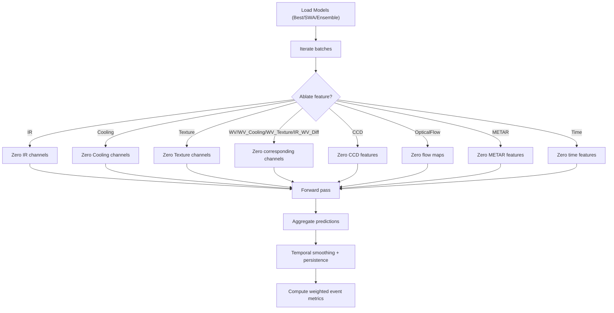
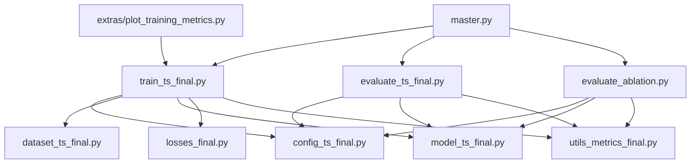

# Training Comparisons & Experimental Analysis

<cite>
**Referenced Files in This Document**
- [train_ts_final.py](file://train_ts_final.py)
- [evaluate_ts_final.py](file://evaluate_ts_final.py)
- [evaluate_ablation.py](file://evaluate_ablation.py)
- [model_ts_final.py](file://model_ts_final.py)
- [losses_final.py](file://losses_final.py)
- [config_ts_final.py](file://config_ts_final.py)
- [utils_metrics_final.py](file://utils_metrics_final.py)
- [master.py](file://master.py)
- [extras/plot_training_metrics.py](file://extras/plot_training_metrics.py)
- [extras/analyze_predictions.py](file://extras/analyze_predictions.py)
- [reports/training_comparison.md](file://reports/training_comparison.md)
- [reports/evaluation_report.md](file://reports/evaluation_report.md)
</cite>

## Table of Contents
1. [Introduction](#introduction)
2. [Project Structure](#project-structure)
3. [Core Components](#core-components)
4. [Architecture Overview](#architecture-overview)
5. [Detailed Component Analysis](#detailed-component-analysis)
6. [Dependency Analysis](#dependency-analysis)
7. [Performance Considerations](#performance-considerations)
8. [Troubleshooting Guide](#troubleshooting-guide)
9. [Conclusion](#conclusion)
10. [Appendices](#appendices)

## Introduction
This document provides a comprehensive guide to designing, executing, and analyzing training comparisons for the Nagpur Thunderstorm Nowcasting system. It covers experimental methodology, hyperparameter sensitivity analysis, comparative performance evaluation, ablation studies, and operational automation. It also explains how to interpret training dynamics, optimize convergence, and track results reproducibly across runs.

## Project Structure
The repository organizes training, evaluation, and analysis utilities into focused modules:
- Training: [train_ts_final.py](file://train_ts_final.py) orchestrates dataset loading, model training, validation, and checkpointing.
- Evaluation: [evaluate_ts_final.py](file://evaluate_ts_final.py) computes metrics, visualizations, and bootstrap confidence intervals on held-out test sets.
- Ablation: [evaluate_ablation.py](file://evaluate_ablation.py) isolates the contribution of each input feature.
- Model: [model_ts_final.py](file://model_ts_final.py) defines the CNN-GRU architecture with optional uncertainty heads.
- Losses: [losses_final.py](file://losses_final.py) implements focal loss variants, temporal consistency, heteroscedastic, and intensity regression losses.
- Configuration: [config_ts_final.py](file://config_ts_final.py) centralizes hyperparameters and runtime settings.
- Metrics: [utils_metrics_final.py](file://utils_metrics_final.py) implements temporal smoothing, persistence filtering, and event/frame metrics.
- Automation: [master.py](file://master.py) automates end-to-end pipelines across training, evaluation, and ablation.
- Visualization: [extras/plot_training_metrics.py](file://extras/plot_training_metrics.py) parses logs and produces training dashboards.
- Reports: [reports/training_comparison.md](file://reports/training_comparison.md) and [reports/evaluation_report.md](file://reports/evaluation_report.md) document comparative findings.

**Diagram sources**
- [train_ts_final.py:142-757](file://train_ts_final.py#L142-L757)
- [evaluate_ts_final.py:361-908](file://evaluate_ts_final.py#L361-L908)
- [evaluate_ablation.py:172-307](file://evaluate_ablation.py#L172-L307)
- [model_ts_final.py:68-335](file://model_ts_final.py#L68-L335)
- [losses_final.py:13-258](file://losses_final.py#L13-L258)
- [config_ts_final.py:16-208](file://config_ts_final.py#L16-L208)
- [utils_metrics_final.py:1-200](file://utils_metrics_final.py#L1-L200)
- [master.py:1-108](file://master.py#L1-L108)
- [extras/plot_training_metrics.py:1-464](file://extras/plot_training_metrics.py#L1-L464)
- [extras/analyze_predictions.py:1-64](file://extras/analyze_predictions.py#L1-L64)
- [reports/training_comparison.md:1-153](file://reports/training_comparison.md#L1-L153)
- [reports/evaluation_report.md:1-58](file://reports/evaluation_report.md#L1-L58)

**Section sources**
- [train_ts_final.py:142-757](file://train_ts_final.py#L142-L757)
- [evaluate_ts_final.py:361-908](file://evaluate_ts_final.py#L361-L908)
- [evaluate_ablation.py:172-307](file://evaluate_ablation.py#L172-L307)
- [model_ts_final.py:68-335](file://model_ts_final.py#L68-L335)
- [losses_final.py:13-258](file://losses_final.py#L13-L258)
- [config_ts_final.py:16-208](file://config_ts_final.py#L16-L208)
- [utils_metrics_final.py:1-200](file://utils_metrics_final.py#L1-L200)
- [master.py:1-108](file://master.py#L1-L108)
- [extras/plot_training_metrics.py:1-464](file://extras/plot_training_metrics.py#L1-L464)
- [extras/analyze_predictions.py:1-64](file://extras/analyze_predictions.py#L1-L64)
- [reports/training_comparison.md:1-153](file://reports/training_comparison.md#L1-L153)
- [reports/evaluation_report.md:1-58](file://reports/evaluation_report.md#L1-L58)

## Core Components
- Training loop and scheduling: Implements warmup cosine learning rate schedule, early stopping, and optional SWA with custom BN update.
- Loss functions: Focal loss with late penalty, optional OHEM, and configurable asymmetric/time-aware variants; heteroscedastic and intensity regression losses.
- Post-processing: Temporal smoothing, persistence filtering, and threshold optimization for weighted event metrics.
- Evaluation: Frame/event metrics, lead-time statistics, severity breakdown, and bootstrap confidence intervals.
- Ablation: Feature ablation across image channels, optical flow, METAR, and time features.
- Automation: Master pipeline to run training, evaluation, ensemble, and ablation sequentially.

**Section sources**
- [train_ts_final.py:80-136](file://train_ts_final.py#L80-L136)
- [train_ts_final.py:285-329](file://train_ts_final.py#L285-L329)
- [train_ts_final.py:432-449](file://train_ts_final.py#L432-L449)
- [train_ts_final.py:511-598](file://train_ts_final.py#L511-L598)
- [evaluate_ts_final.py:285-324](file://evaluate_ts_final.py#L285-L324)
- [evaluate_ts_final.py:501-601](file://evaluate_ts_final.py#L501-L601)
- [evaluate_ts_final.py:741-800](file://evaluate_ts_final.py#L741-L800)
- [evaluate_ablation.py:38-117](file://evaluate_ablation.py#L38-L117)
- [evaluate_ablation.py:119-154](file://evaluate_ablation.py#L119-L154)
- [master.py:17-38](file://master.py#L17-L38)

## Architecture Overview
The system integrates a CNN backbone with spatial skip connections, optional optical flow, METAR and time features, and a GRU temporal module. Outputs include a primary binary classifier, optional aleatoric uncertainty, and optional intensity regression.

**Diagram sources**
- [model_ts_final.py:68-335](file://model_ts_final.py#L68-L335)
- [losses_final.py:13-258](file://losses_final.py#L13-L258)
- [train_ts_final.py:285-329](file://train_ts_final.py#L285-L329)
- [config_ts_final.py:16-208](file://config_ts_final.py#L16-L208)

**Section sources**
- [model_ts_final.py:68-335](file://model_ts_final.py#L68-L335)
- [losses_final.py:13-258](file://losses_final.py#L13-L258)
- [train_ts_final.py:285-329](file://train_ts_final.py#L285-L329)
- [config_ts_final.py:16-208](file://config_ts_final.py#L16-L208)

## Detailed Component Analysis

### Training Methodology and Control Flow
- Time-based walk-forward cross-validation splits train/val/test folds deterministically by timestamp.
- Class-balanced sampling with target positive rate and optional seasonal boosts.
- Warmup cosine learning rate schedule; optional SWA with custom BN update; early stopping by validation loss.
- Loss composition: primary classification loss plus optional heteroscedastic and intensity regression terms; additive weighting for late/seasonal severity bonuses.

**Diagram sources**
- [train_ts_final.py:142-757](file://train_ts_final.py#L142-L757)
- [utils_metrics_final.py:23-47](file://utils_metrics_final.py#L23-L47)
- [utils_metrics_final.py:192-200](file://utils_metrics_final.py#L192-L200)

**Section sources**
- [train_ts_final.py:204-234](file://train_ts_final.py#L204-L234)
- [train_ts_final.py:244-277](file://train_ts_final.py#L244-L277)
- [train_ts_final.py:313-329](file://train_ts_final.py#L313-L329)
- [train_ts_final.py:432-449](file://train_ts_final.py#L432-L449)
- [train_ts_final.py:511-598](file://train_ts_final.py#L511-L598)

### Loss Function Comparisons
- Focal loss with late penalty and optional OHEM for robustness to class imbalance and hard negatives.
- Asymmetric time-aware loss to penalize misses and high-confidence false alarms differently, with anticipation rewards for early triggers.
- Evidential deep learning loss for probabilistic modeling with KL regularization and optional asymmetric weighting.
- Heteroscedastic loss for aleatoric uncertainty; intensity regression loss for continuous severity scoring.

**Diagram sources**
- [losses_final.py:13-258](file://losses_final.py#L13-L258)
- [train_ts_final.py:432-449](file://train_ts_final.py#L432-L449)

**Section sources**
- [losses_final.py:13-258](file://losses_final.py#L13-L258)
- [train_ts_final.py:432-449](file://train_ts_final.py#L432-L449)

### Regularization Effect Analysis
- Dropout and layer normalization in feature projection.
- Freezing backbone layers to suppress overfitting.
- SWA for improved generalization; custom BN update for SWA stability.
- Label smoothing and OHEM to reduce overconfidence and focus on hard negatives.

**Section sources**
- [model_ts_final.py:155-161](file://model_ts_final.py#L155-L161)
- [model_ts_final.py:105-111](file://model_ts_final.py#L105-L111)
- [train_ts_final.py:99-136](file://train_ts_final.py#L99-L136)
- [train_ts_final.py:319-329](file://train_ts_final.py#L319-L329)
- [losses_final.py:27-91](file://losses_final.py#L27-L91)

### Comparative Performance Evaluation
- Frame-level metrics (POD, FAR, CSI, ETS, SEDI, F1/F2), event-level metrics (POD, FAR, CSI), weighted event metrics (wPOD, wFAR, wCSI), lead-time statistics, and aviation score.
- Bootstrapped confidence intervals for robust statistical assessment on test sets.
- Walk-forward CV folds to simulate operational conditions.

**Diagram sources**
- [evaluate_ts_final.py:361-908](file://evaluate_ts_final.py#L361-L908)
- [utils_metrics_final.py:23-47](file://utils_metrics_final.py#L23-L47)
- [utils_metrics_final.py:50-77](file://utils_metrics_final.py#L50-L77)
- [utils_metrics_final.py:741-800](file://utils_metrics_final.py#L741-L800)

**Section sources**
- [evaluate_ts_final.py:501-601](file://evaluate_ts_final.py#L501-L601)
- [evaluate_ts_final.py:741-800](file://evaluate_ts_final.py#L741-L800)

### Ablation Study Methodology
- Isolate each input feature/channel by zeroing it out during inference and measuring weighted event metrics.
- Supports single model, SWA, and ensemble ablations.
- Uses the same post-processing pipeline (smoothing + persistence) to ensure fair comparison.

**Diagram sources**
- [evaluate_ablation.py:38-117](file://evaluate_ablation.py#L38-L117)
- [evaluate_ablation.py:119-154](file://evaluate_ablation.py#L119-L154)

**Section sources**
- [evaluate_ablation.py:38-117](file://evaluate_ablation.py#L38-L117)
- [evaluate_ablation.py:119-154](file://evaluate_ablation.py#L119-L154)

### Experimental Design Principles
- Controlled variables: architecture, channels, regularization, and loss configuration are systematically varied.
- Statistical significance: bootstrap confidence intervals on test metrics; paired comparisons across runs.
- Reproducibility: deterministic seeds, explicit configuration, and archived logs/history JSONs.

**Section sources**
- [train_ts_final.py:67-74](file://train_ts_final.py#L67-L74)
- [config_ts_final.py:188-189](file://config_ts_final.py#L188-L189)
- [evaluate_ts_final.py:741-800](file://evaluate_ts_final.py#L741-L800)

### Interpretation of Training Dynamics and Convergence
- Use training dashboards to monitor loss curves, learning rate schedule, frame/event metrics, weighted event metrics, lead times, and aviation score.
- Identify overfitting via rising validation loss and inflated probabilities; mitigate with regularization, SWA, and early stopping.

**Section sources**
- [extras/plot_training_metrics.py:278-436](file://extras/plot_training_metrics.py#L278-L436)
- [reports/training_comparison.md:67-82](file://reports/training_comparison.md#L67-L82)

### Experimental Automation and Result Tracking
- Master pipeline executes training, evaluation (best and SWA), ensemble evaluation, and ablation in sequence.
- Logs and history JSONs are archived per run; training dashboards generated automatically.
- Prediction CSVs and bootstrap metrics are saved for audit and comparison.

**Section sources**
- [master.py:17-38](file://master.py#L17-L38)
- [master.py:69-99](file://master.py#L69-L99)
- [train_ts_final.py:380-382](file://train_ts_final.py#L380-L382)
- [train_ts_final.py:681-693](file://train_ts_final.py#L681-L693)
- [extras/plot_training_metrics.py:442-464](file://extras/plot_training_metrics.py#L442-L464)

## Dependency Analysis
- Training depends on configuration, dataset, model, losses, and metrics utilities.
- Evaluation depends on trained checkpoints and metrics utilities.
- Ablation depends on model and metrics utilities.
- Visualization depends on training logs/history JSONs.

**Diagram sources**
- [train_ts_final.py:142-757](file://train_ts_final.py#L142-L757)
- [evaluate_ts_final.py:361-908](file://evaluate_ts_final.py#L361-L908)
- [evaluate_ablation.py:172-307](file://evaluate_ablation.py#L172-L307)
- [extras/plot_training_metrics.py:1-464](file://extras/plot_training_metrics.py#L1-464)
- [master.py:1-108](file://master.py#L1-L108)

**Section sources**
- [train_ts_final.py:142-757](file://train_ts_final.py#L142-L757)
- [evaluate_ts_final.py:361-908](file://evaluate_ts_final.py#L361-L908)
- [evaluate_ablation.py:172-307](file://evaluate_ablation.py#L172-L307)
- [extras/plot_training_metrics.py:1-464](file://extras/plot_training_metrics.py#L1-L464)
- [master.py:1-108](file://master.py#L1-L108)

## Performance Considerations
- Prefer temporal smoothing and persistence filtering consistently across training and evaluation to avoid off-policy drift.
- Use weighted event metrics (wCSI, wPOD, wFAR) to align with operational priorities.
- Monitor aviation score and early detection rates alongside traditional scores.
- Leverage SWA and calibration to improve generalization and probability reliability.

[No sources needed since this section provides general guidance]

## Troubleshooting Guide
- Overfitting symptoms: rising validation loss, inflated probabilities, poor test performance. Mitigations: increase dropout, reduce learning rate, enable SWA earlier, apply label smoothing/OHEM.
- Poor generalization: consider temperature scaling or Platt scaling; adjust alpha/label smoothing for the chosen loss.
- Inconsistent thresholds: ensure validation-derived thresholds are used in evaluation; avoid test-set leakage.
- Abnormal predictions: verify channel counts and dynamic backbone adaptation; confirm feature gating flags (optical flow, METAR, time).

**Section sources**
- [reports/training_comparison.md:67-82](file://reports/training_comparison.md#L67-L82)
- [evaluate_ts_final.py:501-549](file://evaluate_ts_final.py#L501-L549)
- [model_ts_final.py:82-101](file://model_ts_final.py#L82-L101)

## Conclusion
This repository provides a robust, automated framework for training comparisons, sensitivity analysis, and ablation studies in thunderstorm nowcasting. By controlling variables, applying rigorous evaluation metrics, and leveraging SWA and calibration, teams can accelerate model development, ensure reproducibility, and achieve safer, more reliable operational deployments.

[No sources needed since this section summarizes without analyzing specific files]

## Appendices

### Appendix A: Hyperparameter Sensitivity Analysis Checklist
- Vary learning rate, weight decay, and dropout.
- Compare loss variants: focal vs asymmetric vs EDL.
- Adjust label smoothing, OHEM ratio, and late penalty weight.
- Evaluate regularization strategies: freezing backbone, SWA timing, and augmentation.
- Assess feature contributions: channels, optical flow, METAR, and time features.

[No sources needed since this section provides general guidance]

### Appendix B: Reproducible Experiment Protocol
- Set deterministic seed in configuration.
- Use identical preprocessing and walk-forward CV splits across runs.
- Archive logs, history JSONs, and prediction CSVs.
- Generate training dashboards and bootstrap metrics for statistical comparison.

**Section sources**
- [config_ts_final.py:188-189](file://config_ts_final.py#L188-L189)
- [train_ts_final.py:380-382](file://train_ts_final.py#L380-L382)
- [train_ts_final.py:681-693](file://train_ts_final.py#L681-L693)
- [extras/plot_training_metrics.py:442-464](file://extras/plot_training_metrics.py#L442-L464)