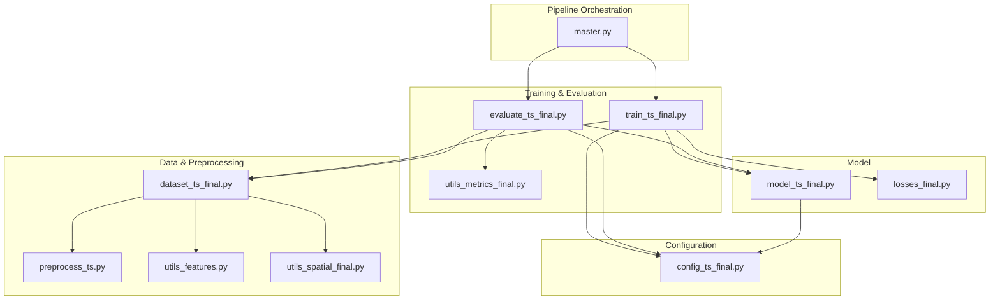
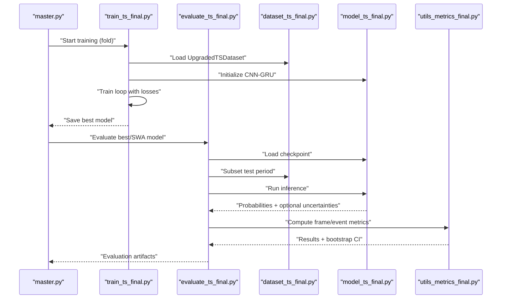
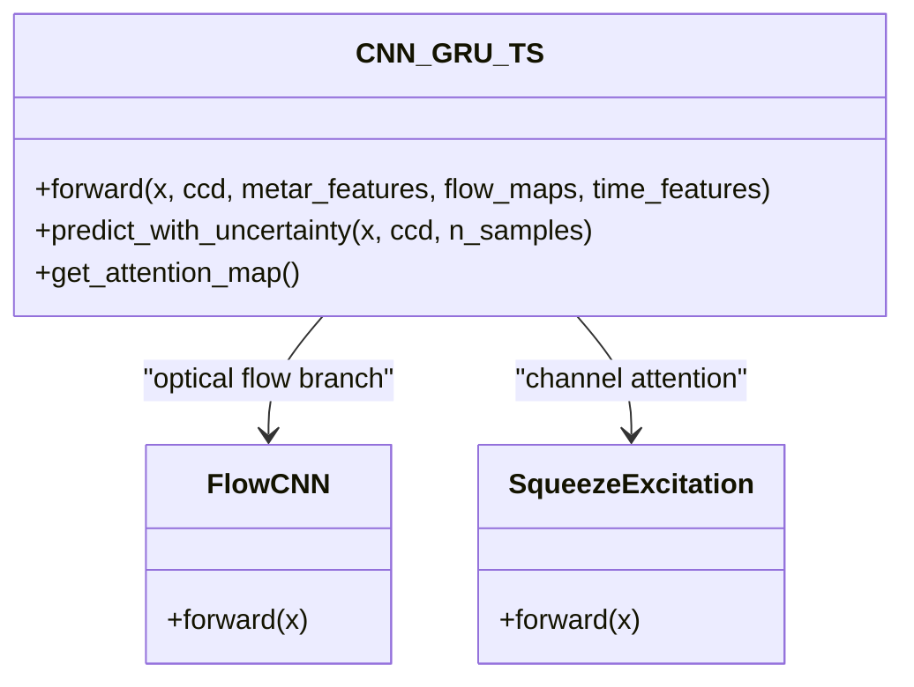
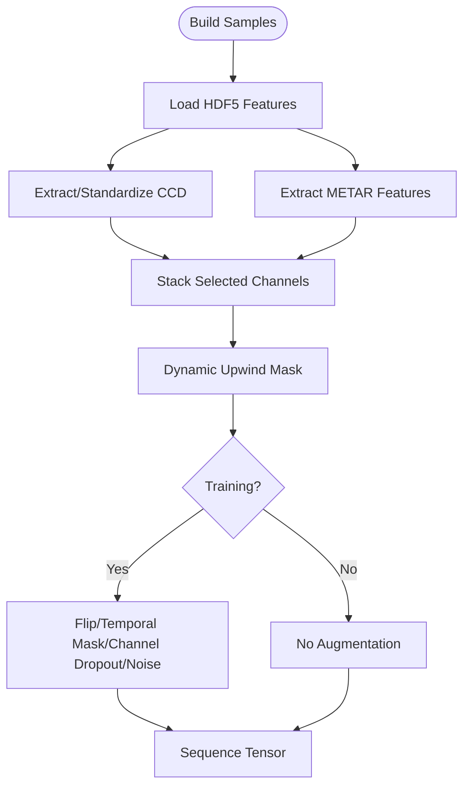
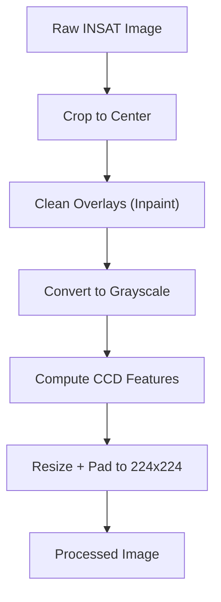
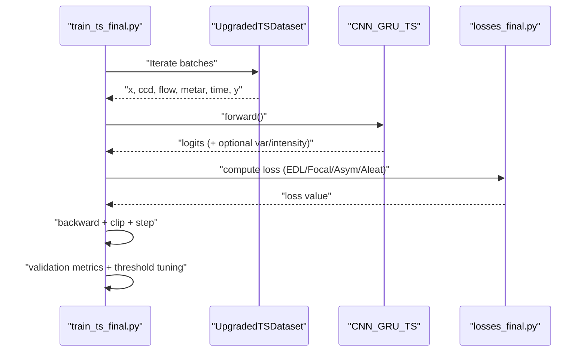
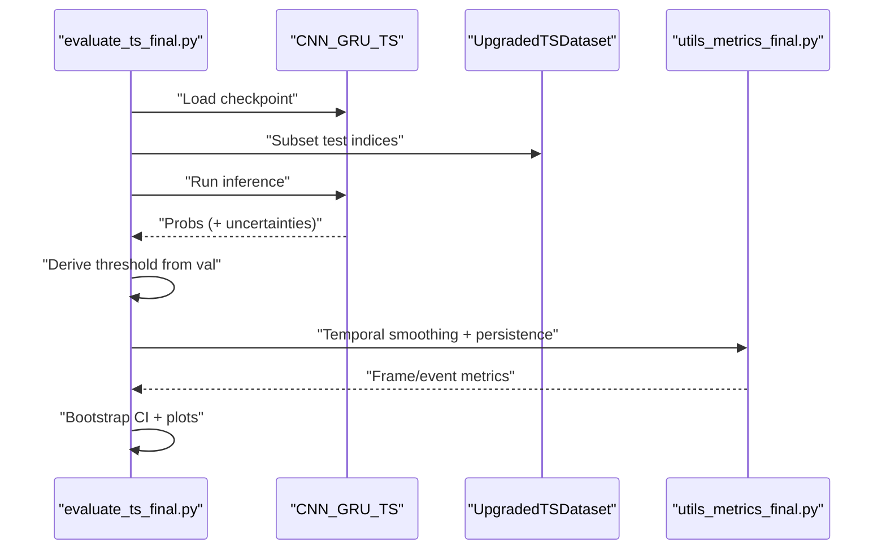
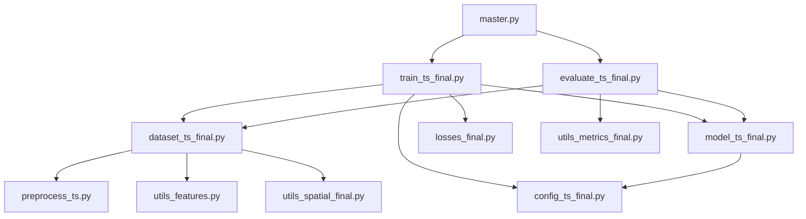

# System Overview

<cite>
**Referenced Files in This Document**
- [master.py](file://master.py)
- [config_ts_final.py](file://config_ts_final.py)
- [model_ts_final.py](file://model_ts_final.py)
- [dataset_ts_final.py](file://dataset_ts_final.py)
- [preprocess_ts.py](file://preprocess_ts.py)
- [utils_features.py](file://utils_features.py)
- [utils_spatial_final.py](file://utils_spatial_final.py)
- [utils_metrics_final.py](file://utils_metrics_final.py)
- [losses_final.py](file://losses_final.py)
- [train_ts_final.py](file://train_ts_final.py)
- [evaluate_ts_final.py](file://evaluate_ts_final.py)
</cite>

## Table of Contents
1. [Introduction](#introduction)
2. [Project Structure](#project-structure)
3. [Core Components](#core-components)
4. [Architecture Overview](#architecture-overview)
5. [Detailed Component Analysis](#detailed-component-analysis)
6. [Dependency Analysis](#dependency-analysis)
7. [Performance Considerations](#performance-considerations)
8. [Troubleshooting Guide](#troubleshooting-guide)
9. [Conclusion](#conclusion)

## Introduction
The Nagpur Thunderstorm Nowcasting System is a real-time 3-hour ahead forecasting tool designed to predict the occurrence of convective storms over Nagpur, India, using INSAT-3DR satellite imagery. The system integrates multi-modal data fusion from infrared (IR) and water vapor (WV) channels, optical flow motion cues, meteorological features extracted from METAR observations, and CCD (Cold Cloud Density) texture descriptors. It employs a CNN-GRU hybrid neural network with temporal attention and optional evidential deep learning for uncertainty quantification. The system emphasizes operational reliability through temporal smoothing, persistence filtering, and robust post-processing thresholds tuned on validation data.

## Project Structure
The repository is organized into modular Python scripts that implement the end-to-end pipeline: data ingestion and preprocessing, dataset construction, model definition, training, evaluation, and metrics computation. Configuration centralizes hyperparameters, data paths, and operational settings.

**Diagram sources**
- [master.py:1-108](file://master.py#L1-L108)
- [config_ts_final.py:1-208](file://config_ts_final.py#L1-L208)
- [model_ts_final.py:1-335](file://model_ts_final.py#L1-L335)
- [dataset_ts_final.py:1-515](file://dataset_ts_final.py#L1-L515)
- [preprocess_ts.py:1-117](file://preprocess_ts.py#L1-L117)
- [utils_features.py:1-191](file://utils_features.py#L1-L191)
- [utils_spatial_final.py:1-80](file://utils_spatial_final.py#L1-L80)
- [utils_metrics_final.py:1-200](file://utils_metrics_final.py#L1-L200)
- [losses_final.py:1-200](file://losses_final.py#L1-L200)
- [train_ts_final.py:1-757](file://train_ts_final.py#L1-L757)
- [evaluate_ts_final.py:1-908](file://evaluate_ts_final.py#L1-L908)

**Section sources**
- [master.py:1-108](file://master.py#L1-L108)
- [config_ts_final.py:1-208](file://config_ts_final.py#L1-L208)

## Core Components
- CNN-GRU Hybrid Neural Network: A MobileNetV2-based CNN backbone with spatial skip connections, optional optical flow features, and a GRU temporal module. It supports multi-task heads for classification, aleatoric uncertainty, and intensity regression. Evidential learning enables single-pass epistemic uncertainty estimation.
- Multi-modal Data Fusion: Combines IR and WV channels, derived cooling rates and textures, IR-WV difference, optional optical flow, METAR-derived features (pressure trends, wind variability, dewpoint), and CCD texture descriptors. A dynamic upwind mask adjusts spatial focus based on motion.
- Temporal Post-processing: Applies temporal smoothing (EMA), persistence filtering, and optional Schmitt trigger hysteresis to stabilize predictions and reduce false alarms.
- Seasonal Sampling and Labeling: Uses pre-event ramp-up labeling and seasonal boosting to improve detection during high-risk periods.
- Training and Evaluation: Implements asymmetric time-aware loss, optional heteroscedastic uncertainty, and weighted event metrics optimized for operational aviation safety.

**Section sources**
- [model_ts_final.py:68-335](file://model_ts_final.py#L68-L335)
- [dataset_ts_final.py:47-515](file://dataset_ts_final.py#L47-L515)
- [config_ts_final.py:16-208](file://config_ts_final.py#L16-L208)
- [utils_metrics_final.py:23-78](file://utils_metrics_final.py#L23-L78)
- [losses_final.py:13-200](file://losses_final.py#L13-L200)

## Architecture Overview
The system follows a staged pipeline: orchestration, training, evaluation, and metrics. Configuration drives model architecture, data paths, augmentation, and post-processing. The dataset builds spatio-temporal sequences from precomputed HDF5 features, while the model performs joint inference across modalities.

**Diagram sources**
- [master.py:39-108](file://master.py#L39-L108)
- [train_ts_final.py:142-757](file://train_ts_final.py#L142-L757)
- [evaluate_ts_final.py:361-908](file://evaluate_ts_final.py#L361-L908)
- [dataset_ts_final.py:47-515](file://dataset_ts_final.py#L47-L515)
- [model_ts_final.py:68-335](file://model_ts_final.py#L68-L335)
- [utils_metrics_final.py:120-200](file://utils_metrics_final.py#L120-L200)

## Detailed Component Analysis

### CNN-GRU Model and Evidential Learning
The CNN-GRU model adapts a MobileNetV2 backbone to a variable number of input channels (e.g., IR, WV, cooling, texture, IR-WV difference, acceleration, trend). Spatial skip connections capture low-resolution grid features, while optional optical flow features are processed by a lightweight CNN. The GRU fuses temporal features with attention, and the model exposes multiple heads:
- Primary classification head (binary or EDL-based)
- Aleatoric uncertainty head (optional)
- Intensity regression head (optional)

Evidential learning computes epistemic uncertainty directly from the learned evidence distribution, complementing MC Dropout when disabled.

**Diagram sources**
- [model_ts_final.py:68-335](file://model_ts_final.py#L68-L335)

**Section sources**
- [model_ts_final.py:68-335](file://model_ts_final.py#L68-L335)

### Multi-Modal Dataset Construction and Spatio-Temporal Sequences
The dataset builds sequences of 4–5 frames at 30-minute cadence, with a 60-minute lead time prediction window. It loads precomputed HDF5 files containing IR, WV, cooling, texture, flow, and derived channels. METAR features are extracted for each timestamp, and CCD features are standardized. Augmentation during training includes horizontal flip, temporal masking, channel dropout, and Gaussian noise. A dynamic upwind mask focuses attention based on motion-derived offsets.

**Diagram sources**
- [dataset_ts_final.py:268-515](file://dataset_ts_final.py#L268-L515)
- [utils_features.py:11-191](file://utils_features.py#L11-L191)
- [utils_spatial_final.py:12-80](file://utils_spatial_final.py#L12-L80)

**Section sources**
- [dataset_ts_final.py:47-515](file://dataset_ts_final.py#L47-L515)
- [utils_features.py:11-191](file://utils_features.py#L11-L191)
- [utils_spatial_final.py:12-80](file://utils_spatial_final.py#L12-L80)

### Preprocessing Pipeline for Raw Satellite Imagery
Raw INSAT-3DR images undergo overlay cleaning, cropping to a fixed center, grayscale conversion, and feature extraction (CCD metrics). The process preserves physical temperature proxies and avoids CLAHE to maintain IR calibration. Static masks are reused across resolutions to mask overlays consistently.

**Diagram sources**
- [preprocess_ts.py:27-117](file://preprocess_ts.py#L27-L117)

**Section sources**
- [preprocess_ts.py:27-117](file://preprocess_ts.py#L27-L117)

### Training and Loss Functions
Training combines focal loss with late detection penalty and optional asymmetric time-aware loss. Heteroscedastic loss can be used alongside classification loss to model aleatoric uncertainty. Evidential loss replaces classification BCE when EDL is enabled. The training script applies OHEM, SWA, and temporal smoothing to improve generalization and stability.

**Diagram sources**
- [train_ts_final.py:285-500](file://train_ts_final.py#L285-L500)
- [losses_final.py:13-200](file://losses_final.py#L13-L200)
- [model_ts_final.py:202-335](file://model_ts_final.py#L202-L335)

**Section sources**
- [train_ts_final.py:285-500](file://train_ts_final.py#L285-L500)
- [losses_final.py:13-200](file://losses_final.py#L13-L200)

### Evaluation and Post-Processing
The evaluation script runs inference on the test set, derives thresholds from validation, applies temporal smoothing and persistence filtering, and computes frame and event metrics. Optional Platt scaling is disabled under evidential learning. Bootstrapped confidence intervals quantify uncertainty in metrics.

**Diagram sources**
- [evaluate_ts_final.py:361-908](file://evaluate_ts_final.py#L361-L908)
- [utils_metrics_final.py:23-120](file://utils_metrics_final.py#L23-L120)

**Section sources**
- [evaluate_ts_final.py:361-908](file://evaluate_ts_final.py#L361-L908)
- [utils_metrics_final.py:23-120](file://utils_metrics_final.py#L23-L120)

### Configuration and Operational Settings
Configuration defines data paths, model architecture, training hyperparameters, augmentation, loss settings, post-processing, and spatial masks. It also includes severity classification logic and time-aware metrics for operational evaluation.

```mermaid
flowchart TD
CFG["config_ts_final.py"] --> Paths["Data/MODEL_OUT/LOG_DIR"]
CFG --> Arch["HIDDEN_DIM/NUM_LAYERS/DROPOUT/SEQ_LEN/LEAD"]
CFG --> Train["EPOCHS/BATCH_SIZE/LR/WEIGHT_DECAY/PATIENCE/SWA"]
CFG --> Loss["GAMMA/ALPHA/POS_WEIGHT/LATE_PENALTY/LABEL_SMOOTHING"]
CFG --> Post["SMOOTH_WINDOW/SMOOTH_METHOD/PERSISTENCE_MIN_LEN/THRESHOLD_METRIC"]
CFG --> Spatial["MASK_CENTER/MASK_SIGMA/USE_MASK/USE_CCD/USE_MONTH"]
CFG --> METAR["USE_METAR_FEATURES/METAR_FEATURE_WINDOWS"]
CFG --> Uncert["USE_EVIDENTIAL_LEARNING/USE_HETEROSCEDASTIC/USE_MC_DROPOUT"]
```

**Diagram sources**
- [config_ts_final.py:16-208](file://config_ts_final.py#L16-L208)

**Section sources**
- [config_ts_final.py:16-208](file://config_ts_final.py#L16-L208)

## Dependency Analysis
The system exhibits strong modularity with clear data and control dependencies:
- Orchestration depends on training and evaluation scripts.
- Training depends on dataset construction, model, losses, and configuration.
- Evaluation depends on model checkpoints, dataset subset selection, and metrics utilities.
- Dataset depends on preprocessing utilities, METAR feature extractor, and spatial utilities.
- Model depends on configuration for dynamic channel selection, uncertainty heads, and attention.

**Diagram sources**
- [master.py:39-108](file://master.py#L39-L108)
- [train_ts_final.py:142-757](file://train_ts_final.py#L142-L757)
- [evaluate_ts_final.py:361-908](file://evaluate_ts_final.py#L361-L908)
- [dataset_ts_final.py:47-515](file://dataset_ts_final.py#L47-L515)
- [model_ts_final.py:68-335](file://model_ts_final.py#L68-L335)
- [losses_final.py:13-200](file://losses_final.py#L13-L200)
- [config_ts_final.py:16-208](file://config_ts_final.py#L16-L208)
- [preprocess_ts.py:27-117](file://preprocess_ts.py#L27-L117)
- [utils_features.py:11-191](file://utils_features.py#L11-L191)
- [utils_spatial_final.py:12-80](file://utils_spatial_final.py#L12-L80)
- [utils_metrics_final.py:120-200](file://utils_metrics_final.py#L120-L200)

**Section sources**
- [master.py:39-108](file://master.py#L39-L108)
- [train_ts_final.py:142-757](file://train_ts_final.py#L142-L757)
- [evaluate_ts_final.py:361-908](file://evaluate_ts_final.py#L361-L908)
- [dataset_ts_final.py:47-515](file://dataset_ts_final.py#L47-L515)

## Performance Considerations
- Model efficiency: The architecture targets CPU inference throughput with a focus on parametric efficiency and reduced transformer overhead in favor of GRU.
- Data caching: HDF5 file caching minimizes I/O bottlenecks during dataset iteration.
- Temporal smoothing and persistence: Reduce false alarms and improve temporal coherence of predictions.
- Dynamic upwind mask: Focuses attention on motion-driven regions, improving localization accuracy.
- Uncertainty modeling: Evidential learning provides epistemic uncertainty in a single pass; MC Dropout offers an alternative when disabled.

[No sources needed since this section provides general guidance]

## Troubleshooting Guide
- Missing HDF5 features: Ensure precomputed HDF5 files contain required keys (IR, WV, cooling, texture, flow, IR-WV difference, acceleration, trend).
- Dimension mismatches: Verify image crops and masks align with expected 224x224 dimensions.
- METAR gaps: The feature extractor interpolates missing values; ensure timestamps align closely with satellite cadence.
- Post-processing thresholds: Thresholds are derived from validation to avoid leakage; confirm the evaluation script uses the correct fold and metric.
- Uncertainty computation: Under evidential learning, Platt scaling is disabled; use the provided epistemic uncertainty outputs.

**Section sources**
- [dataset_ts_final.py:268-303](file://dataset_ts_final.py#L268-L303)
- [utils_features.py:173-191](file://utils_features.py#L173-L191)
- [evaluate_ts_final.py:510-523](file://evaluate_ts_final.py#L510-L523)

## Conclusion
The Nagpur Thunderstorm Nowcasting System integrates multi-modal satellite data with a CNN-GRU architecture and evidential uncertainty quantification to deliver reliable 3-hour ahead convection forecasts. Its modular design, robust training and evaluation procedures, and operational post-processing enable practical deployment for aviation and disaster preparedness. The system’s emphasis on temporal smoothing, persistence filtering, and dynamic spatial attention enhances both detection reliability and interpretability.