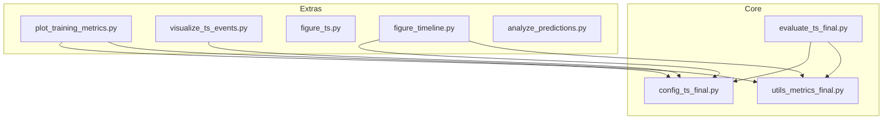
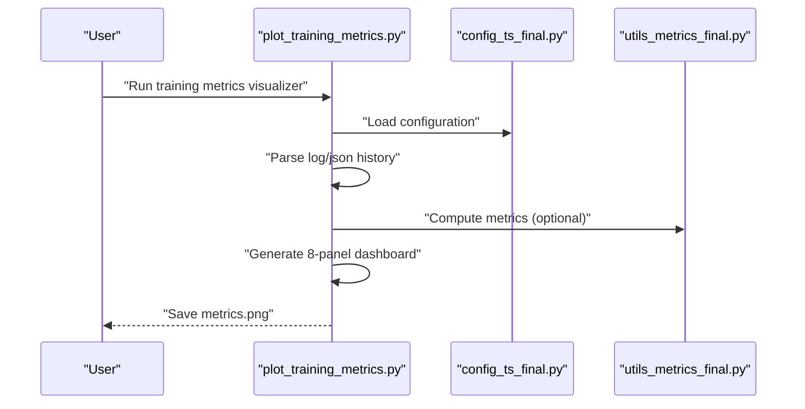
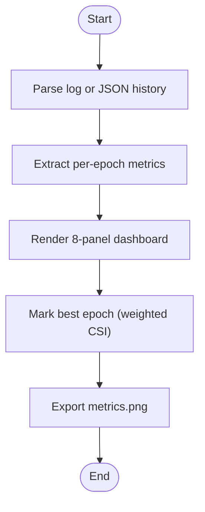
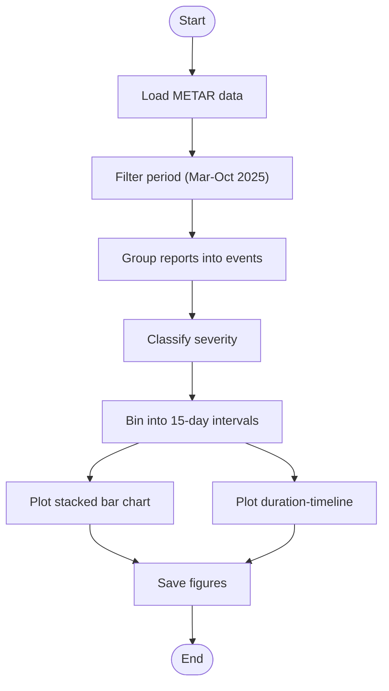
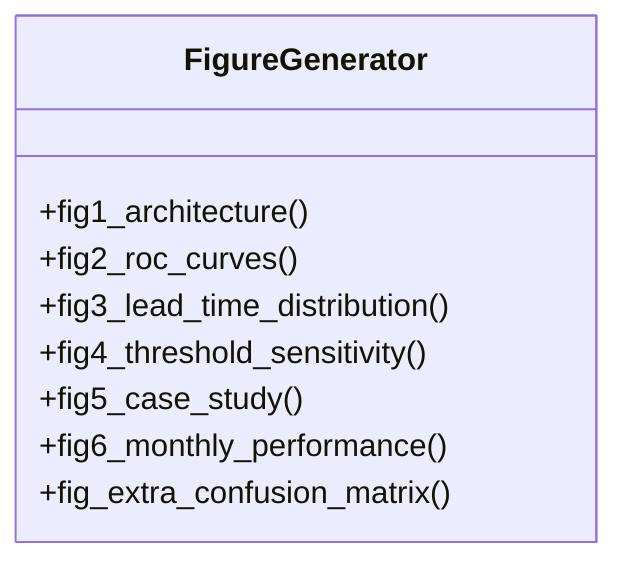
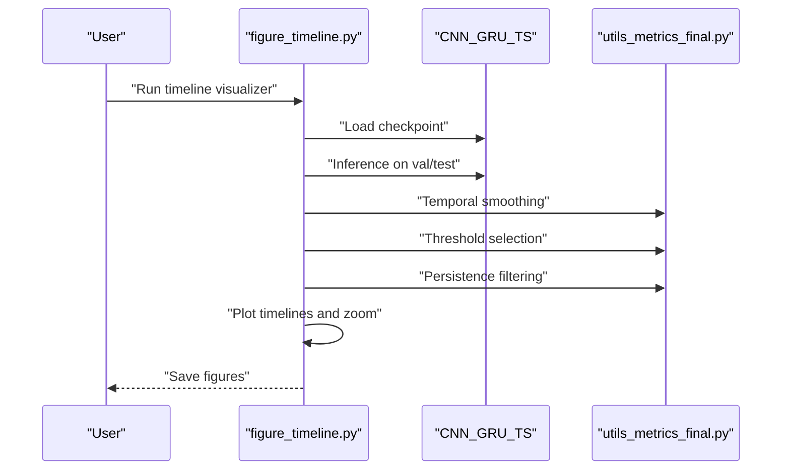
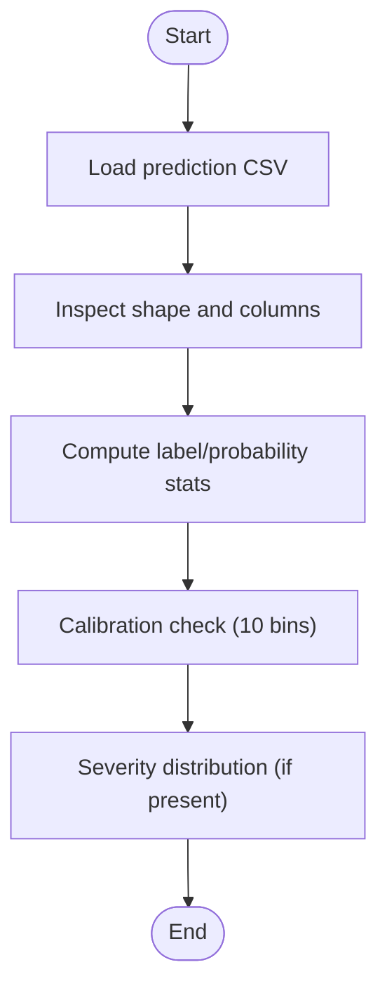
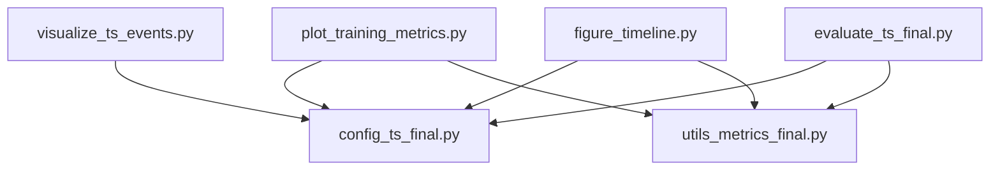

# Analysis & Visualization Tools

<cite>
**Referenced Files in This Document**
- [plot_training_metrics.py](file://extras/plot_training_metrics.py)
- [visualize_ts_events.py](file://extras/visualize_ts_events.py)
- [figure_ts.py](file://extras/figure_ts.py)
- [figure_timeline.py](file://extras/figure_timeline.py)
- [analyze_predictions.py](file://extras/analyze_predictions.py)
- [config_ts_final.py](file://config_ts_final.py)
- [utils_metrics_final.py](file://utils_metrics_final.py)
- [evaluate_ts_final.py](file://evaluate_ts_final.py)
</cite>

## Table of Contents
1. [Introduction](#introduction)
2. [Project Structure](#project-structure)
3. [Core Components](#core-components)
4. [Architecture Overview](#architecture-overview)
5. [Detailed Component Analysis](#detailed-component-analysis)
6. [Dependency Analysis](#dependency-analysis)
7. [Performance Considerations](#performance-considerations)
8. [Troubleshooting Guide](#troubleshooting-guide)
9. [Conclusion](#conclusion)
10. [Appendices](#appendices)

## Introduction
This document provides comprehensive documentation for the analysis and visualization utilities used in the Nagpur Thunderstorm Nowcasting project. It covers:
- Prediction analysis utilities for model performance evaluation and threshold optimization
- Training metrics visualization tools for loss curves, accuracy plots, and convergence analysis
- Thunderstorm event visualization utilities for spatial-temporal event mapping
- Plotting configurations, customization options, and automated reporting features
- Interactive visualization capabilities, batch processing workflows, and export functionality

These tools enable researchers and practitioners to interpret model behavior, tune thresholds, and produce publication-ready visualizations for scientific communication.

## Project Structure
The visualization and analysis utilities are primarily located under the extras directory. They integrate with configuration, metrics utilities, and evaluation scripts to provide a cohesive analysis pipeline.

**Diagram sources**
- [plot_training_metrics.py:1-464](file://extras/plot_training_metrics.py#L1-L464)
- [visualize_ts_events.py:1-217](file://extras/visualize_ts_events.py#L1-L217)
- [figure_ts.py:1-460](file://extras/figure_ts.py#L1-L460)
- [figure_timeline.py:1-253](file://extras/figure_timeline.py#L1-L253)
- [analyze_predictions.py:1-64](file://extras/analyze_predictions.py#L1-L64)
- [config_ts_final.py:1-208](file://config_ts_final.py#L1-L208)
- [utils_metrics_final.py:1-760](file://utils_metrics_final.py#L1-L760)
- [evaluate_ts_final.py:1-908](file://evaluate_ts_final.py#L1-L908)

**Section sources**
- [plot_training_metrics.py:1-464](file://extras/plot_training_metrics.py#L1-L464)
- [visualize_ts_events.py:1-217](file://extras/visualize_ts_events.py#L1-L217)
- [figure_ts.py:1-460](file://extras/figure_ts.py#L1-L460)
- [figure_timeline.py:1-253](file://extras/figure_timeline.py#L1-L253)
- [analyze_predictions.py:1-64](file://extras/analyze_predictions.py#L1-L64)
- [config_ts_final.py:1-208](file://config_ts_final.py#L1-L208)
- [utils_metrics_final.py:1-760](file://utils_metrics_final.py#L1-L760)
- [evaluate_ts_final.py:1-908](file://evaluate_ts_final.py#L1-L908)

## Core Components
- Training Metrics Visualizer: Parses training logs and generates an 8-panel dashboard including loss curves, learning rate schedule, frame/event metrics, severity detection rates, weighted event metrics, lead times, and aviation safety scores.
- Thunderstorm Event Visualizer: Extracts and visualizes METAR-based thunderstorm events over 15-day intervals, showing aggregated counts and a timeline with duration and wind-speed mapping.
- Publication Figures Generator: Produces six professional figures for IEEE Transactions, including architecture diagrams, ROC curves, lead time distributions, threshold sensitivity analysis, case studies, monthly performance, and confusion matrices.
- Timeline Visualizer: Generates publication-quality timelines comparing ground-truth TS occurrences with model predictions and probability traces, highlighting hits, misses, and false alarms.
- Prediction Analyzer: Performs quick audits of prediction CSVs, computing label distributions, probability statistics, calibration checks, and severity distributions.

**Section sources**
- [plot_training_metrics.py:25-464](file://extras/plot_training_metrics.py#L25-L464)
- [visualize_ts_events.py:18-217](file://extras/visualize_ts_events.py#L18-L217)
- [figure_ts.py:39-460](file://extras/figure_ts.py#L39-L460)
- [figure_timeline.py:153-253](file://extras/figure_timeline.py#L153-L253)
- [analyze_predictions.py:14-64](file://extras/analyze_predictions.py#L14-L64)

## Architecture Overview
The visualization tools follow a modular architecture:
- Data ingestion: Logs, CSVs, METAR files, and model outputs
- Parsing and preprocessing: Log parsing, CSV analysis, event extraction, and smoothing
- Metrics computation: Frame-level, event-level, weighted event metrics, and lead-time statistics
- Visualization: Matplotlib-based plotting with configurable styles and export formats
- Integration: Shared configuration and metrics utilities across tools

**Diagram sources**
- [plot_training_metrics.py:25-464](file://extras/plot_training_metrics.py#L25-L464)
- [config_ts_final.py:1-208](file://config_ts_final.py#L1-L208)
- [utils_metrics_final.py:120-241](file://utils_metrics_final.py#L120-L241)

## Detailed Component Analysis

### Training Metrics Visualizer
The training metrics visualizer parses training logs and produces an 8-panel dashboard:
- Panels: Training/validation loss, learning rate schedule, frame-level metrics (CSI, POD, FAR) with threshold overlay, severity detection rates, event-level metrics, weighted event metrics (primary), lead times, and aviation safety scores.
- Data sources: Supports both structured JSON history files and legacy text logs with epoch blocks.
- Best epoch highlighting: Automatically marks the epoch with the highest weighted CSI.
- Export: Saves a high-resolution PNG with a descriptive filename.

**Diagram sources**
- [plot_training_metrics.py:25-436](file://extras/plot_training_metrics.py#L25-L436)

**Section sources**
- [plot_training_metrics.py:25-464](file://extras/plot_training_metrics.py#L25-L464)

### Thunderstorm Event Visualizer
The event visualizer processes METAR data to extract thunderstorm events:
- Event grouping: Groups consecutive METAR reports into events separated by gaps exceeding a threshold.
- Severity classification: Uses configurable thresholds or defaults to categorize events as stray, moderate, or significant.
- Binning: Divides the period into 15-day intervals aligned with month boundaries.
- Visualization: Stacked bar chart of event counts by severity and a timeline where event width reflects duration and height reflects maximum wind speed.
- Export: Saves figures to the configured log directory.

**Diagram sources**
- [visualize_ts_events.py:83-217](file://extras/visualize_ts_events.py#L83-L217)

**Section sources**
- [visualize_ts_events.py:18-217](file://extras/visualize_ts_events.py#L18-L217)

### Publication Figures Generator
The publication figures generator creates six high-resolution figures for academic papers:
- Architecture diagram: CNN-GRU architecture with feature fusion and attention.
- ROC curves: Comparative ROC curves with AUC values and annotations.
- Lead time distribution: Histogram comparison with and without late penalty.
- Threshold sensitivity: Curves for ETS, CSI, POD, and FAR across a range of thresholds.
- Case study: IR frames and probability time series with threshold and onset markers.
- Monthly performance: Bar charts and trend lines for detection scores across monsoon months.
- Confusion matrix: Heatmap with annotated metrics.

**Diagram sources**
- [figure_ts.py:39-460](file://extras/figure_ts.py#L39-L460)

**Section sources**
- [figure_ts.py:1-460](file://extras/figure_ts.py#L1-L460)

### Timeline Visualizer
The timeline visualizer compares ground-truth TS events with model predictions:
- Inference: Loads a trained model and runs inference over validation/test splits.
- Post-processing: Applies temporal smoothing, threshold selection, and persistence filtering.
- Visualization: Plots probability traces, event spans, and highlights hits, misses, and false alarms.
- Export: Saves two figures: a full timeline and daily zoom-in.

**Diagram sources**
- [figure_timeline.py:124-253](file://extras/figure_timeline.py#L124-L253)
- [utils_metrics_final.py:23-77](file://utils_metrics_final.py#L23-L77)

**Section sources**
- [figure_timeline.py:1-253](file://extras/figure_timeline.py#L1-L253)

### Prediction Analyzer
The prediction analyzer performs quick audits of prediction CSVs:
- Data inspection: Prints shape, columns, label distributions, and probability statistics.
- Calibration check: Computes binned accuracy versus confidence to assess calibration.
- Severity analysis: Reports severity distribution if present.

**Diagram sources**
- [analyze_predictions.py:14-64](file://extras/analyze_predictions.py#L14-L64)

**Section sources**
- [analyze_predictions.py:1-64](file://extras/analyze_predictions.py#L1-L64)

## Dependency Analysis
The visualization tools depend on shared configuration and metrics utilities:
- Configuration: Centralized settings for device, paths, thresholds, smoothing, and persistence.
- Metrics utilities: Functions for temporal smoothing, threshold optimization, event extraction, lead-time computation, and weighted metrics.
- Evaluation integration: The evaluation script demonstrates how metrics and thresholds are computed and exported.

**Diagram sources**
- [plot_training_metrics.py:1-464](file://extras/plot_training_metrics.py#L1-L464)
- [visualize_ts_events.py:1-217](file://extras/visualize_ts_events.py#L1-L217)
- [figure_timeline.py:1-253](file://extras/figure_timeline.py#L1-L253)
- [evaluate_ts_final.py:1-908](file://evaluate_ts_final.py#L1-L908)
- [config_ts_final.py:1-208](file://config_ts_final.py#L1-L208)
- [utils_metrics_final.py:1-760](file://utils_metrics_final.py#L1-L760)

**Section sources**
- [config_ts_final.py:1-208](file://config_ts_final.py#L1-L208)
- [utils_metrics_final.py:1-760](file://utils_metrics_final.py#L1-L760)
- [evaluate_ts_final.py:1-908](file://evaluate_ts_final.py#L1-L908)

## Performance Considerations
- Efficient parsing: The training metrics visualizer prefers JSON history files for faster parsing and reliability.
- Memory-conscious operations: The timeline visualizer uses subset loaders to manage memory during inference.
- Smoothing and filtering: Temporal smoothing and persistence filtering reduce noise and false positives in predictions.
- Export quality: High DPI exports ensure publication-ready figures.

[No sources needed since this section provides general guidance]

## Troubleshooting Guide
Common issues and resolutions:
- Missing log files: Ensure the log path exists or use glob patterns to select the latest log.
- Empty datasets: Verify METAR file paths and date filters for event visualization.
- Threshold selection failures: Confirm that validation predictions contain sufficient variability for threshold optimization.
- Export permissions: Ensure the output directory exists and is writable.

**Section sources**
- [plot_training_metrics.py:442-464](file://extras/plot_training_metrics.py#L442-L464)
- [visualize_ts_events.py:83-101](file://extras/visualize_ts_events.py#L83-L101)
- [figure_timeline.py:216-253](file://extras/figure_timeline.py#L216-L253)

## Conclusion
The analysis and visualization toolkit provides a comprehensive suite of utilities for interpreting model behavior, optimizing thresholds, and producing publication-ready figures. By leveraging shared configuration and metrics utilities, these tools ensure consistency and reproducibility across experiments and analyses.

[No sources needed since this section summarizes without analyzing specific files]

## Appendices

### Plotting Configurations and Customization Options
- Training metrics dashboard: Configurable colors, layout spacing, and best-epoch marking.
- Event visualization: Dark background style, severity color mapping, and grid formatting.
- Publication figures: High-DPI settings, serif fonts, tight bounding boxes, and professional legends.
- Timeline visualization: Event span overlays, annotation markers, and date formatting.

**Section sources**
- [plot_training_metrics.py:258-436](file://extras/plot_training_metrics.py#L258-L436)
- [visualize_ts_events.py:144-217](file://extras/visualize_ts_events.py#L144-L217)
- [figure_ts.py:21-33](file://extras/figure_ts.py#L21-L33)
- [figure_timeline.py:153-195](file://extras/figure_timeline.py#L153-L195)

### Automated Reporting Features
- Training metrics dashboard: Automatic best epoch detection and saving to a descriptive filename.
- Evaluation integration: Bootstrapped confidence intervals and detailed performance summaries.
- Event visualization: Automated aggregation and timeline generation with summary tables.

**Section sources**
- [plot_training_metrics.py:278-436](file://extras/plot_training_metrics.py#L278-L436)
- [evaluate_ts_final.py:741-800](file://evaluate_ts_final.py#L741-L800)
- [visualize_ts_events.py:147-217](file://extras/visualize_ts_events.py#L147-L217)

### Interactive Visualization Capabilities
- Timeline visualizer: Highlights hits, misses, and false alarms with annotations.
- Threshold sensitivity: Curves for ETS, CSI, POD, and FAR across a range of thresholds.
- Publication figures: Static but highly informative visualizations suitable for presentations and papers.

**Section sources**
- [figure_timeline.py:153-195](file://extras/figure_timeline.py#L153-L195)
- [figure_ts.py:229-276](file://extras/figure_ts.py#L229-L276)

### Batch Processing Workflows
- Training metrics: Supports glob patterns to process multiple logs and select the latest.
- Evaluation: Processes validation and test sets with configurable folds and bootstrapped confidence intervals.
- Event visualization: Processes METAR data for predefined time ranges and exports multiple figures.

**Section sources**
- [plot_training_metrics.py:447-464](file://extras/plot_training_metrics.py#L447-L464)
- [evaluate_ts_final.py:401-429](file://evaluate_ts_final.py#L401-L429)
- [visualize_ts_events.py:83-101](file://extras/visualize_ts_events.py#L83-L101)

### Export Functionality
- Training metrics: Saves a single PNG with a descriptive filename derived from the log path.
- Event visualization: Saves aggregated counts and duration timeline figures to the configured log directory.
- Publication figures: Saves six separate PNG files with high DPI and tight bounding boxes.
- Timeline visualization: Saves full and zoomed timeline figures to the model output directory.

**Section sources**
- [plot_training_metrics.py:429-436](file://extras/plot_training_metrics.py#L429-L436)
- [visualize_ts_events.py:166-207](file://extras/visualize_ts_events.py#L166-L207)
- [figure_ts.py:128-177](file://extras/figure_ts.py#L128-L177)
- [figure_timeline.py:243-249](file://extras/figure_timeline.py#L243-L249)