# Development & Testing Tools

<cite>
**Referenced Files in This Document**
- [smoke_test.py](file://extras/smoke_test.py)
- [test_pipeline.py](file://extras/test_pipeline.py)
- [check_gusts.py](file://extras/check_gusts.py)
- [verify_centers_math.py](file://extras/verify_centers_math.py)
- [verify_crop_mapping.py](file://extras/verify_crop_mapping.py)
- [auto_find_centers.py](file://extras/auto_find_centers.py)
- [find_exact_centers.py](file://extras/find_exact_centers.py)
- [check_alignment.py](file://extras/check_alignment.py)
- [verify_changes.py](file://extras/verify_changes.py)
- [create_sample_dataset.py](file://extras/create_sample_dataset.py)
- [plot_training_metrics.py](file://extras/plot_training_metrics.py)
- [visualize_ts_events.py](file://extras/visualize_ts_events.py)
- [generate_static_masks.py](file://extras/generate_static_masks.py)
- [st_dwn.py](file://extras/st_dwn.py)
- [master.py](file://master.py)
- [metar_parser.py](file://metar_parser.py)
- [dataset_ts_final.py](file://dataset_ts_final.py)
- [model_ts_final.py](file://model_ts_final.py)
- [config_ts_final.py](file://config_ts_final.py)
- [utils_metrics_final.py](file://utils_metrics_final.py)
- [losses_final.py](file://losses_final.py)
</cite>

## Table of Contents
1. [Introduction](#introduction)
2. [Project Structure](#project-structure)
3. [Core Components](#core-components)
4. [Architecture Overview](#architecture-overview)
5. [Detailed Component Analysis](#detailed-component-analysis)
6. [Dependency Analysis](#dependency-analysis)
7. [Performance Considerations](#performance-considerations)
8. [Troubleshooting Guide](#troubleshooting-guide)
9. [Conclusion](#conclusion)
10. [Appendices](#appendices)

## Introduction
This document describes the development and testing utilities used to validate system health, end-to-end workflows, and mathematical correctness for the Nagpur Thunderstorm Nowcasting project. It covers:
- Smoke testing utilities for quick system health checks and integration validation
- Pipeline testing tools for end-to-end workflow validation and regression testing
- Gust verification tools for wind speed accuracy validation
- Center math verification utilities and crop mapping validation tools
- Testing methodologies, automated testing workflows, debugging utilities, and best practices

## Project Structure
The repository organizes testing and verification scripts under extras/, with supporting modules for configuration, datasets, models, and metrics. The master pipeline orchestrates training and evaluation phases.

```mermaid
graph TB
subgraph "Testing Utilities (extras)"
ST["smoke_test.py"]
TP["test_pipeline.py"]
CG["check_gusts.py"]
VCM["verify_centers_math.py"]
VCMAP["verify_crop_mapping.py"]
AFC["auto_find_centers.py"]
FEC["find_exact_centers.py"]
CAL["check_alignment.py"]
VC["verify_changes.py"]
CSD["create_sample_dataset.py"]
PTM["plot_training_metrics.py"]
VTE["visualize_ts_events.py"]
GSM["generate_static_masks.py"]
STD["st_dwn.py"]
end
subgraph "Core Modules"
CFG["config_ts_final.py"]
DAT["dataset_ts_final.py"]
MOD["model_ts_final.py"]
MET["utils_metrics_final.py"]
LOS["losses_final.py"]
MTR["metar_parser.py"]
end
subgraph "Pipeline Orchestration"
MST["master.py"]
end
ST --> MOD
ST --> CFG
TP --> MTR
TP --> DAT
TP --> CFG
VCM --> CFG
VCMAP --> CFG
AFC --> CFG
FEC --> CFG
CAL --> CFG
VC --> CFG
VC --> MOD
VC --> LOS
VC --> MET
CSD --> DAT
CSD --> MTR
CSD --> CFG
PTM --> CFG
VTE --> MTR
VTE --> CFG
GSM --> CFG
STD --> CFG
MST --> CFG
```

**Diagram sources**
- [smoke_test.py:1-27](file://extras/smoke_test.py#L1-L27)
- [test_pipeline.py:1-54](file://extras/test_pipeline.py#L1-L54)
- [check_gusts.py:1-34](file://extras/check_gusts.py#L1-L34)
- [verify_centers_math.py:1-51](file://extras/verify_centers_math.py#L1-L51)
- [verify_crop_mapping.py:1-166](file://extras/verify_crop_mapping.py#L1-L166)
- [auto_find_centers.py:1-101](file://extras/auto_find_centers.py#L1-L101)
- [find_exact_centers.py:1-65](file://extras/find_exact_centers.py#L1-L65)
- [check_alignment.py:1-54](file://extras/check_alignment.py#L1-L54)
- [verify_changes.py:1-99](file://extras/verify_changes.py#L1-L99)
- [create_sample_dataset.py:1-146](file://extras/create_sample_dataset.py#L1-L146)
- [plot_training_metrics.py:1-464](file://extras/plot_training_metrics.py#L1-L464)
- [visualize_ts_events.py:1-217](file://extras/visualize_ts_events.py#L1-L217)
- [generate_static_masks.py:1-150](file://extras/generate_static_masks.py#L1-L150)
- [st_dwn.py:1-63](file://extras/st_dwn.py#L1-L63)
- [master.py:1-108](file://master.py#L1-L108)
- [metar_parser.py](file://metar_parser.py)
- [dataset_ts_final.py](file://dataset_ts_final.py)
- [model_ts_final.py](file://model_ts_final.py)
- [config_ts_final.py](file://config_ts_final.py)
- [utils_metrics_final.py](file://utils_metrics_final.py)
- [losses_final.py](file://losses_final.py)

**Section sources**
- [master.py:1-108](file://master.py#L1-L108)

## Core Components
This section outlines the primary testing utilities and their roles.

- Smoke tests: Quick forward pass validation of the model with realistic inputs and expected outputs.
- Pipeline tests: End-to-end validation of METAR parsing, dataset loading, and feature sanity checks.
- Gust verification: Statistical analysis of wind speed and explicit gust presence in METAR records.
- Center math and crop mapping: Geometric and coordinate mapping validation across image dimensions.
- Automated dataset sampling: Fast iteration via stratified subsampling for hyperparameter tuning.
- Training visualization: Dashboard generation from training logs for regression monitoring.
- Event visualization: Severity classification and timeline plotting for thunderstorm events.
- Static mask generation: Robust mask creation for preprocessing and artifact removal.
- Data downloader: MOSDAC image acquisition with rate limiting and retry logic.
- Master pipeline: Orchestrated training, evaluation, ensemble, and ablation runs.

**Section sources**
- [smoke_test.py:1-27](file://extras/smoke_test.py#L1-L27)
- [test_pipeline.py:1-54](file://extras/test_pipeline.py#L1-L54)
- [check_gusts.py:1-34](file://extras/check_gusts.py#L1-L34)
- [verify_centers_math.py:1-51](file://extras/verify_centers_math.py#L1-L51)
- [verify_crop_mapping.py:1-166](file://extras/verify_crop_mapping.py#L1-L166)
- [auto_find_centers.py:1-101](file://extras/auto_find_centers.py#L1-L101)
- [find_exact_centers.py:1-65](file://extras/find_exact_centers.py#L1-L65)
- [check_alignment.py:1-54](file://extras/check_alignment.py#L1-L54)
- [verify_changes.py:1-99](file://extras/verify_changes.py#L1-L99)
- [create_sample_dataset.py:1-146](file://extras/create_sample_dataset.py#L1-L146)
- [plot_training_metrics.py:1-464](file://extras/plot_training_metrics.py#L1-L464)
- [visualize_ts_events.py:1-217](file://extras/visualize_ts_events.py#L1-L217)
- [generate_static_masks.py:1-150](file://extras/generate_static_masks.py#L1-L150)
- [st_dwn.py:1-63](file://extras/st_dwn.py#L1-L63)
- [master.py:1-108](file://master.py#L1-L108)

## Architecture Overview
The testing utilities integrate with core modules to validate data ingestion, preprocessing, modeling, and evaluation.

```mermaid
graph TB
ST["Smoke Test<br/>extras/smoke_test.py"] --> MOD["Model<br/>model_ts_final.py"]
ST --> CFG["Config<br/>config_ts_final.py"]
TP["Pipeline Test<br/>extras/test_pipeline.py"] --> MTR["METAR Parser<br/>metar_parser.py"]
TP --> DAT["Dataset<br/>dataset_ts_final.py"]
TP --> CFG
VC["Changes Verification<br/>extras/verify_changes.py"] --> CFG
VC --> MOD
VC --> LOS["Losses<br/>losses_final.py"]
VC --> MET["Metrics Utils<br/>utils_metrics_final.py"]
CSD["Sample Dataset<br/>extras/create_sample_dataset.py"] --> DAT
CSD --> MTR
CSD --> CFG
PTM["Training Metrics Plotter<br/>extras/plot_training_metrics.py"] --> CFG
VTE["TS Events Visualizer<br/>extras/visualize_ts_events.py"] --> MTR
VTE --> CFG
VCM["Center Math Verifier<br/>extras/verify_centers_math.py"] --> CFG
VCMAP["Crop Mapper<br/>extras/verify_crop_mapping.py"] --> CFG
AFC["Auto Centers<br/>extras/auto_find_centers.py"] --> CFG
FEC["Exact Centers<br/>extras/find_exact_centers.py"] --> CFG
CAL["Alignment Checker<br/>extras/check_alignment.py"] --> CFG
GSM["Static Masks<br/>extras/generate_static_masks.py"] --> CFG
STD["Downloader<br/>extras/st_dwn.py"] --> CFG
MST["Master Pipeline<br/>master.py"] --> CFG
```

**Diagram sources**
- [smoke_test.py:1-27](file://extras/smoke_test.py#L1-L27)
- [test_pipeline.py:1-54](file://extras/test_pipeline.py#L1-L54)
- [verify_changes.py:1-99](file://extras/verify_changes.py#L1-L99)
- [create_sample_dataset.py:1-146](file://extras/create_sample_dataset.py#L1-L146)
- [plot_training_metrics.py:1-464](file://extras/plot_training_metrics.py#L1-L464)
- [visualize_ts_events.py:1-217](file://extras/visualize_ts_events.py#L1-L217)
- [verify_centers_math.py:1-51](file://extras/verify_centers_math.py#L1-L51)
- [verify_crop_mapping.py:1-166](file://extras/verify_crop_mapping.py#L1-L166)
- [auto_find_centers.py:1-101](file://extras/auto_find_centers.py#L1-L101)
- [find_exact_centers.py:1-65](file://extras/find_exact_centers.py#L1-L65)
- [check_alignment.py:1-54](file://extras/check_alignment.py#L1-L54)
- [generate_static_masks.py:1-150](file://extras/generate_static_masks.py#L1-L150)
- [st_dwn.py:1-63](file://extras/st_dwn.py#L1-L63)
- [master.py:1-108](file://master.py#L1-L108)
- [metar_parser.py](file://metar_parser.py)
- [dataset_ts_final.py](file://dataset_ts_final.py)
- [model_ts_final.py](file://model_ts_final.py)
- [config_ts_final.py](file://config_ts_final.py)
- [utils_metrics_final.py](file://utils_metrics_final.py)
- [losses_final.py](file://losses_final.py)

## Detailed Component Analysis

### Smoke Test Utilities
Purpose: Validate model build and forward pass with realistic multi-modal inputs.

Key behaviors:
- Builds the model using configuration
- Generates synthetic inputs: time series images, cooling change detector, flow maps, METAR features, time features
- Executes a forward pass and prints output shape and values

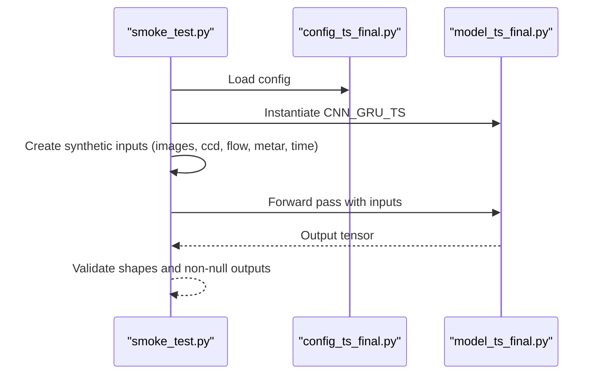

**Diagram sources**
- [smoke_test.py:1-27](file://extras/smoke_test.py#L1-L27)
- [model_ts_final.py](file://model_ts_final.py)
- [config_ts_final.py](file://config_ts_final.py)

**Section sources**
- [smoke_test.py:1-27](file://extras/smoke_test.py#L1-L27)

### Pipeline Testing Tools
Purpose: End-to-end validation of METAR parsing, dataset construction, and feature sanity checks.

Key behaviors:
- Loads METAR data and asserts expected columns
- Initializes dataset with a subset and validates shapes and normalization
- Checks for zero-feature warnings and prints metadata

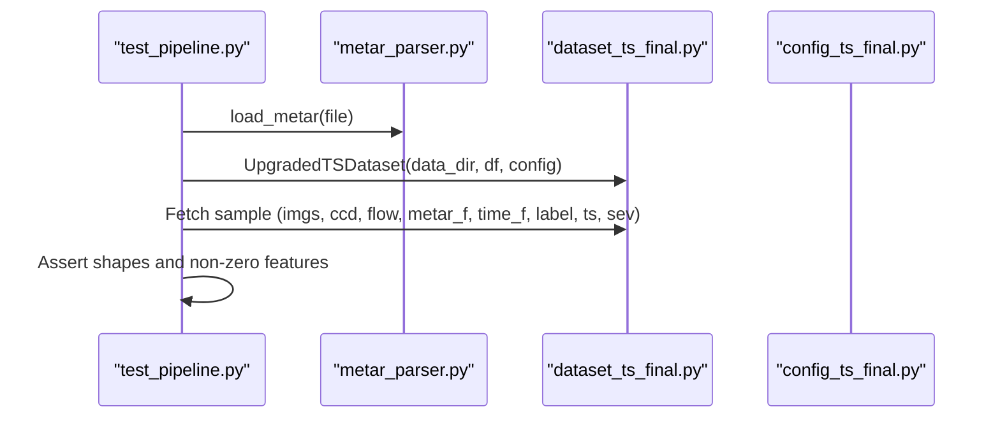

**Diagram sources**
- [test_pipeline.py:1-54](file://extras/test_pipeline.py#L1-L54)
- [metar_parser.py](file://metar_parser.py)
- [dataset_ts_final.py](file://dataset_ts_final.py)
- [config_ts_final.py](file://config_ts_final.py)

**Section sources**
- [test_pipeline.py:1-54](file://extras/test_pipeline.py#L1-L54)

### Gust Verification Tools
Purpose: Validate wind speed statistics and explicit gust presence in METAR records.

Key behaviors:
- Parses METAR lines for wind patterns
- Computes totals and percentages for wind presence and explicit gusts (>16 kts)

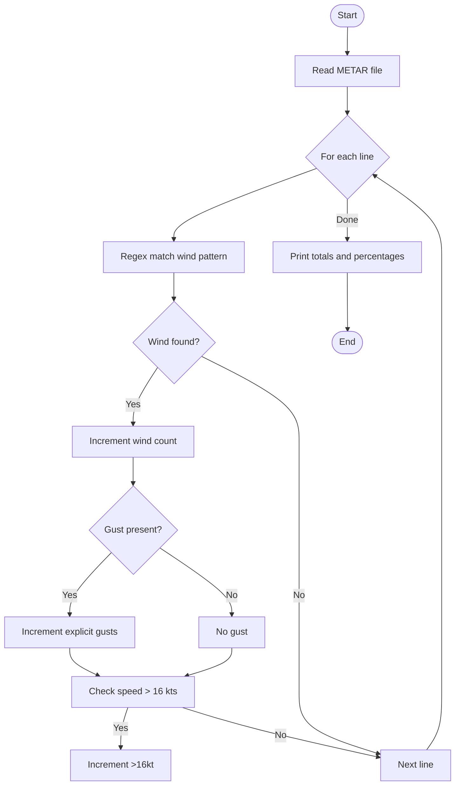

**Diagram sources**
- [check_gusts.py:1-34](file://extras/check_gusts.py#L1-L34)

**Section sources**
- [check_gusts.py:1-34](file://extras/check_gusts.py#L1-L34)

### Center Math Verification Utilities
Purpose: Validate cropping consistency across image dimensions using geometric similarity.

Key behaviors:
- Selects representative images per dimension
- Extracts masks and crops around a fixed center
- Computes MSE between reference crop and others to quantify drift

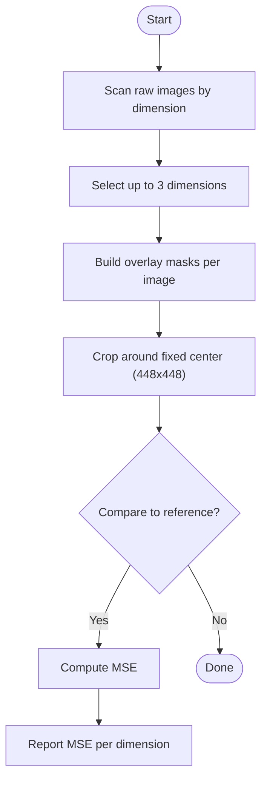

**Diagram sources**
- [verify_centers_math.py:1-51](file://extras/verify_centers_math.py#L1-L51)

**Section sources**
- [verify_centers_math.py:1-51](file://extras/verify_centers_math.py#L1-L51)

### Crop Mapping Validation Tools
Purpose: Validate coordinate mapping from raw image coordinates to normalized 224x224 crops.

Key behaviors:
- Defines CENTER_MAP per dimension
- Implements raw_to_cropped mapping with scaling and padding
- Visualizes mapping and interactive click support for validation

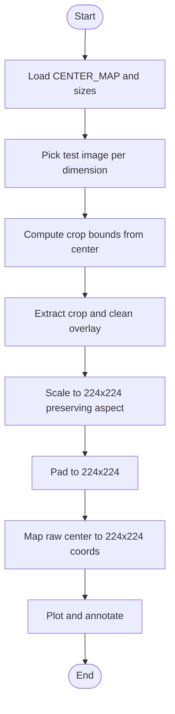

**Diagram sources**
- [verify_crop_mapping.py:1-166](file://extras/verify_crop_mapping.py#L1-L166)

**Section sources**
- [verify_crop_mapping.py:1-166](file://extras/verify_crop_mapping.py#L1-L166)

### Automated Center Finding Utilities
Purpose: Automatically detect centers across dimensions using template matching on masks.

Key behaviors:
- Builds overlay masks from HSV and grid/channel masks
- Uses template matching around a reference center to propose centers for other dimensions
- Saves verification crops and prints proposed CENTER_MAP

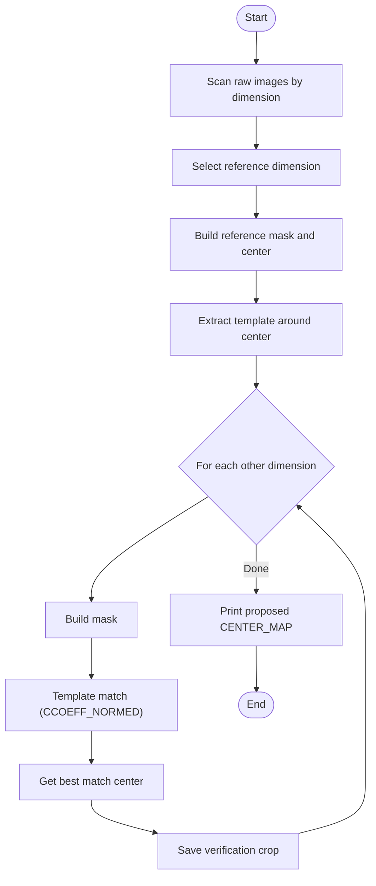

**Diagram sources**
- [auto_find_centers.py:1-101](file://extras/auto_find_centers.py#L1-L101)

**Section sources**
- [auto_find_centers.py:1-101](file://extras/auto_find_centers.py#L1-L101)

### Exact Center Search Utility
Purpose: Exhaustive search for the best matching center within a constrained window.

Key behaviors:
- Compares local regions around reference center across dimensions
- Minimizes MSE to find the best center and prints results

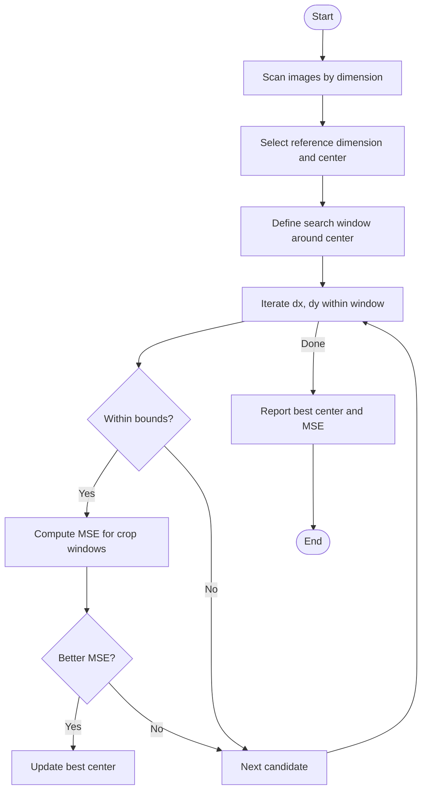

**Diagram sources**
- [find_exact_centers.py:1-65](file://extras/find_exact_centers.py#L1-L65)

**Section sources**
- [find_exact_centers.py:1-65](file://extras/find_exact_centers.py#L1-L65)

### Alignment and Boundary Checking
Purpose: Visually confirm center alignment across dimensions using masked overlays.

Key behaviors:
- Reads images per dimension, builds masks, and crops centered at the reference center
- Displays aligned crops and saves artifacts for inspection

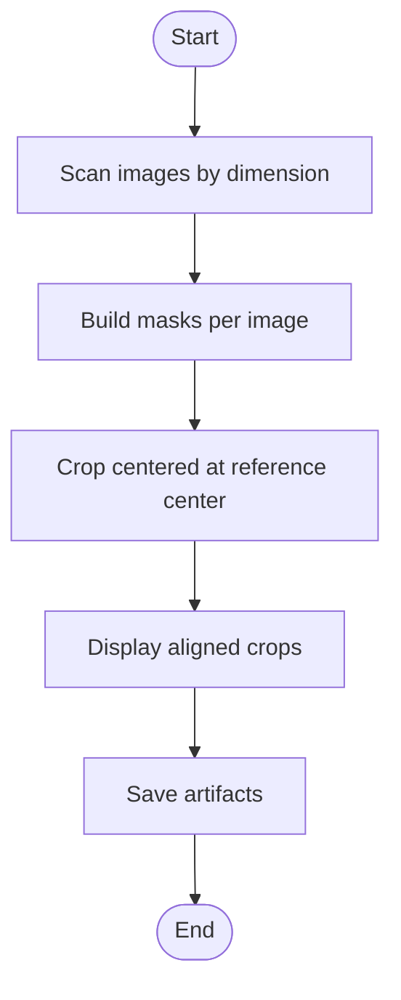

**Diagram sources**
- [check_alignment.py:1-54](file://extras/check_alignment.py#L1-L54)

**Section sources**
- [check_alignment.py:1-54](file://extras/check_alignment.py#L1-L54)

### Changes Verification Utilities
Purpose: Regression test for configuration, model, loss, metrics, and training setup.

Key behaviors:
- Validates config constants and flags
- Ensures model has learnable METAR scale parameter
- Confirms backbone freezing behavior
- Tests OHEM in loss and EMA smoothing effectiveness
- Verifies short false alarm metric and additive weight combinations
- Checks SWA configuration

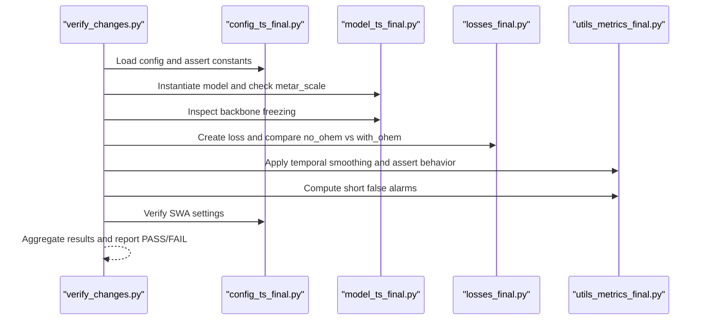

**Diagram sources**
- [verify_changes.py:1-99](file://extras/verify_changes.py#L1-L99)
- [config_ts_final.py](file://config_ts_final.py)
- [model_ts_final.py](file://model_ts_final.py)
- [losses_final.py](file://losses_final.py)
- [utils_metrics_final.py](file://utils_metrics_final.py)

**Section sources**
- [verify_changes.py:1-99](file://extras/verify_changes.py#L1-L99)

### Sample Dataset Creation
Purpose: Generate stratified train/validation indices for rapid hyperparameter tuning.

Key behaviors:
- Loads METAR and constructs dataset
- Extracts labels and timestamps
- Creates balanced sample with all positives, hard negatives near storms, and random negatives
- Saves indices for fast iteration

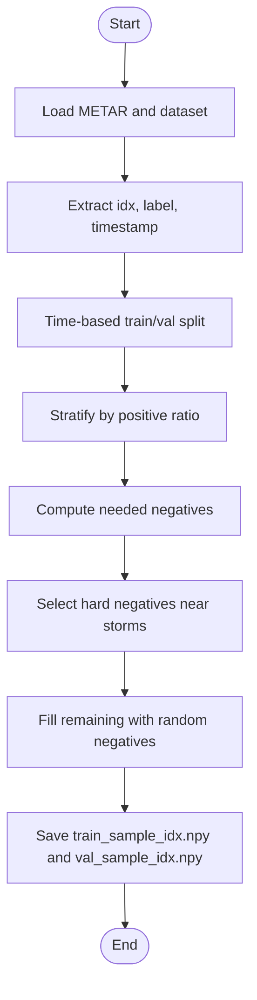

**Diagram sources**
- [create_sample_dataset.py:1-146](file://extras/create_sample_dataset.py#L1-L146)

**Section sources**
- [create_sample_dataset.py:1-146](file://extras/create_sample_dataset.py#L1-L146)

### Training Metrics Visualization
Purpose: Parse training logs and produce an 8-panel dashboard for regression monitoring.

Key behaviors:
- Parses JSON history or text logs
- Extracts per-epoch metrics: loss, frame/event metrics, weighted event metrics, lead times, aviation score
- Plots dashboard and annotates best epoch

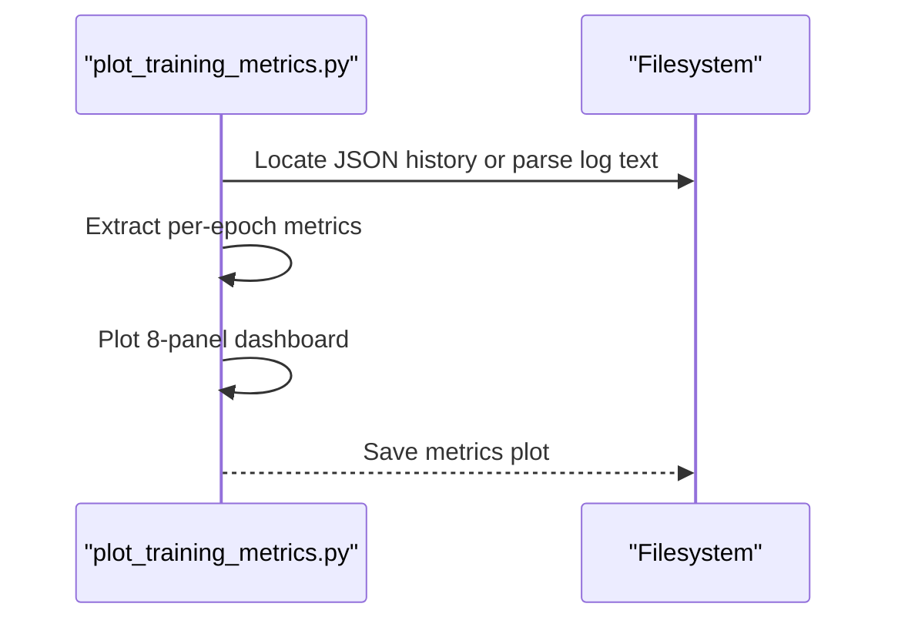

**Diagram sources**
- [plot_training_metrics.py:1-464](file://extras/plot_training_metrics.py#L1-L464)

**Section sources**
- [plot_training_metrics.py:1-464](file://extras/plot_training_metrics.py#L1-L464)

### TS Event Visualization
Purpose: Classify and visualize thunderstorm events by severity over time.

Key behaviors:
- Loads METAR, filters for a date range
- Groups consecutive reports into events and classifies severity
- Produces stacked bar charts and timeline plots

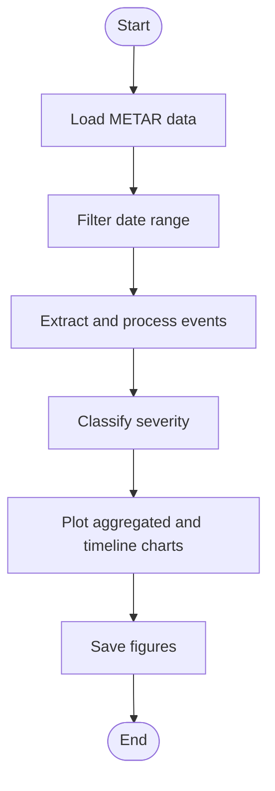

**Diagram sources**
- [visualize_ts_events.py:1-217](file://extras/visualize_ts_events.py#L1-L217)

**Section sources**
- [visualize_ts_events.py:1-217](file://extras/visualize_ts_events.py#L1-L217)

### Static Mask Generation
Purpose: Produce robust static masks per image dimension for preprocessing.

Key behaviors:
- Identifies clear season files and groups by dimension
- Scores crops by clarity and computes median crop
- Applies tuned HSV and color-based masks, dilates, and saves

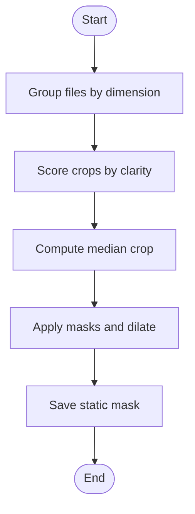

**Diagram sources**
- [generate_static_masks.py:1-150](file://extras/generate_static_masks.py#L1-L150)

**Section sources**
- [generate_static_masks.py:1-150](file://extras/generate_static_masks.py#L1-L150)

### Data Downloader
Purpose: Download MOSDAC IR imagery with rate limiting and error handling.

Key behaviors:
- Generates time slots and downloads images sequentially
- Adds random delays to avoid IP blocking and system strain

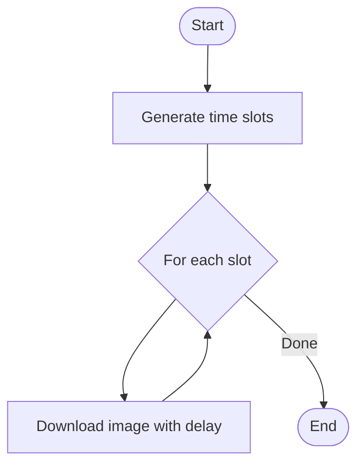

**Diagram sources**
- [st_dwn.py:1-63](file://extras/st_dwn.py#L1-L63)

**Section sources**
- [st_dwn.py:1-63](file://extras/st_dwn.py#L1-L63)

### Master Pipeline
Purpose: Orchestrate training, evaluation, ensemble, and ablation runs.

Key behaviors:
- Supports optional delay and cross-validation fold selection
- Executes training, evaluates best and SWA models, ensemble, and ablation
- Reports timing and success/failure

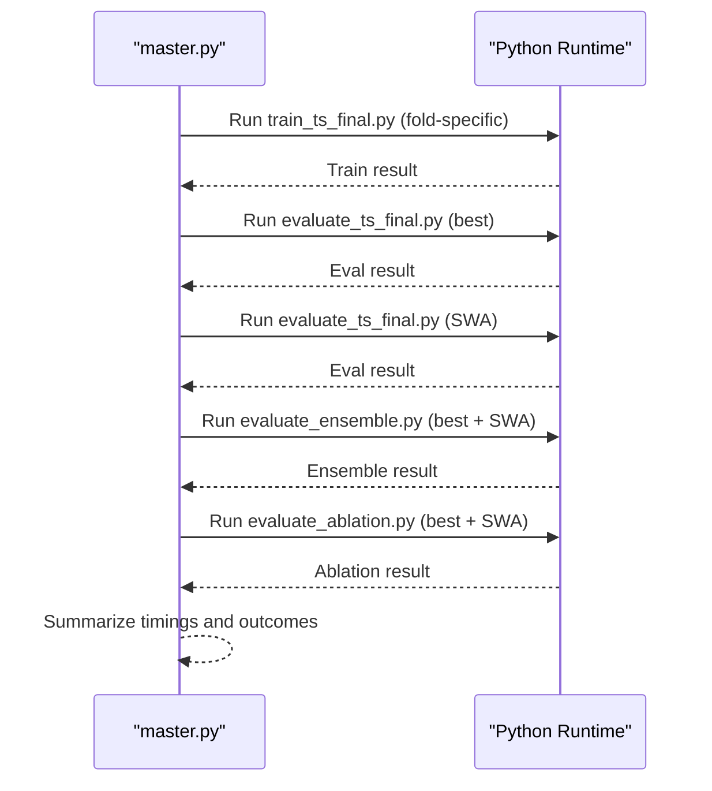

**Diagram sources**
- [master.py:1-108](file://master.py#L1-L108)

**Section sources**
- [master.py:1-108](file://master.py#L1-L108)

## Dependency Analysis
The testing utilities depend on core modules for configuration, datasets, models, and metrics. The master pipeline depends on training and evaluation scripts.

```mermaid
graph TB
ST["extras/smoke_test.py"] --> MOD["model_ts_final.py"]
ST --> CFG["config_ts_final.py"]
TP["extras/test_pipeline.py"] --> MTR["metar_parser.py"]
TP --> DAT["dataset_ts_final.py"]
TP --> CFG
VC["extras/verify_changes.py"] --> CFG
VC --> MOD
VC --> LOS["losses_final.py"]
VC --> MET["utils_metrics_final.py"]
CSD["extras/create_sample_dataset.py"] --> DAT
CSD --> MTR
CSD --> CFG
PTM["extras/plot_training_metrics.py"] --> CFG
VTE["extras/visualize_ts_events.py"] --> MTR
VTE --> CFG
VCM["extras/verify_centers_math.py"] --> CFG
VCMAP["extras/verify_crop_mapping.py"] --> CFG
AFC["extras/auto_find_centers.py"] --> CFG
FEC["extras/find_exact_centers.py"] --> CFG
CAL["extras/check_alignment.py"] --> CFG
GSM["extras/generate_static_masks.py"] --> CFG
STD["extras/st_dwn.py"] --> CFG
MST["master.py"] --> CFG
```

**Diagram sources**
- [smoke_test.py:1-27](file://extras/smoke_test.py#L1-L27)
- [test_pipeline.py:1-54](file://extras/test_pipeline.py#L1-L54)
- [verify_changes.py:1-99](file://extras/verify_changes.py#L1-L99)
- [create_sample_dataset.py:1-146](file://extras/create_sample_dataset.py#L1-L146)
- [plot_training_metrics.py:1-464](file://extras/plot_training_metrics.py#L1-L464)
- [visualize_ts_events.py:1-217](file://extras/visualize_ts_events.py#L1-L217)
- [verify_centers_math.py:1-51](file://extras/verify_centers_math.py#L1-L51)
- [verify_crop_mapping.py:1-166](file://extras/verify_crop_mapping.py#L1-L166)
- [auto_find_centers.py:1-101](file://extras/auto_find_centers.py#L1-L101)
- [find_exact_centers.py:1-65](file://extras/find_exact_centers.py#L1-L65)
- [check_alignment.py:1-54](file://extras/check_alignment.py#L1-L54)
- [generate_static_masks.py:1-150](file://extras/generate_static_masks.py#L1-L150)
- [st_dwn.py:1-63](file://extras/st_dwn.py#L1-L63)
- [master.py:1-108](file://master.py#L1-L108)
- [metar_parser.py](file://metar_parser.py)
- [dataset_ts_final.py](file://dataset_ts_final.py)
- [model_ts_final.py](file://model_ts_final.py)
- [config_ts_final.py](file://config_ts_final.py)
- [utils_metrics_final.py](file://utils_metrics_final.py)
- [losses_final.py](file://losses_final.py)

**Section sources**
- [master.py:1-108](file://master.py#L1-L108)

## Performance Considerations
- Use synthetic inputs in smoke tests to avoid heavy I/O and validate compute paths quickly.
- Prefer JSON history parsing for training metrics visualization to reduce text parsing overhead.
- Limit sample sizes in dataset creation to accelerate hyperparameter sweeps while preserving stratification.
- Apply rate limiting and retries in data downloaders to maintain stability and avoid throttling.
- Cache computed masks and artifacts to minimize repeated computation during validation.

## Troubleshooting Guide
Common issues and remedies:
- Smoke test failures: Verify configuration dimensions and input shapes; ensure model initialization succeeds.
- Pipeline test errors: Confirm METAR file path and column presence; inspect dataset indexing and normalization.
- Gust verification anomalies: Check regex patterns and file encoding; validate that wind speeds are parsed correctly.
- Center math mismatches: Validate mask thresholds and ensure consistent cropping boundaries across dimensions.
- Crop mapping inconsistencies: Confirm CENTER_MAP entries and mapping logic; visualize outputs to debug coordinate transforms.
- Changes verification regressions: Review config updates and model parameter flags; re-run individual checks for failing assertions.
- Sample dataset imbalance: Adjust target ratios and hard negative windows to achieve desired balance.
- Training visualization errors: Ensure JSON history exists or log format matches parser expectations.
- Static mask artifacts: Tune HSV thresholds per dimension and adjust dilation iterations.
- Data downloader failures: Increase timeouts and retry counts; monitor network connectivity and server availability.
- Master pipeline interruptions: Use delay option to schedule runs; handle keyboard interrupts gracefully.

**Section sources**
- [smoke_test.py:1-27](file://extras/smoke_test.py#L1-L27)
- [test_pipeline.py:1-54](file://extras/test_pipeline.py#L1-L54)
- [check_gusts.py:1-34](file://extras/check_gusts.py#L1-L34)
- [verify_centers_math.py:1-51](file://extras/verify_centers_math.py#L1-L51)
- [verify_crop_mapping.py:1-166](file://extras/verify_crop_mapping.py#L1-L166)
- [verify_changes.py:1-99](file://extras/verify_changes.py#L1-L99)
- [create_sample_dataset.py:1-146](file://extras/create_sample_dataset.py#L1-L146)
- [plot_training_metrics.py:1-464](file://extras/plot_training_metrics.py#L1-L464)
- [generate_static_masks.py:1-150](file://extras/generate_static_masks.py#L1-L150)
- [st_dwn.py:1-63](file://extras/st_dwn.py#L1-L63)
- [master.py:1-108](file://master.py#L1-L108)

## Conclusion
The testing and development utilities provide a comprehensive toolkit for validating system health, ensuring pipeline reliability, verifying mathematical correctness, and accelerating iterative development. By leveraging smoke tests, pipeline validations, gust checks, center math and mapping verifications, automated dataset sampling, training dashboards, and master orchestration, teams can maintain high code quality and robustness throughout the project lifecycle.

## Appendices
- Best practices:
  - Keep smoke tests minimal and fast; run frequently during development.
  - Use dataset sampling for rapid hyperparameter tuning and early-stage debugging.
  - Validate configuration changes with targeted regression checks.
  - Visualize training progress and event distributions to catch regressions early.
  - Automate data acquisition with rate limiting and robust error handling.
  - Orchestrate end-to-end workflows with clear phase separation and logging.