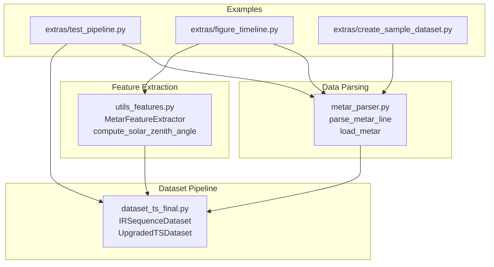
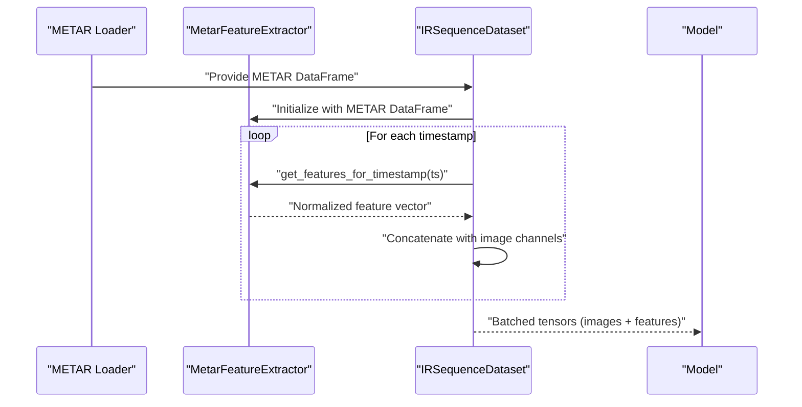
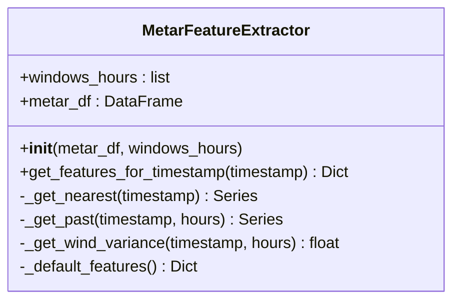
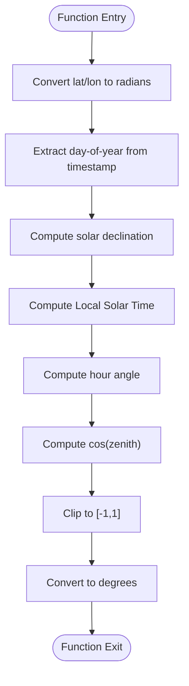
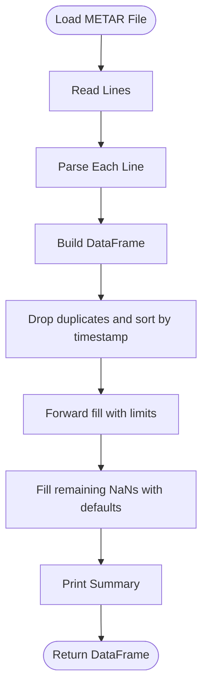
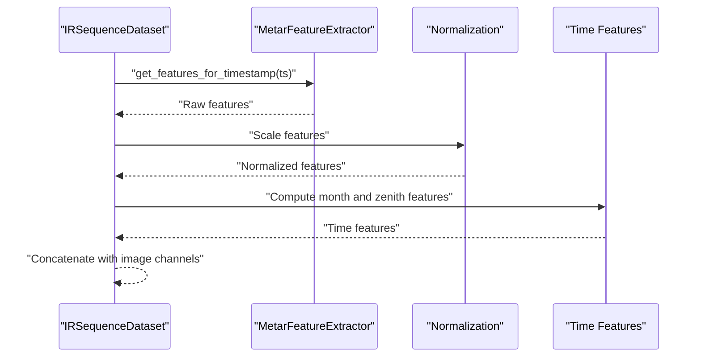
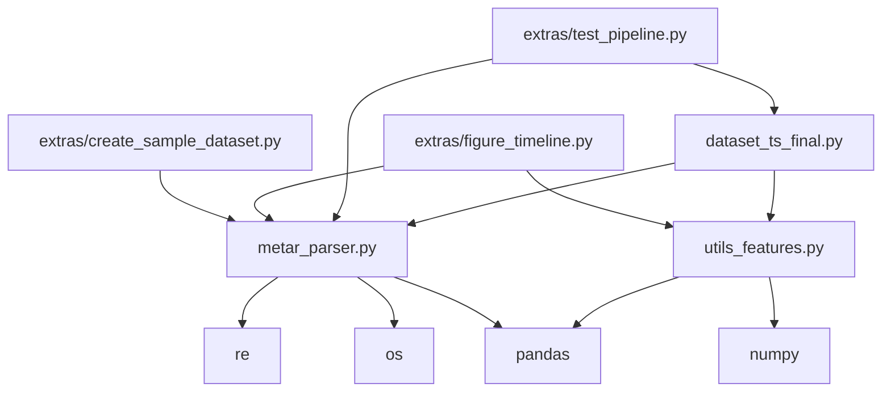

# Feature Engineering Utilities

<cite>
**Referenced Files in This Document**
- [utils_features.py](file://utils_features.py)
- [metar_parser.py](file://metar_parser.py)
- [dataset_ts_final.py](file://dataset_ts_final.py)
- [extras/test_pipeline.py](file://extras/test_pipeline.py)
- [extras/figure_timeline.py](file://extras/figure_timeline.py)
- [extras/create_sample_dataset.py](file://extras/create_sample_dataset.py)
</cite>

## Table of Contents
1. [Introduction](#introduction)
2. [Project Structure](#project-structure)
3. [Core Components](#core-components)
4. [Architecture Overview](#architecture-overview)
5. [Detailed Component Analysis](#detailed-component-analysis)
6. [Dependency Analysis](#dependency-analysis)
7. [Performance Considerations](#performance-considerations)
8. [Troubleshooting Guide](#troubleshooting-guide)
9. [Conclusion](#conclusion)
10. [Appendices](#appendices)

## Introduction
This document provides comprehensive documentation for the feature engineering utilities focused on meteorological feature extraction and processing. It covers:
- The MetarFeatureExtractor class for computing pressure drop metrics, wind pattern analysis, cloud composition features, and a composite risk index
- Solar zenith angle computation for diurnal solar insolation modeling
- METAR parsing functionality for integrating weather station data
- Parameter specifications, feature calculation algorithms, and usage examples
- Data validation, interpolation methods, and fallback mechanisms for missing data
- Guidelines for extending feature extraction logic and integrating new meteorological variables

## Project Structure
The feature engineering utilities are implemented in two primary modules:
- utils_features.py: Contains the MetarFeatureExtractor class and the solar zenith angle computation function
- metar_parser.py: Provides METAR parsing and loading utilities

These utilities integrate with the broader dataset pipeline in dataset_ts_final.py, where features are extracted per timestamp and normalized for model consumption.

**Diagram sources**
- [utils_features.py:11-191](file://utils_features.py#L11-L191)
- [metar_parser.py:13-186](file://metar_parser.py#L13-L186)
- [dataset_ts_final.py:340-515](file://dataset_ts_final.py#L340-L515)
- [extras/test_pipeline.py:13-54](file://extras/test_pipeline.py#L13-L54)
- [extras/figure_timeline.py:44-102](file://extras/figure_timeline.py#L44-L102)
- [extras/create_sample_dataset.py:86-146](file://extras/create_sample_dataset.py#L86-L146)

**Section sources**
- [utils_features.py:11-191](file://utils_features.py#L11-L191)
- [metar_parser.py:13-186](file://metar_parser.py#L13-L186)
- [dataset_ts_final.py:340-515](file://dataset_ts_final.py#L340-L515)
- [extras/test_pipeline.py:13-54](file://extras/test_pipeline.py#L13-L54)
- [extras/figure_timeline.py:44-102](file://extras/figure_timeline.py#L44-L102)
- [extras/create_sample_dataset.py:86-146](file://extras/create_sample_dataset.py#L86-L146)

## Core Components
- MetarFeatureExtractor: Extracts and computes meteorological features aligned with image timestamps. It supports pressure drop calculations over configurable windows, wind pattern analysis, cloud composition features, and a composite risk index. It also includes robust fallbacks and interpolation for missing data.
- compute_solar_zenith_angle: Computes the solar zenith angle for a given UTC timestamp and geographic coordinates, enabling diurnal solar insolation modeling.
- parse_metar_line and load_metar: Parse raw METAR lines into structured records and load them into a time-indexed DataFrame with gap-filling and defaults.

Key capabilities:
- Time-aware alignment of METAR features with image timestamps
- Normalization and scaling for neural network inputs
- Configurable windows for pressure drop analysis
- Comprehensive fallbacks for missing or invalid data

**Section sources**
- [utils_features.py:11-191](file://utils_features.py#L11-L191)
- [metar_parser.py:13-186](file://metar_parser.py#L13-L186)

## Architecture Overview
The feature extraction pipeline integrates METAR data with image sequences and time features. The dataset classes extract per-frame features and concatenate them with image channels for model training or inference.

**Diagram sources**
- [dataset_ts_final.py:340-515](file://dataset_ts_final.py#L340-L515)
- [utils_features.py:39-126](file://utils_features.py#L39-L126)

**Section sources**
- [dataset_ts_final.py:340-515](file://dataset_ts_final.py#L340-L515)
- [utils_features.py:39-126](file://utils_features.py#L39-L126)

## Detailed Component Analysis

### MetarFeatureExtractor
The MetarFeatureExtractor class encapsulates all meteorological feature computations from METAR data. It aligns features with image timestamps and applies normalization and fallbacks.

Key parameters and initialization:
- metar_df: DataFrame with columns ['timestamp', 'pressure', 'wind_dir', 'wind_speed', 'wind_gust', 'dewpoint', 'temperature', 'TS', plus optional cloud fields]
- windows_hours: List of hours for pressure drop windows (default [3, 6])

Core feature computations:
- Basic features: wind_dir, wind_speed (converted from knots to km/h), dewpoint, temperature, pressure
- Cloud composition features: presence of cumulonimbus/cumulus (has_cb, has_tcu), low/mid/high cloud cover, low cloud base, max cloud layers, cloud base spread
- Pressure drops: pressure drop over configured windows (negative indicates falling pressure)
- Wind speed change: difference in wind speed over 3 hours
- Dewpoint trend: difference in dewpoint over 3 hours
- Dewpoint depression: (temperature - dewpoint) normalized by 20
- Wind shift: cyclic directional change over 3 hours
- Rolling wind variance: standard deviation of wind speed over 6 hours, normalized by 20
- Composite risk index: heuristic sum of risk factors with a cap at 1.0

Fallback and interpolation:
- Missing columns are initialized to safe defaults during construction
- Interpolation uses time-aware method with forward-fill/back-fill to handle gaps
- Nearest neighbor lookup with tolerance ensures robust alignment to timestamps

Usage examples:
- Integration in dataset pipeline for sequence-aware feature extraction
- Inference-time extraction for single timestamps

**Diagram sources**
- [utils_features.py:11-171](file://utils_features.py#L11-L171)

**Section sources**
- [utils_features.py:11-171](file://utils_features.py#L11-L171)
- [dataset_ts_final.py:402-421](file://dataset_ts_final.py#L402-L421)

### Solar Zenith Angle Computation
The compute_solar_zenith_angle function computes the solar zenith angle for a given UTC timestamp and geographic coordinates. This angle serves as a physical proxy for diurnal solar insolation and is normalized for neural network inputs.

Parameters:
- timestamp_utc: pandas Timestamp in UTC
- lat: latitude in degrees (default 21.1)
- lon: longitude in degrees (default 79.05)

Algorithm highlights:
- Computes solar declination based on day-of-year
- Converts UTC to local solar time
- Calculates hour angle and zenith cosine
- Clips cosine to [-1, 1] and converts to degrees

Integration:
- Used in dataset pipeline to augment time features with a normalized zenith angle

**Diagram sources**
- [utils_features.py:173-191](file://utils_features.py#L173-L191)

**Section sources**
- [utils_features.py:173-191](file://utils_features.py#L173-L191)
- [dataset_ts_final.py:422-434](file://dataset_ts_final.py#L422-L434)

### METAR Parsing and Loading
The METAR parsing utilities convert raw METAR lines into structured records suitable for feature extraction.

Parsing logic:
- Extracts timestamp from the first token
- Parses wind direction/speed/gust using regex
- Parses temperature/dewpoint with support for negative values
- Extracts QNH pressure
- Identifies cloud types (CB/TCU) and cover categories (FEW/SCT/BKN/OVC)
- Computes cloud base spread and low cloud base
- Extracts visibility and rainfall intensity

Loading logic:
- Loads METAR file line-by-line, parses each line, and constructs a DataFrame
- Sorts by timestamp and removes duplicates
- Applies forward-fill with limits and fills remaining NaNs with defaults
- Prints summary statistics

**Diagram sources**
- [metar_parser.py:141-186](file://metar_parser.py#L141-L186)

**Section sources**
- [metar_parser.py:13-186](file://metar_parser.py#L13-L186)

### Dataset Integration and Usage
The dataset pipeline integrates METAR features and time features into the model input tensor.

Highlights:
- Sequence-aware extraction: for each frame in a sequence, the extractor aligns METAR features to the frame’s timestamp
- Normalization: features are scaled to reasonable ranges for neural networks
- Time features: month sine/cosine and normalized zenith angle are included when enabled
- Augmentation compatibility: features are zeroed during temporal masking to maintain consistency

**Diagram sources**
- [dataset_ts_final.py:402-434](file://dataset_ts_final.py#L402-L434)
- [utils_features.py:39-126](file://utils_features.py#L39-L126)

**Section sources**
- [dataset_ts_final.py:402-434](file://dataset_ts_final.py#L402-L434)
- [utils_features.py:39-126](file://utils_features.py#L39-L126)

## Dependency Analysis
- utils_features.py depends on pandas, numpy, and typing for feature extraction and solar angle computation
- metar_parser.py depends on regex, os, and pandas for parsing and loading METAR data
- dataset_ts_final.py imports MetarFeatureExtractor and compute_solar_zenith_angle to build model inputs
- Example scripts demonstrate end-to-end usage of METAR parsing and dataset integration

**Diagram sources**
- [utils_features.py:6-8](file://utils_features.py#L6-L8)
- [metar_parser.py:1,4](file://metar_parser.py#L1,L4)
- [dataset_ts_final.py:22,342](file://dataset_ts_final.py#L22,L342)
- [extras/test_pipeline.py:9,10](file://extras/test_pipeline.py#L9,L10)
- [extras/figure_timeline.py:30,37](file://extras/figure_timeline.py#L30,L37)
- [extras/create_sample_dataset.py:19,20](file://extras/create_sample_dataset.py#L19,L20)

**Section sources**
- [utils_features.py:6-8](file://utils_features.py#L6-L8)
- [metar_parser.py:1,4](file://metar_parser.py#L1,L4)
- [dataset_ts_final.py:22,342](file://dataset_ts_final.py#L22,L342)
- [extras/test_pipeline.py:9,10](file://extras/test_pipeline.py#L9,L10)
- [extras/figure_timeline.py:30,37](file://extras/figure_timeline.py#L30,L37)
- [extras/create_sample_dataset.py:19,20](file://extras/create_sample_dataset.py#L19,L20)

## Performance Considerations
- Time-aware alignment: Uses pandas nearest-neighbor indexer with tolerance to minimize latency mismatch
- Interpolation strategy: Time-based interpolation combined with forward/back-fill reduces computational overhead while maintaining continuity
- Normalization: Scales features to fixed ranges to improve numerical stability and convergence
- Rolling statistics: Wind variance computed over short windows to balance responsiveness and stability
- Memory efficiency: Features are extracted per timestamp and concatenated into tensors during dataset iteration

[No sources needed since this section provides general guidance]

## Troubleshooting Guide
Common issues and resolutions:
- Empty METAR DataFrame: The extractor raises an error on empty input; ensure the METAR file is valid and contains records
- Missing columns: The extractor initializes missing columns to defaults; verify that required columns are present or rely on fallbacks
- Missing data gaps: Interpolation and forward-fill/back-fill are applied; if gaps persist, adjust tolerance or increase fill limits
- Timestamp misalignment: The extractor tolerates small offsets via nearest-neighbor lookup; ensure timestamps are close to the expected cadence
- Composite risk index anomalies: Risk thresholds are heuristic; tune thresholds based on local conditions and validation performance

**Section sources**
- [utils_features.py:24-38](file://utils_features.py#L24-L38)
- [utils_features.py:157-171](file://utils_features.py#L157-L171)
- [metar_parser.py:147-181](file://metar_parser.py#L147-L181)

## Conclusion
The feature engineering utilities provide a robust foundation for incorporating meteorological conditions into the forecasting pipeline. The MetarFeatureExtractor offers comprehensive feature computation with strong fallbacks and normalization, while the solar zenith angle computation enables diurnal modeling. The METAR parsing utilities ensure reliable ingestion and preprocessing of weather station data. Together, these components enable scalable and maintainable integration of environmental features for machine learning applications.

[No sources needed since this section summarizes without analyzing specific files]

## Appendices

### Parameter Specifications and Feature Definitions
- MetarFeatureExtractor
  - windows_hours: List of hours for pressure drop windows (default [3, 6])
  - Required columns: ['timestamp', 'pressure', 'wind_dir', 'wind_speed', 'wind_gust', 'dewpoint', 'temperature', 'TS']
  - Optional cloud columns: ['has_cb', 'has_tcu', 'cloud_low_cover', 'cloud_mid_cover', 'cloud_high_cover', 'cloud_low_base', 'max_cloud_layers', 'cloud_base_spread']
- compute_solar_zenith_angle
  - lat: latitude in degrees (default 21.1)
  - lon: longitude in degrees (default 79.05)
- Dataset integration
  - Normalization ranges: pressure_drop_*h (div by 5), wind_dir (div by 360), wind_speed (div by 100), wind_speed_change_3h (div by 50), dewpoint (div by 40), dewpoint_trend_3h (div by 10), composite_risk, dewpoint_depression, wind_shift_3h, rolling_wind_var, cloud_* (as applicable), cloud_low_base (div by 10), max_cloud_layers (div by 5), cloud_base_spread (div by 10)

**Section sources**
- [utils_features.py:17-28](file://utils_features.py#L17-L28)
- [utils_features.py:39-126](file://utils_features.py#L39-L126)
- [dataset_ts_final.py:408-420](file://dataset_ts_final.py#L408-L420)

### Usage Examples
- End-to-end pipeline verification: See extras/test_pipeline.py for METAR loading and dataset sampling
- Inference with METAR features: See extras/figure_timeline.py for constructing an upgraded dataset with MetarFeatureExtractor
- Sample dataset creation: See extras/create_sample_dataset.py for building stratified samples using METAR-derived labels

**Section sources**
- [extras/test_pipeline.py:13-54](file://extras/test_pipeline.py#L13-L54)
- [extras/figure_timeline.py:44-102](file://extras/figure_timeline.py#L44-L102)
- [extras/create_sample_dataset.py:86-146](file://extras/create_sample_dataset.py#L86-L146)

### Extending Feature Extraction Logic
Guidelines for adding new meteorological variables:
- Define parsing logic in metar_parser.py if extracting from METAR lines
- Add feature computation in MetarFeatureExtractor.get_features_for_timestamp
- Apply normalization consistent with existing features
- Integrate into dataset pipeline by updating the feature concatenation logic
- Ensure fallbacks and interpolation remain compatible with new features

[No sources needed since this section provides general guidance]