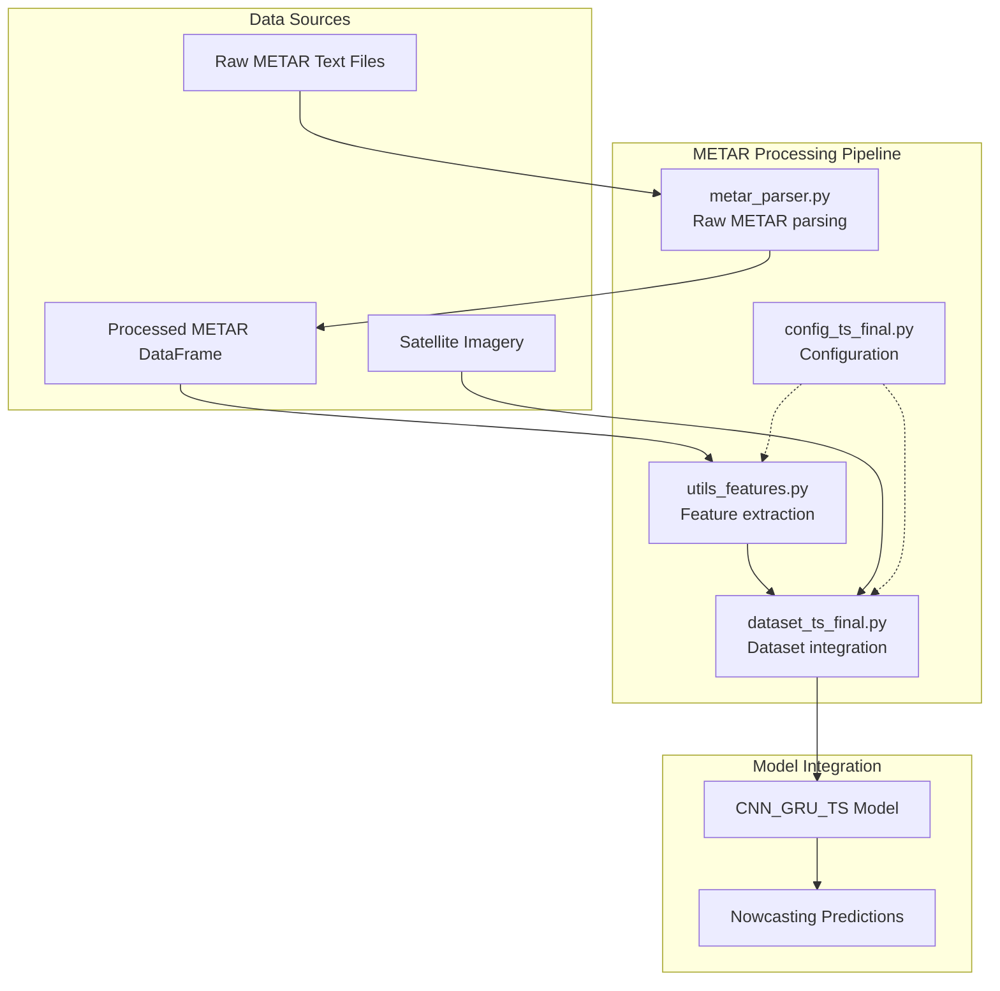
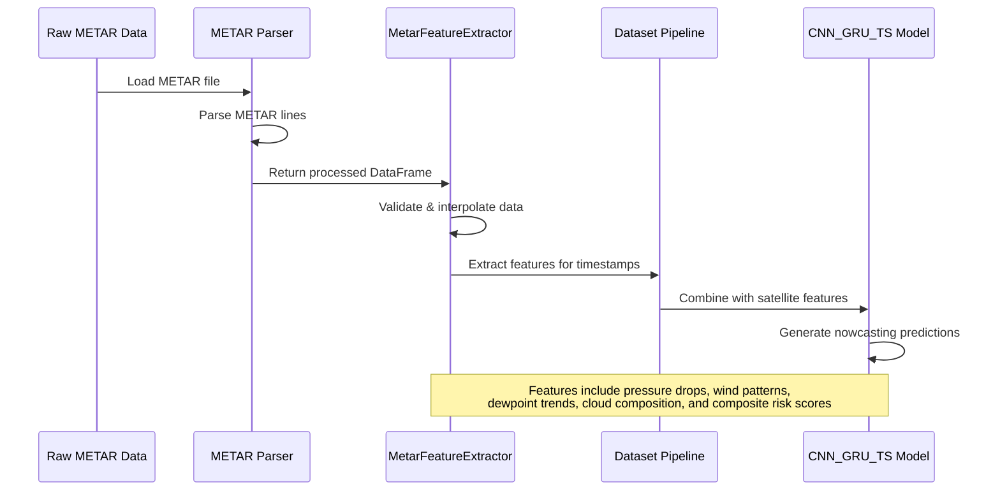
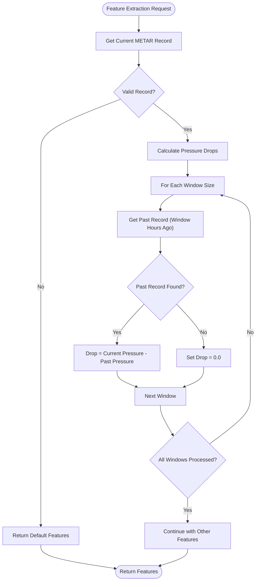
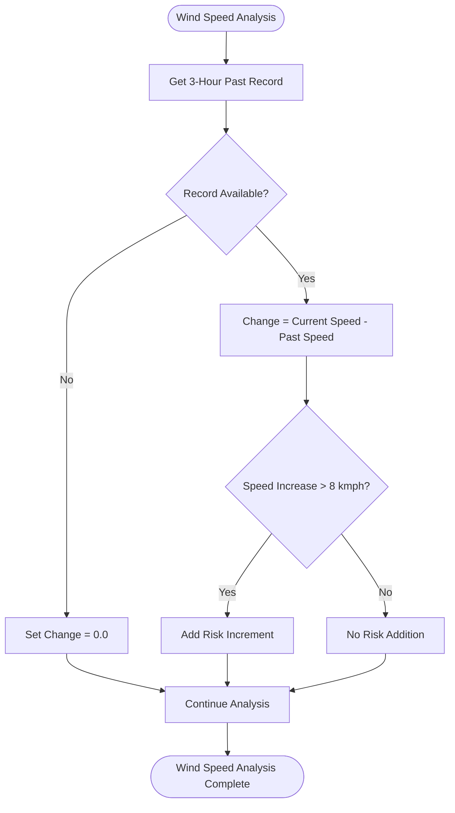
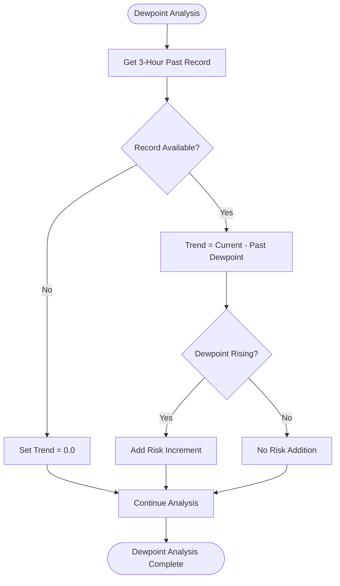
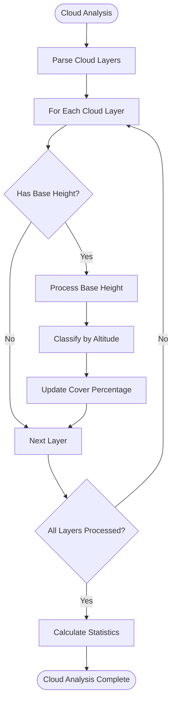
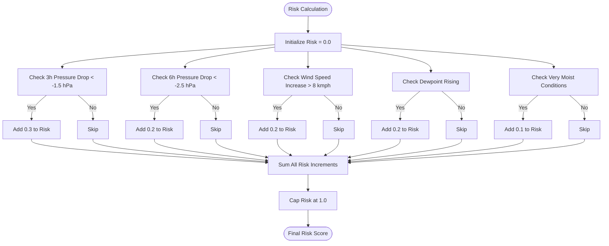
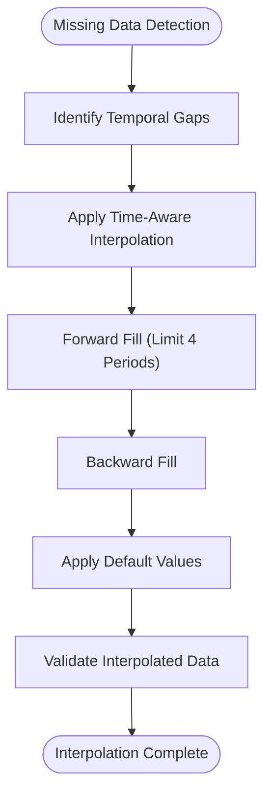
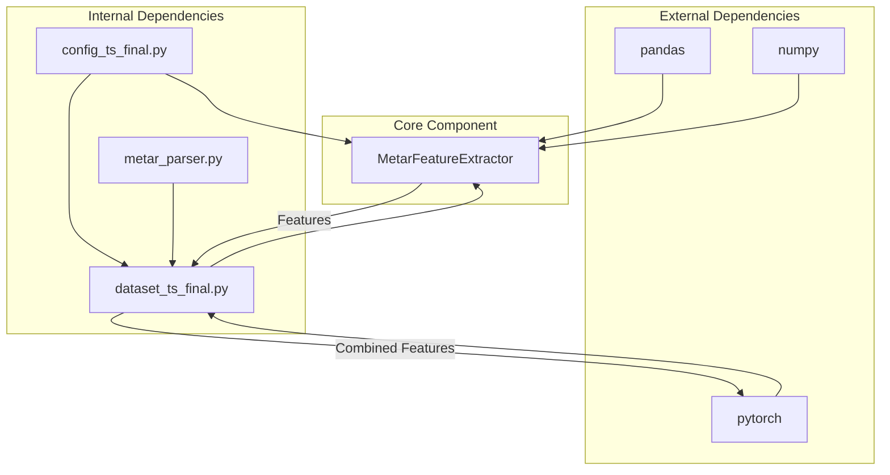

# METAR Feature Extractor

<cite>
**Referenced Files in This Document**
- [utils_features.py](file://utils_features.py)
- [metar_parser.py](file://metar_parser.py)
- [dataset_ts_final.py](file://dataset_ts_final.py)
- [config_ts_final.py](file://config_ts_final.py)
- [test_metar.py](file://scratch/test_metar.py)
</cite>

## Table of Contents
1. [Introduction](#introduction)
2. [Project Structure](#project-structure)
3. [Core Components](#core-components)
4. [Architecture Overview](#architecture-overview)
5. [Detailed Component Analysis](#detailed-component-analysis)
6. [Dependency Analysis](#dependency-analysis)
7. [Performance Considerations](#performance-considerations)
8. [Troubleshooting Guide](#troubleshooting-guide)
9. [Conclusion](#conclusion)

## Introduction

The MetarFeatureExtractor class is a specialized meteorological feature extraction component designed to process METAR (Meteorological Terminal Aviation Routine Weather Report) weather station data for use in convective storm nowcasting systems. This component serves as a bridge between raw METAR observations and machine learning models, extracting meaningful atmospheric features that indicate evolving weather conditions and potential storm development.

The extractor focuses on several key meteorological phenomena:
- **Pressure dynamics**: Detection of pressure drops indicating approaching weather systems
- **Wind pattern analysis**: Direction changes, speed variations, and wind variability
- **Moisture indicators**: Dewpoint trends and depression calculations
- **Cloud composition**: CB/TCU detection and vertical cloud layer characteristics
- **Composite risk assessment**: Multi-factor risk scoring for storm classification

## Project Structure

The METAR feature extraction functionality is distributed across several interconnected modules within the weather forecasting pipeline:

**Diagram sources**
- [metar_parser.py:13-186](file://metar_parser.py#L13-L186)
- [utils_features.py:11-171](file://utils_features.py#L11-L171)
- [dataset_ts_final.py:390-420](file://dataset_ts_final.py#L390-L420)

**Section sources**
- [metar_parser.py:13-186](file://metar_parser.py#L13-L186)
- [utils_features.py:11-171](file://utils_features.py#L11-L171)
- [dataset_ts_final.py:390-420](file://dataset_ts_final.py#L390-L420)

## Core Components

### MetarFeatureExtractor Class

The MetarFeatureExtractor is the primary component responsible for transforming METAR observations into standardized features suitable for machine learning applications. The class maintains a structured approach to feature extraction with built-in data validation and interpolation capabilities.

#### Initialization Parameters

The constructor accepts two primary parameters:

| Parameter | Type | Default | Description |
|-----------|------|---------|-------------|
| `metar_df` | pandas.DataFrame | Required | DataFrame containing METAR observations with timestamp index |
| `windows_hours` | list[int] | [3, 6] | List of pressure drop calculation windows in hours |

**Required DataFrame Structure:**
The METAR DataFrame must contain the following columns:
- `timestamp`: Datetime index (sorted chronologically)
- `pressure`: Atmospheric pressure readings (hPa)
- `wind_dir`: Wind direction (degrees)
- `wind_speed`: Wind speed (knots)
- `wind_gust`: Wind gust speeds (knots)
- `dewpoint`: Dewpoint temperature (°C)
- `temperature`: Temperature (°C)
- `TS`: Thunderstorm indicator (binary)

#### Data Validation and Preprocessing

The extractor performs comprehensive data validation during initialization:

1. **Empty DataFrame Check**: Raises ValueError if input DataFrame is empty
2. **Column Validation**: Ensures required columns exist, filling missing ones with defaults
3. **Time Series Alignment**: Sorts data by timestamp and sets as index
4. **Missing Value Interpolation**: Uses time-aware interpolation to handle gaps

**Section sources**
- [utils_features.py:17-38](file://utils_features.py#L17-L38)

## Architecture Overview

The MetarFeatureExtractor operates within a broader weather forecasting architecture that integrates multiple data sources and processing stages:

**Diagram sources**
- [metar_parser.py:141-186](file://metar_parser.py#L141-L186)
- [utils_features.py:39-126](file://utils_features.py#L39-L126)
- [dataset_ts_final.py:402-420](file://dataset_ts_final.py#L402-L420)

## Detailed Component Analysis

### Pressure Drop Calculation System

The pressure drop calculation system monitors atmospheric pressure changes over configurable time windows to detect approaching weather systems.

#### Implementation Details

**Diagram sources**
- [utils_features.py:67-76](file://utils_features.py#L67-L76)
- [utils_features.py:137-144](file://utils_features.py#L137-L144)

#### Pressure Drop Thresholds

The system calculates pressure drops for configured window sizes (default: 3h and 6h). The implementation uses negative values to indicate falling pressure (indicative of approaching low-pressure systems):

- **3-hour window**: Falls below -1.5 hPa triggers risk increment
- **6-hour window**: Falls below -2.5 hPa triggers risk increment

**Section sources**
- [utils_features.py:67-76](file://utils_features.py#L67-L76)
- [utils_features.py:113-116](file://utils_features.py#L113-L116)

### Wind Pattern Analysis Module

The wind pattern analysis module extracts multiple aspects of wind behavior to identify storm development indicators.

#### Wind Speed Change Analysis

**Diagram sources**
- [utils_features.py:77-84](file://utils_features.py#L77-L84)
- [utils_features.py:117-118](file://utils_features.py#L117-L118)

#### Wind Direction Shift Detection

The wind shift calculation accounts for the cyclical nature of angular measurements:

1. **Direction Difference**: Calculates absolute difference between current and past directions
2. **Circular Adjustment**: Uses minimum of difference and 360°-difference to handle 0°/360° transitions
3. **Normalization**: Divides by 180° for standardized output

**Section sources**
- [utils_features.py:95-102](file://utils_features.py#L95-L102)

#### Rolling Wind Variance Calculation

The rolling wind variance provides insight into atmospheric instability:

- **Calculation Window**: 6-hour rolling standard deviation
- **Normalization**: Divided by 20.0 for consistent scaling
- **Fallback**: Returns 0.0 for insufficient data points

**Section sources**
- [utils_features.py:146-155](file://utils_features.py#L146-L155)

### Dewpoint Analysis System

The dewpoint analysis system tracks atmospheric moisture content and its temporal changes.

#### Dewpoint Trend Analysis

**Diagram sources**
- [utils_features.py:85-90](file://utils_features.py#L85-L90)
- [utils_features.py:119-120](file://utils_features.py#L119-L120)

#### Dewpoint Depression Calculation

The dewpoint depression (temperature minus dewpoint) serves as a moisture proxy:

- **Formula**: `(temperature - dewpoint) / 20.0`
- **Normalization**: Divided by 20.0 for consistent scaling
- **Interpretation**: Higher values indicate drier air, lower values indicate more humid conditions

**Section sources**
- [utils_features.py:92-93](file://utils_features.py#L92-L93)

### Cloud Composition Features

The cloud composition analysis extracts vertical cloud structure information crucial for thunderstorm identification.

#### Cloud Type Detection

The system identifies cumulonimbus (CB) and towering cumulus (TCU) clouds:

- **CB Detection**: Searches for CB pattern in METAR text
- **TCU Detection**: Searches for TCU pattern in METAR text
- **Binary Output**: Returns 1.0 for presence, 0.0 for absence

#### Cloud Layer Coverage Analysis

The extractor processes multiple cloud layers to determine atmospheric structure:

**Diagram sources**
- [metar_parser.py:77-103](file://metar_parser.py#L77-L103)

#### Cloud Altitude Classification

Cloud layers are classified by altitude thresholds:
- **Low Clouds**: ≤ 6,500 feet (0-2 km)
- **Mid Clouds**: 6,501-20,000 feet (2-6 km)
- **High Clouds**: > 20,000 feet (> 6 km)

**Section sources**
- [metar_parser.py:96-103](file://metar_parser.py#L96-L103)

### Composite Risk Indexing Algorithm

The composite risk index combines multiple meteorological indicators into a single risk score:

**Diagram sources**
- [utils_features.py:111-124](file://utils_features.py#L111-L124)

#### Risk Component Thresholds

| Meteorological Indicator | Threshold | Risk Contribution | Notes |
|-------------------------|-----------|-------------------|-------|
| 3-hour pressure drop | < -1.5 hPa | +0.3 | Approaching low-pressure system |
| 6-hour pressure drop | < -2.5 hPa | +0.2 | Stronger pressure system |
| Wind speed increase | > 8 kmph | +0.2 | Enhanced storm development |
| Dewpoint rise | > 0°C | +0.2 | Increasing atmospheric moisture |
| Very moist conditions | humidity proxy > 0.85 | +0.1 | High atmospheric water vapor |

**Section sources**
- [utils_features.py:111-124](file://utils_features.py#L111-L124)

### Unit Conversion Processes

The extractor handles various unit conversions to ensure consistency across different measurement systems:

#### Wind Speed Conversion

- **Input**: Knots (knots)
- **Output**: Kilometers per hour (km/h)
- **Conversion Factor**: 1 knot = 1.852 km/h

#### Pressure Units

- **Input**: QNH pressure readings
- **Output**: hectopascals (hPa)
- **Format**: Four-digit decimal representation

#### Angular Measurements

- **Wind Direction**: Degrees (0-360°)
- **Normalized**: Divided by 360° for neural network compatibility

#### Statistical Normalization

Several features undergo statistical normalization:
- **Rolling wind variance**: Divided by 20.0
- **Dewpoint depression**: Divided by 20.0
- **Pressure drops**: Typically divided by 5.0 in downstream processing

**Section sources**
- [utils_features.py:50-55](file://utils_features.py#L50-L55)
- [utils_features.py:104-105](file://utils_features.py#L104-L105)

### Data Validation Requirements

The MetarFeatureExtractor implements comprehensive data validation to ensure robust operation:

#### Input Validation

1. **DataFrame Emptiness Check**: Raises ValueError for empty DataFrames
2. **Column Presence Verification**: Ensures required meteorological columns exist
3. **Index Validation**: Requires sorted timestamp index
4. **Data Type Consistency**: Validates numeric data types for meteorological parameters

#### Missing Data Handling

The system employs sophisticated interpolation strategies:

1. **Time-Aware Interpolation**: Uses pandas time interpolation for temporal continuity
2. **Forward Fill Limit**: Prevents data leakage by limiting forward fill to 4 periods
3. **Default Value Fallback**: Applies sensible defaults for remaining missing values
4. **Nearest Neighbor Retrieval**: Uses pandas get_indexer for timestamp alignment

#### Error Recovery

The extractor implements graceful degradation:
- Returns default feature dictionaries when data is unavailable
- Continues processing with partial data when possible
- Maintains consistent output structure regardless of input quality

**Section sources**
- [utils_features.py:24-25](file://utils_features.py#L24-L25)
- [utils_features.py:36-37](file://utils_features.py#L36-L37)
- [utils_features.py:157-171](file://utils_features.py#L157-L171)

### Interpolation Methods for Missing Data

The METAR processing pipeline employs multiple interpolation strategies to handle temporal gaps:

#### Time-Aware Interpolation

**Diagram sources**
- [metar_parser.py:164-181](file://metar_parser.py#L164-L181)

#### Interpolation Strategy Details

1. **Temporal Consistency**: Uses time-based interpolation to maintain temporal relationships
2. **Gap Prevention**: Forward fills up to 4 periods (2 hours) to prevent information leakage
3. **Boundary Handling**: Applies default values for initial missing data
4. **Quality Assurance**: Validates interpolated values against expected ranges

**Section sources**
- [metar_parser.py:164-181](file://metar_parser.py#L164-L181)

## Dependency Analysis

The MetarFeatureExtractor has well-defined dependencies within the weather forecasting ecosystem:

**Diagram sources**
- [utils_features.py:6-8](file://utils_features.py#L6-L8)
- [dataset_ts_final.py:402-420](file://dataset_ts_final.py#L402-L420)
- [config_ts_final.py:118-123](file://config_ts_final.py#L118-L123)

### External Library Dependencies

The extractor relies on standard scientific computing libraries:

- **pandas**: Time series manipulation and data alignment
- **numpy**: Numerical computations and statistical operations
- **typing**: Type hints for better code documentation

### Internal Integration Points

The MetarFeatureExtractor integrates with multiple system components:

1. **Configuration Management**: Reads feature extraction parameters from Config class
2. **Dataset Pipeline**: Provides features to the main training/inference pipeline
3. **Model Integration**: Supplies meteorological features to the CNN-GRU architecture
4. **Preprocessing Pipeline**: Works alongside image preprocessing components

**Section sources**
- [utils_features.py:6-8](file://utils_features.py#L6-L8)
- [config_ts_final.py:118-123](file://config_ts_final.py#L118-L123)
- [dataset_ts_final.py:402-420](file://dataset_ts_final.py#L402-L420)

## Performance Considerations

### Computational Efficiency

The MetarFeatureExtractor is designed for efficient operation in production environments:

#### Time Complexity Analysis

- **Feature Extraction**: O(n) where n equals number of features extracted
- **Window Operations**: O(w) where w equals number of time windows
- **Statistical Calculations**: O(k) where k equals data points in rolling window

#### Memory Usage Optimization

- **In-Memory Processing**: All operations performed on in-memory DataFrames
- **Efficient Indexing**: Uses pandas datetime indexing for fast lookups
- **Minimal Data Copying**: Leverages pandas vectorized operations

### Scalability Considerations

The system scales effectively with increased data volume:

1. **Batch Processing**: Can process multiple timestamps efficiently
2. **Vectorized Operations**: Utilizes pandas/numpy vectorization for speed
3. **Memory Management**: Designed for streaming data processing

## Troubleshooting Guide

### Common Issues and Solutions

#### Empty DataFrame Errors

**Problem**: MetarFeatureExtractor raises ValueError for empty DataFrames
**Solution**: Ensure METAR file contains valid observations before initialization

#### Missing Column Errors

**Problem**: KeyError when required meteorological columns are absent
**Solution**: Verify METAR file format includes all required parameters

#### Timestamp Alignment Issues

**Problem**: Features not aligning with expected timestamps
**Solution**: Check that METAR timestamps are properly formatted and sorted

#### Performance Degradation

**Problem**: Slow feature extraction for large datasets
**Solution**: Consider data chunking or batch processing strategies

### Debugging Strategies

#### Data Validation Checks

1. **Verify DataFrame Structure**: Ensure proper column names and data types
2. **Check Timestamp Format**: Confirm datetime index is properly set
3. **Validate Interpolation Results**: Monitor for unrealistic interpolated values

#### Feature Analysis

1. **Monitor Risk Scores**: Verify composite risk calculations are reasonable
2. **Check Normalization**: Ensure feature values fall within expected ranges
3. **Validate Cloud Features**: Confirm cloud type detection accuracy

**Section sources**
- [utils_features.py:24-25](file://utils_features.py#L24-L25)
- [utils_features.py:30-35](file://utils_features.py#L30-L35)

## Conclusion

The MetarFeatureExtractor represents a sophisticated yet practical approach to meteorological feature extraction for convective storm nowcasting. Its design balances computational efficiency with comprehensive meteorological analysis, providing valuable insights into atmospheric conditions that drive storm development.

Key strengths of the implementation include:

- **Robust Data Handling**: Comprehensive validation and interpolation strategies
- **Flexible Configuration**: Adjustable time windows and feature weights
- **Production-Ready Design**: Efficient memory usage and scalable architecture
- **Integration-Friendly**: Seamless integration with existing ML pipelines

The extractor's modular design allows for easy extension and customization while maintaining consistency with the broader weather forecasting system. Its feature set effectively captures the essential meteorological indicators needed for accurate storm nowcasting, making it a valuable component in modern severe weather prediction systems.

Future enhancements could include additional cloud parameter extraction, more sophisticated interpolation methods, and expanded support for real-time data streams. However, the current implementation provides a solid foundation for reliable meteorological feature extraction in operational forecasting scenarios.