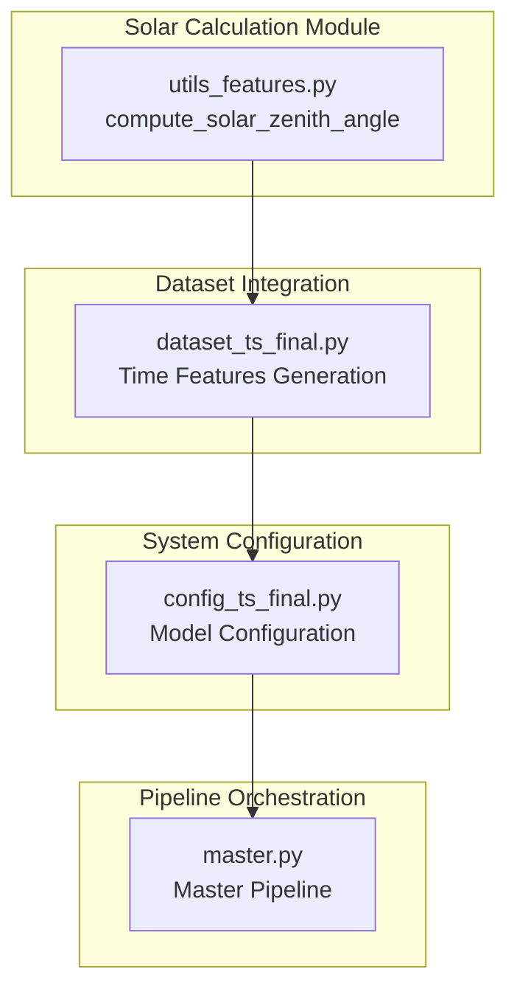
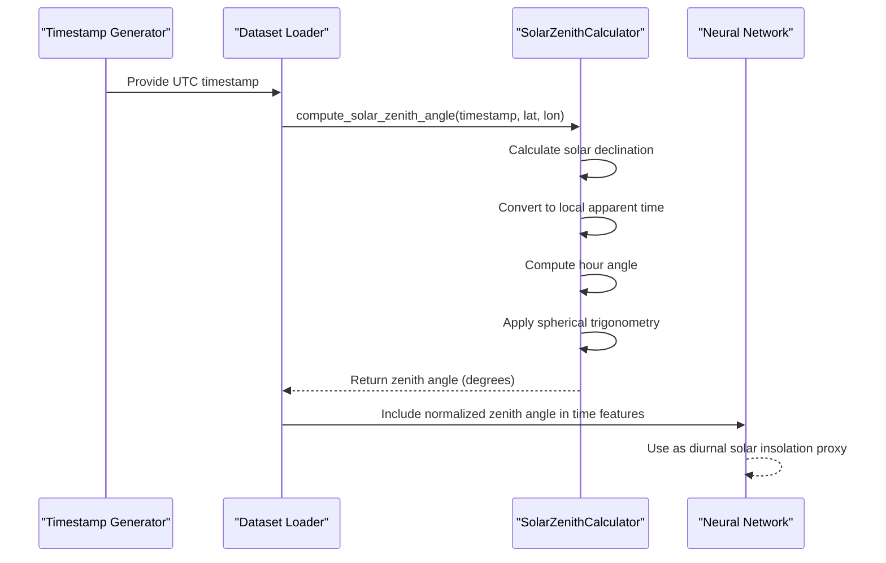
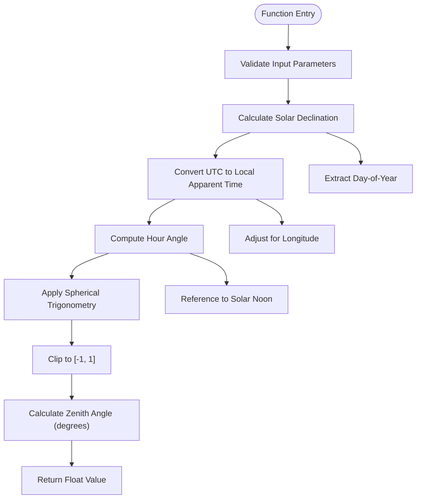
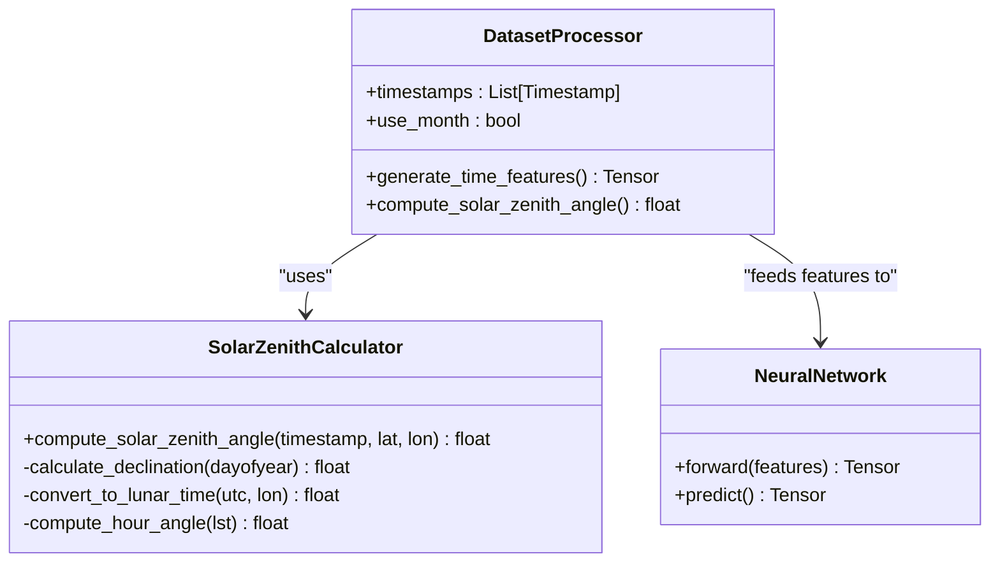
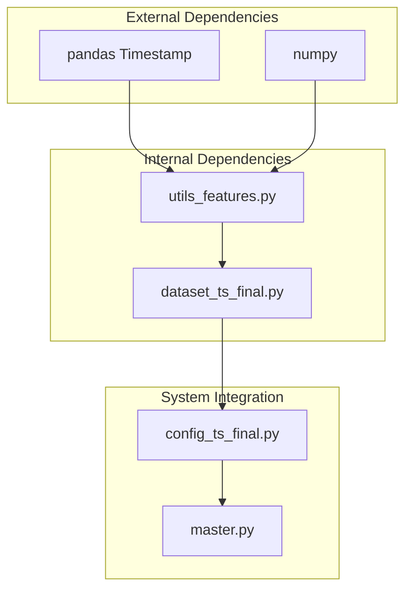

# Solar Zenith Angle Computation

<cite>
**Referenced Files in This Document**
- [utils_features.py](file://utils_features.py)
- [dataset_ts_final.py](file://dataset_ts_final.py)
- [config_ts_final.py](file://config_ts_final.py)
- [master.py](file://master.py)
</cite>

## Table of Contents
1. [Introduction](#introduction)
2. [Project Structure](#project-structure)
3. [Core Components](#core-components)
4. [Architecture Overview](#architecture-overview)
5. [Detailed Component Analysis](#detailed-component-analysis)
6. [Dependency Analysis](#dependency-analysis)
7. [Performance Considerations](#performance-considerations)
8. [Troubleshooting Guide](#troubleshooting-guide)
9. [Conclusion](#conclusion)
10. [Appendices](#appendices)

## Introduction
This document provides comprehensive documentation for the solar zenith angle computation function used in diurnal solar insolation modeling. The function calculates the solar zenith angle for a given UTC timestamp and geographic coordinates, serving as a physical proxy for daily solar radiation patterns. The implementation follows standard astronomical formulas for Earth-Sun geometry, including solar declination calculations and local apparent time conversions.

The computed zenith angle enables downstream applications in weather modeling, energy calculations, and atmospheric physics by capturing seasonal variations, daily cycles, and geographic location impacts on solar radiation modeling.

## Project Structure
The solar zenith angle computation is implemented within the broader Nagpur Tropical Storm (TS) nowcasting system. The relevant components are organized as follows:

**Diagram sources**
- [utils_features.py:173-191](file://utils_features.py#L173-L191)
- [dataset_ts_final.py:422-434](file://dataset_ts_final.py#L422-L434)
- [config_ts_final.py:16-208](file://config_ts_final.py#L16-L208)
- [master.py:1-108](file://master.py#L1-L108)

**Section sources**
- [utils_features.py:173-191](file://utils_features.py#L173-L191)
- [dataset_ts_final.py:422-434](file://dataset_ts_final.py#L422-L434)
- [config_ts_final.py:16-208](file://config_ts_final.py#L16-L208)
- [master.py:1-108](file://master.py#L1-L108)

## Core Components
The solar zenith angle computation relies on a single primary function that implements the complete astronomical calculation pipeline:

### Primary Function: compute_solar_zenith_angle
The core function performs the following operations:
- Converts latitude and longitude from degrees to radians
- Calculates solar declination based on day-of-year using an annual sinusoidal approximation
- Computes local apparent time from UTC and longitude
- Determines the hour angle from local apparent time
- Applies the spherical trigonometry formula for zenith angle calculation
- Clips results to maintain numerical stability

**Section sources**
- [utils_features.py:173-191](file://utils_features.py#L173-L191)

## Architecture Overview
The solar zenith angle computation integrates into the broader model pipeline as part of temporal feature engineering:

**Diagram sources**
- [dataset_ts_final.py:422-434](file://dataset_ts_final.py#L422-L434)
- [utils_features.py:173-191](file://utils_features.py#L173-L191)

The function serves as a critical input feature for the neural network, providing temporal context about daily solar radiation patterns that influence storm development and atmospheric conditions.

## Detailed Component Analysis

### Mathematical Algorithm Implementation
The solar zenith angle computation follows standard astronomical formulas:

#### Solar Declination Calculation
The function uses an annual sinusoidal approximation for solar declination:
- Formula: δ = 23.45° × sin((360°/365°) × (n - 81))
- Where n is the day-of-year (1-365)
- The constant 81 represents the approximate day of the year when the sun crosses the equator during spring equinox

#### Local Apparent Time Conversion
Local apparent time (LST) is calculated from UTC using:
- LST = UTC + (longitude/15°)
- Each degree of longitude corresponds to 4 minutes of time difference
- Results are normalized to 24-hour format

#### Hour Angle Determination
Hour angle represents the angular displacement of the sun east or west of the local meridian:
- H = 15° × (LST - 12)
- At solar noon (LST = 12), hour angle equals 0°
- Positive values indicate afternoon positions, negative values indicate morning positions

#### Spherical Trigonometry Application
The zenith angle calculation uses the spherical law of cosines:
- cos(zenith) = sin(φ) × sin(δ) + cos(φ) × cos(δ) × cos(H)
- Where φ is latitude, δ is solar declination, and H is hour angle
- The result is clipped to [-1, 1] to prevent numerical errors
- Final zenith angle is converted from radians to degrees

**Diagram sources**
- [utils_features.py:173-191](file://utils_features.py#L173-L191)

**Section sources**
- [utils_features.py:173-191](file://utils_features.py#L173-L191)

### Function Parameters and Specifications
The compute_solar_zenith_angle function accepts the following parameters:

#### Required Parameters
- **timestamp_utc**: pandas Timestamp object containing UTC date and time information
- **lat**: Latitude in decimal degrees (default: 21.1° for Nagpur)
- **lon**: Longitude in decimal degrees (default: 79.05° for Nagpur)

#### Output Specifications
- **Return Type**: float representing solar zenith angle in degrees
- **Range**: 0° to 180° (0° indicates sun directly overhead, 180° indicates sun below horizon)
- **Units**: Degrees (standard astronomical convention)

#### Geographic Coordinates Defaults
The function uses Nagpur, India as the default location:
- Latitude: 21.1° N
- Longitude: 79.05° E
These coordinates correspond to approximately 21.1° latitude and 79.05° longitude, positioning the calculation within the Indian subcontinent.

**Section sources**
- [utils_features.py:173-191](file://utils_features.py#L173-L191)

### Integration Within Model Pipeline
The computed solar zenith angle is integrated into the model as part of temporal feature engineering:

**Diagram sources**
- [dataset_ts_final.py:422-434](file://dataset_ts_final.py#L422-L434)
- [utils_features.py:173-191](file://utils_features.py#L173-L191)

The integration process involves:
1. Extracting the current timestamp from the sequence
2. Computing the solar zenith angle using the default Nagpur coordinates
3. Normalizing the angle to [-1, 1] range for neural network compatibility
4. Including the normalized angle alongside month-based seasonal features

**Section sources**
- [dataset_ts_final.py:422-434](file://dataset_ts_final.py#L422-L434)

## Dependency Analysis
The solar zenith angle computation has minimal external dependencies and maintains clean separation from other system components:

**Diagram sources**
- [utils_features.py:6-8](file://utils_features.py#L6-L8)
- [dataset_ts_final.py:22](file://dataset_ts_final.py#L22)
- [config_ts_final.py:16-208](file://config_ts_final.py#L16-L208)
- [master.py:1-108](file://master.py#L1-L108)

### External Library Dependencies
- **pandas**: Provides Timestamp objects with dayofyear accessor
- **numpy**: Handles mathematical operations including trigonometric functions and numerical clipping

### Internal Integration Points
- **Dataset Processing**: The function is imported and used within the dataset loading pipeline
- **Model Configuration**: The computed features integrate with the broader model architecture
- **Pipeline Execution**: The function participates in the automated training and evaluation pipeline

**Section sources**
- [utils_features.py:6-8](file://utils_features.py#L6-L8)
- [dataset_ts_final.py:22](file://dataset_ts_final.py#L22)
- [config_ts_final.py:16-208](file://config_ts_final.py#L16-L208)
- [master.py:1-108](file://master.py#L1-L108)

## Performance Considerations
The solar zenith angle computation is computationally lightweight and suitable for real-time applications:

### Computational Complexity
- **Time Complexity**: O(1) - constant time regardless of input size
- **Space Complexity**: O(1) - minimal memory footprint
- **Operations**: Single pass through the astronomical calculation pipeline

### Numerical Stability
- Input values are clipped to prevent domain errors in inverse cosine operations
- Trigonometric functions handle angle conversions appropriately
- No iterative or recursive computations are required

### Integration Performance
- Computation occurs once per timestamp in the dataset
- Results are cached within the dataset processing pipeline
- Minimal impact on overall training or inference time

## Troubleshooting Guide

### Common Issues and Solutions

#### Invalid Timestamp Format
**Problem**: Non-Timestamp objects passed to the function
**Solution**: Ensure input is a pandas Timestamp with proper timezone information

#### Geographic Coordinate Range
**Problem**: Latitude outside valid range (-90° to 90°)
**Solution**: Verify coordinates fall within standard geographic bounds

#### Numerical Precision Errors
**Problem**: Occasional floating-point precision issues
**Solution**: The function includes automatic clipping to maintain valid cosine values

#### Integration Issues
**Problem**: Function not recognized in dataset processing
**Solution**: Verify proper import statement and module path

**Section sources**
- [utils_features.py:173-191](file://utils_features.py#L173-L191)
- [dataset_ts_final.py:422-434](file://dataset_ts_final.py#L422-L434)

## Conclusion
The solar zenith angle computation function provides a robust, mathematically sound implementation of diurnal solar insolation modeling. By leveraging standard astronomical formulas and integrating seamlessly into the Nagpur TS nowcasting system, it enables accurate representation of daily solar radiation patterns that influence storm development and atmospheric conditions.

The function's design emphasizes simplicity, numerical stability, and computational efficiency while maintaining flexibility for geographic customization. Its integration into the model pipeline demonstrates practical application in real-world weather forecasting systems.

## Appendices

### Practical Applications

#### Weather Modeling
- **Convective Initiation**: Solar heating influences atmospheric instability and convection
- **Boundary Layer Development**: Diurnal heating affects boundary layer depth and turbulence
- **Precipitation Patterns**: Solar cycle impacts cloud formation and precipitation timing

#### Energy Calculations
- **Solar Panel Efficiency**: Zenith angle directly affects solar irradiance received by photovoltaic panels
- **Building Energy Loads**: Sun angle influences heating and cooling requirements
- **Renewable Resource Planning**: Long-term solar potential assessment

#### Atmospheric Physics
- **Radiative Transfer**: Solar angle affects radiative forcing calculations
- **Cloud Microphysics**: Diurnal heating influences cloud microphysical processes
- **Atmospheric Circulation**: Solar insolation drives large-scale circulation patterns

### Seasonal Variations Reference
The solar declination calculation captures annual cycles:
- **Summer Solstice**: Maximum positive declination (~23.45°)
- **Winter Solstice**: Maximum negative declination (~-23.45°)
- **Equinoxes**: Zero declination (March 21, September 23)
- **Daily Cycle**: Hour angle varies from -180° to +180° over 24-hour period

### Geographic Location Impact
Different locations exhibit distinct solar angle characteristics:
- **Tropical Regions**: High sun angles year-round, minimal seasonal variation
- **Mid-Latitude Regions**: Significant seasonal variation, moderate daily variation
- **Polar Regions**: Extreme seasonal variation, potential for 24-hour darkness or daylight