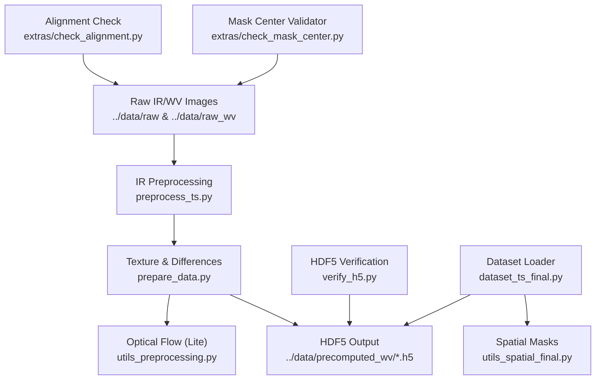
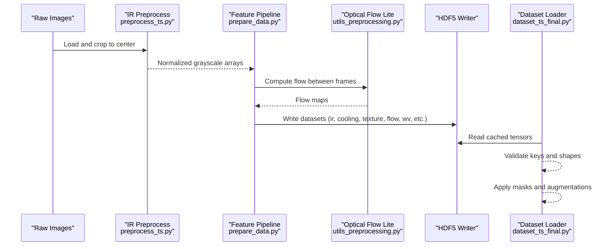
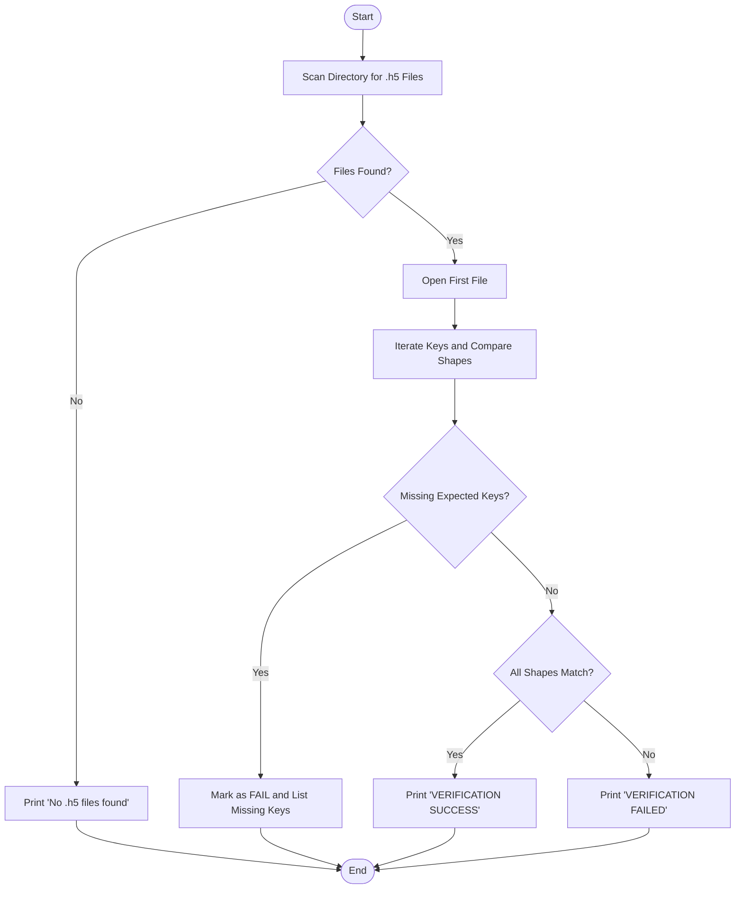
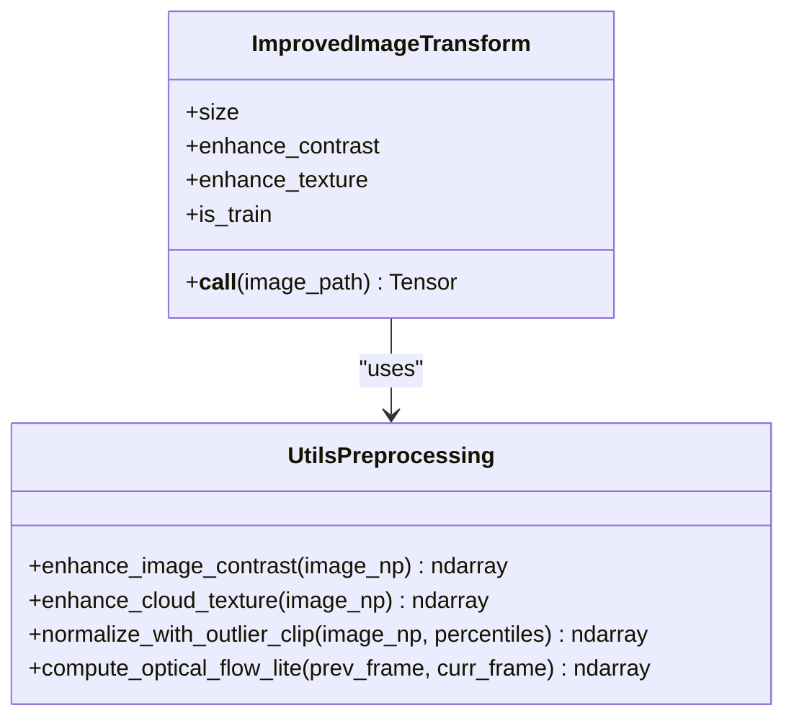
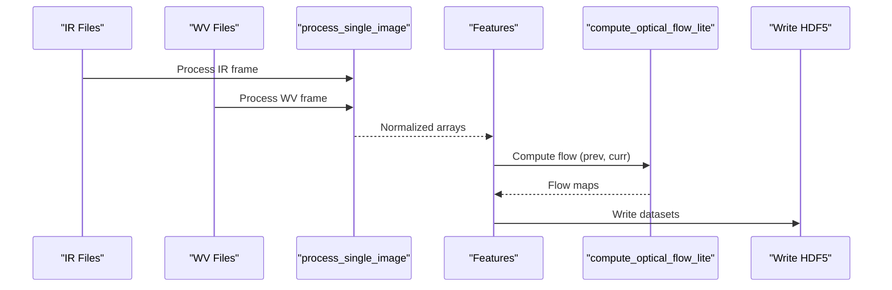
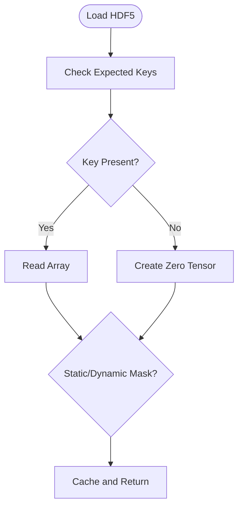
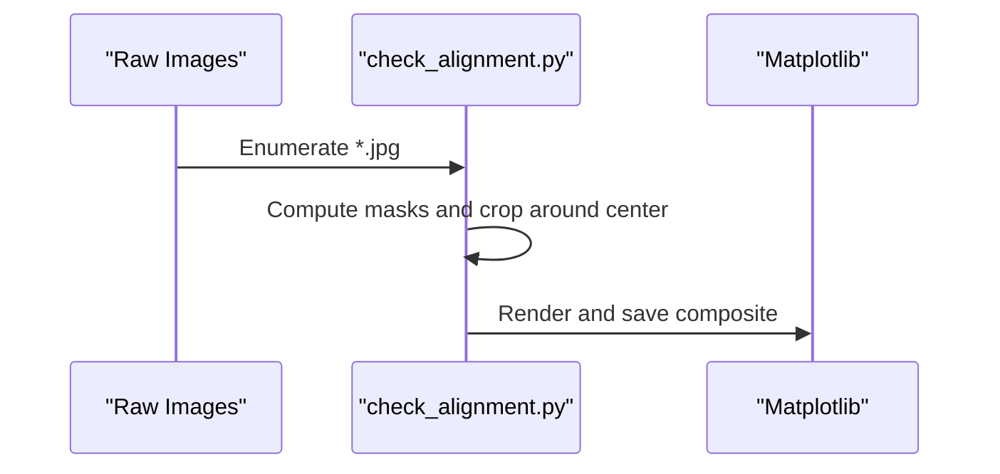
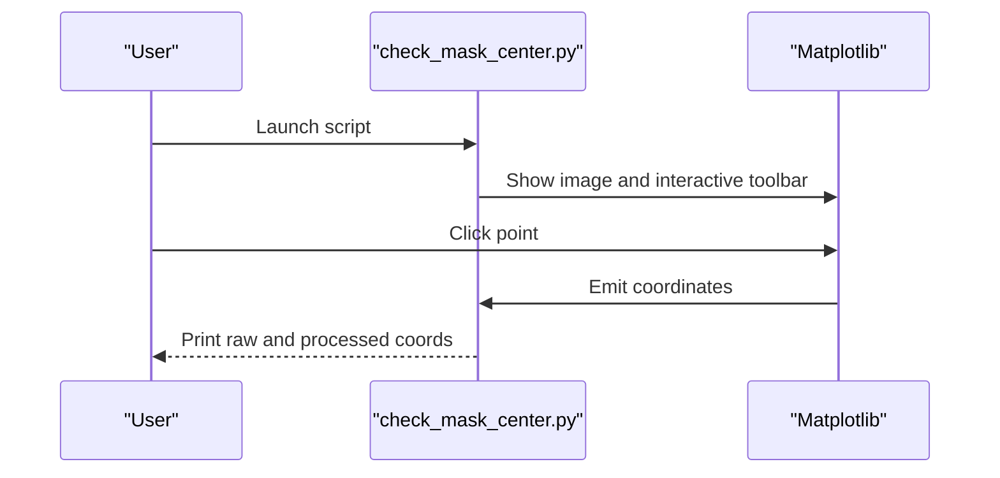
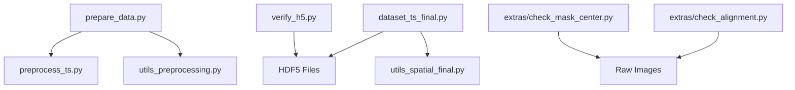

# Preprocessing & Validation Tools

<cite>
**Referenced Files in This Document**
- [verify_h5.py](file://verify_h5.py)
- [utils_preprocessing.py](file://utils_preprocessing.py)
- [preprocess_ts.py](file://preprocess_ts.py)
- [prepare_data.py](file://prepare_data.py)
- [dataset_ts_final.py](file://dataset_ts_final.py)
- [utils_spatial_final.py](file://utils_spatial_final.py)
- [config_ts_final.py](file://config_ts_final.py)
- [utils_features.py](file://utils_features.py)
- [check_alignment.py](file://extras/check_alignment.py)
- [check_mask_center.py](file://extras/check_mask_center.py)
</cite>

## Table of Contents
1. [Introduction](#introduction)
2. [Project Structure](#project-structure)
3. [Core Components](#core-components)
4. [Architecture Overview](#architecture-overview)
5. [Detailed Component Analysis](#detailed-component-analysis)
6. [Dependency Analysis](#dependency-analysis)
7. [Performance Considerations](#performance-considerations)
8. [Troubleshooting Guide](#troubleshooting-guide)
9. [Conclusion](#conclusion)

## Introduction
This document explains the preprocessing and validation utilities used to ensure data quality, format correctness, and consistency for satellite-based convection nowcasting. It covers:
- HDF5 verification for dataset structure integrity
- Alignment checks for temporal and spatial consistency
- Mask center validation for geometric accuracy
- Preprocessing workflow integration and validation thresholds
- Error handling mechanisms and debugging strategies
- Performance optimization tips for large-scale validation

## Project Structure
The preprocessing and validation pipeline spans several modules:
- Data ingestion and HDF5 generation
- IR image preprocessing and feature extraction
- Spatial masks and dynamic upwind masking
- Validation utilities for alignment and mask center
- Dataset loading with caching and validation

**Diagram sources**
- [preprocess_ts.py:27-112](file://preprocess_ts.py#L27-L112)
- [prepare_data.py:39-128](file://prepare_data.py#L39-L128)
- [utils_preprocessing.py:136-162](file://utils_preprocessing.py#L136-L162)
- [verify_h5.py:5-57](file://verify_h5.py#L5-L57)
- [dataset_ts_final.py:268-303](file://dataset_ts_final.py#L268-L303)
- [utils_spatial_final.py:12-65](file://utils_spatial_final.py#L12-L65)
- [check_alignment.py:6-53](file://extras/check_alignment.py#L6-L53)
- [check_mask_center.py:5-77](file://extras/check_mask_center.py#L5-L77)

**Section sources**
- [preprocess_ts.py:1-117](file://preprocess_ts.py#L1-L117)
- [prepare_data.py:1-132](file://prepare_data.py#L1-L132)
- [utils_preprocessing.py:1-162](file://utils_preprocessing.py#L1-L162)
- [verify_h5.py:1-58](file://verify_h5.py#L1-L58)
- [dataset_ts_final.py:1-515](file://dataset_ts_final.py#L1-L515)
- [utils_spatial_final.py:1-80](file://utils_spatial_final.py#L1-L80)
- [check_alignment.py:1-54](file://extras/check_alignment.py#L1-L54)
- [check_mask_center.py:1-78](file://extras/check_mask_center.py#L1-L78)

## Core Components
- HDF5 verification tool validates dataset structure and keys for integrity.
- Preprocessing utilities provide contrast enhancement, cloud texture sharpening, normalization with outlier clipping, and lightweight optical flow computation.
- Preprocessing workflow integrates IR image processing, feature computation, and HDF5 writing.
- Dataset loader caches HDF5 files, validates keys, and applies spatial masks and optional dynamic upwind masking.
- Alignment and mask center validators support spatial and geometric checks.

**Section sources**
- [verify_h5.py:5-57](file://verify_h5.py#L5-L57)
- [utils_preprocessing.py:16-162](file://utils_preprocessing.py#L16-L162)
- [prepare_data.py:39-128](file://prepare_data.py#L39-L128)
- [dataset_ts_final.py:268-303](file://dataset_ts_final.py#L268-L303)
- [utils_spatial_final.py:12-65](file://utils_spatial_final.py#L12-L65)
- [check_alignment.py:6-53](file://extras/check_alignment.py#L6-L53)
- [check_mask_center.py:5-77](file://extras/check_mask_center.py#L5-L77)

## Architecture Overview
The preprocessing and validation architecture ensures:
- Consistent IR image processing across IR and WV channels
- Computation of derived features (texture, cooling, differences, trends)
- Validation of HDF5 structure and keys
- Spatial attention via static and dynamic masks
- Temporal consistency checks during dataset building

**Diagram sources**
- [preprocess_ts.py:27-112](file://preprocess_ts.py#L27-L112)
- [prepare_data.py:39-128](file://prepare_data.py#L39-L128)
- [utils_preprocessing.py:136-162](file://utils_preprocessing.py#L136-L162)
- [dataset_ts_final.py:268-303](file://dataset_ts_final.py#L268-L303)

## Detailed Component Analysis

### HDF5 Verification Tool
Purpose:
- Verify expected keys and shapes in precomputed HDF5 files to ensure dataset integrity.

Key behaviors:
- Scans a directory for .h5 files and reads the first file as a sample.
- Compares actual keys and shapes against an expected schema.
- Reports missing keys and mismatches.

Validation thresholds:
- Shape equality per key is required.
- Presence of all expected keys is mandatory.

Error handling:
- Gracefully handles empty directories and prints pass/fail outcomes.

**Diagram sources**
- [verify_h5.py:5-57](file://verify_h5.py#L5-L57)

**Section sources**
- [verify_h5.py:5-57](file://verify_h5.py#L5-L57)

### Preprocessing Utilities
Purpose:
- Provide robust preprocessing for IR imagery and lightweight optical flow computation.

Functions:
- Contrast enhancement using CLAHE
- Cloud texture enhancement via unsharp masking
- Outlier-clipped normalization
- Lightweight optical flow using Farneback

Integration:
- Used in dataset loading and preprocessing workflow.
- Supports training-time noise augmentation and standardization.

Validation thresholds:
- Input dtype handling and clipping to [0,1] ensure numerical stability.
- Optical flow expects uint8 frames; automatic conversion and clipping are applied.

Error handling:
- Safe conversions and dtype checks prevent runtime exceptions.
- Missing keys in HDF5 are handled by returning zero tensors.

**Diagram sources**
- [utils_preprocessing.py:86-134](file://utils_preprocessing.py#L86-L134)
- [utils_preprocessing.py:16-83](file://utils_preprocessing.py#L16-L83)
- [utils_preprocessing.py:136-162](file://utils_preprocessing.py#L136-L162)

**Section sources**
- [utils_preprocessing.py:16-162](file://utils_preprocessing.py#L16-L162)

### Preprocessing Workflow Integration
Purpose:
- Align IR and WV images temporally, compute features, and write to HDF5.

Workflow:
- Parse timestamps from filenames and align IR/WV files within a time tolerance.
- Process images, compute texture maps, IR-WV difference, cooling terms, and optical flow.
- Write all channels to HDF5 with compression.

Validation thresholds:
- Time gaps exceeding 45 minutes are skipped to maintain temporal consistency.
- Missing or invalid images are skipped.

Error handling:
- Robust timestamp parsing with fallbacks.
- Zero tensors are written for missing or unavailable optical flow channels.

**Diagram sources**
- [prepare_data.py:39-128](file://prepare_data.py#L39-L128)
- [preprocess_ts.py:27-112](file://preprocess_ts.py#L27-L112)
- [utils_preprocessing.py:136-162](file://utils_preprocessing.py#L136-L162)

**Section sources**
- [prepare_data.py:39-128](file://prepare_data.py#L39-L128)
- [preprocess_ts.py:27-112](file://preprocess_ts.py#L27-L112)

### Dataset Loader and Validation
Purpose:
- Load HDF5 sequences, validate keys, cache files, and apply masks and augmentations.

Key behaviors:
- Validates presence of expected keys and writes zero tensors for missing ones.
- Applies static mask or dynamic upwind mask based on configuration.
- Enforces temporal gaps ≤ 45 minutes and builds samples accordingly.

Validation thresholds:
- Missing keys are tolerated with zero-fill for optical flow and scalar channels.
- Static mask application depends on configuration flags.

Error handling:
- Uses ordered cache with eviction to manage memory.
- Graceful handling of missing CCD features.

**Diagram sources**
- [dataset_ts_final.py:268-303](file://dataset_ts_final.py#L268-L303)
- [utils_spatial_final.py:12-65](file://utils_spatial_final.py#L12-L65)

**Section sources**
- [dataset_ts_final.py:268-303](file://dataset_ts_final.py#L268-L303)
- [utils_spatial_final.py:12-65](file://utils_spatial_final.py#L12-L65)

### Alignment Checking Utilities
Purpose:
- Visually confirm spatial alignment around a fixed center across different image dimensions.

Workflow:
- Reads sample images from raw data and computes masks for overlays.
- Crops around a fixed center and saves a composite plot for inspection.

Validation thresholds:
- Cropped regions are centered at a predefined coordinate pair.
- Boundaries are handled by clamping coordinates.

Error handling:
- Iterates until three distinct dimensions are collected.
- Saves diagnostic plots to artifacts.

**Diagram sources**
- [check_alignment.py:6-53](file://extras/check_alignment.py#L6-L53)

**Section sources**
- [check_alignment.py:6-53](file://extras/check_alignment.py#L6-L53)

### Mask Center Validation Tools
Purpose:
- Interactive tool to select and validate the mask center in raw images and convert to processed coordinates.

Workflow:
- Loads a raw image and displays it.
- On click, prints raw and processed coordinates and suggests updating configuration.

Validation thresholds:
- Converts raw coordinates to processed (224x224) using aspect-preserving scaling.

Error handling:
- Falls back to any available image in the raw directory if the default path is missing.
- Prints actionable messages for invalid paths.

**Diagram sources**
- [check_mask_center.py:5-77](file://extras/check_mask_center.py#L5-L77)

**Section sources**
- [check_mask_center.py:5-77](file://extras/check_mask_center.py#L5-L77)

### Configuration and Validation Thresholds
Key thresholds and flags:
- MASK_CENTER and MASK_SIGMA define the static Gaussian mask.
- Dynamic upwind mask updates center based on mean optical flow.
- Temporal gap threshold of 45 minutes for sequence continuity.
- Minimum threshold for post-processing set to 0.10 to improve sensitivity in focal loss settings.
- Optical flow usage controlled by configuration flag.

**Section sources**
- [config_ts_final.py:106-131](file://config_ts_final.py#L106-L131)
- [dataset_ts_final.py:240-246](file://dataset_ts_final.py#L240-L246)
- [dataset_ts_final.py:497-512](file://dataset_ts_final.py#L497-L512)

## Dependency Analysis
Inter-module dependencies:
- Preprocessing workflow depends on IR processing and optical flow utilities.
- Dataset loader depends on HDF5 files and spatial utilities.
- Validation scripts depend on raw data and plotting libraries.

**Diagram sources**
- [prepare_data.py:11-12](file://prepare_data.py#L11-L12)
- [preprocess_ts.py:1-117](file://preprocess_ts.py#L1-L117)
- [utils_preprocessing.py:1-162](file://utils_preprocessing.py#L1-L162)
- [dataset_ts_final.py:1-515](file://dataset_ts_final.py#L1-L515)
- [utils_spatial_final.py:1-80](file://utils_spatial_final.py#L1-L80)
- [verify_h5.py:1-58](file://verify_h5.py#L1-L58)
- [check_alignment.py:1-54](file://extras/check_alignment.py#L1-L54)
- [check_mask_center.py:1-78](file://extras/check_mask_center.py#L1-L78)

**Section sources**
- [prepare_data.py:11-12](file://prepare_data.py#L11-L12)
- [dataset_ts_final.py:1-515](file://dataset_ts_final.py#L1-L515)

## Performance Considerations
- HDF5 compression reduces storage and improves I/O throughput.
- Ordered cache in dataset loader prevents repeated disk reads.
- Avoid enabling optical flow if compute budget is tight; the configuration supports disabling it.
- Use outlier clipping in normalization to reduce extreme values that can slow training.
- Limit cache size to balance memory usage and speed.

[No sources needed since this section provides general guidance]

## Troubleshooting Guide
Common issues and resolutions:
- Missing or misaligned HDF5 keys: Use the verification script to compare actual vs expected shapes and keys.
- Incorrect mask center leading to off-center attention: Use the interactive mask center validator to select and log corrected coordinates.
- Misalignment across dimensions: Use the alignment checker to visually inspect crops around the center.
- Temporal gaps causing missing sequences: Ensure IR/WV timestamps are within 45 minutes; adjust acquisition schedules if needed.
- Poor normalization or outliers: Review preprocessing steps and percentile clipping parameters.
- Memory pressure during dataset loading: Reduce cache size or disable optical flow.

Debugging strategies:
- Inspect CCD features CSV to validate feature extraction.
- Confirm timestamp parsing logic and filename patterns.
- Validate spatial mask parameters and dynamic upwind adjustments.

**Section sources**
- [verify_h5.py:5-57](file://verify_h5.py#L5-L57)
- [check_mask_center.py:5-77](file://extras/check_mask_center.py#L5-L77)
- [check_alignment.py:6-53](file://extras/check_alignment.py#L6-L53)
- [prepare_data.py:39-128](file://prepare_data.py#L39-L128)
- [dataset_ts_final.py:240-246](file://dataset_ts_final.py#L240-L246)

## Conclusion
The preprocessing and validation toolkit ensures high-quality, consistent satellite data for convection nowcasting. By validating HDF5 structure, aligning images spatially, confirming mask centers, and integrating preprocessing into a robust workflow, the system maintains data integrity and enables reliable model training and evaluation.