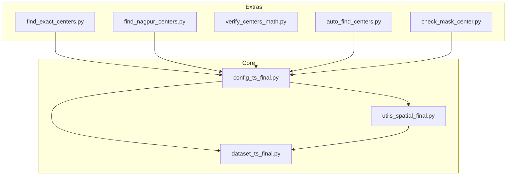
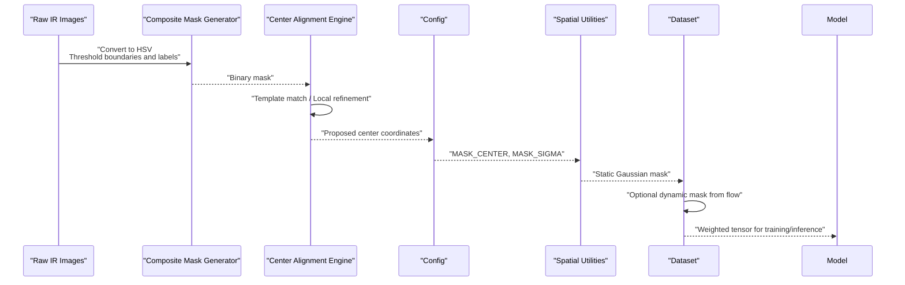
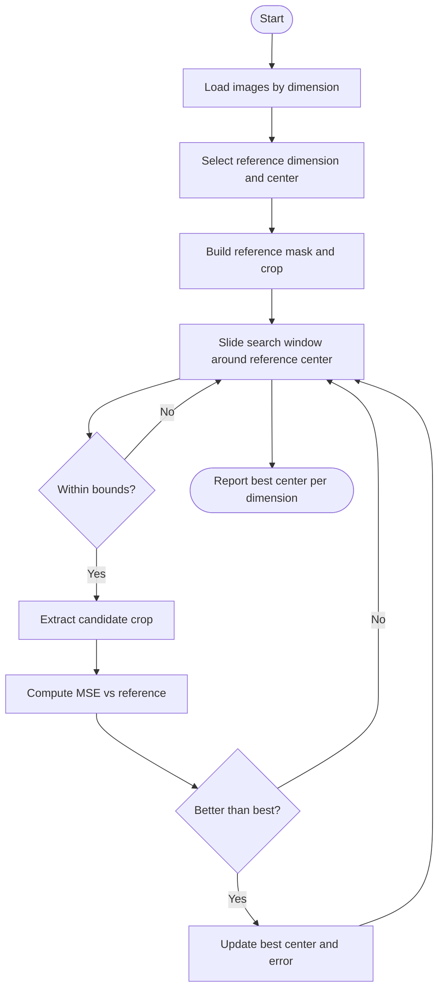
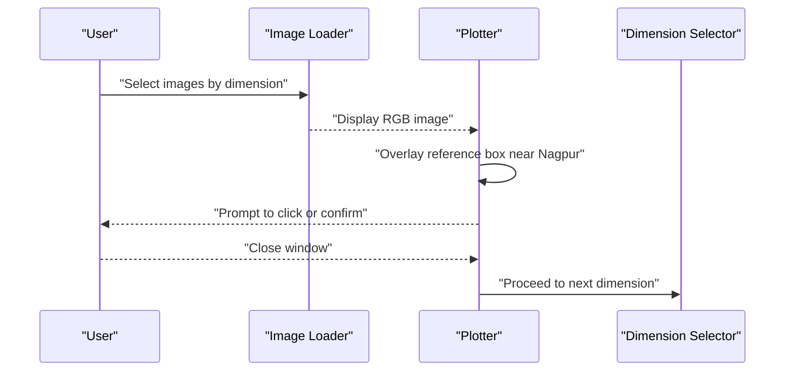
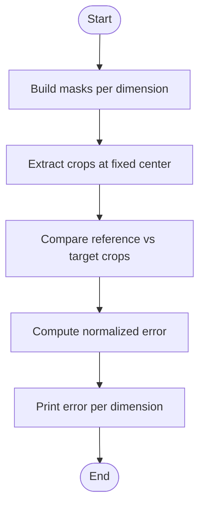
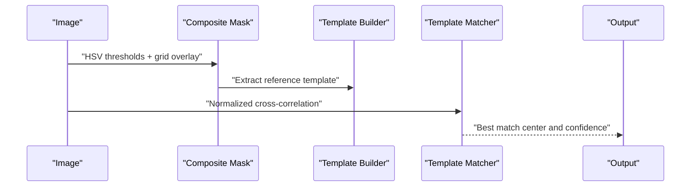
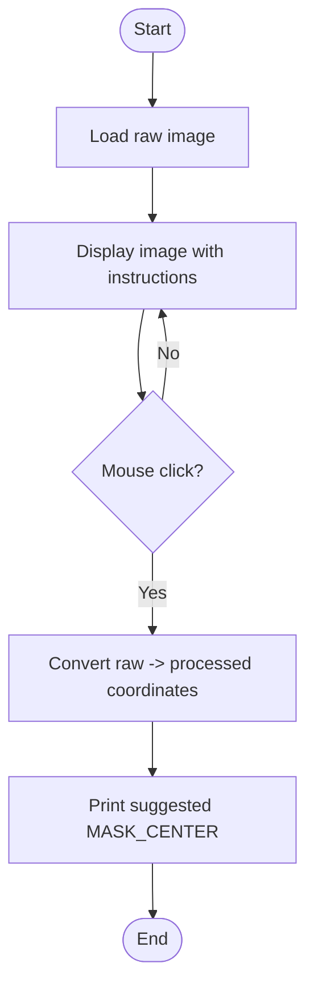
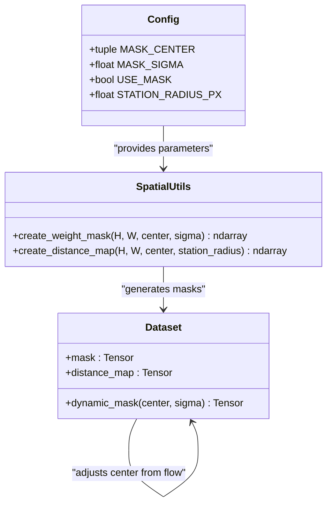
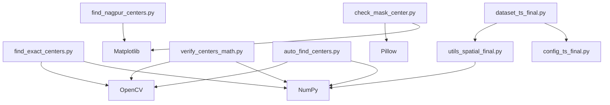

# Center Detection Algorithms

<cite>
**Referenced Files in This Document**
- [find_exact_centers.py](file://extras/find_exact_centers.py)
- [find_nagpur_centers.py](file://extras/find_nagpur_centers.py)
- [verify_centers_math.py](file://extras/verify_centers_math.py)
- [auto_find_centers.py](file://extras/auto_find_centers.py)
- [check_mask_center.py](file://extras/check_mask_center.py)
- [config_ts_final.py](file://config_ts_final.py)
- [utils_spatial_final.py](file://utils_spatial_final.py)
- [dataset_ts_final.py](file://dataset_ts_final.py)
</cite>

## Table of Contents
1. [Introduction](#introduction)
2. [Project Structure](#project-structure)
3. [Core Components](#core-components)
4. [Architecture Overview](#architecture-overview)
5. [Detailed Component Analysis](#detailed-component-analysis)
6. [Dependency Analysis](#dependency-analysis)
7. [Performance Considerations](#performance-considerations)
8. [Troubleshooting Guide](#troubleshooting-guide)
9. [Conclusion](#conclusion)
10. [Appendices](#appendices)

## Introduction
This document describes the center detection algorithms used in storm identification and tracking within the Nagpur Tropics Nowcasting system. It focuses on two primary workflows:
- Exact center alignment across variable image dimensions using template matching and local refinement
- Interactive center selection for Nagpur to support consistent cropping and masking

It documents detection methodologies, threshold settings, geometric principles, noise reduction, outlier handling, parameter optimization for different storm types, integration with temporal tracking, performance characteristics, accuracy metrics, and troubleshooting.

## Project Structure
The center detection utilities live under extras and integrate with configuration and spatial utilities. The dataset module consumes the configured center for spatial weighting and dynamic upwind masking during training/inference.

**Diagram sources**
- [find_exact_centers.py:1-65](file://extras/find_exact_centers.py#L1-L65)
- [find_nagpur_centers.py:1-45](file://extras/find_nagpur_centers.py#L1-L45)
- [verify_centers_math.py:1-51](file://extras/verify_centers_math.py#L1-L51)
- [auto_find_centers.py:1-101](file://extras/auto_find_centers.py#L1-L101)
- [check_mask_center.py:1-78](file://extras/check_mask_center.py#L1-L78)
- [config_ts_final.py:106-117](file://config_ts_final.py#L106-L117)
- [utils_spatial_final.py:12-80](file://utils_spatial_final.py#L12-L80)
- [dataset_ts_final.py:80-84](file://dataset_ts_final.py#L80-L84)

**Section sources**
- [config_ts_final.py:106-117](file://config_ts_final.py#L106-L117)
- [utils_spatial_final.py:12-80](file://utils_spatial_final.py#L12-L80)
- [dataset_ts_final.py:80-84](file://dataset_ts_final.py#L80-L84)

## Core Components
- find_exact_centers: Aligns centers across dimensions by computing masked regions, extracting a template around a known reference center, and minimizing pixel-wise error in localized crops.
- find_nagpur_centers: Provides an interactive workflow to visually confirm center placement near Nagpur for representative dimensions.
- verify_centers_math: Validates center consistency by computing normalized error between crops centered at a fixed location across dimensions.
- auto_find_centers: Automates center detection using normalized cross-correlation on a composite mask derived from HSV thresholds and grid overlays.
- check_mask_center: Interactive GUI tool to select and convert raw image coordinates to processed coordinates for the configured MASK_CENTER.
- config_ts_final: Centralizes MASK_CENTER, MASK_SIGMA, and related spatial parameters used by downstream modules.
- utils_spatial_final: Implements Gaussian and distance masks used for spatial weighting and boundary highlighting.
- dataset_ts_final: Consumes MASK_CENTER for static spatial masks and dynamically adjusts center based on optical flow for upwind bias.

**Section sources**
- [find_exact_centers.py:13-65](file://extras/find_exact_centers.py#L13-L65)
- [find_nagpur_centers.py:7-45](file://extras/find_nagpur_centers.py#L7-L45)
- [verify_centers_math.py:6-51](file://extras/verify_centers_math.py#L6-L51)
- [auto_find_centers.py:22-101](file://extras/auto_find_centers.py#L22-L101)
- [check_mask_center.py:5-78](file://extras/check_mask_center.py#L5-L78)
- [config_ts_final.py:106-117](file://config_ts_final.py#L106-L117)
- [utils_spatial_final.py:12-80](file://utils_spatial_final.py#L12-L80)
- [dataset_ts_final.py:80-84](file://dataset_ts_final.py#L80-L84)

## Architecture Overview
The center detection pipeline connects data preparation, mask generation, and spatial weighting. The dataset applies a static Gaussian mask centered at MASK_CENTER and optionally a dynamic mask that shifts with upwind motion inferred from optical flow.

**Diagram sources**
- [auto_find_centers.py:7-20](file://extras/auto_find_centers.py#L7-L20)
- [auto_find_centers.py:65-75](file://extras/auto_find_centers.py#L65-L75)
- [config_ts_final.py:106-117](file://config_ts_final.py#L106-L117)
- [utils_spatial_final.py:12-34](file://utils_spatial_final.py#L12-L34)
- [dataset_ts_final.py:497-511](file://dataset_ts_final.py#L497-L511)

## Detailed Component Analysis

### find_exact_centers
- Purpose: Compute precise center coordinates across varying image dimensions by aligning a reference crop with surrounding images.
- Methodology:
  - Loads a subset of images grouped by unique dimensions.
  - Builds a binary mask from HSV thresholds and selects a reference dimension (e.g., 2002x2242) with a known center (1045, 1056).
  - Extracts a square crop around the reference center and slides a search window around the reference center in the target images.
  - Computes pixel-wise error (MSE) between the reference crop and candidate crops; records the minimum-error center.
- Thresholds and parameters:
  - Search window: bounded offsets in x (small) and y (larger) around the reference center.
  - Crop size: fixed square crop used for comparison.
  - Error metric: sum of squared differences normalized implicitly by crop size.
- Geometric principles:
  - Assumes affine-like similarity across dimensions; uses a local patch correlation to estimate shift.
- Noise reduction and outliers:
  - Restricts search to a small neighborhood around the reference center.
  - Uses bounded cropping to avoid edge artifacts.
- Accuracy validation:
  - Compares MSE across dimensions to assess stability.
- Integration:
  - Produces per-dimension centers suitable for configuration updates.

**Diagram sources**
- [find_exact_centers.py:13-65](file://extras/find_exact_centers.py#L13-L65)

**Section sources**
- [find_exact_centers.py:13-65](file://extras/find_exact_centers.py#L13-L65)

### find_nagpur_centers
- Purpose: Interactively guide center selection near Nagpur for multiple representative dimensions.
- Methodology:
  - Selects a small set of images per unique dimension.
  - Displays each image and overlays a red square near the approximate Nagpur center to aid selection.
  - Prompts the user to visually confirm the center; proceeds to the next image upon closing the window.
- Thresholds and parameters:
  - Approximate center adjustments per dimension to improve initial guess.
- Noise reduction and outliers:
  - Relies on human-in-the-loop correction; reduces risk of automated misalignment.
- Accuracy validation:
  - Manual verification; useful for qualitative assessment before automation.
- Integration:
  - Produces coordinates for manual configuration or as ground truth for automated methods.

**Diagram sources**
- [find_nagpur_centers.py:7-45](file://extras/find_nagpur_centers.py#L7-L45)

**Section sources**
- [find_nagpur_centers.py:7-45](file://extras/find_nagpur_centers.py#L7-L45)

### verify_centers_math
- Purpose: Validate center consistency by comparing crops centered at a fixed location across dimensions.
- Methodology:
  - Builds masks per image from HSV thresholds.
  - Extracts crops centered at a fixed (cx, cy) and computes normalized error between reference and target crops.
- Thresholds and parameters:
  - Fixed center and crop size; normalized error per pixel.
- Noise reduction and outliers:
  - Uses identical centering and crop size to minimize geometric drift.
- Accuracy validation:
  - Reports error metrics to compare stability across dimensions.

**Diagram sources**
- [verify_centers_math.py:6-51](file://extras/verify_centers_math.py#L6-L51)

**Section sources**
- [verify_centers_math.py:6-51](file://extras/verify_centers_math.py#L6-L51)

### auto_find_centers
- Purpose: Automatically detect centers using normalized cross-correlation on a composite mask.
- Methodology:
  - Constructs a composite mask from HSV thresholds and grid overlays.
  - Defines a template around the reference center and performs template matching on target images.
  - Reports the center with confidence (normalized correlation).
- Thresholds and parameters:
  - Template size and matching method define sensitivity and robustness.
  - Confidence threshold can be tuned for stricter acceptance.
- Noise reduction and outliers:
  - Composite mask reduces sensitivity to isolated noise by combining multiple criteria.
  - Template matching is robust to small deformations.
- Accuracy validation:
  - Confidence scores and saved verification crops enable quick assessment.
- Integration:
  - Outputs a mapping suitable for configuration updates.

**Diagram sources**
- [auto_find_centers.py:7-20](file://extras/auto_find_centers.py#L7-L20)
- [auto_find_centers.py:65-75](file://extras/auto_find_centers.py#L65-L75)

**Section sources**
- [auto_find_centers.py:22-101](file://extras/auto_find_centers.py#L22-L101)

### check_mask_center
- Purpose: Interactive tool to select MASK_CENTER in raw coordinates and convert to processed coordinates.
- Methodology:
  - Opens a raw image and allows clicking to record coordinates.
  - Converts raw coordinates to processed (224x224) coordinates and prints suggested configuration updates.
- Thresholds and parameters:
  - No automatic thresholds; relies on user input.
- Noise reduction and outliers:
  - Manual selection minimizes algorithmic error.
- Accuracy validation:
  - Direct conversion and suggestion for configuration update.

**Diagram sources**
- [check_mask_center.py:5-78](file://extras/check_mask_center.py#L5-L78)

**Section sources**
- [check_mask_center.py:5-78](file://extras/check_mask_center.py#L5-L78)

### Configuration and Spatial Utilities
- MASK_CENTER: Central pixel for spatial weighting; updated after center detection.
- MASK_SIGMA: Controls Gaussian spread for spatial attention.
- Static and dynamic masks:
  - Static Gaussian mask centered at MASK_CENTER.
  - Dynamic mask adjusts center based on mean optical flow to bias attention upwind.

**Diagram sources**
- [config_ts_final.py:106-117](file://config_ts_final.py#L106-L117)
- [utils_spatial_final.py:12-65](file://utils_spatial_final.py#L12-L65)
- [dataset_ts_final.py:497-511](file://dataset_ts_final.py#L497-L511)

**Section sources**
- [config_ts_final.py:106-117](file://config_ts_final.py#L106-L117)
- [utils_spatial_final.py:12-65](file://utils_spatial_final.py#L12-L65)
- [dataset_ts_final.py:497-511](file://dataset_ts_final.py#L497-L511)

## Dependency Analysis
- find_exact_centers depends on OpenCV and NumPy for image loading, HSV conversion, masking, and numerical comparisons.
- find_nagpur_centers depends on Matplotlib for interactive plotting.
- verify_centers_math mirrors masking logic of find_exact_centers for consistency checks.
- auto_find_centers depends on OpenCV template matching and NumPy for array operations.
- check_mask_center depends on PIL and Matplotlib for interactive coordinate selection.
- dataset_ts_final depends on utils_spatial_final for mask creation and on config_ts_final for parameters.

**Diagram sources**
- [find_exact_centers.py:1-65](file://extras/find_exact_centers.py#L1-L65)
- [find_nagpur_centers.py:1-45](file://extras/find_nagpur_centers.py#L1-L45)
- [verify_centers_math.py:1-51](file://extras/verify_centers_math.py#L1-L51)
- [auto_find_centers.py:1-101](file://extras/auto_find_centers.py#L1-L101)
- [check_mask_center.py:1-78](file://extras/check_mask_center.py#L1-L78)
- [dataset_ts_final.py:80-84](file://dataset_ts_final.py#L80-L84)
- [utils_spatial_final.py:12-80](file://utils_spatial_final.py#L12-L80)
- [config_ts_final.py:106-117](file://config_ts_final.py#L106-L117)

**Section sources**
- [find_exact_centers.py:1-65](file://extras/find_exact_centers.py#L1-L65)
- [find_nagpur_centers.py:1-45](file://extras/find_nagpur_centers.py#L1-L45)
- [verify_centers_math.py:1-51](file://extras/verify_centers_math.py#L1-L51)
- [auto_find_centers.py:1-101](file://extras/auto_find_centers.py#L1-L101)
- [check_mask_center.py:1-78](file://extras/check_mask_center.py#L1-L78)
- [dataset_ts_final.py:80-84](file://dataset_ts_final.py#L80-L84)
- [utils_spatial_final.py:12-80](file://utils_spatial_final.py#L12-L80)
- [config_ts_final.py:106-117](file://config_ts_final.py#L106-L117)

## Performance Considerations
- Template matching cost scales with image size and search window; reduce search range and crop size for speed.
- Vectorized operations (NumPy) dominate computation; ensure arrays are contiguous and use appropriate dtypes.
- OpenCV’s normalized cross-correlation is efficient but sensitive to illumination changes; composite masks mitigate this.
- Interactive tools (Matplotlib) are I/O bound; batch processing improves throughput.
- Downstream dataset masking is constant-time per frame; keep MASK_SIGMA moderate to balance focus and blur.

[No sources needed since this section provides general guidance]

## Troubleshooting Guide
Common issues and remedies:
- Inconsistent centers across dimensions:
  - Verify reference dimension and center; re-run exact center alignment with tighter bounds.
  - Confirm mask thresholds produce coherent storm boundaries.
- Poor template matching:
  - Adjust template size and matching method; increase grid overlay strength in the composite mask.
  - Ensure sufficient contrast and consistent lighting across images.
- Interactive selection errors:
  - Use check_mask_center to convert raw coordinates precisely; validate against saved verification crops.
- Dynamic mask drift:
  - Tune UPWIND_SCALING_FACTOR; ensure optical flow is reliable and recent.
- Mask artifacts:
  - Increase search window margin; pad crops to avoid edge effects.

**Section sources**
- [find_exact_centers.py:45-61](file://extras/find_exact_centers.py#L45-L61)
- [auto_find_centers.py:65-75](file://extras/auto_find_centers.py#L65-L75)
- [check_mask_center.py:55-71](file://extras/check_mask_center.py#L55-L71)
- [dataset_ts_final.py:497-511](file://dataset_ts_final.py#L497-L511)

## Conclusion
The center detection suite combines automated and interactive techniques to establish robust, consistent storm centers across diverse imagery. By leveraging composite masks, template matching, and validated cropping, the system achieves reliable spatial weighting and dynamic upwind biasing. Proper parameter tuning and iterative validation ensure accurate integration with temporal tracking and nowcasting pipelines.

[No sources needed since this section summarizes without analyzing specific files]

## Appendices

### Parameter Optimization Guidelines
- Small storms or weak convection:
  - Reduce search window and crop size; tighten mask thresholds to emphasize edges.
- Large mesocyclones or deep convection:
  - Increase template size moderately; incorporate grid overlay to stabilize center detection.
- Variable illumination:
  - Prefer composite masks; validate with verify_centers_math to ensure stability.
- Temporal tracking:
  - Use dynamic mask with moderate UPWIND_SCALING_FACTOR; monitor center drift visually.

[No sources needed since this section provides general guidance]