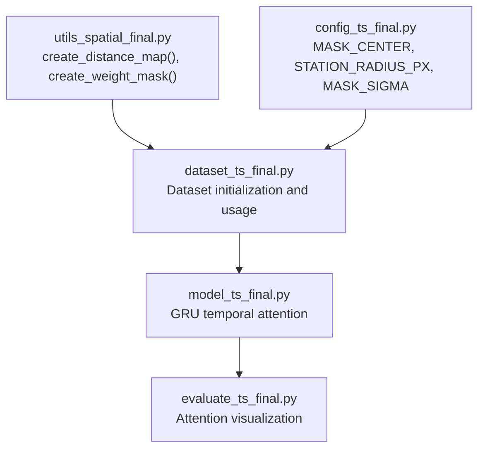
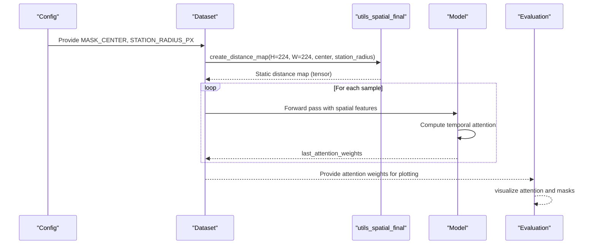
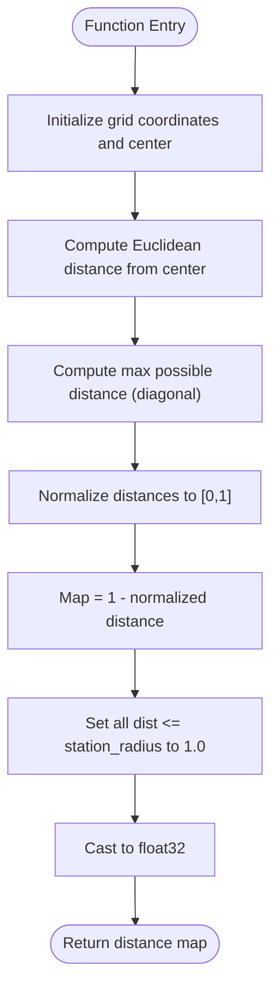
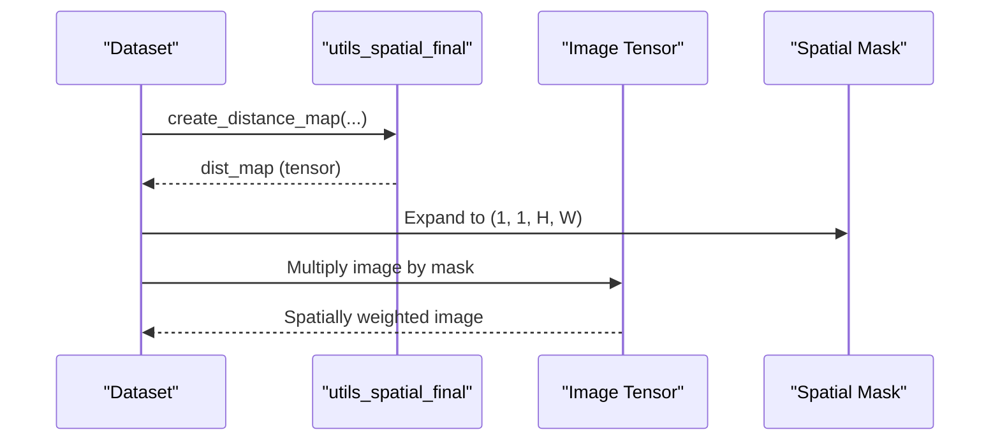
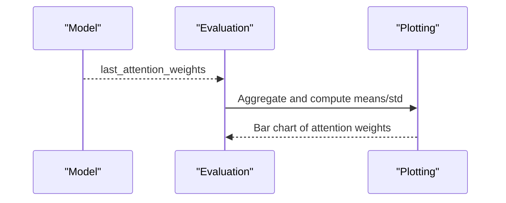
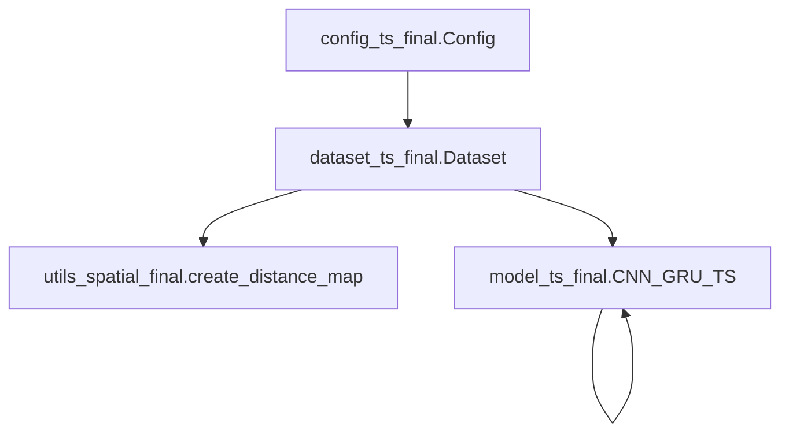

# Distance Maps Generation

<cite>
**Referenced Files in This Document**
- [utils_spatial_final.py](file://utils_spatial_final.py)
- [dataset_ts_final.py](file://dataset_ts_final.py)
- [config_ts_final.py](file://config_ts_final.py)
- [model_ts_final.py](file://model_ts_final.py)
- [evaluate_ts_final.py](file://evaluate_ts_final.py)
- [preprocess_ts.py](file://preprocess_ts.py)
</cite>

## Table of Contents
1. [Introduction](#introduction)
2. [Project Structure](#project-structure)
3. [Core Components](#core-components)
4. [Architecture Overview](#architecture-overview)
5. [Detailed Component Analysis](#detailed-component-analysis)
6. [Dependency Analysis](#dependency-analysis)
7. [Performance Considerations](#performance-considerations)
8. [Troubleshooting Guide](#troubleshooting-guide)
9. [Conclusion](#conclusion)

## Introduction
This document explains the distance map generation utilities used to define spatial attention around a central observing station (Nagpur) for thunderstorm nowcasting. It focuses on the create_distance_map function, detailing:
- Distance calculation methodology using normalized Euclidean distances
- Normalization techniques to ensure meaningful spatial weighting
- Boundary definition logic via station_radius
- The decay mechanism for spatial weighting
- Coordinate system handling and integration with spatial filtering operations
- Practical examples for METAR TS event boundaries
- Performance optimization, memory considerations, and visualization approaches for debugging spatial attention weights

## Project Structure
The distance map utility is part of the spatial utilities and is consumed by the dataset and model components during training and evaluation.

**Diagram sources**
- [utils_spatial_final.py:12-80](file://utils_spatial_final.py#L12-L80)
- [config_ts_final.py:106-120](file://config_ts_final.py#L106-L120)
- [dataset_ts_final.py:345-351](file://dataset_ts_final.py#L345-L351)
- [model_ts_final.py:172-200](file://model_ts_final.py#L172-L200)
- [evaluate_ts_final.py:146-323](file://evaluate_ts_final.py#L146-L323)

**Section sources**
- [utils_spatial_final.py:12-80](file://utils_spatial_final.py#L12-L80)
- [config_ts_final.py:106-120](file://config_ts_final.py#L106-L120)
- [dataset_ts_final.py:345-351](file://dataset_ts_final.py#L345-L351)
- [model_ts_final.py:172-200](file://model_ts_final.py#L172-L200)
- [evaluate_ts_final.py:146-323](file://evaluate_ts_final.py#L146-L323)

## Core Components
- create_distance_map: Generates a static 2D spatial map with a sharp boundary at station_radius and a smooth decay outward, normalized to [0, 1].
- create_weight_mask: Produces a normalized 2D Gaussian mask centered at a given pixel, useful for dynamic spatial weighting.
- Dataset integration: Initializes a static distance map once and reuses it across samples.
- Model attention: Stores and exposes temporal attention weights for interpretability and debugging.
- Evaluation visualization: Plots attention distributions and supports overlaying masks for debugging.

**Section sources**
- [utils_spatial_final.py:36-65](file://utils_spatial_final.py#L36-L65)
- [utils_spatial_final.py:12-34](file://utils_spatial_final.py#L12-L34)
- [dataset_ts_final.py:345-351](file://dataset_ts_final.py#L345-L351)
- [model_ts_final.py:172-200](file://model_ts_final.py#L172-L200)
- [evaluate_ts_final.py:146-323](file://evaluate_ts_final.py#L146-L323)

## Architecture Overview
The distance map is created once at dataset initialization and stored as a tensor. During training, the model’s spatial features can be modulated by masks (static or dynamic), and attention weights are recorded for interpretability.

**Diagram sources**
- [config_ts_final.py:106-120](file://config_ts_final.py#L106-L120)
- [dataset_ts_final.py:345-351](file://dataset_ts_final.py#L345-L351)
- [utils_spatial_final.py:36-65](file://utils_spatial_final.py#L36-L65)
- [model_ts_final.py:172-200](file://model_ts_final.py#L172-L200)
- [evaluate_ts_final.py:146-323](file://evaluate_ts_final.py#L146-L323)

## Detailed Component Analysis

### create_distance_map: Distance Calculation, Normalization, and Boundary Logic
- Input parameters:
  - H, W: image dimensions (pixels)
  - center: (x, y) of the station in the resized image
  - station_radius: radius of the METAR TS event boundary in pixels
- Methodology:
  - Computes Euclidean distance from every pixel to the center.
  - Normalizes distances by the maximum possible distance in the image (diagonal).
  - Produces a map where values decrease linearly from 1.0 at the center to 0.0 at the farthest corner.
  - Forces all pixels within station_radius to exactly 1.0, creating a sharp target zone boundary.
- Output:
  - A float32 NumPy array of shape (H, W) representing spatial weights.

**Diagram sources**
- [utils_spatial_final.py:36-65](file://utils_spatial_final.py#L36-L65)

**Section sources**
- [utils_spatial_final.py:36-65](file://utils_spatial_final.py#L36-L65)

### station_radius Parameter: Target Zone Definition and Spatial Weighting
- Purpose:
  - Defines the radius (in pixels) of the METAR TS event boundary around the station.
  - Ensures the target zone (within the boundary) receives full weight (1.0).
- Behavior:
  - Pixels inside the circle defined by station_radius are clamped to 1.0.
  - Outside this region, weights decay smoothly toward 0.0.
- Tuning:
  - Adjust station_radius to reflect the physical extent of interest (e.g., 10 NM boundary).
  - The provided configuration sets STATION_RADIUS_PX to approximately 2.7 pixels in a 224×224 grid after cropping adjustments.

**Section sources**
- [utils_spatial_final.py:40-65](file://utils_spatial_final.py#L40-L65)
- [config_ts_final.py:113](file://config_ts_final.py#L113)

### Coordinate System Handling
- The distance map assumes:
  - Pixel coordinates (x, y) where (0, 0) is the top-left corner.
  - The center parameter corresponds to the station’s position in the resized image.
- Cropping and resizing:
  - The preprocessing pipeline crops and resizes images to a fixed size, ensuring consistent coordinate mapping.
  - The dataset uses MASK_CENTER to anchor the distance map to the station’s position post-cropping.

**Section sources**
- [preprocess_ts.py:37-46](file://preprocess_ts.py#L37-L46)
- [config_ts_final.py:111](file://config_ts_final.py#L111)

### Integration with Spatial Filtering Operations
- Static distance map:
  - Created once at dataset initialization and reused across samples.
  - Stored as a tensor for efficient downstream computation.
- Dynamic masking:
  - The dataset also supports dynamic masks (e.g., create_weight_mask) that shift with motion (optical flow) to emphasize upwind regions.
- Channel-wise modulation:
  - Spatial masks can be broadcast across channels to weight input tensors spatially.

**Diagram sources**
- [dataset_ts_final.py:345-351](file://dataset_ts_final.py#L345-L351)
- [utils_spatial_final.py:36-65](file://utils_spatial_final.py#L36-L65)

**Section sources**
- [dataset_ts_final.py:345-351](file://dataset_ts_final.py#L345-L351)
- [utils_spatial_final.py:36-65](file://utils_spatial_final.py#L36-L65)

### Example: Distance Map Creation for METAR TS Event Boundaries
- Scenario:
  - Define a 10 NM boundary around Nagpur (station center) in a 224×224 image.
- Steps:
  - Set MASK_CENTER to the station’s pixel coordinates after cropping.
  - Set STATION_RADIUS_PX to the approximate pixel radius for 10 NM under the current projection.
  - Call create_distance_map with these parameters to produce a static boundary-weight map.
- Notes:
  - The resulting map highlights the station’s immediate vicinity (target zone) and smoothly reduces influence outward.

**Section sources**
- [config_ts_final.py:111-113](file://config_ts_final.py#L111-L113)
- [utils_spatial_final.py:36-65](file://utils_spatial_final.py#L36-L65)

### Visualization Approaches for Debugging Spatial Attention Weights
- Temporal attention visualization:
  - The evaluation script aggregates attention weights across batches and plots average and standard deviations across time steps.
- Spatial mask overlay:
  - The spatial utilities include a helper to overlay masks on images for qualitative inspection.
- Recommendations:
  - Use attention plots to confirm temporal focus.
  - Overlay masks on IR frames to verify spatial emphasis near the station.

**Diagram sources**
- [model_ts_final.py:199-200](file://model_ts_final.py#L199-L200)
- [evaluate_ts_final.py:146-323](file://evaluate_ts_final.py#L146-L323)

**Section sources**
- [model_ts_final.py:199-200](file://model_ts_final.py#L199-L200)
- [evaluate_ts_final.py:146-323](file://evaluate_ts_final.py#L146-L323)
- [utils_spatial_final.py:67-80](file://utils_spatial_final.py#L67-L80)

## Dependency Analysis
- create_distance_map depends on:
  - NumPy for numerical operations and broadcasting.
  - Configuration values for center and station_radius.
- Dataset integration:
  - The dataset initializes the static distance map once and stores it as a tensor for reuse.
- Model attention:
  - The model computes attention weights during forward passes and exposes them for visualization.

**Diagram sources**
- [utils_spatial_final.py:36-65](file://utils_spatial_final.py#L36-L65)
- [config_ts_final.py:106-120](file://config_ts_final.py#L106-L120)
- [dataset_ts_final.py:345-351](file://dataset_ts_final.py#L345-L351)
- [model_ts_final.py:172-200](file://model_ts_final.py#L172-L200)

**Section sources**
- [utils_spatial_final.py:36-65](file://utils_spatial_final.py#L36-L65)
- [config_ts_final.py:106-120](file://config_ts_final.py#L106-L120)
- [dataset_ts_final.py:345-351](file://dataset_ts_final.py#L345-L351)
- [model_ts_final.py:172-200](file://model_ts_final.py#L172-L200)

## Performance Considerations
- Memory efficiency:
  - The static distance map is computed once and reused across samples, avoiding repeated recomputation.
  - Ensure masks are cast to float32 to match typical tensor dtypes and reduce conversion overhead.
- I/O and throughput:
  - While not directly related to distance maps, the broader codebase identifies I/O bottlenecks with HDF5 datasets and recommends transitioning to memory-mapped formats for training throughput improvements.
- Computational cost:
  - Distance map creation is O(H×W) and inexpensive compared to model inference.
  - Dynamic masks derived from optical flow introduce additional computation; tune parameters (e.g., sigma) to balance responsiveness and cost.

[No sources needed since this section provides general guidance]

## Troubleshooting Guide
- Unexpected low weights outside the station:
  - Verify station_radius is set appropriately for the current image size and projection.
- Misaligned center:
  - Confirm MASK_CENTER reflects the station’s position after cropping/resizing.
- Attention appears uniform:
  - Check that spatial masks are being applied to input tensors and that attention weights are being captured during evaluation.
- Visualization issues:
  - Ensure attention arrays are aggregated correctly and plotted with appropriate labels for time steps.

**Section sources**
- [config_ts_final.py:111-113](file://config_ts_final.py#L111-L113)
- [dataset_ts_final.py:345-351](file://dataset_ts_final.py#L345-L351)
- [evaluate_ts_final.py:146-323](file://evaluate_ts_final.py#L146-L323)

## Conclusion
The distance map utility provides a simple yet effective way to encode spatial attention around a station, combining a sharp boundary for the METAR TS event with a smooth decay for surrounding regions. Proper configuration of center and station_radius ensures accurate spatial weighting, while integration with dynamic masks and attention visualization enables robust debugging and interpretation of model behavior.