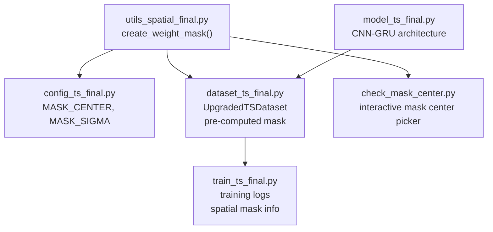
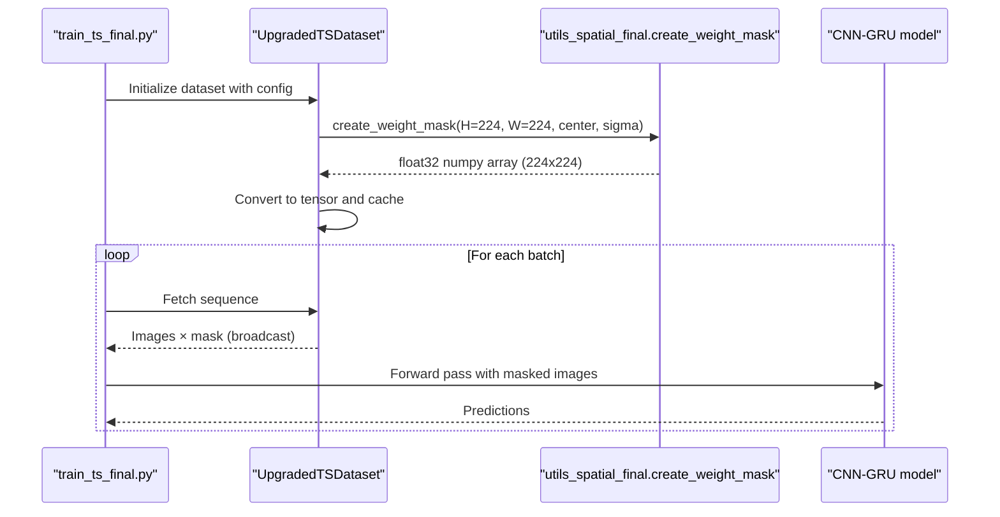
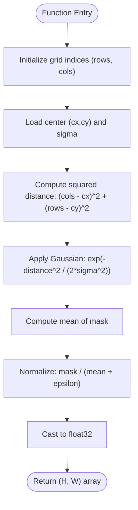
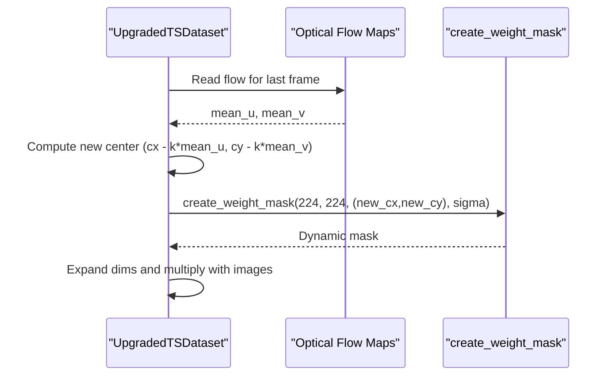
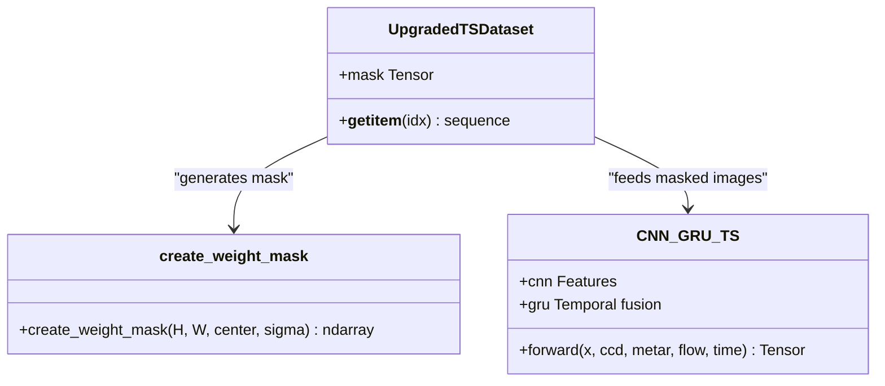
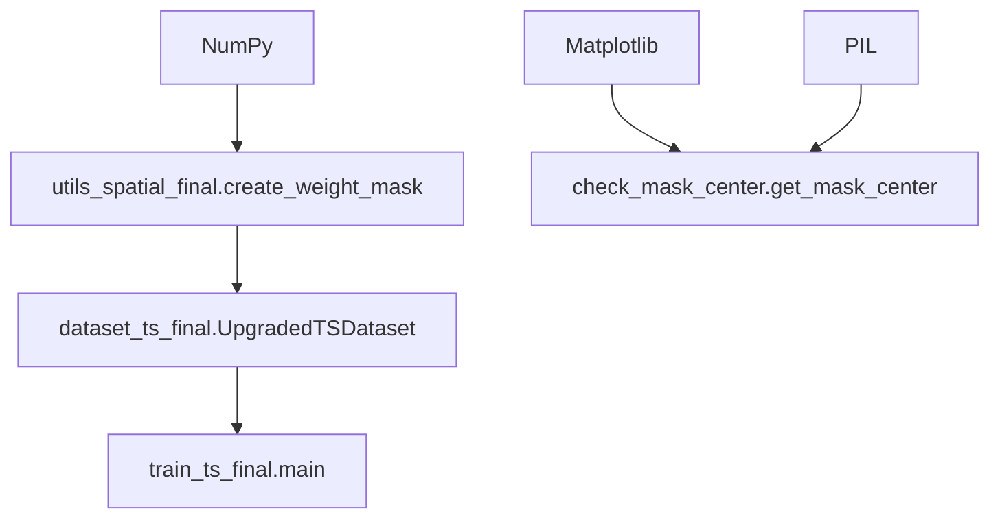

# Gaussian Weight Masks

<cite>
**Referenced Files in This Document**
- [utils_spatial_final.py](file://utils_spatial_final.py)
- [config_ts_final.py](file://config_ts_final.py)
- [dataset_ts_final.py](file://dataset_ts_final.py)
- [train_ts_final.py](file://train_ts_final.py)
- [check_mask_center.py](file://check_mask_center.py)
- [model_ts_final.py](file://model_ts_final.py)
</cite>

## Table of Contents
1. [Introduction](#introduction)
2. [Project Structure](#project-structure)
3. [Core Components](#core-components)
4. [Architecture Overview](#architecture-overview)
5. [Detailed Component Analysis](#detailed-component-analysis)
6. [Dependency Analysis](#dependency-analysis)
7. [Performance Considerations](#performance-considerations)
8. [Troubleshooting Guide](#troubleshooting-guide)
9. [Conclusion](#conclusion)

## Introduction
This document explains the Gaussian weight mask generation utilities used for spatial attention in the Nagpur thunderstorm nowcasting pipeline. It details the create_weight_mask function, its parameters, the underlying 2D Gaussian mathematics, normalization to preserve brightness balance, and practical usage across preprocessing, training, and evaluation. It also covers visualization techniques, parameter tuning for different spatial attention needs, performance considerations for large images, and integration with CNN architectures.

## Project Structure
The Gaussian weight mask functionality is implemented in a dedicated spatial utilities module and integrated into the dataset pipeline and training configuration. The following diagram shows the relationship between the key modules involved in mask creation and usage.

**Diagram sources**
- [utils_spatial_final.py:12-34](file://utils_spatial_final.py#L12-L34)
- [config_ts_final.py:106-114](file://config_ts_final.py#L106-L114)
- [dataset_ts_final.py:80-84](file://dataset_ts_final.py#L80-L84)
- [train_ts_final.py:195-196](file://train_ts_final.py#L195-L196)
- [check_mask_center.py:5-77](file://check_mask_center.py#L5-L77)
- [model_ts_final.py:68-269](file://model_ts_final.py#L68-L269)

**Section sources**
- [utils_spatial_final.py:12-34](file://utils_spatial_final.py#L12-L34)
- [config_ts_final.py:106-114](file://config_ts_final.py#L106-L114)
- [dataset_ts_final.py:80-84](file://dataset_ts_final.py#L80-L84)
- [train_ts_final.py:195-196](file://train_ts_final.py#L195-L196)
- [check_mask_center.py:5-77](file://check_mask_center.py#L5-L77)
- [model_ts_final.py:68-269](file://model_ts_final.py#L68-L269)

## Core Components
- create_weight_mask: Generates a normalized 2D Gaussian mask centered at a given pixel with configurable spread. The normalization ensures the mean value equals 1.0 to preserve overall image brightness when used as a multiplicative spatial attention map.
- Configuration: MASK_CENTER and MASK_SIGMA define the center and spread of the Gaussian mask used across the dataset and training pipeline.
- Dataset Integration: The UpgradedTSDataset pre-computes and caches the mask tensor for efficient reuse during training.
- Interactive Center Picker: An interactive utility helps select the mask center on raw imagery and prints the corresponding (x, y) coordinates for the processed 224×224 grid.

**Section sources**
- [utils_spatial_final.py:12-34](file://utils_spatial_final.py#L12-L34)
- [config_ts_final.py:106-114](file://config_ts_final.py#L106-L114)
- [dataset_ts_final.py:80-84](file://dataset_ts_final.py#L80-L84)
- [check_mask_center.py:5-77](file://check_mask_center.py#L5-L77)

## Architecture Overview
The Gaussian mask is generated once during dataset initialization and broadcast to all frames in a sequence. During training, the mask is multiplied element-wise with the image tensors to emphasize the Nagpur region and down-weight peripheral areas. The training logs confirm the mask usage and parameters.

**Diagram sources**
- [train_ts_final.py:195-196](file://train_ts_final.py#L195-L196)
- [dataset_ts_final.py:80-84](file://dataset_ts_final.py#L80-L84)
- [utils_spatial_final.py:12-34](file://utils_spatial_final.py#L12-L34)
- [model_ts_final.py:202-269](file://model_ts_final.py#L202-L269)

## Detailed Component Analysis

### Mathematical Foundation and Implementation
- 2D Gaussian distribution: The mask values are computed using the standard 2D Gaussian formula centered at (cx, cy) with spread controlled by sigma. The implementation uses vectorized operations over row and column indices to compute squared distances efficiently.
- Normalization: The mask is normalized by its mean to ensure the overall brightness remains unchanged when the mask is applied as a multiplicative factor. A small epsilon prevents division by zero.
- Output type: The function returns a float32 NumPy array suitable for conversion to tensors.

**Diagram sources**
- [utils_spatial_final.py:29-34](file://utils_spatial_final.py#L29-L34)

**Section sources**
- [utils_spatial_final.py:12-34](file://utils_spatial_final.py#L12-L34)

### Parameter Reference and Tuning
- H, W: Image height and width in pixels. The mask is produced at the native resolution and later broadcast to sequences.
- center: Tuple (x, y) specifying the Gaussian center in the processed 224×224 grid. The configuration file defines the default center for Nagpur.
- sigma: Spread of the Gaussian in pixels. Larger sigma broadens the attention region; smaller sigma focuses sharply on the center.
- Normalization: Ensures mean == 1.0 to preserve brightness.

Practical tuning tips:
- Focus region: Reduce sigma to emphasize a tighter region around Nagpur.
- Coverage: Increase sigma to include more peripheral context.
- Brightness preservation: Keep normalization enabled to avoid altering global intensity.

**Section sources**
- [utils_spatial_final.py:18-34](file://utils_spatial_final.py#L18-L34)
- [config_ts_final.py:106-114](file://config_ts_final.py#L106-L114)

### Practical Examples

#### Example 1: Nagpur Region Focus
- Use the default configuration values for MASK_CENTER and MASK_SIGMA to create a centered Gaussian mask focused on Nagpur.
- The dataset pre-computes and caches the mask for fast reuse during training.

**Section sources**
- [config_ts_final.py:110-111](file://config_ts_final.py#L110-L111)
- [dataset_ts_final.py:80-84](file://dataset_ts_final.py#L80-L84)

#### Example 2: Dynamic Centering with Optical Flow
- When optical flow is enabled, the dataset adjusts the mask center dynamically based on motion vectors, shifting the center along the direction of motion to track evolving storm systems.
- The dynamic mask is recomputed for each sequence and applied element-wise to the image tensors.

**Diagram sources**
- [dataset_ts_final.py:500-511](file://dataset_ts_final.py#L500-L511)
- [utils_spatial_final.py:12-34](file://utils_spatial_final.py#L12-L34)

**Section sources**
- [dataset_ts_final.py:500-511](file://dataset_ts_final.py#L500-L511)

#### Example 3: Interactive Mask Center Selection
- Use the interactive utility to visually select the mask center on raw imagery. The tool converts raw coordinates to the processed 224×224 grid and prints the recommended configuration values.

**Section sources**
- [check_mask_center.py:5-77](file://check_mask_center.py#L5-L77)

### Visualization Techniques
- Overlay the mask on a sample image to inspect the attention region and verify center placement.
- The visualization combines the original grayscale image with the jet-colored mask and an overlaid composite for intuitive interpretation.

**Section sources**
- [utils_spatial_final.py:67-80](file://utils_spatial_final.py#L67-L80)

### Integration with CNN Architectures
- The mask is broadcast across channels and applied element-wise to image tensors before being fed into the CNN backbone.
- The model’s CNN features are extracted, optionally combined with spatial skip connections, optical flow, and temporal features, then passed through the GRU for temporal fusion and prediction heads.

**Diagram sources**
- [dataset_ts_final.py:80-84](file://dataset_ts_final.py#L80-L84)
- [utils_spatial_final.py:12-34](file://utils_spatial_final.py#L12-L34)
- [model_ts_final.py:202-269](file://model_ts_final.py#L202-L269)

**Section sources**
- [dataset_ts_final.py:80-84](file://dataset_ts_final.py#L80-L84)
- [model_ts_final.py:202-269](file://model_ts_final.py#L202-L269)

## Dependency Analysis
- create_weight_mask depends on NumPy for numerical operations and returns a float32 array.
- The dataset imports create_weight_mask and stores a cached tensor for reuse.
- Training logs print the active mask configuration for reproducibility.
- The interactive center picker depends on Matplotlib and PIL for visualization and coordinate conversion.

**Diagram sources**
- [utils_spatial_final.py:6-8](file://utils_spatial_final.py#L6-L8)
- [dataset_ts_final.py:20-20](file://dataset_ts_final.py#L20-L20)
- [train_ts_final.py:195-196](file://train_ts_final.py#L195-L196)
- [check_mask_center.py:2-4](file://check_mask_center.py#L2-L4)

**Section sources**
- [utils_spatial_final.py:6-8](file://utils_spatial_final.py#L6-L8)
- [dataset_ts_final.py:20-20](file://dataset_ts_final.py#L20-L20)
- [train_ts_final.py:195-196](file://train_ts_final.py#L195-L196)
- [check_mask_center.py:2-4](file://check_mask_center.py#L2-L4)

## Performance Considerations
- Vectorized computation: The mask is computed using NumPy’s ogrid and vectorized arithmetic, minimizing Python loops and enabling fast generation even for large images.
- Broadcasting: The pre-computed mask is expanded to (1, 1, H, W) and broadcast across batches, avoiding per-frame recomputation overhead.
- Memory footprint: The mask is a float32 array sized to the image dimensions; for very large resolutions, consider generating masks at a coarser resolution and resizing if needed.
- Dynamic centering: Recomputing the mask per sequence introduces negligible overhead compared to the CNN forward pass, but disabling optical flow removes this cost.

[No sources needed since this section provides general guidance]

## Troubleshooting Guide
- Incorrect center placement: Use the interactive center picker to select the mask center on raw imagery and update the configuration accordingly.
- Brightness anomalies: Ensure the mask normalization is active (mean == 1.0) to preserve brightness.
- Dynamic center out of bounds: The dataset clamps the dynamic center to valid pixel coordinates; verify optical flow values and scaling factors if unexpected shifts occur.

**Section sources**
- [check_mask_center.py:5-77](file://check_mask_center.py#L5-L77)
- [utils_spatial_final.py:33-33](file://utils_spatial_final.py#L33-L33)
- [dataset_ts_final.py:504-507](file://dataset_ts_final.py#L504-L507)

## Conclusion
The Gaussian weight mask utility provides a simple yet powerful mechanism for spatial attention in the Nagpur thunderstorm nowcasting pipeline. By centering the attention on Nagpur and normalizing brightness, it enables the model to focus on the region of interest while preserving global image characteristics. The implementation integrates seamlessly with the dataset and training pipeline, supports dynamic centering with optical flow, and offers straightforward visualization and tuning capabilities.