# Spatial Analysis Utilities

<cite>
**Referenced Files in This Document**
- [utils_spatial_final.py](file://utils_spatial_final.py)
- [generate_static_masks.py](file://extras/generate_static_masks.py)
- [find_global_shifts.py](file://extras/find_global_shifts.py)
- [auto_find_centers.py](file://extras/auto_find_centers.py)
- [find_exact_centers.py](file://extras/find_exact_centers.py)
- [check_mask_center.py](file://extras/check_mask_center.py)
- [preprocess_ts.py](file://preprocess_ts.py)
- [utils_preprocessing.py](file://utils_preprocessing.py)
- [config_ts_final.py](file://config_ts_final.py)
- [prepare_data.py](file://prepare_data.py)
</cite>

## Table of Contents
1. [Introduction](#introduction)
2. [Project Structure](#project-structure)
3. [Core Components](#core-components)
4. [Architecture Overview](#architecture-overview)
5. [Detailed Component Analysis](#detailed-component-analysis)
6. [Dependency Analysis](#dependency-analysis)
7. [Performance Considerations](#performance-considerations)
8. [Troubleshooting Guide](#troubleshooting-guide)
9. [Conclusion](#conclusion)

## Introduction
This document describes the spatial analysis utilities used for geometric operations, mask generation, and spatial transformation tools in the IR (infrared) satellite imagery processing pipeline. It focuses on:
- Static mask generation for region-of-interest extraction and spatial filtering
- Center detection algorithms for storm identification and tracking
- Global shift detection tools for spatial alignment and coordinate transformation
- Spatial coordinate systems, geometric operations, and preprocessing workflows
- Performance considerations, mask optimization, and center detection accuracy

The goal is to help both technical and non-technical users understand how spatial masks and centers are computed, validated, and integrated into the broader preprocessing and modeling workflow.

## Project Structure
The spatial utilities span several modules:
- Spatial utilities for mask creation and visualization
- Static mask generation scripts for dimension-specific masks
- Center detection and global shift detection tools
- Preprocessing pipeline integrating masks and centers
- Configuration and preparation pipeline for datasets

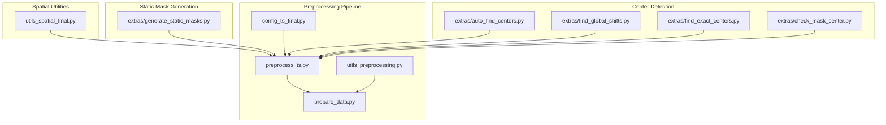

**Diagram sources**
- [utils_spatial_final.py:12-80](file://utils_spatial_final.py#L12-L80)
- [generate_static_masks.py:1-150](file://extras/generate_static_masks.py#L1-L150)
- [auto_find_centers.py:1-101](file://extras/auto_find_centers.py#L1-L101)
- [find_global_shifts.py:1-76](file://extras/find_global_shifts.py#L1-L76)
- [find_exact_centers.py:1-65](file://extras/find_exact_centers.py#L1-L65)
- [check_mask_center.py:1-78](file://extras/check_mask_center.py#L1-L78)
- [preprocess_ts.py:17-112](file://preprocess_ts.py#L17-L112)
- [utils_preprocessing.py:86-162](file://utils_preprocessing.py#L86-L162)
- [config_ts_final.py:106-117](file://config_ts_final.py#L106-L117)
- [prepare_data.py:39-132](file://prepare_data.py#L39-L132)

**Section sources**
- [utils_spatial_final.py:12-80](file://utils_spatial_final.py#L12-L80)
- [generate_static_masks.py:1-150](file://extras/generate_static_masks.py#L1-L150)
- [auto_find_centers.py:1-101](file://extras/auto_find_centers.py#L1-L101)
- [find_global_shifts.py:1-76](file://extras/find_global_shifts.py#L1-L76)
- [find_exact_centers.py:1-65](file://extras/find_exact_centers.py#L1-L65)
- [check_mask_center.py:1-78](file://extras/check_mask_center.py#L1-L78)
- [preprocess_ts.py:17-112](file://preprocess_ts.py#L17-L112)
- [utils_preprocessing.py:86-162](file://utils_preprocessing.py#L86-L162)
- [config_ts_final.py:106-117](file://config_ts_final.py#L106-L117)
- [prepare_data.py:39-132](file://prepare_data.py#L39-L132)

## Core Components
- Spatial mask utilities: Gaussian weight mask and distance map creation for spatial attention and target-zone highlighting
- Static mask generation: Dimension-aware mask creation from median crops and color thresholds
- Center detection: Automatic and exact center-finding via template matching and pixel-wise similarity
- Global shift detection: Cross-dimension alignment using normalized cross-correlation
- Preprocessing integration: Cropping, inpainting, resizing, normalization, and optional optical flow computation
- Configuration: Spatial mask parameters and center coordinates for consistent processing

Key capabilities:
- ROI extraction using masks and centers
- Spatial filtering with attention-weighted regions
- Coordinate transformation and alignment across image dimensions
- Robust preprocessing with contrast enhancement and outlier normalization

**Section sources**
- [utils_spatial_final.py:12-80](file://utils_spatial_final.py#L12-L80)
- [generate_static_masks.py:17-147](file://extras/generate_static_masks.py#L17-L147)
- [auto_find_centers.py:22-98](file://extras/auto_find_centers.py#L22-L98)
- [find_exact_centers.py:13-62](file://extras/find_exact_centers.py#L13-L62)
- [find_global_shifts.py:13-73](file://extras/find_global_shifts.py#L13-L73)
- [preprocess_ts.py:27-112](file://preprocess_ts.py#L27-L112)
- [utils_preprocessing.py:16-162](file://utils_preprocessing.py#L16-L162)
- [config_ts_final.py:106-117](file://config_ts_final.py#L106-L117)

## Architecture Overview
The spatial analysis pipeline integrates mask generation, center detection, and preprocessing into a cohesive workflow. Static masks are generated per image dimension and cached for reuse. During preprocessing, masks are combined with detected overlays and inpainted to remove artifacts. Optional optical flow is computed for motion features. The final dataset is stored in HDF5 for efficient training.

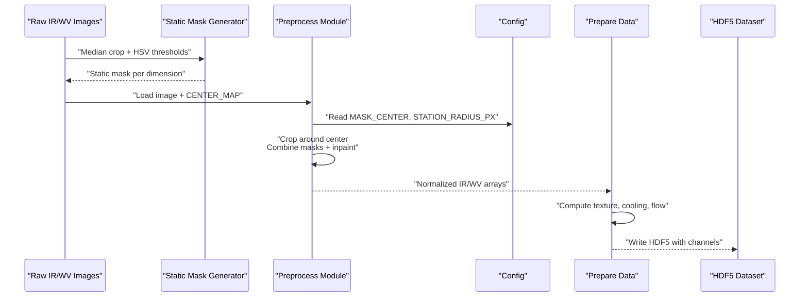

**Diagram sources**
- [generate_static_masks.py:116-147](file://extras/generate_static_masks.py#L116-L147)
- [preprocess_ts.py:27-112](file://preprocess_ts.py#L27-L112)
- [config_ts_final.py:106-117](file://config_ts_final.py#L106-L117)
- [prepare_data.py:64-125](file://prepare_data.py#L64-L125)

## Detailed Component Analysis

### Spatial Mask Utilities
- Gaussian weight mask: Creates a normalized 2D Gaussian centered at a given pixel with configurable spread. Mean normalization ensures no overall brightness change.
- Distance map: Produces a normalized Euclidean distance map from a center, with a sharp peak at the station radius to highlight the target zone.

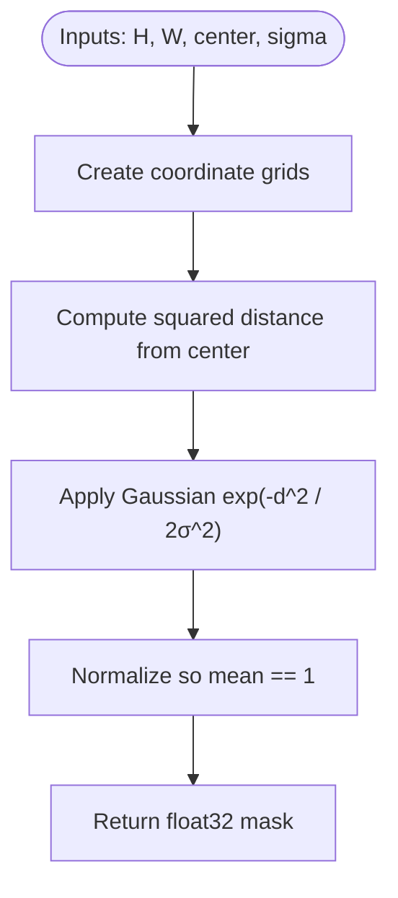

**Diagram sources**
- [utils_spatial_final.py:12-34](file://utils_spatial_final.py#L12-L34)

Accuracy and performance:
- Uses vectorized NumPy operations for speed
- Normalization prevents illumination bias in attention weighting

**Section sources**
- [utils_spatial_final.py:12-34](file://utils_spatial_final.py#L12-L34)
- [utils_spatial_final.py:36-65](file://utils_spatial_final.py#L36-L65)

### Static Mask Generation
- Purpose: Generate dimension-specific masks to filter out non-storm regions and overlays
- Method:
  - Group images by dimension and prioritize seasonal clear conditions
  - Compute median crop and convert to HSV
  - Thresholds for grid, cyan, and boundary regions; combine with OR operation
  - Dilate once to keep mask tight and prevent information loss
  - Save per-dimension static masks

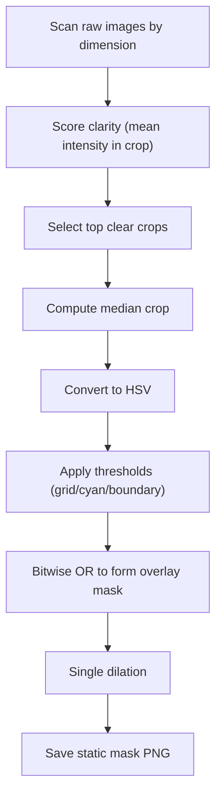

**Diagram sources**
- [generate_static_masks.py:86-147](file://extras/generate_static_masks.py#L86-L147)

Optimization:
- Early exit when sufficient files per dimension are collected
- Two-pass scoring prioritizes seasonal clear images
- Minimal IO overhead by caching masks and reusing

**Section sources**
- [generate_static_masks.py:17-147](file://extras/generate_static_masks.py#L17-L147)

### Center Detection Algorithms
- Automatic center detection:
  - Extract overlay mask from reference dimension
  - Define a template around Nagpur center
  - Perform normalized cross-correlation on binary mask across dimensions
  - Record center with confidence and optionally save verification crops

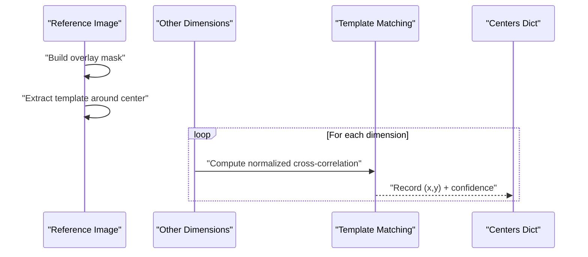

**Diagram sources**
- [auto_find_centers.py:46-90](file://extras/auto_find_centers.py#L46-L90)

- Exact center refinement:
  - Compare small crops around the reference center using MSE
  - Search a small neighborhood to refine center coordinates

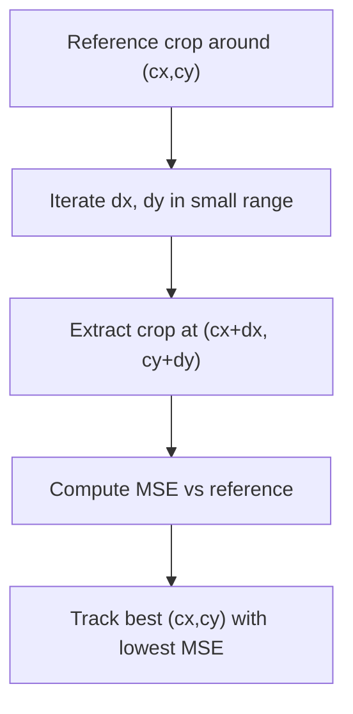

**Diagram sources**
- [find_exact_centers.py:32-61](file://extras/find_exact_centers.py#L32-L61)

- Interactive mask center tool:
  - Opens a raw image and allows clicking to convert between raw and processed coordinates
  - Prints recommended configuration updates for MASK_CENTER

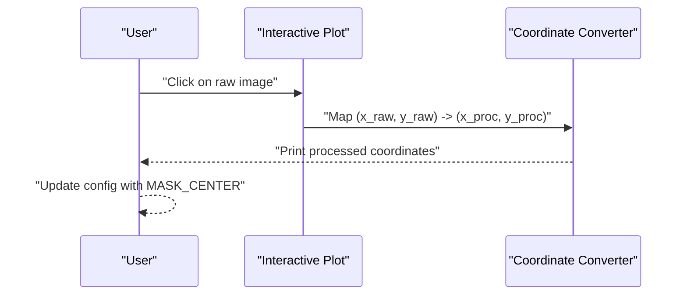

**Diagram sources**
- [check_mask_center.py:45-71](file://extras/check_mask_center.py#L45-L71)

Accuracy considerations:
- Template matching on binary masks improves robustness to illumination changes
- MSE-based refinement reduces sub-pixel jitter
- Confidence scores from normalized cross-correlation guide trust in detections

**Section sources**
- [auto_find_centers.py:22-98](file://extras/auto_find_centers.py#L22-L98)
- [find_exact_centers.py:13-62](file://extras/find_exact_centers.py#L13-L62)
- [check_mask_center.py:5-71](file://extras/check_mask_center.py#L5-L71)

### Global Shift Detection Tools
- Goal: Align different image dimensions by detecting shifts in coastline/grid patterns
- Method:
  - Build boundary mask from HSV ranges
  - Use normalized cross-correlation (template matching) with the reference dimension
  - Derive shifted centers by offset from match location
  - Optionally save verification crops

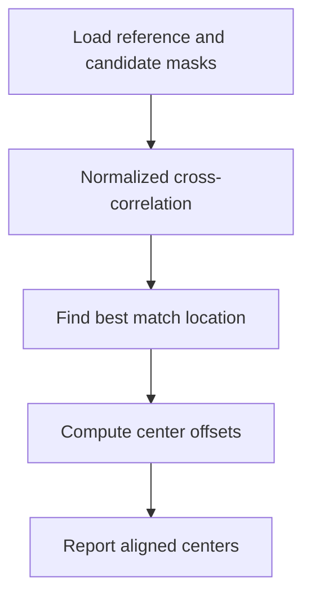

**Diagram sources**
- [find_global_shifts.py:13-73](file://extras/find_global_shifts.py#L13-L73)

Integration:
- Used to populate CENTER_MAP for each dimension
- Ensures consistent cropping across heterogeneous image sizes

**Section sources**
- [find_global_shifts.py:13-73](file://extras/find_global_shifts.py#L13-L73)

### Spatial Coordinate Systems and Geometric Operations
- Pixel coordinate mapping:
  - Raw image coordinates are mapped to processed coordinates using resize ratios
  - Used for translating user-selected points into model-ready coordinates
- Cropping geometry:
  - Fixed-size crops around centers for consistent input tensors
  - Padding and resizing preserve aspect ratios and center alignment

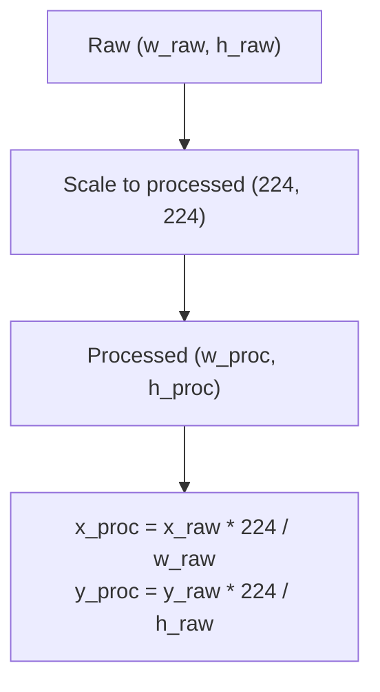

**Diagram sources**
- [check_mask_center.py:57-59](file://extras/check_mask_center.py#L57-L59)

**Section sources**
- [check_mask_center.py:23-30](file://extras/check_mask_center.py#L23-L30)
- [check_mask_center.py:57-64](file://extras/check_mask_center.py#L57-L64)

### Preprocessing and Spatial Filtering Workflow
- Overlay cleaning:
  - Build masks from HSV ranges and static masks
  - Combine masks and inpaint to remove artifacts
- Grayscale proxy and feature extraction:
  - Convert to grayscale proxy where brighter indicates colder clouds
  - Compute CCD metrics and connected components
- Resizing and padding:
  - Resize maintaining aspect ratio, then pad to square
- Optional optical flow:
  - Compute motion magnitude using a lightweight method

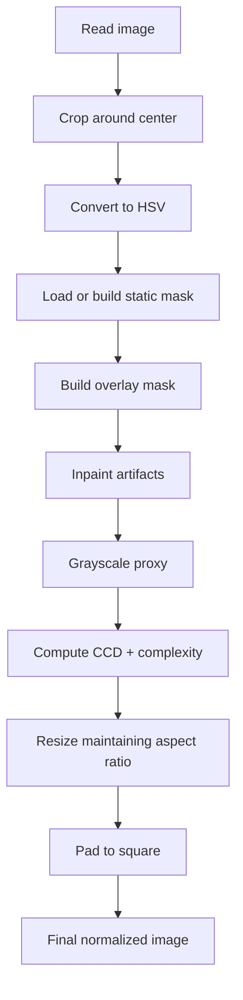

**Diagram sources**
- [preprocess_ts.py:27-112](file://preprocess_ts.py#L27-L112)

**Section sources**
- [preprocess_ts.py:27-112](file://preprocess_ts.py#L27-L112)
- [utils_preprocessing.py:16-162](file://utils_preprocessing.py#L16-L162)

### Configuration and Dataset Preparation
- Spatial configuration:
  - MASK_CENTER defines the center for attention weighting
  - STATION_RADIUS_PX sets the target zone boundary radius
  - USE_MASK toggles spatial attention
- Dataset preparation:
  - Matches IR and WV images by timestamp
  - Computes texture, cooling, flow, and differences
  - Writes channels to HDF5 for training

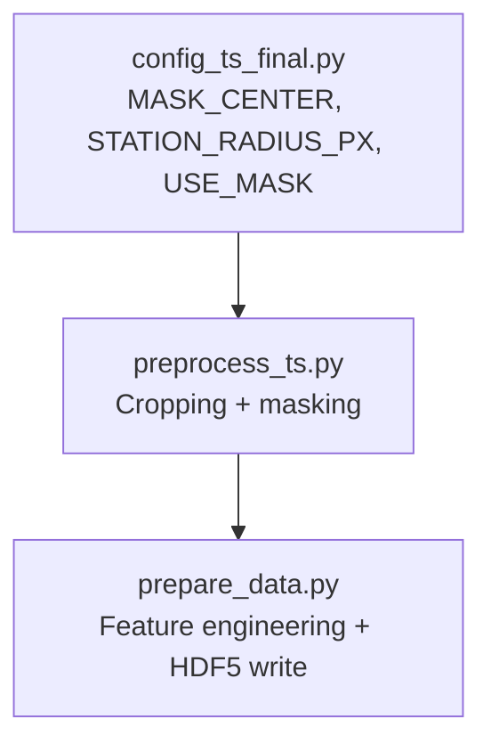

**Diagram sources**
- [config_ts_final.py:106-117](file://config_ts_final.py#L106-L117)
- [preprocess_ts.py:27-112](file://preprocess_ts.py#L27-L112)
- [prepare_data.py:64-125](file://prepare_data.py#L64-L125)

**Section sources**
- [config_ts_final.py:106-117](file://config_ts_final.py#L106-L117)
- [prepare_data.py:39-132](file://prepare_data.py#L39-L132)

## Dependency Analysis
- Spatial utilities depend on NumPy and Matplotlib/PIL for visualization
- Static mask generation depends on OpenCV for image I/O, HSV conversion, and thresholding
- Center detection scripts depend on OpenCV for template matching and image operations
- Preprocessing depends on OpenCV, Pandas, and CV utilities
- Dataset preparation depends on HDF5, PyTorch, and CV utilities

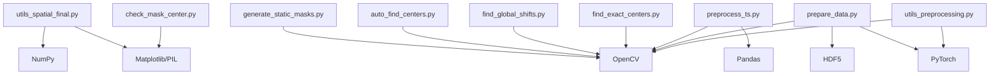

**Diagram sources**
- [utils_spatial_final.py:6-8](file://utils_spatial_final.py#L6-L8)
- [generate_static_masks.py:2-6](file://extras/generate_static_masks.py#L2-L6)
- [auto_find_centers.py:1-5](file://extras/auto_find_centers.py#L1-L5)
- [find_global_shifts.py:1-4](file://extras/find_global_shifts.py#L1-L4)
- [find_exact_centers.py:1-4](file://extras/find_exact_centers.py#L1-L4)
- [check_mask_center.py:1-3](file://extras/check_mask_center.py#L1-L3)
- [preprocess_ts.py:1-5](file://preprocess_ts.py#L1-L5)
- [prepare_data.py:1-12](file://prepare_data.py#L1-L12)
- [utils_preprocessing.py:8-12](file://utils_preprocessing.py#L8-L12)

**Section sources**
- [utils_spatial_final.py:6-8](file://utils_spatial_final.py#L6-L8)
- [generate_static_masks.py:2-6](file://extras/generate_static_masks.py#L2-L6)
- [auto_find_centers.py:1-5](file://extras/auto_find_centers.py#L1-L5)
- [find_global_shifts.py:1-4](file://extras/find_global_shifts.py#L1-L4)
- [find_exact_centers.py:1-4](file://extras/find_exact_centers.py#L1-L4)
- [check_mask_center.py:1-3](file://extras/check_mask_center.py#L1-L3)
- [preprocess_ts.py:1-5](file://preprocess_ts.py#L1-L5)
- [prepare_data.py:1-12](file://prepare_data.py#L1-L12)
- [utils_preprocessing.py:8-12](file://utils_preprocessing.py#L8-L12)

## Performance Considerations
- Vectorized operations: Gaussian and distance computations use NumPy’s broadcasting for speed
- Mask generation optimization: Early exits and two-pass scoring reduce unnecessary reads
- Template matching: Normalized cross-correlation is efficient and robust; restrict search ranges to improve speed
- Inpainting and resizing: Use appropriate interpolation and padding to minimize artifacts
- Dataset I/O: HDF5 compression and chunking improve throughput during training
- Optical flow: Lightweight method is used to balance accuracy and compute cost

[No sources needed since this section provides general guidance]

## Troubleshooting Guide
- Static mask quality:
  - If masks over-segment or under-segment, adjust HSV thresholds and dilation iterations
  - Ensure median crop captures representative scene without excessive cloud cover
- Center detection failures:
  - Verify CENTER_MAP entries align with reference dimension
  - Increase template size or confidence thresholds if matching is noisy
- Coordinate mapping errors:
  - Confirm raw image dimensions and processed size ratios
  - Use interactive tool to validate conversions
- Preprocessing artifacts:
  - Inspect overlay masks and inpainting results
  - Adjust thresholds or expand static mask coverage

**Section sources**
- [generate_static_masks.py:122-140](file://extras/generate_static_masks.py#L122-L140)
- [auto_find_centers.py:66-74](file://extras/auto_find_centers.py#L66-L74)
- [check_mask_center.py:57-64](file://extras/check_mask_center.py#L57-L64)
- [preprocess_ts.py:50-67](file://preprocess_ts.py#L50-L67)

## Conclusion
The spatial analysis utilities provide a robust foundation for ROI extraction, spatial filtering, and coordinate alignment in IR imagery preprocessing. By combining static masks, precise center detection, and efficient preprocessing, the pipeline supports accurate storm identification and tracking while maintaining computational efficiency. Proper tuning of thresholds, templates, and masks ensures high accuracy and reproducibility across diverse image dimensions.