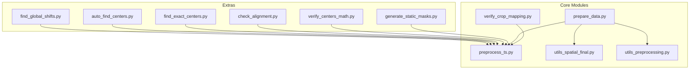
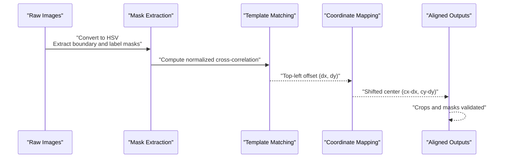
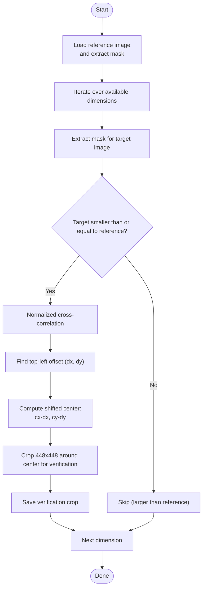
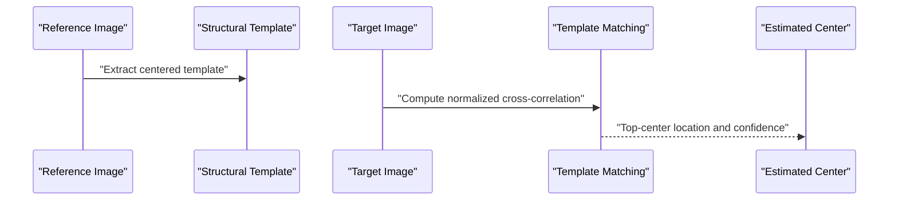
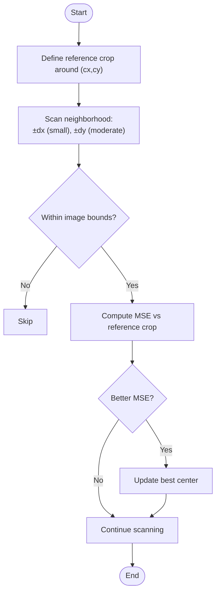
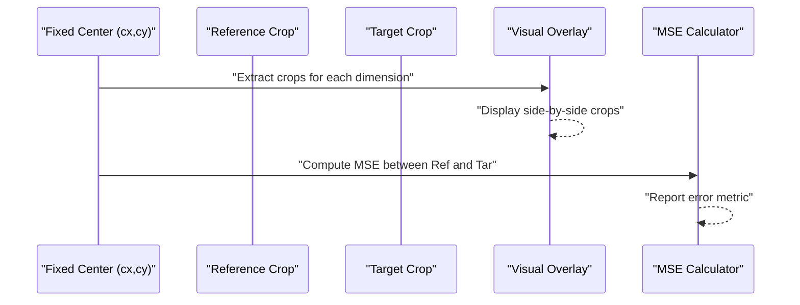
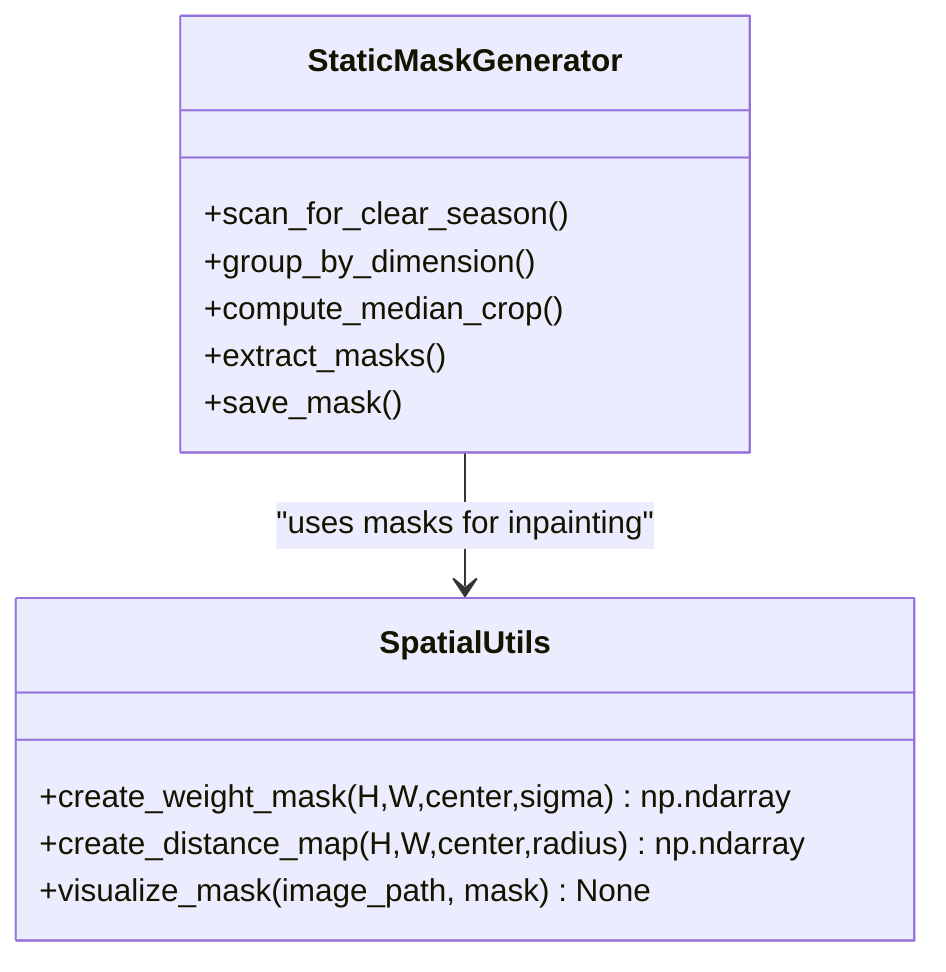
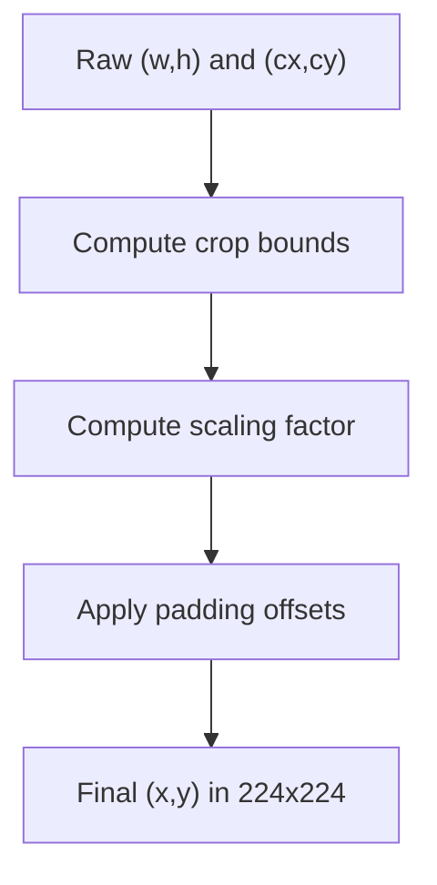
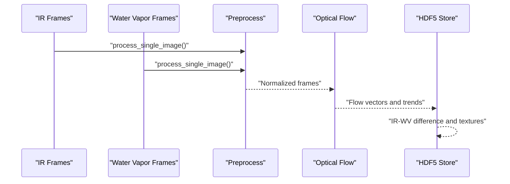
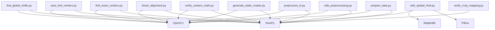

# Spatial Transformations

<cite>
**Referenced Files in This Document**
- [find_global_shifts.py](file://extras/find_global_shifts.py)
- [auto_find_centers.py](file://extras/auto_find_centers.py)
- [find_exact_centers.py](file://extras/find_exact_centers.py)
- [check_alignment.py](file://extras/check_alignment.py)
- [verify_centers_math.py](file://extras/verify_centers_math.py)
- [generate_static_masks.py](file://extras/generate_static_masks.py)
- [preprocess_ts.py](file://preprocess_ts.py)
- [utils_spatial_final.py](file://utils_spatial_final.py)
- [utils_preprocessing.py](file://utils_preprocessing.py)
- [prepare_data.py](file://prepare_data.py)
- [verify_crop_mapping.py](file://extras/verify_crop_mapping.py)
</cite>

## Table of Contents
1. [Introduction](#introduction)
2. [Project Structure](#project-structure)
3. [Core Components](#core-components)
4. [Architecture Overview](#architecture-overview)
5. [Detailed Component Analysis](#detailed-component-analysis)
6. [Dependency Analysis](#dependency-analysis)
7. [Performance Considerations](#performance-considerations)
8. [Troubleshooting Guide](#troubleshooting-guide)
9. [Conclusion](#conclusion)
10. [Appendices](#appendices)

## Introduction
This document explains the spatial transformation utilities used to detect global shifts and align coordinates across multi-temporal satellite imagery. It focuses on:
- The find_global_shifts workflow and its underlying transformation algorithms
- Shift calculation via template matching and mask comparison
- Alignment validation techniques and quality metrics
- Mathematical foundations of spatial registration and coordinate conversion
- Practical calibration procedures and integration with multi-temporal analysis

The goal is to enable reproducible, accurate alignment of infrared (IR) imagery captured under varying sensor configurations and geometric conditions.

## Project Structure
The spatial transformation utilities are organized across dedicated scripts and shared modules:
- Extras: automated shift detection, center estimation, alignment checks, and mask generation
- Preprocessing: image processing pipeline and center-to-crop mapping
- Utilities: spatial masks and preprocessing enhancements
- Data preparation: multi-temporal pairing and optical flow computation

**Diagram sources**
- [find_global_shifts.py](file://extras/find_global_shifts.py)
- [auto_find_centers.py](file://extras/auto_find_centers.py)
- [find_exact_centers.py](file://extras/find_exact_centers.py)
- [check_alignment.py](file://extras/check_alignment.py)
- [verify_centers_math.py](file://extras/verify_centers_math.py)
- [generate_static_masks.py](file://extras/generate_static_masks.py)
- [preprocess_ts.py](file://preprocess_ts.py)
- [utils_spatial_final.py](file://utils_spatial_final.py)
- [utils_preprocessing.py](file://utils_preprocessing.py)
- [prepare_data.py](file://prepare_data.py)
- [verify_crop_mapping.py](file://extras/verify_crop_mapping.py)

**Section sources**
- [find_global_shifts.py](file://extras/find_global_shifts.py)
- [auto_find_centers.py](file://extras/auto_find_centers.py)
- [find_exact_centers.py](file://extras/find_exact_centers.py)
- [check_alignment.py](file://extras/check_alignment.py)
- [verify_centers_math.py](file://extras/verify_centers_math.py)
- [generate_static_masks.py](file://extras/generate_static_masks.py)
- [preprocess_ts.py](file://preprocess_ts.py)
- [utils_spatial_final.py](file://utils_spatial_final.py)
- [utils_preprocessing.py](file://utils_preprocessing.py)
- [prepare_data.py](file://prepare_data.py)
- [verify_crop_mapping.py](file://extras/verify_crop_mapping.py)

## Core Components
- Global shift detection: template matching between masks derived from coastline and label regions
- Center estimation: automatic center detection using structural templates and confidence scoring
- Alignment validation: visual inspection and quantitative metrics (MSE) across aligned crops
- Static masks: robust mask generation for overlay removal and spatial attention
- Coordinate mapping: conversion from raw image coordinates to cropped and resized coordinates

Key capabilities:
- Detect shifts across dimensions with different resolutions
- Validate alignment using both qualitative overlays and quantitative MSE
- Produce reusable masks for inpainting and spatial weighting
- Integrate with multi-temporal pipelines for optical flow and trend analysis

**Section sources**
- [find_global_shifts.py](file://extras/find_global_shifts.py)
- [auto_find_centers.py](file://extras/auto_find_centers.py)
- [find_exact_centers.py](file://extras/find_exact_centers.py)
- [check_alignment.py](file://extras/check_alignment.py)
- [verify_centers_math.py](file://extras/verify_centers_math.py)
- [generate_static_masks.py](file://extras/generate_static_masks.py)
- [preprocess_ts.py](file://preprocess_ts.py)
- [utils_spatial_final.py](file://utils_spatial_final.py)
- [utils_preprocessing.py](file://utils_preprocessing.py)
- [prepare_data.py](file://prepare_data.py)
- [verify_crop_mapping.py](file://extras/verify_crop_mapping.py)

## Architecture Overview
The spatial transformation pipeline integrates mask extraction, template matching, and coordinate mapping to achieve global shift detection and alignment.

**Diagram sources**
- [find_global_shifts.py](file://extras/find_global_shifts.py)
- [auto_find_centers.py](file://extras/auto_find_centers.py)
- [find_exact_centers.py](file://extras/find_exact_centers.py)
- [check_alignment.py](file://extras/check_alignment.py)
- [verify_centers_math.py](file://extras/verify_centers_math.py)
- [generate_static_masks.py](file://extras/generate_static_masks.py)
- [preprocess_ts.py](file://preprocess_ts.py)
- [utils_spatial_final.py](file://utils_spatial_final.py)
- [utils_preprocessing.py](file://utils_preprocessing.py)
- [prepare_data.py](file://prepare_data.py)
- [verify_crop_mapping.py](file://extras/verify_crop_mapping.py)

## Detailed Component Analysis

### Global Shift Detection Workflow
The find_global_shifts function detects global shifts by:
- Building a reference mask from a selected reference dimension
- Iterating over available dimensions to compute normalized cross-correlation between the reference mask and each target mask
- Deriving the shift as the top-left offset of the best match and computing the corresponding shifted center

**Diagram sources**
- [find_global_shifts.py](file://extras/find_global_shifts.py)

**Section sources**
- [find_global_shifts.py](file://extras/find_global_shifts.py)

### Automatic Center Estimation
The auto_find_centers utility:
- Builds a structural template from the reference mask around a known center
- Performs template matching on target masks to estimate centers with confidence scores
- Saves verification crops and prints a proposed CENTER_MAP for integration

**Diagram sources**
- [auto_find_centers.py](file://extras/auto_find_centers.py)

**Section sources**
- [auto_find_centers.py](file://extras/auto_find_centers.py)

### Exact Center Search
The find_exact_centers script performs exhaustive local search around a reference center to minimize MSE between crops, refining center estimates with sub-pixel precision.

**Diagram sources**
- [find_exact_centers.py](file://extras/find_exact_centers.py)

**Section sources**
- [find_exact_centers.py](file://extras/find_exact_centers.py)

### Alignment Validation
Two complementary validation approaches are provided:
- Visual alignment check: crops around a fixed center across dimensions for quick visual inspection
- Quantitative MSE comparison: computes mean squared error between reference and target crops at the fixed center

**Diagram sources**
- [check_alignment.py](file://extras/check_alignment.py)
- [verify_centers_math.py](file://extras/verify_centers_math.py)

**Section sources**
- [check_alignment.py](file://extras/check_alignment.py)
- [verify_centers_math.py](file://extras/verify_centers_math.py)

### Static Masks and Spatial Attention
Static masks are generated from median crops to remove persistent overlays and support inpainting. Spatial utilities provide Gaussian weight masks and distance maps for attention and weighting.

**Diagram sources**
- [generate_static_masks.py](file://extras/generate_static_masks.py)
- [utils_spatial_final.py](file://utils_spatial_final.py)

**Section sources**
- [generate_static_masks.py](file://extras/generate_static_masks.py)
- [utils_spatial_final.py](file://utils_spatial_final.py)

### Coordinate Mapping and Cropping
The preprocessing module defines CENTER_MAP and converts raw coordinates to cropped and resized coordinates, ensuring consistent alignment across datasets.

**Diagram sources**
- [preprocess_ts.py](file://preprocess_ts.py)
- [verify_crop_mapping.py](file://extras/verify_crop_mapping.py)

**Section sources**
- [preprocess_ts.py](file://preprocess_ts.py)
- [verify_crop_mapping.py](file://extras/verify_crop_mapping.py)

### Multi-Temporal Integration
The preparation pipeline demonstrates integration with multi-temporal analysis:
- Pair IR and water vapor channels by timestamp
- Compute optical flow and cooling trends
- Store preprocessed arrays for downstream modeling

**Diagram sources**
- [prepare_data.py](file://prepare_data.py)
- [utils_preprocessing.py](file://utils_preprocessing.py)

**Section sources**
- [prepare_data.py](file://prepare_data.py)
- [utils_preprocessing.py](file://utils_preprocessing.py)

## Dependency Analysis
The spatial transformation utilities depend on OpenCV for image processing, NumPy for numerical operations, and Matplotlib/PIL for visualization. The preprocessing module depends on the CENTER_MAP and mask utilities.

**Diagram sources**
- [find_global_shifts.py](file://extras/find_global_shifts.py)
- [auto_find_centers.py](file://extras/auto_find_centers.py)
- [find_exact_centers.py](file://extras/find_exact_centers.py)
- [check_alignment.py](file://extras/check_alignment.py)
- [verify_centers_math.py](file://extras/verify_centers_math.py)
- [generate_static_masks.py](file://extras/generate_static_masks.py)
- [preprocess_ts.py](file://preprocess_ts.py)
- [utils_spatial_final.py](file://utils_spatial_final.py)
- [utils_preprocessing.py](file://utils_preprocessing.py)
- [prepare_data.py](file://prepare_data.py)
- [verify_crop_mapping.py](file://extras/verify_crop_mapping.py)

**Section sources**
- [find_global_shifts.py](file://extras/find_global_shifts.py)
- [auto_find_centers.py](file://extras/auto_find_centers.py)
- [find_exact_centers.py](file://extras/find_exact_centers.py)
- [check_alignment.py](file://extras/check_alignment.py)
- [verify_centers_math.py](file://extras/verify_centers_math.py)
- [generate_static_masks.py](file://extras/generate_static_masks.py)
- [preprocess_ts.py](file://preprocess_ts.py)
- [utils_spatial_final.py](file://utils_spatial_final.py)
- [utils_preprocessing.py](file://utils_preprocessing.py)
- [prepare_data.py](file://prepare_data.py)
- [verify_crop_mapping.py](file://extras/verify_crop_mapping.py)

## Performance Considerations
- Template matching complexity: O(HW·hw) per dimension, where H,W are reference dimensions and h,w are target dimensions. Use the smaller mask as template to reduce cost.
- Memory footprint: Store masks and crops temporarily; limit batch size to available RAM.
- Computational bottlenecks: Normalized cross-correlation and cropping operations dominate runtime; consider parallelizing across dimensions.
- Accuracy vs speed trade-offs: Increase template size for robustness; use coarse-to-fine search for exact centers to reduce exhaustive search space.

[No sources needed since this section provides general guidance]

## Troubleshooting Guide
Common issues and remedies:
- Reference dimension mismatch: Ensure the reference dimension exists in the dataset and CENTER_MAP is updated accordingly.
- Large target images: Skip matching when target dimensions exceed reference dimensions; adjust matching strategy.
- Boundary artifacts: Use static masks and inpainting to remove overlays prior to matching.
- Confidence thresholds: Lower acceptance thresholds cautiously; validate with MSE and visual inspection.
- Crop bounds: Ensure crop windows remain within image bounds; clamp coordinates when necessary.

**Section sources**
- [find_global_shifts.py](file://extras/find_global_shifts.py)
- [auto_find_centers.py](file://extras/auto_find_centers.py)
- [find_exact_centers.py](file://extras/find_exact_centers.py)
- [check_alignment.py](file://extras/check_alignment.py)
- [verify_centers_math.py](file://extras/verify_centers_math.py)
- [generate_static_masks.py](file://extras/generate_static_masks.py)
- [preprocess_ts.py](file://preprocess_ts.py)

## Conclusion
The spatial transformation utilities provide a robust framework for detecting global shifts and aligning coordinates across multi-temporal IR imagery. By combining mask-based template matching, automatic center estimation, and validation strategies, the system achieves reliable alignment with quantifiable quality metrics. Integrating these utilities into the preprocessing and multi-temporal pipelines ensures consistent, high-quality inputs for downstream analysis.

[No sources needed since this section summarizes without analyzing specific files]

## Appendices

### Mathematical Foundations
- Spatial registration: Aligns images by minimizing a similarity metric (normalized cross-correlation) between masks.
- Transformation matrix computation: In this work, shifts are computed as pixel offsets; affine matrices can be derived from pairs of control points for general geometric correction.
- Coordinate system conversions:
  - From raw coordinates to cropped coordinates: translate by crop origin, scale by ratio of crop to resized dimensions, apply padding offsets.
  - From cropped coordinates to normalized tensors: account for padding and resizing to fixed dimensions.

[No sources needed since this section provides general guidance]