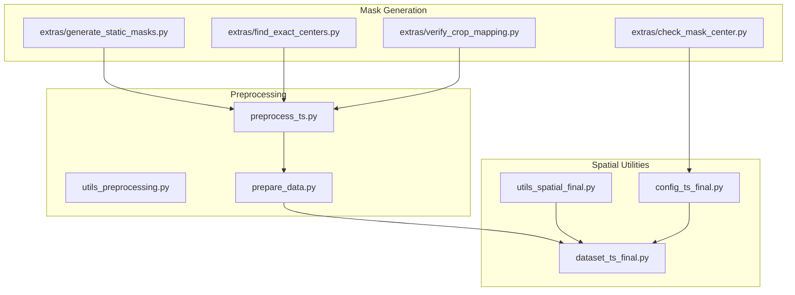
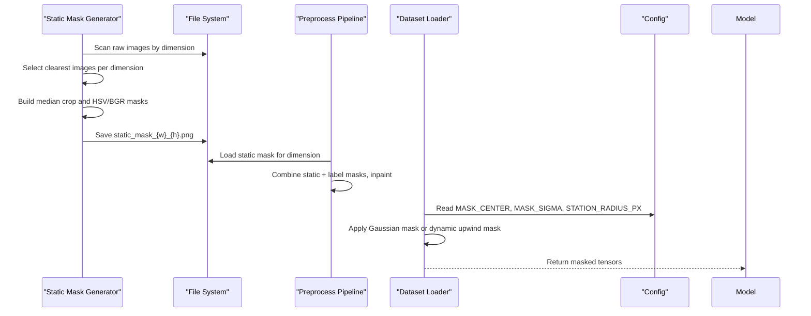
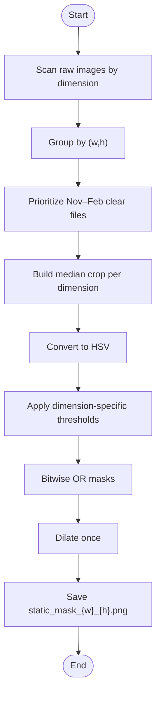
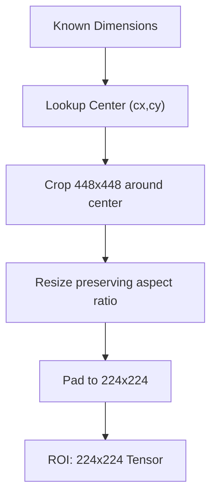
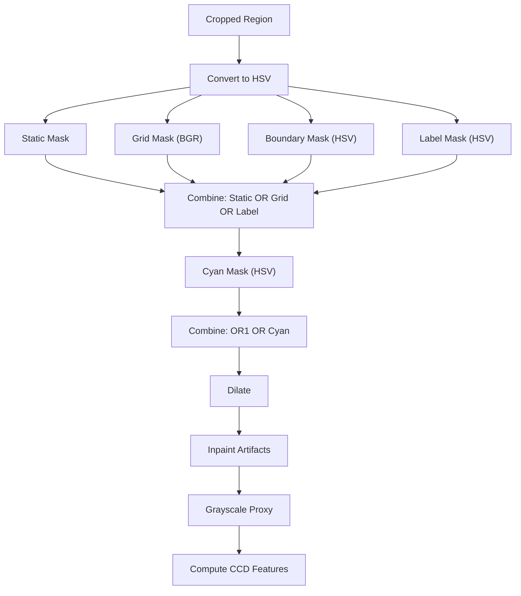
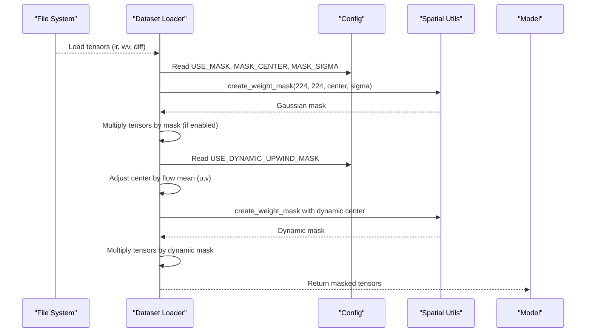
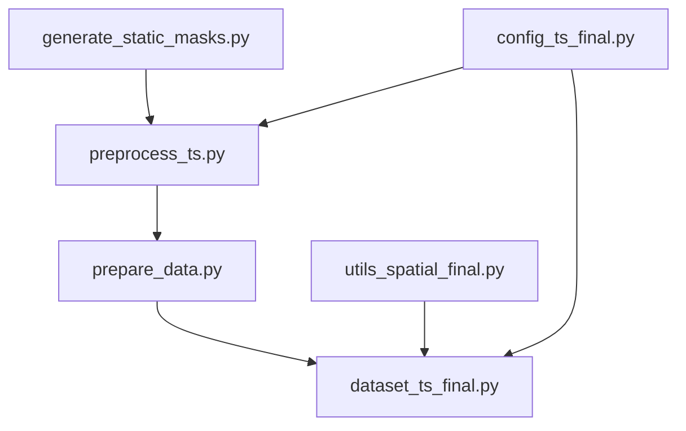

# Static Mask Generation

<cite>
**Referenced Files in This Document**
- [generate_static_masks.py](file://extras/generate_static_masks.py)
- [preprocess_ts.py](file://preprocess_ts.py)
- [utils_spatial_final.py](file://utils_spatial_final.py)
- [utils_preprocessing.py](file://utils_preprocessing.py)
- [dataset_ts_final.py](file://dataset_ts_final.py)
- [config_ts_final.py](file://config_ts_final.py)
- [prepare_data.py](file://prepare_data.py)
- [find_exact_centers.py](file://extras/find_exact_centers.py)
- [verify_crop_mapping.py](file://extras/verify_crop_mapping.py)
- [check_mask_center.py](file://extras/check_mask_center.py)
</cite>

## Table of Contents
1. [Introduction](#introduction)
2. [Project Structure](#project-structure)
3. [Core Components](#core-components)
4. [Architecture Overview](#architecture-overview)
5. [Detailed Component Analysis](#detailed-component-analysis)
6. [Dependency Analysis](#dependency-analysis)
7. [Performance Considerations](#performance-considerations)
8. [Troubleshooting Guide](#troubleshooting-guide)
9. [Conclusion](#conclusion)
10. [Appendices](#appendices)

## Introduction
This document explains the static mask generation tools used for region of interest (ROI) extraction and spatial filtering in the satellite imagery processing pipeline. It covers:
- Static mask generation algorithms and ROI definition strategies
- Spatial filtering techniques for overlay removal and artifact suppression
- Integration with model input preprocessing and downstream datasets
- Practical examples for different geographic regions
- Quality assurance methods, optimization techniques, and validation procedures

## Project Structure
The mask generation and spatial filtering ecosystem spans several modules:
- Static mask generation: creates persistent masks per image dimension
- Preprocessing pipeline: cleans overlays and prepares IR images for modeling
- Spatial utilities: Gaussian weight masks and distance maps for attention and localization
- Dataset integration: applies masks during training/inference to focus model attention
- Configuration: defines mask centers, radii, and toggles for mask usage

**Diagram sources**
- [generate_static_masks.py:1-150](file://extras/generate_static_masks.py#L1-L150)
- [preprocess_ts.py:1-117](file://preprocess_ts.py#L1-L117)
- [utils_spatial_final.py:1-80](file://utils_spatial_final.py#L1-L80)
- [dataset_ts_final.py:1-515](file://dataset_ts_final.py#L1-L515)
- [config_ts_final.py:1-208](file://config_ts_final.py#L1-L208)
- [prepare_data.py:1-132](file://prepare_data.py#L1-L132)
- [find_exact_centers.py:1-65](file://extras/find_exact_centers.py#L1-L65)
- [verify_crop_mapping.py:1-166](file://extras/verify_crop_mapping.py#L1-L166)
- [check_mask_center.py:1-78](file://extras/check_mask_center.py#L1-L78)

**Section sources**
- [generate_static_masks.py:1-150](file://extras/generate_static_masks.py#L1-L150)
- [preprocess_ts.py:1-117](file://preprocess_ts.py#L1-L117)
- [utils_spatial_final.py:1-80](file://utils_spatial_final.py#L1-L80)
- [dataset_ts_final.py:1-515](file://dataset_ts_final.py#L1-L515)
- [config_ts_final.py:1-208](file://config_ts_final.py#L1-L208)
- [prepare_data.py:1-132](file://prepare_data.py#L1-L132)
- [find_exact_centers.py:1-65](file://extras/find_exact_centers.py#L1-L65)
- [verify_crop_mapping.py:1-166](file://extras/verify_crop_mapping.py#L1-L166)
- [check_mask_center.py:1-78](file://extras/check_mask_center.py#L1-L78)

## Core Components
- Static mask generator: builds dimension-specific masks from median crops, thresholds in HSV/BGR, combines masks, dilates, and saves masks for reuse.
- Preprocessing pipeline: crops around known centers, removes overlays using static masks and label masks, inpaints artifacts, computes CCD features, resizes and pads to 224x224.
- Spatial utilities: Gaussian weight mask centered on a geographic station and a distance map highlighting a 10 NM boundary region.
- Dataset integration: loads static masks, applies Gaussian masks or dynamic upwind masks, stacks channels, augments sequences, and returns model-ready tensors.
- Configuration: defines mask center, sigma, station radius, and toggles for mask usage and dynamic upwind masking.

**Section sources**
- [generate_static_masks.py:1-150](file://extras/generate_static_masks.py#L1-L150)
- [preprocess_ts.py:1-117](file://preprocess_ts.py#L1-L117)
- [utils_spatial_final.py:1-80](file://utils_spatial_final.py#L1-L80)
- [dataset_ts_final.py:1-515](file://dataset_ts_final.py#L1-L515)
- [config_ts_final.py:106-120](file://config_ts_final.py#L106-L120)

## Architecture Overview
The static mask generation pipeline integrates with preprocessing and dataset stages to ensure consistent ROI extraction and spatial filtering.

**Diagram sources**
- [generate_static_masks.py:1-150](file://extras/generate_static_masks.py#L1-L150)
- [preprocess_ts.py:17-66](file://preprocess_ts.py#L17-L66)
- [dataset_ts_final.py:80-84](file://dataset_ts_final.py#L80-L84)
- [config_ts_final.py:106-120](file://config_ts_final.py#L106-L120)

## Detailed Component Analysis

### Static Mask Generation Algorithm
The static mask generator:
- Scans raw images and groups by dimension
- Prioritizes Nov–Feb “clear” files for median crop construction
- Computes median crop per dimension and converts to HSV
- Applies dimension-specific thresholds for grid, cyan, and boundary masks
- Combines masks with bitwise OR and dilates once to keep masks tight
- Saves masks to disk for reuse during preprocessing

**Diagram sources**
- [generate_static_masks.py:1-150](file://extras/generate_static_masks.py#L1-L150)

**Section sources**
- [generate_static_masks.py:1-150](file://extras/generate_static_masks.py#L1-L150)

### ROI Definition Strategies
- Known dimension-to-center mapping ensures consistent cropping across images.
- Cropping uses fixed 448x448 ROI around the center; subsequent resizing and padding produce 224x224 tensors.
- Verification utilities map raw coordinates to processed coordinates to validate center alignment.

**Diagram sources**
- [verify_crop_mapping.py:18-49](file://extras/verify_crop_mapping.py#L18-L49)
- [preprocess_ts.py:43-46](file://preprocess_ts.py#L43-L46)

**Section sources**
- [verify_crop_mapping.py:1-166](file://extras/verify_crop_mapping.py#L1-L166)
- [preprocess_ts.py:1-117](file://preprocess_ts.py#L1-L117)

### Spatial Filtering Techniques
- Overlay removal: combine static mask, grid mask, boundary mask, and label mask; dilate to connect regions; inpaint artifacts.
- CCD feature extraction: compute proportions of cold pixels and connected components on cleaned grayscale proxy.
- Distance map: highlight a 10 NM boundary region around the station center for spatial emphasis.

**Diagram sources**
- [preprocess_ts.py:50-98](file://preprocess_ts.py#L50-L98)
- [utils_spatial_final.py:36-65](file://utils_spatial_final.py#L36-L65)

**Section sources**
- [preprocess_ts.py:1-117](file://preprocess_ts.py#L1-L117)
- [utils_spatial_final.py:1-80](file://utils_spatial_final.py#L1-L80)

### Relationship Between Generated Masks and Model Input Preprocessing
- Static masks are loaded per dimension and combined with label masks to remove overlays before inpainting.
- During dataset loading, masks can be applied to IR/WV/IR–WV difference tensors to focus model attention on the station region.
- Dynamic upwind mask adjusts the Gaussian center based on recent optical flow mean motion to track evolving storm motion.

**Diagram sources**
- [dataset_ts_final.py:287-303](file://dataset_ts_final.py#L287-L303)
- [dataset_ts_final.py:497-512](file://dataset_ts_final.py#L497-L512)
- [utils_spatial_final.py:12-34](file://utils_spatial_final.py#L12-L34)
- [config_ts_final.py:106-120](file://config_ts_final.py#L106-L120)

**Section sources**
- [dataset_ts_final.py:287-303](file://dataset_ts_final.py#L287-L303)
- [dataset_ts_final.py:497-512](file://dataset_ts_final.py#L497-L512)
- [utils_spatial_final.py:1-80](file://utils_spatial_final.py#L1-L80)
- [config_ts_final.py:106-120](file://config_ts_final.py#L106-L120)

### Practical Examples of Mask Creation for Different Geographic Regions
- Static masks are generated per dimension; ensure masks are saved under the expected naming convention for each (w, h).
- For new regions/dimensions, run the static mask generator and verify crop mapping to confirm center alignment.
- Use interactive tools to refine mask center and validate coordinate mapping between raw and processed images.

**Section sources**
- [generate_static_masks.py:145-147](file://extras/generate_static_masks.py#L145-L147)
- [verify_crop_mapping.py:116-121](file://extras/verify_crop_mapping.py#L116-L121)
- [check_mask_center.py:55-65](file://extras/check_mask_center.py#L55-L65)

### Integration with Satellite Imagery Processing Pipelines
- Preprocessing pipeline reads static masks for each dimension and combines them with label masks to clean overlays.
- The prepared HDF5 dataset stores IR, WV, derived channels, and optical flow tensors; masks are applied during dataset loading.
- The pipeline computes texture maps and optical flow differences, enabling multi-channel spatiotemporal modeling.

**Section sources**
- [preprocess_ts.py:17-66](file://preprocess_ts.py#L17-L66)
- [prepare_data.py:103-117](file://prepare_data.py#L103-L117)
- [dataset_ts_final.py:268-303](file://dataset_ts_final.py#L268-L303)

### Quality Assurance Methods
- Center alignment verification: map raw coordinates to processed coordinates and validate center placement.
- Exact center search: compare crops across dimensions using MSE to refine center estimates.
- Interactive center selection: click on images to obtain processed coordinates and update configuration.

**Section sources**
- [verify_crop_mapping.py:116-121](file://extras/verify_crop_mapping.py#L116-L121)
- [find_exact_centers.py:42-61](file://extras/find_exact_centers.py#L42-L61)
- [check_mask_center.py:55-65](file://extras/check_mask_center.py#L55-L65)

## Dependency Analysis
Key dependencies and relationships:
- Static mask generator depends on OpenCV and NumPy; writes masks to disk for downstream use.
- Preprocessing pipeline depends on static masks and OpenCV for overlay removal and inpainting.
- Dataset loader depends on spatial utilities and configuration to apply masks during training/inference.
- Configuration defines mask parameters and toggles for mask usage.

**Diagram sources**
- [generate_static_masks.py:1-150](file://extras/generate_static_masks.py#L1-L150)
- [preprocess_ts.py:1-117](file://preprocess_ts.py#L1-L117)
- [prepare_data.py:1-132](file://prepare_data.py#L1-L132)
- [dataset_ts_final.py:1-515](file://dataset_ts_final.py#L1-L515)
- [utils_spatial_final.py:1-80](file://utils_spatial_final.py#L1-L80)
- [config_ts_final.py:1-208](file://config_ts_final.py#L1-L208)

**Section sources**
- [generate_static_masks.py:1-150](file://extras/generate_static_masks.py#L1-L150)
- [preprocess_ts.py:1-117](file://preprocess_ts.py#L1-L117)
- [prepare_data.py:1-132](file://prepare_data.py#L1-L132)
- [dataset_ts_final.py:1-515](file://dataset_ts_final.py#L1-L515)
- [utils_spatial_final.py:1-80](file://utils_spatial_final.py#L1-L80)
- [config_ts_final.py:1-208](file://config_ts_final.py#L1-L208)

## Performance Considerations
- Static mask generation: limit image pool per dimension and prioritize clear season files to reduce computation.
- Mask application: multiply tensors by masks is lightweight; prefer caching masks per dimension to avoid repeated I/O.
- Dynamic upwind mask: compute mean flow components and adjust center once per sequence to minimize overhead.
- Preprocessing: inpainting and thresholding are fast; ensure masks are precomputed and reused.

[No sources needed since this section provides general guidance]

## Troubleshooting Guide
Common issues and resolutions:
- Unknown dimensions: ensure CENTER_MAP includes the (w, h) of the image; otherwise, preprocessing skips the file.
- Misaligned center: use verification utilities to map raw coordinates to processed coordinates and update MASK_CENTER accordingly.
- Poor overlay removal: adjust HSV thresholds for grid/cyan/boundary masks per dimension; regenerate static masks if needed.
- Mask not applied: verify configuration toggles for mask usage and ensure masks are saved under the expected naming convention.

**Section sources**
- [preprocess_ts.py:37-41](file://preprocess_ts.py#L37-L41)
- [verify_crop_mapping.py:116-121](file://extras/verify_crop_mapping.py#L116-L121)
- [generate_static_masks.py:122-131](file://extras/generate_static_masks.py#L122-L131)
- [config_ts_final.py:111-114](file://config_ts_final.py#L111-L114)

## Conclusion
Static mask generation provides robust ROI extraction and spatial filtering for satellite imagery. By combining dimension-specific masks with preprocessing cleanup and configurable spatial attention, the pipeline improves model focus on the station region and reduces artifacts. Proper QA and dynamic masking further enhance accuracy and adaptability to evolving storm motion.

[No sources needed since this section summarizes without analyzing specific files]

## Appendices

### Appendix A: Spatial Mask Functions
- Gaussian weight mask: centered on a geographic station with configurable sigma.
- Distance map: highlights a 10 NM boundary region around the station center.

**Section sources**
- [utils_spatial_final.py:12-65](file://utils_spatial_final.py#L12-L65)

### Appendix B: Preprocessing Steps Summary
- Crop around known center, remove overlays using static and label masks, inpaint artifacts, compute CCD features, resize and pad to 224x224.

**Section sources**
- [preprocess_ts.py:27-112](file://preprocess_ts.py#L27-L112)

### Appendix C: Dataset Mask Application
- Load static masks per dimension, apply Gaussian or dynamic upwind masks, stack channels, and return model-ready tensors.

**Section sources**
- [dataset_ts_final.py:287-303](file://dataset_ts_final.py#L287-L303)
- [dataset_ts_final.py:497-512](file://dataset_ts_final.py#L497-L512)