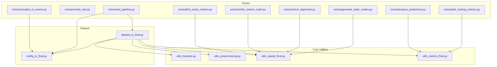
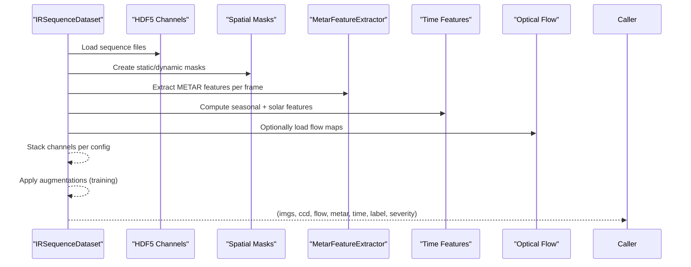
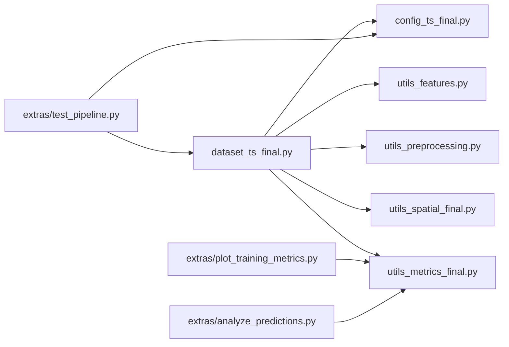

# Utilities & Development Tools

<cite>
**Referenced Files in This Document**
- [utils_features.py](file://utils_features.py)
- [utils_preprocessing.py](file://utils_preprocessing.py)
- [utils_spatial_final.py](file://utils_spatial_final.py)
- [utils_metrics_final.py](file://utils_metrics_final.py)
- [config_ts_final.py](file://config_ts_final.py)
- [dataset_ts_final.py](file://dataset_ts_final.py)
- [extras/analyze_predictions.py](file://extras/analyze_predictions.py)
- [extras/smoke_test.py](file://extras/smoke_test.py)
- [extras/test_pipeline.py](file://extras/test_pipeline.py)
- [extras/plot_training_metrics.py](file://extras/plot_training_metrics.py)
- [extras/generate_static_masks.py](file://extras/generate_static_masks.py)
- [extras/check_alignment.py](file://extras/check_alignment.py)
- [extras/verify_centers_math.py](file://extras/verify_centers_math.py)
- [extras/find_exact_centers.py](file://extras/find_exact_centers.py)
- [extras/visualize_ts_events.py](file://extras/visualize_ts_events.py)
</cite>

## Table of Contents
1. [Introduction](#introduction)
2. [Project Structure](#project-structure)
3. [Core Components](#core-components)
4. [Architecture Overview](#architecture-overview)
5. [Detailed Component Analysis](#detailed-component-analysis)
6. [Dependency Analysis](#dependency-analysis)
7. [Performance Considerations](#performance-considerations)
8. [Troubleshooting Guide](#troubleshooting-guide)
9. [Conclusion](#conclusion)
10. [Appendices](#appendices)

## Introduction
This document describes the utilities and development tools that support feature engineering, preprocessing, spatial analysis, analysis utilities, and development workflows for the Nagpur Thunderstorm Nowcasting system. It covers:
- Feature engineering utilities for meteorological and temporal features
- Preprocessing utilities for IR imagery enhancement and normalization
- Spatial analysis tools for mask generation and ROI extraction
- Analysis utilities for prediction auditing, training metrics visualization, and performance benchmarking
- Development tools for smoke testing, pipeline validation, and debugging workflows
- Extension points and guidelines for building custom utilities

## Project Structure
The repository organizes utilities and tools into focused modules and scripts:
- Core utilities: feature extraction, preprocessing, spatial masks, metrics
- Dataset integration: dataset builder and channel stacking logic
- Extras: analysis scripts, training dashboard, mask generation, alignment checks, and visualization helpers
- Configuration: central configuration for model, data paths, and runtime behavior

**Diagram sources**
- [dataset_ts_final.py](file://dataset_ts_final.py)
- [config_ts_final.py](file://config_ts_final.py)
- [utils_features.py](file://utils_features.py)
- [utils_preprocessing.py](file://utils_preprocessing.py)
- [utils_spatial_final.py](file://utils_spatial_final.py)
- [utils_metrics_final.py](file://utils_metrics_final.py)
- [extras/test_pipeline.py](file://extras/test_pipeline.py)
- [extras/plot_training_metrics.py](file://extras/plot_training_metrics.py)
- [extras/analyze_predictions.py](file://extras/analyze_predictions.py)
- [extras/generate_static_masks.py](file://extras/generate_static_masks.py)
- [extras/check_alignment.py](file://extras/check_alignment.py)
- [extras/verify_centers_math.py](file://extras/verify_centers_math.py)
- [extras/find_exact_centers.py](file://extras/find_exact_centers.py)
- [extras/visualize_ts_events.py](file://extras/visualize_ts_events.py)

**Section sources**
- [config_ts_final.py](file://config_ts_final.py)
- [dataset_ts_final.py](file://dataset_ts_final.py)

## Core Components
- Feature Engineering Utilities
  - Meteorological feature extractor for METAR-aligned features and composite risk index
  - Solar zenith angle computation for diurnal modeling
- Preprocessing Utilities
  - Contrast enhancement (CLAHE), cloud texture enhancement (unsharp masking), and normalization with outlier clipping
  - Complete IR image transform pipeline with optional noise augmentation
  - Lightweight optical flow computation
- Spatial Analysis Utilities
  - Gaussian weight mask centered on Nagpur
  - Distance map to station boundary
  - Visualization helper for mask overlays
- Metrics and Post-processing Utilities
  - Temporal smoothing (EMA/rolling mean), persistence filtering, Schmitt trigger hysteresis
  - Event-level metrics (overlap-based), lead time analysis, weighted event metrics
  - Bootstrapped confidence intervals for robust evaluation
- Dataset Integration
  - Dynamic channel stacking, CCD standardization, METAR feature extraction, time features, augmentation, and dynamic upwind mask

**Section sources**
- [utils_features.py](file://utils_features.py)
- [utils_preprocessing.py](file://utils_preprocessing.py)
- [utils_spatial_final.py](file://utils_spatial_final.py)
- [utils_metrics_final.py](file://utils_metrics_final.py)
- [dataset_ts_final.py](file://dataset_ts_final.py)

## Architecture Overview
The system integrates preprocessing, feature engineering, spatial weighting, and evaluation into a cohesive pipeline. The dataset module orchestrates:
- Loading precomputed HDF5 channels
- Building sequences with labels and severity
- Extracting METAR features aligned to timestamps
- Computing time features (seasonal and solar zenith)
- Applying augmentations during training
- Generating dynamic masks based on optical flow

**Diagram sources**
- [dataset_ts_final.py](file://dataset_ts_final.py)
- [utils_spatial_final.py](file://utils_spatial_final.py)
- [utils_features.py](file://utils_features.py)

## Detailed Component Analysis

### Feature Engineering Utilities
- MetarFeatureExtractor
  - Aligns METAR records to image timestamps and computes:
    - Wind speed/direction, dewpoint, temperature, pressure
    - Pressure drop over configured windows
    - Wind speed change and dewpoint trend over 3 hours
    - Rolling wind variance
    - Composite risk index derived from simple heuristics
  - Provides default features when data is missing
- Solar zenith angle
  - Computes cosine-of-zenith using day-of-year, latitude, longitude, and local apparent solar time

Usage examples
- Extract features for a given timestamp
  - [utils_features.py](file://utils_features.py)
- Compute solar zenith angle for a UTC timestamp and location
  - [utils_features.py](file://utils_features.py)

**Section sources**
- [utils_features.py](file://utils_features.py)

### Preprocessing Utilities
- Contrast enhancement (CLAHE)
  - Applies adaptive histogram equalization to IR imagery
- Cloud texture enhancement (unsharp masking)
  - Sharpens cloud boundaries using Gaussian blur and weighted combination
- Normalization with outlier clipping
  - Clips to percentile range and normalizes to [0, 1]
- Image transform pipeline
  - Converts to grayscale, resizes, enhances, normalizes, standardizes, and adds noise during training
- Optical flow computation (lightweight)
  - Dense optical flow using Farneback returning displacement magnitude

Usage examples
- Enhance contrast and texture, normalize, and convert to tensor
  - [utils_preprocessing.py](file://utils_preprocessing.py)
- Compute optical flow between two frames
  - [utils_preprocessing.py](file://utils_preprocessing.py)

**Section sources**
- [utils_preprocessing.py](file://utils_preprocessing.py)

### Spatial Analysis Utilities
- Gaussian weight mask
  - Generates normalized 2D Gaussian centered at a pixel location with configurable spread
- Distance map to station boundary
  - Creates a normalized map highlighting proximity to a 10 NM boundary
- Visualization helper
  - Overlays mask on an IR image for inspection

Usage examples
- Create a Gaussian weight mask for spatial attention
  - [utils_spatial_final.py](file://utils_spatial_final.py)
- Create a distance map for station boundary
  - [utils_spatial_final.py](file://utils_spatial_final.py)
- Visualize mask overlay
  - [utils_spatial_final.py](file://utils_spatial_final.py)

**Section sources**
- [utils_spatial_final.py](file://utils_spatial_final.py)

### Metrics and Post-processing Utilities
- Temporal smoothing
  - Exponential moving average or rolling mean for probability sequences
- Persistence filtering
  - Removes short-lived false alarms; optionally preserves runs exceeding a severe probability threshold
- Schmitt trigger hysteresis
  - Enables/disables event onset/offset using high/low thresholds; supports rapid cooling bypass
- Event-level metrics
  - Overlap-based POD/FAR/CSI with lead-time constraints
- Weighted event metrics
  - Severity-weighted scores with lead-time bonuses
- Bootstrapped confidence intervals
  - Temporal block bootstrapping by calendar day for robust evaluation

Usage examples
- Smooth probabilities and remove short false alarms
  - [utils_metrics_final.py](file://utils_metrics_final.py)
- Optimize threshold using weighted event metrics
  - [utils_metrics_final.py](file://utils_metrics_final.py)
- Compute lead times and summarize statistics
  - [utils_metrics_final.py](file://utils_metrics_final.py)
- Bootstrap confidence intervals for frame/event metrics
  - [utils_metrics_final.py](file://utils_metrics_final.py)

**Section sources**
- [utils_metrics_final.py](file://utils_metrics_final.py)

### Dataset Integration
- Dynamic channel stacking
  - Selects channels per configuration and concatenates along channel dimension
- CCD standardization
  - Z-score normalization using dataset-wide statistics
- METAR feature extraction
  - Per-frame normalized features aligned to sequence timestamps
- Time features
  - Seasonal sine/cosine and normalized solar zenith angle
- Augmentations (training)
  - Horizontal flip, temporal masking, channel dropout, Gaussian noise
- Dynamic upwind mask
  - Adjusts mask center based on mean optical flow to bias attention upwind

Usage examples
- Build dataset with stacked channels and features
  - [dataset_ts_final.py](file://dataset_ts_final.py)
- Access severity labels and intensity scores
  - [dataset_ts_final.py](file://dataset_ts_final.py)

**Section sources**
- [dataset_ts_final.py](file://dataset_ts_final.py)

### Analysis Utilities
- Prediction analysis
  - Loads validation prediction CSVs, prints shape/columns, label/probability distributions, and quick calibration checks
  - [extras/analyze_predictions.py](file://extras/analyze_predictions.py)
- Training metrics visualization
  - Parses training logs (JSON history or text) and produces an 8-panel dashboard (losses, learning rate, frame/event metrics, severity rates, weighted event metrics, lead times, aviation safety)
  - [extras/plot_training_metrics.py](file://extras/plot_training_metrics.py)
- TS event visualization
  - Classifies and plots TS events by severity across 15-day intervals with timelines and aggregated counts
  - [extras/visualize_ts_events.py](file://extras/visualize_ts_events.py)

Usage examples
- Audit predictions across runs
  - [extras/analyze_predictions.py](file://extras/analyze_predictions.py)
- Visualize training progress and metrics
  - [extras/plot_training_metrics.py](file://extras/plot_training_metrics.py)
- Visualize TS events by severity
  - [extras/visualize_ts_events.py](file://extras/visualize_ts_events.py)

**Section sources**
- [extras/analyze_predictions.py](file://extras/analyze_predictions.py)
- [extras/plot_training_metrics.py](file://extras/plot_training_metrics.py)
- [extras/visualize_ts_events.py](file://extras/visualize_ts_events.py)

### Development Tools
- Smoke test
  - Builds the model and runs a forward pass with synthetic multi-modal inputs to validate integration
  - [extras/smoke_test.py](file://extras/smoke_test.py)
- Pipeline validation
  - Tests METAR parsing, dataset initialization, and feature sanity checks
  - [extras/test_pipeline.py](file://extras/test_pipeline.py)

Usage examples
- Verify model build and forward pass
  - [extras/smoke_test.py](file://extras/smoke_test.py)
- Validate end-to-end pipeline
  - [extras/test_pipeline.py](file://extras/test_pipeline.py)

**Section sources**
- [extras/smoke_test.py](file://extras/smoke_test.py)
- [extras/test_pipeline.py](file://extras/test_pipeline.py)

### Spatial Tools for Mask Generation and ROI Extraction
- Static mask generation
  - Scans IR images, selects clearest samples per dimension, computes median crop, and generates masks via HSV thresholds and morphological operations
  - [extras/generate_static_masks.py](file://extras/generate_static_masks.py)
- Alignment checks
  - Compares crops around a fixed center across dimensions to assess alignment
  - [extras/check_alignment.py](file://extras/check_alignment.py)
- Center verification
  - Computes MSE between reference and candidate centers to refine alignment
  - [extras/verify_centers_math.py](file://extras/verify_centers_math.py)
- Exact center search
  - Brute-force search around a reference center to minimize MSE across crops
  - [extras/find_exact_centers.py](file://extras/find_exact_centers.py)

Usage examples
- Generate static masks per image dimension
  - [extras/generate_static_masks.py](file://extras/generate_static_masks.py)
- Inspect alignment across dimensions
  - [extras/check_alignment.py](file://extras/check_alignment.py)
- Verify center math and refine centers
  - [extras/verify_centers_math.py](file://extras/verify_centers_math.py)
- Find exact centers across dimensions
  - [extras/find_exact_centers.py](file://extras/find_exact_centers.py)

**Section sources**
- [extras/generate_static_masks.py](file://extras/generate_static_masks.py)
- [extras/check_alignment.py](file://extras/check_alignment.py)
- [extras/verify_centers_math.py](file://extras/verify_centers_math.py)
- [extras/find_exact_centers.py](file://extras/find_exact_centers.py)

## Dependency Analysis
The dataset module depends on core utilities and configuration to assemble inputs. Extras depend on datasets and configuration for validation and visualization.

**Diagram sources**
- [config_ts_final.py](file://config_ts_final.py)
- [dataset_ts_final.py](file://dataset_ts_final.py)
- [utils_features.py](file://utils_features.py)
- [utils_preprocessing.py](file://utils_preprocessing.py)
- [utils_spatial_final.py](file://utils_spatial_final.py)
- [utils_metrics_final.py](file://utils_metrics_final.py)
- [extras/test_pipeline.py](file://extras/test_pipeline.py)
- [extras/plot_training_metrics.py](file://extras/plot_training_metrics.py)
- [extras/analyze_predictions.py](file://extras/analyze_predictions.py)

**Section sources**
- [dataset_ts_final.py](file://dataset_ts_final.py)
- [config_ts_final.py](file://config_ts_final.py)

## Performance Considerations
- Preprocessing
  - CLAHE and unsharp masking are efficient for 224×224 tensors; consider GPU acceleration for batched operations.
  - Outlier clipping reduces extreme values and stabilizes training.
- Spatial masks
  - Gaussian masks are computed once per dataset initialization; dynamic masks adjust per sequence based on flow.
- Metrics
  - Bootstrapping is computationally intensive; reduce n_bootstraps or use stratified sampling for faster estimates.
- Dataset I/O
  - HDF5 caching minimizes disk reads; tune cache size for memory constraints.
- Training visualization
  - Parsing logs and plotting dashboards are I/O bound; batch process multiple logs for throughput.

[No sources needed since this section provides general guidance]

## Troubleshooting Guide
Common issues and resolutions
- Empty or missing METAR DataFrame
  - Ensure METAR file exists and contains required columns; the extractor interpolates missing values and falls back to defaults.
  - [utils_features.py](file://utils_features.py)
- Incorrect channel stacking
  - Verify configuration USE_CHANNELS and that selected channels exist in HDF5; fallback stacks all channels if unspecified.
  - [dataset_ts_final.py](file://dataset_ts_final.py)
- Missing optical flow
  - Confirm USE_OPTICAL_FLOW flag and that flow keys exist in HDF5; fallback returns zero tensors.
  - [dataset_ts_final.py](file://dataset_ts_final.py)
- Poor mask alignment across dimensions
  - Use alignment checks and center verification scripts to compare crops and refine centers.
  - [extras/check_alignment.py](file://extras/check_alignment.py)
  - [extras/verify_centers_math.py](file://extras/verify_centers_math.py)
  - [extras/find_exact_centers.py](file://extras/find_exact_centers.py)
- Static mask generation failures
  - Ensure sufficient clear-season images per dimension; adjust HSV thresholds for sensitive dimensions.
  - [extras/generate_static_masks.py](file://extras/generate_static_masks.py)
- Training dashboard parsing errors
  - Prefer JSON history files for reliability; fallback regex parsing handles legacy formats.
  - [extras/plot_training_metrics.py](file://extras/plot_training_metrics.py)
- Smoke test failures
  - Confirm model input shapes and that synthetic inputs match expected dimensions.
  - [extras/smoke_test.py](file://extras/smoke_test.py)

**Section sources**
- [utils_features.py](file://utils_features.py)
- [dataset_ts_final.py](file://dataset_ts_final.py)
- [extras/check_alignment.py](file://extras/check_alignment.py)
- [extras/verify_centers_math.py](file://extras/verify_centers_math.py)
- [extras/find_exact_centers.py](file://extras/find_exact_centers.py)
- [extras/generate_static_masks.py](file://extras/generate_static_masks.py)
- [extras/plot_training_metrics.py](file://extras/plot_training_metrics.py)
- [extras/smoke_test.py](file://extras/smoke_test.py)

## Conclusion
The utilities and development tools provide a comprehensive toolkit for feature engineering, preprocessing, spatial analysis, evaluation, and pipeline validation. They enable robust experimentation, reliable training workflows, and actionable insights through visualization and benchmarking.

[No sources needed since this section summarizes without analyzing specific files]

## Appendices

### Utility Reference Index
- Feature Engineering
  - [utils_features.py](file://utils_features.py)
- Preprocessing
  - [utils_preprocessing.py](file://utils_preprocessing.py)
- Spatial Analysis
  - [utils_spatial_final.py](file://utils_spatial_final.py)
- Metrics and Post-processing
  - [utils_metrics_final.py](file://utils_metrics_final.py)
- Dataset Integration
  - [dataset_ts_final.py](file://dataset_ts_final.py)
- Configuration
  - [config_ts_final.py](file://config_ts_final.py)

### Tool Integration Patterns
- Extend channel stacking
  - Add new channels to HDF5 and configure USE_CHANNELS; ensure normalization and augmentation compatibility.
  - [dataset_ts_final.py](file://dataset_ts_final.py)
- Integrate new spatial masks
  - Implement mask creation and apply during dataset item retrieval; consider dynamic adjustments based on flow.
  - [utils_spatial_final.py](file://utils_spatial_final.py)
  - [dataset_ts_final.py](file://dataset_ts_final.py)
- Add new metrics
  - Implement metric computation and integrate into evaluation pipelines; consider bootstrapping for robustness.
  - [utils_metrics_final.py](file://utils_metrics_final.py)

### Extension Points and Guidelines
- Custom feature extraction
  - Derive from MetarFeatureExtractor or add new extractors; align timestamps and normalize outputs.
  - [utils_features.py](file://utils_features.py)
- Custom preprocessing
  - Wrap OpenCV/PIL operations into reusable functions; maintain dtype and range consistency.
  - [utils_preprocessing.py](file://utils_preprocessing.py)
- Custom spatial masks
  - Provide mask generation functions and apply in dataset or model forward pass.
  - [utils_spatial_final.py](file://utils_spatial_final.py)
- Custom evaluation
  - Add metric functions and integrate into analysis scripts; support both frame-level and event-level scoring.
  - [utils_metrics_final.py](file://utils_metrics_final.py)